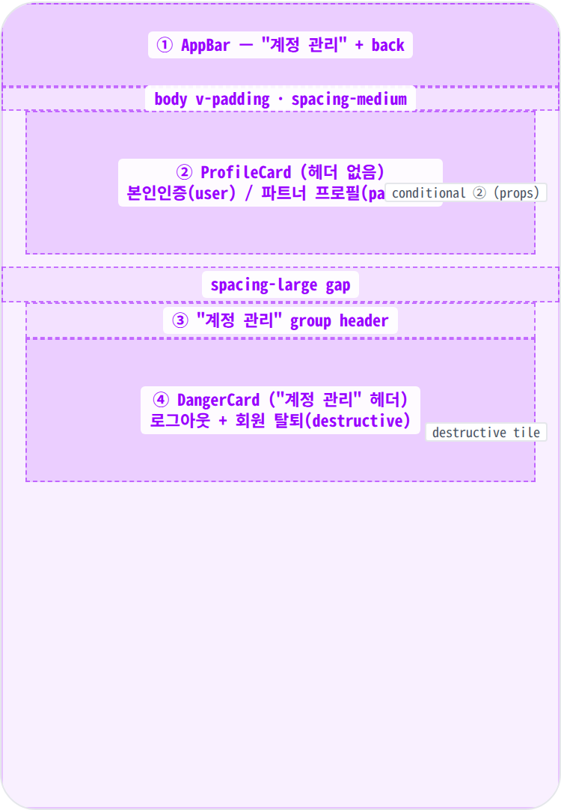
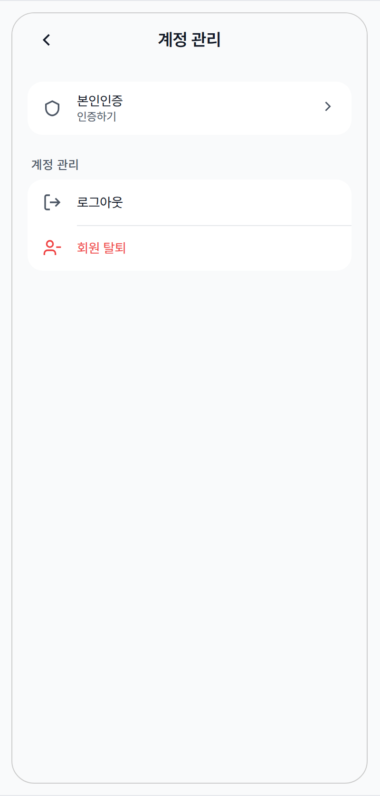
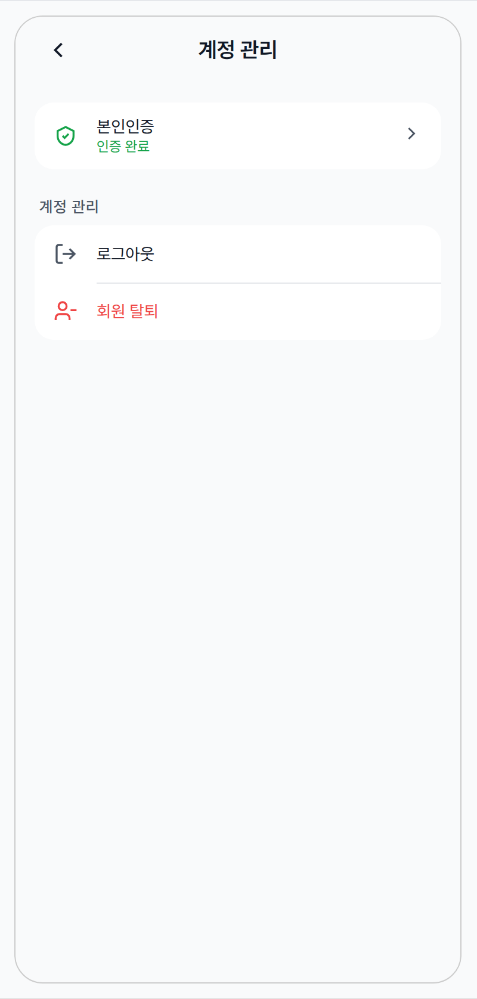
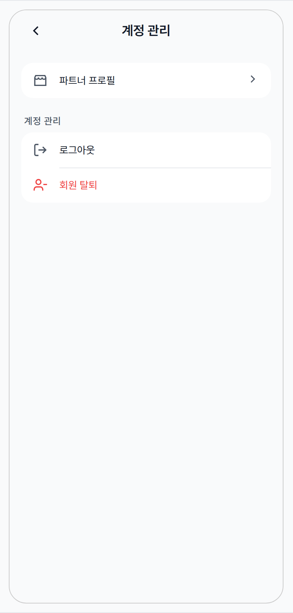
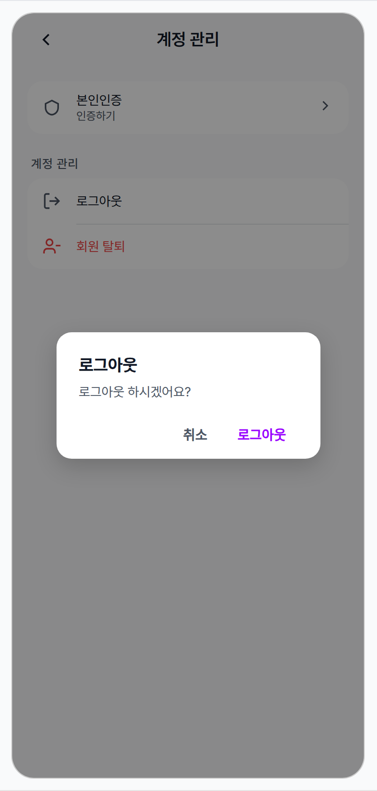
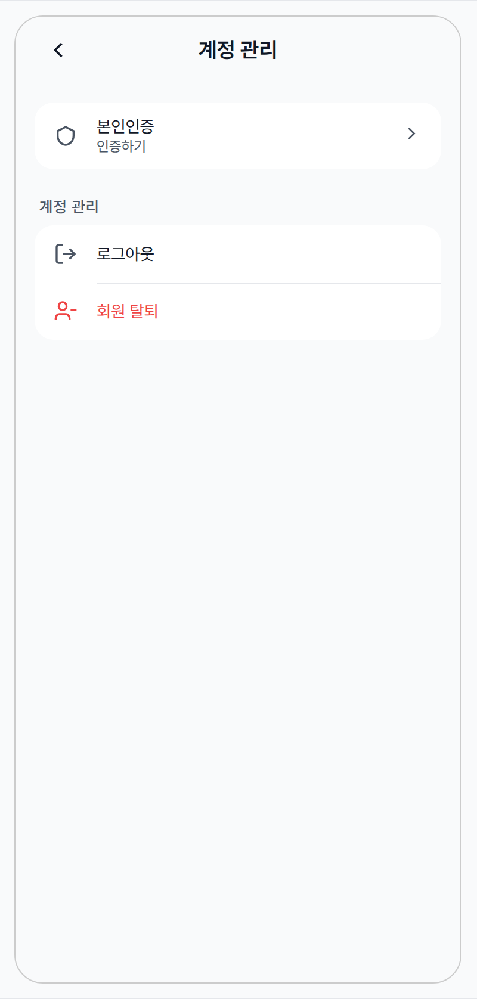
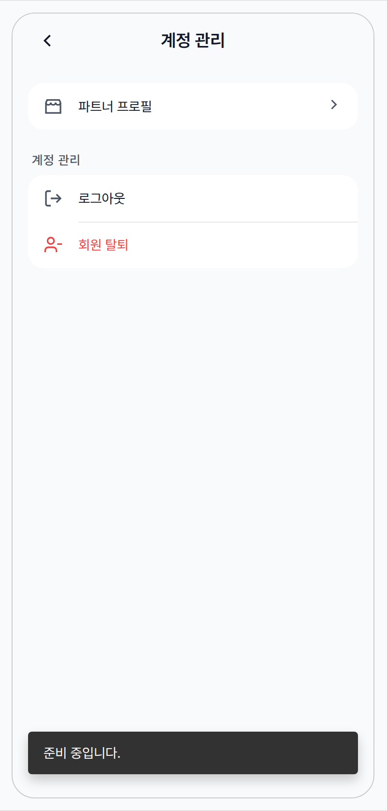

 Spec — AccountManagementPage (kit-shared · AccountManagementRoute / PartnerAccountManagementRoute)  

# Account Management Page

## Overview

| Status | 디자인완료 — 6 state · kit-shared (user + partner) |
|---|---|
| App | app_user + app_partner — kit-shared. 동일 위젯이지만 분기 props가 있다: onPartnerProfile(partner 전용) · onCertification + isVerified(user 전용). null이면 해당 타일이 숨겨진다. |
| Category | settings · auth · destructive · sub-page |
| Route / Surface | user — AccountManagementRoutepartner — PartnerAccountManagementRoutewidget: AccountManagementPage (shared/packages/minglit_kit) |
| Path | user — /my/account · partner — /more/account |
| Hierarchy | Parent: user — MyPage "계정 관리" 타일 · partner — MorePage "계정 관리" 타일Children: 로그아웃 confirm은 MinglitAlert(in-place dialog) · 회원 탈퇴는 외부 coordinator (accountDeletionCoordinator · partner는 moreCoordinator.pushAccountDeletion)로 넘긴다 · 본인인증은 CertificationRoute push (별도 spec). |
| Purpose | 신원/계정에 귀속된 액션(본인인증 · 파트너 프로필 · 로그아웃 · 회원 탈퇴)을 한 곳에 모아놓은 서브-설정 페이지. Fix #1213로 MyPage / MorePage에서 흩어져 있던 destructive 액션을 통합. |
| User journey | Entry points: MyPage(user) / MorePage(partner)에서 "계정 관리" 타일 탭.Exit points: ① 로그아웃 confirm → GoRouter.of(context).go('/') (LoginRoute) · 직후 signOut · ② 회원 탈퇴 → 외부 coordinator(별도 wizard) · ③ 본인인증 → CertificationRoute push · ④ 파트너 프로필(partner) → 현재 SnackBar "준비 중입니다." (Phase 2 빌드 예정) · ⑤ 뒤로 가기 → 부모 페이지 복귀. |
| Background | 신원(identity)과 자격(qualification)을 2-layer로 분리하는 trust 모델 상, 본인인증은 "계정에 귀속된 신원 속성"이라 이 페이지로 모았다 (Fix #1861). 로그아웃은 즉시 실행 시 사고가 잦아 confirm dialog로 한 단계 분리(Fix #1378). 탈퇴는 기존 wizard를 그대로 재사용(개인정보 삭제 정책 컴플라이언스). |
| Frequency | 매우 낮음 — 계정 정리/이탈 시점에 단발적 진입. 본인인증 1회 · 탈퇴 1회 · 로그아웃 세션당 0~1회. |

## History

이 spec의 주요 변경 이력. 최신 항목 위.

| Date | Version | Author | Changes |
|---|---|---|---|
| 2026-05-03 | 1.1 | mark-yun | MyPage와 동일한 그룹 카드 + 컴팩트 tile 패턴으로 visual contract 통일. ListTile default + border-wrapped Danger Zone 폐기 → 둘 다 MinglitSettingsGroup 카드 안의 MinglitSettingsTile(48px · subtitle 있을 시 56+ 자동 늘어남 · 20px icon · 14px title)로 일원화. 그룹 구조: 헤더 없는 프로필 카드(본인인증 / 파트너 프로필) + "계정 관리" 헤더 카드(로그아웃 / 회원 탈퇴 destructive) — 신원/프로필 항목은 페이지 타이틀과 의미가 겹쳐 헤더 생략, destructive 그룹은 "계정 관리" 라벨로 의도 명시. 진입은 MyPage 상단 프로필 영역 탭으로만 — MyPage AccountGroup 폐기와 짝. |
| 2026-05-01 | 1.0 | mark-yun | v1.4 template으로 작성. kit-shared 1 위젯 · 2 앱 분기 props(onPartnerProfile / onCertification) 분해. 6 state mini-table — User default(unverified) baseline, User verified, Partner default, Logout confirm, Logout running, Partner snackbar(준비 중). Fix #1213(통합) · #1378(로그아웃 confirm) · #1861(본인인증 진입) 기록 반영. |

[🧱 Layout](#layout) [🎨 States](#states) [🔄 Global Behavior](#behavior) [📖 Reference](#reference)

🧱

## Layout

AppBar(title + back) + scroll body의 2 SettingsGroup — 헤더 없는 프로필 카드(본인인증 / 파트너 프로필) + "계정 관리" 헤더 카드(로그아웃 / 회원 탈퇴 destructive). MyPage와 동일한 그룹 카드 + tile 패턴.

## Blueprint & tree

Scaffold + AppBar("계정 관리" + back) + ListView로 두 개의 그룹 카드가 spacing-large 간격으로 배치. 첫 그룹은 헤더 없이 프로필 카드만 — 본인인증(user only · isVerified로 success 톤 토글) + 파트너 프로필(partner only) 분기로 채워짐 (null 분기 props는 카드에서 통째로 빠진다). 페이지 타이틀과 의미가 겹쳐 별도 라벨 생략. 둘째 그룹은 "계정 관리" 헤더 카드 — 로그아웃(확인 다이얼로그 경유) + 회원 탈퇴(destructive tile · 외부 coordinator로 이관). 두 항목은 같은 그룹 카드 안에 indent된 hairline divider로 분리. destructive 의도를 헤더 라벨로 명시.

**Scaffold** └─ **AppBar**(_title: "계정 관리"_ · _back_) ← ① └─ **SingleChildScrollView** └─ Padding(_spacing-medium_ vertical) └─ Column ├─ _ProfileGroup_ (헤더 없음) ← ② │ └─ MinglitSettingsGroup card │ ├─ _if onCertification != null:_ _(user · Fix #1861)_ │ │ └─ **본인인증** tile │ │ ├─ leading: shield\_outlined / verified\_user (success) │ │ ├─ title: "본인인증" │ │ ├─ subtitle: "인증하기" / "인증 완료"(success) │ │ └─ chevron │ └─ _if onPartnerProfile != null:_ _(partner)_ │ └─ **파트너 프로필** tile │ ├─ leading: store\_outlined │ ├─ title: "파트너 프로필" │ └─ chevron ├─ Gap: _spacing-large (24)_ │ └─ _DangerGroup_ (header: "계정 관리") ← ③④ └─ MinglitSettingsGroup card ├─ **로그아웃** tile │ ├─ leading: logout │ ├─ title: "로그아웃" │ └─ onTap → 확인 다이얼로그 → onLogout() _Fix #1378_ └─ **회원 탈퇴** tile (destructive) ├─ leading: person\_remove\_outlined (error) ├─ title: "회원 탈퇴" (error) └─ onTap → onDeleteAccount() _외부 coordinator_

| # | Region | Alignment | Spacing |
|---|---|---|---|
| — | Body padding | — | vertical: spacing-medium (16) · horizontal: 0(그룹 자체에 좌우 padding 16) |
| ① | AppBar | title centered · leading back · scaffold bg · border 없음 | height 56 · gray bg · surfaceTintColor: transparent · elevation 0 |
| ② | ProfileCard (헤더 없음) | 본인인증(user) / 파트너 프로필(partner) · 카드만 · 페이지 타이틀과 의미 겹쳐 라벨 생략 | card bg color-background · radius radius-card · h-padding spacing-medium · tile height 48 (subtitle 있을 시 56+) · leading icon 20 · indent 52 hairline |
| — | 그룹 사이 gap | — | spacing-large (24) |
| ③ | "계정 관리" group header | destructive 카드 위쪽 좌측 · uppercase | 13px · 500 · letter-spacing 0.5 · v-padding spacing-small (8) · h-padding spacing-xsmall · destructive 의도 명시 |
| ④ | DangerCard | 로그아웃 + 회원 탈퇴(destructive) · 같은 카드 안 hairline 분리 | ↔ ② card 동일 · 회원 탈퇴 tile만 leading + title이 color-error · destructive tile 빨강 + "계정 관리" 헤더 라벨 조합으로 위험 시그널 |

## Tile sub-anatomy

모든 타일은 [`MinglitSettingsTile`](/components#MinglitSettingsTile) — MyPage와 동일한 visual contract. 두 가지 변주만 존재 — **본인인증**은 인증 상태에 따라 leading icon / subtitle text / color가 토글되고, **회원 탈퇴**는 leading + title 모두 `error` color로 강조(destructive variant). 로그아웃 / 파트너 프로필은 기본형.

| Region | Alignment | Notes |
|---|---|---|
| leading icon | vertical center · 좌측 spacing-medium 안 | 20px · 기본 색 color-text-secondary · 본인인증(verified)은 color-success · 회원 탈퇴는 color-error |
| title | vertical center · 좌측 | 14px · 기본 color-text-primary · 회원 탈퇴만 color-error |
| subtitle (본인인증 only) | title 아래 좌측 · 12px | "인증하기" / "인증 완료" — color는 textSecondary / success 분기 · 다른 타일엔 subtitle 없음 · subtitle 있는 tile은 height auto + min 56 |
| trailing chevron | vertical center · 우측 spacing-medium 안 | 본인인증 / 파트너 프로필만 chevron 18px · 로그아웃 / 회원 탈퇴는 trailing 없음(즉시 액션이라 다음 화면 인디케이터 불필요) |
| tile divider | 그룹 카드 안 tile 사이 | 두 번째 tile부터 top hairline 0.5px · indent 52(= padding 16 + icon 20 + gap 16) · color-divider |
| card bg | — | 그룹 카드 자체가 color-background(흰색) · scaffold gray 위에 떠 있는 형태. destructive 카드도 별도 border 없음 — 빨강 톤은 회원 탈퇴 tile 단위로만 표현 |

🎨

## States

6 state. baseline = User context · 본인인증 미완(`isVerified=false`). 분기 props로 user/partner 모드가 갈라지므로 두 모드를 모두 mini-table로 다룬다. loading / error / permissions warning 별도 상태 없음 — controller가 이 페이지에서 아무것도 fetch하지 않는다(StatelessWidget · 부모가 isVerified를 read해 prop으로 주입).

**State 식별 기준**: ① 사용자 앱(user)인지 파트너 앱(partner)인지에 따라 노출되는 항목이 다르고, ② 사용자 앱에서는 본인인증 완료 여부에 따라 시각이 갈리며, ③ 로그아웃 확인 다이얼로그가 떠 있는지, 파트너 모드에서 안내 SnackBar가 떠 있는지에 따라 변형이 추가됨. 이 화면 자체는 데이터를 직접 가져오지 않으므로 별도의 로딩 / 오류 변형은 정의하지 않음.

### User · 본인인증 미완 🎯 baseline · 사용자 앱에서 본인인증을 아직 마치지 않은 상태

| 항목 | 내용 |
|---|---|
| 조건 | 사용자 앱에서 마이페이지를 거쳐 진입한 경우. 본인인증을 아직 완료하지 않은 상태. 파트너 프로필 항목은 노출되지 않음. |
| 사용자 액션 | ① 본인인증 탭 — 본인인증 화면으로 이동.② 로그아웃 탭 — "로그아웃 하시겠어요?" 확인 다이얼로그가 뜨고, 확인하면 로그아웃이 진행됨.③ 회원 탈퇴 탭 — 별도의 회원 탈퇴 절차 화면으로 이동. (이 화면 자체에서는 추가 확인을 묻지 않고 바로 다음 단계로 넘김.)④ 뒤로 가기 — 마이페이지로 복귀. |
| 에지케이스 | · 인증 정보가 아직 도착하지 않았거나 가져오기에 실패한 동안에도 화면은 즉시 노출되며, 본인인증 항목은 "인증하기" 상태로 표시됨.· 회원 탈퇴는 이 화면에서 추가 확인 없이 즉시 다음 단계 화면으로 넘어감 — 실제 확인은 그 다음 절차에서 진행.· 사용자 앱에서는 본인인증 항목이 항상 노출됨. 만약 본인인증 항목을 노출하지 않는 진입 형태라면 화면 상단이 짧아지고 destructive 카드(로그아웃 / 회원 탈퇴)만 보이는 형태가 될 수 있음. |
| 컴포넌트 | · Scaffold + 표준 AppBar("계정 관리" + back)· MinglitSettingsGroup(헤더 없음)· └ MinglitSettingsTile(본인인증 · subtitle "인증하기" · chevron · has-subtitle variant)· MinglitSettingsGroup("계정 관리" 헤더)· ├ MinglitSettingsTile(로그아웃 · 기본형 · 탭 시 확인 다이얼로그)· └ MinglitSettingsTile(회원 탈퇴 · destructive variant · 탭 시 외부 coordinator)· MinglitAlert.showConfirm(로그아웃 confirm) |
| 토큰 | · color: color-surface(scaffold + AppBar bg), color-background(그룹 카드 surface), color-text-primary(tile title), color-text-secondary(subtitle "인증하기" · 그룹 헤더 · leading icon · chevron · hairline divider), color-error(회원 탈퇴 destructive — leading + title), color-divider(tile 사이 indent hairline)· radius: radius-card(그룹 카드 corner)· spacing: spacing-medium(body v-padding · 그룹 좌우 padding · tile h-padding · icon ↔ title gap), spacing-large(그룹 사이 gap), spacing-small(그룹 헤더 v-padding), spacing-xsmall(그룹 헤더 h-padding)· typography: appBarTitle(18/600), 그룹 헤더(13 · 500 · uppercase · letter-spacing 0.5), tile title(14), tile subtitle(12) |
| 노트 | 📝 baseline mockup은 사용자 앱 + 본인인증 미완 형태. 이 화면에 가장 흔히 들어오는 진입 형태. 사용자 앱에서는 본인인증 항목이 항상 노출되고, 파트너 앱에서는 본인인증 항목이 보이지 않는 대신 파트너 프로필 항목이 보임 — 두 모드를 별도 mini-table로 다룸. |

### User · 본인인증 완료 본인인증 완료 후 항목에 success 톤이 적용된 변형

| 항목 | 내용 |
|---|---|
| 조건 | baseline과 동일하지만 본인인증을 이미 완료한 상태. 본인인증 항목의 아이콘과 보조 문구가 success 톤으로 표시됨. |
| 사용자 액션 | baseline과 동일. 본인인증 항목은 인증 완료 상태에서도 탭하면 본인인증 화면으로 이동(다시 들어가도 막지 않음). 그 외 액션은 동일. |
| 에지케이스 | · 인증 완료 후에도 본인인증 항목은 사라지지 않고 다시 진입할 수 있음 — 이미 인증된 사용자가 다시 들어가도 자연스럽게 처리됨.· 외부에서 본인인증 상태가 바뀌면, 이 화면이 띄워져 있는 동안에도 깜빡임 없이 아이콘과 보조 문구가 즉시 success 톤으로 교체됨. |
| 컴포넌트 | ↔ baseline 동일 — leading icon만 Icons.verified_user로 swap, subtitle text "인증 완료"로 swap. |
| 토큰 | ↔ baseline 동일+ color-success (leading icon · subtitle "인증 완료" 양쪽)− textSecondary는 subtitle에 미적용 (success로 override) |
| 노트 | 📝 success 색상은 디자인 시스템에 정식 등록되어 있어, 다크 모드에서도 같은 의미의 다크 톤으로 자동 전환됨. |

### Partner · 파트너 프로필 노출 파트너 앱에서 진입한 경우 — 본인인증 대신 파트너 프로필 항목이 노출됨

| 항목 | 내용 |
|---|---|
| 조건 | 파트너 앱의 더보기 화면을 거쳐 진입한 경우. 본인인증 항목은 노출되지 않고, 대신 파트너 프로필 항목이 상단에 노출됨. |
| 사용자 액션 | − 본인인증 탭 — 항목 자체가 노출되지 않음.+ 파트너 프로필 탭 — 현재는 "준비 중입니다." 안내 메시지가 잠깐 노출됨 (실제 편집 화면은 다음 단계 작업).동일: 로그아웃 탭 — 확인 다이얼로그를 거쳐 로그인 화면으로 복귀.동일: 회원 탈퇴 탭 — 별도의 회원 탈퇴 절차 화면으로 이동.동일: 뒤로 가기 — 더보기 화면으로 복귀. |
| 에지케이스 | · 파트너 앱에서는 본인인증 항목이 절대 노출되지 않음 — 의도된 차이.· 파트너 프로필 항목은 현재 임시 안내 상태이며, 다음 단계에서 실제 프로필 편집 화면으로 교체될 예정.· 파트너 앱의 강조 색은 사용자 앱과 다른 톤이지만, 이 화면 본문에는 강조 색을 사용하는 영역이 없음 (확인 다이얼로그의 확인 버튼에서만 차이가 보임). |
| 컴포넌트 | ↔ user baseline 대비:+ MinglitSettingsTile(파트너 프로필 · 기본형 · subtitle 없음 · chevron) — 헤더 없는 프로필 카드 안− 본인인증 tile 미사용 (분기 props가 null이라 카드에서 통째로 빠짐)동일: "계정 관리" 헤더 destructive 카드(로그아웃 + 회원 탈퇴) |
| 토큰 | ↔ baseline 동일. partner primary가 다르긴 하지만 이 화면 본문에선 primary 미사용 (dialog 버튼에서만 등장 — State 4 참고). |
| 노트 | 📝 파트너 프로필 탭 후 노출되는 안내 메시지의 시각적 형태는 State 6에서 확인. |

### 로그아웃 확인 다이얼로그 로그아웃 항목 탭 시 노출되는 확인 다이얼로그

| 항목 | 내용 |
|---|---|
| 조건 | 로그아웃 항목을 탭한 직후 — 화면 위에 "로그아웃 하시겠어요?" 라는 확인 다이얼로그가 떠 있는 상태. 뒷배경은 어둡게 가려짐. |
| 사용자 액션 | + "취소" 탭 — 다이얼로그만 닫히고 화면은 그대로 유지. 로그아웃은 진행되지 않음.+ "로그아웃" 탭 — 다이얼로그가 닫히면서 로그아웃이 진행되고 로그인 화면으로 복귀.+ 뒷배경 탭 또는 시스템 뒤로 가기 — 취소와 동일하게 처리. 로그아웃은 진행되지 않음. |
| 에지케이스 | · 확인 버튼은 위험 강조(빨강)가 아니라 일반 강조 색으로 표시 — 로그아웃은 다시 로그인하면 되돌릴 수 있는 행위라 톤을 강하게 가져가지 않음.· 확인 후 화면 자체는 곧바로 사라지지 않고 짧은 전환 프레임을 거쳐 로그인 화면으로 교체됨 (State 5 참고). |
| 컴포넌트 | + showDialog + AlertDialog(MinglitAlert)+ 액션 영역: TextButton(취소 · onSurfaceVariant) + TextButton(로그아웃 · primary · w700)동일: 뒷배경(scrim 0.45) 너머 페이지 그대로 보임 |
| 토큰 | ↔ baseline 동일 ++ color-background (dialog surface · 화이트 카드)+ radius-card (16 · dialog corner)+ color-primary (confirm "로그아웃" 텍스트 · partnerTheme이면 partner primary)+ scrim alpha 0.45 (Material default — 토큰화 안 됨) |
| 노트 | 📝 다이얼로그는 표준 형태라 portrait / landscape 모두 자연스럽게 대응. 확인 버튼을 위험 강조 색으로 만들 수도 있지만 현재는 일반 톤을 유지 — 의도된 디자인. |

### 로그아웃 진행 중 확인 후 로그인 화면으로 교체되기 직전의 짧은 전환 구간

| 항목 | 내용 |
|---|---|
| 조건 | 로그아웃 확인 후 ~200ms 동안의 짧은 전환 구간. 화면은 baseline과 동일하게 보이지만 곧 로그인 화면으로 교체됨. |
| 사용자 액션 | − 이 구간의 입력은 전부 무시됨.동일: 뒤로 가기는 의미 없음 — 곧 로그인 화면으로 교체됨. |
| 에지케이스 | · 네트워크가 느리면 로그인 화면이 보이는데도 잠시 동안 인증이 살아 있는 짧은 구간이 생길 수 있으나, 다음 보호된 화면 진입 시 자동으로 로그인 화면으로 보정됨.· 이 구간에는 별도의 로딩 스피너나 오버레이를 띄우지 않음 — 의도된 디자인. |
| 컴포넌트 | ↔ baseline 동일 — 변화 없음. transition은 GoRouter Material default(좌→우 slide). |
| 토큰 | ↔ baseline 동일. 별도 motion overlay 없음. |
| 노트 | 📝 시각적으로는 baseline과 같지만 사용자 입장에서 "확인을 눌렀는데 즉시 사라지지 않는다"는 짧은 인식이 있어 별도 변형으로 분리해 둠. |

### Partner · 파트너 프로필 안내 메시지 파트너 프로필 항목을 탭한 직후 노출되는 임시 안내 메시지

| 항목 | 내용 |
|---|---|
| 조건 | 파트너 앱에서 파트너 프로필 항목을 탭한 직후. 화면 하단에 "준비 중입니다." 안내 메시지가 잠깐 떠 있는 상태. |
| 사용자 액션 | 동일: 안내 메시지가 떠 있는 동안에도 다른 항목은 그대로 탭할 수 있음 (메시지는 비차단).+ 안내 메시지는 옆으로 밀어서 닫을 수 있고, 그대로 두면 잠시 후 자동으로 사라짐.↔ 화면 이동은 발생하지 않음 — 임시 안내만 노출. |
| 에지케이스 | · 빠르게 여러 번 탭하면 안내 메시지가 차례로 쌓여 노출됨.· 다음 단계 작업에서 실제 파트너 프로필 편집 화면으로 교체될 예정인 임시 형태.· 사용자 앱에서는 파트너 프로필 항목 자체가 노출되지 않으므로 이 변형은 발생하지 않음. |
| 컴포넌트 | + Material SnackBar(content: Text) — Scaffold 외부 ScaffoldMessenger에 등록됨 (PartnerScaffold 부모가 제공) |
| 토큰 | ↔ baseline 동일 ++ SnackBar bg #323232 (Material default · 토큰화 안 됨 — Phase 2 후보)+ bottom inset 24px (Material default margin) |
| 노트 | 📝 임시 안내 메시지는 다음 단계 작업에서 실제 파트너 프로필 편집 화면으로 교체될 예정. |

🔄

## Global Behavior

cross-cutting — 모든 state에 적용되는 액션, motion, 글로벌 에지케이스. kit-shared 위젯이지만 user/partner 두 모드의 분기 props로 행동이 갈린다.

## Cross-cutting interactions

| 사용자 액션 | 화면에 보이는 결과 |
|---|---|
| 뒤로 가기 (시스템 back · AppBar back) | 사용자 앱 → 마이페이지, 파트너 앱 → 더보기 화면으로 복귀. |
| 다크 모드 토글 | scaffold·tile·구분선·다이얼로그 배경이 다크 토큰으로 자동 전환. 인증 완료 표시의 success 색은 다크 모드에서도 같은 의미의 톤으로 자연스럽게 전환됨. destructive(회원 탈퇴) 빨강 톤은 동일하게 유지. |
| tile · 아이콘 탭 피드백 | 탭 시 가벼운 리플과 haptic light 피드백을 제공. |
| 회원 탈퇴 탭 | 이 화면에서는 추가 확인을 묻지 않고 즉시 다음 단계의 회원 탈퇴 절차 화면으로 이동 — 실제 확인은 그 다음 절차에서 진행. |
| 본인인증 상태가 외부에서 변경됨 | 이 화면이 떠 있는 동안 인증을 마치면 본인인증 항목의 아이콘과 보조 문구가 깜빡임 없이 즉시 success 톤으로 교체됨. |
| 파트너 앱으로 진입 | 본인인증 항목은 노출되지 않음. 대신 파트너 프로필 항목이 상단에 노출됨. |
| 로그아웃 다이얼로그의 뒷배경 탭 | 취소를 누른 것과 동일하게 처리되어 다이얼로그만 닫힘. 회원 탈퇴는 별도의 다이얼로그를 사용하지 않음. |

## Motion timing

Source: `shared/packages/mds/core/lib/src/theme/minglit_design_tokens.dart` → `MinglitAnimation`

| Transition | Token / Duration | Notes |
|---|---|---|
| 화면 진입 (부모 화면 → 계정 관리) | MinglitAnimation.fast (200ms) | 화면이 좌→우로 슬라이드되며 진입. 사용자 / 파트너 양쪽에서 동일. |
| 로그아웃 다이얼로그 등장 | MinglitAnimation.fast (200ms) | 화면 위에 살짝 페이드 인. |
| 로그아웃 확인 → 로그인 화면 교체 | MinglitAnimation.fast (200ms) | 현재 화면이 빠지고 로그인 화면으로 교체. |
| 탭 리플 | MinglitAnimation.micro (100ms) | 모든 탭 가능한 항목에 적용되는 짧은 리플 피드백. |
| 안내 메시지 등장 / 사라짐 (파트너) | ~250ms | 아래에서 살짝 올라왔다가 잠시 후 자연스럽게 사라짐. |
| 본인인증 미완 ↔ 완료 전환 | — | 별도 전환 애니메이션 없이 즉시 교체. 이 화면이 떠 있는 동안 인증을 마치면 깜빡임 없이 곧바로 success 톤으로 바뀜. |

## Global edge cases

-   **로딩 / 오류 변형 없음** — 이 화면은 직접 데이터를 가져오지 않음. 본인인증 정보가 아직 도착하지 않았거나 가져오기에 실패한 동안에도 화면은 즉시 노출되며, 본인인증 항목은 "인증하기" 상태로 표시됨.
-   **권한 안내 없음** — 비로그인 사용자는 이 화면에 도달하기 전에 로그인 화면으로 자동으로 보내지므로, 화면 안에서 별도의 권한 안내가 노출되는 경우는 없음.
-   **회원 탈퇴 확인은 다음 단계에서** — 회원 탈퇴는 이 화면에서 추가 확인 없이 즉시 다음 단계 화면으로 넘어감. 실제 확인 절차는 별도 화면에서 진행 — 위험 액션을 한 화면에 모아두지 않음.
-   **로그아웃 다이얼로그의 확인 버튼 톤** — 로그아웃은 다시 로그인하면 되돌릴 수 있는 행위라 확인 버튼을 위험 강조(빨강)가 아닌 일반 강조 색으로 표시 — 의도된 톤.
-   **로그아웃 후 짧은 전환 구간** — 확인 직후 ~200ms 동안은 이전 화면이 그대로 보이다가 로그인 화면으로 교체됨. 네트워크가 느려 인증이 잠깐 살아있는 동안 보호된 화면에 다시 들어가도 자동으로 로그인 화면으로 보정됨.
-   **사용자 / 파트너 모드 차이** — 사용자 앱에서는 본인인증 항목이 항상 노출되고 파트너 프로필 항목은 노출되지 않음. 파트너 앱에서는 그 반대.
-   **파트너 강조 색 차이** — 파트너 앱은 강조 색이 사용자 앱과 약간 다른 보라 톤이지만, 이 화면 본문에는 강조 색 사용처가 없고 로그아웃 다이얼로그의 확인 버튼에서만 차이가 보임.

📖

## Reference

implementation source + 인접 화면.

## Implementation source

| Widget (kit-shared) | AccountManagementPage — shared/packages/minglit_kit/lib/src/ui/pages/account_management_page.dart (StatelessWidget · 2 required + 3 optional props) |
|---|---|
| Route (user) | AccountManagementRoute · /my/account · apps/app_user/.../app_routes.dart (line 237) — onCertification+isVerified 주입(Fix #1861) |
| Route (partner) | PartnerAccountManagementRoute · /more/account · apps/app_partner/.../app_routes.dart (line 521) — onPartnerProfile 주입(SnackBar placeholder) |
| Navigation (user) | homeCoordinator.pushAccountManagement() — apps/app_user/lib/src/features/home/logic/home_coordinator.dart:109 |
| Navigation (partner) | moreCoordinator.pushAccountManagement() — apps/app_partner/lib/src/features/more/more_coordinator.dart:48 |
| Confirm dialog | MinglitAlert.showConfirm — title/content/confirmText/cancelText/isDestructive 5 props · returns Future<bool> |
| Auth signOut | authControllerProvider.notifier.signOut() — Supabase Auth · token / session storage 모두 정리 |
| Account deletion (user) | accountDeletionCoordinatorProvider.start() — 별도 wizard route push (별도 spec 후보) |
| Account deletion (partner) | moreCoordinatorProvider.pushAccountDeletion() — partner 전용 wizard route push |
| Verified status | currentUserProfileProvider.asData?.value?.isVerified ?? false (user 라우트 한정) |
| Icons (Material) | store_outlined (파트너 프로필) · shield_outlined (본인인증 미완) · verified_user (인증 완료) · chevron_right · logout · person_remove_outlined |
| Tests | shared/packages/minglit_kit/test/src/ui/widgets/common/account_management_page_test.dart · apps/app_user/test/integration/cuj_account_management_certification_test.dart (Fix #1861 회귀) |

## Related screens

| Spec | Relation |
|---|---|
| MyPage | user 진입점 — 설정 그룹 안의 "계정 관리" 타일에서 push. |
| MorePage | partner 진입점 — More 메뉴 "계정 관리" 타일에서 push. |
| LoginPage | 로그아웃 / 회원 탈퇴 후 도착하는 화면 — GoRouter.go('/')로 redirect. |
| CertificationRoute | 본인인증 타일 탭 시 push — 별도 spec 후보(현재 미작성). |
| account deletion wizard | 회원 탈퇴 타일 탭 시 외부 coordinator로 위임 — 별도 spec 후보(현재 미작성). |