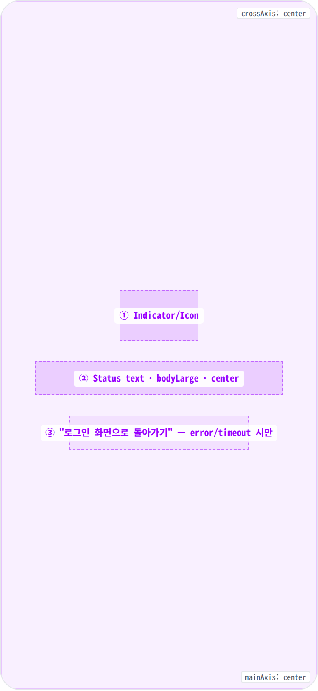
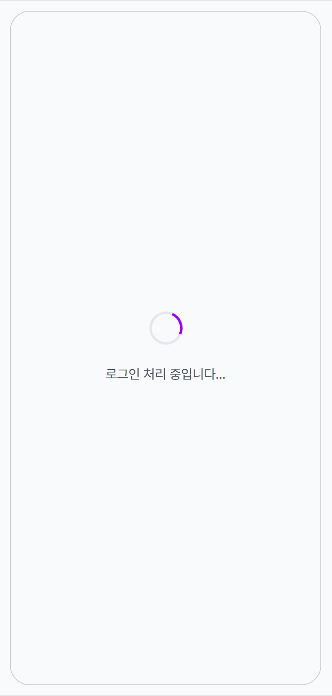
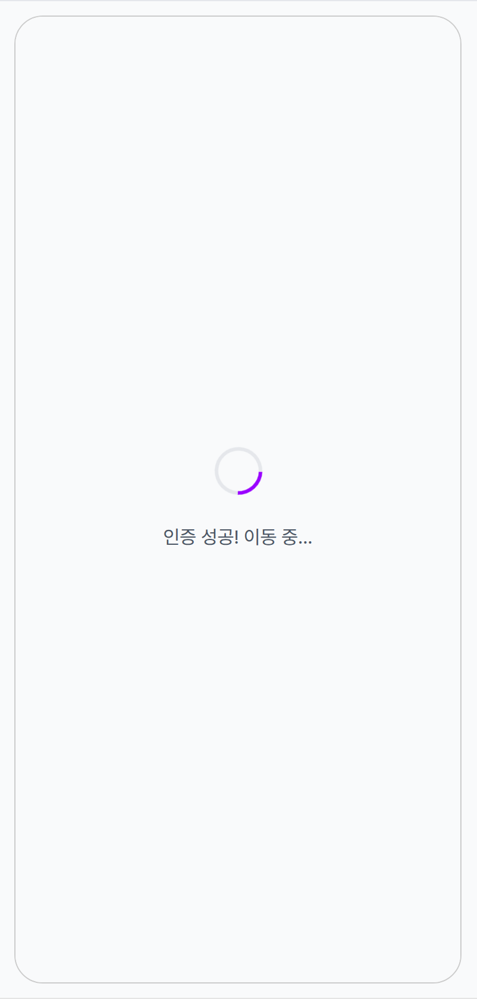
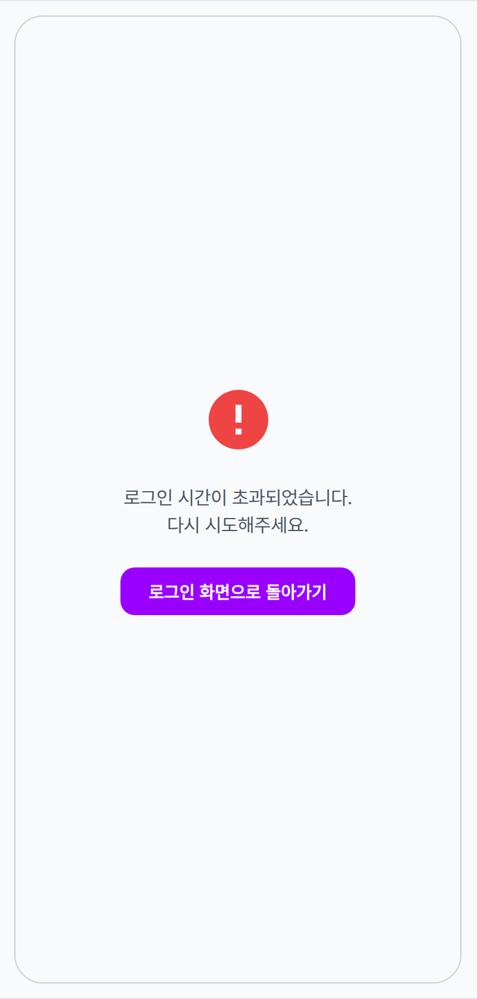

 Spec — AuthCallbackPage (app\_user · AuthCallbackRoute)  

# Auth Callback

## Overview

| Status | ✅ 디자인완료 — 3개 state · OAuth redirect 처리 전용 화면 |
|---|---|
| App | app_user |
| Category | auth · OAuth bridging |
| Route / Surface | AuthCallbackRoute · widget: AuthCallbackPage |
| Path | /auth/callback |
| Hierarchy | Parent: — (top-level screen)Children: — |
| Purpose | 외부 로그인 페이지(Google · Apple · Kakao)에서 돌아온 사용자를 인증 처리한 뒤 원래 가려던 화면(또는 홈)으로 자동 이동시킨다. 사용자에게 보이는 시간은 보통 0.1~0.5초 — 인증 정보를 해석하는 짧은 구간 동안만. |
| User journey | Entry points: 외부 로그인 페이지에서 인증을 승인한 직후 자동 진입. 사용자가 직접 URL로 진입할 일은 거의 없음.Exit points: 인증 성공 시 원래 가려던 화면(없으면 홈)으로 자동 이동. 약 10초 시간 초과 또는 처리 실패 시 "로그인 화면으로 돌아가기" 버튼을 통해 로그인 화면으로 복귀. |
| Background | OAuth 흐름은 외부 브라우저로 이탈했다가 다시 앱으로 돌아오기 때문에 앱 내에 명시적인 "복귀 처리" 화면이 필요. 사용자는 잠깐의 로딩만 인지 — 사실상 내부 로직 화면. 인증이 정상 감지되는 순간 다음 화면으로 자동 이동된다. 약 10초 시간 초과는 인증 정보 손상이나 서버 응답 지연에 대비한 안전망. |
| Frequency | OAuth 로그인 시도 시마다 1회 — 보통 사용자가 인지 못함 (수백 ms). |

## History

최신 항목 위.

| Date | Version | Author | Changes |
|---|---|---|---|
| 2026-05-01 | 1.0 | mark-yun | v1.4 template으로 작성. 3 states (Processing baseline · Redirecting · Timeout/Error). LoginPage / OAuth provider redirect와의 cross-link. |

[🧱 Layout](#layout) [🎨 States](#states) [🔄 Global Behavior](#global-behavior) [📖 Reference](#reference)

🧱

## Layout

Scaffold(body: Center → Column) · AppBar 없음. 단일 column이 화면 정중앙에서 spinner/icon + 메시지 + (조건부) 버튼을 stack.

## Blueprint & tree

AppBar 없는 풀-블리드 Scaffold. `Center` 안에 `Column(mainAxis: center)`이 1~3개 child를 수직으로 정렬. child 사이는 `SizedBox(height: MinglitSpacing.large = 24px)`.

**Scaffold** └─ **body: Center** └─ **Column**(mainAxis: center) ├─ _Indicator / Error icon_ ← ① │ ├─ **MinglitCircularProgressIndicator** _(\_isProcessing == true)_ │ └─ **Icon**(error\_outline · 60px · color-error) _(\_isProcessing == false)_ │ ├─ Gap: `spacing-large (24px)` │ ├─ _Status text_ ← ② │ └─ **Text**(`bodyLarge` · color-text-secondary · center) │ ├─ Gap: `spacing-large (24px)` _(error만)_ │ └─ _Back-to-login button_ ← ③ └─ **ElevatedButton**("로그인 화면으로 돌아가기") _(error/timeout 시만)_

## Spacing & alignment rules

| # | Region | Alignment | Spacing |
|---|---|---|---|
| — | Scaffold body | Center — 풀-블리드 | — |
| ① | Indicator/Icon | cross axis: center | 아래 gap: spacing-large (24px) |
| ② | Status text | textAlign: center · cross axis: center | 아래 gap (error만): spacing-large (24px) |
| ③ | Back-to-login button | cross axis: center · 자체 padding 사용 | — |

🎨

## States

시각 변형 3종. 처리 중 / 인증 성공 후 이동 중 / 시간 초과·실패. 사용자에게 보이는 시간이 짧지만 시간 초과 분기는 명시적 화면으로 노출.

**State 식별 기준**: 처리 진행 여부 · 인증 성공 감지 여부 · 약 10초 시간 초과 여부. Processing(스피너) → Redirecting(같은 스피너 + "인증 성공! 이동 중..." 메시지) → 또는 Timeout(에러 아이콘 + 재시도 버튼).

### State summary

| State | Tag | 조건 (요약) | Key visual differentiator |
|---|---|---|---|
| Processing 🎯 | baseline | 로그인 처리가 진행 중이며 아직 인증 결과가 도착하지 않은 상태. | 스피너 + "로그인 처리 중입니다..." 메시지 |
| Redirecting | success | 인증이 성공적으로 감지되어 다음 화면으로 이동을 준비하는 상태. | 스피너 유지 + "인증 성공! 이동 중..." 메시지 |
| Timeout / Error | failure | 약 10초가 지나도록 결과가 도착하지 않거나 처리에 실패한 상태. | 에러 아이콘 + "시간 초과" 메시지 + "로그인 화면으로 돌아가기" 버튼 |

### Processing 🎯 baseline · 외부 로그인에서 막 돌아온 직후

| 항목 | 내용 |
|---|---|
| 조건 | 로그인 처리가 진행 중이며 아직 인증 결과가 도착하지 않은 상태. 약 10초 시간 초과 카운트가 함께 동작 중. |
| 사용자 액션 | 화면에 인터랙션 가능한 요소가 없음. 시스템 뒤로가기는 OS 기본 동작 (앱 종료 또는 이전 화면). |
| 에지케이스 | · 인증 처리가 매우 빠르게 끝나면 사용자가 이 화면을 거의 인지하지 못한 채 다음 화면으로 넘어감 (보통 0.1초 이내).· 외부 로그인에서 돌아온 정보가 손상돼 인증이 감지되지 않으면 약 10초 후 Timeout 상태로 전환됨. |
| 컴포넌트 | · MinglitCircularProgressIndicator (default size · color-primary) — ⓐ· Status Text (bodyLarge · color-text-secondary · center · 한국어) — ⓑ |
| 토큰 | · color: color-surface (배경), color-primary (스피너), color-text-secondary (메시지 · 차분한 톤)· spacing: spacing-large (24 · 요소 사이 모든 간격)· typography: bodyLarge (16 / 400 / 1.45) |
| 노트 | 📝 메시지는 일부러 시선을 끌지 않는 차분한 톤으로 처리. 스피너는 표준 크기를 그대로 사용. |

### Redirecting 인증 성공 감지 — 다음 화면으로 이동 중

| 항목 | 내용 |
|---|---|
| 조건 | 인증이 성공적으로 감지된 직후. 메시지가 "인증 성공! 이동 중..."으로 바뀌고 다음 화면으로의 이동을 준비. |
| 사용자 액션 | 동일 — 인터랙션 가능한 요소 없음. 보통 0.1~0.3초 안에 다음 화면으로 전환됨. |
| 에지케이스 | 이전에 가려던 화면 정보가 없으면 홈으로 이동. 디바이스 처리 속도가 느리면 메시지가 좀 더 오래 보일 수 있음. |
| 컴포넌트 | 동일 |
| 토큰 | 동일 |
| 노트 | 📝 시각적으로 baseline과 거의 구분되지 않음 — 메시지 텍스트만 바뀜. 사용자에게는 한 화면으로 인지됨. |

### Timeout / Error 약 10초가 지나도록 결과가 도착하지 않거나 처리에 실패한 상태

| 항목 | 내용 |
|---|---|
| 조건 | 약 10초가 지나도록 인증 결과가 도착하지 않거나 처리에 실패한 상태. 사용자가 화면에 머물러 있을 때만 노출됨. |
| 사용자 액션 | "로그인 화면으로 돌아가기" 버튼을 탭하면 로그인 화면으로 복귀. |
| 에지케이스 | · 시간 초과가 발생하기 직전에 인증 결과가 도착하면 시간 초과 화면은 노출되지 않고 정상 이동으로 이어짐.· 사용자가 이미 화면을 떠난 뒤에 시간 초과가 발생하면 화면 갱신 없이 그대로 종료됨. |
| 컴포넌트 | ↔ 스피너 자리가 에러 아이콘(Icons.error_outline · 60px · color-error)으로 교체됨+ ElevatedButton ("로그인 화면으로 돌아가기") |
| 토큰 | + color-error (에러 아이콘)+ color-primary (버튼 배경) · radius-button (12px)· typography 동일 (bodyLarge · color-text-secondary) |
| 노트 | 📝 시간 초과 한도는 약 10초로 고정. 진행률 표시 없음. 메시지는 두 줄로 표시됨. |

🔄

## Global Behavior

화면 전반 — auth lifecycle, 시간 보장, edge cases.

## Cross-cutting interactions

| 사용자 액션 | 화면에 보이는 결과 |
|---|---|
| OS 뒤로가기 / 뒤로가기 스와이프 | OS 기본 동작. 보통 사용자가 인지하기 전에 자동으로 다음 화면으로 이동되므로 거의 의미가 없음. 시간 초과 화면이 떠 있다면 로그인 화면으로 명시적으로 돌아가는 것을 권장. |
| 외부 로그인 페이지에서 거부 / 창 닫기 | 이 화면 자체에 진입하지 않음. 앱은 그대로 백그라운드에 머무름. |
| 앱이 백그라운드에서 다시 포그라운드로 복귀 | 인증 처리가 한 번 더 시도됨. 처리가 진행 중이었다면 그대로 대기, 이미 시간 초과가 발생했다면 시간 초과 화면이 노출됨. |

## Motion & timing

Source: `shared/packages/mds/core/lib/src/theme/minglit_design_tokens.dart` → `MinglitAnimation`.

| Token | Value | Use case |
|---|---|---|
| MinglitAnimation.fast | 200ms | 화면이 등장하거나 사라질 때의 표준 라우트 전환 |
| (unscoped) 스피너 회전 | 약 700ms / cycle | 스피너 컴포넌트 내부에서 자체 동작 — Material 기본 |
| (고정) 인증 시간 초과 | 10000ms | 약 10초 한도. 디자인 토큰이 아닌 명시적 약속값. |

| Transition | Duration (token) | Curve / notes |
|---|---|---|
| 외부 로그인 페이지에서 이 화면으로 진입 | OS 기본 | OS가 처리하는 외부 → 앱 복귀 전환. 앱 차원에서 커스터마이징 불가. |
| Processing → Redirecting (메시지 변경) | 즉시 | 페이드 없이 컷 전환. 메시지 텍스트만 교체됨. |
| AuthCallback → 목적지 화면 (홈 또는 원래 가려던 화면) | fast (200ms) | 표준 라우트 전환 (slide / fade). |
| Processing → Timeout 상태 | 즉시 | 약 10초 후 자동으로 시간 초과 화면으로 컷 전환됨. 사용자가 인지하는 시점에 이미 에러 UI가 보이는 형태. |

## Global edge cases

-   **네트워크 끊김** — 인증 결과가 도착하지 않으므로 약 10초 후 시간 초과 화면이 노출됨. "네트워크 오류" 같은 구체적 사유는 일부러 표시하지 않음.
-   **다크 모드** — 배경과 메시지는 토큰 기반으로 자동 전환됨. 에러 아이콘과 스피너는 각자의 색 토큰을 그대로 사용.
-   **접근성** — 메시지가 한 줄의 한국어 텍스트라 보이스 오버가 자동으로 읽어줌. 스피너는 장식 요소이고, 에러 아이콘의 의미는 옆 메시지가 전달.
-   **이미 로그인된 채 재진입** — 화면이 보이기 전에 즉시 다음 화면으로 이동.

📖

## Reference

implementation source + 인접 화면. Components / Tokens는 위 mini-table 참고.

## Implementation source

| Widget class | AuthCallbackPage · ConsumerStatefulWidget |
|---|---|
| File path | apps/app_user/lib/src/features/auth/ui/auth_callback_page.dart |
| Coordinator | authCoordinatorProvider · goToReturnLocation(url) / goToLogin() 사용 |
| Auth provider | currentUserProvider (kit-shared · ref.listen으로 SIGNED_IN 감지) |
| Persistence | SharedPreferences key: auth_return_url — LoginPage에서 저장, 여기서 소비 후 즉시 remove |
| Route | AuthCallbackRoute · path: /auth/callback · app_routes.dart |
| Timeout | Hard-coded Duration(seconds: 10) — token 미정의 |

## Related screens

| Spec | Relation |
|---|---|
| LoginPage | OAuth 시작점. auth_return_url을 SharedPreferences에 저장 후 외부 OAuth로 이탈. 사용자가 timeout/error 시 "로그인 화면으로 돌아가기" 탭하면 여기로 복귀. |
| SignupConsentPage | 최초 가입 사용자는 redirect 후 약관 동의 화면을 거침. 기존 사용자는 곧바로 홈/원래 화면. |
| HomePage | 기본 redirect 목적지 (auth_return_url 부재 시 /). |