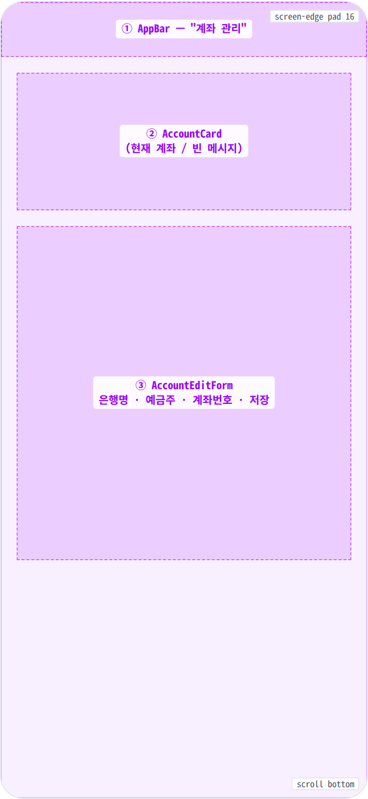
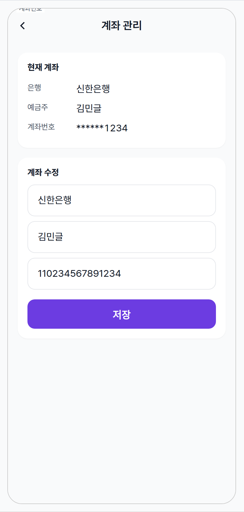
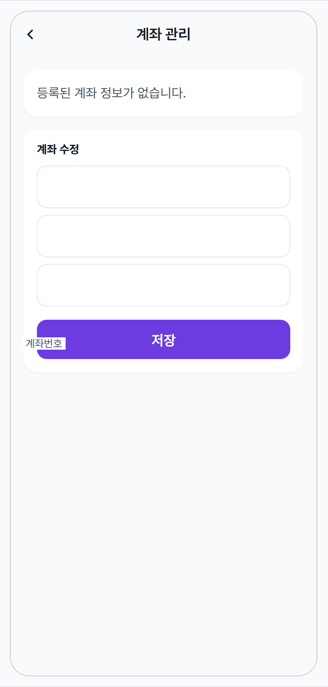
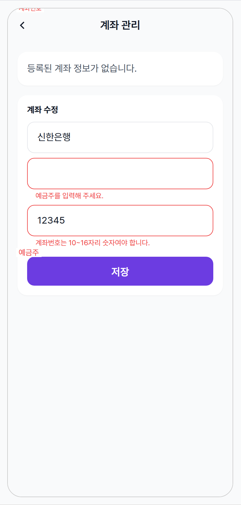
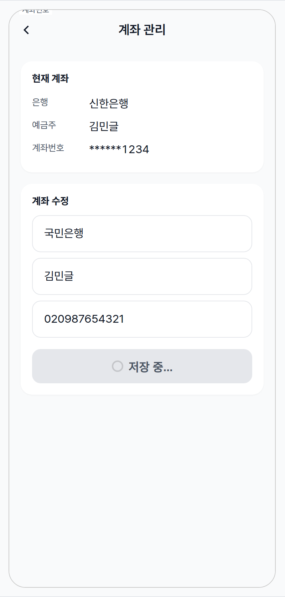
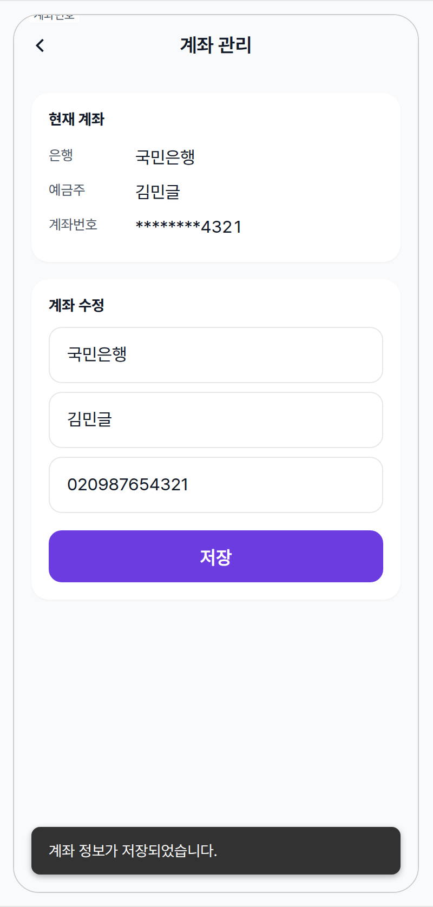
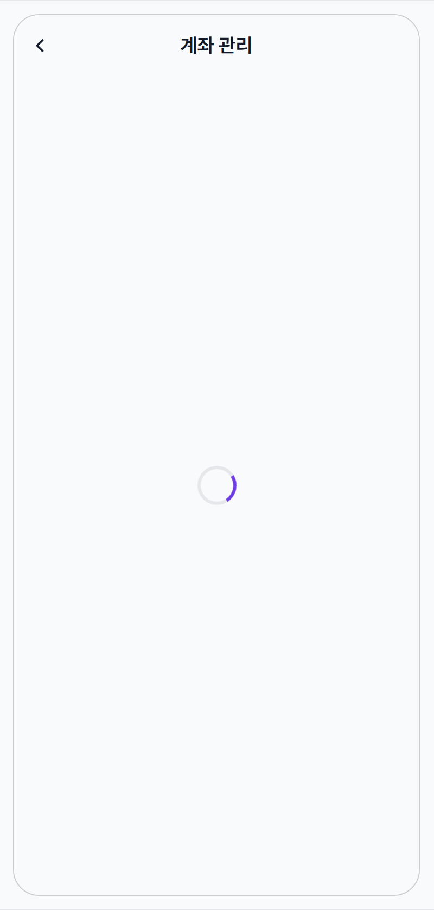

 Spec — BankAccountPage (app\_partner · BankAccountRoute)  

# Bank Account

## Overview

| Status | ✅ 디자인완료 — 6개 state · 등록/조회/편집/저장 lifecycle 커버 |
|---|---|
| App | app_partner |
| Category | settlement · account management |
| Route / Surface | BankAccountRoute · widget: BankAccountPage + AccountCard + AccountEditForm |
| Path | /settlement/bank-account |
| Hierarchy | Parent: SettlementPage ("계좌 관리" 액션으로 진입)Children: — |
| Purpose | 파트너가 정산금을 수령할 은행 계좌를 등록·조회·수정한다. 등록된 계좌가 있으면 마스킹된 요약(현재 계좌 카드)과 수정 폼을 함께 노출한다. 계좌 미등록 상태에서는 빈 메시지 카드와 입력 폼만 표시한다. |
| User journey | Entry points: 정산 화면 → "계좌 관리" 액션 (또는 정산 상세의 지급 실패 상태에서 안내 메시지를 통해 진입).Exit points: 뒤로 가기 → 정산 화면으로 복귀 / 저장 성공 → 안내 메시지 + 화면 자동 갱신 (카드/폼 모두 새 값으로 반영). |
| Background | 밍글릿은 정산 후 등록된 계좌로 송금한다. 계좌 정보가 없거나 잘못되면 지급이 실패해 재지급 요청 경로로 빠진다. 본 화면은 그 원인을 사용자가 직접 해결할 수 있는 유일한 surface. 계좌번호는 카드 표시 시에만 마스킹(**** 1234)되고, 편집 폼에는 평문으로 채워진다 — drift 참고. |
| Frequency | 입점 직후 1회 등록. 계좌 변경 시 비정기적 재방문. payout FAILED 발생 시 즉시 재방문. |

## History

이 spec의 주요 변경 이력. 최신 항목 위.

| Date | Version | Author | Changes |
|---|---|---|---|
| 2026-05-01 | 1.0 | mark-yun | v1.4 template으로 작성. Default(empty) baseline + Account registered / Editing prefilled / Saving / Validation error / Loading 5개 추가 state. AccountCard / AccountEditForm 분리 구조 + 마스킹 / 평문 prefill drift 명시. |

[🧱 Layout](#layout) [🎨 States](#states) [🔄 Global Behavior](#behavior) [📖 Reference](#reference)

🧱

## Layout

화면 구조 — 영역, 정렬, 간격 규칙. 색·타이포 무시.

## Blueprint & tree

Scaffold(AppBar "계좌 관리") + SingleChildScrollView(padding: spacing-medium). Column(crossAxis: stretch)에 두 카드를 spacing-medium 간격으로 쌓는다 — 위가 AccountCard(읽기 요약), 아래가 AccountEditForm(편집 폼).

**Scaffold** ├─ **appBar**: AppBar(title: Text('계좌 관리')) ← ① └─ **body** ├─ \[\_isLoading\] **Center** → **CircularProgressIndicator** └─ **SingleChildScrollView**(padding: _EdgeInsets.all(spacing-medium)_) └─ **Column**(crossAxis: stretch) ├─ **AccountCard**(accountData) ← ② │ └─ **Card** │ └─ Padding(spacing-medium) │ └─ \[data == null\] │ │ └─ Text('등록된 계좌 정보가 없습니다.') │ └─ \[data != null\] **Column**(crossAxis: start) │ ├─ Text('현재 계좌', titleSmall) │ ├─ SizedBox(spacing-sm) │ ├─ **\_InfoRow**('은행', bankName) │ ├─ **\_InfoRow**('예금주', holder) │ └─ **\_InfoRow**('계좌번호', '\*\*\*\* xxxx') │ ├─ SizedBox(_spacing-medium_ = 16) │ └─ **AccountEditForm**(accountData, onSaved) ← ③ └─ **Card** → Padding(spacing-medium) → **Form**(formKey) └─ **Column**(crossAxis: stretch) ├─ Text('계좌 수정', titleSmall) ├─ SizedBox(spacing-sm) ├─ **TextFormField**(은행명) ├─ SizedBox(spacing-small) ├─ **TextFormField**(예금주) ├─ SizedBox(spacing-small) ├─ **TextFormField**(계좌번호 · digits-only · 10–16자리) ├─ SizedBox(spacing-medium) └─ **FilledButton**('저장' / '저장 중...')

## Spacing & alignment rules

| # | Region | Alignment | Spacing |
|---|---|---|---|
| ① | AppBar | height 56 · 표준 Material AppBar (자동 back 버튼) | scaffold-gray bg · border 없음 (theme: surfaceTintColor transparent) |
| — | SingleChildScrollView | vertical scroll · column stretch | outer padding: spacing-medium (16) — EdgeInsets.all |
| ② | AccountCard | Card · Padding spacing-medium · Column crossAxis start | title↔rows: spacing-sm (12) · row v-pad: spacing-xsmall (4) · label width fixed 80 |
| — | between cards | — | SizedBox(spacing-medium = 16) |
| ③ | AccountEditForm | Card · Padding spacing-medium · Form/Column crossAxis stretch | title↔필드: spacing-sm · 필드 사이: spacing-small (8) · 마지막 필드↔버튼: spacing-medium (16) |

🎨

## States

시각 변형 6종. baseline = Account registered, 나머지는 additive diff.

**State 종류 식별 기준**: 계좌 정보의 등록 여부 · 저장 진행 여부 · 첫 데이터 조회 진행 여부 · 폼 검증 결과. 모든 state는 같은 화면 구조 위에서 데이터에 따라 분기되어 노출된다.

### Account registered 🎯 baseline · 가장 일반적

| 항목 | 내용 |
|---|---|
| 조건 | 데이터 조회가 끝났고 계좌 정보가 등록되어 있으며 저장이 진행 중이 아님. |
| 사용자 액션 | ① 뒤로 가기 → 정산 화면으로 복귀② 필드 탭 → 키보드가 올라오고 라벨이 위로 떠오름 · 은행명 / 예금주 / 계좌번호가 평문으로 채워져 있어 그대로 편집 가능③ 저장 탭 → 저장 진행(버튼 비활성) → 성공 시 안내 메시지가 노출되며 화면이 새 데이터로 갱신됨④ 스크롤 → 키보드가 올라오면 폼까지 자동으로 스크롤됨 |
| 에지케이스 | · 계좌번호 마스킹은 카드 표시 시에만 적용됨 — 편집 폼에는 평문이 그대로 채워짐 (drift)· 예금주가 비어 있으면 카드에 '-'로 표시되고 폼에는 빈 문자열로 채워짐· 다크모드: 카드 bg color-dark-surface(#212121), 입력 테두리 color-dark-divider |
| 컴포넌트 | · AppBar(title only · auto back) — Material 기본· AccountCard + 내부 _InfoRow (label width 80 · vertical padding spacing-xsmall)· AccountEditForm + 내부 TextFormField 3개 (Material default · InputDecoration labelText)· FilledButton (Material 3 · partner primary fill — onPressed 활성)· Card wrapper × 2 (radius default · cardTheme) |
| 토큰 | · color: color-surface (scaffold/AppBar bg), color-background (Card bg · 입력 bg), color-partner-primary #6c3ce1 (FilledButton bg · focused 라벨), color-text-primary/secondary, color-divider (입력 border)· radius: radius-card (16 · Card), radius-input (12 · TextFormField), radius-button (12 · FilledButton)· spacing: spacing-medium (16 · 카드/페이지 padding · 카드 사이), spacing-sm (12 · title↔rows), spacing-small (8 · 필드 사이), spacing-xsmall (4 · row v-padding)· typography: titleSmall (14/700 — 카드 타이틀), bodyMedium (16 — 값/입력), bodySmall (13 — 라벨), button (16/700) |
| 노트 | 📝 가장 일반적. 다른 5개 state는 이 baseline에서 변경분만 표시. |

### Default · 미등록 입점 직후 첫 진입 — 빈 카드 + 빈 폼

| 항목 | 내용 |
|---|---|
| 조건 | 데이터 조회가 끝났지만 등록된 계좌가 없는 상태. |
| 사용자 액션 | + 빈 폼 입력 → 모든 필드를 채우고 저장 → 화면 갱신 → 등록된 계좌 화면으로 전환나머지 동일 |
| 에지케이스 | · 미등록 상태에서도 폼 카드 타이틀이 "계좌 수정"으로 고정되어 의미와 어긋남 — "계좌 등록"이 더 정확 (drift) |
| 컴포넌트 | ↔ AccountCard 내부 → 텍스트 한 줄("등록된 계좌 정보가 없습니다.") — title/InfoRow 모두 미렌더− _InfoRow × 3↔ TextFormField prefill → 빈 문자열 |
| 토큰 | ↔ AccountCard 텍스트 색 → bodyMedium default (text-secondary 톤). 그 외 동일 |
| 노트 | 📝 입점 직후 onboarding의 implicit 후속 단계. 명시적 안내 문구는 없음 — 빈 카드 + 폼 자체가 CTA. |

### Validation error 저장 탭 시 필드 검증이 실패한 상태

| 항목 | 내용 |
|---|---|
| 조건 | 저장 탭 시 빈 필드 또는 계좌번호 길이/형식 불일치로 검증이 실패한 상태. |
| 사용자 액션 | + 에러 표시된 필드 수정 → 다음 검증 시점에 통과하면 오류가 사라짐− 저장은 진행되지 않음 (Saving 상태로 진입하지 않음) |
| 에지케이스 | · 계좌번호 입력은 숫자만 수용 — 키 입력 / 붙여넣기 모두 비숫자 차단 (Fix #1938)· 9자리 이하 / 17자리 이상 → "10~16자리 숫자여야 합니다." 표시· 빈 필드 3종은 각각의 안내 문구 ('은행명/예금주/계좌번호를 입력해 주세요.') |
| 컴포넌트 | + TextFormField error border color-error + helperText 영역에 error message↔ FilledButton → 동일 (색상 변화 없음 — 클릭 가능 상태 유지) |
| 토큰 | + color-error (입력 border · 라벨 · helperText) |
| 노트 | 📝 검증은 첫 저장 탭 시점에 evaluate되고, 이후에는 사용자가 입력란을 만질 때마다 자동으로 다시 검증됨. |

### Saving 저장 진행 중 · 버튼 비활성

| 항목 | 내용 |
|---|---|
| 조건 | 검증 통과 후 저장이 진행 중인 상태. |
| 사용자 액션 | − 저장 버튼 다시 탭 → 무반응↔ 입력 필드 → 여전히 편집 가능 (drift)↔ 뒤로 가기 → 가능 (저장은 백그라운드에서 진행되며 결과는 안내 메시지로 노출됨) |
| 에지케이스 | · 응답 지연 → 버튼 스피너만 길게 보임 (별도 타임아웃 없음)· 네트워크 오류 → 오류 안내 메시지가 노출되고 버튼이 다시 활성화됨 (폼은 그대로 유지)· 파트너 컨텍스트가 없으면 저장이 진행되지 않음 |
| 컴포넌트 | ↔ FilledButton → onPressed: null + 라벨 "저장 중..."+ 버튼 내 spinner 시각 표현 (현재 소스는 텍스트만 변경 · spinner는 spec 권장 — drift) |
| 토큰 | ↔ FilledButton bg → Material disabled style (theme: 12% opacity primary 또는 onSurface 12%) |
| 노트 | 📝 ⚠️ 현재 비활성 상태에서 라벨만 "저장 중..."으로 변경됨 — 인라인 스피너 추가는 본 spec의 디자인 개선 권고. 재지급 요청 버튼과 같이 인라인 progress indicator 권장. |

### Save success 저장 성공 · 안내 메시지 + 화면 자동 갱신

| 항목 | 내용 |
|---|---|
| 조건 | 저장이 성공하면 안내 메시지가 잠깐 노출되고 카드가 새 값으로 갱신됨. |
| 사용자 액션 | + 안내 메시지 스와이프 → 즉시 닫힘나머지 동일 (편집 계속 가능) |
| 에지케이스 | · 갱신 중 화면을 빠져나가면 안전하게 무시됨· 카드만 새 값으로 갱신되고 편집 폼은 직전 입력값을 유지 (재진입 전까지는 변경 안 됨, drift) |
| 컴포넌트 | + SnackBar (Material default · scaffoldMessenger · 4s)↔ AccountCard 데이터 → 새 값으로 갱신 (마스킹 last4도 새 번호 기준)↔ FilledButton → 다시 활성화 |
| 토큰 | + snackBarTheme 기본 (color-text-primary inverse · spacing-medium 좌우 마진) |
| 노트 | 📝 안내 메시지 한 줄. 재시도/되돌리기 버튼 없음 — 재시도는 사용자가 버튼을 다시 누르는 방식. |

### Loading 화면 진입 직후 데이터 조회 중

| 항목 | 내용 |
|---|---|
| 조건 | 화면 진입 직후 계좌 데이터를 받아오는 중. |
| 사용자 액션 | − 본문 영역의 모든 액션 비활성. 뒤로 가기만 가능 |
| 에지케이스 | · 파트너 컨텍스트가 없으면 즉시 미등록 화면으로 전환됨· 데이터 조회 실패 시 별도 오류 화면 없이 미등록 화면으로 전환됨 (Fix #459) |
| 컴포넌트 | ↔ body (AccountCard + AccountEditForm) → CircularProgressIndicator 단일 (Material 기본)− 모든 카드/폼/버튼 |
| 토큰 | − 카드/폼 토큰 미사용. 스피너만 color-partner-primary + color-divider (track) |
| 노트 | 📝 AppBar는 유지 (back 가능). 본문만 스피너로 대체. 데이터 조회 실패가 별도 오류 화면으로 노출되지 않는 점은 drift — 사용자는 미등록 상태로만 인지하게 됨. |

🔄

## Global Behavior

cross-cutting — 모든 state에 적용되는 액션, motion, 글로벌 에지케이스. 각 state 한정 액션은 위 mini-table 참고.

## Cross-cutting interactions

| 사용자 액션 | 화면에 보이는 결과 |
|---|---|
| 뒤로 가기 (시스템 back / AppBar back) | SettlementPage로 복귀. 진행 중인 fetch / 저장은 background 유지 (mounted check만으로 보호). |
| 다크 모드 토글 | Card bg → color-dark-surface(#212121). 입력 border → color-dark-divider(#3d3d3d). FilledButton bg → color-dark-partner-primary (tokens.css 기준). 텍스트 → color-dark-text-primary(#fff). |
| 키보드 노출 (필드 포커스) | resizeToAvoidBottomInset 기본 true → Scaffold 자동 축소. SingleChildScrollView가 포커스된 필드까지 자동 스크롤. |
| 계좌번호 입력 (digits-only) | FilteringTextInputFormatter.digitsOnly — 비숫자 키스트로크 / paste 시도 모두 차단. softKeyboard도 TextInputType.number로 숫자 패드. |

## Motion timing

Source: `shared/packages/mds/core/lib/src/theme/minglit_design_tokens.dart`

| Transition | Token / Duration | Notes |
|---|---|---|
| 화면 진입 (Settlement → BankAccount) | MinglitAnimation.fast (200ms) | GoRouter 기본 좌→우 slide. 진입 직후 _loadAccount() 시작. |
| Loading → 데이터 표시 | cut (no animation) | fetch 완료 시 즉각 표시. fade 없음. |
| 입력 라벨 floating | MinglitAnimation.micro (100ms) | InputDecoration 기본 — 포커스/값 변경 시 라벨 위로 축소 이동. |
| 저장 진행 → 성공 SnackBar | 서버 응답 대기 + MinglitAnimation.medium (350ms) | SnackBar slide-up + scaffoldMessenger 기본 fade. ~4s 자동 닫힘. |

## Global edge cases

-   **1원 인증 / 계좌 검증 미존재** — 본 화면은 계좌 정보를 그대로 upsert만 한다 (서버 측 검증은 별도 trust pipeline에서 처리되며 본 UI에 surface되지 않는다). "Verifying / Verified" 같은 인증 state는 _현재 구현에 존재하지 않는다_.
-   **마스킹 / 평문 비대칭** — AccountCard는 last4만 노출하고 나머지를 `*`로 마스킹하지만, AccountEditForm은 `account_number`를 평문으로 prefill한다. 어깨 너머 노출 위험 — 추후 보완 권고 (예: 폼도 마스킹 후 "변경" 탭 시 평문화).
-   **partner == null 가드** — \_loadAccount / \_save 모두 partner null 시 early return. \_save의 경우 setState로 \_isSaving=true 후 partner null이면 finally에서 false 복귀 — UI 잠깐 disabled flicker 가능 (실측 필요).
-   **저장 실패 → SnackBar('저장 실패: $e')** — exception toString을 그대로 노출. 운영팀이 사용자에게 stack trace 일부가 보일 수 있음 — error mapper 권고.
-   **account\_holder/bank\_name 자유 입력** — 은행명은 enum/select가 아닌 자유 텍스트. 오타 → 송금 실패 root cause로 직결. 서버 측 normalize/whitelist 필요 (drift).

📖

## Reference

implementation source + 인접 화면. Components / Tokens는 위 mini-table 참고.

## Implementation source

| Widget | BankAccountPage + AccountCard + AccountEditForm — apps/app_partner/lib/src/features/settlement/bank_account_page.dart |
|---|---|
| Route | BankAccountRoute · /settlement/bank-account · app_routes.dart |
| Provider | currentPartnerInfoProvider (partner null 가드) · settlementRepositoryProvider → getBankAccount(partnerId) · upsertBankAccount(...) |
| Theme | partner brand primary MinglitPartnerColors.primary = #6c3ce1 — 모든 active accent (FilledButton bg · focused 입력 border/라벨 · 스피너) 에 적용 |
| Validators | 은행명 / 예금주: non-empty · 계좌번호: RegExp(r'^\d{10,16}$') + FilteringTextInputFormatter.digitsOnly (Fix #1938) |
| ⚠️ 알려진 drift | · 계좌번호 폼 prefill 평문 (카드 표시는 마스킹 — 비대칭 보안)· "계좌 수정" 카드 타이틀이 미등록 상태에도 동일 ("계좌 등록"이 정확)· Saving state에서 입력 필드 disable 안 됨 (controller readOnly 미설정)· fetch 실패가 별도 error state로 surface되지 않고 미등록(State 2)로 합류· 저장 실패 SnackBar에 raw exception toString 노출· 1원 인증 등 계좌 검증 UI 미존재 — 입력값을 그대로 upsert |

## Related screens

| Spec | Relation |
|---|---|
| SettlementDetailPage | FAILED 상태에서 "계좌 정보를 확인해 주세요." 안내 → 본 화면이 root cause 자가 해결 surface. |
| PartyCreateWizardPage | 같은 폼-기반 partner 화면 — InputDecoration / FilledButton 토큰 사용 패턴 참고. |
| Layout foundations | Standard Scaffold + SingleChildScrollView. 탭바 없음 — settlement branch의 자식 detail scaffold. |