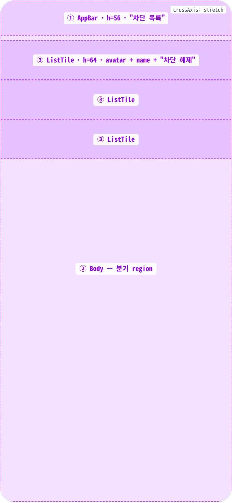
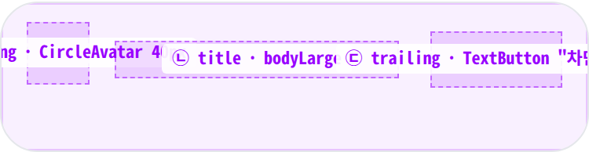
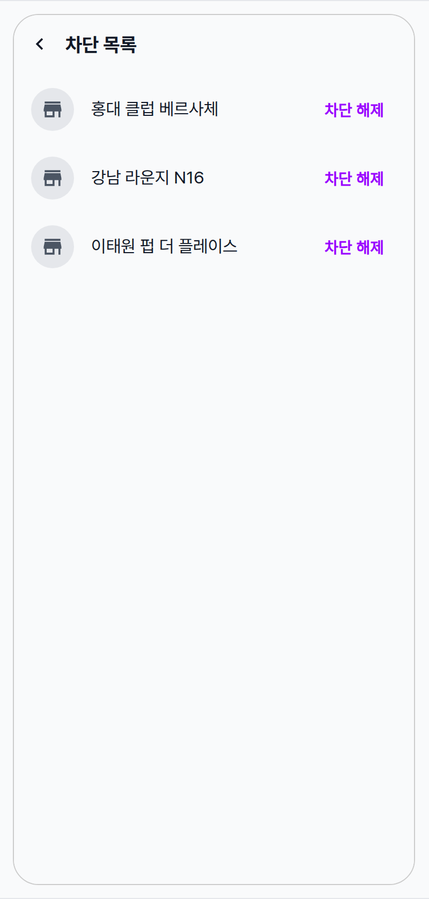
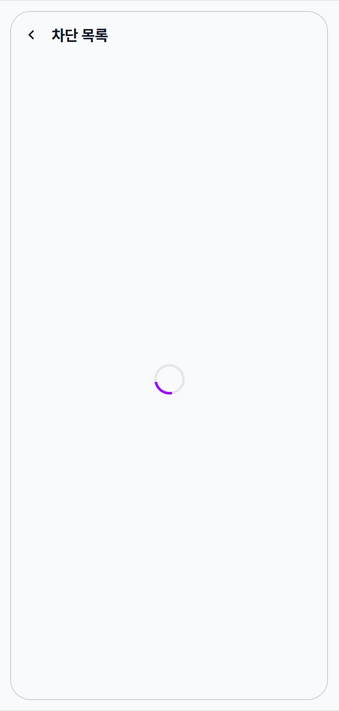
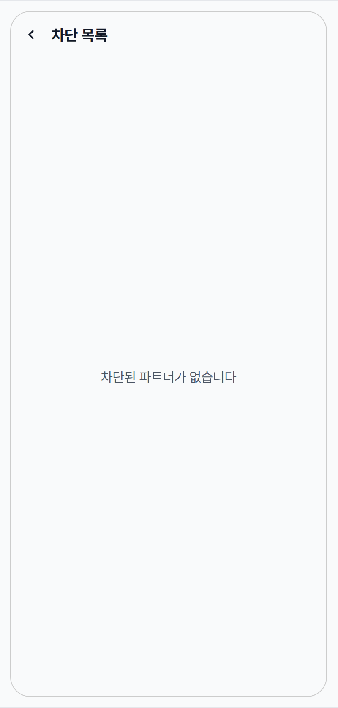
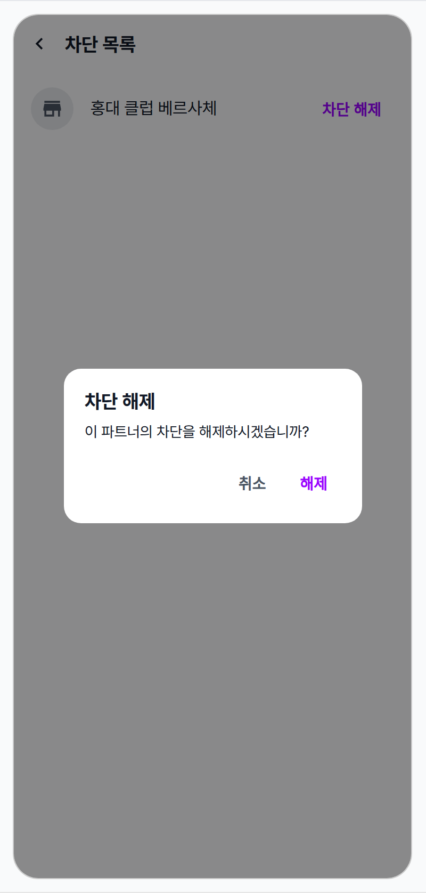
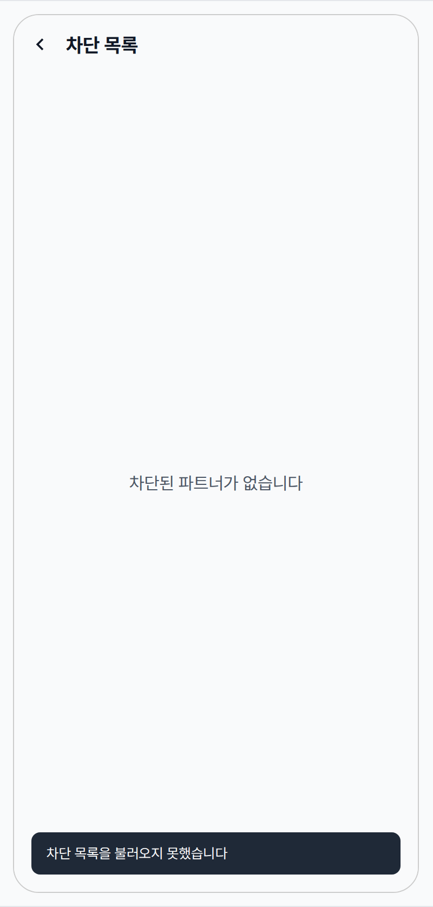

 Spec — BlockedPartnersPage (app\_user · BlockedPartnersRoute)  

# Blocked Partners (차단 목록)

## Overview

| Status | ✅ 디자인완료 — 5 states · 차단 관리 단순 화면 |
|---|---|
| App | app_user |
| Category | settings · social · 차단 관리 |
| Route / Surface | BlockedPartnersRoute · widget: BlockedPartnersPage |
| Path | /settings/blocked-partners |
| Hierarchy | Parent: AccountManagementPage 또는 MorePage (settings 진입점에서 push)Children: — · 확인 다이얼로그(MinglitAlert.showConfirm)는 inline modal |
| Purpose | 사용자가 차단한 파트너(가게/주최자) 목록을 표시하고, 각 행에서 차단 해제를 즉시 실행할 수 있게 한다. 확인 다이얼로그를 한 번 거쳐서 실수로 인한 해제를 방지. |
| User journey | Entry points: 설정 / 계정 관리 / "더보기" 화면에서 "차단 목록" 항목 탭.Exit points: AppBar back으로 이전 화면 복귀. 별도 success/exit 분기 없음 — 모든 동작은 이 화면에 머물며 처리. |
| Background | 파트너를 차단하면 해당 파트너의 이벤트와 리뷰가 사용자 피드에 노출되지 않음. 차단을 해제하면 다시 노출되어야 하므로, 해제 직후 목록을 다시 가져와 화면을 갱신함. 네트워크 실패 시 화면이 영구 로딩 상태에 빠지지 않도록, 화면 하단에 안내 메시지가 잠깐 노출되고 본문은 Empty와 같은 형태로 마감됨. |
| Frequency | 드물게 — 사용자가 차단 관리를 명시적으로 들춰볼 때만. |

## History

최신 항목 위.

| Date | Version | Author | Changes |
|---|---|---|---|
| 2026-05-01 | 1.0 | mark-yun | v1.4 template으로 작성. 5 states (List baseline · Loading · Empty · Confirm dialog · 해제 후 SnackBar). Fix #270 (네트워크 실패 처리) 명시. |

[🧱 Layout](#layout) [🎨 States](#states) [🔄 Global Behavior](#global-behavior) [📖 Reference](#reference)

🧱

## Layout

상단 AppBar(title) + 본문은 차단 목록 진행 상태에 따라 로딩 인디케이터 / Empty 안내 / 행 리스트 중 하나로 노출. 행 항목: 좌측 아바타 · 가운데 이름 · 우측 "차단 해제" 버튼.

## Blueprint & tree

**주의**: 코드는 `AppBar(title: const Text('차단 목록'))`(plain Material) 사용 — `simpleAppBar` 아님. 그래서 `elevation` / `surfaceTintColor`는 Material default. body는 `ListView.builder`로 가변 길이 목록.

**Scaffold** ├─ **appBar: AppBar**(title: Text('차단 목록')) ← ① └─ **body** — 분기 ← ② ├─ **Center** + **MinglitCircularProgressIndicator** _(가져오는 중)_ ├─ **Center** + **Text**('차단된 파트너가 없습니다') _(차단된 파트너 0건)_ └─ **ListView.builder**(파트너 리스트) _(차단된 파트너 1건 이상)_ └─ **ListTile** ← ③ ├─ **leading: CircleAvatar**(image | Icon(store)) ├─ **title: Text**(name) └─ **trailing: TextButton**('차단 해제') → `_unblock(id)`

## Spacing & alignment rules

| # | Region | Alignment | Spacing |
|---|---|---|---|
| — | Scaffold | — | — |
| ① | AppBar (Material default) | title left-aligned (default — Material 3 left, Material 2 left in this widget) | height 56 · 좌우 padding Material default |
| ② | Body 분기 영역 | — | — |
| ③ | ListTile (Material default) | vertical center · leading 좌측 16 · trailing 우측 16 | height: 64 (subtitle 없음) · leading↔title gap: 16 · title↔trailing gap: 16 |

## Sub-anatomy ① — ListTile (반복 element)

`ListView.builder`가 partner 1개당 1개의 `ListTile`을 반복 렌더. ListTile 자체는 Material default 구조 — leading(40) · title · trailing.

**ListTile** ├─ _leading_ ← ㉠ │ └─ **CircleAvatar**(40px) │ ├─ **backgroundImage**: NetworkImage(profile\_image\_url) _(존재 시)_ │ └─ child: **Icon**(`Icons.store`) _(이미지 없을 때)_ │ ├─ _title_ ← ㉡ │ └─ **Text**(name) — `bodyLarge` · ellipsis │ └─ _trailing_ ← ㉢ └─ **TextButton**('차단 해제') └─ onPressed: `_unblock(id)`

| # | Region | Alignment | Spacing / tokens |
|---|---|---|---|
| ㉠ | leading · CircleAvatar | vertical center · left 16 | 40 × 40 · radius: 50% |
| ㉡ | title | vertical center · gap: 16 (Material default) | bodyLarge · ellipsis · color-text-primary |
| ㉢ | trailing · TextButton | vertical center · right 16 · padding 자체 8/12 | "차단 해제" · color-primary · weight 600 |

🎨

## States

5 states — initial Loading → List(default) / Empty / Error fallback. List에서 차단 해제 탭 시 Confirm dialog → Success SnackBar.

**State 식별 기준**: 차단 목록을 가져오는 진행 상태와 결과 건수에 따라 List(baseline) / Loading / Empty / Confirm dialog / Error fallback 5가지 변형으로 갈림. 데이터를 가져오는 데 실패하면 안내 메시지가 잠깐 노출되며 화면은 Empty와 같은 형태가 됨.

### State summary

| State | Tag | 조건 (요약) | Key visual differentiator |
|---|---|---|---|
| List (default) 🎯 | baseline | 차단된 파트너 목록이 1건 이상 도착한 상태 | 각 행에 "차단 해제" 버튼이 있는 행 리스트 |
| Loading | async | 화면 진입 직후 또는 차단 해제 후 목록을 다시 가져오는 동안 | 화면 정중앙 로딩 인디케이터 |
| Empty | no data | 응답이 도착했지만 차단된 파트너가 0건이거나, 모두 해제한 직후 | "차단된 파트너가 없습니다" 단독 안내 문구 |
| Confirm dialog | modal | "차단 해제" 버튼을 탭한 직후 | 화면 중앙에 확인 다이얼로그 노출 — 제목 + 본문 + 해제 / 취소 |
| Error fallback | network | 차단 목록을 가져오는 데 실패한 경우 | 화면 하단에 "차단 목록을 불러오지 못했습니다" 안내가 잠깐 노출되며, 본문은 Empty와 같은 형태 |

### List 🎯 baseline · 차단된 파트너 N건

| 항목 | 내용 |
|---|---|
| 조건 | 차단된 파트너 목록이 1건 이상 도착해 화면 본문에 행 리스트가 노출된 상태. |
| 사용자 액션 | ① "차단 해제" 탭 — 행 우측의 "차단 해제" 버튼을 누르면 확인 다이얼로그가 뜸.② AppBar 뒤로 가기 탭 — 이전 화면으로 복귀.③ 스크롤 — 목록이 화면 길이를 넘으면 세로 스크롤로 나머지를 확인. |
| 에지케이스 | · 프로필 이미지가 없는 파트너는 기본 아이콘(가게 모양)으로 표시.· 파트너 이름이 매우 길면 한 줄로 잘리고 끝에 말줄임표가 표시됨.· 여러 행의 "차단 해제"를 매우 빠르게 연속 탭하면, 마지막에 탭한 행의 다이얼로그만 노출됨. |
| 컴포넌트 | · AppBar(plain Material · title: "차단 목록") — ⓐ· ListView.builder · ListTile × N — ⓑⓒⓓ· leading: CircleAvatar(NetworkImage \| Icon(Icons.store)) — ⓑ· title: Text(bodyLarge · ellipsis) — ⓒ· trailing: TextButton("차단 해제") — ⓓ |
| 토큰 | · color: color-surface (Scaffold + AppBar bg), color-text-primary (title · AppBar title), color-divider (avatar fallback bg), color-primary (TextButton fg "차단 해제"), color-text-secondary (avatar fallback icon)· radius: avatar 50% (CircleAvatar)· spacing: ListTile 기본 (좌우 16 · 상하 자동 64), AppBar 56· typography: bodyLarge (16/400/1.45 · title), AppBar title 18/700 |
| 노트 | 📝 드리프트: 다른 화면들과 달리 표준 minglit AppBar 톤이 아닌 Material 기본 AppBar 톤이 적용됨. 향후 일관성 위해 통일 권장. |

### Loading 차단 목록을 가져오는 중에 노출되는 상태

| 항목 | 내용 |
|---|---|
| 조건 | 화면에 처음 들어왔거나, 차단 해제 후 목록을 다시 가져오는 동안 노출되는 상태. |
| 사용자 액션 | 이 화면에서는 탭할 대상이 없음. 뒤로 가기는 평소대로 동작. |
| 에지케이스 | · 응답이 매우 느리면 로딩 인디케이터가 길게 표시될 수 있음 (별도의 시간 제한 없음).· 응답이 도착하기 전에 사용자가 화면을 떠나면 결과는 화면에 반영되지 않음. |
| 컴포넌트 | ↔ ListView.builder → Center(child: MinglitCircularProgressIndicator()) |
| 토큰 | − ListTile 토큰 미사용. spinner: color-primary |
| 노트 | 📝 짧게 지나가는 전환 변형 — 보통 수백 밀리초 안에 다음 변형으로 교체됨. 별도의 스켈레톤 placeholder는 사용하지 않음. |

### Empty 차단된 파트너가 없거나, 모두 해제한 직후의 상태

| 항목 | 내용 |
|---|---|
| 조건 | 응답은 도착했지만 차단된 파트너가 한 명도 없는 경우. 또는 사용자가 모든 파트너의 차단을 해제한 직후. |
| 사용자 액션 | 이 화면에서 탭할 액션은 없음. 뒤로 가기로만 화면을 빠져나감. |
| 에지케이스 | · 데이터를 가져오는 데 실패한 경우와 본문 형태가 동일 — 차이는 화면 하단에 안내 메시지가 잠깐 노출되는지 여부. |
| 컴포넌트 | ↔ ListView.builder → Center(child: Text('차단된 파트너가 없습니다'))− CTA 없음 (별도 "추가" 액션 없음 — empty는 단순 안내) |
| 토큰 | + color-text-secondary (theme.colorScheme.onSurfaceVariant) · typography bodyLarge |
| 노트 | 📝 다른 화면들의 표준 Empty 비주얼(아이콘 + 안내 + CTA)과 달리 단순 텍스트만 노출. 향후 일관성 위해 통일 권장. |

### Confirm dialog 차단 해제 직전, 사용자에게 한 번 더 확인을 받는 상태

| 항목 | 내용 |
|---|---|
| 조건 | 리스트의 "차단 해제" 버튼을 탭한 직후. 화면 위에 "이 파트너의 차단을 해제하시겠습니까?" 다이얼로그가 떠 있는 상태. |
| 사용자 액션 | ① "해제" 탭 — 다이얼로그가 닫히고 차단이 해제됨. "차단이 해제되었습니다" 안내가 잠깐 노출되며 목록을 다시 가져오는 Loading 상태로 전환.② "취소" 탭 · 뒷배경 탭 · 시스템 뒤로 가기 — 다이얼로그만 닫히고 화면은 그대로 유지. 차단은 해제되지 않음. |
| 에지케이스 | · 다이얼로그가 떠 있는 동안 사용자가 화면을 떠나면 진행이 자연스럽게 중단됨.· 차단 해제 자체에 실패한 경우, 현재는 별도 안내가 노출되지 않을 수 있음 (잠재적 개선 영역). |
| 컴포넌트 | + MinglitAlert.showConfirm (kit-shared · title + content + cancel/confirm)+ scrim overlay (Material AlertDialog default)· List 화면은 그대로 유지 — modal이 위에 stack |
| 토큰 | + radius-card (16 · 다이얼로그) · scrim opacity Material default · "해제" 색 color-primary · "취소" 색 color-text-secondary |
| 노트 | 📝 위험 액션이지만 확인 버튼은 위험 강조(빨강)가 아니라 일반 강조 색으로 표시됨 — 디자인 의도 확인 필요. |

### Error fallback 차단 목록을 가져오는 데 실패했을 때의 안내 형태

| 항목 | 내용 |
|---|---|
| 조건 | 차단 목록을 가져오는 데 실패한 상태. 본문은 Empty와 같은 형태이며, 화면 하단에 "차단 목록을 불러오지 못했습니다" 안내가 잠깐 노출됨. |
| 사용자 액션 | · 안내 메시지는 잠시 후 자동으로 사라짐. 별도의 "다시 시도" 버튼은 없음.· 다시 시도하려면 화면을 떠났다가 다시 들어오면 됨. |
| 에지케이스 | · 본문은 Empty와 시각적으로 구분되지 않음 — 차이는 화면 하단의 안내 메시지가 잠깐 떠 있는지 여부.· 안내 메시지가 노출되기 직전에 사용자가 화면을 떠나도 자연스럽게 처리됨. |
| 컴포넌트 | + ScaffoldMessenger.showSnackBar (Material default · 메시지 한 줄)· 본체 화면은 Empty 또는 stale list 그대로 |
| 토큰 | + SnackBar default 색 (Material scaffold-inverse) · 사용자 인지 시간 ~4s |
| 노트 | 📝 UX 개선 여지: Error 전용 비주얼(아이콘 + 다시 시도)로 Empty와 구분 권장. 현재는 두 변형의 본문이 같아 모호함. |

🔄

## Global Behavior

화면 전반 — list lifecycle, modal action 흐름.

## Cross-cutting interactions

| 사용자 액션 | 화면에 보이는 결과 |
|---|---|
| AppBar 뒤로 가기 · OS 뒤로 가기 | 모든 변형에서 이전 화면으로 복귀. 차단 해제가 진행 중일 때 화면을 떠나도 자연스럽게 처리됨. |
| 스크롤 | List 변형에서 목록을 세로로 스크롤할 수 있음. |
| 네트워크 끊김 | · 진입 시 목록을 가져오지 못하면 화면 하단에 안내 메시지가 잠깐 노출됨.· 차단 해제 자체에 실패한 경우, 현재는 별도 안내가 노출되지 않을 수 있음 (잠재 개선 영역). |
| 당겨서 새로고침 | 지원하지 않음. 새로고침은 화면 재진입 또는 차단 해제 직후 자동으로만 일어남. |

## Motion & timing

Source: `shared/packages/mds/core/lib/src/theme/minglit_design_tokens.dart` → `MinglitAnimation`.

| Token | Value | Use case |
|---|---|---|
| MinglitAnimation.fast | 200ms | 다이얼로그 페이드 인 · 화면 진입 / 복귀 · 안내 메시지 페이드 |
| MinglitAnimation.medium | 350ms | 큰 영역의 부드러운 전환에 사용되는 표준 토큰 (이 화면에서는 사용 안 함) |
| 안내 메시지 노출 시간 | ~4000ms | 화면 하단에 잠시 떠 있다가 자동으로 사라지는 시간 |

| Transition | Duration (token) | Curve / notes |
|---|---|---|
| 화면 진입 | fast (200ms) | 화면이 좌→우로 슬라이드되며 진입. |
| Loading → List / Empty | — | 별도 전환 애니메이션 없이 즉시 교체. |
| List → Confirm dialog | fast (200ms) | 화면 위에 다이얼로그가 살짝 커지며 부드럽게 페이드 인. |
| Confirm dialog 확인 → 안내 메시지 + Loading | fast (200ms) | 다이얼로그가 닫히면서 안내 메시지가 아래에서 올라오고, 본문은 곧바로 로딩 인디케이터로 전환. |
| 해제 후 행 제거 | — | 전체 목록을 다시 가져오는 형태이므로 개별 행이 사라지는 애니메이션은 없음. |

## Global edge cases

-   **네트워크 끊김** — 차단 목록을 가져오지 못한 경우 화면 하단에 안내 메시지가 잠깐 노출됨. 차단 해제 자체에 실패한 경우는 현재 안내가 노출되지 않을 수 있음.
-   **다크 모드** — scaffold·AppBar·행·다이얼로그 모두 다크 토큰으로 자동 전환. Empty 안내 문구는 보조 텍스트 톤으로 살짝 다운된 색으로 노출됨.
-   **접근성** — "차단 해제" 버튼과 행의 파트너 이름이 스크린리더에서 의미 있게 전달됨.
-   **긴 파트너 이름** — 한 줄로 잘리고 끝에 말줄임표가 표시되어 UI가 깨지지 않음.
-   **프로필 이미지 없음** — 기본 아이콘(가게 모양)으로 자연스럽게 대체.
-   **중복 해제 방지** — 확인 다이얼로그 → 해제는 한 번 탭으로 처리됨을 가정.

📖

## Reference

implementation source + 인접 화면.

## Implementation source

| Widget class | BlockedPartnersPage · ConsumerStatefulWidget |
|---|---|
| File path | apps/app_user/lib/src/features/settings/blocked_partners_page.dart |
| Repository | socialRepositoryProvider — getBlockedPartners() · unblockPartner(id) |
| Confirm dialog | MinglitAlert.showConfirm (kit-shared) |
| Route | BlockedPartnersRoute · path: /settings/blocked-partners |
| Notable fix | Fix #270 — 네트워크 실패 시 영구 로딩 방지 (try/catch + SnackBar) |

## Related screens

| Spec | Relation |
|---|---|
| AccountManagementPage | 설정/계정 관리에서 진입. |
| MorePage | "더보기" 탭에서 차단 관리 항목 진입. |
| PartnerDetailPage | 역방향 — 파트너 상세에서 "차단" 액션으로 이 목록에 추가됨. |