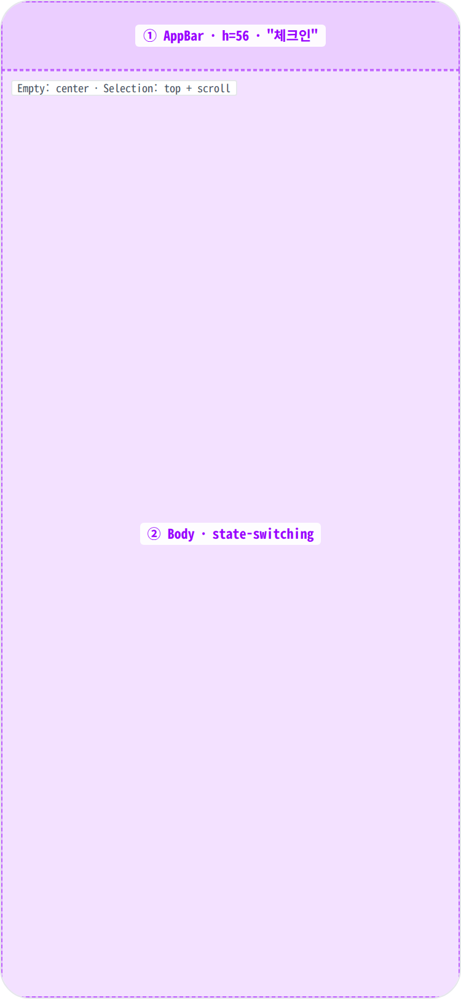
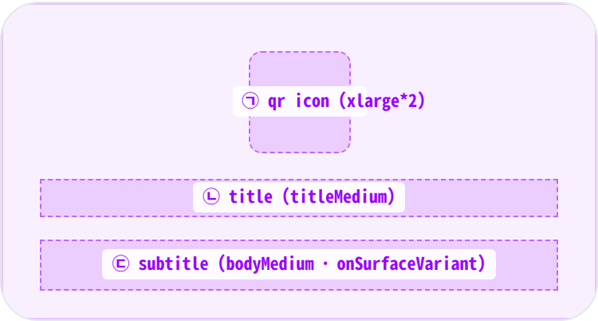
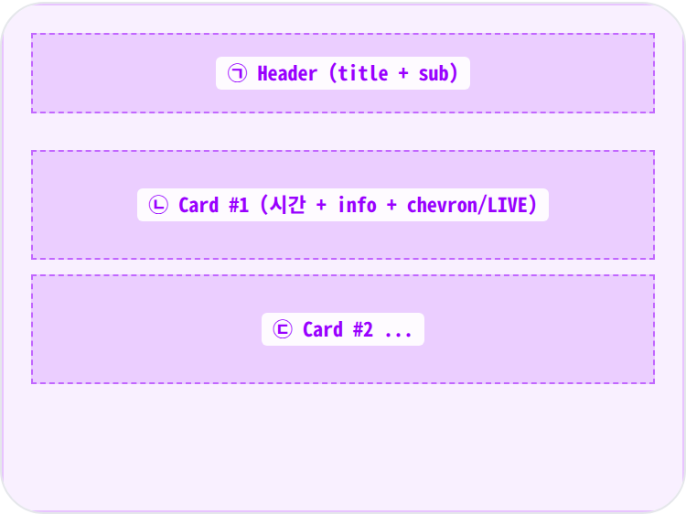
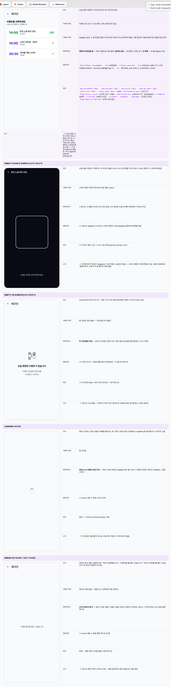

 Spec — CheckinPlaceholderPage (app\_partner · CheckinTabRoute)  

# 체크인 진입

## Overview

| Status | ✅ 디자인완료 |
|---|---|
| App | app_partner |
| Category | checkin (탭) |
| Route / Surface | CheckinPlaceholderPage — Bottom nav 체크인 탭 직접 자식 (route라기보다 IndexedStack child) |
| Path | — (탭 자식 · URL 없음, parent shell이 /partner/home) |
| Hierarchy | Parent: PartnerHomePage shell의 BottomNavBar 체크인 탭Children: QRScannerScreen (탐색 시작점 · 별도 화면) |
| Purpose | 파트너가 체크인 탭을 누르는 순간 오늘 진행 예정 이벤트 수에 따라 자동으로 다른 화면을 보여준다 — 이벤트가 없으면 안내, 1개면 즉시 스캐너, 2개 이상이면 선택 목록. 단순 진입 마찰을 줄여 가장 흔한 1-event 케이스에서 별도 선택 없이 바로 스캔 가능. |
| User journey | Entry points: 파트너 홈의 하단 체크인 탭 진입.Exit points: 이벤트 1개일 땐 곧장 다크 테마 스캐너 화면으로 진입. 2개 이상일 땐 카드 선택 후 스캐너로 이동. 이벤트가 없으면 다른 탭으로만 이탈. |
| Background | 파트너가 운영일에 체크인 탭을 누를 때 가장 잦은 시나리오는 "오늘 1 이벤트". 매번 선택 화면을 거치게 하면 마찰이 커서 1개일 때는 자동으로 스캐너에 진입. "오늘"의 기준은 시작 3시간 전부터 종료 1시간 후까지의 윈도우. |
| Frequency | 운영일에 매 진입마다 (체크인 시작/중간 중) |

## History

| Date | Version | Author | Changes |
|---|---|---|---|
| 2026-05-01 | 1.0 | mark-yun | v1.4 template 신규 작성. 5개 state enumerate (Loading / Error / Empty 0events / Direct-scan 1event / Selection 2+events). 오늘 이벤트 수에 따른 자동 분기 동작을 state별로 풀어 명시. |

[🧱 Layout](#layout) [🎨 States](#states) [🔄 Global Behavior](#global-behavior) [📖 Reference](#reference)

🧱

## Layout

파트너 정보를 불러오고 오늘 예정 이벤트 수(0 / 1 / 2+)에 따라 화면이 갈린다. state별 레이아웃이 완전히 다름.

## Blueprint & tree

모든 state는 simpleAppBar('체크인') + body. body 형태가 state별로 갈림 — Empty(중앙 정렬 컬럼) / Selection(상단 헤더 + ListView) / 1-event는 자체 화면 push라 본 페이지 잔영 없음.

**Scaffold** └─ **AppBar**('체크인') ← ① └─ **body**: 데이터 단계별 분기 ← ② ├─ 로딩 → 중앙 스피너 ├─ 에러 → 중앙 평문 텍스트 └─ 결과 (오늘 이벤트 수에 따라) · 1개 → 다크 테마 스캐너 화면이 본 화면을 대체 · 0개 → 빈 안내 화면 (중앙 정렬) · 2+개 → 선택 리스트 화면 (헤더 + 카드)

## Spacing & alignment rules

| # | Region | Alignment | Spacing |
|---|---|---|---|
| ① | AppBar | title leading + back | height: 56 |
| ② (Empty) | Empty body | main + cross axis: center · MainAxisSize.min | padding all spacing-large (24px) · gaps: spacing-medium (16px) + spacing-small (8px) |
| ② (Selection) | Selection body | crossAxis: start (header) · ListView fills below | padding all spacing-medium (16px) · header↔list spacing-medium (16px) · ListView separator spacing-small (8px) |

## Sub-anatomy ① — Empty body (0 events)

중앙 Column(MainAxisSize.min) — qr\_code\_scanner Icon (xlarge\*2 ≈ 64) → spacing-medium → titleMedium ("오늘 예정된 이벤트가 없습니다") → spacing-small → bodyMedium 부연 ("이벤트 당일에 체크인을 시작할 수 있어요"). 부연은 onSurfaceVariant + textAlign.center.

**중앙 정렬 영역** └─ **Padding**(`spacing-large (24px)`) └─ **Column** (꼭 필요한 만큼만 차지) ├─ **QR 아이콘**(64 · 보조 색상) ← ㉠ ├─ Gap: `spacing-medium (16px)` ├─ **Text**(titleMedium · 오늘 예정된 이벤트가 없습니다) ← ㉡ ├─ Gap: `spacing-small (8px)` └─ **Text**(bodyMedium · 보조 색상 · 중앙 정렬) ← ㉢

## Sub-anatomy ② — Selection list (2+ events)

상단 헤더(titleMedium w800 + bodySmall 카운트) → spacing-medium → Expanded(ListView.separated). 각 카드는 Card(InkWell) — Row(시간 큰 타이포 + Expanded 정보 + LIVE 배지 OR chevron).

**Padding**(all `spacing-medium (16px)`) └─ **Column**(좌측 정렬) ├─ _Header_ ← ㉠ │ ├─ **Text**(titleMedium · w800 · "이벤트를 선택하세요") │ └─ **Text**(bodySmall · "오늘 N개 이벤트가 진행됩니다") ├─ Gap: `spacing-medium (16px)` │ └─ **스크롤 리스트** ← ㉡㉢... · 카드 사이 간격: `spacing-small (8px)` · 각 카드: 라운드 + 터치 ripple + Padding(`spacing-medium (16px)`) + Row ├─ **시간**('HH:mm' · titleLarge · w900 · LIVE면 success / 그 외 primary) ├─ Gap: `spacing-sm (12px)` ├─ **가변 영역** │ ├─ **제목**(titleSmall · 파티 또는 이벤트 이름) │ └─ **참여 인원**(bodySmall · "current/max 명") └─ LIVE면 LIVE 배지 (success bg + success label), 그 외엔 chevron 화살표

🎨

## States

5종 — 파트너/이벤트 데이터 로딩 단계 + 오늘 이벤트 수에 따른 3-way 분기. baseline은 Selection (2+events) — 가장 정보 풍부한 케이스.

### State summary

| State | Tag | 조건 (요약) | Key visual differentiator |
|---|---|---|---|
| Selection (2+ events) 🎯 | baseline | 오늘 예정 이벤트 2개 이상 | 상단 헤더 + 시간순 카드 리스트 · LIVE 배지 가능 |
| Direct scan (1 event) | auto-route | 오늘 예정 이벤트 1개 | 본 화면에 머무르지 않고 즉시 다크 테마 스캐너로 진입 |
| Empty (0 events) | no events | 오늘 예정 이벤트 없음 | 중앙 QR 아이콘 + 안내 문구 풀-페이지 |
| Loading | async | 파트너/이벤트 데이터 로딩 중 | 중앙 스피너 단독 |
| Error | fail | 데이터 로딩 실패 | 중앙 평문 에러 텍스트 (재시도 CTA 없음) |

🔄

## Global Behavior

하단 탭의 자식 화면으로서 진입/이탈 + 데이터 갱신 동작.

## Cross-cutting interactions

| 사용자 액션 | 화면에 보이는 결과 |
|---|---|
| 체크인 탭 진입 | 데이터를 다시 조회 → 로딩 → 결과/에러/빈 상태 중 하나로 분기. |
| 다른 탭으로 이탈 | 잠시 캐시가 유지되어 짧은 시간 내 재진입 시 빠르게 복원. |
| OS 뒤로가기 (Android) | 본 화면은 탭의 자식이라 무시됨 — 앱 종료 또는 셸 이전 화면으로. |
| 스캐너에서 뒤로가기 | 본 페이지로 복귀. 1-event 자동 진입 케이스에서는 이때 본 페이지를 처음 보게 됨. |

## Motion & timing

| Token | Value | Use case |
|---|---|---|
| MinglitAnimation.fast | 200ms | 스캐너 화면 진입 (1-event 자동) |
| MinglitAnimation.medium | 350ms | 로딩 ↔ 결과 크로스페이드 |

| Transition | Duration (token) | Curve / notes |
|---|---|---|
| 탭 진입 → 로딩 → 결과 | medium (350ms) | 크로스페이드 전환 |
| 1-event 자동 → 스캐너 | fast (200ms) | Material slide push |
| 카드 리플 (Selection) | micro (100ms) | Material 기본 ripple |

## Global edge cases

-   **네트워크 끊김** — 이벤트 조회 실패 → "이벤트를 불러올 수 없습니다" 평문 텍스트. 재시도 버튼 없음 (디자인 부채).
-   **오늘 윈도우 경계** — 시작 3시간 전부터 종료 1시간 후까지. 자정 이후도 같은 "오늘"로 잡힐 수 있음.
-   **다크 모드** — 본 페이지는 라이트/다크 자동. 단, 1-event 분기로 진입한 스캐너 화면은 항상 다크.
-   **접근성** — 빈 상태/에러 메시지는 자동으로 읽힘. 큰 아이콘은 장식용으로 처리 권장 (현재 미적용).

📖

## Reference

Implementation source + 인접 화면.

## Implementation source

| 항목 | Path / Reference |
|---|---|
| Widget class | CheckinPlaceholderPage (ConsumerWidget) |
| File path | apps/app_partner/lib/src/features/checkin/checkin_placeholder_page.dart |
| Provider | currentPartnerInfoProvider · todayEventsProvider(partnerId) (FutureProvider.family.autoDispose) |
| Internal widgets | _CheckinEntryPage · _ScannerWrapper · _CheckinSelectionPage |
| Route | — (BottomNav 탭 자식 — IndexedStack child of partner shell) |

## Related screens

| Spec | Relation |
|---|---|
| PartnerHomePage | Sibling — BottomNav 같은 shell의 다른 탭. |
| EventCheckInScreen | 관련 — 사용자측 체크인 화면 (역할 반대). |
| EventCheckedInScreen | 관련 — 체크인 완료 후 사용자 화면. |