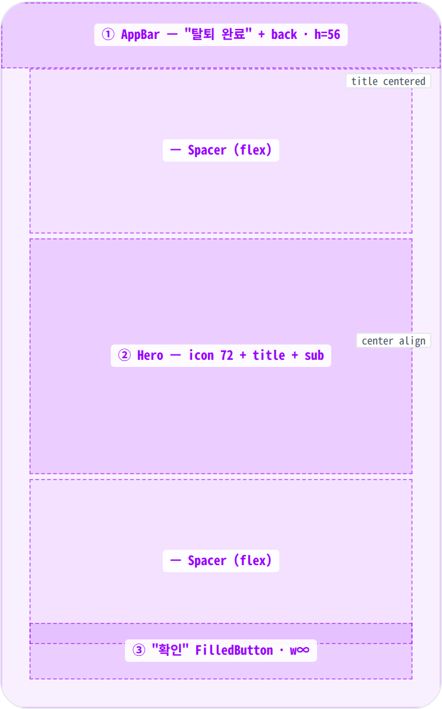
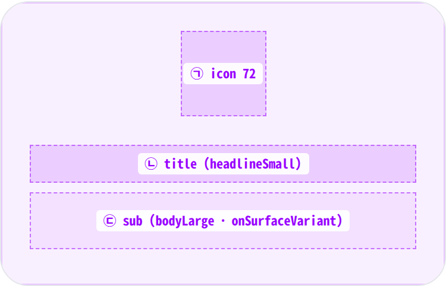
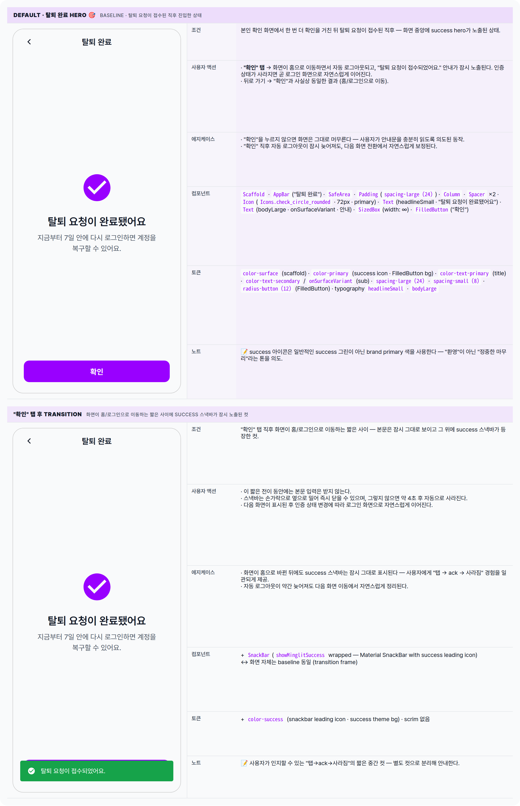

 Spec — DeletionCompletePage (app\_user · DeletionCompleteRoute)  

# Deletion Complete Page

## Overview

| Status | 디자인완료 — wizard step 4/4 · 2 state (default + transition) |
|---|---|
| App | app_user |
| Category | account · privacy · destructive · wizard-step · confirmation |
| Route / Surface | DeletionCompleteRoute — DeletionCompletePage (no params) |
| Path | /my/privacy/delete/complete |
| Hierarchy | Parent: DeletionVerifyPage — coordinator.goComplete()로 stack 교체.Children: — (terminal screen — "확인" 탭 시 home으로 go + signOut + success snackbar) |
| Purpose | 탈퇴 요청 wizard의 마지막 단계 — 요청이 정상 접수되었음을 확인하고 사용자에게 작별을 인사한다. 7일 grace period 정보를 한 번 더 상기시켜 사용자가 마음을 바꿀 수 있는 마지막 mental anchor를 제공. |
| User journey | Entry points: 본인 확인 화면에서 한 번 더 확인을 거쳐 탈퇴 요청이 접수된 직후 진입.Exit points: ① "확인" 탭 → 홈으로 이동하면서 자동 로그아웃되고, 잠시 "탈퇴 요청이 접수되었어요." 안내가 노출된다 · ② 시스템 뒤로 가기 → 사실상 동일한 결과 (홈/로그인으로 자동 이동). |
| Background | 탈퇴는 되돌리기 어려운 액션이라 별도의 마무리 화면을 둔다 — 사용자가 "내가 정말 했구나"를 시각적으로 매듭짓도록. 큰 success 아이콘 + 짧은 메시지 + 7일 복구 안내(reassurance) 패턴은 다른 wizard 종료 화면과 동일한 톤. |
| Frequency | 매우 낮음 — 계정당 ≤ 1회 (탈퇴 요청 성공 시). |

## History

이 spec의 주요 변경 이력. 최신 항목 위.

| Date | Version | Author | Changes |
|---|---|---|---|
| 2026-05-01 | 1.0 | mark-yun | v1.4 template으로 작성. wizard step 4/4 · 2 state — Default(success hero) baseline · "확인" 탭 후 transition(snackbar). appCoordinatorProvider.goToHome() + authControllerProvider.signOut() + showMinglitSuccess 매핑. |

[🧱 Layout](#layout) [🎨 States](#states) [🔄 Global Behavior](#global-behavior) [📖 Reference](#reference)

🧱

## Layout

AppBar(title) + 단일 Padded Column with 2 Spacers — center hero(success icon + title + sub) + bottom CTA. 다른 wizard 단계와 달리 ListView/Expanded 구조 없음.

## Blueprint & tree

Scaffold + AppBar("탈퇴 완료") + SafeArea Padding(`spacing-large (24)`) Column. _Spacer + hero(icon + title + sub) + Spacer + FilledButton_ 패턴 — hero를 화면 vertical center로, CTA를 하단으로 균등 분리. AppBar는 닫기/뒤로 가기 default leading 사용 (back 버튼 노출).

**Scaffold** └─ **AppBar**(_title: Text("탈퇴 완료")_) ← ① └─ **SafeArea** └─ **Padding**(`spacing-large (24)` all) └─ **Column** ├─ **Spacer**() ├─ _hero stack_ ← ② │ ├─ **Icon**(_Icons.check\_circle\_rounded_, size: 72, color: `color-primary`) │ ├─ SizedBox(`spacing-large (24)`) │ ├─ **Text**("탈퇴 요청이 완료됐어요", headlineSmall, center) │ ├─ SizedBox(`spacing-small (8)`) │ └─ **Text**("지금부터 7일 안에 다시 로그인하면 계정을 복구할 수 있어요.", bodyLarge · onSurfaceVariant, center) ├─ **Spacer**() └─ **SizedBox**(width: ∞) ← ③ └─ **FilledButton**("확인" · onPressed: \_finish)

| # | Region | Alignment | Spacing |
|---|---|---|---|
| — | Body padding | — | Padding spacing-large (24) all sides |
| ① | AppBar | title centered · leading back auto | height 56 · scaffold gray bg · border-bottom 없음 |
| ② | Hero — icon + title + sub | Column center (axis cross + text align center) | icon ↔ title 사이 SizedBox spacing-large (24) · title ↔ sub 사이 SizedBox spacing-small (8) |
| ③ | Bottom CTA | full width · single FilledButton | FilledButton height 48 · Spacer로 hero와 분리 |
| — | Spacer × 2 | flex 1 each | hero를 vertical center에 위치시키고 CTA를 하단으로 push — Column 내부 동등 분배 |

## Sub-anatomy ① — Hero (icon + title + sub)

success 확인 패턴. 큰 primary 색 체크 아이콘(72px)이 시각적 앵커 — 그 아래 제목 + 부제. 모든 텍스트는 가운데 정렬이며, 부제는 한 단계 톤 다운된 색.

**Column** ├─ **Icon**(check\_circle\_rounded, size: 72, color: `color-primary`) ← ㉠ ├─ SizedBox(`spacing-large (24)`) ├─ **Text**("탈퇴 요청이 완료됐어요", headlineSmall · center) ← ㉡ ├─ SizedBox(`spacing-small (8)`) └─ **Text**("지금부터 7일 안에 …", bodyLarge · onSurfaceVariant · center) ← ㉢

| # | Element | Alignment | Spacing / tokens |
|---|---|---|---|
| ㉠ | success icon | horizontal center | 72px · color color-primary (purple) · Material rounded variant |
| ㉡ | title | center · single or 2 lines | typography headlineSmall · color text-primary |
| ㉢ | sub | center · multiline (max-width effectively constrained by Padding 24) | typography bodyLarge · color onSurfaceVariant (text-secondary) · 1.5 line-height (default) |

🎨

## States

2가지 시각 변형 — baseline = 진입 직후(success hero) · "확인" 탭 후 전이 컷(success 스낵바가 보이며 홈/로그인으로 이동). 데이터 fetch는 없다.

**State 식별 기준**: ① 진입 직후 — 사용자가 hero를 보고 안내문을 읽는 단계 (baseline) · ② "확인" 탭 직후의 전이 — 화면이 홈/로그인으로 바뀌는 짧은 사이에 success 스낵바가 잠시 노출되는 컷.

🔄

## Global Behavior

cross-cutting — 모든 state에 적용되는 액션 / motion / global edge cases.

## Cross-cutting interactions

| 사용자 액션 | 화면에 보이는 결과 |
|---|---|
| 뒤로 가기 (시스템 / AppBar) | 이 화면은 wizard의 마지막 단계라 이전 단계로 돌아갈 수 없다 — "확인"과 사실상 동일하게 홈/로그인으로 이동한다. |
| "확인" 탭 | 항상 활성. 화면이 홈으로 이동하면서 자동 로그아웃되고 success 스낵바가 잠시 노출된다. |
| "확인" 탭 피드백 | 탭 시 짧은 ripple 피드백. |
| 다크 모드 토글 | 배경/텍스트는 다크 토큰으로 자동 전환되고, primary 색은 동일하게 유지된다. |
| 화면 전이 후 스낵바 보존 | 홈으로 화면이 바뀐 뒤에도 success 스낵바는 약 4초 동안 그대로 노출된다. |

## Motion & timing

Source: `shared/packages/mds/core/lib/src/theme/minglit_design_tokens.dart` → `MinglitAnimation`.

| Token | Value | Use |
|---|---|---|
| MinglitAnimation.micro | 100ms | "확인" 탭 ripple. |
| MinglitAnimation.fast | 200ms | 화면 진입 / 홈으로의 전환 / 로그인 화면으로의 자동 이동. |
| (시스템 기본) 스낵바 | ~250ms | 스낵바 등장과 사라짐 — 약 4초 후 자동으로 사라짐. |

| Transition | Duration (token) | Curve / notes |
|---|---|---|
| 이전 단계 → 이 화면 진입 | fast (200ms) | 스택을 교체하는 전환. |
| "확인" → 홈 | fast (200ms) | 홈으로 화면을 교체. |
| 자동 로그아웃 → 로그인 | fast (200ms) | 인증 상태 변경에 따라 로그인 화면으로 자연스럽게 이동. |
| 스낵바 등장 / 사라짐 | ~250ms | 약 4초 동안 노출. |

## Global edge cases

-   **Loading / Error 상태 없음** — 이 화면은 데이터를 불러오지 않으며, "확인" 직후의 후속 동작은 사용자에게 별도 에러로 보이지 않는다.
-   **다크 모드** — 배경/텍스트/아이콘은 다크 토큰으로 자동 전환되고, primary 색은 그대로 유지된다.
-   **접근성** — 제목은 강조해서 안내되고, success 아이콘은 장식으로 처리되어 별도로 안내되지 않는다.
-   **화면 회전** — hero는 항상 화면의 세로 가운데에, "확인" 버튼은 하단에 위치한다.
-   **자동 로그아웃 실패** — 자동 로그아웃이 실패해도 화면은 이미 홈으로 이동한 상태라 사용자에게 보이는 변화는 없으며, 이후의 작업에서 자연스럽게 보정된다.

📖

## Reference

Implementation source + 인접 화면 link. Components / Tokens는 위 mini-table에 분산.

## Implementation source

| 항목 | Path / Reference |
|---|---|
| Widget class | DeletionCompletePage · ConsumerWidget |
| File path | apps/app_user/lib/src/features/account_deletion/ui/deletion_complete_page.dart |
| App coordinator | appCoordinatorProvider.goToHome() · app_coordinator.dart |
| Auth controller | authControllerProvider.notifier.signOut() · minglit_kit auth controller |
| Success snackbar | context.showMinglitSuccess('탈퇴 요청이 접수되었어요.') · minglit_kit (root ScaffoldMessenger) |
| Route | DeletionCompleteRoute · path: /my/privacy/delete/complete · app_routes.dart |

## Related screens

| Spec | Relation |
|---|---|
| DeletionReasonPage | Step 1/4 — 사유 선택. |
| DeletionInfoPage | Step 2/4 — 안내. |
| DeletionVerifyPage | Previous step (3/4) — coordinator.goComplete로 진입. |
| LoginPage | signOut 직후 도착지 — auth state 변동에 의한 redirect. |