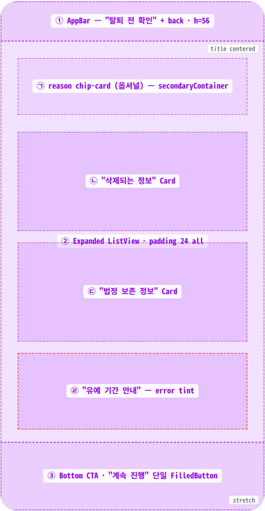
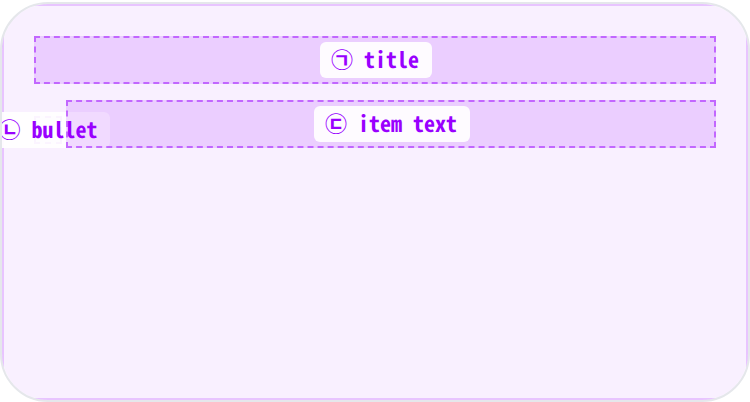
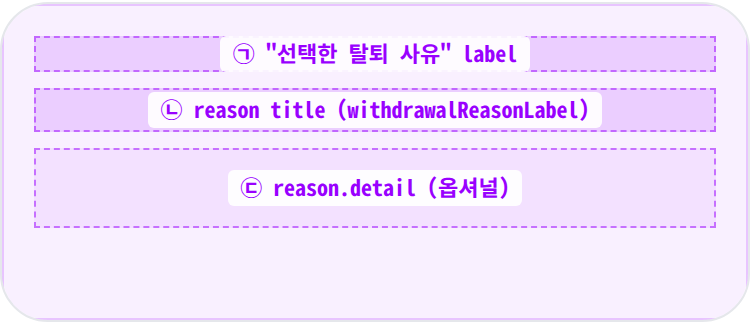
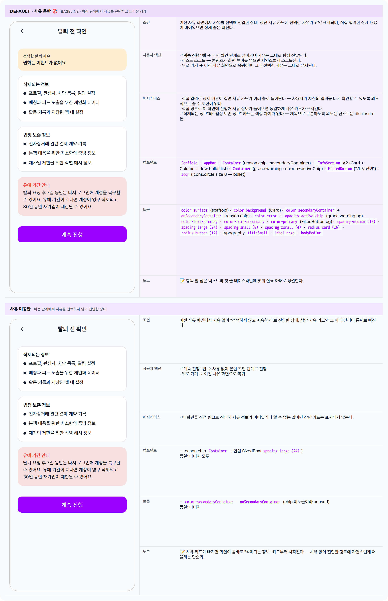

 Spec — DeletionInfoPage (app\_user · DeletionInfoRoute)  

# Deletion Info Page

## Overview

| Status | 디자인완료 — wizard step 2/4 · 2 state (with/without reason) |
|---|---|
| App | app_user |
| Category | account · privacy · destructive · wizard-step · disclosure |
| Route / Surface | DeletionInfoRoute — DeletionInfoPage({reasonCode, reasonText}) (둘 다 옵셔널) |
| Path | /my/privacy/delete/info · query: ?reasonCode=&reasonText= |
| Hierarchy | Parent: DeletionReasonPage — coordinator.pushInfo()로 push.Children: DeletionVerifyPage (다음 단계, "계속 진행" → coordinator.pushVerify()) |
| Purpose | 탈퇴 wizard의 두번째 단계 — 삭제되는 정보 / 법정 보존 정보 / 7일 유예 기간을 사용자에게 명시적으로 보여주는 disclosure 화면. ReasonPage에서 받은 사유는 상단에 요약 표시한다 (사유 미선택이면 그 카드 자체가 빠짐). |
| User journey | Entry points: 사유 화면의 두 CTA — "다음"(사유 동반) · "선택하지 않고 계속하기"(사유 없이).Exit points: ① "계속 진행" 탭 → 다음 단계(본인 확인) — 사유는 그대로 다음 단계로 전달 · ② 뒤로 가기 → 이전 사유 화면으로 복귀 (이전 선택은 유지된다). |
| Background | 개인정보 처리방침 컴플라이언스에 따라, 탈퇴 직전 "어떤 데이터가 어떻게 되는지"를 분명히 안내한다 — 삭제 대상 / 법정 보존 대상 / 7일 유예 기간(복구 가능)을 세 개의 분리된 시각 블록으로 제시한다. 유예 기간 카드만 error 톤으로 강조해 "7일 복구 창이 있다"는 신호와 함께 "30일 재가입 제한"이라는 약한 deterrent를 함께 전달한다. |
| Frequency | 매우 낮음 — 탈퇴 wizard 진입 시 1회. |

## History

이 spec의 주요 변경 이력. 최신 항목 위.

| Date | Version | Author | Changes |
|---|---|---|---|
| 2026-05-01 | 1.0 | mark-yun | v1.4 template으로 작성. wizard step 2/4 · 2 state — Default(reason 동반, baseline) · reason 미선택. 3개 정보 블록(삭제되는 정보 / 법정 보존 정보 / 유예 기간) + 옵셔널 reason chip-card 매핑. buildWithdrawalReason으로 query 정규화 + 상단 chip 노출 로직. |

[🧱 Layout](#layout) [🎨 States](#states) [🔄 Global Behavior](#global-behavior) [📖 Reference](#reference)

🧱

## Layout

AppBar(title) + Expanded ListView(옵셔널 reason chip · 삭제 정보 카드 · 보존 정보 카드 · 유예 기간 warning) + Bottom CTA(단일 FilledButton).

## Blueprint & tree

Scaffold + AppBar("탈퇴 전 확인") + SafeArea Column. body는 _Expanded(ListView, padding 24) + Bottom Padding(24/8/24/24) FilledButton_. reason이 null이면 상단 chip-card가 통째로 빠진다 (conditional spread). 정보 블록 두 개(`_InfoSection`)는 Material `Card`로 감싼 bullet list. 유예 기간은 `error.withAlpha(activeChip)`으로 tinted Container.

**Scaffold** └─ **AppBar**(_title: Text("탈퇴 전 확인")_) ← ① └─ **SafeArea** └─ **Column** ├─ **Expanded** ← ② │ └─ **ListView**(padding: `spacing-large (24)`) │ ├─ _if reason != null:_ ← ㉠ │ │ ├─ **Container**(_secondaryContainer · radius-card_) │ │ │ └─ Column │ │ │ ├─ Text("선택한 탈퇴 사유", labelLarge · onSecondaryContainer) │ │ │ ├─ SizedBox(`spacing-xsmall (4)`) │ │ │ ├─ Text(_withdrawalReasonLabel(reason.reasonCode)_, titleSmall) │ │ │ └─ _if reason.detail != null:_ │ │ │ ├─ SizedBox(`spacing-xsmall (4)`) │ │ │ └─ Text(reason.detail!) │ │ └─ SizedBox(`spacing-large (24)`) │ │ │ ├─ **\_InfoSection**("삭제되는 정보", \[...3 items\]) ← ㉡ │ ├─ SizedBox(`spacing-medium (16)`) │ ├─ **\_InfoSection**("법정 보존 정보", \[...3 items\]) ← ㉢ │ ├─ SizedBox(`spacing-medium (16)`) │ │ │ └─ **Container**(_error α=activeChip · radius-card_) ← ㉣ │ └─ Column │ ├─ Text("유예 기간 안내", titleSmall · color: error) │ ├─ SizedBox(`spacing-xsmall (4)`) │ └─ Text("탈퇴 요청 후 7일 동안은 다시 로그인해 …", bodyMedium) │ └─ **Padding**(24, 8, 24, 24) ← ③ └─ **SizedBox**(width: ∞) └─ **FilledButton**("계속 진행" · onPressed: pushVerify(reason))

| # | Region | Alignment | Spacing |
|---|---|---|---|
| — | Body padding | — | ListView padding spacing-large (24) all sides |
| ① | AppBar | title centered · leading back auto | height 56 · scaffold gray bg · border-bottom 없음 |
| ② | ListView body | vertical scroll · 카드 stack | section 사이 SizedBox spacing-medium (16) |
| ㉠ | reason chip-card (옵셔널) | start-aligned column | padding spacing-medium (16) · radius radius-card (16) · 인접 SizedBox spacing-large (24) |
| ㉡㉢ | InfoSection Card | start · bullet list | Card padding spacing-medium (16) · 항목 사이 SizedBox spacing-small (8) |
| ㉣ | 유예 기간 안내 | start | error α=activeChip bg · padding spacing-medium (16) · radius radius-card (16) |
| ③ | Bottom CTA | full width · single button | Padding(24, 8, 24, 24) · 단일 FilledButton |

## Sub-anatomy ① — \_InfoSection (Card + bullet list)

두 정보 카드(삭제되는 정보 / 법정 보존 정보)가 동일 internal widget(`_InfoSection`) 사용. title(`titleSmall`) + bullet list — 각 row는 Row(8px circle bullet + 8px gap + Expanded Text).

**Card** └─ **Padding**(`spacing-medium (16)`) └─ **Column**(crossAxis: start) ├─ **Text**(title, titleSmall) ← ㉠ ├─ SizedBox(`spacing-small (8)`) └─ _for item in items_ ├─ **Row**(crossAxis: start) │ ├─ **Padding**(top: 6) → **Icon**(circle, size: 8) ← ㉡ │ ├─ SizedBox(`spacing-small (8)`) │ └─ **Expanded**(**Text**(item)) ← ㉢ └─ SizedBox(`spacing-small (8)`)

| # | Element | Alignment | Spacing / tokens |
|---|---|---|---|
| ㉠ | section title | start · single line | typography titleSmall · color text-primary |
| ㉡ | bullet | top 6 padding · 좌측 | Material Icon(Icons.circle, size: 8) · color text-primary (default) |
| ㉢ | item text | Expanded · start · multiline | typography bodyMedium · color text-primary |
| — | row gap | — | SizedBox spacing-small (8) 사이 |

## Sub-anatomy ② — Reason chip-card (옵셔널)

ReasonPage에서 사유를 선택하고 왔을 때만 노출. `secondaryContainer` bg + `onSecondaryContainer` label color. detail이 있으면 한 줄 더 추가.

**Container**(secondaryContainer · radius-card) └─ **Padding**(`spacing-medium (16)`) └─ **Column**(crossAxis: start) ├─ **Text**("선택한 탈퇴 사유", labelLarge · onSecondaryContainer) ← ㉠ ├─ SizedBox(`spacing-xsmall (4)`) ├─ **Text**(_withdrawalReasonLabel(reasonCode)_, titleSmall) ← ㉡ └─ _if detail != null:_ ← ㉢ ├─ SizedBox(`spacing-xsmall (4)`) └─ **Text**(reason.detail!)

| # | Element | Alignment | Spacing / tokens |
|---|---|---|---|
| ㉠ | "선택한 탈퇴 사유" label | start | typography labelLarge · color onSecondaryContainer |
| ㉡ | reason title | start | typography titleSmall · color text-primary |
| ㉢ | reason detail (옵셔널) | start · multiline | typography bodyMedium default · 간격 SizedBox spacing-xsmall (4) |

🎨

## States

2가지 시각 변형 — baseline = 사유 동반(상단 사유 카드 노출). 사유 없이 진입한 경우는 상단 카드만 빠진 단순 변형. 데이터 fetch가 없어 Loading/Error 상태는 다루지 않는다.

**State 식별 기준**: ① 이전 단계에서 사유를 골라 진입 — 상단에 사유 카드 노출 · ② 사유 없이 진입 — 상단 카드 미노출. 이 화면은 데이터를 불러오지 않으며 위 두 분기 외 다른 상태는 없다.

🔄

## Global Behavior

cross-cutting — 모든 state에 적용되는 액션 / motion / global edge cases.

## Cross-cutting interactions

| 사용자 액션 | 화면에 보이는 결과 |
|---|---|
| 뒤로 가기 (시스템 / AppBar) | 이전 사유 화면으로 복귀하며, 그때 선택했던 사유는 그대로 유지된다. |
| "계속 진행" 탭 | 모든 상태에서 항상 활성 — 비활성 분기 없음. 본인 확인 단계로 사유와 함께 진행. |
| 스크롤 | 긴 텍스트일 때 본문이 자연스럽게 스크롤. 하단 CTA 영역은 안전 영역 하단에 항상 고정. |
| "계속 진행" 탭 피드백 | 탭 시 짧은 ripple 피드백. |
| 다크 모드 토글 | 배경/카드/유예 기간 안내 모두 다크 토큰으로 자동 전환. error 톤은 다크에서도 동일하게 유지된다. |

## Motion & timing

Source: `shared/packages/mds/core/lib/src/theme/minglit_design_tokens.dart` → `MinglitAnimation`.

| Token | Value | Use |
|---|---|---|
| MinglitAnimation.micro | 100ms | "계속 진행" 탭 ripple. |
| MinglitAnimation.fast | 200ms | 다음 단계로의 화면 전환. |

| Transition | Duration (token) | Curve / notes |
|---|---|---|
| 이전 단계 → 이 화면 진입 | fast (200ms) | 표준 좌→우 slide 전환. |
| "계속 진행" → 본인 확인 | fast (200ms) | 표준 좌→우 slide 전환. |
| 본문 스크롤 | — | 플랫폼 표준 스크롤 동작 (iOS bounce / Android clamp). |

## Global edge cases

-   **Loading / Error 상태 없음** — 이 화면은 데이터를 불러오지 않으며, 안내 텍스트는 항상 동일하게 노출된다.
-   **다크 모드** — 사유 카드와 유예 기간 안내의 컬러 톤은 다크에서도 contrast가 유지되도록 자동 전환된다.
-   **접근성** — 항목 앞 점은 의미 없는 장식으로 처리되며, 스크린 리더는 본문 텍스트만 읽는다.
-   **긴 입력 사유** — 직접 입력한 상세 사유가 길면 사유 카드가 여러 줄로 늘어나며, 본문이 자연스럽게 스크롤된다.
-   **직접 링크 진입** — 사유 정보 없이 이 화면을 직접 열면 사유 카드가 빠진 단순 상태로 렌더된다.

📖

## Reference

Implementation source + 인접 화면 link. Components / Tokens는 위 mini-table에 분산.

## Implementation source

| 항목 | Path / Reference |
|---|---|
| Widget class | DeletionInfoPage · ConsumerWidget |
| File path | apps/app_user/lib/src/features/account_deletion/ui/deletion_info_page.dart |
| Helper widget | _InfoSection (file 내부 private — Card + bullet list) |
| Coordinator | accountDeletionCoordinatorProvider · pushVerify({reason}) · account_deletion_coordinator.dart |
| Reason normalize | buildWithdrawalReason({reasonCode, reasonText}) · withdrawalReasonLabel(code) · account_deletion_flow.dart |
| Route | DeletionInfoRoute({reasonCode?, reasonText?}) · path: /my/privacy/delete/info · app_routes.dart |

## Related screens

| Spec | Relation |
|---|---|
| DeletionReasonPage | Previous step (1/4) — coordinator.pushInfo로 진입. |
| DeletionVerifyPage | Next step (3/4) — "계속 진행" → coordinator.pushVerify(). |
| DeletionCompletePage | Final step (4/4) — VerifyPage에서 success 후. |
| PrivacyPage | Wizard 진입 surface. |