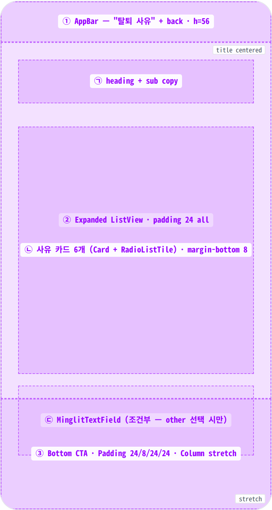
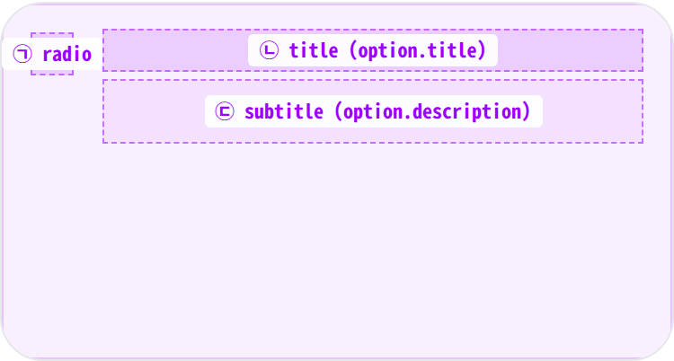
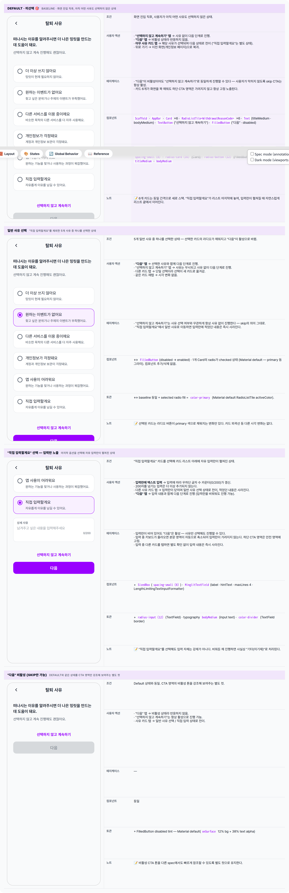

 Spec — DeletionReasonPage (app\_user · DeletionReasonRoute)  

# Deletion Reason Page

## Overview

| Status | 디자인완료 — wizard step 1/4 · 4 state |
|---|---|
| App | app_user |
| Category | account · privacy · destructive · wizard-step |
| Route / Surface | DeletionReasonRoute — DeletionReasonPage |
| Path | /my/privacy/delete/reason |
| Hierarchy | Parent: PrivacyPage "회원 탈퇴" 행 → accountDeletionCoordinator.start() push.Children: DeletionInfoPage (다음 단계 — 사유와 함께 / 또는 미선택 push) · DeletionVerifyPage (step 3) · DeletionCompletePage (step 4) |
| Purpose | 탈퇴 wizard의 첫 단계 — 사용자가 떠나는 이유를 선택하게 한다 (선택 자체는 옵셔널). 제품 개선 시그널 수집과 동시에 "잠시 멈추고 한 번 더 생각해보는" 마찰을 의도적으로 만들어준다. |
| User journey | Entry points: 개인정보 페이지의 "회원 탈퇴" 항목 탭으로 진입.Exit points: ① "선택하지 않고 계속하기" 탭 → 사유 없이 다음 단계 · ② 사유 선택 + "다음" 탭 → 선택한 사유와 함께 다음 단계 · ③ 뒤로 가기 → 개인정보 페이지로 복귀. |
| Background | 개인정보 삭제 정책 컴플라이언스 요건상 탈퇴 사유 수집은 강제가 아니다 — "선택하지 않고 계속하기" CTA를 동등한 무게로 배치한 이유. 6개 사유는 제품 관점의 분류(사용 빈도 / 이벤트 / 대안 서비스 / 개인정보 / 사용성 / 기타)이며, 향후 retention 분석에 활용된다. "직접 입력할게요"는 최대 200자 · 옵셔널 — "다음"은 사유 선택만으로 활성화되고, 상세 입력은 비워두어도 진행할 수 있다. |
| Frequency | 매우 낮음 — 계정당 ≤ 1회 (탈퇴 wizard 진입 시). |

## History

이 spec의 주요 변경 이력. 최신 항목 위.

| Date | Version | Author | Changes |
|---|---|---|---|
| 2026-05-01 | 1.0 | mark-yun | v1.4 template으로 작성. wizard step 1/4 · 4 state mini-table — Default(미선택) baseline · 일반 사유 선택 · "직접 입력할게요" 선택(MinglitTextField 노출) · "다음" 비활성. coordinator API(pushInfo({reason})) · 6개 사유 옵션(accountDeletionReasonOptions) 매핑 반영. |

[🧱 Layout](#layout) [🎨 States](#states) [🔄 Global Behavior](#global-behavior) [📖 Reference](#reference)

🧱

## Layout

AppBar(title) + Expanded ListView(사유 카드 6개 + 옵셔널 textfield) + Bottom CTA(skip + next 2버튼).

## Blueprint & tree

Scaffold + AppBar("탈퇴 사유") + SafeArea Column. body는 _Expanded(ListView, padding 24) + Bottom Padding(24/8/24/24) Column_. 사유 카드는 Material `Card`(margin-bottom 8)로 감싼 `RadioListTile`. "직접 입력할게요" 선택 시에만 카드 리스트 아래로 `MinglitTextField`(maxLines 4 · 200자 limit)이 펼쳐진다.

**Scaffold** └─ **AppBar**(_title: Text("탈퇴 사유")_) ← ① └─ **SafeArea** └─ **Column** ├─ **Expanded** ← ② │ └─ **ListView**(padding: `spacing-large (24)` all) │ ├─ _heading group_ ← ㉠ │ │ ├─ Text("떠나시는 이유를…", titleMedium) │ │ ├─ SizedBox(`spacing-small (8)`) │ │ └─ Text("선택하지 않고 계속 진행해도 괜찮아요.", bodyMedium · onSurfaceVariant) │ │ │ ├─ SizedBox(`spacing-large (24)`) │ │ │ ├─ _for option in accountDeletionReasonOptions_ ← ㉡ │ │ └─ **Card**(margin-bottom: `spacing-small (8)`) │ │ └─ **RadioListTile<WithdrawalReasonCode>** │ │ ├─ value: option.code │ │ ├─ groupValue: \_selectedCode │ │ ├─ title: Text(option.title) │ │ └─ subtitle: Text(option.description) │ │ │ └─ _if \_selectedCode == other:_ ← ㉢ │ ├─ SizedBox(`spacing-small (8)`) │ └─ **MinglitTextField**(label: "상세 사유" · maxLines: 4 · LengthLimit 200) │ └─ **Padding**(24, 8, 24, 24) ← ③ └─ **Column**(crossAxis: stretch) ├─ **TextButton**("선택하지 않고 계속하기" · onPressed: pushInfo) ├─ SizedBox(`spacing-small (8)`) └─ **FilledButton**("다음" · enabled iff \_selectedCode != null · onPressed: pushInfo(reason))

| # | Region | Alignment | Spacing |
|---|---|---|---|
| — | Body padding | — | ListView padding spacing-large (24) all sides |
| ① | AppBar | title centered (Material default) · leading back auto | height 56 · scaffold gray bg · border-bottom 없음 |
| ② | ListView body | vertical scroll · 카드 stack | 가운데 vertical gap = SizedBox spacing-large (24) · 카드 사이 spacing-small (8) (Card.margin) |
| ㉠ | Heading group | start-aligned | title (titleMedium) ↔ subtitle 사이 SizedBox spacing-small (8) |
| ㉡ | 사유 카드 (×6) | RadioListTile default — radio 좌 · title+subtitle 우 | Card margin-bottom spacing-small (8) · radius radius-card (16) · 1px outlineVariant border (Card default elevation 0 + shape) |
| ㉢ | MinglitTextField (조건부) | full width | maxLines 4 · radius radius-input (12) · label "상세 사유" · counter 우하 · LengthLimit 200 |
| ③ | Bottom CTA | Column stretch (full width) | Padding(24, 8, 24, 24) · 버튼 사이 SizedBox spacing-small (8) |

## Sub-anatomy ① — 사유 카드 (RadioListTile in Card)

6개 옵션이 동일 패턴으로 반복된다. 좌측 라디오 + 우측 타이틀/설명 구성. 선택된 카드는 라디오 동그라미가 primary 색으로 채워지는 변화만 일어나고, 카드 외곽선 등 다른 시각 변화는 없다.

**Card**(_margin-bottom 8_) └─ **RadioListTile<WithdrawalReasonCode>** ├─ value: option.code ← ㉠ ├─ groupValue: \_selectedCode ├─ onChanged: setState(\_selectedCode = value) ├─ title: **Text**(option.title) ← ㉡ └─ subtitle: **Text**(option.description) ← ㉢

| # | Element | Alignment | Spacing / tokens |
|---|---|---|---|
| ㉠ | radio | vertical center · 좌측 16 | Material Radio default 24px · 색은 unselected gray / selected color-primary |
| ㉡ | title | start · single line | typography bodyLarge · color color-text-primary |
| ㉢ | subtitle | start · 2-3 lines max | typography bodyMedium · color color-text-secondary |
| — | Card | full-width | radius radius-card (16) · margin-bottom spacing-small (8) · border 1px outlineVariant (Card 기본 outlined shape) |

🎨

## States

4가지 시각 변형 — baseline = 미선택(둘러보기). 일반 사유 선택 · "직접 입력할게요" 선택(입력란 노출) · 데이터 fetch가 없어 Loading/Error 상태는 다루지 않는다.

**State 식별 기준**: ① 사유 미선택 — "다음" 비활성, "선택하지 않고 계속하기"만 활성 (baseline) · ② 일반 사유 선택 — "다음" 활성, 입력란 미노출 · ③ "직접 입력할게요" 선택 — 입력란이 펼쳐지고 "다음" 활성 (상세 입력은 비워둬도 진행 가능) · ④ "다음" 비활성 — ①과 동일한 상태로, CTA 영역만 강조해 보여주는 별도 mini-table. 이 화면은 데이터 fetch가 없어 Loading/Error 상태는 없다.

🔄

## Global Behavior

cross-cutting — 모든 state에 적용되는 액션 / motion / global edge cases.

## Cross-cutting interactions

| 사용자 액션 | 화면에 보이는 결과 |
|---|---|
| 뒤로 가기 (시스템 / AppBar) | 이전 화면(개인정보 페이지)으로 복귀. 이번 진입에서 선택했던 사유는 사라진다. |
| "선택하지 않고 계속하기" 탭 | 모든 상태에서 항상 활성 — 선택 여부와 무관하게 사유 없이 다음 단계로 진행. |
| "직접 입력할게요" 입력 중 키보드 등장 | 본문 영역이 자동으로 축소되어 입력란이 가려지지 않으며, 하단 CTA 영역은 안전 영역 하단에 고정된다. |
| 카드 탭 | 라디오 + 타이틀 + 설명 영역 전체가 한 번의 탭으로 동작. 탭 시 표준 ripple. |
| 다크 모드 토글 | 배경/카드/텍스트가 다크 토큰으로 자동 전환. primary 색은 동일하게 유지. |

## Motion & timing

Source: `shared/packages/mds/core/lib/src/theme/minglit_design_tokens.dart` → `MinglitAnimation`.

| Token | Value | Use |
|---|---|---|
| MinglitAnimation.micro | 100ms | 카드 탭 / 버튼 탭 ripple. |
| MinglitAnimation.fast | 200ms | 다음 단계로의 화면 전환. |
| MinglitAnimation.medium | 350ms | "직접 입력할게요"의 입력란 노출은 의도적으로 즉시 교체로 처리. |
| (시스템 기본) 키보드 | 250–300ms | 키보드 등장/퇴장 시 본문 영역이 자연스럽게 축소/복귀. |

| Transition | Duration (token) | Curve / notes |
|---|---|---|
| "다음" / "선택하지 않고…" → 다음 단계 | fast (200ms) | 표준 좌→우 slide 전환. |
| 라디오 토글 | micro (100ms) | 선택 시 라디오가 부드럽게 채워짐. |
| "다음" 활성 ↔ 비활성 | cut | 전환 애니메이션 없이 즉시 톤 변화. |
| 입력란 노출 ("직접 입력할게요" 선택) | cut | 즉시 펼쳐짐 — 부드러운 전환 의도적으로 생략. |

## Global edge cases

-   **Loading / Error 상태 없음** — 이 화면은 데이터를 불러오지 않으며, 6개 사유는 항상 동일하게 노출된다.
-   **다크 모드** — 배경/카드/텍스트는 다크 토큰으로 자동 전환되고 primary 색은 그대로 유지된다.
-   **접근성** — 6개 옵션이 한 그룹의 라디오로 일관되게 안내된다.
-   **같은 카드 재탭** — 이미 선택된 카드를 다시 탭해도 시각 변화는 없다.
-   **화면 회전** — 카드 레이아웃이 가로/세로에 모두 자연스럽게 대응하고, 자유 입력란은 4줄 높이를 유지한다.

📖

## Reference

Implementation source + 인접 화면 link. Components / Tokens는 위 mini-table에 분산.

## Implementation source

| 항목 | Path / Reference |
|---|---|
| Widget class | DeletionReasonPage · ConsumerStatefulWidget |
| File path | apps/app_user/lib/src/features/account_deletion/ui/deletion_reason_page.dart |
| Coordinator | accountDeletionCoordinatorProvider · pushInfo({reason}) · account_deletion_coordinator.dart |
| Reason options | accountDeletionReasonOptions (6개 const) · account_deletion_flow.dart |
| Local state | _selectedCode: WithdrawalReasonCode? · _detailController: TextEditingController (other 선택 시만 활용) |
| Route | DeletionReasonRoute · path: /my/privacy/delete/reason · app_routes.dart |

## Related screens

| Spec | Relation |
|---|---|
| PrivacyPage | Entry — "회원 탈퇴" 항목 탭으로 진입. |
| DeletionInfoPage | Next — 두 CTA 모두 이 화면으로 push (reason 유/무). |
| DeletionVerifyPage | Sibling step 3 — InfoPage 다음. |
| DeletionCompletePage | Sibling step 4 — 마지막 confirmation. |
| AccountManagementPage | Original entry surface — "회원 탈퇴" tile에서 coordinator.start() 호출. |