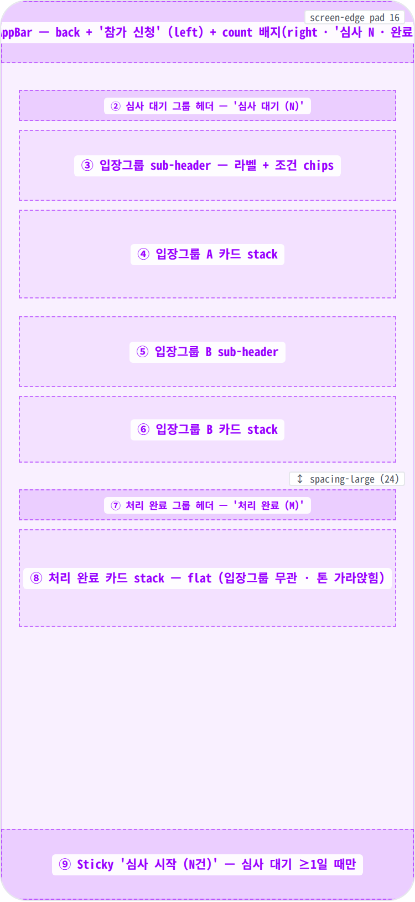
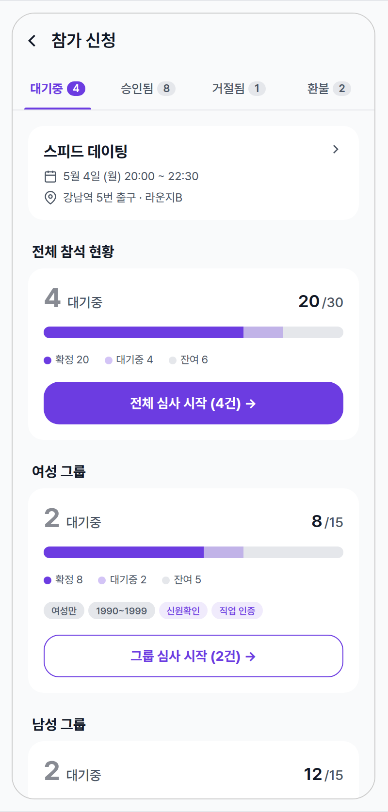
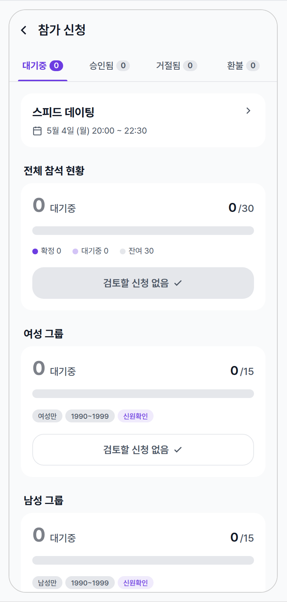
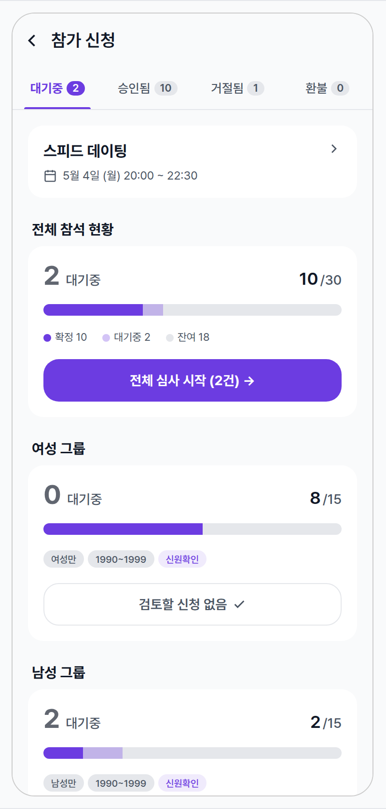
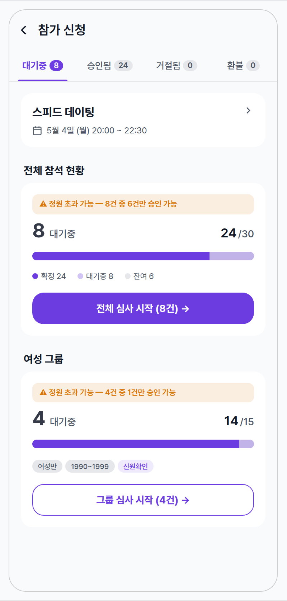
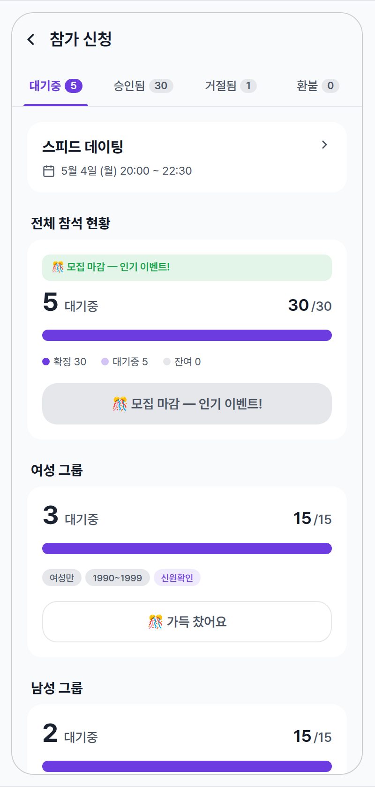
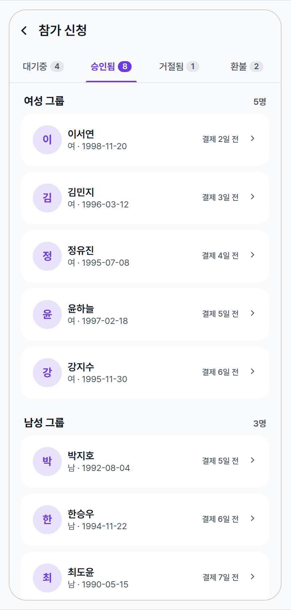
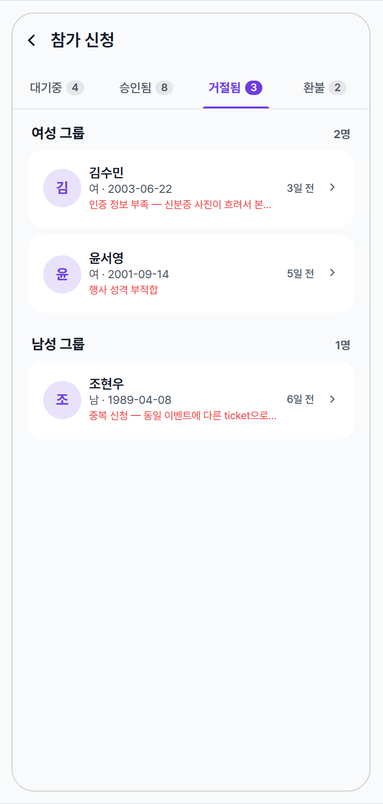
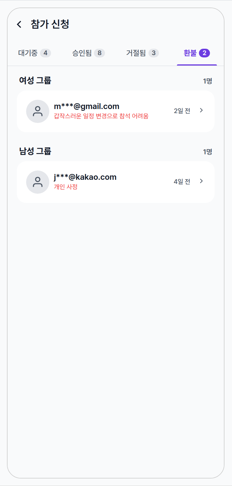
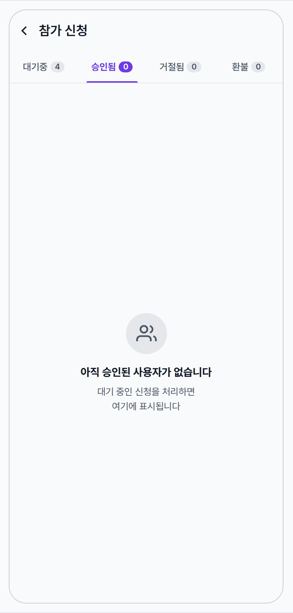

 Spec — EventApplicationListPage (app\_partner · EventApplicationListRoute)  

# Event Application List

## Overview

| Status | 📝 Redesign — v2 (입장그룹 sub-section + 심사 carousel 진입) |
|---|---|
| App | app_partner |
| Category | party · event · application · list (per-event) |
| Route / Surface | EventApplicationListRoute · widget: EventApplicationListPage |
| Path | /more/parties/:partyId/events/:eventId/applications |
| Hierarchy | Parent: EventDetailPage (참가 현황 섹션 탭)Children: EventApplicationReviewCarouselRoute (심사 대기 카드 탭 — 배치 심사 진입) · EventApplicationDetailRoute (처리 완료 카드 탭 — read-only 회고) |
| Purpose | 단일 이벤트에 들어온 참가 신청을 두 묶음(심사 대기 · 처리 완료)으로 보여주는 풀 리스트. 심사 대기 묶음은 입장그룹별 sub-section으로 정렬해 운영자가 그룹별 조건(성별·연령·required verifications)을 한눈에 확인할 수 있게 한다. 심사 대기 카드를 탭하면 EventApplicationReviewCarouselPage(배치 심사 carousel)에 그 사용자부터 진입해 한 화면에서 연속 심사할 수 있다. |
| User journey | Entry points: 이벤트 상세(EventDetailPage)의 "참가 현황" 섹션 탭. 또는 파트너 메인 nav의 EventApplicationManagePage(전체 이벤트 across)에서 특정 이벤트로 좁혀 진입(향후 — 본 spec 범위 밖).Exit points: AppBar back → EventDetailPage 복귀 / 심사 대기 카드 탭 → carousel push / 처리 완료 카드 탭 → detail page push / bottom CTA → carousel push (큐 처음부터).carousel / confirm 화면에서 최종 확정 후 본 화면으로 복귀하면 리스트가 자동 invalidate되어 카드가 적절한 그룹으로 재배치된다. |
| Background | v1은 신청을 단일 평면 리스트로 보여주고 카드별로 상세 페이지에서 개별 처리하는 구조였다. 입장그룹별 조건이 다른데도 그룹 시각화가 없어 운영자가 매번 카드 안으로 들어가서 조건을 재확인해야 했고, 신청이 많은 이벤트에서는 한 건씩 페이지를 오가는 비용이 컸다. v2는 (1) 심사 대기를 입장그룹별로 묶어 조건을 한눈에 보이게 하고, (2) 카드 탭 시 배치 심사 carousel로 진입해 연속 심사 + 최종 확인 화면에서 한 번에 커밋하는 deferred batch 패턴을 도입한다. |
| Frequency | 이벤트 lifecycle 동안 운영자가 평균 5~20회 진입. 신청 흐름 활발한 이벤트일수록 빈도 높음. |

## History

| 날짜 | 버전 | 변경 사항 |
|---|---|---|
| 2026-05-03 | v2 (redesign) | 심사 대기 그룹을 입장그룹별 sub-section으로 분리. 카드 탭 라우팅 분기(심사 대기 → carousel · 처리 완료 → detail). bottom sticky CTA "심사 시작" 추가. Deferred batch review 패턴으로 carousel/confirm 자매 spec 도입. |
| 2026-05-03 | v1 (initial) | 초안 작성. EventDetailPage Tab 2에 있던 신청 리스트를 별도 라우트로 승격. 신청 카드 탭 시 다이얼로그 대신 EventApplicationDetailRoute로 push 통일. |

🧱

## Layout

화면 구조 — 영역, 정렬, 간격 규칙. 색·타이포 무시.

## Blueprint & tree

`Scaffold` — AppBar(title + 우측 small count) + body(`ListView`: 심사 대기 그룹 → 입장그룹별 sub-section → 카드 / 처리 완료 그룹 → flat 카드) + bottom sticky CTA(심사 대기 ≥1일 때만). 심사 대기 카드 탭 시 carousel로 push, 처리 완료 카드 탭 시 detail로 push.

**Scaffold** ├─ **appBar**: **AppBar** ← ① │ ├─ leading: BackButton (auto) │ ├─ title: Text('참가 신청') │ └─ actions: \[Text('심사 N · 완료 M') _· bodySmall · text-secondary_\] ├─ **body**: `MinglitAsyncValueWidget<Bundle>` │ · Bundle = (entryGroups, applications) — 입장그룹과 신청을 같이 로드 │ ├─ loading: full-page spinner │ ├─ error: full-page error state │ └─ data: │ ├─ _case A — 빈 상태_ (신청 0건) │ │ └─ Center → 안내 카피 + actionable hint │ │ │ └─ _case B — 데이터 있음_ │ └─ **ListView**(padding: _spacing-medium_) │ ├─ if pending.isNotEmpty: ← ② │ │ ├─ Text('심사 대기 (N)') _· 15px · w700_ │ │ ├─ SizedBox(_spacing-small_) │ │ └─ for each entryGroup with pending ≥1: ← ③④⑤⑥ │ │ ├─ **\_EntryGroupHeader** │ │ │ ├─ Text(group.label) _· 13px · w700_ │ │ │ ├─ Text('· N건') _· 11px · secondary_ │ │ │ └─ chip row │ │ │ · 성별 · 출생연도 범위 · required verifications (each chip) │ │ ├─ SizedBox(_spacing-small_) │ │ └─ **\_ApplicationCard** × N │ │ · onTap → push [CarouselRoute](/specs/event_application_review_carousel_page/index.html)(eventId, startApplicationId) │ │ │ └─ if done.isNotEmpty: ← ⑦⑧ │ ├─ SizedBox(_spacing-large_) │ ├─ Text('처리 완료 (M)') _· 15px · w600 · secondary_ │ ├─ SizedBox(_spacing-small_) │ └─ **\_ApplicationCard** × M (flat, 입장그룹 무관) │ · status badge별 톤 (approved · paid · rejected) │ · onTap → push [DetailRoute](/specs/event_application_detail_page/index.html)(applicationId) │ └─ **bottomNavigationBar**: _(if pending ≥1)_ ← ⑨ └─ **SafeArea** → Sticky CTA └─ `FilledButton`('심사 시작 (N건)') · onTap → push CarouselRoute(eventId, startApplicationId: 큐 첫 사용자) _각 \_EntryGroupHeader chip 종류:_ └─ 성별: '여성만' / '남성만' / '제한 없음' (gender 필드 기반) 출생연도: '1990~1999' / '20대 이상' / '제한 없음' required: 'required: 신원확인' / 'required: 직업 인증' (각 verification id별 한 chip · primary 톤) _각 \_ApplicationCard 내부:_ └─ Card / InkWell wrap └─ Row(padding: _spacing-medium_, gap: _spacing-small_) ├─ **CircleAvatar**(40 · primaryContainer · 이름 첫 글자) ├─ Expanded Column \[ │ Text(user.name) · _14px · w600_ │ Text('남/여 · YYYY-MM-DD') · _12px · secondary_ │ \] ├─ **\_StatusBadge** │ · pending\_review → '심사 중' (warning 톤) │ · approved → '승인됨' (success 톤) │ · paid → '결제완료' (primary 톤) │ · rejected → '거절됨' (error 톤) └─ Icon(chevron\_right · 14 · text-secondary)

## Spacing & alignment rules

| # | Region | Alignment | Spacing / tokens |
|---|---|---|---|
| ① | AppBar | title left · count action right · 56px | centerTitle: false · h-pad spacing-screen-edge · count text bodySmall + color-text-secondary · margin-right spacing-screen-edge |
| ②⑦ | Group header | 좌측 정렬 · 단독 한 줄 | 심사 대기: 15px w700 color-text-primary · 처리 완료: 15px w600 color-text-secondary · 헤더↔첫 sub-section gap spacing-small (8) |
| ③⑤ | Entry-group sub-header | 좌측 정렬 · 라벨 + count + chip row | 라벨 13px w700 · count 11px secondary · chip row gap 4px · sub-header↔첫 카드 spacing-small |
| — | Entry-group chips | 가로 wrap · primary 톤은 required만 | font 10px w500 · radius 999 · padding 2/8 · 일반 chip color-divider bg + secondary text · required chip color-partner-primary 10% bg + primary text |
| ④⑥⑧ | Application card | 풀폭 with screen-edge h-margin · row(avatar + body + badge + chevron) | padding spacing-medium · radius radius-card · border 1px color-divider · bg color-background · 카드 사이 spacing-small (8) · 처리 완료 카드 opacity 0.85 |
| — | Sub-section 간 간격 | — | 이전 sub-section 마지막 카드 ↔ 다음 sub-header: spacing-medium (16) |
| — | 그룹 사이 | — | 심사 대기 마지막 카드 ↔ 처리 완료 헤더: spacing-large (24) |
| — | Status badge | row trailing · before chevron | padding 4px 8px · radius radius-small · font-size 11px w600 · bg/border = 12% / 25% alpha 톤별 |
| ⑨ | Sticky CTA | bottom · full width · SafeArea inset | bg color-surface + 1px top border color-divider · h-pad spacing-medium · v-pad spacing-small · 버튼 height 48 · radius radius-card · bg color-partner-primary · 라벨 15px w700 white |
| — | Empty state | centered · 화면 중앙 · column gap small | icon 56px circle · bg color-divider · title 15px w700 · sub 13px secondary line-height 1.5 |

🎨

## States

시각 변형 4종. baseline = 입장그룹 2개 이상 + 처리 완료 모두 있음.

**State 식별 기준**: (a) 심사 대기 그룹의 입장그룹 수(2+ / 1 / 0) (b) 처리 완료 그룹 비어있는지. 모든 카드 탭 동작은 출처 그룹별로 분기 — 심사 대기 카드 탭 시 carousel push, 처리 완료 카드 탭 시 detail push.

### State 1 · Default 🎯 baseline · 입장그룹 ≥2 · 처리 완료 ≥1

| 항목 | 내용 |
|---|---|
| 조건 | 이벤트와 입장그룹 데이터 로드 완료. 대기중 탭 활성(pending · pending_review status). 본문 구성:이벤트 hero 카드 — 이벤트 디테일 hero에서 가져온 핵심 정보(타이틀 / 시간 / 장소). 운영자가 어떤 이벤트의 신청을 보고 있는지 즉시 컨텍스트화.전체 참석 현황 카드 — MinglitCapacityBar 3-segment(확정 / 대기 / 잔여) + 합계 라벨. 전체 그림 한 눈에.입장그룹별 review 카드 × N — 그룹마다 라벨 + 정원(filled/target) + 조건 chips + 심사 대기 카운트 + 그룹 전용 '심사 시작' CTA. 그룹별로 독립적으로 처리 가능 — 다른 그룹은 미처리 상태로 둘 수 있음.대기중 탭에는 사용자별 카드 list 없음 — carousel이 한 명씩 풀스크린으로 보여주므로 중복. 다른 탭(승인됨·거절됨·환불)은 자체 status 카드 list. |
| 사용자 액션 | · 탭 전환 → 대기중 / 승인됨 / 거절됨 / 환불 사이 swipe 또는 탭 헤더 탭.· 이벤트 hero 카드 탭 → 이벤트 상세 페이지(EventDetailPage)로 이동 — 컨텍스트 점프.· 그룹별 '심사 시작' CTA 탭 → 해당 그룹의 pending만 큐에 담아 carousel 진입(그룹별 큐). 다른 그룹은 영향 없음.· 심사 대기 0건인 그룹 → CTA disabled 톤 + 라벨 "검토할 신청 없음" (또는 카드 자체 dim 처리).· 승인/거절/환불 탭의 카드 탭 → 상세 페이지로 push (승인 취소 / 재승인 등 status 변경).· 최종 확정 후 복귀 → 자동 invalidate → 그룹 카드의 정원 / 대기 카운트 + 전체 capacity bar 갱신.· 뒤로가기 → EventDetailPage 복귀 + 로컬 마킹 캐시 invalidate |
| 에지케이스 | · capacity bar tone — 확정 = primary 100% · 대기 = primary 30% alpha · 잔여 = divider. 확정 + 대기 ≥ target이면 잔여 segment 0 (오버부킹은 발생 안 하지만 시각 안전장치).· 그룹별 정원 fill bar — 채워짐 100% 도달 시 톤 변경 가능(success), over면 error 톤.· 입장그룹 라벨이 비어있으면(template 미지정) "이름 없는 그룹"으로 fallback.· 탭 카운트 0이어도 탭 자체는 항상 노출 — 카드 영역에서 빈 상태 안내.· payment_failed status는 어느 탭에도 노출 X (운영자 관심 밖).· capacity 데이터는 #2117에서 RPC 확장 후 사용. MinglitCapacityBar 컴포넌트는 mds_core에 신설(후속 issue 필요).· carousel queue 정의 변경 — 이전에는 "전체 pending across" 단일 큐였으나, 그룹별 CTA 도입으로 큐가 그룹별로 분리됨. carousel spec도 후속 PR에서 갱신 필요. |
| 컴포넌트 | Scaffold · AppBar · MinglitAsyncValueWidget<Bundle> · ListView · _GroupHeader · _EntryGroupHeader(label · count · chip row) · _ApplicationCard · _StatusBadge · FilledButton(sticky CTA) · SafeArea |
| 토큰 | color-primary(partner #6c3ce1 — avatar bg @ 15% / paid badge @ 12% / required chip 10% / sticky CTA bg 100%) · color-text-primary(이름 / 심사 대기 헤더 / sub-header 라벨) · color-text-secondary(서브 / 처리 완료 헤더 / 일반 chip / count) · color-warning(심사 중 badge) · color-error(거절 badge) · #15803d(승인 badge) · radius-card · radius-small · spacing-screen-edge · spacing-medium · spacing-small · spacing-large · typography 14px w600 (이름) / 12px secondary (서브) / 11px w600 (badge) / 13px w700 (sub-header 라벨) / 11px secondary (sub-header count) / 10px w500 (chip) / 15px w700 (CTA / 심사 대기 헤더) / 15px w600 secondary (처리 완료 헤더) |
| 노트 | 📝 baseline. 입장그룹별 조건이 한눈에 들어오므로 운영자는 그룹 안 사용자만 빠르게 비교/판단할 수 있다. carousel 진입 시 순회는 입장그룹 경계를 넘어가는 점에 주의 — 큐는 created_at 정렬, 그룹별 batch가 아님. |

### State 2 · 신청 비어있음 empty · 대기중 탭 · 신청 0건

| 항목 | 내용 |
|---|---|
| 조건 | 이벤트는 활성이지만 모든 status에 신청 0건 (이벤트 직후 또는 비공개 / 노출 부족). 모든 탭 카운트 0. 레이아웃은 State 1과 동일 — 모든 숫자가 0, 모든 bar 비어있음, 모든 CTA가 disabled "검토할 신청 없음 ✓". 별도 빈 상태 분기 없이 자연스럽게 0 표기로 통일. |
| 사용자 액션 | · 이벤트 hero 탭 → EventDetailPage로 이동 (이벤트 노출 점검 / 공유 등 다음 액션 출구)· 탭 전환 → 다른 status 탭(전부 빈 상태)· 새 신청 발생 → 자동 invalidate → State 1 또는 State 3로 자동 전환· 뒤로가기 → EventDetailPage 복귀 |
| 노트 | 📭 별도 빈 상태 분기 없이 모든 숫자가 0인 모습으로 통일 — 레이아웃 일관성이 운영자에게 "여기는 이런 형태로 정보가 채워질 거구나"를 미리 학습시킴. CTA 톤은 기존 disabled + ✓ 체크. |

### State 3 · 그룹 비어있음 asymmetric · 일부 입장그룹 pending=0

| 항목 | 내용 |
|---|---|
| 조건 | 여러 입장그룹 중 일부의 pending=0, 일부는 ≥1. 운영자가 한쪽을 먼저 처리해 비대칭이 된 흐름. 처리할 게 없는 그룹 카드는 정원/조건은 그대로 노출하고 CTA만 disabled "검토할 신청 없음 ✓"으로 "할 일 끝남" 시그널. |
| 사용자 액션 | · 여성(빈) 그룹 카드 → 정보 조회용 — CTA 비활성, 카드 자체는 dim. 클릭해도 액션 없음.· 남성(pending) 그룹 CTA → 그 그룹의 pending만 큐로 carousel 진입.· 전체 심사 시작 CTA → 모든 pending(여기서는 남성만) 큐로 carousel 진입 — 그룹 CTA와 결과 동일하지만 다중 그룹일 때는 차이남.· 처리 완료 시 자동 invalidate → 양쪽 다 0이 되면 State 5(모두 처리 완료 — 본 페이지에는 별도 작성 안 함, dim 그룹만 늘어난 형태로 표현 가능) 또는 신청 새로 들어오면 State 1 복귀. |
| 노트 | 📝 카드 자체는 dim 처리하지 않음 — 정원/조건은 컨텍스트로 그대로 노출. 차이는 CTA 버튼만 — disabled 톤(divider bg + secondary text) + 라벨 "검토할 신청 없음" + ✓ 체크 아이콘으로 "할 일 끝남" 긍정 시그널. |

### State 4 · 정원 초과 위기 over-capacity · 대기 인원 > 잔여 좌석

| 항목 | 내용 |
|---|---|
| 조건 | 합산 잔여 좌석이 대기 인원보다 적음. 예: 24 확정 + 8 대기 = 32 → target 30 초과 2명. 그룹 단위로도 capacity 위기를 노출 — 여성 그룹 14/15 + 4 대기 → 잔여 1, "4건 중 1건만 승인 가능" banner 추가. 남성 그룹(10/15 + 4 대기)은 정원 안에 들어와서 banner 없음. 처리 시 capacity guard가 oldest pending부터 잔여까지만 승인하고 나머지는 보류 — 결과는 confirm 화면(EventApplicationReviewConfirmPage)의 capacity skip state에서 명시. |
| 사용자 액션 | · summary 상단 warn banner → 시각 안내만 (탭 액션 없음). 정원 초과 가능성과 보류 가능 건수를 미리 알림.· 심사 시작 CTA → carousel 진입 자체는 정상. 처리 마킹은 평소처럼 진행되며, 백엔드 호출은 confirm 단계에서 capacity guard를 적용해 일부 보류 결과 반환.· 운영자 의사결정 흐름 → 미리 거절을 섞어 마킹하거나, 일부를 다음 시도까지 보류시킬 수 있음. 정원 추가 확보(이벤트 max_participants 상향)는 이벤트 편집에서 별도.· 그룹 capacity bar — 한 그룹이 거의 가득(여성 14/15) → bar segment 공간 부족 시 잔여 segment 0 (시각 안전장치). |
| 노트 | ⚠ banner는 "보류 가능 건수"를 명시 — 단순 경고가 아니라 예상 결과를 수치로 보여줌. 운영자는 이 시점부터 처리 전략을 결정 가능. carousel 진입은 막지 않고 confirm 화면에서 최종 결과를 보여주는 deferred 정책 일관 유지. |

### State 5 · 정원 마감 full · 확정 = 정원 · 추가 승인 불가

| 항목 | 내용 |
|---|---|
| 조건 | 확정 인원 = target capacity (예: 30 / 30). pending이 남아있어도 잔여 좌석 0이라 추가 승인 불가. summary bar는 100% filled (잔여 segment 0). 그룹별로도 동일하게 정원 가득. 운영자에게 축하 톤 시그널로 표현(insider perspective: 인기 이벤트 매진은 좋은 일). |
| 사용자 액션 | · 전체 / 그룹 CTA 모두 disabled — 라벨 "🎊 모집 마감 — 인기 이벤트!" / "🎊 가득 찼어요". list level에서 처리 가능한 액션 없음.· 거절 처리 X — 의도적으로 list에서 거절 흐름을 제거. 사용자 환불·취소로 빈 자리가 날 수 있어 pending 명단을 그대로 보존(대기자 풀로 활용).· 빈 자리 발생 시 → 자동 invalidate → 이 state에서 빠져나오고 다시 대기중 처리 가능 state(State 1 또는 4)로 전환.· 정원 늘리기 → 이벤트 편집에서 max_participants 상향 (별도 화면, 본 spec 범위 밖). 늘리면 자동 invalidate되어 이 state에서 빠져나옴.· 개별 거절이 정말 필요하면 → list가 아니라 detail page에서 (운영자 명시 결정). 단, 보통은 그대로 두고 vacancy 대기.· 뒤로가기 → EventDetailPage 복귀. |
| 노트 | 🎊 운영자에게 매진은 축하 시그널 — banner / CTA 톤을 success(녹색)로 통일해 인기 이벤트의 긍정 결과를 강조.📝 거절을 list에서 제거한 이유 — 환불·취소로 빈 자리가 발생할 수 있어 pending을 대기자 풀로 보존하는 게 운영자 + 사용자 양쪽에 유리.📝 capacity bar — filled 100%로 시각적 가득참 표현. pending segment는 더 이상 표시 X (차지할 자리 없음). legend는 "대기중 5" 그대로 노출 — "대기자 풀 보유" 시그널.📝 vacancy 발생 시점 — 사용자 환불(cancelled) 또는 운영자 취소 액션. realtime 갱신은 본 spec 범위 밖이라 화면 재진입으로 갱신. |

### State 6 · 승인됨 탭 default 🎯 approved · 승인됨 탭 · 입장그룹별 명단

| 항목 | 내용 |
|---|---|
| 조건 | 승인됨 탭 활성 · 결제 완료된 확정 참가자 명단(paid status). 결제대기는 노출 X — 본 list는 "이 사람은 정말로 옴" 시그널. 입장그룹별 sub-section + 그룹 라벨 우측 인원 카운트("5명"). 카드 정렬은 결제일 desc(최근이 위). 카드 trailing 결제일은 relative 포맷 ("결제 N일 전") — 운영자에게 시간 거리감을 직관적으로 전달. |
| 사용자 액션 | · 탭 전환 → 다른 status 탭으로 swipe.· 카드 탭 → 그 사용자의 detail page로 push (PartnerApplicationDetailPage). detail에서 환불 / 승인 취소 등 status 변경 가능.· 스크롤 → 그룹별로 분리된 list를 위→아래로 스캔 (페이지네이션 없음).· 최종 확정 후 복귀 → 자동 invalidate → 상태 변경된 카드는 해당 status 탭으로 이동(예: 환불 → 환불 탭).· 뒤로가기 → EventDetailPage 복귀. |
| 노트 | 📝 동명이인 처리 — 별도 시각 처리 없이 카드의 부가 정보(성·생년·결제일·입장그룹)로 자연 구분. 같은 이름이 인접하면 그 자체가 시그널이며 운영자는 sub line으로 구분 가능.📝 결제대기 / payment_failed 등 비완료 status는 본 탭에서 노출 X — 운영자가 "오는 사람"에 집중하도록 정보 노이즈 제거.📝 카드 border 없이 background 대비로만 구분 — 다른 dashboard 카드(hero / summary / 그룹)와 일관된 borderless 톤. 무료 티켓은 본 list에서 별도 tag 노출 X — detail page에서 결제 정보로 확인. |

### State 7 · 거절됨 탭 default 🎯 rejected · 거절됨 탭 · 입장그룹별 명단 + 사유

| 항목 | 내용 |
|---|---|
| 조건 | 거절됨 탭 활성(rejected status). 입장그룹별 sub-section 패턴은 승인됨과 동일. 카드는 single-row 유지하면서 body column 안에 sub line 아래로 warn icon + 거절 사유 한 줄 (text-only, no bg/border). 정렬은 거절일 desc(최근 위). 거절은 보통 적은 수(이벤트당 1-3건). |
| 사용자 액션 | · 탭 전환 → 다른 status 탭으로 swipe.· 카드 탭 → detail page push. 거절은 무거운 결정이라 detail에서 사유 전체 + 제출 정보 + (선택) 재승인 흐름 노출.· 재승인 흐름 → 거절 → 승인 전환은 detail page에서 별도 confirm dialog. "이 사용자는 이미 거절됨, 정말 재승인하시겠습니까?" — 운영자가 무게 있게 결정하도록 마찰 추가.· 재승인 시 capacity guard 적용 — 정원 초과면 reject + 안내.· 뒤로가기 → EventDetailPage 복귀. |
| 노트 | 📝 거절 사유는 carousel에서 합성된 라벨("predefined 라벨 — 자유 입력") 그대로 노출. 길면 한 줄 ellipsis(...) — 전체 사유는 detail에서.📝 사유 시각 처리 — error 톤 텍스트만으로 충분. icon/bg/border 없이 minimal하게.📝 그룹별 sub-section은 승인됨과 일관성 유지 — 그룹별 거절 패턴(예: 특정 그룹에서 거절이 몰림)을 한눈에 인지 가능. 거절 0건인 그룹은 sub-section 통째로 hide. |

### State 8 · 환불 탭 default 🎯 refunded · 환불 탭 · 이메일만 노출

| 항목 | 내용 |
|---|---|
| 조건 | 환불 탭 활성(cancelled status). 입장그룹별 sub-section + 카드 list 패턴은 다른 탭과 동일. 개인정보 보호 정책으로 카드에는 이름·성·생년 노출 X — 부분 마스킹된 이메일만 노출 + generic person icon avatar. 환불 사유는 alert icon + 한 줄 ellipsis (거절됨과 동일 패턴). |
| 사용자 액션 | · 탭 전환 → 다른 status 탭으로 swipe.· 카드 탭 → detail page push. detail에서는 운영자가 액션할 정보(전체 이메일·환불 금액·환불일·정책 적용)를 모두 노출(액션 컨텍스트라 개인정보 노출 허용).· 재승인 흐름 → detail에서 "재승인" 액션 가능 (사용자 변심 → 운영자가 다시 받아주는 케이스). capacity guard 적용 — 정원 초과면 reject.· 재승인 시 사용자에게 알림 발송 + 결제 재시도 안내 흐름 별도(detail spec 영역).· 뒤로가기 → EventDetailPage 복귀. |
| 노트 | 📝 list view에서는 이메일 부분 마스킹("m***@gmail.com")으로 운영자가 식별은 가능하되 third-party 시야 노출(스크린샷·shoulder surfing)에서 PII 최소화. detail은 풀 이메일 노출 — 액션 단계라 식별 정확성 우선.📝 환불 사유는 사용자가 입력한 케이스만 노출. 사용자 무입력 시 fallback "사용자 환불 요청" 같은 generic 텍스트.📝 generic avatar — 이름 첫 글자 대신 person outline icon. 시각적으로 "익명 처리" 시그널.📝 환불일 relative format — 다른 탭과 동일 ("N일 전"). |

### State 9 · List 탭 비어있음 empty · 승인됨 / 거절됨 / 환불 공통 패턴

| 항목 | 내용 |
|---|---|
| 조건 | 해당 status 탭에 카드 0건. 승인됨 / 거절됨 / 환불 어느 탭이든 같은 빈 상태 패턴 — 중앙 정렬 icon + title + 보조 카피. 다른 탭(대기중)에는 신청이 있을 수도, 없을 수도 있음(여기 mock은 대기중 4건 보유 = "처리 전 단계"). |
| 사용자 액션 | · 탭 전환 → 다른 탭으로 swipe (대기중에 처리할 거 있으면 그쪽으로 이동).· 새 데이터 발생 → 자동 invalidate → 빈 상태 사라지고 카드 list로 자동 전환.· 뒤로가기 → EventDetailPage 복귀. |
| 노트 | 📝 탭별 카피 variation:· 승인됨: 제목 "아직 승인된 사용자가 없습니다" · sub "대기 중인 신청을 처리하면 여기에 표시됩니다"· 거절됨: 제목 "거절된 신청이 없습니다" · sub "거절한 신청은 여기에 모아 보여드립니다"· 환불: 제목 "환불 내역이 없습니다" · sub "사용자가 환불한 신청은 여기에 표시됩니다"📝 icon은 모든 탭 동일 (people-outline). 탭별 다른 icon 도입은 시각 노이즈만 키우므로 피함.📝 actionable hint 없음 — empty는 자연스러운 상태일 뿐 별도 CTA 노출 X. |

🔄

## Global Behavior

모든 state에 동일하게 적용되는 동작.

## Sub-section 그룹화 규칙

-   **심사 대기 그룹**은 입장그룹별 sub-section으로 묶여 표시된다. 매핑은 `application.ticketId` → `ticket.target_entry_group_id(s)` → `entry_group`으로 해석.
-   sub-section 정렬 — `entry_group.created_at ASC` (이벤트 정의 시 입장그룹이 생성된 순서). 별도 position / display\_order 컬럼은 도입하지 않는다 — 운영자가 사후 순서 조정을 요구한 적 없고, #2102 1:1 enforce 작업과 결합해 의도치 않은 컬럼 추가를 피한다.
-   sub-section 안 카드 정렬 — `created_at DESC` (최근 신청이 위).
-   심사 대기 카운트(상단 헤더 + appbar count)는 모든 sub-section 합산.
-   입장그룹의 pending이 0이면 sub-section은 통째로 숨긴다(빈 헤더 노출 금지).
-   **처리 완료 그룹**은 입장그룹 sub-grouping을 적용하지 않는다 — flat list, `updated_at DESC`(최근 처리한 게 위).

## Carousel 진입 큐 정의

-   심사 대기 카드 탭 → carousel push에 `startApplicationId` 전달. carousel 내부 큐는 **전체 심사 대기 신청**(입장그룹 경계 무시) · `created_at ASC` 정렬.
-   예: 입장그룹 B의 두 번째 카드를 탭하면, carousel 큐 안에서 그 사용자의 위치(예: 4 / 6)에서 시작 → 자동 다음 사용자 이동 시 입장그룹 A의 사용자로 자연스럽게 넘어갈 수 있다.
-   bottom sticky '심사 시작' CTA → 큐 첫 사용자부터 시작.
-   carousel에서 페이지 이탈(리스트로 pop) 시 마킹은 보존. 본 리스트 화면을 추가로 이탈(EventDetailPage로 pop)하면 마킹 캐시가 invalidate (자세한 룰은 carousel spec 참조).

## 리스트 fresh 정책

-   화면 진입 시 (entryGroups, applications) 번들을 fresh fetch.
-   carousel/confirm에서 **최종 확정** 후 본 화면 복귀 시 자동 갱신 — 카드가 그룹 사이를 자연스럽게 이동(심사 대기 → 처리 완료).
-   processing 완료 직후 입장그룹 sub-section의 pending이 0이 되면 sub-section 자체가 사라짐 → 자연스러운 "비워짐" 시그널.
-   실시간 갱신(다른 운영자 동시 처리)은 본 spec 범위 밖 — 향후 realtime subscription 고려.

## 카드 탭 라우팅 분기

-   **심사 대기 카드** → [`EventApplicationReviewCarouselRoute`](/specs/event_application_review_carousel_page/index.html) (그 사용자부터 배치 심사).
-   **처리 완료 카드** → [`EventApplicationDetailRoute`](/specs/event_application_detail_page/index.html) (read-only 회고 + 환불 / 노트 등 후속 액션).
-   같은 카드 컴포넌트지만 출처 그룹에 따라 도착지가 다르다는 점이 핵심.

## 입장그룹 chip 정책

-   chip 종류와 표기:
    -   **성별**: gender가 'male' → '남성만', 'female' → '여성만', null → '제한 없음'
    -   **출생연도**: birthYearMin / Max가 모두 null이면 '제한 없음', 둘 다 있으면 '1990~1999', 한쪽만 있으면 '1990 이후' / '1999 이전'
    -   **required verifications**: 각 verificationId마다 한 chip — 'required: 신원확인' (verification 라벨로 해석)
-   required chip은 primary 톤 — 운영자가 가장 먼저 봐야 할 시그널이기 때문에 강조.
-   일반 chip(성별 / 출생연도)은 secondary 톤 — 그룹의 인구통계 컨텍스트 제공.
-   chip 가로 폭이 부족하면 wrap (여러 줄 가능). ellipsis 사용 X.

🔗

## Reference

관련 라우트 · 화면 · 구현 소스.

## Implementation source

| Route | EventApplicationListRoute |
|---|---|
| Path | /more/parties/:partyId/events/:eventId/applications |
| Widget class | EventApplicationListPage (+ _GroupHeader · _EntryGroupHeader · _ApplicationCard · _StatusBadge internal widgets) |
| App | app_partner |
| Source (예상) | apps/app_partner/lib/src/features/event/applications/event_application_list_page.dart |
| Bundle source | 입장그룹: partyEntryGroupsProvider 또는 이벤트 상세 cache · 신청: eventApplicationsProvider(eventId) |

## Related screens

| Spec | 관계 |
|---|---|
| EventDetailPage | Parent — 참가 현황 섹션 탭에서 진입. |
| EventApplicationReviewCarouselPage | Child (primary) — 심사 대기 카드 탭 / sticky CTA 탭 시 push되는 배치 심사 carousel. |
| EventApplicationReviewConfirmPage | Grandchild — carousel 큐가 끝나면 push되는 최종 확인 화면(리스트에서 직접 진입은 없음). |
| EventApplicationDetailPage | Child (secondary) — 처리 완료 카드 탭 시 push. read-only 회고 + 환불 / 노트. |
| EventApplicationManagePage | Sibling — 파트너 메인 nav의 cross-event 신청 리스트. 본 화면은 단일 이벤트로 좁힌 버전. |