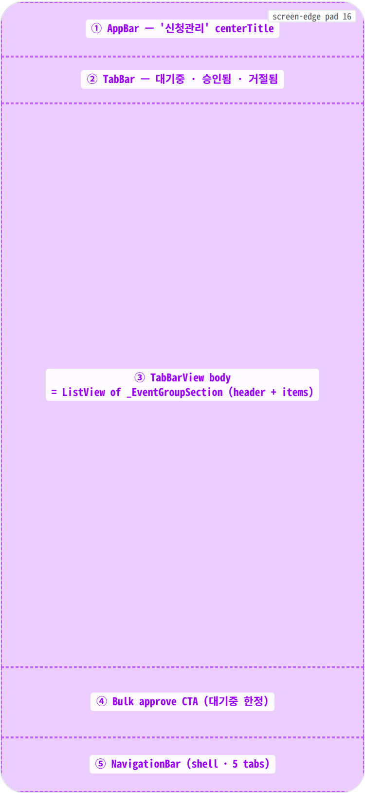
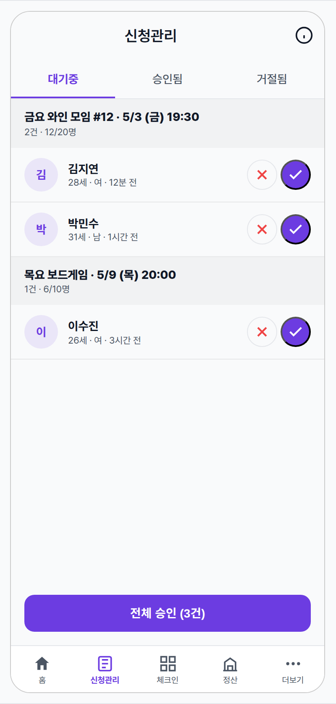
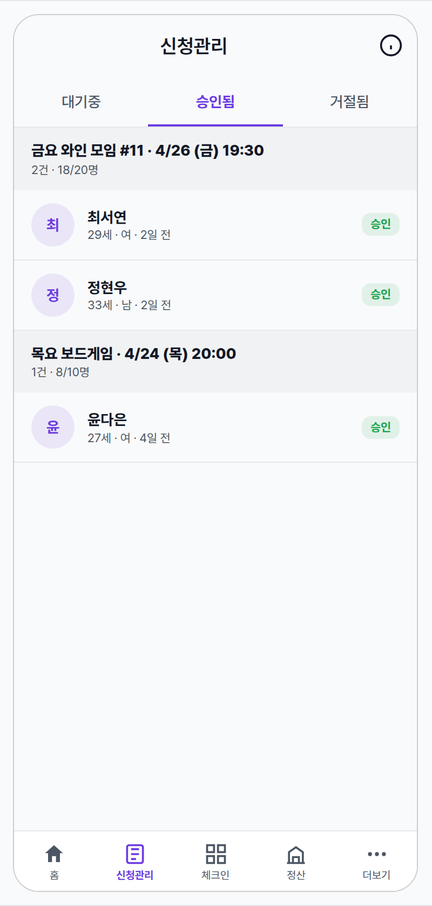
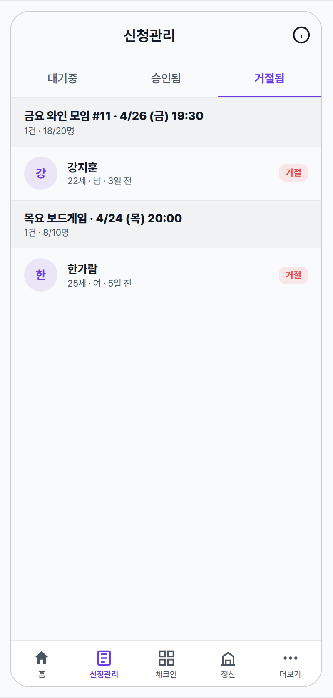
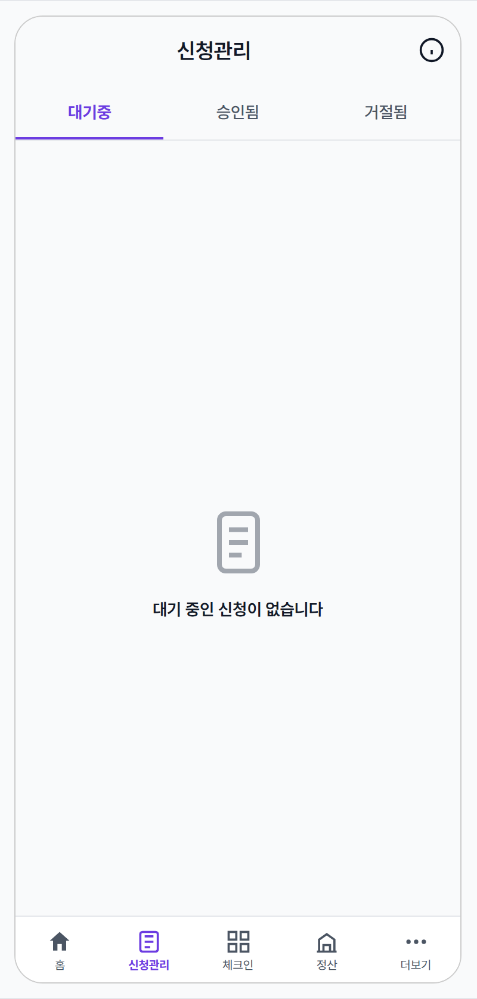
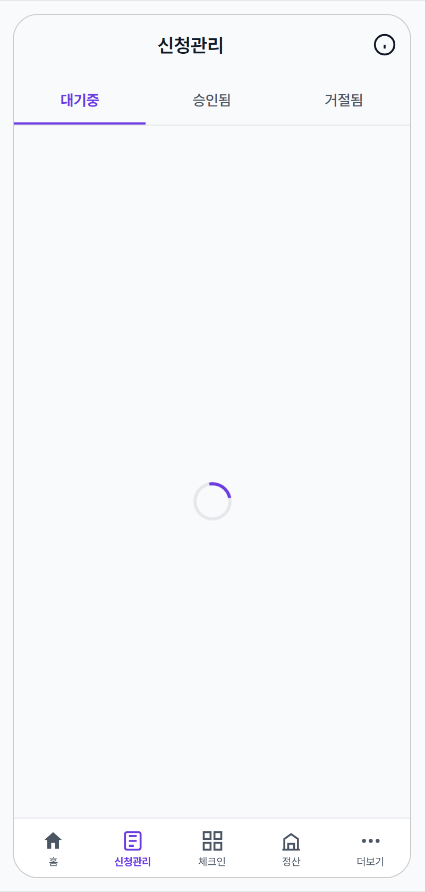
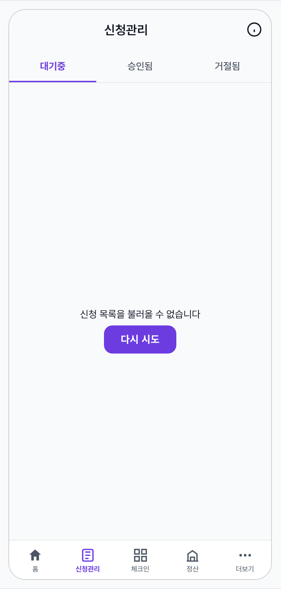
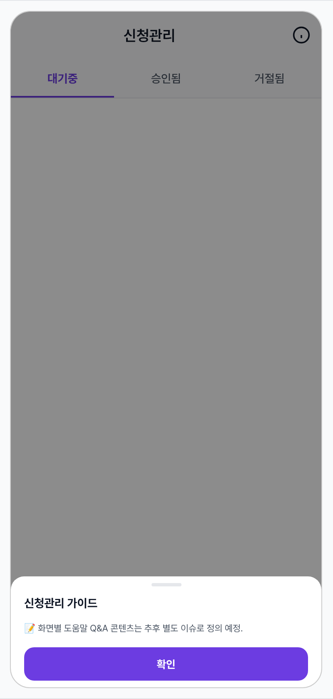

 Spec — EventApplicationManagePage (app\_partner · ApplicationListRoute)  

# Event Application Manage

## Overview

| Status | ✅ 디자인완료 — 5 state · 파트너 신청관리 entry hub |
|---|---|
| App | app_partner |
| Category | application · partner ops · approval workflow |
| Route / Surface | ApplicationListRoute · widget: EventApplicationManagePage (StatefulShell · ApplicationBranch) |
| Path | /applications |
| Hierarchy | Parent: — (top-level partner shell screen — bottom-nav 신청관리 탭)Children: EventApplicationDetailRoute (승인됨/거절됨 항목 탭 시 push) · _EventGroupSection · _ApplicationItem · _StatusBadge · _RejectDialog (internal widgets — no separate spec) |
| Purpose | 파트너가 자기 이벤트들에 들어온 신청을 한 화면에서 빠르게 승인/거절한다. 이벤트별로 grouping된 신청 목록을 3개 탭(대기중 · 승인됨 · 거절됨)으로 분기해 보여주고, "대기중" 탭에서는 row-inline의 승인/거절 버튼 + 하단 "전체 승인" CTA로 bulk 처리까지 한 번에 가능하게 한다. |
| User journey | Entry points: 하단 NavigationBar "신청관리" 탭 / PartnerHomePage TodoSummaryChips "승인 대기" chip 탭 / 푸시 알림(신청 도착) 탭.Exit points: 승인/거절 인라인 액션 후 같은 화면 stay (snackbar) · "전체 승인" CTA · 승인됨/거절됨 항목 row 탭 → EventApplicationDetailRoute push · 다른 bottom-nav 탭으로 전환. |
| Background | 신청관리는 파트너의 일일 운영 task 중 가장 빈도가 높은 액션 — 모든 신청을 승인 또는 거절(사유 입력)해야 이벤트의 참여 인원이 확정된다. 이벤트별로 그룹을 묶은 이유는 같은 이벤트의 여러 신청을 동시에 판단하는 게 자연스럽기 때문(연령/성별 mix 보고 판단). 처리할 일(대기중)과 이력(승인됨/거절됨)을 별도 탭으로 분리해 명확히 구분. |
| Frequency | 활성 파트너는 매일 1~수회. 푸시 알림이 trigger인 경우 즉시 진입. |

## History

이 spec의 주요 변경 이력. 최신 항목 위.

| Date | Version | Author | Changes |
|---|---|---|---|
| 2026-05-01 | 1.0 | mark-yun | v1.4 template으로 작성. 5 state(Default pending · Approved · Rejected · Empty · Loading · Error) → mini-table per state, baseline = Default(대기중 탭 with mixed event groups), additive diff. 파트너 brand color(#6c3ce1) viewport-scoped override. |

[🧱 Layout](#layout) [🎨 States](#states) [🔄 Global Behavior](#behavior) [📖 Reference](#reference)

🧱

## Layout

화면 구조 — 영역, 정렬, 간격 규칙. 색·타이포 무시.

## Blueprint & tree

AppBar(가운데 '신청관리' + 하단 3탭) + 탭별 body + 하단 NavigationBar. 각 탭의 body는 아래로 당겨 새로고침 가능한 스크롤 리스트이며, 대기중 탭에서만 하단에 "전체 승인" CTA가 추가된다. 리스트의 각 항목은 이벤트 헤더 + 그 이벤트의 신청자 행들로 구성된 그룹.

**Scaffold** ├─ **AppBar**('신청관리', 가운데 정렬) │ ├─ actions: \[ │ │ IconButton(info\_outline) → showMinglitHelpSheet(...), │ │ \] │ └─ **하단 TabBar** (3개 탭) ← ② │ ├─ '대기중' │ ├─ '승인됨' │ └─ '거절됨' ├─ **body**: 데이터 단계별 분기 │ ├─ 로딩 → 중앙 스피너 │ ├─ 에러 → '오류' 평문 │ └─ 결과 → 탭별 화면 ← ③ │ ├─ 대기중 탭 (인라인 액션 버튼 노출) │ ├─ 승인됨 탭 (행 자체 탭으로 상세 진입) │ └─ 거절됨 탭 (행 자체 탭으로 상세 진입) │ └─ 각 탭의 body │ ├─ 로딩 → 중앙 스피너 │ ├─ 에러 → 중앙 평문 + '다시 시도' 버튼 │ └─ 결과 → │ ├─ 빈 상태 → 중앙 큰 아이콘 + 라벨 │ └─ 그룹 리스트 (이벤트 단위로 묶임) │ ├─ 스크롤 리스트 (아래로 당겨 새로고침) │ │ └─ 이벤트 그룹별 │ │ ├─ 헤더 (이벤트 제목 · 날짜 · 신청 N건/정원 N명) │ │ └─ 신청자 행 │ │ ├─ 이름 첫 글자 아바타 │ │ ├─ 이름 + 연령·성별·신청 시각 │ │ └─ 대기중이면 거절/승인 버튼, │ │ 이력 탭이면 상태 배지 │ └─ 대기중 + 승인 가능 건수 > 0 일 때 │ 하단에 "전체 승인 (N건)" CTA ← ④ └─ **NavigationBar** (하단 5탭 · 신청관리 활성) ← ⑤

## Spacing & alignment rules

| # | Region | Alignment | Spacing |
|---|---|---|---|
| ① | AppBar | height 56 · centerTitle · bg = surface (no border) · 1 action trailing | title typography app-bar-title (18px) |
| ② | TabBar | height 48 · 3 equal-flex tabs · indicator 2px | indicator color = partner primary · label color (active = primary, inactive = secondary) |
| ③ | TabBarView body | vertical scroll · group header (sticky-look) + inline rows · pull-to-refresh | group header pad: spacing-medium (16h) · spacing-sm (12v) · row pad: spacing-medium (16h) · spacing-sm (12v) · row 분리: 1px border-bottom color-divider @alpha .3 |
| — | _ApplicationItem 내부 | row · avatar(40) + flex info column + actions/badge | avatar↔info: spacing-sm (12px) · reject↔approve 간격: spacing-xsmall (4px) |
| ④ | Bulk approve CTA | SafeArea + Padding all 16 · 풀폭 FilledButton | 버튼 height 44 (default FilledButton minimumSize) · border-radius radius-button (12px) |
| ⑤ | NavigationBar | shell이 관리 — 5 destinations · 신청관리 active | height 56 · indicator partner primary · bg = colorScheme.surface (= white) |

## AppBar sub-anatomy

파트너 앱 simpleAppBar — centered title + 우측 actions(info). 글로벌 일관 패턴이라 모든 파트너 화면이 동일 구조를 따른다 (info icon은 화면별 컨텍스트 도움말 sheet 트리거).

| Region | Alignment | Notes |
|---|---|---|
| ① Title (centered) | 중앙 정렬 · 1줄 | "신청관리" · --typography-font-size-app-bar-title 18 · w600 · color-text-primary. |
| ② Info action (trailing) | 우측 · 40×40 hit-region | info_outline 22×22 · 탭 시 도움말 bottom sheet 진입 (State 7). 파트너 앱 모든 화면에 동일 패턴 적용 — 각 화면별 컨텍스트 도움말 콘텐츠는 호출 측에서 정의. |
| — | AppBar bg | --color-surface · surfaceTint transparent · border-bottom 없음. |

## Help bottom sheet sub-anatomy _(MinglitHelpSheet 컴포넌트 후보)_

info 아이콘 탭 시 노출되는 컨텍스트 도움말 sheet. 파트너 앱 모든 주요 화면에서 같은 chrome 재사용 — 화면별 sections 콘텐츠만 다름.

| Region | Alignment | Notes |
|---|---|---|
| ① Scrim (barrier) | full-screen overlay | rgba(0,0,0,0.45) · 하단 정렬 컨테이너 · 탭 시 sheet dismiss (gesture path). |
| ② Sheet container | bottom-anchored · max-height 75% | bg --color-background · 상단 모서리 radius-card 16 · column flex (handle / header / body / cta). |
| ③ Handle bar | 중앙 정렬 | 36×4 · radius 2 · --color-divider · margin small/xsmall — drag-down dismiss affordance. |
| ④ Header | 좌측 정렬 · 단독 한 줄 | "신청관리 가이드" · 16/700 primary · padding small/medium · close ✕ 없음(handle/scrim/CTA로 dismiss). |
| ⑤ Body (scrollable) | flex 1 · 세로 스크롤 | padding 0/medium · 항목 사이 1px --color-divider top border (첫 항목 제외) · sections list. |
| ⑥ Section title | row · 14/700 primary | 자연어 Q (첫 사용자가 가질 만한 질문). 화면별 콘텐츠는 호출 측에서 정의. |
| ⑦ Section body | 좌측 정렬 · 13 secondary | line-height 1.55 · 1-3문장 답변 · 친근한 톤. |
| ⑧ Confirm CTA | bottom · sticky · margin medium | "확인" · filled partner-primary · height 48 · 15/700 white · primary dismiss path. |

🎨

## States

시각 변형 5종. baseline = Default(대기중 탭 · grouped events with pending applications), 나머지는 additive diff.

활성 탭(대기중/승인됨/거절됨) + 데이터 로딩 단계 + 그룹 비어있음 여부에 따라 갈린다. 색상은 _partner brand `#6c3ce1`_이며 사용자 앱(`#9900ff`)과 다르다.

### State summary — 7 states

| State | Tag | 조건 (요약) | Key visual differentiator |
|---|---|---|---|
| Default · 대기중 (pending) | baseline | 대기중 탭에 처리할 신청이 있을 때 | 이벤트 헤더 + 신청자 행 + 거절/승인 인라인 버튼 + 하단 "전체 승인" CTA |
| Approved tab | history | 승인됨 이력 | 인라인 액션 사라지고 우측에 success 색 "승인" 배지 · 행 탭으로 상세 진입 |
| Rejected tab | history | 거절됨 이력 | error 색 "거절" 배지 · 행 탭으로 상세 진입 |
| Empty | no data | 해당 탭에 신청이 없을 때 | 중앙 큰 아이콘 + 라벨 (탭별 카피 다름) |
| Loading | async | 데이터 로딩 중 | 중앙 스피너 |
| Error | network/server | 로딩 실패 | 중앙 텍스트 + "다시 시도" 버튼 |
| Help bottom sheet | overlay | AppBar info 아이콘 탭 | 도움말 sheet 슬라이드 업 (기존 화면 위 overlay) |

### Default · 대기중 (pending) 🎯 baseline · 처리할 신청이 있는 일반 진입

| 항목 | 내용 |
|---|---|
| 조건 | 대기중 탭이 활성이고 처리할 신청이 1건 이상. |
| 사용자 액션 | ① 탭 전환 (대기중/승인됨/거절됨) — 각 탭은 별도로 자체 데이터를 캐시한다.② 행의 거절 버튼 탭 → 거절 사유 다이얼로그 → 사유 입력 후 거절 시 "거절되었습니다" 안내 + 리스트에서 그 행이 사라짐.③ 행의 승인 버튼 탭 → 즉시 승인 처리 + "승인되었습니다" 안내 + 리스트에서 그 행이 사라짐.④ "전체 승인" CTA 탭 → "대기 중인 N건을 모두 승인하시겠습니까?" 확인 다이얼로그 → 확인 시 모든 신청이 한 번에 승인되며 실패한 이벤트가 있으면 그 이벤트 제목들이 안내 스낵바에 노출.⑤ 아래로 당기기 → 신청 목록이 새로고침된다.⑥ 행 본체 탭은 무반응 — 인라인 버튼만 동작. |
| 에지케이스 | · 미래 이벤트가 매우 많은 파트너의 경우 데이터를 묶어서 순차 조회 — 로딩이 길어질 수 있음.· 어떤 이벤트에도 해당 상태의 신청이 없으면 그 그룹은 리스트에서 제외.· 사용자 이름이 비어있으면 아바타에 '?' 표시. 부제목은 연령/성별이 없을 때 신청 시각만 노출.· 이벤트 제목이 비어있으면 파티 제목으로 자동 폴백.· 거절 사유가 공백뿐이면 다이얼로그는 닫히지만 실제 거절 처리는 일어나지 않음. |
| 컴포넌트 | · Scaffold + AppBar(title:Text '신청관리', centerTitle, bottom: TabBar)· TabBar + TabController(length:3) · TabBarView · 3 × _ApplicationTab· RefreshIndicator + ListView.builder (AlwaysScrollableScrollPhysics)· _EventGroupSection(이벤트 헤더 Container surfaceContainerHighest @ muted + ...applications.map(_ApplicationItem))· _ApplicationItem(InkWell · Container with bottom border @ dividerColor muted · CircleAvatar(r=20, primary @ highlight) + Column name+sub + IconButton reject(Icons.close, error · CircleBorder) + IconButton approve(Icons.check, primary fill, white icon))· FilledButton('전체 승인 (N건)') in SafeArea + Padding all 16· SnackBar(승인/거절 결과) · MinglitAlert.showConfirm(전체 승인 확인) · _RejectDialog(AlertDialog + TextField maxLines:3) |
| 토큰 | · color: color-partner-primary (#6c3ce1 — TabBar indicator/active label · avatar tint · approve fill · 전체 승인 CTA), color-error (reject icon · _RejectDialog 거절 버튼 fill via FilledButton), color-success (Default 탭에서는 미사용 · 승인됨 탭에서 등장), color-surface (scaffold + appbar + 그룹 헤더 base + tabbar bg), color-divider (tabbar 하단 hairline · row 분리 @ alpha .3 · reject IconButton border)· radius: radius-button (12) (FilledButton CTA), radius-small (8) (status badge — Default 탭은 미사용)· spacing: spacing-medium (16) (group header h-pad · row h-pad · CTA wrap pad), spacing-sm (12) (group header v-pad · row v-pad · avatar↔info), spacing-xsmall (4) (reject↔approve)· typography: app-bar-title (18), body (14) (group title · row name), caption (12) (group sub · row sub)· opacity: highlight (.10) (avatar bg), muted (.30) (row bottom border · group header bg)· icon size: small (20) (Icons.close/check inside IconButton), CircleAvatar radius 20 = 40px diameter |
| 노트 | 📝 가장 일반적 진입 상태. 다른 state는 baseline에서 변경분만. 탭 전환은 같은 화면 안에서 데이터만 다르게 가져온다 — 각 탭이 독립 캐시. 대기중 탭에선 행에 인라인 버튼이 있고, 이력 탭(승인됨/거절됨)에선 행 자체 탭이 상세 화면으로 이동. |

### 승인됨 탭 (approved/paid history) tab 1 · 처리 이력

| 항목 | 내용 |
|---|---|
| 조건 | ↔ 승인됨 탭이 활성. 결제 완료된 신청도 함께 표시되며 시각적으로는 둘 다 '승인'으로 묶임. |
| 사용자 액션 | ↔ 행의 거절/승인 인라인 버튼 → 행 본체 탭으로 변경 → 신청 상세 화면으로 이동.동일: 탭 전환, 아래로 당기기 |
| 에지케이스 | + 결제 완료 상태도 같은 그룹에 섞여 표시 — 시각적으로 구분하지 않고 둘 다 '승인' 배지로 보여줌. |
| 컴포넌트 | − 거절/승인 인라인 버튼, − "전체 승인" CTA+ 우측에 success 색 "승인" 배지 (결제 완료도 동일 처리)+ 행 본체 탭으로 신청 상세 push (shared-axis 전환) |
| 토큰 | + color-success (배지 텍스트 + 옅은 배경) · − color-error · − 승인 채움 용도 partner primary (단, 탭바 인디케이터/하단 nav/아바타 틴트 등에는 여전히 사용) |
| 노트 | 📝 처리 이력 화면. 행 탭은 상세로만 가고 재처리 불가. 상태 변경이 필요하면 다른 진입 경로(예: 정산·환불)로. |

### 거절됨 탭 (rejected history) tab 2 · 처리 이력

| 항목 | 내용 |
|---|---|
| 조건 | ↔ 거절됨 탭이 활성. |
| 사용자 액션 | 동일 (승인됨 탭과 같음 — 행 탭으로 상세 진입). |
| 에지케이스 | + 거절 사유는 상세 화면에서만 노출 — 리스트에서는 사유를 보여주지 않음. |
| 컴포넌트 | ↔ "승인" 배지 → "거절" 배지 (error 색). |
| 토큰 | + color-error (배지 텍스트 + 옅은 배경) · − color-success |
| 노트 | 📝 거절 사유는 상세 화면에서만 확인. 거절 후 같은 사용자의 재신청은 별도 행으로 들어옴 (사용자 단위 중복 제거 없음). |

### Empty 해당 탭에 신청이 없을 때

| 항목 | 내용 |
|---|---|
| 조건 | + 어떤 이벤트에도 해당 탭의 신청이 없을 때. 모든 탭에서 발생 가능. |
| 사용자 액션 | 탭 전환은 그대로 가능. 리스트가 없으므로 그 외 액션 없음. |
| 에지케이스 | 탭별 카피 분기 — 대기중 탭에선 "대기 중인 신청이 없습니다", 이력 탭(승인됨/거절됨)에선 "해당 신청이 없습니다". |
| 컴포넌트 | ↔ 리스트가 사라지고 → 중앙 정렬 컬럼+ 큰 아이콘 (서류 outline 형 · 64 · 보조 색)+ 탭별 안내 텍스트 |
| 토큰 | + 큰 아이콘 64px · 보조 색상 · 아이콘↔라벨 spacing-medium (16) |
| 노트 | 📝 빈 상태에선 아래로 당겨 새로고침이 동작하지 않음 — 새로고침이 필요하면 탭을 다시 선택. (향후 빈 상태에서도 가능하게 개선 후보) |

### Loading 데이터 로딩 중

| 항목 | 내용 |
|---|---|
| 조건 | + 파트너 정보 또는 신청 목록을 불러오는 중 (첫 진입 또는 새로고침 후). |
| 사용자 액션 | 탭 전환 가능 · 그 외 무반응. |
| 에지케이스 | 파트너 정보 자체가 비어있으면 "파트너 정보를 불러올 수 없습니다" 평문 분기. |
| 컴포넌트 | ↔ 리스트/빈 상태 → 중앙 스피너 단독. |
| 토큰 | 동일 — 스피너는 partner primary 자동. |
| 노트 | 📝 미래 이벤트가 많은 파트너는 로딩이 길어질 수 있음. UX 개선 후보: 스켈레톤 리스트 도입. |

### Error 데이터 로딩 실패

| 항목 | 내용 |
|---|---|
| 조건 | + 신청 목록 조회 실패 (네트워크/서버 오류). 파트너 정보 자체 오류는 별도로 "오류: ..." 평문이 노출됨. |
| 사용자 액션 | "다시 시도" 탭 → 다시 로딩 시작. |
| 에지케이스 | 일부 이벤트의 데이터만 실패해도 전체가 에러로 폴백 (부분 데이터 노출 없음). |
| 컴포넌트 | ↔ 리스트/빈 상태 → 중앙 정렬 컬럼+ 안내 텍스트 ("신청 목록을 불러올 수 없습니다") + 작은 여백 + "다시 시도" 채움 버튼 |
| 토큰 | + spacing-small (8) (메시지↔버튼) |
| 노트 | 📝 사용자에겐 일반 안내 카피만. 디버깅 정보는 별도 모니터링 시스템에서 확인. |

### Help · 도움말 bottom sheet 🆘 info 아이콘 탭 시 노출 — 파트너 앱 일관 패턴

| 항목 | 내용 |
|---|---|
| 조건 | AppBar의 info 아이콘 탭 → 화면 위 bottom sheet 슬라이드 업. 파트너 앱 전체 일관 패턴 (모든 주요 화면에서 info → 컨텍스트 도움말). |
| 사용자 액션 | ① "확인" 버튼 탭 — sheet dismiss, 원래 화면으로 복귀 (primary path).② handle 드래그 다운 / scrim 탭 — 동일하게 dismiss (gesture path · 보조).③ sheet 내부 스크롤 — 도움말 항목이 많을 때 세로 스크롤 (max-height 75% · scrollable body · CTA는 sheet 하단 고정). |
| 에지케이스 | · 도움말 항목이 길어 max-height 초과 시 sheet 내부 스크롤 (scaffold body는 잠금).· keyboard가 올라오는 입력 시나리오는 본 sheet에 없음 — 입력 도구 X.· 다중 sheet 진입 (info 안에서 또 info 등) 금지 — sheet 위 sheet stacking 안 함. |
| 컴포넌트 (제안) | · MinglitHelpSheet (mds_core 신규 컴포넌트 후보) — 파트너 앱 일관 패턴화.· props: title: String · sections: List<HelpSection>.· 화면별 도움말 내용은 호출 측에서 정의 — sheet 컴포넌트는 chrome만 책임.· 진입: showModalBottomSheet(isScrollControlled · barrierColor · shape rounded top). |
| 토큰 | · scrim: rgba(0,0,0,0.45)· sheet bg --color-background · 상단 모서리 radius-card· handle 36×4 · radius 2 · --color-divider· header 16/700 primary · CTA "확인" — bottom sticky · height 48 · partner-primary filled · 15/700 white · margin medium· section title 14/700 primary · section body 13 secondary · line-height 1.55· max-height 75vh |
| 노트 | 📝 화면별 sections 콘텐츠(도움말 Q&A)는 추후 별도 이슈로 디자인 결정 예정. 파트너 앱 모든 화면이 동일 info 아이콘 → bottom sheet 패턴을 따른다. |

🔄

## Global Behavior

cross-cutting — 모든 state에 적용되는 액션, motion, 글로벌 에지케이스. 각 state 한정 액션은 위 mini-table 참고.

## Cross-cutting interactions

| 사용자 액션 | 화면에 보이는 결과 |
|---|---|
| 탭 전환 (대기중 ↔ 승인됨 ↔ 거절됨) | 탭바 탭 또는 좌우 스와이프 모두 수용. 각 탭은 독립 캐시로 동작 — 한 탭의 새로고침이 다른 탭에 영향 주지 않음. |
| 아래로 당기기 (pull-to-refresh) | 활성 탭의 신청 목록만 새로고침. 다른 탭은 그대로 유지. 빈 상태 / 로딩 / 에러 화면에선 새로고침 동작이 비활성. |
| 하단 탭 전환 (다른 화면으로) | 신청관리 스택은 유지되어 돌아왔을 때 이전 탭/스크롤 위치가 복원됨. 단, 다시 진입할 때 데이터는 새로 조회. |
| OS 뒤로 / 시스템 뒤로 | 신청관리는 최상위 탭이라 뒤로 가기 대상이 없음. Android는 앱 종료 또는 무반응. |
| 다크 모드 토글 | scaffold 배경이 다크 톤으로 자동 전환. partner primary는 다크 변형으로 매핑. 상태 배지의 success/error 색은 다크에서도 유지(채도 보정). |

## Motion timing

Source: `shared/packages/mds/core/lib/src/theme/minglit_design_tokens.dart` · `MinglitAnimation`.

| Transition | Token / Duration | Notes |
|---|---|---|
| 탭 인디케이터 슬라이드 (탭 전환) | Material 기본 (~300ms) | 탭/스와이프 모두 같은 속도. |
| 탭 좌우 스와이프 | Material 기본 (~300ms) | fling 곡선. 탭 전환과 동일 duration. |
| 상세 진입 (승인됨/거절됨 행 탭) | MinglitAnimation.medium (350ms) | shared-axis 스케일 전환. |
| 스낵바 등장/소거 (승인/거절 결과) | Material 기본 (~250ms) | 4초 후 자동 사라짐. |
| 거절 사유 다이얼로그 in/out | Material 기본 (~150ms scale-fade) | 다이얼로그가 닫힌 뒤 한 프레임 지나서 리스트가 갱신됨. |
| 승인/거절 후 리스트 갱신 | cut (애니메이션 없음) | 처분된 행이 곧바로 리스트에서 사라짐. 별도 페이드 없음. |

## Global edge cases

-   **파트너 정보 비어있음** — body에 "파트너 정보를 불러올 수 없습니다" 단일 텍스트 (TabBar는 그대로 노출되지만 그 아래는 비어있음).
-   **미래 이벤트 0개** — 모든 탭이 Empty 상태로 노출.
-   **이벤트가 매우 많은 파트너** — 데이터를 묶어서 순차 조회하므로 로딩이 수 초 걸릴 수 있음 (스켈레톤 도입 후보).
-   **승인/거절 race** — 같은 신청을 매우 빠르게 두 번 탭하면 두 번째 시도는 이미 처리된 상태로 실패하고 "승인 실패" / "거절 실패" 안내가 노출됨.
-   **전체 승인 일부 실패** — 일부 이벤트만 실패하면 실패한 이벤트 제목들이 줄바꿈으로 안내됨. 성공한 부분은 리스트에서 사라짐.
-   **다크 모드** — partner 다크 primary로 인디케이터/CTA 색이 옅어짐. 옅은 배지 배경은 다크 위에서 거의 안 보일 수 있어 채도 보정이 필요. 다크 토글로 확인 권장.
-   **접근성** — 액션 버튼의 툴팁('승인'/'거절') 제공. 아바타의 이름 첫 글자는 시각 보조용이라 screen reader는 행 전체(이름 + 메타 + 액션)를 합쳐서 읽음.

📖

## Reference

implementation source + 인접 화면. Components / Tokens는 위 mini-table 참고.

## Implementation source

| Widget | EventApplicationManagePage — apps/app_partner/lib/src/features/application/event_application_manage_page.dart |
|---|---|
| Internal widgets | _ApplicationTab · _EventGroupSection · _ApplicationItem · _StatusBadge · _RejectDialog — event_application_manage_tab.dart · event_application_manage_widgets.dart (part files) |
| Route | ApplicationListRoute · path /applications · app_routes.dart (ApplicationBranch · StatefulShell) |
| Detail child route | EventApplicationDetailRoute · path /applications/event/:applicationId · sharedAxisScaled transition (Fix #1860) |
| Provider | eventApplicationsGroupedProvider (FutureProvider.family.autoDispose · key = (partnerId, statusFilter)) · currentPartnerInfoProvider · eventRepositoryProvider |
| Repository methods | EventRepository.getPartnerFutureEvents · getApplicationsByEventId · approveApplication · bulkApproveApplications · rejectApplication |
| Theme | MinglitTheme.partnerTheme — primary MinglitPartnerColors.primary(#6c3ce1). user app(#9900ff)과 다름. |
| Status enum drift | Pending 탭은 ['pending','pending_review'], 승인됨 탭은 ['approved','paid']를 합쳐 표시(visual에서는 동일 '승인' badge), 거절됨 탭은 ['rejected']만. refunded / canceled 등은 이 화면에서 노출되지 않음 — 정산/환불 플로우에서 처리. |
| ⚠️ 알려진 drift | Empty/Loading/Error state에서는 RefreshIndicator가 미동작 — 빈 상태에서 새로고침하려면 탭을 다시 선택. chunk fetch가 직렬이라 large partner는 시간 큼. row 탭 onTap은 showActions에 따라 분기되는데, 이게 Approved 탭에서 한 차례 사라졌다가 #1860에서 복구된 regression 사례 — 변경 시 주의. |

## Related screens

| Spec | Relation |
|---|---|
| PartnerHomePage | 홈 TodoSummaryChips "승인 대기" chip이 이 화면 대기중 탭으로 진입하는 가장 일반적 entry. pendingReviewCount는 같은 데이터의 카운트. |
| EventDetailPage | 이벤트별 그룹 헤더에 노출되는 이벤트는 EventDetail에서 정의된 동일 이벤트 객체. detail에서 capacity / 시작 시간 변경 시 본 화면 group sub("N건 · A/B명")도 영향. |
| PartyDetailPage | group title의 fallback 경로 — event.title ?? party.title (Fix #1742). party를 수정하면 본 그룹 title도 변경. |
| Layout foundations | Standard Scaffold + AppBar(bottom:TabBar) + TabBarView + StatefulShell bottom nav. |