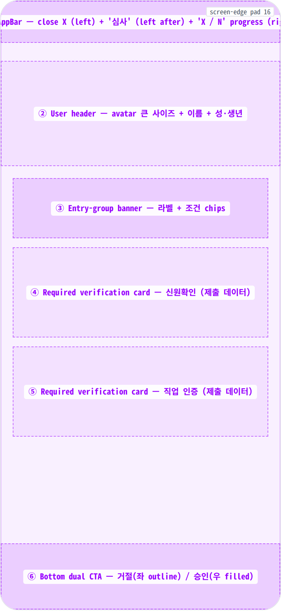
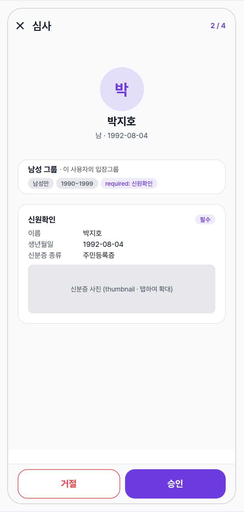
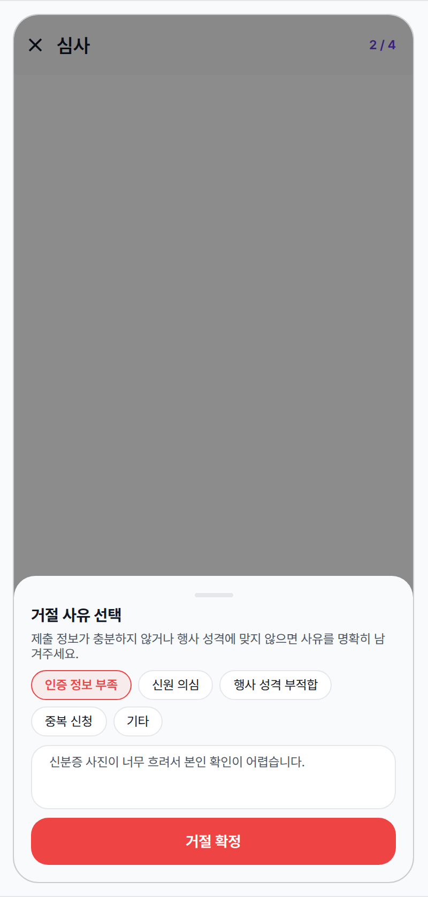
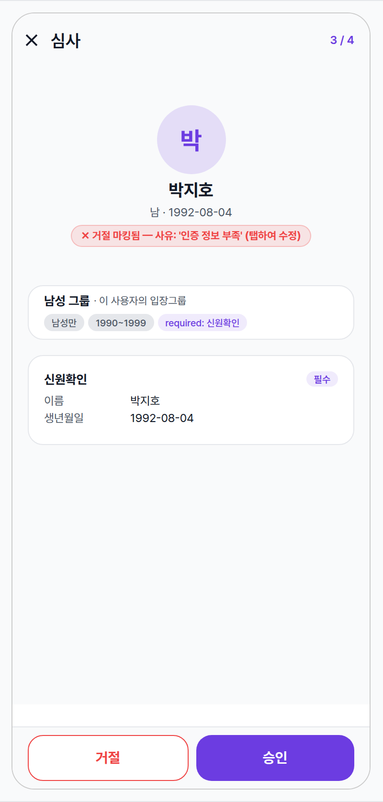
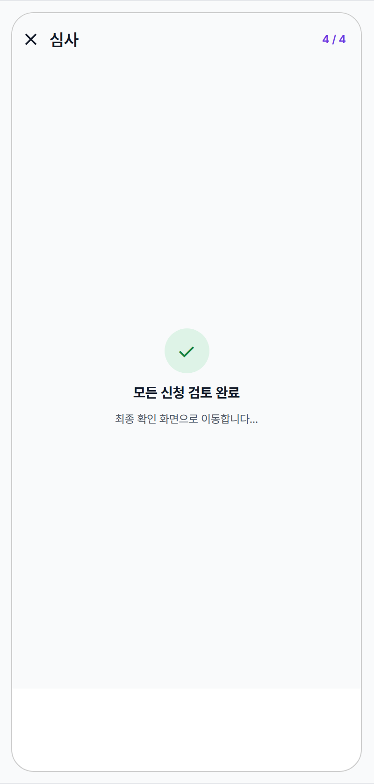

 Spec — EventApplicationReviewCarouselPage (app\_partner · EventApplicationReviewCarouselRoute)  

# Event Application Review Carousel

## Overview

| Status | 📝 신규작성 — v1 (배치 심사 carousel · deferred marking) |
|---|---|
| App | app_partner |
| Category | party · event · application · review (batch) |
| Route / Surface | EventApplicationReviewCarouselRoute · widget: EventApplicationReviewCarouselPage |
| Path | /more/parties/:partyId/events/:eventId/applications/review (query: ?start=:applicationId) |
| Hierarchy | Parent: EventApplicationListPage (심사 대기 카드 탭 / sticky CTA)Children (sequel): EventApplicationReviewConfirmRoute (큐 종료 시 replace push) |
| Purpose | 심사 대기 신청을 한 명씩 풀스크린에서 빠르게 검토하고 로컬에 마킹(승인 / 거절 + 사유)하기 위한 화면. 제출 정보는 입장그룹의 required verifications만 노출 — 운영자가 매번 무엇을 봐야 하는지 의식하지 않아도 그룹 정책이 자동으로 좁혀준다. 마킹은 즉시 백엔드로 커밋되지 않고, 큐가 끝난 뒤 확인 화면에서 한 번에 커밋한다(deferred batch). |
| User journey | Entry: 리스트에서 카드 탭 → 그 사용자부터 시작 / sticky CTA 탭 → 큐 첫 사용자부터.Loop: 사용자 검토 → 승인 또는 거절(+ 사유 sheet) → 자동 다음 사용자 → 큐 끝까지 반복.Exit: 큐 끝 → confirm 화면으로 replace / 뒤로가기 → 리스트로 pop (마킹 보존) / appbar X(close) → 리스트로 pop (마킹 보존). |
| Background | 기존 흐름은 카드 → 상세 페이지 → 승인/거절 → 리스트 복귀 → 다음 카드. 매 결정마다 페이지 전환과 리스트 invalidate 비용이 들었다. carousel 패턴으로 (1) 페이지 전환을 큐 안에서 swipe-in으로 압축, (2) 백엔드 커밋을 confirm까지 연기해 부분 실패 위험을 줄인다. tinder 스타일 swipe만 차용하지 않은 이유는 거절에 사유 입력이 필요하기 때문 — 듀얼 CTA + bottom sheet 조합으로 사유 명시를 강제한다. |
| Frequency | 이벤트별 심사 시점에 진입 — 보통 한 번에 5~30건 연속 처리. |

## History

| 날짜 | 버전 | 변경 사항 |
|---|---|---|
| 2026-05-03 | v1 (initial) | 초안 — 듀얼 CTA + 거절 사유 sheet + 로컬 마킹 캐시 + 자동 다음 사용자 + 큐 끝 confirm replace. |

🧱

## Layout

화면 구조 — 영역, 정렬, 간격 규칙. 색·타이포 무시.

## Blueprint & tree

`Scaffold` — AppBar(close + 'X / N' progress) + body(scrollable: 사용자 헤더 → 입장그룹 banner → required verifications 카드 stack) + bottom dual CTA(거절 좌 / 승인 우). 거절 탭 시 `showModalBottomSheet`로 사유 sheet.

**Scaffold** ├─ **appBar**: **AppBar** ← ① │ ├─ leading: `IconButton`(close · 22px) → pop with marking 보존 │ ├─ title: Text('심사') │ └─ actions: \[Text('X / N') _· 12px · w600 · primary 톤_\] ├─ **body**: `PageView.builder`(physics: NeverScrollable — auto-advance only) │ └─ **per page**: `SingleChildScrollView`(padding spacing-medium) │ ├─ **\_UserHeader** ← ② │ │ ├─ CircleAvatar(72 · primaryContainer · 이름 첫 글자) │ │ ├─ Text(user.name) _· 18px · w700_ │ │ ├─ Text('남/여 · YYYY-MM-DD') _· 12px · secondary_ │ │ └─ if 마킹됨: **\_MarkPill** (수정 모드 시그널) │ ├─ SizedBox(_spacing-medium_) │ ├─ **\_EntryGroupBanner** ← ③ │ │ ├─ row: Text(group.label) _· 13px · w700_ · Text('이 사용자의 입장그룹') _· 11px · secondary_ │ │ └─ chip row (성별 / 출생연도 / required verifications) │ ├─ SizedBox(_spacing-medium_) │ └─ for each required verification: ← ④⑤ │ └─ **\_VerificationSubmissionCard** │ ├─ Row \[Text(verification.label) _· 13px · w700_ · "필수" 태그\] │ ├─ snapshot rows (key 90px / value flex) │ └─ if 사진/파일: thumbnail (80px height · radius-small) └─ **bottomNavigationBar**: **SafeArea** ← ⑥ └─ Row(gap: spacing-small, padding: spacing-medium) ├─ **OutlinedButton**('거절') _· error 톤_ │ · onTap → showModalBottomSheet → [\_RejectReasonSheet](#sheet) └─ **FilledButton**('승인') _· primary 톤_ · onTap → 마킹(approve) → 자동 다음 페이지 (200ms 후) _\_MarkPill (수정 모드):_ └─ Container(radius 999 · padding 4/10 · 12px w700 톤별) · approve 톤: success bg 12% / border 25% / 텍스트 #15803d · "✓ 승인 마킹됨 — 변경하려면 다시 눌러주세요" · reject 톤: error bg 12% / border 25% · "✕ 거절 마킹됨 — 사유: '신분증 미제출' (탭하여 수정)" _\_RejectReasonSheet:_ (showModalBottomSheet) └─ DraggableScrollableSheet(initialSize 0.5) ├─ handle bar (36×4 · divider) ├─ Text('거절 사유 선택') _· 15px · w700_ ├─ Text('제출 정보가 충분하지 않거나 행사 성격에 맞지 않으면 사유를 명확히 남겨주세요.') _· 12px · secondary_ ├─ **Wrap** (predefined chip × 5) │ · '인증 정보 부족' / '신원 의심' / '행사 성격 부적합' / '중복 신청' / '기타' │ · 선택 시 error 톤으로 활성 ├─ **TextField**(placeholder: '추가 설명 또는 자유 입력 (선택, "기타" 선택 시 필수)') │ · multiline · min 60px · 12px └─ **FilledButton**('거절 확정') · disabled 조건: chip 미선택 AND 자유 입력 비어있음 / chip="기타" AND 자유 입력 비어있음 · onTap → 마킹(reject + reason 합성) → sheet dismiss → 자동 다음 페이지

## Spacing & alignment rules

| # | Region | Alignment | Spacing / tokens |
|---|---|---|---|
| ① | AppBar | close left · title · progress right | 56px · centerTitle: false · progress text 12px w600 color-partner-primary · margin-right spacing-screen-edge |
| ② | User header | centered column · gap 6px | v-padding spacing-large top / spacing-medium bottom · avatar 72px · 이름 18px w700 · sub 12px secondary |
| ③ | Entry-group banner | 풀폭 카드 | radius radius-card · border 1px color-divider · padding spacing-small/spacing-medium · 라벨 13px w700 · caption 11px secondary · chip row gap 4px · margin-y spacing-medium |
| ④⑤ | Verification card | 풀폭 카드 stack | padding spacing-medium · radius radius-card · border 1px color-divider · bg color-background · 카드 사이 spacing-small · 제목 13px w700 · "필수" 태그 10px w600 primary 10% bg · row 12px · key width 90px secondary / val flex primary · 사진 thumb 80px height radius-small |
| ⑥ | Bottom dual CTA | row · gap small · SafeArea inset | height 48 + padding · gap spacing-small · 거절 outline 1px color-error + text error · 승인 filled color-partner-primary + white · 두 버튼 동일 weight 1 |
| — | Reject sheet | bottom sheet · max 50% height | radius top 20px · handle 36×4 divider · 제목 15px w700 · sub 12px secondary · chip 12px outline · 선택 chip color-error 8% bg + error border · TextField multiline · 거절 확정 버튼 height 44 · disabled 시 divider bg + secondary text |
| — | Mark pill | 좌측 상단 inline | radius 999 · padding 4/10 · 12px w700 · approve 톤 #15803d (12% bg + 25% border) · reject 톤 color-error (12% bg + 25% border) |

🎨

## States

시각 변형 4종.

**State 식별 기준**: (a) 마킹 상태(없음 / 승인 / 거절) (b) 사유 sheet 노출 (c) 큐 종료 transition.

### State 1 · Default 심사 화면 🎯 baseline

| 항목 | 내용 |
|---|---|
| 조건 | 큐 안 한 사용자 진입 직후 (마킹 없음). 입장그룹 banner + required verifications만 노출 (그룹 정의 외 verification은 노출 X). |
| 사용자 액션 | · 승인 탭 → 로컬 마킹(approve) → 200ms 뒤 다음 페이지로 swipe-in (자동 advance)· 거절 탭 → 사유 sheet 모달 노출(State 2)· 썸네일 탭 → 풀스크린 이미지 viewer (별도 spec — 본 spec 범위 밖)· appbar close X / 뒤로가기 제스처 → queue 모드에서는 리스트로 pop · modify 모드(State 3 진입 컨텍스트)에서는 confirm 화면으로 pop · 두 경우 모두 로컬 마킹은 보존 |
| 에지케이스 | · 입장그룹의 required가 0개면 verification 카드 영역이 비어있고 banner 아래 "추가 제출 정보 없음" 안내 노출(빈 줄 금지)· 사용자가 required verification 일부를 미제출했으면 해당 카드에 "미제출" 시그널 + 거절 사유 자동 prefill 후보로 'required' chip 강조· progress 'X / N' = 큐 안 위치(1-indexed) / 큐 총 길이 |
| 컴포넌트 | Scaffold · AppBar · PageView.builder · SingleChildScrollView · _UserHeader · _EntryGroupBanner · _VerificationSubmissionCard · OutlinedButton(거절) · FilledButton(승인) · SafeArea |
| 토큰 | color-primary(partner — avatar bg @ 15% / progress text / 승인 버튼 / required chip 10%) · color-text-primary(이름 / 카드 제목 / val) · color-text-secondary(서브 / caption / key / 일반 chip) · color-error(거절 버튼 outline + text) · color-divider(카드 border / 일반 chip bg / 사진 placeholder bg) · color-background(카드 bg) · radius-card · radius-small(사진) · 999(chip / pill) · typography 18px w700 (이름) / 13px w700 (label · 카드 제목) / 12px (sub · key · val · caption) / 11px secondary / 10px w500 (chip) / 10px w600 ("필수" 태그) / 15px w700 (CTA) |
| 노트 | 📝 baseline. 자동 advance는 마킹 후 200ms 지연 → PageController.nextPage 호출(기본 페이지 전환 ~300ms slide). 운영자가 의도적으로 swipe하지 않도록 physics는 NeverScrollable. |

### State 2 · 거절 사유 sheet reject-flow

| 항목 | 내용 |
|---|---|
| 조건 | 거절 버튼 탭 시 등장. 단일 chip 선택 가능 + 자유 입력 텍스트 영역. predefined chip을 선택하지 않고 자유 입력만 채워도 거절 가능. |
| 사용자 액션 | · chip 탭 → 단일 선택 토글 (다른 chip 선택 시 이전 chip 해제)· 자유 입력 → multiline 텍스트, predefined chip과 함께 저장됨· "기타" 선택 → 자유 입력이 필수가 됨 (비어있으면 거절 확정 disabled)· 거절 확정 탭 → 마킹 합성("predefined: chip 라벨 / 추가: 자유입력") → sheet dismiss → 자동 다음 페이지· handle 드래그 다운 / overlay 탭 → 사유 미선택 상태로 sheet dismiss (마킹 X · 사용자 결정 보류) |
| 노트 | 📝 사유 강제는 하지 않되, 단순 거절을 한 발짝 늦춤으로써 운영자가 한 번 더 사유를 의식하게 한다. predefined chip은 5개 — 정책상 추가는 사용자 요청 후에. |

### State 3 · 이미 마킹된 사용자 재진입 modify

| 항목 | 내용 |
|---|---|
| 조건 | confirm 화면에서 마킹된 사용자 카드 탭으로 진입(modify 모드). _MarkPill이 사용자 헤더 아래 노출되어 현재 마킹 상태와 사유를 명시. CTA 라벨은 baseline과 동일('거절' / '승인') — 실제 동작은 진입 모드에 따라 달라진다. |
| 사용자 액션 | · 거절 버튼 탭 → 사유 sheet 노출 (현재 거절 마킹이면 기존 사유 prefill 후 편집, 승인 마킹이면 새 사유 입력) → 확정 시 마킹 갱신 → confirm 화면으로 즉시 pop· 승인 버튼 탭 → 마킹을 승인으로 갱신(기존 거절 사유는 폐기, 변경 없으면 동일) → confirm 화면으로 즉시 pop· _MarkPill 탭 → 거절 마킹이면 사유 sheet 다시 열어 사유만 수정 가능, 승인 마킹이면 동작 없음(시각적 시그널 역할만)· appbar close X / 시스템 back → confirm 화면으로 pop (queue 모드의 list pop과 다름) · 마킹은 보존· 수정 모드는 단일 사용자만 다룸 — 액션 후 자동 다음 사용자 advance는 일어나지 않고 항상 confirm으로 복귀 |
| 노트 | 📝 진입 모드는 라우트 인자(mode: queue \| modify)로 carousel 페이지가 인식. 같은 화면이지만 close X 도착지와 advance 정책이 분기. CTA 라벨은 통일해 학습 비용을 낮춤. |

### State 4 · 큐 종료 transition end

| 항목 | 내용 |
|---|---|
| 조건 | 마지막 사용자에 대해 마킹이 끝난 직후, confirm 화면 push 직전 짧은 transition. Auto-advance 200ms 이후 fade transition으로 confirm 화면 replace. |
| 사용자 액션 | · 사용자 액션 없음 — 자동으로 confirm 화면으로 replace push (carousel은 백 스택에서 제거되어 confirm에서 뒤로가기 시 리스트로 직접 복귀) |
| 노트 | 📝 transition은 약 600ms — 중간 빈 시간이 어색하지 않도록 success 시그널을 잠시 노출. 운영자가 confirm 화면 도착을 명확히 인지. |

🔄

## Global Behavior

모든 state에 동일하게 적용되는 동작.

## 큐 정의 & advance 규칙

-   큐 = 화면 진입 시점의 모든 심사 대기 신청 snapshot, `created_at ASC` 정렬 (입장그룹 경계 무시).
-   큐는 진입 후 고정 — 새 신청이 들어와도 진행 중인 큐에는 합류하지 않는다 (다음 진입 시 새 큐로).
-   승인 / 거절 마킹 → 200ms 후 `PageController.nextPage`로 다음 사용자 swipe-in.
-   마지막 사용자에서 마킹 → State 4 transition(약 600ms) → confirm 화면 `pushReplacement`.
-   수정 모드(State 3) 진입 시 advance 규칙은 다름: 마킹 갱신 후 confirm으로 즉시 pop, 다음 사용자로 advance하지 않음.

## 진입 모드 & close 동작 분기

-   라우트 인자로 진입 모드 식별 — `mode: queue`(리스트/CTA에서 진입) / `mode: modify`(confirm 카드 탭에서 진입).
-   **queue 모드** — close X / 시스템 back → 리스트로 pop. 자동 advance + 큐 끝 confirm pushReplacement 흐름 동작.
-   **modify 모드** — close X / 시스템 back → confirm 화면으로 pop (한 단계만). 자동 advance 없음, 결정 후 즉시 confirm으로 pop.
-   두 모드 모두 마킹 캐시는 동일 컨테이너를 공유 — 진입 모드만 동작 분기를 결정한다.

## 로컬 마킹 캐시

-   저장 단위: `(eventId)` 키. 값: `{ marks: Map<applicationId, MarkEntry> }` · MarkEntry = `{ action: 'approve'|'reject', reason?: string, predefinedReasonCode?: string }`.
-   저장 위치: 메모리(StateNotifier 또는 Riverpod state) — 디스크 영속화 안 함. "페이지 이탈 시 무효화" 정책과 일관.
-   무효화 트리거:
    -   리스트 화면이 백 스택에서 pop될 때 (EventDetailPage 등 상위로 이동)
    -   confirm 화면에서 최종 확정 성공 시
    -   confirm 화면에서 명시적 "전체 취소" 액션 (제공된다면)
-   보존되는 흐름: 리스트 ↔ carousel ↔ confirm 사이 이동, carousel 안 close 후 리스트로 pop.
-   주의: 앱 종료 / 강제 kill 시 마킹은 손실 — UX 가정상 한 세션 안에 끝낸다.

## 거절 사유 합성 규칙

-   predefined chip 단독 → `reason = chip 라벨` (예: "인증 정보 부족")
-   predefined chip + 자유 입력 → `reason = "{chip 라벨} — {자유 입력}"`
-   "기타" chip + 자유 입력 → `reason = 자유 입력` (chip 라벨은 합치지 않음 — UX상 무의미)
-   chip 미선택 + 자유 입력만 → `reason = 자유 입력`
-   chip 미선택 + 자유 입력 비어있음 → 거절 확정 버튼 disabled (사용자가 chip 또는 자유 입력 중 하나는 채워야 함)
-   "기타" chip 단독(자유 입력 비어있음) → 거절 확정 버튼 disabled (기타는 본문 필수)

## Verification 노출 정책

-   그 사용자가 속한 입장그룹의 **required\_verification\_ids만** 노출. 그룹 정의 외 verification은 제출되었더라도 carousel에서는 노출 X (정보량을 운영자에게 강제 좁힘).
-   그룹 정의된 required 중 사용자가 미제출한 항목 → 카드 자리는 유지하되 "미제출" 시그널 + 자유 입력 prefill 후보 표기 (거절 사유로 자동 prefill하지는 않음 — 운영자 판단 보존).
-   verification 카드 안 표기는 verification.type별로 다름 — 신원확인은 이름/생년/신분증 종류 + 사진 thumbnail. 직업 인증은 회사명/직급/명함. (각 type별 세부 layout은 후속 spec에서 정리.)
-   thumbnail 탭 시 풀스크린 이미지 viewer는 본 spec 범위 밖 — 별도 PhotoViewerRoute 활용.

## Capacity guard 미리보기

-   carousel은 capacity 검증을 수행하지 않음 — 마킹은 로컬, 커밋은 confirm에서 수행.
-   confirm 화면이 unified bulk review API를 호출하면 백엔드가 단일 트랜잭션 안에서 capacity guard를 적용 → 초과분은 `skipped_due_to_capacity`로 반환.
-   운영자가 capacity를 초과해 마킹할 수 있게 허용하는 이유: (1) 입장그룹별 capacity 분포가 변동될 수 있음 (2) 명시적 결과를 confirm에서 보여주는 것이 더 명확.

🔗

## Reference

관련 라우트 · 화면 · 구현 소스.

## Implementation source

| Route | EventApplicationReviewCarouselRoute |
|---|---|
| Path | /more/parties/:partyId/events/:eventId/applications/review (query: ?start=:applicationId) |
| Widget class | EventApplicationReviewCarouselPage (+ _UserHeader · _EntryGroupBanner · _VerificationSubmissionCard · _RejectReasonSheet · _MarkPill) |
| App | app_partner |
| Source (예상) | apps/app_partner/lib/src/features/event/applications/review/event_application_review_carousel_page.dart |
| Marking state | StateNotifier reviewMarkingProvider(eventId) 또는 동등한 in-memory 컨테이너 |

## Backend dependency

| Final commit API | Unified bulk review EF — #2101 참조. carousel은 호출하지 않음 (confirm 화면에서 호출). |
|---|---|
| Single approve fallback | partner-approve-application EF (action: approve) — confirm 화면이 unified API 미가용 시에 사용 가능한 fallback. 본 carousel은 호출 X. |
| Single reject fallback | partner-reject-application EF — 동일하게 confirm 화면의 fallback. |

## Related screens

| Spec | 관계 |
|---|---|
| EventApplicationListPage | Parent — 카드 탭 / sticky CTA로 진입. |
| EventApplicationReviewConfirmPage | Sequel — 큐 종료 시 replace push. 마킹 수정 시 carousel로 단일 사용자 push (State 3 진입). |
| EventApplicationDetailPage | Sibling (alt path) — 처리 완료 신청은 carousel이 아니라 detail로 직접 push. |