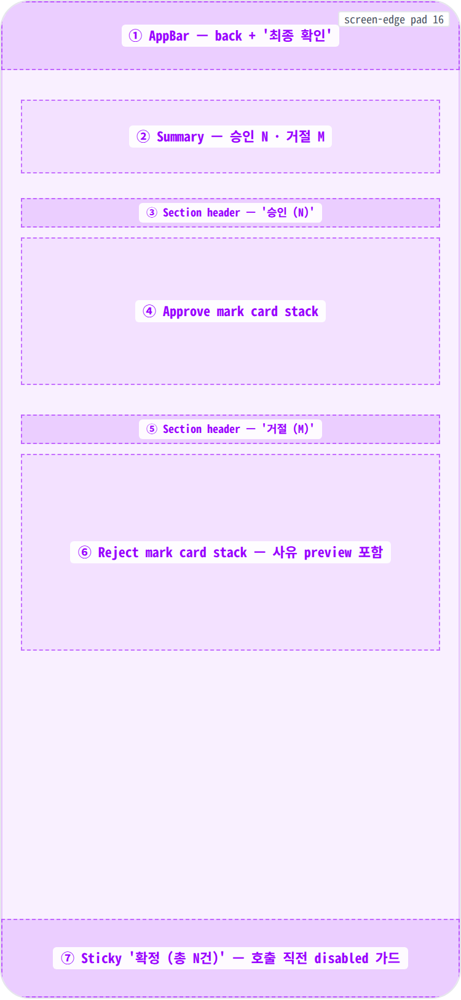
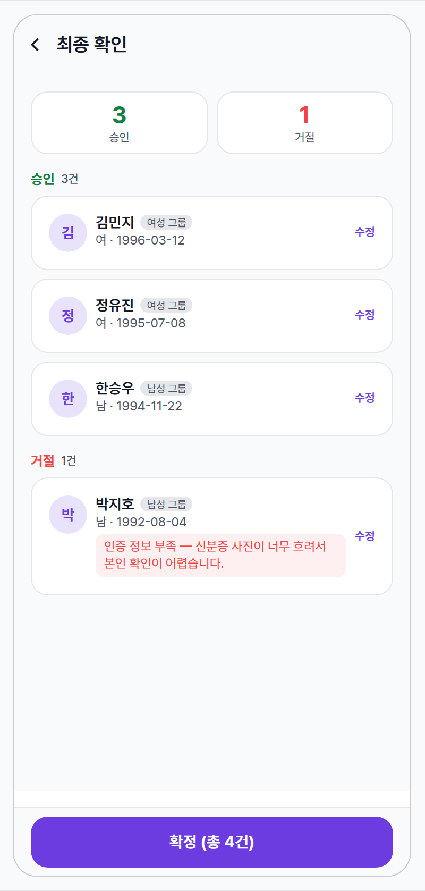
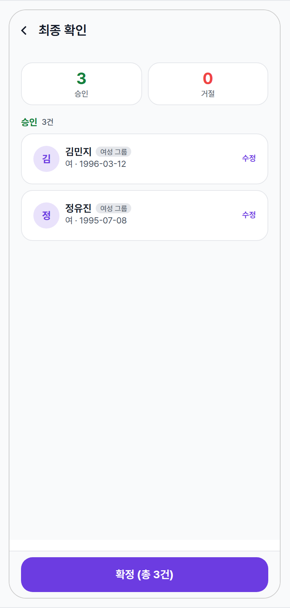
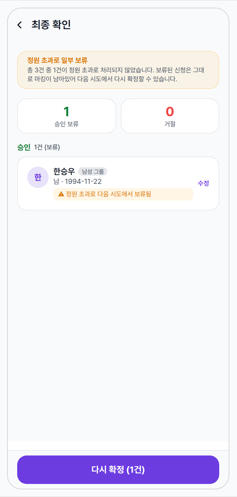
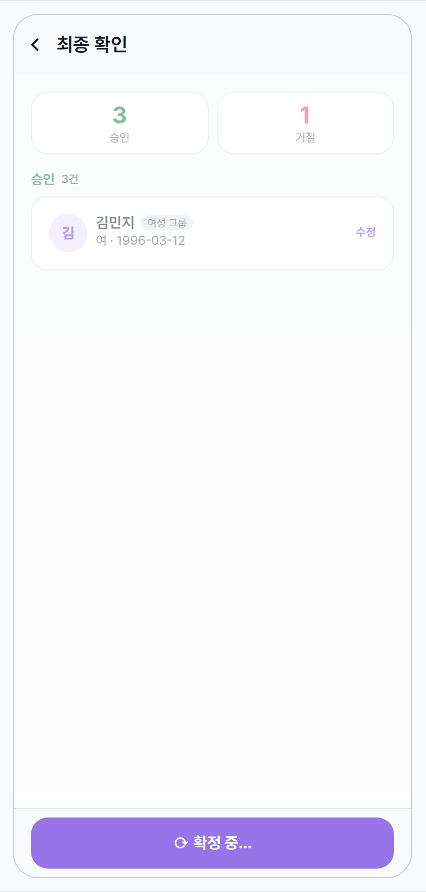
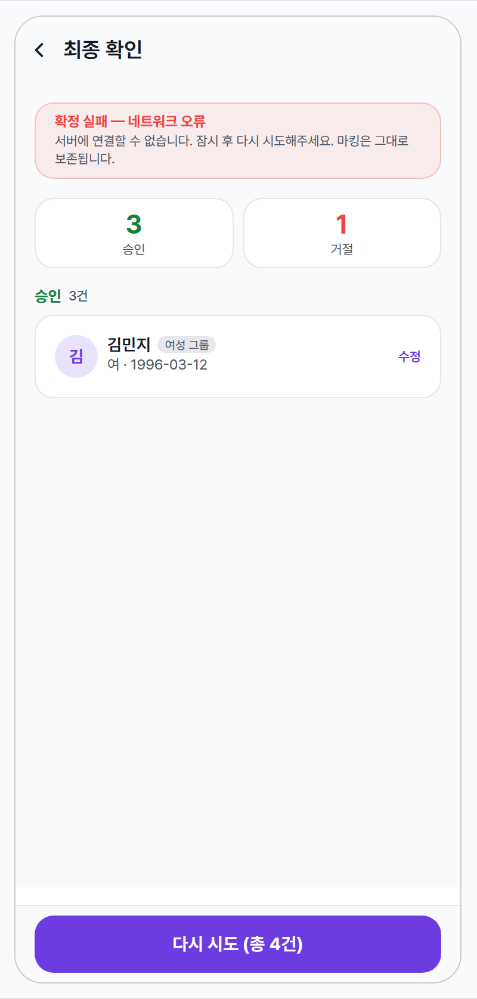

 Spec — EventApplicationReviewConfirmPage (app\_partner · EventApplicationReviewConfirmRoute)  

# Event Application Review Confirm

## Overview

| Status | 📝 신규작성 — v1 (carousel 마킹 최종 확인 + 단일 트랜잭션 커밋) |
|---|---|
| App | app_partner |
| Category | party · event · application · review (commit) |
| Route / Surface | EventApplicationReviewConfirmRoute · widget: EventApplicationReviewConfirmPage |
| Path | /more/parties/:partyId/events/:eventId/applications/review/confirm |
| Hierarchy | Parent (replace): EventApplicationReviewCarouselPage (큐 종료 시 pushReplacement으로 진입 — carousel은 백 스택에서 제거)Modify entry: 본 화면에서 마킹된 사용자 카드 탭 → carousel 단일 사용자 push (수정 모드 · State 3) |
| Purpose | carousel에서 누적된 마킹(승인 / 거절)을 한 화면에서 검토하고 단일 트랜잭션으로 커밋하는 화면. 마킹 수정이 필요하면 카드 탭으로 carousel 수정 모드에 진입해 그 사용자만 다시 결정한 뒤 본 화면으로 자동 복귀한다. 확정 시 통합 bulk review API(#2101)를 호출해 승인 + 거절을 같은 트랜잭션으로 처리하고, capacity 초과분은 결과 화면에 명시한다. |
| User journey | Entry: carousel 큐 종료 → State 4 transition → 본 화면 replace pushLoop: 마킹 검토 → 카드 탭으로 수정(선택) → 확정 버튼 → 백엔드 호출 → 성공 시 리스트로 pop, 마킹 캐시 invalidateExit: 확정 성공 → 리스트 / appbar back → 리스트 (마킹 보존, 다시 carousel 진입 가능) |
| Background | deferred batch 패턴의 마지막 단계. carousel 단계는 빠른 결정에 집중하고, 검토와 커밋은 분리해 부분 실패 위험을 줄였다. 단일 트랜잭션으로 보내는 이유는 (1) 일부만 처리되면 운영자가 어디까지 갔는지 파악하기 어렵고 (2) capacity guard가 batch 안에서 한 번에 적용되어야 정확하기 때문. |
| Frequency | carousel 1회당 1번 — 한 세션 안에서 한 번만 도달. |

## History

| 날짜 | 버전 | 변경 사항 |
|---|---|---|
| 2026-05-03 | v1 (initial) | 초안 — summary header + 승인/거절 섹션 + 카드 탭 수정 진입 + 확정 버튼 → unified bulk review API. capacity skip 결과 처리 + error 회복 흐름 포함. |

🧱

## Layout

화면 구조 — 영역, 정렬, 간격 규칙. 색·타이포 무시.

## Blueprint & tree

`Scaffold` — AppBar(back + '최종 확인') + body(scrollable: summary 2-cell row → 승인 섹션 카드 stack → 거절 섹션 카드 stack) + bottom sticky '확정' 버튼. capacity skip / error는 본문 상단 banner로 노출.

**Scaffold** ├─ **appBar**: **AppBar**('최종 확인') ← ① │ · leading: BackButton → 리스트로 pop, 마킹 캐시 보존 ├─ **body**: `SingleChildScrollView`(padding: spacing-medium) │ ├─ _(if 직전 시도에서 capacity skip 또는 error 발생):_ │ │ └─ **\_Banner** (warn / err 톤) │ ├─ **\_Summary** ← ② │ │ · Row \[ │ │ · \_SummaryCell(승인 · 22px w700 success 톤 · 'N건') │ │ · \_SummaryCell(거절 · 22px w700 error 톤 · 'M건') │ │ \] │ ├─ if approveMarks.isNotEmpty: ← ③④ │ │ ├─ Text('승인 (N)') _· 13px · w700 · success 톤_ │ │ └─ **\_MarkCard** × N │ │ · onTap → push CarouselRoute(modifyMode: true, applicationId) │ └─ if rejectMarks.isNotEmpty: ← ⑤⑥ │ ├─ Text('거절 (M)') _· 13px · w700 · error 톤_ │ └─ **\_MarkCard** × M │ · 사유 preview row (error 톤 8% bg) │ · onTap → push CarouselRoute(modifyMode: true, applicationId) └─ **bottomNavigationBar**: **SafeArea** ← ⑦ └─ **FilledButton**('확정 (총 N건)') · onTap → unified bulk review API 호출 · loading 중에는 spinner + 라벨 '확정 중...' (탭 무효화) · 마킹 0건이면 disabled (이론상 발생 안 함 — carousel 큐가 1+ 일 때만 도달) _각 \_MarkCard 내부:_ └─ Container(InkWell wrap) └─ Row(padding: spacing-medium, gap: spacing-small) ├─ **CircleAvatar**(36 · primaryContainer · 이름 첫 글자) ├─ Expanded Column \[ │ Row \[Text(user.name) _· 14px w600_ · \_GroupChip(group.label)\] │ Text('남/여 · YYYY-MM-DD') _· 12px secondary_ │ if reject: Container(reason · error 8% bg · 12px) _· max 2 줄 · ellipsis_ │ if 직전 capacity skip: Container('정원 초과로 다음 시도에서 보류됨' · warn 톤) │ \] └─ Text('수정') _· 11px w600 primary 톤 · 좌측 정렬 align-center_

## Spacing & alignment rules

| # | Region | Alignment | Spacing / tokens |
|---|---|---|---|
| ① | AppBar | back left · title · 56px | centerTitle: false · h-pad spacing-screen-edge |
| ② | Summary row | row · gap small · cell flex 1 | cell padding spacing-small/spacing-medium · radius radius-card · border 1px color-divider · 숫자 22px w700 톤별 (success / error / primary) · 라벨 11px secondary · margin-bottom spacing-medium |
| ③⑤ | Section header | 좌측 정렬 · 단독 한 줄 | 13px w700 톤별 (success/error) · margin-top spacing-medium · margin-bottom spacing-small |
| ④⑥ | Mark card | 풀폭 · row(avatar + body + edit affordance) | padding spacing-medium · radius radius-card · border 1px color-divider · bg color-background · 카드 사이 spacing-small · avatar 36px (carousel 72보다 작음 — 요약 화면) · 그룹 chip 10px secondary · 사유 텍스트 12px error · radius-small · padding 4/8 · max 2 줄 |
| ⑦ | Sticky CTA | bottom · full width · SafeArea inset | height 48 · radius radius-card · bg color-partner-primary · 라벨 15px w700 white · disabled 시 divider bg + secondary text · loading 시 70% alpha bg + spinner |
| — | Capacity warn banner | 풀폭 · summary 위 | bg color-warning 8% · border 25% · 제목 12px w700 · sub 11px secondary line-height 1.4 · padding small/medium · radius radius-card |
| — | Error banner | 풀폭 · summary 위 | bg color-error 8% · border 25% · 제목 12px w700 · sub 11px secondary |

🎨

## States

시각 변형 5종.

**State 식별 기준**: (a) 마킹 분포(승인/거절 둘 다 / 한쪽만) (b) 제출 상태(idle / loading / capacity skip 결과 / error).

### State 1 · Default 🎯 baseline · 승인 + 거절 모두 있음

| 항목 | 내용 |
|---|---|
| 조건 | 마킹된 신청 ≥1건 + 승인/거절 둘 다 존재. capacity skip / error 없음. 확정 버튼 활성. |
| 사용자 액션 | · 카드 탭 → carousel 단일 사용자 push (수정 모드) → 결정 후 본 화면으로 자동 복귀· 확정 버튼 탭 → unified bulk review API 호출 → loading state(State 4) → 성공 시 리스트로 pop + 마킹 캐시 invalidate / capacity skip이면 State 3 / 에러면 State 5· back / 뒤로가기 → 리스트로 pop, 마킹 캐시 보존 (다시 carousel/confirm 진입 가능) |
| 에지케이스 | · 거절 사유 텍스트는 max 2줄 + ellipsis (긴 사유는 잘림)· 사용자가 속한 입장그룹 chip을 카드에 작게 노출(컨텍스트 보강)· 같은 입장그룹의 사용자들이 인접하도록 정렬(승인 섹션 안에서 그룹별 묶음 — 정렬만, sub-section은 X)· 마킹 0건이면 이론상 도달 X (carousel이 큐 비었을 때만 confirm push, 큐 비면 진입 자체 X) |
| 컴포넌트 | Scaffold · AppBar · SingleChildScrollView · _Summary(2-cell row) · _SectionHeader(approve/reject 톤) · _MarkCard(avatar + body + 사유 preview + edit affordance) · FilledButton(sticky 확정) · SafeArea |
| 토큰 | color-primary(partner — avatar bg @ 15% / edit affordance / 확정 버튼) · color-text-primary(이름 / 카드 제목) · color-text-secondary(서브 / 그룹 chip / count) · #15803d(승인 톤 — summary 숫자 / 섹션 헤더) · color-error(거절 톤 — summary 숫자 / 섹션 헤더 / 사유 텍스트 + 8% bg) · color-divider(카드 border / 그룹 chip bg) · radius-card · radius-small(사유 bg) · 999(그룹 chip) · typography 22px w700 (summary 숫자) / 14px w600 (이름) / 13px w700 (섹션) / 12px (사유 / 서브) / 11px (count / edit affordance / summary 라벨) / 10px (그룹 chip) / 15px w700 (CTA) |
| 노트 | 📝 baseline. 운영자가 carousel에서 빠르게 결정한 내용을 한 화면에 요약해 보여줘 의도를 한 번 더 확인할 기회를 제공. |

### State 2 · 한쪽만 single-side · 승인만 또는 거절만

| 항목 | 내용 |
|---|---|
| 조건 | 한쪽만 마킹된 케이스 (예: 승인만 3건). summary는 두 cell 모두 노출하되 비어있는 쪽은 0으로 표시. 거절 섹션 헤더 + 카드 모두 렌더 X. |
| 사용자 액션 | State 1과 동일. 운영자가 거절을 추가로 마킹하고 싶으면 back → 리스트로 가서 그 사용자 카드를 탭(아직 처리 완료 그룹에 없으니 심사 대기에 남아있음)해 carousel 진입 후 거절. 다시 confirm으로 도달. |
| 노트 | 📝 가장 흔한 케이스 — 거절은 드물기 때문에 보통 승인만 있는 화면을 자주 본다. |

### State 3 · Capacity skip 결과 capacity-skip

| 항목 | 내용 |
|---|---|
| 조건 | 직전 확정 시도에서 백엔드가 일부 신청을 capacity 초과로 skip한 결과. 처리된 건은 마킹 캐시에서 제거되고 보류된 건만 화면에 남아있다. 상단 warn banner + 카드별 cap 시그널. |
| 사용자 액션 | · 다시 확정 탭 → 보류된 마킹만 다시 unified API에 전송 (capacity가 비어있을 때만 통과)· 카드 탭 → carousel 수정 모드 — 거절로 변경하거나 마킹 해제(미정 처리)· back → 리스트로 pop. 보류된 마킹은 캐시에 남아 다음 carousel/confirm 진입 시 그대로 보임.· 마킹 해제 흐름 — 사용자가 capacity skip을 보고 결정을 내려놓고 싶다면 carousel 수정에서 거절로 바꾸거나 마킹 자체를 제거할 수 있어야 함 (carousel 수정 모드에 "마킹 해제" 옵션 추가 — 후속 spec 보강). |
| 노트 | ⚠ capacity skip 시그널은 운영자에게 명확히 — 단순 빈 결과로 보이면 혼란. banner + 카드별 cap 시그널 이중화로 의도를 강조. |

### State 4 · 제출 중 loading

| 항목 | 내용 |
|---|---|
| 조건 | 확정 버튼 탭 직후, unified bulk review API 응답 대기 중. 본문은 50% opacity로 가라앉히고 pointer-events 차단. CTA 버튼은 spinner + 라벨 변경 + 70% bg. |
| 사용자 액션 | · 모든 인터랙션 차단 (back 버튼 포함 — 시스템 back은 무시)· API 응답에 따라 자동 전환:전체 성공 → 성공 SnackBar + 리스트로 pop + 마킹 캐시 invalidate일부 capacity skip → State 3로 전환네트워크/서버 에러 → State 5로 전환 (마킹 보존) |
| 노트 | 📝 호출 시간은 일반적으로 1~3초. 5초 넘으면 timeout 처리 (State 5). |

### State 5 · 에러 error

| 항목 | 내용 |
|---|---|
| 조건 | API 호출 실패 (네트워크 / 서버 / timeout / 권한). 마킹은 모두 보존되고 본문 상단에 error banner 노출. 확정 버튼 라벨은 '다시 시도'로 변경. |
| 사용자 액션 | · 다시 시도 탭 → State 4로 전환 후 재호출· back → 리스트로 pop, 마킹 캐시 보존 (다음 진입 시 confirm으로 다시 도달 가능)· 카드 탭 → carousel 수정 모드 (에러 상태에서도 가능)· 같은 에러가 3회 이상 반복되면 banner 카피를 더 구체적으로 — '서버 점검 중일 수 있습니다. 잠시 후 다시 시도해주세요.' |
| 노트 | ⚠ 에러 발생 시 마킹 보존이 최우선 — 절대 자동 invalidate 금지. 운영자가 다시 시도할 수 있는 경로를 명시. |

🔄

## Global Behavior

모든 state에 동일하게 적용되는 동작.

## 커밋 트랜잭션 정책

-   확정 버튼 → unified bulk review EF([#2101](https://github.com/Mark-Yun/minglit/issues/2101)) 호출 — 승인 + 거절을 단일 트랜잭션으로 처리.
-   응답 분기:
    -   **전체 성공**: `{ approved: [...], rejected: [...], skipped_due_to_capacity: [] }` → 성공 SnackBar + 리스트로 pop + 마킹 캐시 invalidate
    -   **부분 capacity skip**: `skipped_due_to_capacity` 비어있지 않음 → State 3로 전환, 처리된 건만 캐시에서 제거하고 보류된 건은 유지
    -   **전체 실패**: 네트워크/서버 에러 → State 5, 마킹 캐시 전체 보존
-   API가 부재하거나 미가용 시 fallback: 기존 single approve / single reject EF를 순차 호출 — 성공한 건은 캐시에서 제거, 실패한 건은 보존. (트랜잭션성은 보장 안 됨, 사용자에게 명시.)

## Capacity skip 결과 노출 규칙 (State 3)

-   **상단 banner** — warn 톤. 제목 "정원 초과로 일부 보류" + 본문 "총 N건 중 M건이 정원 초과로 처리되지 않았습니다. 보류된 신청은 그대로 마킹이 남아있어 다음 시도에서 다시 확정할 수 있습니다."
-   **summary cell 라벨** — 보류된 마킹 분포에 한해 라벨이 "승인 보류" / "거절 보류"로 변경(숫자는 보류된 건수 기준). 처리된 건은 캐시에서 제거되어 표시 X.
-   **섹션 카운트** — "(N건)" 대신 "(N건 보류)" 표기로 보류 상태 명시.
-   **카드별 cap 시그널** — 각 보류 카드 안에 warn 톤의 "⚠ 정원 초과로 다음 시도에서 보류됨" 메시지 노출.
-   **CTA 라벨** — "확정 (총 N건)" → "다시 확정 (N건)"으로 변경 (재시도 의도 명시).
-   다시 시도 시도 시 capacity가 여전히 부족하면 같은 State 3가 반복 — 운영자가 carousel 수정으로 거절 전환하거나 캐시에서 제거할 수 있어야 함(후속 spec 보강).

## 수정 진입 → 자동 복귀 흐름

-   본 화면 카드 탭 → `CarouselRoute`를 single-user mode로 push (기존 carousel 큐와는 별개의 페이지로 진입).
-   carousel은 진입 모드 = modify로 인식하고 사용자 헤더 아래 \_MarkPill 노출(현재 마킹 시그널). 결정 후 자동 advance 대신 confirm 화면으로 즉시 pop.
-   마킹 해제 옵션 — 사용자가 결정을 보류하고 싶을 때 carousel 수정 모드 안에 "마킹 해제" 동작 제공 (구체 UI는 carousel spec 후속 보강).

## 마킹 정렬 정책

-   승인 섹션 — 입장그룹별로 인접하도록 정렬(같은 그룹의 사용자가 모여 있도록). sub-section 헤더는 사용하지 않음 — 가벼운 정렬만.
-   거절 섹션 — 거절 사유별 분류 없이 마킹 시각 순서 (carousel에서 결정한 순서) 유지.
-   그룹 chip을 카드 안에 작게 노출해 컨텍스트는 보존.

## back 동작

-   appbar back 또는 시스템 back → 리스트로 pop. 마킹 캐시는 보존되어 리스트에서 다시 carousel 진입 가능.
-   State 4(loading) 중에는 back 무시 — API 응답 도착 후 자동 전환되도록.
-   State 5(error) 중에는 back 허용 — 에러 회복은 다음 진입에서 재시도 가능.

🔗

## Reference

관련 라우트 · 화면 · 구현 소스.

## Implementation source

| Route | EventApplicationReviewConfirmRoute |
|---|---|
| Path | /more/parties/:partyId/events/:eventId/applications/review/confirm |
| Widget class | EventApplicationReviewConfirmPage (+ _Summary · _SectionHeader · _MarkCard · _Banner) |
| App | app_partner |
| Source (예상) | apps/app_partner/lib/src/features/event/applications/review/event_application_review_confirm_page.dart |
| Marking state | carousel과 같은 in-memory 마킹 컨테이너 공유 |

## Backend dependency

| Primary | Unified bulk review EF — #2101. 승인 + 거절을 단일 트랜잭션 처리, capacity skip 결과를 명시적으로 반환. |
|---|---|
| Fallback (if unified API not available) | 기존 EF 순차 호출:partner-approve-application action=approve (single)partner-reject-application single트랜잭션성 보장 안 됨, 부분 실패 가능. |

## Related screens

| Spec | 관계 |
|---|---|
| EventApplicationReviewCarouselPage | Parent (replace) — 큐 종료 시 본 화면으로 pushReplacement. 카드 탭 수정 시 본 화면에서 carousel 단일 사용자 모드로 push. |
| EventApplicationListPage | Grandparent — 확정 성공 또는 back 시 본 화면이 pop되면 도달. 자동 invalidate로 처리된 신청이 처리 완료 그룹으로 이동. |
| EventApplicationDetailPage | Sibling — 처리 완료된 신청 회고는 detail로 (read-only). |