 Spec — EventApplicationWizardPage v2 (app\_user · EventApplicationRoute)  

# Event Application Wizard v2.0

## Overview

| Status | 🟡 v2 디자인 — Flutter 미구현 — 본인인증 + 파트너 인증 (single scroll page · iOS inset grouped 카드) + 공유 동의 (3개 list-item field) + 결제 dynamic step = 12 state. 파트너 인증 0개 / 모두 사전 승인 시 step 2가 indicator에서 자동 제외 (3-step). 부분 사전 승인 / 이전 반려 재제출 분기 포함. v1 (2-step · verifs.first만) 대체 redesign. |
|---|---|
| App | app_user |
| Category | event · admission · application · identity-verification · consent |
| Route / Surface | EventApplicationRoute · widget: EventApplicationWizardPage + _IdentityStep + _PartnerVerificationStep + _ConsentStep + _PaymentStep + _StepIndicator + _Footer |
| Path | /events/:eventId/apply (optional ?ticketId= query) |
| Hierarchy | Parent: EventDetailPage (apply CTA에서 진입)Children: PASS WebView (NICE/KCB 본인인증 SDK · external) · Iamport PG WebView (external). 그 외 step은 internal column swap. 성공 시 MinglitConfirmationPage (success tone)으로 pushReplacement — Toss-style culmination 화면.Forward refs: PersonalDataManagementPage (TBD · 후속 PR — 동의 step에서 "내 개인 정보 관리" 링크의 도착지) · 사전 승인 / 반려 분기는 backend의 partner_verified_users + verification_submissions 활용 (스키마 호환 · wizard 진입 시 fetch 필요) |
| Purpose | 이벤트 참여 신청을 본인인증 → 파트너 인증 → 개인 정보 동의 → 결제 4단계 위저드로 안내한다. 본인인증(휴대폰 PASS · NICE/KCB)으로 사용자의 identity를 확정하고, 파트너가 요구하는 qualification 인증(재직증명 / 학력증명 등) 폼을 한 step에 한 인증씩 채운 뒤, 앞 단계에서 모은 정보가 파트너에게 어떻게 공유될지 한 화면에서 검토하고 동의를 받은 후, 최종 결제 금액을 확인하고 신청을 제출한다. 무료 티켓은 결제 단계에서 즉시 확정, 유료 티켓은 Iamport WebView로 PG 결제 진행. |
| User journey | Entry points: EventDetailPage의 EventBottomTicketBar에서 티켓 선택 후 "신청하기" 탭 → ?ticketId= 쿼리로 진입.Step 1 (본인인증): 이미 본인인증을 마친 사용자는 자동 ✓ pass-through (step indicator에 "통과" 시각적으로 남김 → step 2 진입 시 short banner). 미인증 사용자는 PASS WebView 진행.Step 2 (파트너 인증): 파트너가 요구하는 인증 폼들이 한 페이지 stack scroll. 각 인증마다 진입 시 backend 상태 확인 — 같은 파트너에 이미 승인됐으면 ✓ static card · 이전 반려면 사유 banner + prefill · 신규면 빈 폼. 모두 ✓ 승인되면 step 2 자체가 indicator에서 제외되어 step 3 직행. 폼 0개도 동일.Step 3 (개인 정보 제공 동의): 정책 요약문 + 3개 list-item 필드 (제공 대상 · 제공 만료일(2개 trigger) · 제공 내역). "동의하고 다음" CTA 자체가 동의 행위 (별도 체크박스 X). 만료 = 환불 시점 OR 이벤트 종료 시점 (먼저 도달).Step 4 (결제): 무료 → 즉시 성공 화면. 유료 → Iamport WebView. 실패 → error dialog → 재시도 / 닫기.Exit points: 신청 성공 → MinglitConfirmationPage(success tone) pushReplacement — "이벤트 신청이 완료됐어요" + 1.5s scale-bounce + "확인" CTA. 닫기(X) → EventDetail 복귀. |
| Background | 밍글릿 신뢰 모델의 identity(휴대폰 본인인증)와 qualification(직업/소속/자격) 두 축이 모두 이 화면에서 수집된다. v1은 qualification만 다뤘으나, v2는 본인인증을 명시적 step으로 들이고 — identity가 확정된 사용자만 파트너 인증을 진행할 수 있다는 정책을 spec 표면으로 끌어올렸다. 개인정보보호법상 데이터 수집·제3자 제공에 대한 사용자 동의 기록이 별도 step으로 분리되어 audit trail이 명확해진다 (이전: 결제 약관에 묻혀 있었음). 공유 만료 정책은 환불 시점 OR 이벤트 종료 시점 둘 중 먼저 도달하는 trigger — 그 이후 파트너는 조회 불가, 데이터는 자동 만료. 동의 기록은 backend의 personal_data_grants 테이블에 저장되고 RLS로 본인만 조회 / 철회 가능. 사용자는 PersonalDataManagementPage(후속 PR)에서 파트너별 만료기간을 확인 / 조기 철회 가능. 환불 정책은 v2 갱신 — 파트너 심사 반려 시 100% 환불 + 이벤트 시작 시까지 미심사 상태면 100% 환불 (자동 트리거). |
| Frequency | 이벤트 신청 시마다. 한 이벤트에 한 번 (티켓 단위) 신청 가능. 본인인증은 사용자별 1회 (이후 모든 이벤트에서 ✓ pass). |

## History

이 spec의 주요 변경 이력. 최신 항목 위.

| Date | Version | Author | Changes |
|---|---|---|---|
| 2026-05-05 | 2.16 | mark-yun | Backward 애니메이션 데모 + ConfirmationPage 시각 mock. (1) Motion timing 섹션에 backward (이전 탭) 데모 추가 — forward keyframes를 animation-direction: reverse로 재생해 같은 모션의 되돌리기 시각화. ✓ done step이 다시 active로 회귀, connector 색상 풀림, 사라졌던 숫자 페이드인. (2) Success 섹션에 MinglitConfirmationPage 실제 mock 추가 — 80px 초록 circle (scale-bounce) + check stroke-draw + 제목/설명/CTA 순차 fade-up (stagger 애니메이션). 1.6초 loop으로 실제 culmination 모션을 spec에서 확인 가능. |
| 2026-05-05 | 2.15 | mark-yun | 단계 전환 애니메이션 시각 데모 + ConfirmationPage spec block. (1) Motion timing 섹션에 live CSS animation 데모 추가 — 5초 loop으로 step 1→2 transition을 실제로 재생 (number fade-out + check stroke-draw + scale bounce + connector color fill + step 2 activation). 사용자가 spec 페이지에서 직접 모션을 확인 가능. (2) Reference에 "Success — MinglitConfirmationPage spec" 신규 섹션 추가 — Dart 코드 블록 + props 표 (title / description / icon / tone / ctaLabel / onPressed / autoDismiss) 각각 의도 설명. |
| 2026-05-05 | 2.14 | mark-yun | 단계 전환 애니메이션 + ConfirmationPage 권장 props. (1) Progress bar celebration 애니메이션 추가 — 완료 step circle: 숫자 fade-out → check stroke-draw 200ms → scale 1.0→1.15→1.0 bounce 200ms → primary→success 색상 morph · connector: divider→success 색상 transition · 다음 active circle도 100ms 지연 후 scale bounce (순차 효과). (2) Body cross-fade + slide-up — 이전 fade-out 100ms + translateY -4px → 새 body fade-in 150ms + translateY +4→0px. 두 layer가 parallel로 진행되어 "단계 통과" 피드백이 한순간에 전달. (3) "이전" 탭은 celebration 없이 단순 200ms fade — 성취 모먼트가 아니므로. (4) Reference에 MinglitConfirmationPage 권장 props 명시: title "이벤트 신청이 완료됐어요" · description "파트너 심사 후 결과를 알림으로 알려드릴게요" · ctaLabel "내 티켓 보기" · onPressed → PurchaseHistoryPage. |
| 2026-05-05 | 2.13 | mark-yun | Step indicator 라벨 + 결제 결과 패턴 정비. (1) Progress bar 라벨 "공유 동의" → "개인 정보 동의". (2) 동의 화면 list-item 아이콘 circle bg → 밍글릿 민트 (color-tertiary 18% · 아이콘 svg는 진한 민트 #2da898) — 카드 자체 bg는 흰색 유지. (3) Step indicator inactive 톤 옅게 — color-text-secondary → color-divider로 변경, 진행할 step의 시각 무게 ↓. (4) State 12 redesign: 모달 dialog → snackbar로 단순화 — "결제가 취소되었어요" 한 줄 + 결제하기 버튼 즉시 재활성 (재시도 1 tap). (5) Success 화면 PaymentSuccessScreen → MinglitConfirmationPage (success tone)으로 교체 — Toss-style culmination atom 재사용 (1.5s scale-bounce + check stroke + text stagger). 매칭 성공 화면과 디자인 일관. |
| 2026-05-05 | 2.12 | mark-yun | State 6 반려 안내문 단순화 + 분기 기준 명시. (1) "이전 인증이 반려됐어요" title + "검토 일시" meta 제거 → 아이콘 + 사유 텍스트만 노출. 안내 자체에 집중하고 부수 정보 제거. (2) 분기 기준 명시: "최신 submission status"만 사용 — 과거 반려 후 승인된 인증은 자동으로 ✓ approved 분기 (State 5)로 들어가 안내문 안 보임. 예: 1차(A 반려, B 반려) → 2차(A 승인, B 반려) → 3차 진입 시 A는 ✓ approved 카드, B만 안내문 노출. |
| 2026-05-05 | 2.11 | mark-yun | 파트너 인증 — 사전 승인 / 이전 반려 재제출 분기 추가. Wizard 진입 시 partner_verified_users + verification_submissions 두 테이블을 fetch해 인증별 분기 결정 (approved / rejected / fresh). State 5 신규: 부분 사전 승인 (mixed) — 같은 파트너에 이미 승인된 인증은 ✓ static card (uneditable · 승인일 + 항목 요약) · 미승인은 일반 폼. 모든 required 인증이 사전 승인된 경우 step 2 자체가 indicator에서 제외되고 step 3 직행 (3-step 동작). State 6 신규: 이전 반려 재제출 — verification_submissions.status='rejected' 발견 시 warning banner (사유 + 검토 일시) + 이전 입력값 prefill로 빠른 수정 지원. CSS atom 추가: .wiz-form-group__approved (32px 초록 ✓ 카드) + .wiz-rejected-banner (color-error 8% bg). 스키마는 이미 모두 지원 — wizard UI/fetch 로직 보강만 필요. State 10 → 12. |
| 2026-05-05 | 2.10 | mark-yun | 파트너 인증 form group — iOS inset grouped 스타일. 세로 인덴트 가이드 → 카드 래핑 패턴. (1) Title을 카드 위쪽으로 빼고 12/600 muted secondary 톤(iOS section header 패턴). (2) fields wrapper를 흰 카드(radius-card 16 + padding spacing-medium)로 변경. (3) 회색 scaffold 위에 흰 카드가 떠 있어 그룹 분리가 자연스럽게 시각화 — divider / 세로 가이드 모두 불필요. 인풋 자체 스타일은 그대로 유지 (변경 범위 최소화). |
| 2026-05-05 | 2.9 | mark-yun | 파트너 인증 form group — 가이드 톤 ↓ + title 위치 조정. (1) 세로 가이드 색상 color-primary → color-divider (조용한 회색) — 인덴트 가이드는 구조 표시이므로 accent보다 neutral이 적절. (2) 인증명 title을 가이드 밖 (위쪽)으로 이동 — 가이드는 fields wrapper만 감싸고, title은 section header처럼 가이드 위에 노출. CSS: .wiz-form-group__fields 추가 (border-left + padding-left), .wiz-form-group에서 가이드 제거. |
| 2026-05-05 | 2.8 | mark-yun | 파트너 인증 form group — 번호 circle 제거, 세로 인덴트 가이드 도입. 22px primary circle ("1", "2") + horizontal divider 패턴이 너무 튐 → 좌측 3px primary 세로 가이드 + bold title로 교체. 가이드 + padding-left가 그룹 영역을 indentation 시각으로 묶어서 그룹 간 horizontal divider 없이도 시각 구분 명확. 번호의 sequence 함의(1/2)도 자연스럽게 제거됨 — 인증 종류는 순서가 아니라 분류이므로 더 적합. CSS: .wiz-form-group border-left 3px primary + padding-left 16px. |
| 2026-05-05 | 2.7 | mark-yun | 본인인증 카드 워딩 정비. "플랫폼 공용 이용을 위한 본인 명의 확인을 시작합니다." → "안전한 모임을 위해 처음 한 번만, 본인 명의를 확인할게요." 안전성(왜) + 1회성(부담 ↓) 두 메시지 압축. 추상적 "공용 이용" 표현 제거, 사용자가 받는 가치(안전한 모임)를 직접 명시. PASS 카드 톤("-요" 어미)과 일치. |
| 2026-05-05 | 2.6 | mark-yun | 결제 화면 환불 정책 — 세 그룹 sub-head 구조. ① 자동 환불 정책 (3개 trigger): 파트너 심사 반려 / 이벤트 시작 시까지 미심사 / 파트너에 의한 이벤트 취소 — 모두 시스템 자동 100% 환불. ② 플랫폼 환불 정책 (사용자 신청 윈도우): "결제 후 2시간 이내 즉시 환불 / 이벤트 시작 7일 전까지 즉시 환불" — backend의 public.policies 테이블 (key='refund' · v2 effective 2026-03-01) JSONB grace_period_hours: 2 + cutoff_days: 7에서 동적 조회 (RPC get_current_policy('refund')). ③ 파트너 환불 정책 (파트너별 추가 환불 윈도우): "이벤트 시작 1일 전까지 파트너 요청 시 환불 가능" — 파트너가 이벤트 단위로 설정 (저장 위치 TBD). DB / 플랫폼 정책 변경 시 ② 그룹만 자동 반영, ① / ③ 은 별도 변경 절차. Reference에 정책 source 행 추가, 기존 event_refund_policy_section.dart 재사용 권장. |
| 2026-05-05 | 2.5 | mark-yun | 동의 화면 — 워딩 단축 + 만료일 두 trigger. (1) 요약문 단축: "이벤트 운영에 필요한 기간만 ..." 절 제거 → "사용자님의 소중한 개인정보는 이벤트 종료 시점까지만 파트너가 조회 가능해요. 파트너에게 제공된 개인정보는 마이 페이지에서 확인할 수 있어요." 두 문장 하나로 합치고 마지막 "동의하시면 다음 버튼을 눌러 진행해주세요"만 줄바꿈 분리. (2) 개인 정보 제공 만료일 = list-item 2개 (시간 순서) — 환불 시점 (refresh icon · "심사 거절 또는 환불 처리 시 즉시 만료") → 이벤트 종료 시점 (calendar icon · 구체 일시). 두 trigger 중 먼저 도달하는 시점에 만료된다는 정책을 시각적으로 명확히 표현. (3) Step indicator done state opacity 0.7 유지. |
| 2026-05-05 | 2.4 | mark-yun | 동의 화면 — 워딩 + 통일 list-item 구조. (1) 요약문 갱신: "사용자님의 소중한 개인정보는 이벤트 운영에 필요한 기간만 파트너에게 제공되고, 이벤트 종료 시점까지만 파트너가 조회 가능해요. 동의하시면 다음 버튼을 눌러 진행해주세요." (2) 필드 라벨 갱신: "공유 대상" → "개인정보 제공 대상" / "공유 기간" → "개인 정보 제공 만료일" / "개인 정보 내용" → "개인 정보 제공 내역". (3) 만료일도 list-item 카드로 변경 — calendar 아이콘 + "이벤트 종료 시점까지" + 구체 일시 sub. (4) 제공 내역도 divider stack → list-item 여러 개로 — 인증별 적합한 icon (person · briefcase · graduation cap). (5) 통일된 .wiz-consent-list-item atom으로 3개 필드 모두 같은 시각 언어. (6) 만료 정책 갱신 — 이전 "심사 거절 시 즉시 OR 참가 후 7일" → "이벤트 종료 시점까지". (7) Step indicator done state opacity 0.7 복원 (clean 초록 + 살짝 dim 균형점). |
| 2026-05-05 | 2.3 | mark-yun | 공유 동의 화면 — 표 → field-stack 구조. (1) "상세 내용" sub-label 제거. (2) 표 형식 폐기 — 대상 / 기간 / 내용 각각 독립 필드. (3) "공유 대상" 리스트 아이템 카드 (사업자 building 아이콘 + 사업자명 + chevron). (4) "공유 기간" = label + value + sub. (5) "개인 정보 내용" = 카드 안 정보 그룹 stack list (1px divider). |
| 2026-05-05 | 2.2 | mark-yun | 공유 동의 화면 카피 / 구조 정비. (1) 화면 이름 "공유 정보 확인" → "개인 정보 제공 동의". (2) 구조를 요약 + 상세 표 두 영역으로 분리. (3) 표 column "공유 시일" → "공유 기간", 값 "참가 후 7일" + footnote "* 심사 거절 시 즉시 만료". (4) 체크박스 제거 — "동의하고 다음" CTA 자체가 동의. (5) "내 개인 정보 관리". 후속 페이지명 PersonalDataManagementPage. (6) Background에 "심사 거절 OR 참가 후 7일" 만료 trigger 명시. |
| 2026-05-05 | 2.1 | mark-yun | v2 design feedback iteration. (1) 완료 step tone: dim primary → clean color-success 풀 strength 초록 ✓. 진행 step만 primary 유지로 시각적 우선순위 강화. (2) ✓ pass-through banner 제거 — step indicator의 ✓ 만으로 통과 인지. (3) 파트너 인증을 한 폼=한 step → 한 페이지 stack scroll로 변경. sub-progress badge 폐기. 폼 ≥ 1개일 땐 group head (number circle + 인증명) + divider로 묶음. (4) 공유 동의를 그룹 카드 → 표 형식 (개인 정보 내용 / 공유 대상 / 공유 시일). 본인인증·파트너 인증 항목들을 풀어서 행으로 노출. 동의는 backend personal_data_grants RLS 테이블에 기록. (5) 본인인증 PASS 카드 border 제거 + copy "PASS 인증사를 통해" → "플랫폼 공용 이용을 위한 본인 명의 확인을 시작합니다". (6) 파트너 인증 0개 fast-path 제거 — step 2 bucket 자체가 indicator에서 빠져 3-step 동작. (7) 결제 안내 갱신 — "심사 24시간" 빼고 "이벤트 시작 시까지 미심사면 100% 환불" 추가, 환불 정책으로 묶어 명시. (8) 표 헤더 색상 secondary → primary 검정. State 12 → 10. |
| 2026-05-05 | 2.0 | mark-yun | 4-step redesign. 2-step (인증 → 결제) → 4-step (본인인증 → 파트너 인증 → 공유 동의 → 결제). 본인인증(PASS)을 명시적 step으로 분리 — 기존 사용자는 ✓ pass-through. 다중 파트너 인증을 정식 지원 (한 폼 = 한 step, body sub-progress badge "1 / N"). 개인정보 공유 동의 step 신설 — "이벤트 종료 + 7일" 정책 + 후속 SharedDataManagementPage 링크. 결제 step 토큰/레이아웃 유지. State 7 → 12. |
| 2026-05-01 | 1.0 | mark-yun | v1.4 template으로 신규 작성. 7 state mini-table (Step 1 Verification baseline · no-verif fast-path · validation error · Step 2 Payment · Submitting · PG WebView · Error dialog). |

[🧱 Layout](#layout) [🎨 States](#states) [🔄 Global Behavior](#behavior) [📖 Reference](#reference)

🧱

## Layout

화면 구조 — 영역, 정렬, 간격 규칙. 색·타이포 무시.

## Blueprint & tree

Scaffold(scaffold gray bg) + AppBar("참여 신청" · CloseButton X · no border) + Column\[StepIndicator(72px · dynamic 3 or 4 circles) → Expanded(SingleChildScrollView · padding-large) → Footer(SafeArea · prev+next buttons)\]. Step 콘텐츠는 `state.currentStep` 분기로 `_IdentityStep` / `_PartnerVerificationStep` / `_ConsentStep` / `_PaymentStep`이 같은 Expanded 슬롯에서 swap된다. PageView가 아니라 단순 분기 Widget이라 스와이프 불가. 파트너 인증은 **한 페이지에 모든 인증 폼을 stack + scroll** (인증 그룹별 head + 필드들). **파트너 인증 폼이 0개일 때는 step 2 자체가 indicator에서 제외**되어 본인인증 → 공유 동의 → 결제 3-step으로 동작.

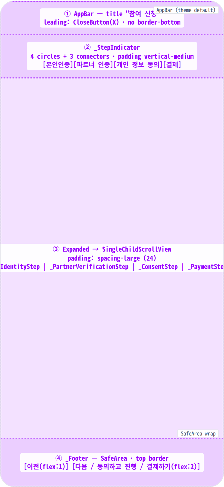

**Scaffold** ├─ **appBar**: AppBar(title: "참여 신청", leading: CloseButton) ← ① └─ **body**: **MinglitAsyncValueWidget**(eventDetailControllerProvider) └─ **\_WizardBody** └─ **Column** ├─ **\_StepIndicator**(currentStep, includePartner) ← ② │ └─ **Padding**(vertical: spacing-medium) │ └─ **Row**(MainAxisAlignment.center) │ ├─ **\_buildCircle**("1", "본인인증", tone) // active | done | inactive │ ├─ **Container**(18 × 2 · 2px h-margin) // connector (--done if step 통과) │ ├─ _(if includePartner)_ **\_buildCircle**("2", "파트너 인증", tone) │ │ _+_ connector │ ├─ **\_buildCircle**("3", "개인 정보 동의", tone) // includePartner=false면 라벨 번호 "2"로 재할당 │ ├─ connector │ └─ **\_buildCircle**("4", "결제", tone) // 마찬가지로 "3"으로 재할당 │ _※ 파트너 인증 폼 0개 / 모두 사전 승인일 때 step 2 bucket 자체를 제외 → 3-step_ │ ├─ **Expanded** ← ③ │ └─ **SingleChildScrollView**(padding: spacing-large) │ └─ switch (state.currentStep) │ ├─ identity → **\_IdentityStep**(state) │ ├─ partnerVerif → **\_PartnerVerificationStep**(state, formIndex) │ ├─ consent → **\_ConsentStep**(state, agreed) │ └─ payment → **\_PaymentStep**(event) │ │ _\_IdentityStep_: │ ├─ Title "본인인증" (titleMedium bold) │ ├─ Description (bodySmall) — "이벤트 신청을 위해 한 번만 진행하면 됩니다" │ └─ _OR_: pass-through banner (이미 인증됨) + "다음" 자동 enable │ ├─ wiz-pass-card: 64px PASS icon + "휴대폰 본인인증" title + │ │ desc + "수집 항목" 리스트 (이름 · 생년월일 · 휴대폰 · CI/DI) │ └─ CTA 안내: 다음 버튼이 PASS WebView 트리거 │ │ _\_PartnerVerificationStep_: // 모든 인증 폼이 한 페이지에 stack + scroll │ ├─ _(진입 시 fetch)_ partner\_verified\_users + verification\_submissions │ │ → 인증별 분기 결정: approved / rejected / fresh │ ├─ Title "파트너 인증" (titleMedium bold) │ ├─ Description (bodySmall · 분기에 따라 카피 변경) │ └─ ListView of FormGroups (인증 한 개당 한 그룹) │ ├─ Group head: 인증명 (12/600 muted · 카드 위쪽) │ └─ _switch (verifState)_: │ ├─ approved → ✓ static card (uneditable · 승인일 + 항목 요약) │ ├─ rejected → warning banner (사유 + 검토일) + prefill 폼 │ └─ fresh → 일반 form fields (TextFormField | MinglitFilePicker) │ ※ 폼 1개일 땐 group head 생략 가능 │ │ _\_ConsentStep_: // ← 신규 │ ├─ Title "개인 정보 제공 동의" (titleMedium bold) │ ├─ 요약 텍스트 — "이벤트 운영에 필요한 기간만 / 종료 시점까지만 │ │ 파트너 조회 가능. 동의하시면 다음 버튼을 눌러 진행해주세요." │ ├─ **개인정보 제공 대상** 필드 — 라벨 + list-item 카드 (tappable) │ │ building icon + 사업자명 + chevron → 파트너 상세 │ ├─ **개인 정보 제공 만료일** 필드 — 라벨 + list-item 2개 (정적) │ │ ① 환불 시점 (refresh icon) ② 이벤트 종료 시점 (calendar icon) │ │ 시간 순서 · 둘 중 먼저 도달하는 시점에 만료 │ ├─ **개인 정보 제공 내역** 필드 — 라벨 + list-item 여러 개 (정적) │ │ 각 인증별: 적합한 icon + 그룹 title + 항목 detail │ └─ "내 개인 정보 관리 →" 링크 (centered) │ │ _\_PaymentStep_: │ ├─ Title "결제 상세" (titleMedium bold) │ ├─ summary card (티켓명/가격 + Divider + 최종금액) │ └─ 정책 안내 (반려 시 100% 환불 · 24시간 심사) │ └─ **\_Footer** ← ④ └─ Container(padding: spacing-medium · top border outlineVariant) └─ **SafeArea** └─ **Row** ├─ _(if step != identity || formIndex > 0)_ │ Expanded(MinglitButton.secondary "이전") · flex 1 ├─ SizedBox(width: spacing-medium) └─ Expanded(MinglitButton primary) · flex 2 label by step: identity → "본인인증 시작" (or "다음" if ✓ pass) partnerVerif → "다음" consent → "동의하고 진행" (disabled until checked) payment → "결제하기" _· isLoading = (status == submitting)_

## Spacing & alignment rules

| # | Region | Alignment | Spacing |
|---|---|---|---|
| ① | AppBar | title center · leading 40 × 40 (CloseButton) | height 56 · 테마 기본 — elevation:0 + surfaceTintColor:transparent 결과 scaffold-gray 일치 · 하단 border 없음. |
| ② | _StepIndicator (dynamic 3 or 4 bucket) | Row · MainAxisAlignment.center · column width 60px (라벨 wrap 안 되게) | vertical padding: spacing-medium (16) · 원 직경 28 · 라벨↔원 gap: spacing-xsmall (4) · 원↔connector h-margin 2px · connector 폭 18. 라벨 font-size 10px. tone: active = color-primary · done = color-success 풀 strength · inactive = color-text-secondary. 파트너 인증 폼 0개일 때 step 2 bucket 자체 제외. |
| — | FormGroup (파트너 인증 · iOS inset grouped) | title 카드 위쪽 muted · fields wrapper 카드 (흰 bg · 라운드) | head: 12/600 인증명 · color-text-secondary · letter-spacing 0.2px · 카드 edge에 align. fields card: color-background bg + radius-card 16 + padding spacing-medium. 카드 사이 spacing-large gap. 폼 1개일 때 group head 생략 가능. |
| ③ | step content | SingleChildScrollView · column start · CrossAxisAlignment.start | outer padding all: spacing-large (24) · 필드↔필드: spacing-medium (16) · 라벨↔input: spacing-small (8) · 결제/동의/PASS 카드 padding: spacing-medium~large |
| ④ | _Footer | Row · SafeArea · top border 1px outlineVariant | outer padding: spacing-medium (16) all · 이전↔다음 gap: spacing-medium (16) · 버튼 height 48 (MinglitButton 기본). 동의 step에서 "다음"은 체크박스 미체크 시 disabled (opacity 0.4 · onPressed null). |
| — | PASS card (Step 1) | Center column · radius-card 16 | padding: spacing-large · icon 64 · title↔desc gap spacing-small · 수집 항목 list bg surface · padding spacing-medium |
| — | Consent summary (Step 3) | Container · radius-card 16 · 그룹 사이 divider | padding: spacing-medium · 그룹 사이 1px divider + spacing-medium gap · key↔value flex-end 정렬 · key 타이트 (fits) · value 60% max-width 우측 정렬 |
| — | 결제 카드 | Container · radius-small 8 | padding: spacing-medium · 안내 텍스트는 카드 밖, 위로부터 spacing-xlarge (32) gap |

🎨

## States

시각 변형 12종 (Step1 본인인증 entry · PASS overlay · ✓ pass-through · Step2 파트너 인증 baseline · 부분 사전 승인 · 이전 반려 재제출 · validation · Step3 개인 정보 동의 · Step4 결제 · Submitting · PG WebView · Error dialog). baseline = Step 1 본인인증 entry, 나머지 additive diff. 파트너 인증 0개 / 모두 사전 승인 시 step 2가 indicator에서 자동 제외 (3-step 동작).

**State 식별 기준**: (1) 현재 step (본인인증 / 파트너 인증 / 개인 정보 동의 / 결제) + (2) 본인인증 캐시 유무 (✓ pass-through 분기) + (3) 파트너 인증 폼 개수 (0 / 모두 사전 승인 → step 2 자체가 indicator에서 제외 · ≥1 → 한 페이지에 stack scroll) + (4) 사전 승인 / 이전 반려 이력 (mixed · rejected re-submit 분기) + (5) 제출 상태 (대기 / 진행 중 / 실패) + (6) 결제 분기 (무료 → 즉시 / 유료 → PG)에 따라 12가지 변형. 성공 상태는 별도 화면(`MinglitConfirmationPage`)으로 즉시 교체되어 이 spec 범위 밖.

### Step 1 / 4 · 본인인증 entry 🎯

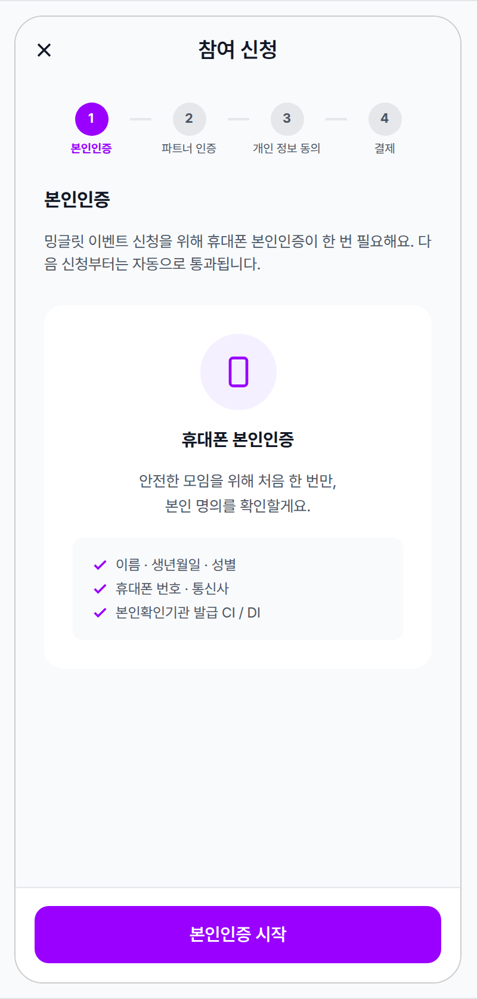

| 항목 | 내용 |
|---|---|
| 조건 | 본인인증 단계에 진입했고, 사용자가 아직 본인인증을 완료한 적이 없는 상태. 4-step 흐름의 시작점. |
| 사용자 액션 | ① "본인인증 시작" 탭 → PASS 인증사 WebView로 진입② X(닫기) 탭 → EventDetail로 복귀 (별도 확인 없음 — 입력한 데이터 없으므로 안전)③ 스크롤 → 수집 항목 리스트가 길어질 경우 본문 영역에서 스크롤 |
| 에지케이스 | · 미성년자(만 14세 미만) PASS 시도 → 인증사가 거부 → 별도 안내 화면· 외국인(휴대폰 명의 한국인 제한) → 인증사가 거부 → 별도 안내 화면· 14세 이상이지만 청소년 보호 정책상 차단되는 이벤트 → 인증 통과 후 동의/결제 단계에서 별도 차단 안내· 이전에 본인인증을 마쳤지만 캐시가 만료된 경우 (장기간 미사용) → 재인증 흐름이 동일하게 이 화면부터 시작 |
| 컴포넌트 | · AppBar (CloseButton) — 4 step 모두 공통· 4-bucket Step Indicator (본인인증 active · 나머지 inactive)· PASS 안내 카드: 64px primary tint icon + 제목 + 설명 + 수집 항목 리스트 (border-radius 16, 카드 bg 흰색, 안쪽 리스트 bg 회색)· Footer 단일 CTA "본인인증 시작" (이 step에는 이전 버튼 없음) |
| 토큰 | · color: color-primary (활성 step · CTA · 안내 아이콘 / 체크), color-text-secondary (비활성 step / 라벨), color-divider (카드 border · connector), color-background (카드 bg / footer bg), color-surface (scaffold · 수집 항목 리스트 inner bg)· radius: radius-card (16) (PASS 카드) · radius-small (8) (수집 항목 리스트) · radius-button (12) (CTA)· spacing: spacing-large (24) (카드 padding · body padding) · spacing-medium (16) (icon↔title↔desc gap · 리스트 padding) · spacing-small (8) (리스트 행 gap)· typography: titleMedium 14/700 (section title) · bodySmall 13 (description) · labelMedium 12 (수집 항목) |
| 노트 | 📝 본인인증은 사용자별 1회 — 통과하면 이후 모든 이벤트에서 자동 ✓ pass-through (State 3). 인증 결과는 사용자 프로필에 영구 저장 (변경 불가). 신원 변경(개명 등) 시 별도 재인증 절차 필요. PASS 진행 중 외부 WebView로 화면 전환 → State 2. |

### Step 1 · PASS WebView overlay 본인인증 진행 중 · 외부 인증사

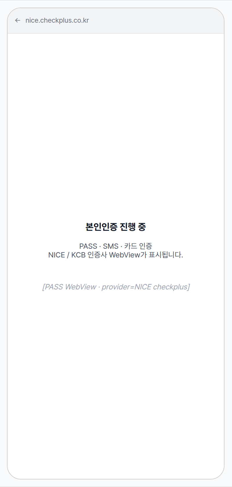

| 항목 | 내용 |
|---|---|
| 조건 | "본인인증 시작"을 탭한 직후, PASS 인증사 WebView가 wizard 위에 덮인 상태. 사용자는 외부 인증 UI에 머물러 있음. |
| 사용자 액션 | ① 통신사 / 인증 수단 선택 → 휴대폰 PASS 또는 SMS 인증 → 완료 시 wizard로 자동 복귀 → step 2 (파트너 인증)로 진행② WebView 시스템 back / 닫기 → 인증 취소 → wizard step 1 baseline (State 1)로 복귀③ 인증사 측 오류 (점검 / 차단 등) → 인증사가 자체 안내 후 닫힘 → wizard step 1 baseline 복귀, 다시 시도 가능 |
| 에지케이스 | · 인증 도중 앱이 백그라운드로 가면 인증사 측에서 세션 끊김 — 복귀 시 처음부터 다시· 인증사 내부에서 외부 브라우저 / 통신사 앱으로 딥링크 진입 → 다시 wizard로 돌아오는 경로 보장 (app_scheme 등록 필요)· 인증 결과 검증 실패(서버 측 위변조 검증) → wizard 측에서 error dialog "본인인증을 완료하지 못했어요" |
| 컴포넌트 | ↔ Wizard 전체가 외부 인증 WebView로 가려짐 (상단 native bar + 인증사 본문). 백그라운드 wizard는 보이지 않음. |
| 토큰 | — (외부 SDK 영역 — Minglit 토큰 미적용. native bar는 OS WebView 기본) |
| 노트 | 📝 PG 결제 WebView(State 11)와 동일한 overlay 패턴. 인증사는 NICE checkplus 또는 KCB 중 선택 가능 (구성 토글). 인증 성공 시 발급되는 CI/DI는 사용자 프로필에 영구 저장 — 후속 이벤트에서는 이 step을 건너뛰고 ✓ pass-through (State 3). |

### Step 1 → 2 · 본인인증 ✓ pass-through 이미 본인인증을 마친 사용자

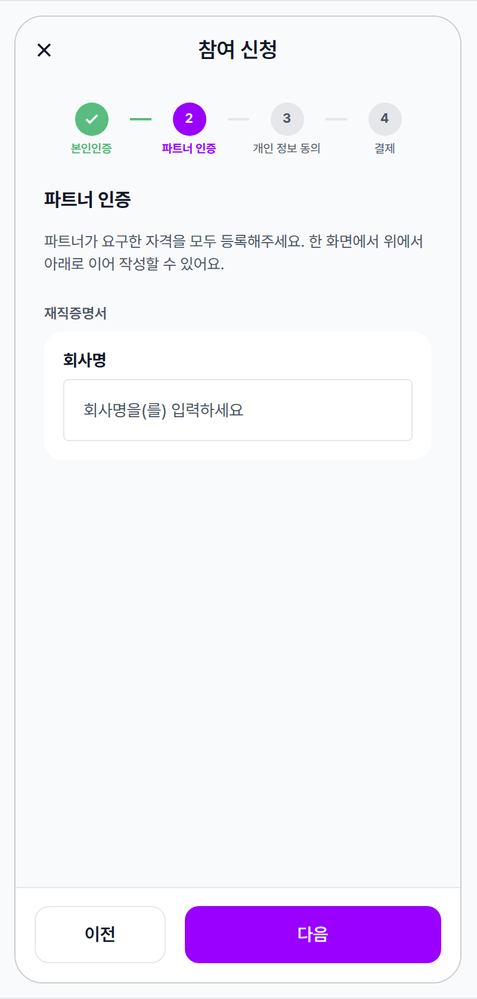

| 항목 | 내용 |
|---|---|
| 조건 | 이전에 본인인증을 마친 사용자가 wizard에 진입한 직후. step indicator의 본인인증 circle이 초록색 ✓ done 톤으로 표시되고, 화면은 자동으로 step 2 (파트너 인증)에 도착해 있다. 별도 banner 등 부연 안내 없음 — step indicator의 ✓ 만으로 "통과 완료"를 인지하도록 디자인. |
| 사용자 액션 | ① "이전" 탭 → 이미 본인인증 ✓ 상태이므로 단순 noop (또는 "재인증은 프로필에서 진행해주세요" 안내 후 머무름)② 그 외 액션은 step 2 (파트너 인증) baseline (State 4)와 동일 — 폼 입력 + "다음" |
| 에지케이스 | · 본인인증은 통과했지만 사용자 명의가 변경된 경우 (개명 등) — 인증 결과의 신원과 사용자 입력 간 불일치 발생 가능 → 별도 재인증 흐름 안내 (이 spec 범위 밖)· 본인인증 캐시는 영구 — 그러나 인증사 정책상 재검증이 필요한 경우 step 1 entry로 강제 복귀· 파트너 인증이 0개라면 step 2도 fast-path로 자연스럽게 통과 (State 5 fast-path 분기) |
| 컴포넌트 | + 4-bucket Step Indicator: 본인인증 done tone (✓ icon + 초록) · 파트너 인증 active · 나머지 inactive · 본인인증→파트너 connector도 done tone↔ body / footer는 step 2 baseline (State 4)와 동일 |
| 토큰 | + done tone: color-success (circle bg / 라벨 / connector — 풀 strength 초록 · opacity 없음)+ active tone: color-primary (현재 진행 중인 step만)+ check icon: stroke white · stroke-width 3 · viewBox 24※ 완료 step은 흐리게 dim하지 않고, 명확한 초록 ✓로 "통과"를 강조 |
| 노트 | 📝 본인인증을 "사라지게"가 아니라 "통과 완료" 상태로 step indicator에 시각적으로 남기는 것이 핵심 — Toss 결제 / 카카오페이 가입 흐름의 검증된 패턴. 추가 banner 없이 indicator의 초록 ✓ 만으로 충분히 인지된다. 본인인증 미완료 사용자는 본인인증 단계에서 시작 (State 1), 파트너 인증 0개일 경우는 step 2도 fast-path로 통과 (State 5). |

### Step 2 / 4 · 파트너 인증 모든 인증 폼이 한 페이지에 stack · scroll

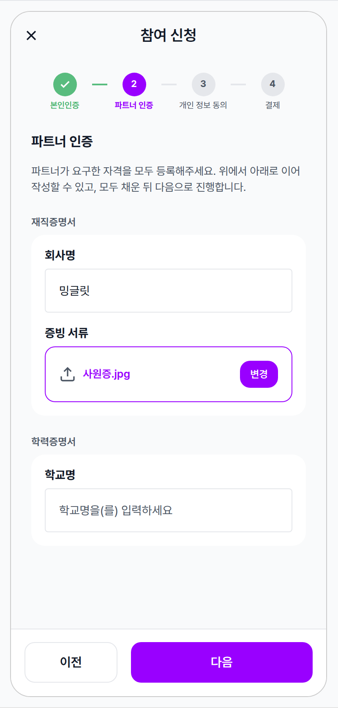

| 항목 | 내용 |
|---|---|
| 조건 | 본인인증을 마치고 step 2에 진입한 상태. 파트너가 요구하는 인증 폼이 ≥ 1개. 모든 폼이 한 페이지에 위에서 아래로 stack되어 있고, 사용자는 본문 영역에서 scroll하며 각 폼을 채운다. 폼이 많아 한 화면에 안 들어가면 자연스럽게 스크롤되며 footer는 화면에 고정. |
| 사용자 액션 | ① 본문 scroll → 파일 picker / 텍스트 input 탭 시 키보드가 올라오면 해당 필드를 자동 노출하도록 scroll 보정 (Flutter 기본)② 텍스트 / 파일 입력 → 입력 즉시 메모리에 저장 (별도 저장 버튼 없음)③ "이전" 탭 → 본인인증 entry (✓ pass-through인 경우는 noop)④ "다음" 탭 → 모든 필수 입력 검증 후 step 3 (공유 동의)로 진행. 누락 시 validation snackbar (State 6) + 누락 필드 첫 번째로 scroll⑤ X(닫기) 탭 → 작성 중 데이터 폐기 안내 confirm dialog → "나가기" 시 EventDetail 복귀 |
| 에지케이스 | · 한 인증 그룹 안에 여러 필드(텍스트 + 파일)는 가능, 한 그룹 안에서만 묶임· 폼이 1개일 때는 group head ("1 재직증명서")를 생략하고 section title만 노출 (단순화)· 폼이 5개 이상으로 길어지면 "[2 / 5] 학력증명서" 처럼 그룹 head에 진행 인디케이터 추가 검토 (이 spec 범위 밖, 후속 보강)· 파일 업로드 중 페이지 이탈 → 백그라운드 업로드 진행. 미완료 상태로 "다음" 시 "업로드 중입니다" 안내· 인증 폼 정보를 불러오지 못한 경우 → "인증 정보를 불러올 수 없습니다" 안내 + 재시도 버튼 |
| 컴포넌트 | · 4-bucket Step Indicator: 본인인증 done · 파트너 인증 active· Section title "파트너 인증" + description (인증 그룹 수에 무관하게 동일)· 인증 그룹 = group head (인증명 12/600 · muted secondary · 카드 위쪽) + fields wrapper (iOS inset grouped 카드 — 흰 bg · radius-card · padding spacing-medium)· 카드 사이 spacing-large gap — 시각 분리 충분, horizontal divider 불필요· Footer: 이전 (flex 1) + 다음 (flex 2) |
| 토큰 | + group head title: 12/600 · color-text-secondary · letter-spacing 0.2px (iOS section header tone) · 카드 edge에 align (별도 padding-left 없음)+ fields wrapper 카드: color-background bg · radius-card 16 · padding spacing-medium · 회색 scaffold 위에 흰 카드 노출+ 카드 사이 spacing-large gap — 그룹 분리에 충분↔ step circle / 라벨 색은 done = success 초록 / active = primary |
| 노트 | 📝 v2.1 변경 — 초기 plan은 "한 폼 = 한 step" 이었으나 사용자 부담 / step 수 증가 우려로 "한 페이지 scroll"로 통합. step indicator의 "파트너 인증" 한 bucket 안에 모든 인증 폼이 들어간다. 그룹 head로 인증 단위를 시각적으로 구분하고, divider로 분리. 폼이 1개일 땐 group head를 생략해 단순한 폼처럼 보이게 한다. |

### Step 2 · 부분 사전 승인 (mixed) 일부 인증 ✓ 이미 인증됨 + 미승인 인증 폼

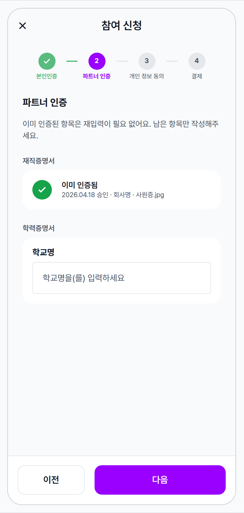

| 항목 | 내용 |
|---|---|
| 조건 | 본인인증을 마치고 step 2에 진입한 상태. 필요한 인증 중 일부가 같은 파트너에 대해 이미 partner_verified_users에 승인 기록이 있어, 해당 인증은 정적 ✓ 카드로 노출되고 미승인 인증만 일반 폼으로 작성. wizard는 진입 시 backend에서 partner+user+verification_id 매칭을 한 번 fetch. |
| 사용자 액션 | ① 승인된 카드 → 정적 노출 (탭 무반응) · 재입력 / 변경 불가 — 변경하려면 마이 페이지의 "내 개인 정보 관리"에서 철회 후 재인증② 미승인 폼 → 일반 입력 (State 4와 동일)③ "다음" 탭 → 미승인 폼만 검증 → 통과 시 step 3 (동의)로 진행. 승인된 인증은 신규 submission 생성 없이 기존 grant 재사용 |
| 에지케이스 | · 승인된 인증이 만료(valid_until)된 경우 → ✓ 카드 대신 일반 폼으로 노출 (재인증 필요)· 사용자가 "내 개인 정보 관리"에서 grant 철회 → 다음 진입 시 일반 폼으로 노출· 모든 required 인증이 사전 승인된 경우 → step 2 자체를 indicator에서 제외하고 step 3 직행 (별도 분기 — State 4 변형이 아닌 indicator 변경) |
| 컴포넌트 | · ✓ 카드 (.wiz-form-group__approved): 32px 초록 ✓ 아이콘 + title("이미 인증됨") + meta(승인일 + 항목 요약). 일반 form-group과 같은 카드 사이즈 / radius로 시각 일관성 유지· 미승인 인증 폼: State 4와 동일· Section sub: "이미 인증된 항목은 재입력이 필요 없어요" 안내 |
| 토큰 | + 승인 카드 bg: color-background (white) · radius-card 16 · padding spacing-medium+ 승인 아이콘 circle: 32px · color-success bg · 16px white check svg+ 카드 title: 13/600 · color-text-primary+ 카드 meta: 11 · color-text-secondary · margin-top 2 |
| 노트 | 📝 같은 파트너에 대한 인증은 한 번 승인되면 영구 — 다른 이벤트에서도 재사용. 사용자 마찰을 줄여 "한 번만 인증하면 끝" 경험 제공. UNIQUE(partner_id, user_id, verification_id)으로 스키마가 이미 보장. 정적 카드 자체에 변경 액션을 두지 않는 이유 — 인증 데이터는 audit 대상이라 직접 변경은 별도 흐름 (마이 페이지)으로 분리해 사고를 방지. |

### Step 2 · 이전 반려 재제출 warning banner + 이전 입력값 prefill

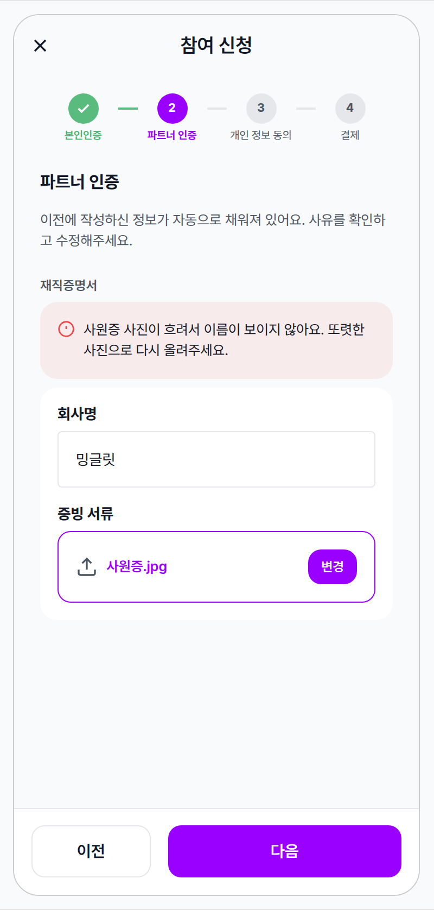

| 항목 | 내용 |
|---|---|
| 조건 | 이전에 같은 파트너 + 같은 인증으로 제출했던 기록이 verification_submissions.status = 'rejected' 상태인 경우. wizard 진입 시 backend에서 이전 submission을 fetch → 반려 banner 노출 + 마지막 입력값으로 폼 prefill. 사용자가 사유를 보고 빠르게 수정해서 재제출하는 흐름. |
| 사용자 액션 | ① banner 검토 → 반려 사유 확인② 폼 수정 → prefill된 입력값을 기반으로 사유에 해당하는 필드만 빠르게 변경 (전체 재입력 부담 ↓)③ "다음" 탭 → 새 submission 생성 (이전 record는 그대로 보존, snapshot_data 배열에 새 entry append) → step 3로 진행④ banner는 dismissable 아님 — 재제출 완료 전까지 항상 노출 |
| 에지케이스 | · 최신 submission status만 분기 결정 — 예: 1차 시도(A 반려, B 반려) → 2차 시도(A 승인, B 반려) → 3차 시도 진입 시 A는 ✓ approved 카드 (State 5), B만 rejected banner (State 6). 과거 반려 이력이 있어도 latest가 approved면 banner 안 보임.· 반려 사유가 비어있는 경우 → "사유 없음 — 검토자에게 문의해주세요" 기본 메시지· 반려된 인증이 여러 개일 때 → 각 form-group마다 자체 banner 노출· 부분 승인 + 부분 반려 + 부분 신규가 한 화면에 섞일 수 있음 → State 5 (approved card) + State 6 (rejected banner) + State 4 (fresh form) 시각이 동시에 나타날 수 있음· 동일 사유로 반복 반려 → 횟수 제한 없으나, N회 이상 시 별도 안내(예: 고객센터 문의 권장) 검토 가능 (이 spec 범위 밖)· 반려 후 재제출하지 않은 채 wizard 재진입 → 매번 같은 banner 노출 |
| 컴포넌트 | · 반려 안내문 (.wiz-rejected-banner): warning 아이콘 + 사유 텍스트만 (별도 title / meta 없음 · 안내 자체에 집중). form-group head와 fields wrapper 사이에 위치· prefill된 폼: filled state로 노출 (이전 입력값 + 파일명) — 사용자가 변경할 부분만 인지 가능· Section sub: "이전 입력 자동 채움 + 수정 안내" |
| 토큰 | + 안내문 bg: color-error 8% (rgba) · radius-card 16 · padding spacing-medium+ 안내 아이콘: 16px · color-error · margin-top 1px (텍스트 baseline 정렬)+ 안내 reason: 13 · color-text-primary · line-height 1.5 |
| 노트 | 📝 v1 wizard는 이전 반려 이력을 fetch하지 않아 사용자가 이유를 모른 채 같은 데이터를 재제출 → 같은 사유로 반복 반려되는 마찰. v2.11에서 wizard 진입 시 verification_submissions.status + snapshot_data[last].comments[]를 함께 fetch해 사유를 명시적으로 노출. 재제출은 backend가 기존 record의 snapshot_data 배열에 append하는 방식이라 audit trail이 보존됨 (스키마 이미 지원 · cooldown 없음). |

### Step 2 · 필수 입력 누락 안내 validation snackbar · 누락 필드 첫 위치로 scroll

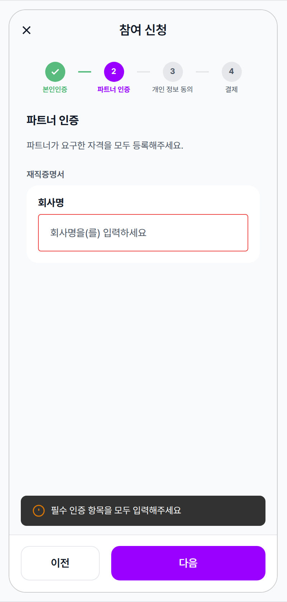

| 항목 | 내용 |
|---|---|
| 조건 | 파트너 인증 페이지에서 필수 입력이 누락된 채 "다음"을 탭한 상태. 누락 필드는 빨간 border로 강조되고, 본문은 첫 번째 누락 필드 위치로 자동 scroll. 하단에 "필수 인증 항목을 모두 입력해주세요" snackbar가 약 3초 노출. step은 그대로 머무름. |
| 사용자 액션 | + 안내 메시지 확인 → 빈 필드를 채움 → 다시 "다음" |
| 에지케이스 | · snackbar는 약 3초 후 자동 fade-out — 같은 오류가 반복되면 새 안내가 이전 것을 대체· 필드별 인라인 에러 메시지는 noisy 방지 위해 일단 미사용 (border 강조 + snackbar + scroll-to로 충분). 향후 필드별 메시지 도입 시 separate state· 파일 업로드 진행 중에 "다음" 탭 → "업로드 중입니다" 별도 메시지 (validation과 다른 흐름)· 누락 필드가 화면 밖에 있을 때 → 첫 번째 누락 필드 위치로 부드럽게 scroll (Flutter 기본 ensureVisible 사용) |
| 컴포넌트 | + 누락 필드 input border 빨간색 (color-error)+ 하단 안내 snackbar (footer 위) + 경고 아이콘+ 첫 번째 누락 필드로 자동 scroll (animate)↔ 그 외는 State 4와 동일 (single scroll page 골격) |
| 토큰 | + color-error (input border 빨강) · color-warning (snackbar icon) · #323232 (snackbar bg · Material 기본) |
| 노트 | 📝 v2.1 변경 — 단일 scroll page에서 누락 필드가 여러 개일 때 첫 번째 누락으로 scroll해서 사용자가 즉시 시작점을 알 수 있도록. 모든 누락 필드의 border가 동시에 빨강. 사용자가 한 필드를 채우면 해당 필드는 빨강 border 해제 (다른 누락은 유지). |

### Step 3 / 4 · 개인 정보 제공 동의 요약 안내 + 상세 표 (정보 / 대상 / 기간)

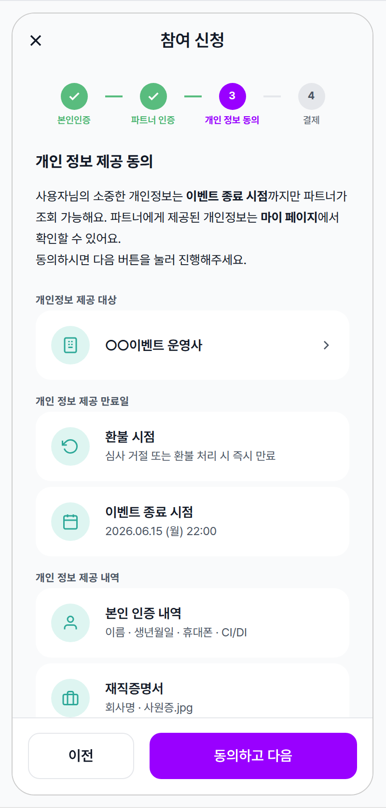

| 항목 | 내용 |
|---|---|
| 조건 | step 1 본인인증 + step 2 파트너 인증을 모두 마치고 step 3에 도달한 상태. 화면 구조는 위에서 아래로 ① 요약문(이벤트 종료 시점까지 조회 가능 + 마이 페이지 안내) → ② 개인정보 제공 대상 (파트너 list-item · 탭 → 파트너 상세) → ③ 개인 정보 제공 만료일 (시간 순서 list-item 2개 — 환불 시점 / 이벤트 종료 시점) → ④ 개인 정보 제공 내역 (인증별 list-item — 사람/가방/학사모 아이콘 + 그룹 title + detail) → ⑤ 내 개인 정보 관리 → 링크. 별도 체크박스 없으며 "동의하고 다음" CTA 자체가 동의 액션. |
| 사용자 액션 | ① 요약문 검토 → 정책 한 줄("이벤트 운영에 필요한 기간만 / 이벤트 종료 시점까지만 조회 가능") 파악② "개인정보 제공 대상" list-item 탭 → 파트너 상세 페이지로 이동 (어떤 사업자인지 / 사업자등록번호 / 연락처 등 확인 후 다시 돌아오면 step 3 유지)③ "개인 정보 제공 만료일" list-items → 정적 노출 (탭 무반응) · 두 개 카드 (환불 시점 → 이벤트 종료 시점) 시간 순서로 — 두 trigger 중 먼저 도달하는 시점에 만료④ "개인 정보 제공 내역" list-item들 → 정적 노출 — 그룹별로 어떤 항목이 어떤 형식으로 제공되는지 시각 확인⑤ "내 개인 정보 관리 →" 링크 탭 → PersonalDataManagementPage (후속 PR)로 이동 — 다른 파트너에게 이미 공유된 정보의 만료기간 / 조기 철회 관리⑥ "동의하고 다음" 탭 → 동의 행위로 간주, step 4 (결제)로 이동. 동의 기록이 backend의 personal_data_grants 테이블에 commit (RLS · 본인만 조회/철회)⑦ "이전" 탭 → step 2 (파트너 인증)로 복귀 — 작성 데이터는 그대로 유지 |
| 에지케이스 | · 별도 동의 체크박스 없이 CTA 탭 = 동의로 간주. 의도치 않은 클릭을 방지하기 위해 CTA 라벨을 "동의하고 다음"으로 명시 + 요약문에서 "동의하시면 다음 버튼을 눌러"로 한 번 더 강조· 파트너 상세 페이지 미구현 / 네트워크 오류 → list-item 탭 시 "파트너 정보를 불러올 수 없습니다" 안내 후 동의 step에 머무름· 만료일 list-item은 탭해도 무반응 — 시각적으로 chevron 없이 정적 카드로 표현해 tappability를 차별화· 사용자가 step 2까지 완료한 상태에서 X로 wizard 종료 → 동의는 기록되지 않음 (다음 진입 시 동의 step부터 다시)· 사용자가 동의했지만 결제 직전 X로 종료 → 동의 grant만 기록되고 신청은 미생성. 다시 진입 시 동의 step부터 다시 (재 commit · idempotent)· 휴대폰 번호 등 민감 정보는 표시 시 마스킹 (****) — 실제 파트너에게 전달되는 데이터는 unmasked |
| 컴포넌트 | · 4-bucket Step Indicator (본인인증 done · 파트너 인증 done · 공유 동의 active · 결제 inactive)· 요약 텍스트 블록 — 정책 두 키워드 (이벤트 운영에 필요한 기간 / 이벤트 종료 시점) strong 강조· 통일된 list-item 카드 atom — 40px 아이콘 circle + (title / sub) body + (옵션) chevron. 대상 / 만료일 / 내역에 동일하게 사용· 아이콘 종류: building (사업자) · calendar (만료일) · person (본인 인증) · briefcase (재직) · graduation cap (학력)· "내 개인 정보 관리 →" centered underline link· Footer: "이전" + "동의하고 다음" (CTA 자체가 동의 — 별도 체크박스 없음) |
| 토큰 | + 요약 텍스트: 13 일반 · color-text-primary · line-height 1.7 · strong = 700+ 필드 라벨: 11/700 · color-text-secondary · letter-spacing 0.3px+ list-item 카드 (통일): color-background bg · radius-card 16 · padding spacing-medium · margin-bottom 6+ 카드 아이콘 circle: 40px · color-surface bg · 18px svg color-text-primary+ 카드 title: 14/600 · color-text-primary · line-height 1.3+ 카드 sub: 12 · color-text-secondary · margin-top 3 · line-height 1.4+ 카드 chevron: 16px · color-text-secondary (tappable일 때만 노출)+ 관리 링크: 12 · color-primary · underline · centered |
| 노트 | 📝 동의 기록은 backend의 personal_data_grants 테이블에 RLS로 저장 — 한 행 = (사용자 id + 파트너 id + 정보 그룹 + grant 시각 + 만료 시각). 사용자는 본인 행만 조회 / 철회 가능 (RLS policy). 만료 시 파트너 측 데이터는 자동 삭제 (Edge Function cron). 만료 trigger 정책은 이벤트 종료 시점 — 그 이전까지만 파트너가 조회 가능. 만료일 list-item에는 구체적 종료 시각을 sub-text로 노출해 사용자가 정확한 만료 시점을 인지할 수 있게 한다. 모든 필드가 같은 list-item atom으로 통일돼 시각 일관성을 확보 — 재사용 가능한 단일 컴포넌트(아이콘 + body + chevron)로 디자인 시스템 효율성도 ↑. |

### Step 4 / 4 · 결제 결제 상세 확인

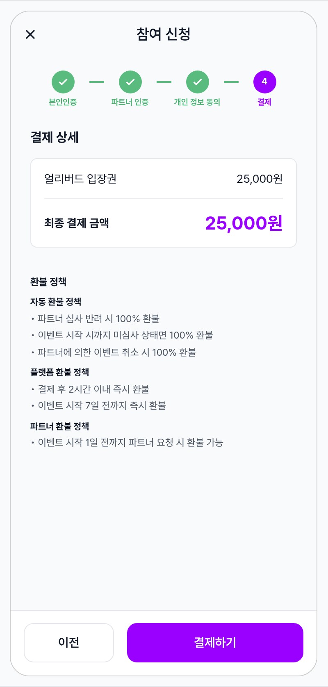

| 항목 | 내용 |
|---|---|
| 조건 | step 1~3을 모두 완료하고 결제 단계에 진입한 상태. step indicator의 처음 3개 circle은 모두 ✓ done. 무료 티켓이어도 같은 화면을 노출 (가격/총액 모두 "0원"). |
| 사용자 액션 | ① "이전" 탭 → step 3 동의 화면으로 복귀 — 동의는 그대로 유지② "결제하기" 탭 → 신청 제출 → 무료 티켓이면 즉시 성공 화면, 유료 티켓이면 결제 WebView (State 11)로 진입③ X 탭 → 종료 (확인 없음) |
| 에지케이스 | · 티켓 정보가 없는 비정상 진입 → "티켓 정보가 없습니다." 안내. · 가격이 0원인 티켓도 카드의 가격 / 총액 모두 "0원"으로 동일 표시 (이후 응답이 무료 / 유료 분기를 결정). · step 3까지 마쳤지만 결제 직전에 티켓이 매진된 경우 — 결제 시도 시 backend가 거부 → error dialog (State 12) |
| 컴포넌트 | ↔ body: titleMedium "결제 상세" + 결제 카드 + 안내 텍스트+ 결제 카드 (radius-small 8 · outlineVariant 1px border · padding spacing-medium · bg surfaceContainerLowest)+ Divider — 카드 내 행 분리+ 안내 텍스트 (labelSmall · color-outline)+ 이전 + 결제하기 buttons |
| 토큰 | + color-primary (총액 강조 · titleLarge bold)+ color-outline (안내 텍스트)+ radius-small (8) (결제 카드)+ surfaceContainerLowest (결제 카드 bg — 거의 white)+ spacing-xlarge (32) (카드↔안내 gap) |
| 노트 | 📝 가격은 천 단위 콤마 + "원" 접미사. 총액 색상은 primary(보라). 환불 정책 섹션은 세 그룹으로 분리: ① 자동 환불 정책 (시스템 자동 트리거 — 심사 반려 / 이벤트 시작 시 미심사 / 파트너의 이벤트 취소) — 플랫폼 lifecycle 상수. ② 플랫폼 환불 정책 (사용자 신청 가능 윈도우 — 결제 후 N시간 / 시작 N일 전까지) — backend의 public.policies 테이블에서 동적으로 가져옴 (RPC get_current_policy('refund'), JSONB grace_period_hours: 2 + cutoff_days: 7). ③ 파트너 환불 정책 (파트너별 추가 환불 윈도우 — 시작 N일 전까지 파트너 요청 시 환불 가능) — 파트너가 이벤트 단위로 설정하는 정책 (TBD: events/partners 테이블의 partner_refund_days 같은 컬럼 또는 policies 테이블의 partner-scoped 행). v2에서 동의가 별도 step으로 분리됐기 때문에 결제 화면에서는 더 이상 약관 / 동의 문구를 다루지 않는다 — 결제 자체에 집중. |

### Submitting 제출 진행 중 · CTA 로딩

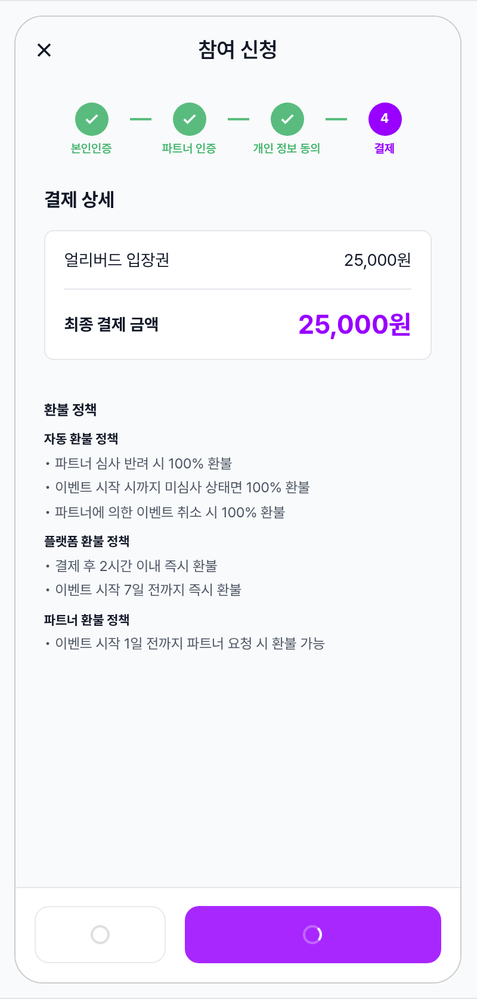

| 항목 | 내용 |
|---|---|
| 조건 | "결제하기"를 누른 직후 백엔드 응답을 기다리는 상태. |
| 사용자 액션 | — (이전 / 결제 버튼 모두 로딩 · 비활성. X 탭은 가능) |
| 에지케이스 | · 응답 지연 → 스피너 길게 보임 (별도 타임아웃 없음) · 이 상태에서 X를 누르면 wizard가 닫혀도 응답은 그대로 처리되어 성공 화면 또는 오류 안내가 뒤늦게 뜨는 race가 발생할 수 있음 (안전 장치 있음). |
| 컴포넌트 | ↔ "이전 · 결제하기" 두 버튼 모두 라벨 자리에 스피너 표시 · 탭은 무시됨 |
| 토큰 | 동일 (label 색만 spinner stroke로 대체) |
| 노트 | 📝 두 버튼 모두 같이 로딩 처리됨 — 보통은 결제 버튼만 로딩해도 충분하지만 일관성을 위해 묶음. 본문은 결제 단계 baseline과 동일. |

### Iamport PG WebView 유료 티켓 결제 진행

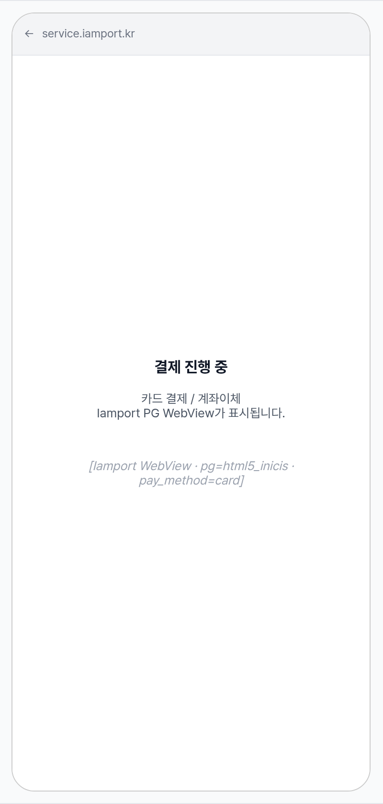

| 항목 | 내용 |
|---|---|
| 조건 | 유료 티켓의 결제 단계로 진입해 외부 결제 WebView가 wizard 위에 덮인 상태. |
| 사용자 액션 | ① 카드 / 계좌 등 결제 수단 선택 → 인증 → 결제 완료 후 wizard로 자동 복귀 → 성공 화면② WebView 시스템 back / 닫기 → 결제 취소 처리 → 오류 안내 다이얼로그 (State 12) |
| 에지케이스 | · 결제 자체는 성공했지만 후속 확정 단계에서 실패 → 오류 화면 · 환불 처리는 백엔드 정산이 담당· 앱 딥링크가 실행되지 않으면 외부 브라우저에 갇히는 경우가 있음 (FAQ 케이스) |
| 컴포넌트 | ↔ Wizard 전체 → 외부 결제 WebView (상단 native bar + 결제사 본문). Wizard 화면은 그 뒤에 가려짐. |
| 토큰 | — (외부 SDK 영역 — Minglit 토큰 미적용. native bar는 OS WebView 기본) |
| 노트 | 📝 결제는 외부 결제사 SDK(Iamport)에 위임. 무료 티켓일 때는 이 단계를 건너뛰고 곧장 성공 화면. PASS 본인인증 overlay (State 2)와 시각적으로 동일한 패턴. |

### Payment error snackbar 결제 실패 안내 + 결제하기 버튼 즉시 재활성

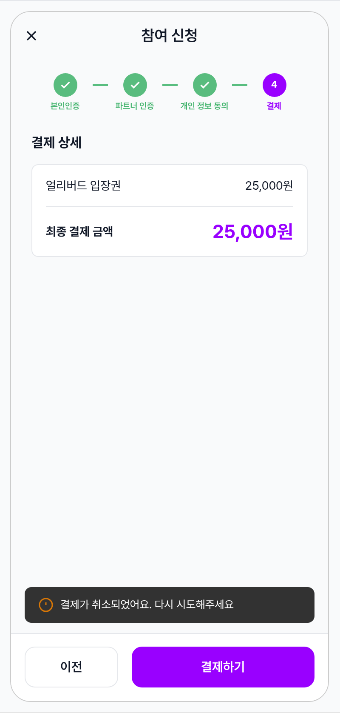

| 항목 | 내용 |
|---|---|
| 조건 | 결제 실패 직후 (PG 사용자 취소 / 결제 승인 실패 / 네트워크 오류 등). 모달 dialog 없이 하단 snackbar로 사유 안내 + 결제하기 버튼이 즉시 재활성 — 사용자가 한 번 더 탭하면 PG WebView 재진입. |
| 사용자 액션 | ① snackbar 확인 → 약 3초 후 자동 fade-out② "결제하기" 재탭 → submitting (State 10) → PG WebView (State 11) 다시 진입③ "이전" 탭 → step 3 (개인 정보 동의)로 복귀 — 결제만 빠지고 동의는 유지④ X 탭 → wizard 종료, EventDetail 복귀 |
| 에지케이스 | · 에러 메시지가 비어있을 때 → "결제를 완료하지 못했어요. 다시 시도해주세요" 기본 메시지· 같은 사유로 반복 실패 → 매번 같은 snackbar (loop 가드 없음)· PG WebView에서 백그라운드 처리 중 wizard 닫힘 → snackbar는 노출 안 됨, race 안전 처리에 의존· 네트워크 끊김 / PG 점검 등 system error → 동일 snackbar 패턴 (사유 텍스트만 분기) |
| 컴포넌트 | + snackbar (footer 위 16px gap · 경고 아이콘 + 한 줄 메시지) — Material default behavior · ~3초 자동 dismiss↔ 결제 baseline (State 9)와 동일한 body / footer — body dimming 없음, 버튼 즉시 active |
| 토큰 | + snackbar bg #323232 (Material 기본) · color-warning (아이콘) · 13/일반 텍스트 화이트 · radius-small 8 · padding 12 16 |
| 노트 | 📝 v2.13 변경 — 모달 dialog ("다시 시도하시겠어요?") 패턴이 마찰을 늘려서 snackbar로 단순화. 사용자가 결정 단계 없이 결제하기를 바로 다시 탭할 수 있어 retry 흐름이 1 tap 짧아짐. 결제 실패는 보통 일시적 (PG 취소 등)이므로 가벼운 안내가 적절. 더 심각한 system error는 사유 카피로 안내 (예: "잠시 후 다시 시도해주세요") — 별도 dialog 노출 없음. |

🔄

## Global Behavior

cross-cutting — 모든 state에 적용되는 액션, motion, 글로벌 에지케이스. state별 액션은 위 mini-table 참고.

## Cross-cutting interactions

| 사용자 액션 | 화면에 보이는 결과 |
|---|---|
| X (CloseButton) 탭 | step 1 (본인인증 entry · 입력 없음) → 즉시 EventDetail 복귀. step 2 이상 (작성 중 데이터 있음) → "작성 중인 정보가 사라져요" confirm dialog → "나가기" 시 복귀, "계속 작성" 시 머무름. submitting 중에도 X 가능하나 응답은 처리됨 (race 안전 처리). |
| 시스템 back / 스와이프 | X와 동일한 정책 적용. step별로 가로채지 않음. 입력 데이터는 wizard 메모리에만 있어 화면 종료 시 사라짐. |
| step indicator 직접 탭 | 비반응 — circle / label은 진행 표시용. step 이동은 footer 버튼만으로 (이전/다음). 이미 ✓ done인 step도 직접 탭으로는 돌아갈 수 없음 (이전 버튼으로만). |
| 본인인증 통과 (PASS 완료) | 외부 인증 WebView 닫힘 → 사용자 프로필에 인증 결과 영구 저장 → wizard step 2 (파트너 인증) baseline 또는 fast-path로 자동 advance + 본인인증 ✓ pass-through banner (State 3) 잠시 노출. |
| Wizard 진입 시 사전 인증 / 반려 이력 fetch | step 2 진입 직전, required verification_id들에 대해 backend 쿼리: ① partner_verified_users(같은 파트너 + 본인 + 인증) — 승인 기록 ✓ 발견 시 form-group을 static card로 렌더 · ② verification_submissions 최신 entry의 status='rejected' 발견 시 안내문 + prefill. 분기는 항상 latest 기준 — 과거 반려 후 승인된 인증은 ✓ approved 분기로 들어가 안내문 노출 X. 모든 required 인증이 ✓이면 step 2 indicator에서 제외 + step 3 직행. |
| 파트너 인증 페이지 모든 필드 완료 | "다음" → step 3 (공유 동의)로 advance. step indicator의 "파트너 인증" circle이 ✓ done으로 전환. 미완료 필드 있으면 첫 번째로 scroll + snackbar (State 5). |
| "동의하고 다음" | 동의 행위가 backend의 personal_data_grants 테이블에 기록 (RLS로 본인만 조회 / 철회 가능). 한 행 = 한 grant (사용자 + 파트너 + 정보 그룹 + 부여 시각 + 만료 시각). step 4 (결제)로 advance. |
| "내 개인 정보 관리" 링크 탭 | 새 화면 PersonalDataManagementPage(후속 PR)로 push — 다른 파트너에게 이미 공유된 정보의 만료기간 / 조기 철회 관리. 닫고 돌아오면 wizard는 동일 step에 머물러 있음. |
| 결제 성공 | MinglitConfirmationPage(success tone)으로 교체 (pushReplacement) — title "이벤트 신청이 완료됐어요" + 1.5s scale-bounce + check stroke + text stagger 애니메이션 + "확인" / "내 티켓 보기" CTA. back으로 wizard 복귀 불가. 동의 시각 / 인증 데이터 / 결제 정보 모두 backend commit 완료. |
| 이미 결제 진행 중인 동일 이벤트로 재진입 | 중복 신청은 backend가 reject — snackbar로 안내. 본인인증 / 동의는 이미 기록되어 있으므로 다음 신청에는 재사용. |

## Motion timing

Source: `shared/packages/mds/core/lib/src/theme/minglit_design_tokens.dart` → `MinglitAnimation`

### Step indicator transition (live demo)

"다음" 탭 시 progress bar에서 일어나는 celebration 애니메이션 (5초 loop · 연출용 데모). 실제 wizard에서는 1회만 재생되고 final state로 고정.

1

본인인증

2

파트너 인증

3

개인 정보 동의

4

결제

_▲ Forward (다음 탭) — Phase: hold (1s) → celebrate (300ms) → hold final (3.2s) → reset → repeat_

"이전" 탭 시 — 같은 keyframes를 **reverse**로 재생. celebration bounce가 살짝 들어가지만 _방향이 반대_라 "되돌리기" 느낌. step indicator의 done 상태가 풀리고 (✓ → 숫자), 진행한 step은 inactive로 회귀.

1

본인인증

2

파트너 인증

3

개인 정보 동의

4

결제

_▼ Backward (이전 탭) — Forward 애니메이션의 reverse 재생 · 같은 keyframes_

| Transition | Token / Duration | Notes |
|---|---|---|
| 화면 진입 (push from EventDetail) | MinglitAnimation.fast (200ms) | GoRouter 기본 라우트 전환 — slide / fade. |
| step forward (다음 탭) — coordinated 2-layer | MinglitAnimation.medium (300ms · staged) | ① Step indicator celebration:· 완료 step circle: 숫자 fade-out (100ms) → check svg stroke-draw (200ms) → scale 1.0→1.15→1.0 bounce (200ms) → 색상 primary→success morph· 완료 connector: color-divider→color-success 색상 transition 200ms· 다음 active step circle: scale 1.0→1.12→1.0 bounce (200ms · 100ms 지연)② Body cross-fade + slide:· 이전 body: fade-out 100ms + translateY -4px· 새 body: 150ms 후 fade-in 150ms + translateY +4px → 0두 layer가 parallel로 진행되어 "단계 통과" 피드백이 한순간에 전달됨 |
| step backward (이전 탭) | MinglitAnimation.fast (200ms) | celebration 애니메이션은 trigger되지 않음 (성취 모먼트가 아님). body 단순 cross-fade 200ms만. step indicator의 done step은 그대로 ✓ 유지 (다시 active로 회귀하지 않음 — 이미 완료된 단계로 간주). |
| 본인인증 ✓ pass-through 진입 | — | step 1 진입 시 본인인증 캐시 확인 → 즉시 step 2 (또는 파트너 0개면 step 3)로 advance. step indicator의 본인인증 circle은 ✓ done으로 보이는 상태로 시작. |
| 본인인증 시작 → PASS WebView push | MinglitAnimation.fast (200ms) | full-screen slide-up — PG WebView와 동일 패턴. native bar는 OS 기본. |
| 공유 동의 체크박스 토글 | MinglitAnimation.micro (100ms) | 체크 박스 fill / check icon scale-in 100ms · CTA enabled state transition도 동시. |
| 결제하기 → submitting | MinglitAnimation.micro (100ms) | MinglitButton의 isLoading 토글 — 버튼 내부 spinner fade. |
| Iamport WebView push | MinglitAnimation.fast (200ms) | MaterialPageRoute 기본 — full-screen slide-up. |
| 결제 실패 snackbar | MinglitAnimation.fast (200ms in) · 3s hold · 200ms out | Material default fade-in. 결제하기 버튼은 즉시 active 상태로 복원 (재시도 1 tap). |
| success → MinglitConfirmationPage | MinglitAnimation.fast (200ms route) + 1.5s sequence (scale-bounce + check stroke + text stagger) | pushReplacement → MinglitConfirmationPage atom 진입 → culmination 애니메이션 자동 재생 → 사용자가 CTA 탭하면 다음 화면. |

## Global edge cases

-   **initialTicketId 누락 진입** — selectedTicket null 상태 · "티켓 정보가 없습니다." / "티켓을 먼저 선택해주세요." 텍스트로 fallback. 정상 흐름이 아니므로 footer 버튼은 의미 없음 (eventDetail로 돌아가야 함).
-   **여러 verification 요구** — 코드상 `verifs.first`만 표시한다. 다중 verification은 미구현 (TODO). 일단 한 개 인증으로만 처리 가능.
-   **업로드 중 페이지 이탈** — MinglitFilePicker가 백그라운드 업로드 진행. 완료 시 ref가 살아 있다면 state 갱신 시도 (mounted check 무시). 보통은 무해.
-   **EF 비동기 결과의 race** — submitting 중 X로 종료 → ref.listen 콜백이 unmounted context에 닿을 수 있음. `context.mounted` 가드로 MinglitConfirmationPage push만 스킵. status 갱신은 controller 자체 (스킵 안 됨).
-   **다크 모드** — 페이지 전체가 ColorScheme 토큰 사용 → 자동 swap. dialog/snackbar/Iamport WebView도 자체 다크 대응 (Iamport 외).

📖

## Reference

implementation source + 인접 화면. Components / Tokens는 위 mini-table 참고.

## Implementation source

| Page widget | EventApplicationWizardPage · _WizardBody — apps/app_user/lib/src/features/event/admission/event_application_wizard_page.dart |
|---|---|
| Step 1 (verification) | _VerificationStep — wizard_verification_step.dart (part) |
| Step 2 (payment) | _PaymentStep — wizard_payment_step.dart (part) |
| StepIndicator / Footer | _StepIndicator · _Footer — wizard_widgets.dart (part) |
| Controller | EventApplicationController + EventApplicationState + EventApplicationStep + EventApplicationStatus — event_application_controller.dart |
| Route | EventApplicationRoute · /events/:eventId/apply · query ?ticketId= — app_routes.dart |
| Repository | eventRepositoryProvider.applyEvent → Edge Function apply-event. 응답: FreeApplyEventResult \| PaidApplyEventResult. |
| PG SDK | Iamport (iamportControllerProvider) · pg=html5_inicis · pay_method=card · app_scheme=minglit. |
| 환불 정책 source | public.policies 테이블 · key='refund' · JSONB {grace_period_hours, cutoff_days} · RPC get_current_policy('refund') · supabase/migrations/20260316000006_policies_table.sql · 기존 렌더러: event_refund_policy_section.dart (재사용 권장) |
| Success screen | MinglitConfirmationPage (success tone) — pushReplacement으로 wizard 교체. Toss-style culmination atom 재사용. 모든 파라미터 customizable. 아래 spec 블럭 참고. |
| Atom widgets | MinglitButton · MinglitButton.secondary · MinglitFilePicker · MinglitAsyncValueWidget · showMinglitConfirm (BuildContext extension). |

## Success — MinglitConfirmationPage spec

결제 성공 시 wizard가 `pushReplacement`로 교체하는 화면. 모든 props customizable이지만 이 wizard 인스턴스에서는 다음 값으로 호출.

▼ 시각 mock (1.6초 loop · 실제로는 1회 재생 후 사용자 CTA 탭까지 final state 유지)

이벤트 신청이 완료됐어요

파트너 심사 후 결과를 알림으로 알려드릴게요.  
심사는 보통 24시간 안에 마무리돼요.

내 티켓 보기

_Phase: ① circle scale-bounce (0-450ms) → ② check stroke-draw (250-700ms) → ③ title fade-up (550-700ms) → ④ description fade-up (700-850ms) → ⑤ CTA fade-up (850-1100ms) → hold_

```
// apps/app_user/lib/src/features/event/admission/event_application_wizard_page.dart
// 결제 성공 listener에서 호출

ref.listen(eventApplicationControllerProvider, (prev, next) {
  if (next.status == EventApplicationStatus.success) {
    Navigator.of(context).pushReplacement(
      MaterialPageRoute(
        builder: (_) => MinglitConfirmationPage(
          title: '이벤트 신청이 완료됐어요',
          description:
              '파트너 심사 후 결과를 알림으로 알려드릴게요.\n'
              '심사는 보통 24시간 안에 마무리돼요.',
          icon: Icons.check,
          tone: ConfirmationTone.success,
          ctaLabel: '내 티켓 보기',
          onPressed: () => context.go(AppRoutes.purchaseHistory),
        ),
      ),
    );
  }
});
```

| Param | Value | Reason |
|---|---|---|
| title | "이벤트 신청이 완료됐어요" | 사용자 액션의 결과를 명확히 — "결제"가 아닌 "신청"으로 prime (결제는 신청의 일부, 본질은 이벤트 참여). |
| description | "파트너 심사 후 결과를 알림으로 알려드릴게요.심사는 보통 24시간 안에 마무리돼요." | 다음 기대 흐름 안내 — 심사 결과를 어디서/언제 받는지. 24시간 안내로 사용자 불안 ↓. |
| icon | Icons.check (default) | 표준 success 아이콘. 필요 시 ticket / verified 아이콘으로 override. |
| tone | ConfirmationTone.success | 초록 circle bg + 흰 check — 일반 success 시각. |
| ctaLabel | "내 티켓 보기" | Forward action — 단순 "확인" 대신 다음 자연스러운 흐름 제시. 결제 후 사용자가 가장 궁금한 건 "내가 산 티켓이 어디 있나". |
| onPressed | context.go(AppRoutes.purchaseHistory) | PurchaseHistoryPage로 이동. push가 아닌 go로 stack 정리 (이전 wizard / event detail은 dispose). |
| autoDismiss | (미사용 · null) | culmination 모먼트 — 자동 닫기 X, 사용자가 명시적 CTA 탭 시 진행. |

## Related screens

| Spec | Relation |
|---|---|
| EventDetailPage | 진입 화면 — EventBottomTicketBar에서 "신청하기" 탭으로 이 wizard로 push. 닫기/back 시 복귀. |
| EventBottomTicketBar | 티켓 선택 + apply CTA를 담당하는 EventDetailPage 하위 sheet. 여기서 ticketId가 wizard로 전달됨. |
| PurchaseHistoryPage | 성공 후 MinglitConfirmationPage CTA "내 티켓 보기" 탭 시 이동하는 화면. |
| EventApplicationManagePage (partner) | 파트너 측 — 사용자가 제출한 인증 데이터를 심사. 반려 시 100% 환불 정책 트리거. |
| PartyCreateWizardPage (partner) | 유사한 step wizard 패턴 — 6 step PageView. 이 spec은 그 단순화 변형(2 step Column 분기). |

 t>