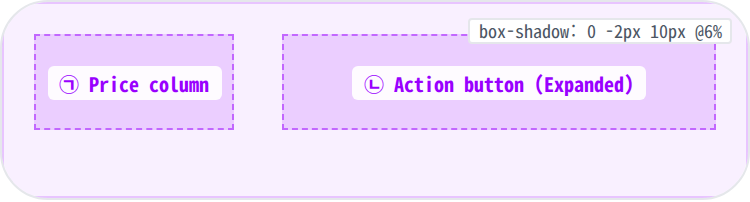
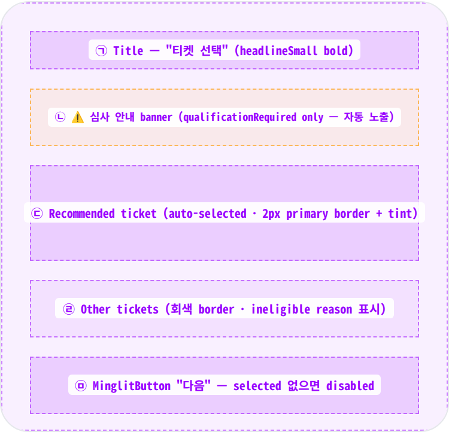
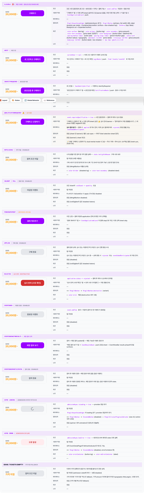
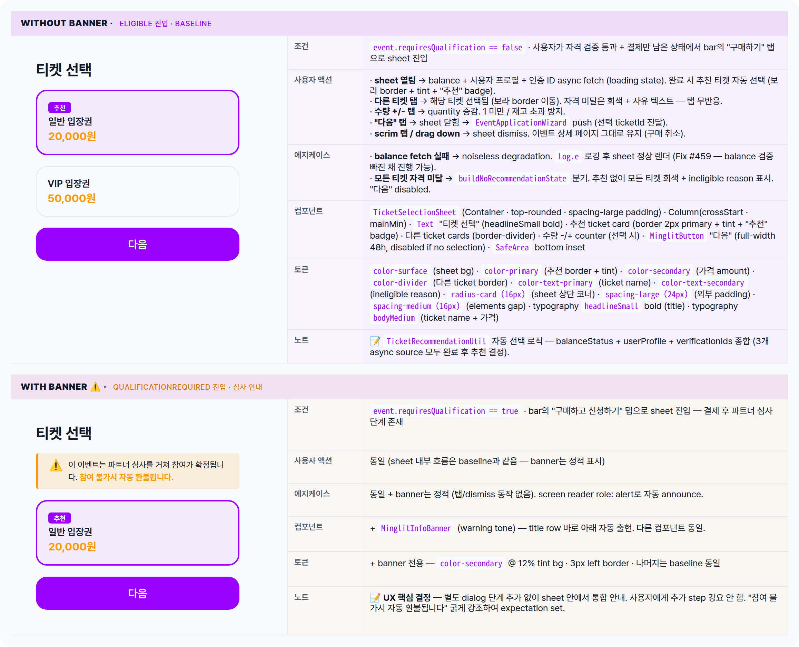

 Spec — EventBottomTicketBar (app\_user · event\_detail bottom CTA)  

# EventBottomTicketBar

## Overview

| Status | 🚧 디자인중 — 라벨/banner 이터레이션 중. 구현 코드는 직전 디자인완료 버전 기반. |
|---|---|
| App | app_user |
| Category | event · detail (sub-component of EventDetailPage) |
| Route / Surface | _BottomTicketBar (private widget — EventDetailPage에 part of, 자체 route 없음) |
| Path | /events/:eventId (parent route — 자체 route 없음) |
| Hierarchy | Parent: EventDetailPage ⑥ 영역으로 부착Children: — |
| Purpose | 이벤트 상세 페이지 최하단에 고정. 사용자가 즉시 입장권 구매로 진입할 수 있는 단일 surface. 가격(좌측) + 액션 버튼(우측 expanded) — admission state에 따라 라벨/스타일이 12종으로 동적 변환. |
| User journey | Entry: EventDetailPage의 ⑥ 영역으로 자동 부착.Exit: ① eligible → 티켓 선택 바텀시트 → EventApplicationWizard; ② qualificationRequired → 티켓 선택 바텀시트(상단 심사 안내 banner) → wizard; ③ guest → 로그인 화면; ④ identityRequired → 본인인증 화면; ⑤ pendingPayment → wizard 결제 step; ⑥ rejected → 반려 사유 다이얼로그. |
| Background | minglit 이벤트는 "오프라인 입장권 구매" mental model — 즉시 결제 transaction. 단, 일부 이벤트는 구매 후 파트너 심사가 있어 참여가 확정되지 않을 수 있음 (반려 시 자동 환불). 이 dual nature를 라벨 단계에서 명시하기 위해 qualificationRequired 상태는 "구매하고 신청하기"로, 그 외는 깔끔한 "구매하기"로 분리. 심사 안내 detail은 dialog가 아닌 티켓 선택 바텀시트 상단 banner에서 통합 노출 (별도 단계 추가 회피). |
| Frequency | 이벤트 상세 페이지 진입 시 항상 노출. 사용자당 한 이벤트 라이프사이클에서 1~5회 (탐색 → 결제 → 결제 재개 → 후속 확인). |

## History

| Date | Version | Author | Changes |
|---|---|---|---|
| 2026-05-01 | 1.4 | mark-yun | Header를 <h1>만으로 단순화. Status · Role을 Overview 테이블로 흡수. Role 제거 (Purpose 첫 문장이 tagline 역할). |
| 2026-05-01 | 1.3 | mark-yun | Header에서 breadcrumb 제거 — App / Category / Route / Path를 Overview 테이블 행으로 흡수. |
| 2026-05-01 | 1.2 | mark-yun | Status 단순화: designing → 🚧 디자인중 (lifecycle phase 기반). Purpose & Context → Overview 리네임. History를 Reference에서 Overview 아래로 이동. Ticket selection sheet 2 states를 mini-table 6-row 패턴으로 변환. |
| 2026-05-01 | 1.1 | mark-yun | 새 템플릿으로 마이그레이션: mini-table 6-row 패턴 (조건/액션/에지/컴포넌트/토큰/노트) · State summary matrix · additive diff with eligible baseline · Reference: components/tokens 제거 → mini-tables로 분산 · Implementation source + History 추가. |
| 2026-05-01 | 1.0 | mark-yun | Initial spec authored. 12 admission state matrix · 입장권/구매하기 라벨 redesign (기존 "참가 신청하기" 패밀리 → "구매하기" 패밀리, qualificationRequired는 "구매하고 신청하기"로 dual mental model 시그널) · 심사 안내 banner UX (티켓 선택 sheet 상단 통합 — 별도 dialog 단계 추가 안 함). |

[🧱 Layout](#layout) [🎨 States](#states) [🔄 Global Behavior](#global-behavior) [📖 Reference](#reference)

🧱

## Layout

바 자체 구조 + 심사 안내 banner를 포함한 티켓 선택 바텀시트.

## Bar anatomy

Row(crossAxis center) — 좌측 price column(crossAxis start) · spacing-large gap · 우측 expanded action button. 외부 padding `spacing-medium` 전방향. 상단 box-shadow elevation. SafeArea(top:false)로 하단 인디케이터 회피.

**Container**(decoration: surface + box-shadow top) └─ **SafeArea**(top: false) └─ **Row** ├─ _Price column_ ← ㉠ │ └─ Column(mainAxisMin · crossAxisStart) │ ├─ Text('**입장권**', style: _labelSmall_) │ └─ Text('20,000원~' | '가격 미정', │ style: _titleLarge_ · **bold** · _color-secondary_) │ ├─ Gap: _spacing-large (24)_ │ └─ **Expanded** ← ㉡ └─ _MinglitAsyncValueWidget_(admissionAsync) ├─ data → **\_buildActionButton**(state) (12 라벨 분기) ├─ loading → **ElevatedButton**(disabled · 20px spinner) └─ error → **ElevatedButton**(disabled · errorContainer · '오류 발생') _price 라벨 결정_ — '입장권' (오프라인 티켓 구매 mental model 강화) · "최저가" 폐지 — '~' suffix가 이미 starting-from을 의미, "최저가"는 자기-반복 · 비어있을 때 '가격 미정' fallback (tickets list 비어있을 때만)

## Ticket selection sheet anatomy

구매하기 / 구매하고 신청하기 탭 시 화면 하단에서 올라오는 modal sheet (`showModalBottomSheet · isScrollControlled: true`). `TicketSelectionSheet` widget — 추천 티켓 자동 선택 + balance/verification 자격 검증 + 수량 선택 + 다음 step 진입. `qualificationRequired` 이벤트에서는 **상단 심사 안내 banner**가 자동 출현.

**showModalBottomSheet**(isScrollControlled: true) └─ **TicketSelectionSheet** └─ Container(_radius-card_ top corners · _spacing-large_ all) └─ Column(crossAxisStart · mainAxisMin) ├─ Text('티켓 선택', _headlineSmall · bold_) ← ㉠ ├─ Gap: _spacing-medium_ │ ├─ _심사 안내 banner_ (if event.requiresQualification) ← ㉡ │ └─ **MinglitInfoBanner**(tone: warning) │ └─ "이 이벤트는 파트너 심사를 거쳐 참여가 확정됩니다. │ **참여 불가시 자동 환불됩니다.**" │ ├─ _State branch_: │ ├─ loading → buildLoadingState │ ├─ tickets empty → buildEmptyState │ ├─ no recommendation → buildNoRecommendationState (tickets 모두 ineligible) │ └─ has recommendation → buildRecommendationState ← ㉢ + ㉣ │ ├─ Recommended ticket card (primary border + tint + "추천" badge) ← ㉢ │ └─ Other tickets list (border-divider · ineligible reason text) ← ㉣ │ ├─ _Quantity section_ (if \_selectedTicketId != null) │ └─ - / + counter for ticket count │ ├─ **MinglitButton**(label: '다음' · disabled if no ticket) ← ㉤ │ └─ SafeArea bottom inset (_viewPadding.bottom_)

| # | Region | Spacing / 토큰 |
|---|---|---|
| ㉠ | Title "티켓 선택" | headlineSmall bold · text-primary · 하단 spacing-medium |
| ㉡ | 심사 안내 banner | qualificationRequired일 때만 출현. warning tone (color-secondary tint bg + 3px left border) · 12px line-height 1.5 · "참여 불가시 자동 환불됩니다" 굵게 강조 |
| ㉢ | Recommended ticket | 2px primary border · primary 6% tint bg · 자동 선택 · "추천" badge (상단 좌측) |
| ㉣ | Other tickets | 1px divider border · 자격 미달 시 회색 처리 + ineligible reason 텍스트 |
| ㉤ | "다음" 버튼 | MinglitButton full-width · 48h · 선택 없으면 disabled |

## 12-state label matrix

`EventAdmissionStatus`(`admission_action_handler.dart`) 12개 케이스. 메인 case는 `eligible` — 사용자 95% 이상이 이 라벨을 봄.

| State | Label | Style | Enabled |
|---|---|---|---|
| guest | 로그인하고 구매하기 | primary | ✓ |
| identityRequired | 본인인증 후 구매하기 | primary | ✓ |
| qualificationRequired ⚠️ | 구매하고 신청하기 | primary | ✓ |
| eligible 🎯 (메인) | 구매하기 | primary | ✓ |
| notEligible | 참여 조건 미달 (또는 sub-reason) | disabled | — |
| full / soldOut | 마감된 이벤트 | disabled | — |
| pendingPayment | 결제 계속하기 | primary | ✓ |
| applied | 구매 완료 | disabled | — |
| rejected | 심사 반려 (사유 확인) | destructive | ✓ |
| eventEnded | 종료된 이벤트 | disabled | — |
| eventEndedWithResults | 매칭 결과 보기 | primary | ✓ |
| eventEndedParticipated | 참여 완료 | disabled | — |

※ **"신청" → "구매" 전환된 5개**: `guest`, `identityRequired`, `qualificationRequired`, `eligible`, `applied`. 나머지 7개는 의미가 명확한 specific 라벨 (결제 계속 · 심사 반려 · 매칭 결과 · 참여 완료 등)이라 그대로 유지. 각 state의 **탭 결과 / 인터랙션**은 아래 Visual 섹션의 state 카드 sub-table에.

🎨

## States

14 visible states (12 admission + async loading + async error + edge: tickets empty). 각 state mini-table은 6 aspect rows (조건/사용자액션/에지케이스/컴포넌트/토큰/노트).

## State summary

14 states를 한눈에 비교. 자세한 사양은 아래 각 state mini-table 참조.

| State | Tag | 조건 (요약) | Key visual differentiator |
|---|---|---|---|
| guest | 비로그인 | currentUser == null | "로그인하고 구매하기" primary 버튼 |
| identityRequired | 본인인증 미완 | !hasIdentityVerified | "본인인증 후 구매하기" primary 버튼 |
| qualificationRequired ⚠️ | 심사 필요 | event.requiresQualification + 자격 검증 통과 | "구매하고 신청하기" — 심사 결과에 따라 환불 가능 |
| eligible 🎯 | 메인 case | 모든 사전 검증 통과 + 결제 가능 | "구매하기" primary 버튼 — 메인 CTA |
| notEligible | 자격 미달 | state.ineligibleReason != null | "참여 조건 미달" disabled (사유별 동적) |
| soldOut · full | 정원 마감 | 모든 ticket의 soldCount == quantity | "마감된 이벤트" disabled |
| pendingPayment | 결제 중단 | 이전 신청 + 결제 미완료 application 존재 | "결제 계속하기" primary — 티켓 sheet skip |
| applied | 구매 완료 | 결제 완료 상태 (심사 진행 중일 수도) | "구매 완료" disabled |
| rejected | 심사 반려 | application.status == rejected | destructive "심사 반려 (사유 확인)" |
| eventEnded | 이벤트 종료 | event.endTime 경과 + 미참여 | "종료된 이벤트" disabled |
| eventEndedWithResults | 매칭 결과 도착 | 참여 + 매칭 결과 publish됨 | "매칭 결과 보기" primary |
| eventEndedParticipated | 참여 완료 | 참여 + 결과 따로 없음 (일반 이벤트) | "참여 완료" disabled |
| async loading | fetch 중 | admissionAsync.isLoading | 20px spinner inside disabled 버튼 |
| async error | 조회 실패 | admissionAsync.hasError | "오류 발생" errorContainer 톤 disabled |

## Bar — states gallery

각 state는 **독립된 미니 테이블** — 좌측 mockup(rowspan=6), 우측에 6 aspect rows. **첫 state(eligible 🎯 — 메인 case)는 풀 컴포넌트/토큰 리스트**, 나머지는 additive diff (`+` 추가 · `−` 제거 · `↔ X → Y` 교체 · `동일` · `—`).

## Ticket selection sheet — states

구매하기 / 구매하고 신청하기 탭 후 나타나는 modal sheet. 2 states (banner 유무). **without-banner가 baseline**, with-banner는 additive diff.

🔄

## Global Behavior

Cross-cutting / global only — 화면 전반에 걸친 동작. state별 인터랙션은 위 States section의 각 state mini-table에 있음.

## Motion & timing

| Transition | Duration | Curve / notes |
|---|---|---|
| admission state crossfade (eventDetailControllerProvider 데이터 변화 시) | MinglitAnimation.medium · ~350ms | state별 라벨/스타일 변경 시 부드러운 전이 — 코드상 명시 transition은 없지만 setState rebuild로 즉시 반영 |
| 티켓 선택 sheet slide-up | ~300ms | Material showModalBottomSheet 기본 — 상단 코너 radius-card · scrim 검정 ~50% alpha |
| buttonStyle 전환 (eligible→qualificationRequired 등) | OS default | 색상/텍스트 즉시 교체 — 보통 데이터 fetch 완료 시 한 번만 발생, transition 없이 즉시 |
| loading spinner | 0.9s loop | 20px MinglitCircularProgressIndicator · 원형 회전. provider 응답 대기 동안 무한 반복 |
| 심사 안내 banner 출현 | 없음 (instant) | sheet build 시점에 이미 렌더 — 별도 fade-in 없이 즉시 visible |

※ `MinglitAnimation` (`shared/packages/mds/core/lib/src/theme/minglit_design_tokens.dart`) — fast/medium/slow 4단계. tokens.json 마이그레이션 진행 중.

## Global edge cases

화면 전반 영향. (state-specific edge — 가격 미정, 사유별 disabled 라벨 등 — 은 위 Visual의 해당 state 카드에)

-   **balance 조회 실패** — `_fetchBalanceStatus` 예외 catch 후 error 로깅 (`Log.e`) · loading 해제 + recommendation 시도. 사용자에게는 noiseless degradation (sheet 정상 표시 — 단, balance 검증이 빠진 채 진행). Fix #459.
-   **모든 티켓 자격 미달** — sheet의 `buildNoRecommendationState` 분기 — 추천 없이 모든 티켓 회색 + ineligible reason 표시. "다음" disabled.
-   **로그인 후 복귀 race** — 비로그인 → 로그인 화면 → 복귀 시 admission provider invalidate 필요 — 즉시 새 state(`eligible` 등)로 갱신되어야 stale state 안 보임.
-   **네트워크 끊김** — admission async error 분기 진입 → "오류 발생" 라벨 + errorContainer 톤. 상위 EventDetailPage RefreshIndicator로 재시도.
-   **접근성** — 심사 안내 banner는 `Semantics(role: alert)`로 screen reader가 자동 읽도록. 모든 disabled 버튼은 `onPressed: null` + 라벨 자체가 사유 텍스트 (예: "마감된 이벤트").
-   **다크 모드** — banner tint(color-secondary 12%)와 ticket card primary tint(6%)가 dark surface 위에서도 충분한 contrast 유지. price color-secondary는 dark에서도 그대로 노란/주황 톤.

📖

## Reference

Implementation source + 인접 화면 link. **Components / Tokens는 States section의 각 mini-table**에 분산됨 — 여기에서 중복 명세하지 않음. **History**는 Overview 아래 별도 섹션으로 이전.

## Implementation source

| 항목 | Path / Reference |
|---|---|
| Widget class | _BottomTicketBar (private — EventDetailPage에 part of) |
| File path | apps/app_user/lib/src/features/event/detail/event_bottom_ticket_bar.dart |
| Controller / Provider | eventAdmissionControllerProvider(event) · event_admission_controller.dart |
| State mapping | AdmissionButtonConfig.fromState() · admission_action_handler.dart — 12개 state → 라벨/style 매핑 (designing 변경: "신청" → "구매" 5개 라벨) |
| Ticket selection sheet | TicketSelectionSheet · ticket_selection_sheet.dart · 진입 helper: eventCoordinator.showTicketSelection() |
| Kit wrapper | MinglitButton · shared/packages/mds/core/lib/src/ui/widgets/common/minglit_button.dart |
| Route | (none — bar는 EventDetailPage 일부, 자체 route 없음) |

※ status `🚧 designing`: 입장권/구매하기 라벨 변경 + 심사 안내 banner는 spec에만 존재, 코드 미반영. 구현 PR 머지 시 status를 `✅ implemented`로 전환.

## Related screens

| Spec | Relation |
|---|---|
| EventDetailPage | Parent — bar는 ⑥ 영역으로 자동 부착 |
| EventApplicationWizard (TBD spec) | "다음" 탭 후 결제 wizard로 이동 (verify → payment 2단계) |
| LoginPage | guest state 탭 시 from='/events/:id' 파라미터로 이동 |

## ✅ Authoring checklist

-   ✅ **Header** — Title (h1)만
-   ✅ **Overview** — Status · App · Category · Route/Surface · Path (parent link 포함) · Purpose · Entry/Exit · Background · Frequency 모두 채움
-   ✅ **History** — 1.0 (initial) · 1.1 (template migration) · 1.2 (status simplify · Overview rename · History 위치) · 1.3 (breadcrumb → Overview 흡수) · 1.4 (Header 단순화 · Status/Role → Overview · Role 제거) 5 row
-   ✅ **Layout — top blueprint** — Bar anatomy + Ticket sheet anatomy 분리 (component-tier spec — viewport 자체보다 두 sub-anatomy가 본체)
-   ✅ **Layout — Sub-anatomy** — Bar · Ticket sheet 평면 나열
-   ✅ **States — 종류 enumerate** — 12 admission + async loading + async error + edge tickets empty (총 14)
-   ✅ **States — mini-table 6 rows** — 14 state 모두 (조건/액션/에지/컴포넌트/토큰/노트) 6행
-   ✅ **States — eligible baseline 풀 리스트** — 메인 case에 컴포넌트 + 토큰 풀 명시
-   ✅ **States — additive diff** — 5종 prefix(`+`/`−`/`↔`/`동일`/`—`)만 사용
-   ✅ **Ticket selection sheet — 2 states** — without banner (baseline) · with banner ⚠️ (additive diff) 모두 mini-table 6-row 패턴
-   ✅ **Global Behavior — cross-cutting only** — Motion timing + Global edge cases. state-specific 분리됨
-   ✅ **Global Behavior — Motion** — 모든 duration이 `MinglitAnimation` token name + ms로 명시
-   ✅ **Global edge cases** — balance fail · ticket all ineligible · login race · 네트워크 · 접근성 · 다크모드
-   ✅ **Reference — Implementation source** — Widget · path · provider · state mapping · sheet · kit · route 모두 채움
-   ✅ **Reference — Related screens** — EventDetailPage(parent) · ApplicationWizard · LoginPage
-   ✅ **Token 표기 통일** — 모든 토큰이 `name (px)` 또는 `name` 형태
-   🚧 **코드 검증** — ad-hoc trigger 기반 (status와 분리). 라벨/banner 구현 PR 머지 시 multi-pass verify 후 History row 추가