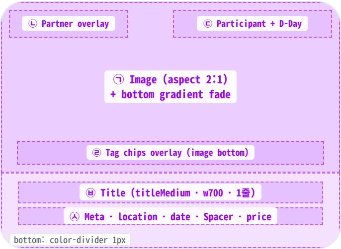
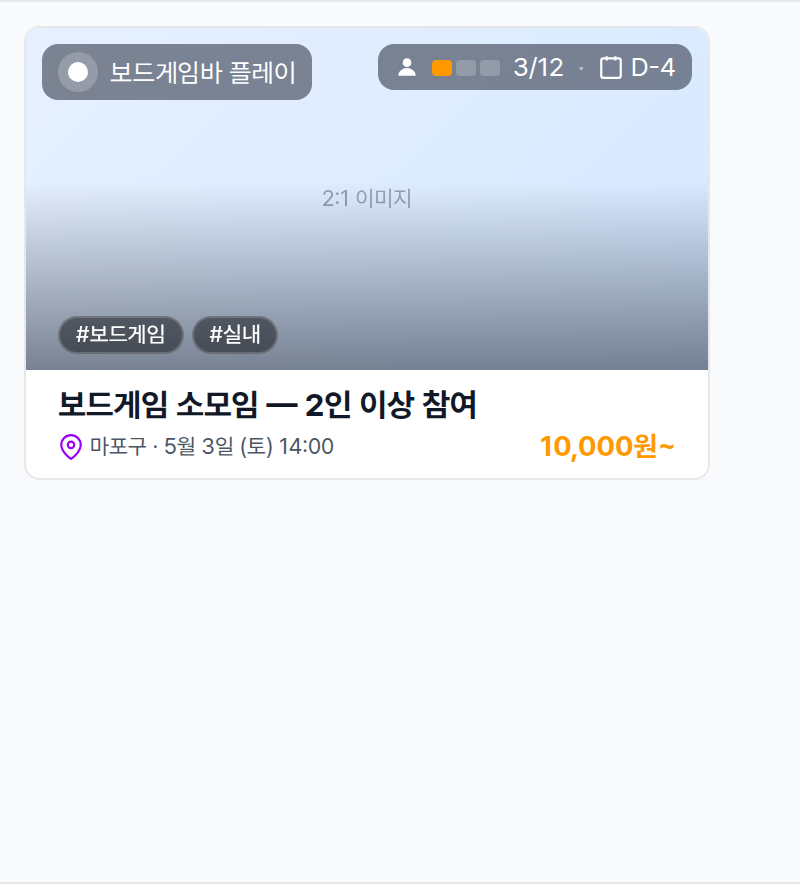
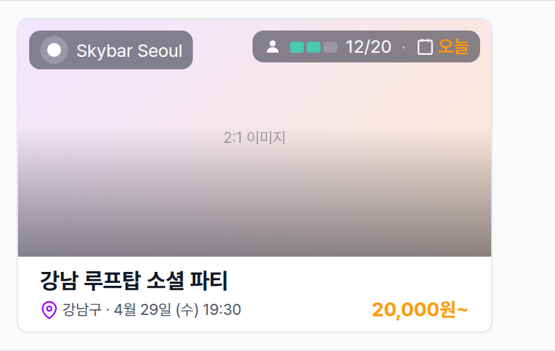
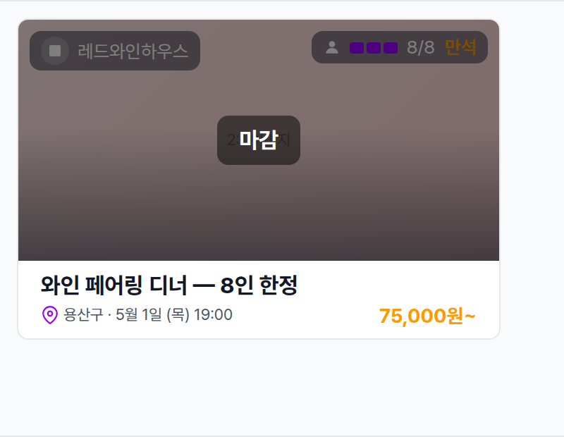
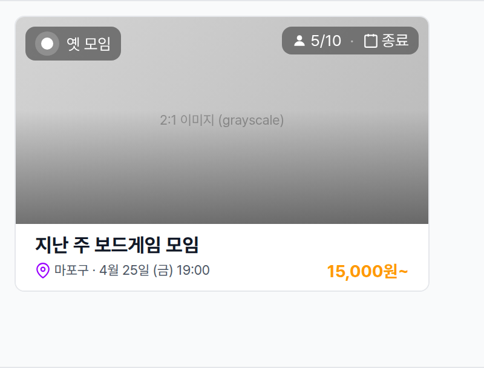

 Spec — EventCard (app\_user · embedded in HomePage feed)  

# Event Card

## Overview

| Status | ✅ 디자인완료 — 4 visible state · 피드 반복 단위 |
|---|---|
| App | app_user |
| Category | home · feed · sub-component |
| Route / Surface | MinglitEventCard (private widget — HomePage 피드 SliverList의 cell, 자체 route 없음) |
| Path | / (HomeRoute — parent route) |
| Hierarchy | Parent: HomePage (피드 SliverList의 반복 cell)Children: — (탭 시 EventDetailRoute로 진입 — Reference 참고) |
| Purpose | 홈 피드의 반복 단위 — 이벤트 1건의 핵심 정보(이미지 · 파티 · 참여 게이지 + D-Day · 태그 · 제목 · 위치/날짜/가격)를 한 카드 안에 압축. 짧은 인지 시간으로 "참여하고 싶은가?"를 결정할 수 있게 시각 우선 (이미지 2:1 + overlay) + 텍스트는 1줄 ellipsis 위주로 짧게. |
| User journey | Entry points: HomePage 피드 스크롤 시 (recommendationFeedProvider) / SearchPage 결과 / TagEventListPage / PartnerEventsPage.Exit points: 탭 → EventDetailRoute 진입. |
| Background | 이미지 위 overlay 4종(partner / participant gauge + D-Day / tag chips / soldOut scrim)은 body 텍스트를 짧게 유지하면서도 풍부한 메타 정보를 시각적으로 전달하기 위한 디자인. 태그 chip을 image overlay로 배치 (body 밖) — body가 짧아져 카드 높이 절약 + 태그가 모임 분위기를 시각적으로 전달. dark gradient 위에 흰 텍스트 + backdrop blur로 가독성 확보. Edge-to-edge (per-card h-margin 없음) + bottom color-divider로 카드 분리 — 반복 단위가 차지하는 면적 최대화. |
| Frequency | 홈 피드 진입 시마다 N번 (피드 길이만큼 반복). 검색/태그 화면에서도 동일 카드 재사용. |

## History

이 spec의 주요 변경 이력. 최신 항목 위.

| Date | Version | Author | Changes |
|---|---|---|---|
| 2026-05-01 | 1.0 | mark-yun | v1.4 template으로 신규 spec 작성 — home_page.html의 Event card anatomy / visual gallery 섹션을 분리. mini-table per state (4 visible state, baseline = normal · 미래 이벤트). today / soldOut / ended는 baseline에서 변경분만. |

[🧱 Layout](#layout) [🎨 States](#states) [🔄 Global Behavior](#behavior) [📖 Reference](#reference)

🧱

## Layout

Image (2:1) + 4 overlay + body (title + meta). 색·타이포 무시.

## Blueprint & tree

이미지 비율은 **2:1**. 이미지 Stack 위에 4개 overlay (partner 좌상단 / 참여+D-Day 우상단 / 태그 chips 하단 / soldOut scrim 전체). 이미지 아래 body는 title 한 줄 + (location · date · price) 한 줄 — 짧고 명확. 카드 사이는 `color-divider` bottom border로 분리.

**MinglitEventCard** _(edge-to-edge, no h-margin)_ └─ Column(crossAxis: start) ├─ _Image — Stack_ ← ㉠ │ ├─ AspectRatio(2:1) · MinglitImage cover │ ├─ Bottom _gradient fade_ (transparent → textPrimary 0.5 at 100%) │ │ │ ├─ _Partner overlay_ Positioned(top: 8, left: 8) ← ㉡ │ │ ├─ background: textPrimary 0.5 (radius-small) │ │ ├─ padding: _xsmall v · small h_ │ │ ├─ avatar 20×20 · Gap: _xsmall2 (6px)_ · partner name (chipLabel · white · maxWidth 130) │ │ │ ├─ _Participant + D-Day overlay_ Positioned(top: 8, right: 8) ← ㉢ │ │ ├─ background: textPrimary 0.5 (radius-small) │ │ ├─ padding: _xsmall v · small h_ │ │ ├─ Icons.person 13 · 3-segment gauge (10×8 each, gap xxsmall) │ │ │ color: secondary / tertiary / primary per ratio │ │ ├─ "N/M" + ("만석" if soldOut) + "·" + Icons.calendar 13 │ │ └─ D-Day text — "오늘"(amber) / "D-N" / "종료" │ │ │ └─ _Tag chips overlay_ Positioned(bottom: 8, left: 16, right: 16) ← ㉣ │ ├─ Wrap, gap: _xsmall (4px)_ │ ├─ #태그 chip × max 3 │ │ · background: rgba(0,0,0,0.45) · color: white · border: white 0.18 │ │ · backdrop-filter: blur(2px) · radius-chip │ │ · padding: _xxsmall v · small h_ │ └─ "+N" overflow badge (when tags > 3) │ └─ _Body_ Padding(_spacing-small v · spacing-medium h_) ├─ **Title** (titleMedium · w700 · 1줄 ellipsis) ← ㉥ ├─ Gap: _xxsmall (2px)_ └─ _Meta row_ Row ← ㉦ ├─ Icons.location\_on\_outlined (13, primary) · Gap: 3px ├─ Expanded: "$location · $dateLabel" (bodySmall · text-secondary · ellipsis) └─ **Price** (titleSmall · w700 · color-secondary)

| # | Region | Alignment | Spacing |
|---|---|---|---|
| — | Card outer | 풀폭 (edge-to-edge) | per-card h-margin 없음 · bottom: 1px solid color-divider · 마지막 카드만 border 제거 |
| ㉠ | Image (Stack) | full width · aspect 2:1 | radius 0 · bottom gradient fade (45% → 100%) |
| ㉡ | Partner overlay | image top-left absolute | top/left: spacing-small (8px) · padding: xsmall v · small h · avatar↔name: xsmall2 (6px) · radius-small |
| ㉢ | Participant overlay | image top-right absolute | top/right: spacing-small (8px) · padding: xsmall v · small h · gauge gap: xxsmall (2px) · icon↔text: 3px · radius-small |
| ㉣ | Tag chips overlay | image bottom-absolute · Wrap · 좌측 정렬 | bottom: spacing-small (8px) · l/r: spacing-medium (16px) · chip gap: xsmall (4px) · chip padding: xxsmall v · small h · radius-chip |
| — | Body padding | — | vertical: spacing-small (8px) · horizontal: spacing-medium (16px) |
| ㉥ | Title | full width · 1 line ellipsis | title↔meta: xxsmall (2px) |
| ㉦ | Meta row | row · 좌측 location/date Expanded · 우측 price 고정 | icon↔text: 3px · meta↔price: 자동 spacer |

🎨

## States

시각 변형 4종. baseline = normal (미래 이벤트), 나머지는 additive diff.

이벤트 lifecycle에 따라 4가지로 갈린다 — 시작 전 / 당일 / 마감 / 종료.

### normal · 미래 이벤트 🎯 baseline · production

| 항목 | 내용 |
|---|---|
| 조건 | 이벤트가 아직 시작 전이고, 참여 인원에 여유가 있는 일반적인 미래 이벤트. |
| 사용자 액션 | 카드 탭 → 이벤트 상세로 이동. |
| 에지케이스 | · 태그가 4개 이상이면 마지막에 "+N" 표시.· 파트너 이름이 길면 한 줄 ellipsis (최대 약 130px 폭).· 이미지 로딩 실패 시 placeholder 텍스트만 노출. |
| 컴포넌트 | · Image Stack (AspectRatio 2:1 · MinglitImage cover · bottom gradient fade)· PartnerOverlay (avatar 20×20 · partner name · radius-small · scrim bg)· ParticipantOverlay (Icons.person 13 · 3-segment gauge · "N/M" · separator · Icons.calendar 13 · D-Day text)· TagChipsOverlay (Wrap · #태그 chip × max 3 · backdrop blur · radius-chip)· Body: Title (titleMedium · w700 · ellipsis) + MetaRow (location icon + text + price) |
| 토큰 | · color: color-background, color-surface (image placeholder), color-text-primary, color-text-secondary, color-primary (location icon · gauge full), color-secondary (price · gauge low), color-tertiary (gauge mid), color-divider (bottom border)· radius: radius-small (overlay), radius-chip (tag)· spacing: spacing-medium (16 · body h-pad · tag overlay l/r · meta↔price), spacing-small (8 · overlay top/left · body v-pad · tag overlay bottom · price gap), spacing-xsmall (4 · tag chip gap), spacing-xxsmall (2 · gauge gap · title↔meta), spacing-xsmall2 (6 · avatar↔name)· typography: titleMedium 16/700 (title), bodyMedium 14/400 (price), bodySmall 12 (meta · partner · participant text), chipLabel 13 (tag · partner) |
| 노트 | 📝 가장 흔한 카드 — 다른 3 state는 이 baseline에서 변경분만 명시. |

### today · D-day == 0 당일 강조 — 라벨 "오늘" amber

| 항목 | 내용 |
|---|---|
| 조건 | 오늘 시작하는 이벤트이며 아직 자리가 남아있는 상태. |
| 사용자 액션 | 동일 |
| 에지케이스 | 동일 |
| 컴포넌트 | ↔ D-Day text → "오늘" (변환) |
| 토큰 | ↔ D-Day text color → color-secondary (amber) + bold w600 (시선 강조) |
| 노트 | 📝 minimal diff — 텍스트 + 색상만 변경. 가장 흔한 day-of 강조 패턴. |

### soldOut · 참여 == max 마감 — scrim + 배지 + "만석"

| 항목 | 내용 |
|---|---|
| 조건 | 참여 인원이 정원에 도달해 마감된 상태. |
| 사용자 액션 | 카드 탭 → 동일하게 이벤트 상세로 이동. 단, 상세 화면의 참여 신청 버튼은 비활성. |
| 에지케이스 | · 정원이 비정상 값(0 이하)이면 표시되지 않음 — 백엔드 데이터 무결성에 의존.· 마감 후 다시 자리가 비워지면 normal 상태로 전환. |
| 컴포넌트 | + SoldOutScrim (image 위 검정 0.5 alpha overlay)+ SoldOutBadge (가운데 "마감" 흰 텍스트 · radius-small)+ SoldOutText (참여 게이지 옆 "만석" amber)↔ Gauge 3 segment 모두 high (primary)− Tag chips overlay (scrim 아래라 가독성 떨어져 숨김 — 디자인 결정) |
| 토큰 | + 검정 scrim rgba(0,0,0,0.5) · 배지 bg 동일+ color-secondary (amber · "만석" 텍스트 강조)↔ Gauge full → 모든 segment color-primary |
| 노트 | 📝 카드는 여전히 탭 가능 (상세 진입). UX는 "보기는 가능 / 신청은 막힘"으로 일관성. |

### ended · 종료된 이벤트 이미지 grayscale + D-Day "종료"

| 항목 | 내용 |
|---|---|
| 조건 | 이미 종료된 이벤트. |
| 사용자 액션 | 카드 탭 → 참여한 사용자라면 후기 작성 화면으로, 아니면 읽기 전용 상세로 이동. |
| 에지케이스 | · 종료 후 24시간 이내는 피드 상위 노출 (참여한 사용자에 한함).· 게이지의 빈 칸도 그대로 표시되어 실제 참석 인원을 가시화. |
| 컴포넌트 | ↔ Image filter → saturate(0) grayscale↔ D-Day text → "종료"↔ Participant overlay bg → 회색 스크림 (rgba(80,80,80,0.7))− Gauge color (그대로 유지하지만 gray 효과)− Tag chips overlay (종료 이벤트는 태그 강조 의미 약함) |
| 토큰 | + filter: saturate(0) (image grayscale)+ 회색 overlay bg rgba(80,80,80,0.7)나머지 동일 |
| 노트 | 📝 grayscale은 image filter 1줄로 처리 — 모든 색상이 0% saturation. overlay text/icon은 흰색 유지 (가독성). |

🔄

## Global Behavior

cross-cutting — 모든 state에 적용되는 액션, motion, 글로벌 에지케이스. state별 액션은 위 mini-table 참고.

## Cross-cutting interactions

| 사용자 액션 | 화면에 보이는 결과 |
|---|---|
| 카드 탭 (모든 state) | 이벤트 상세로 이동. |
| 스크롤 (피드 내) | 카드들이 차례로 노출. 마지막 카드는 하단 활성 이벤트 바 위로 16px 여백. |
| 다크 모드 토글 | 카드 배경 / 구분선이 다크 톤으로 자동 전환. 이미지 위 어두운 overlay는 그대로 유지 (가독성). 종료 카드의 흑백 처리도 동일. |

## Motion timing

Source: `shared/packages/mds/core/lib/src/theme/minglit_design_tokens.dart`

| Transition | Token / Duration | Notes |
|---|---|---|
| 카드 탭 → 이벤트 상세 진입 | MinglitAnimation.fast (200ms) | 좌→우 슬라이드 push. 진입 후 상세 화면이 자체 데이터를 불러옴. |
| 이미지 로딩 → 표시 | cut | 이미지 자체 fade-in은 컴포넌트 내부에서 처리. 카드 단위 별도 전환 없음. |
| state 전환 (실시간 갱신) | cut | 참여 인원 변화, 마감 도달 등은 부드러운 전환 없이 즉시 반영. |

## Global edge cases

-   **풀폭 디자인** — 카드는 화면 끝까지 펼쳐지고 좌우 여백 없음. 카드 사이만 bottom 구분선으로 분리.
-   **마지막 카드 구분선** — 피드 마지막 카드는 구분선이 사라져 하단 활성 이벤트 바와 시각적으로 분리됨.
-   **이미지 비율** — 2:1 비율 강제. 다른 비율의 이미지가 들어와도 cover로 채워 잘림 허용.
-   **태그 overflow** — 4개 이상이면 마지막에 "+N" 표시. 모바일 폭 343px 기준 평균 2~3개까지 한 줄 fit.

📖

## Reference

implementation source + 인접 화면.

## Implementation source

| Widget | MinglitEventCard — shared/packages/minglit_kit/lib/src/widgets/event_card/ (kit-shared) |
|---|---|
| Used in | HomePage 피드 SliverList · SearchPage 결과 · TagEventListPage · PartnerEventsPage |
| Image component | MinglitImage — cover scale · placeholder 처리 · light/dark fallback |
| State logic | 이벤트의 시작/종료 시각과 참여 인원/정원 비교로 4가지 시각 변형이 결정됨 — 별도 enum 없이 데이터에서 derive. |

## Related screens

| Spec | Relation |
|---|---|
| HomePage | 이 카드의 parent surface — 피드 SliverList의 cell. |
| EventDetailPage | 카드 탭 시 진입하는 상세 화면. |
| EventNowBar | 같은 HomePage의 다른 sub-component — 활성 이벤트 1건 hovering bar. |