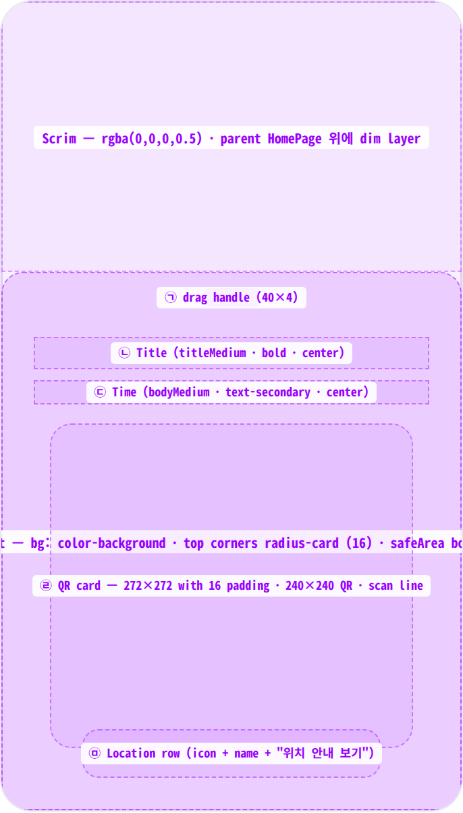
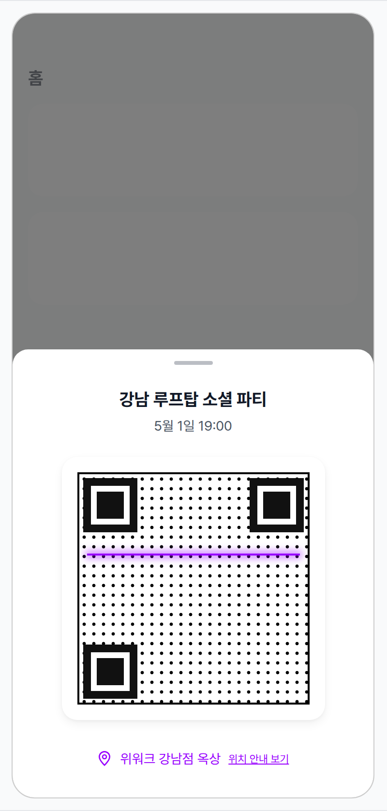
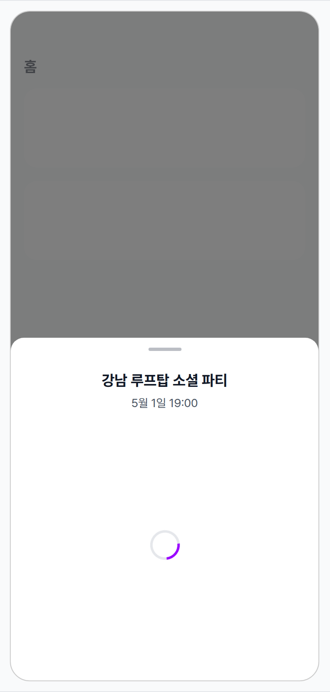
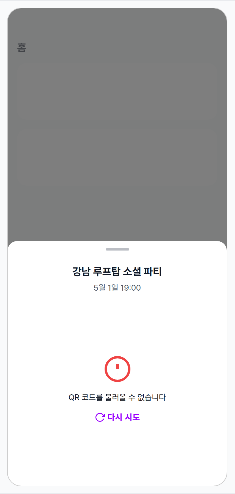
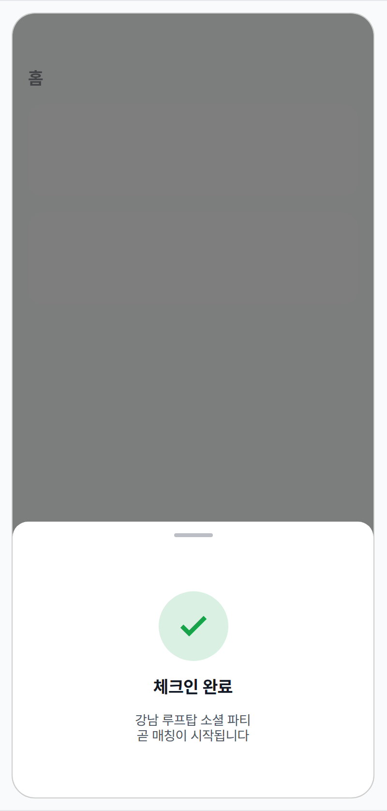

 Spec — EventCheckInScreen (app\_user · EventCheckInRoute)  

# Event Check-In

## Overview

| Status | 🚧 디자인중 — 4 state · 홈 위에 올라오는 바텀시트 |
|---|---|
| App | app_user |
| Category | event · check-in · modal sheet |
| Route / Surface | EventCheckInRoute · widget: EventCheckInScreen (홈 위에 올라오는 바텀시트) |
| Path | /events/:id/check-in |
| Hierarchy | Parent: HomePage — 시트가 올라와도 홈 화면은 어두워진 상태로 그대로 보임. 진입은 EventNowBar가 "체크인 준비됨" 또는 "곧 입장" 상태일 때 탭.Children: — (체크인이 끝나면 체크인 완료 화면으로 자동 전환) |
| Purpose | 오늘 참여하는 이벤트 입장에 쓰는 QR 티켓을 바로 보여주는 바텀시트. 사용자는 이 한 화면에서 QR 노출, 이벤트 정보 확인, 위치 안내 진입까지 한 번에 끝낸다. |
| User journey | Entry points: ① EventNowBar가 "곧 입장" / "체크인 준비됨" 상태일 때 탭 — 가장 흔한 경로. ② "곧 입장 시작" 푸시 알림 진입. ③ 내 티켓 화면 "오늘 입장 가능한 티켓"에서 진입.Exit points: 현장 파트너가 QR을 스캔하면 자동으로 체크인 완료 화면으로 전환. 시트 외곽 어두운 영역 탭 또는 핸들 아래로 끌어내리기 → 시트 닫힘 (홈 화면 복귀). |
| Background | 기존 풀-페이지 티켓 화면(/tickets/:ticketId/qr)과 달리, 체크인 흐름은 "홈에서 한 번 탭, 끝나면 바로 복귀"가 자연스러운 UX다. 그래서 바텀시트로 분리. 동일 콘텐츠를 deep-link 가능한 경로로 두면 푸시 알림 / 공유 URL / 마이페이지 "진행 중인 이벤트" 등 어디서든 진입 가능하다. 향후 풀-페이지 티켓과 통합 또는 alias 처리 예정 (EventNowBar spec 참고). |
| Frequency | 이벤트 시작 직전 — 사용자당 이벤트 1회. 체크인이 끝나면 자동으로 다음 화면으로 전환되어 다시 보이지 않는다. |

## History

| Date | Version | Author | Changes |
|---|---|---|---|
| 2026-05-01 | 1.0 | mark-yun | v1.4 template으로 신규 spec 작성. EventNowBar에서 진입하는 5개 시트 중 첫 번째 (체크인 준비됨 / 곧 입장 상태). 4 state · baseline = default (QR 준비 완료). 풀-페이지 티켓 화면의 QR 영역과 동일한 비주얼 재활용. |

[🧱 Layout](#layout) [🎨 States](#states) [🔄 Global Behavior](#behavior) [📖 Reference](#reference)

🧱

## Layout

화면 구조 — modal bottom sheet · top corners radius-card · drag handle + 콘텐츠 column. AppBar 없음. parent HomePage가 scrim 아래로 보임.

## Blueprint & tree

화면 하단에 부착되는 시트. 상단 모서리만 `radius-card (16)`으로 둥글고, 콘텐츠 길이에 따라 시트 높이가 가변 (최대 화면의 88%). 시트 내부는 위에서 아래로 차곡차곡 쌓이는 단일 컬럼.

**Modal Bottom Sheet** └─ scrim 0.5 black └─ top corners: _radius-card 16_ └─ _(콘텐츠 길이에 따라 시트 높이 가변)_ **EventCheckInScreen** └─ Safe area + 하단 inset └─ 위에서 아래로 stacked column ├─ _Drag handle_ ← ㉠ │ · 40×4 · radius 2 · text-secondary 흐린 색 │ ├─ Gap: _spacing-large (24)_ ├─ _Event title_ ← ㉡ │ · titleMedium · bold · center │ ├─ Gap: _spacing-small (8)_ ├─ _Event time_ ← ㉢ │ · bodyMedium · text-secondary · "M월 d일 HH:mm" │ ├─ Gap: _spacing-large (24)_ ├─ **QR card** ← ㉣ │ · 240×240 QR + 16 padding (그림자 있는 카드) │ · 위아래로 움직이는 스캔 라인 (primary) │ · 시트 표시 중 화면 밝기가 최대로 올라감 │ ├─ Gap: _spacing-large (24)_ └─ _Location row_ (장소 정보가 있을 때만) ← ㉤ · radius-button (12) · 탭 가능 · Icon(location\_on\_outlined · primary · 16) · 장소명 (bodyMedium · primary · 1줄 ellipsis) · "위치 안내 보기" (bodySmall · primary · underline) · 탭하면 외부 지도 앱이 해당 위치로 열림

| # | Region | Alignment | Spacing |
|---|---|---|---|
| — | Sheet 외부 | bottom-anchored · 풀폭 · max-height 88vh | top corners radius-card (16) · scrim rgba(0,0,0,0.5) (Material default) |
| — | Sheet body padding | vertical: spacing-large (24) · horizontal: spacing-screen-edge (16) | bottom: MediaQuery.viewPadding.bottom 추가 (홈버튼 영역 회피) |
| ㉠ | Drag handle | top-center | 40×4 · radius 2 · margin-bottom: spacing-large (24) |
| ㉡ | Event title | center | title↔time gap: spacing-small (8) |
| ㉢ | Event time | center | time↔QR gap: spacing-large (24) |
| ㉣ | QR card | center | 240×240 QR + 16 padding (총 272×272) · QR↔location gap: spacing-large (24) |
| ㉤ | Location row | center · wrap | icon↔name gap: spacing-small (8) · padding: vertical 8 · horizontal 16 |

🎨

## States

시각 변형 4종. baseline = default (QR 준비 완료). loading / error / 체크인 완료(transient)로 분기. 체크인 완료는 시트가 닫히거나 다음 화면으로 넘어가기 직전 잠깐 보이는 상태.

QR 코드를 받아오는 중인지, 받았는지, 실패했는지에 따라 분기. QR이 준비되면 default. 체크인 단계가 "체크인 완료"로 바뀌면 시트가 자동으로 다음 화면으로 전환된다.

### default · QR 준비 완료 🎯 baseline

| 항목 | 내용 |
|---|---|
| 조건 | QR 코드가 정상적으로 도착해 화면에 표시되는 상태. EventNowBar가 "곧 입장" 또는 "체크인 준비됨" 상태일 때. |
| 사용자 액션 | ① QR 화면을 현장 파트너 스캐너에 노출 → 스캔이 인식되면 자동으로 체크인 완료 화면으로 전환.② 위치 행 탭 → 외부 지도 앱이 해당 위치로 열림.③ 핸들 아래로 끌어내리기 / 시트 외곽 어두운 영역 탭 → 시트 닫힘, 홈 화면으로 복귀 (EventNowBar는 그대로 유지). |
| 에지케이스 | · 이벤트에 장소 정보가 없으면 위치 행 자체가 사라짐.· 외부 지도 앱이 열리지 않으면 "지도 앱을 열 수 없습니다" 안내가 잠깐 표시.· 시트가 떠 있는 동안 화면 밝기가 자동으로 최대치까지 올라가 어두운 환경에서도 스캔이 잘 됨. 시트가 닫히면 원래 밝기로 복원.· 스크린샷 방지 안내 문구는 이 시트에는 표시하지 않음 — EventNowBar 진입은 즉시성이 우선이라 안내문 생략. |
| 컴포넌트 | · Drag handle (40×4 · text-secondary 흐린 색)· Event title (titleMedium · bold · center)· Event time (bodyMedium · text-secondary · "M월 d일 HH:mm")· QR card (240×240 QR · 16 padding · 그림자 카드 · 위아래 스캔 라인)· Location row (Icon(location_on_outlined) + 장소명 + "위치 안내 보기") |
| 토큰 | · color: color-background (sheet bg · QR card bg), color-text-primary (title), color-text-secondary (time · handle), color-primary (scan line · location icon · CTA)· radius: radius-card (16) (sheet top corners · QR card), radius-button (12) (location row)· spacing: spacing-screen-edge (16) (h-padding), spacing-large (24) (v-padding · gaps), spacing-small (8) (title↔time)· typography: titleMedium(16/700 · title), bodyMedium(14 · time · location name), bodySmall(12 · CTA)· scrim: rgba(0,0,0,0.5)· animation: 2s reverse loop (QR scan line) |
| 노트 | 📝 풀-페이지 티켓 화면과 사실상 동일한 콘텐츠지만 표시 방식이 다르다 — 풀 스크린(상단 "내 티켓" AppBar 포함) vs 바텀시트(상단 핸들 포함). 향후 통합 또는 alias 처리 예정. |

### loading · QR 코드 받아오는 중

| 항목 | 내용 |
|---|---|
| 조건 | + 시트가 처음 떠서 QR 코드를 받아오고 있는 상태, 또는 다시 시도 후 응답을 기다리는 중. |
| 사용자 액션 | − QR 노출 / 위치 탭 모두 불가. 핸들 아래로 끌어내리기 / 시트 외곽 어두운 영역 탭으로 닫기는 가능. |
| 에지케이스 | + 네트워크 느림 → 스피너가 계속 → 사용자가 시트 닫고 다시 열 수 있음. 백엔드 요청은 백그라운드에서 그대로 진행. |
| 컴포넌트 | ↔ QR 영역 → 280px 고정 영역 가운데에 스피너만. title · time · handle 동일. |
| 토큰 | + spinner: color-primary · 36×36. 나머지 동일. |
| 노트 | 📝 280px 고정 높이는 layout shift 방지용 — QR이 도착해 swap 되어도 시트 높이가 점프하지 않는다. |

### error · QR 로드 실패

| 항목 | 내용 |
|---|---|
| 조건 | + 네트워크 / 서버 오류로 QR을 받지 못한 상태, 또는 티켓이 만료/권한 없음으로 받아올 수 없는 상태. |
| 사용자 액션 | + "다시 시도" 탭 → 다시 QR 로드 시도 (loading으로 복귀). 시트 닫고 홈 복귀 가능. |
| 에지케이스 | + 반복 실패 시 사용자에게 명확한 다음 단계 안내가 부족함 — 향후 "현장 안내 데스크 문의" 보조 CTA 추가 후보.· 권한 없는 사용자가 타인의 이벤트 링크로 진입해도 동일한 에러 표시 (보안상 사유는 구분해 노출하지 않음). |
| 컴포넌트 | ↔ QR 영역 → 에러 아이콘(error_outline 48 · error) + 메시지(bodyMedium) + "다시 시도" 버튼. title · time · handle 동일. |
| 토큰 | + color-error (icon), color-primary (retry CTA). 동일 height 280px. |
| 노트 | 📝 풀-페이지 티켓의 "티켓 정보를 찾을 수 없습니다"보다 다시 시도 버튼을 적극 노출 — 현장 진입이 임박한 상황이라 사용자가 즉시 재시도해야 한다. |

### checked-in · 체크인 완료 (transient) 다음 화면으로 넘어가기 직전 잠깐 보이는 상태

| 항목 | 내용 |
|---|---|
| 조건 | + 현장에서 QR 스캔이 인식되어 체크인이 막 완료된 직후. 화면이 다음 단계(체크인 완료 화면)로 넘어가기 직전 짧게 노출. |
| 사용자 액션 | ↔ 사용자 액션 불필요. 잠시 후 체크인 완료 화면으로 자동 전환. 그 사이 닫기는 가능. |
| 에지케이스 | + 사용자가 시트를 닫는 도중 체크인이 인식되면 닫기 동작이 우선 (홈 복귀, EventNowBar는 새 상태로 반영).· 체크인 완료 후 사용자가 다시 이 시트로 진입하려 하면 곧장 다음 화면이 열리도록 처리 (라우트 가드 필요). |
| 컴포넌트 | ↔ QR card · location row → 큰 success icon (72×72 · success 16% bg circle + check 36px) + "체크인 완료" titleMedium + 이벤트명 / "곧 매칭이 시작됩니다" 보조 텍스트. drag handle 동일. |
| 토큰 | + color-success (icon · 16% mix bg). 나머지 동일. |
| 노트 | 📝 잠깐 보이는 transient — 다음 화면으로 자동 전환됨. 다음 phase 전체는 체크인 완료 화면 spec에서 다룸. 이 화면은 "성공 → 다음 화면" 시각 confirmation만 책임. |

🔄

## Global Behavior

cross-cutting — 모든 state에 공통 적용. modal sheet dismiss · brightness · phase stream.

## Cross-cutting interactions

| Interaction | Behavior |
|---|---|
| 시트 닫기 — 핸들 아래로 끌어내리기 | 핸들 영역 또는 시트 본문을 아래로 드래그 → 일정 거리 이상 끌면 닫힘. 홈 화면은 그대로 유지되고 EventNowBar도 그대로 노출. |
| 시트 닫기 — 외곽 어두운 영역 탭 | 시트 외곽(어두워진 영역) 탭 → 동일하게 닫힘. |
| 시트 닫기 — 시스템 back | 안드로이드 back 버튼 / iOS swipe-from-edge → 닫힘. 홈 화면으로 복귀. |
| 화면 밝기 자동 최대 | 시트가 떠 있는 동안 화면 밝기가 자동으로 최대까지 올라감. 시트가 닫히면 원래 밝기로 복원. 어두운 환경에서 QR 스캔 성공률을 높이기 위함. |
| 체크인 단계 자동 반영 | 백엔드에서 체크인 단계가 바뀌면 시트가 즉시 반영. "체크인 완료"로 바뀌면 시트 내용이 성공 화면으로 전환되며 다음 단계로 넘어감. |
| 다크 모드 토글 | sheet bg → color-dark-background. scrim, QR(검정 모듈)은 그대로 (대비 유지). 다크 토큰 자동 swap. |

## Motion timing

Source: `shared/packages/mds/core/lib/src/theme/minglit_design_tokens.dart` — `MinglitAnimation`.

| Transition | Token / Duration | Notes |
|---|---|---|
| Sheet slide-up (route push) | MinglitAnimation.medium (350ms) | Material 3 modal sheet 기본. scrim fade-in 동시. |
| Sheet dismiss (slide-down) | MinglitAnimation.medium (350ms) | swipe / scrim / system back 모두 동일 timing. |
| QR scan line | 2000ms reverse loop | controller Duration(seconds: 2) · repeat(reverse: true). attention loop — MinglitAnimation 미정의. |
| State swap (loading ↔ data ↔ error) | — | cut. 분기가 즉시 교체됨 — 별도 전환 애니메이션 없음 (의도적, 시트 높이 고정으로 jank 회피). |
| checked-in transition | MinglitAnimation.medium (350ms) | success view 노출 후 EventCheckedInScreen으로 push 또는 dismiss + replace. |

※ 2s scan loop는 attention loop 카테고리 — `MinglitAnimation` 토큰에 미정의. 향후 motion scale 확장 시 토큰화 후보.

## Global edge cases

-   **딥링크 진입** — 푸시 알림 / 공유 URL로 직접 진입 시 홈 화면이 뒤에 없을 수 있음. 시트 닫을 때 홈으로 복귀하도록 처리.
-   **이벤트 시작 24시간 초과** — EventNowBar가 더 이상 노출되지 않는 시점. 딥링크로 직접 진입은 가능하나 권한 검사에서 실패해 error 상태로 보임.
-   **스크린샷 / 화면 녹화 안내** — 풀-페이지 티켓 화면에는 있는 안내가 이 시트에는 없음. 즉시성 우선이고 시트 영역이 좁아 의도적으로 생략. 향후 부정 사용 신호가 늘면 재검토.
-   **오프라인** — 로컬에 저장된 티켓 캐시가 있으면 오프라인에서도 QR 노출 가능. 캐시가 없으면 error 상태.
-   **다중 활성 이벤트** — EventNowBar는 한 번에 하나만 노출하므로 이 시트도 한 번에 하나. 다른 이벤트의 QR은 내 티켓 화면을 통해 진입.

📖

## Reference

implementation source + 인접 화면.

## Implementation source

| Widget (target) | EventCheckInScreen — kit-shared (shared/packages/minglit_kit/lib/src/...) — 신규 추가 예정. 현재는 미존재. |
|---|---|
| Current implementation | CheckInReadyContent — apps/app_user/lib/src/features/home/widgets/event_now_phases/check_in_ready_content.dart · EventNowBottomSheet 내부에 inline 렌더링 (showModalBottomSheet, 라우트 아님) |
| Sheet wrapper (current) | showEventNowBottomSheet — event_now_bottom_sheet.dart · phase별 콘텐츠 분기. |
| Atom — QR viewer | TicketQRViewer — ticket_qr_viewer.dart · 스캐닝 라인 + brightness max + QrImageView |
| Provider | eventTicketTokenProvider(eventId) · eventNowBarStateProvider(activeEvent) — Riverpod stream |
| Route registration (target) | EventCheckInRoute — app_routes.dart · @TypedGoRoute<EventCheckInRoute>(path: '/events/:id/check-in') · pageBuilder → ModalBottomSheetRoute — 신규 추가 예정. 현재는 미등록. |
| Theme | MinglitTheme.materialTheme — minglit_theme.dart · sheet bg = ColorScheme.surface(white) · scrim = Material default 0.5 black |

## Related screens

| Spec | Relation |
|---|---|
| EventNowBar | 이 시트의 진입 trigger — bar의 checkInReady / waiting state 탭. routed-sheet 매핑 5종 중 첫 번째. |
| HomePage | parent route — 시트가 push 되는 동안 scrim 아래로 그대로 유지. dismiss 시 복귀. |
| MyTicketsPage | 대안 진입 — "오늘 입장 가능한 티켓" 영역에서 진입 (deeplink). 현재는 TicketQRRoute로 진입 — 통합 시 동일 시트로 통합 후보. |
| EventCheckedInScreen (spec 미작성) | 다음 phase — 체크인 완료 시 자동 transition. EventNowBar의 두 번째 routed sheet. |