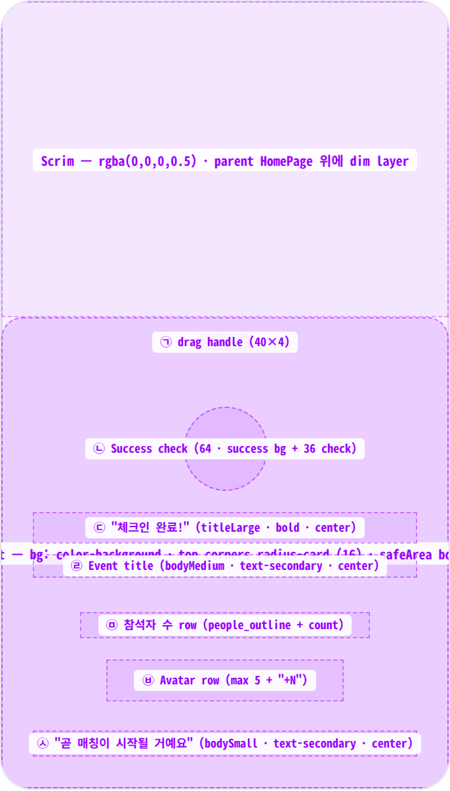
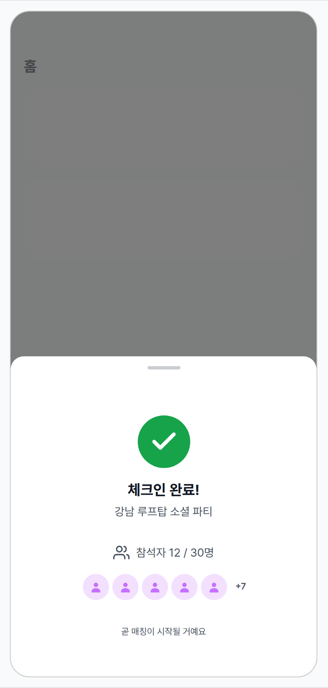
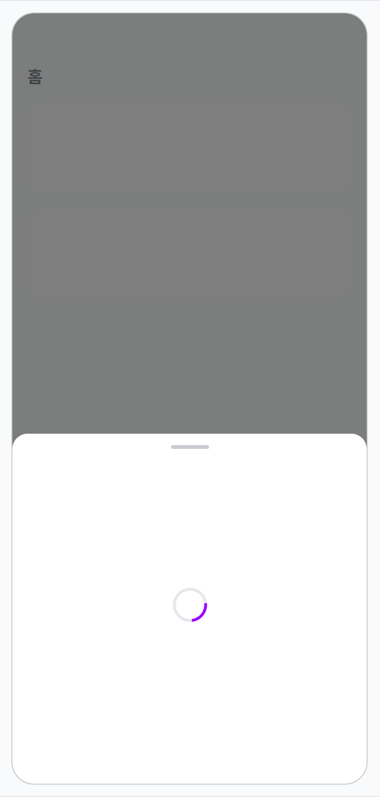
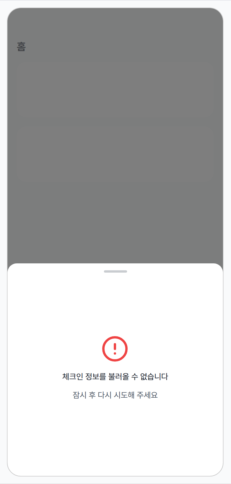
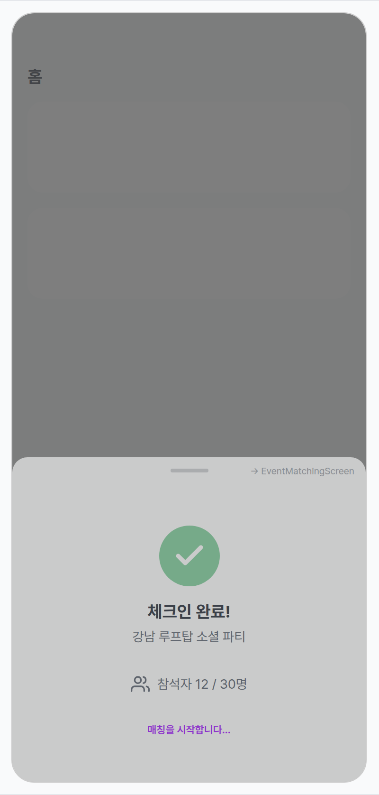

 Spec — EventCheckedInScreen (app\_user · EventCheckedInRoute)  

# Event Checked In

## Overview

| Status | 🚧 디자인중 — 4 state · 홈 위에 올라오는 바텀시트 |
|---|---|
| App | app_user |
| Category | event · check-in confirmation · modal sheet |
| Route / Surface | EventCheckedInRoute · widget: EventCheckedInScreen (홈 위에 올라오는 바텀시트) |
| Path | /events/:id/checked-in |
| Hierarchy | Parent: HomePage — 시트가 올라와도 홈 화면은 어두워진 상태로 그대로 보임. 진입은 EventNowBar가 "체크인 완료" 상태일 때 탭, 또는 EventCheckInScreen에서 체크인 인식 후 자동 전환.Children: — (매칭이 시작되면 매칭 화면으로 자동 전환) |
| Purpose | 체크인이 정상 완료됐다는 시각 confirmation을 주고, 같은 이벤트에 도착한 다른 참석자 수와 아바타로 "곧 함께할 사람들이 모이고 있다"는 사회적 신호를 노출. 매칭 시작 직전의 짧은 lobby 역할. |
| User journey | Entry points: ① 체크인 화면에서 QR 스캔이 인식되면 자동으로 이 시트로 전환. ② EventNowBar가 "체크인 완료" 상태일 때 직접 탭. ③ "체크인이 확인되었습니다" 푸시 알림 진입.Exit points: ① 매칭이 시작되면 매칭 화면으로 자동 전환. ② 시트 외곽 어두운 영역 탭 / 핸들 아래로 끌어내리기 → 시트 닫힘 (홈 화면 복귀, EventNowBar는 "체크인 완료" 상태로 그대로 노출). |
| Background | 체크인 직후 사용자 심리 — "내가 잘 등록된 게 맞나?" 불안 + "다른 사람들도 왔나?" 호기심을 동시에 해소해야 한다. 그래서 이 화면은 ① 큰 success 체크 (시각 즉시성) ② 참석자 수 (밀도 신호) ③ 곧 매칭 시작 안내 (다음 단계 예고)의 3단 구조. 별도 화면으로 둔 이유는 체크인 화면과 분리해 딥링크 / 푸시 알림 / EventNowBar 직접 탭 등 여러 entry로 진입 가능하게 하기 위함. |
| Frequency | 이벤트당 사용자 1회. 체크인 ~ 매칭 시작 사이의 짧은 대기 윈도우 (보통 1~5분 내외). |

## History

| Date | Version | Author | Changes |
|---|---|---|---|
| 2026-05-01 | 1.0 | mark-yun | v1.4 template으로 신규 spec 작성. EventNowBar에서 진입하는 5개 시트 중 두 번째 ("체크인 완료" 상태). 4 state · baseline = default (체크인 완료 confirmation). |

[🧱 Layout](#layout) [🎨 States](#states) [🔄 Global Behavior](#behavior) [📖 Reference](#reference)

🧱

## Layout

화면 구조 — modal bottom sheet · top corners radius-card · drag handle + 단일 Column. AppBar 없음. parent HomePage가 scrim 아래로 보임.

## Blueprint & tree

화면 하단에 부착되는 시트. 상단 모서리만 `radius-card (16)`으로 둥글고, 콘텐츠 길이에 따라 시트 높이가 가변 (baseline에서는 약 360px 내외). 본문은 위에서 아래로 stacked column.

**Modal Bottom Sheet** └─ scrim 0.5 black └─ top corners: _radius-card 16_ └─ _(콘텐츠 길이에 따라 시트 높이 가변)_ **EventCheckedInScreen** └─ Safe area + 하단 inset └─ Padding(horizontal: _screenEdge 16_ · vertical: _large 24_) └─ 가운데 정렬 stacked column ├─ _Drag handle_ ← ㉠ │ · 40×4 · radius 2 · text-secondary 흐린 색 │ ├─ Gap: _spacing-xlarge (32)_ ├─ _Success check_ ← ㉡ │ · 64×64 원 · bg: success │ · Icon(check · 36 · color: background) │ ├─ Gap: _spacing-medium (16)_ ├─ _"체크인 완료!"_ ← ㉢ │ · titleLarge · bold · center │ ├─ Gap: _spacing-small (8)_ ├─ _Event title_ ← ㉣ │ · bodyMedium · text-secondary · center │ · fallback: "이벤트" (제목 누락 시) │ ├─ Gap: _spacing-xlarge (32)_ ├─ _Participant count row_ ← ㉤ │ · 가운데 정렬 row │ · Icon(people\_outline · 20 · text-secondary) │ · Gap: _spacing-small (8)_ │ · "참석자 N / M명" (bodyMedium · text-secondary) │ ├─ Gap: _spacing-medium (16)_ ├─ **참석자 아바타 row** ← ㉥ │ · 가운데 정렬 row · 최대 5개 노출 │ · 32×32 원형 아바타 (primary 흐린 톤, 우측으로 갈수록 더 짙어짐) │ · child: Icon(person · 16) │ · "+N" (bodySmall · text-secondary · w600) — 6명 이상일 때만 │ ├─ Gap: _spacing-xlarge (32)_ └─ _"곧 매칭이 시작될 거예요"_ ← ㉦ · bodySmall · text-secondary · center

| # | Region | Alignment | Spacing |
|---|---|---|---|
| — | Sheet 외부 | bottom-anchored · 풀폭 · max-height 88vh | top corners radius-card (16) · scrim rgba(0,0,0,0.5) (Material default) |
| — | Sheet body padding | horizontal: screenEdge (16) · vertical: large (24) | bottom: MediaQuery.viewPadding.bottom 추가 (홈버튼 영역 회피) |
| ㉠ | Drag handle | top-center | 40×4 · radius 2 · gap to ㉡: spacing-xlarge (32) |
| ㉡ | Success check | center | 64×64 circle · gap to ㉢: spacing-medium (16) |
| ㉢ | "체크인 완료!" 타이틀 | center | gap to ㉣: spacing-small (8) |
| ㉣ | Event title | center | gap to ㉤: spacing-xlarge (32) |
| ㉤ | Participant count row | center · Row | icon↔text gap: spacing-small (8) · gap to ㉥: spacing-medium (16) |
| ㉥ | Avatar row | center · Row | 아바타 32×32 · 좌우 padding 2 · "+N"는 좌측 spacing-small (8) · gap to ㉦: spacing-xlarge (32) |
| ㉦ | "곧 매칭이 시작될 거예요" | center | bottom: spacing-medium (16) 후 sheet padding 종료 |

🎨

## States

시각 변형 4종. baseline = default (체크인 완료 confirmation). loading / error / matching-transition으로 분기. matching-transition은 시트가 닫히기 직전 잠깐 보이는 상태.

체크인 단계 정보가 잘 도착했는지, 아직 받아오는 중인지, 실패했는지에 따라 분기. 매칭이 시작되면 화면이 자동으로 다음 단계로 넘어간다. 참석자 수와 아바타는 실시간으로 갱신.

### default · 체크인 완료 confirmation 🎯 baseline · 참석자 12/30명

| 항목 | 내용 |
|---|---|
| 조건 | EventNowBar가 "체크인 완료" 상태이고 적어도 한 명 이상의 참석자가 도착해 있는 상태. |
| 사용자 액션 | ① 콘텐츠는 읽기 전용 — 별도 액션 버튼 없음. 사용자는 매칭이 시작되길 기다린다.② 핸들 아래로 끌어내리기 / 시트 외곽 어두운 영역 탭 → 시트 닫힘 (홈 복귀, EventNowBar는 "체크인 완료" 상태로 그대로 노출, 다시 탭하면 같은 시트 재노출).③ 매칭이 시작되면 잠시 후 매칭 화면으로 자동 전환. |
| 에지케이스 | · 이벤트 제목이 누락된 경우 "이벤트"라는 fallback 텍스트 표시.· 참석자가 0명이면 아바타 row 자체가 숨김. count 텍스트는 "참석자 0 / 30명"으로 표시.· 참석자가 6명 이상이면 5개 아바타 + "+N" (N = 전체 − 5).· 아바타는 placeholder만 — 실제 user 프로필 이미지는 미연결 (privacy 고려, 향후 design call). 색상은 우측으로 갈수록 점진적으로 더 짙어짐.· 시트를 닫고 다시 열어도 동일 콘텐츠. 참석자 수는 실시간으로 자동 갱신. |
| 컴포넌트 | · Drag handle (40×4 · text-secondary 흐린 색)· Success check (64×64 원 · bg success · Icon(check · 36 · color: background))· "체크인 완료!" (titleLarge · bold)· Event title (bodyMedium · text-secondary · center)· Participant count row (Icon(people_outline · 20 · text-secondary) + "참석자 N / M명")· 참석자 아바타 row (32×32 원형 아바타 × 최대 5 + "+N" 텍스트)· "곧 매칭이 시작될 거예요" (bodySmall · text-secondary) |
| 토큰 | · color: color-background (sheet bg · check icon fill), color-success (check circle bg), color-text-primary (titleLarge), color-text-secondary (event title · count · waiting · handle), color-primary (avatar bg — 우측으로 갈수록 점진적으로 더 짙은 톤)· radius: radius-card (16) (sheet top corners), 50% (check circle · avatar)· spacing: spacing-screen-edge (16) (h-padding), spacing-large (24) (v-padding), spacing-xlarge (32) (handle↔check · title↔count · avatars↔waiting), spacing-medium (16) (check↔title · count↔avatars), spacing-small (8) (title↔event · icon↔count text)· typography: titleLarge(20/700 · "체크인 완료!"), bodyMedium(14 · event title · count), bodySmall(12 · waiting · "+N")· iconSize: 20 (people_outline), 36 (check), 16 (avatar person)· opacity: muted (0.3 · handle), 점진적 알파 (avatar bg)· scrim: rgba(0,0,0,0.5) |
| 노트 | 📝 success check 색상은 채도 높은 success 원 + 흰 체크 — 보조 surface 처리(흐린 톤) 없이 가장 강한 success 신호. 체크인 화면의 transient state(흐린 success 톤)와는 의도적으로 시각 차별화 — 이쪽이 "최종 확정" 신호. |

### loading · 체크인 단계 받아오는 중

| 항목 | 내용 |
|---|---|
| 조건 | + 시트가 처음 떠서 체크인 단계 정보를 받아오고 있는 상태. 200px 고정 영역 가운데에 스피너만 노출. |
| 사용자 액션 | − 모든 콘텐츠 읽기 불가. 핸들 아래로 끌어내리기 / 시트 외곽 어두운 영역 탭으로 닫기는 가능. |
| 에지케이스 | + 네트워크 느림 → 스피너만 계속. 결국 정보가 도착하거나 error 상태로 떨어짐. |
| 컴포넌트 | ↔ 본문 전체 → 200px 고정 영역 가운데 스피너. drag handle 동일. |
| 토큰 | + spinner: color-primary · 36×36. 나머지 동일. |
| 노트 | 📝 체크인 화면과 동일 fixed-height 패턴 — 정보 도착 후 콘텐츠로 swap 시 시트 점프 방지. |

### error · 체크인 정보 로드 실패

| 항목 | 내용 |
|---|---|
| 조건 | + 네트워크 / 서버 오류로 체크인 단계 정보를 받지 못한 상태. |
| 사용자 액션 | + 명시적 다시 시도 버튼 추가 후보 (현재 미정). 시트 닫고 다시 열면 자동으로 재시도됨. |
| 에지케이스 | + 사용자는 이미 체크인했지만 일시적으로 클라이언트가 단계 정보를 못 받는 상황. 보수적으로 fallback 메시지만 노출하고 자동 회복을 기다림. |
| 컴포넌트 | ↔ 본문 전체 → Icon(error_outline · 48 · error) + bodyMedium 메시지 + bodySmall 보조 텍스트. drag handle 동일. |
| 토큰 | + color-error (icon). 동일 height 280px (layout shift 방지). |
| 노트 | 📝 사용자 혼란을 줄이기 위해 명시적 error UI 노출 권장. |

### matching-transition · 매칭 시작 (transient) 매칭 화면으로 넘어가기 직전 잠깐 보이는 상태

| 항목 | 내용 |
|---|---|
| 조건 | + 매칭이 시작되어 단계가 "매칭 중"으로 막 전환된 직후. |
| 사용자 액션 | ↔ 사용자 액션 불필요. 잠시 후 매칭 화면으로 자동 전환. 그 사이 시트 닫기는 가능 — 닫아도 EventNowBar는 "매칭 중" 상태로 표시. |
| 에지케이스 | + 사용자가 시트를 닫는 도중 매칭이 시작되면 닫기 동작이 우선.· 다음 화면 진입에 실패하면 시트가 닫히고 EventNowBar 재진입에 의존. |
| 컴포넌트 | ↔ "곧 매칭이 시작될 거예요" → "매칭을 시작합니다…" (color-primary · w600). 그 외 영역은 baseline 유지하며 fade-out. |
| 토큰 | + color-primary (전환 알림 텍스트). 시트 전체 opacity 0.6 → 0 fade-out 350ms. |
| 노트 | 📝 잠깐 보이는 transient — 곧 매칭 화면으로 자동 전환. 이 spec에서는 "다음 화면 예고 + transition" 시각만 책임. |

🔄

## Global Behavior

cross-cutting — 모든 state에 공통 적용. modal sheet dismiss · phase stream · 참석자 count stream.

## Cross-cutting interactions

| Interaction | Behavior |
|---|---|
| 시트 닫기 — 핸들 아래로 끌어내리기 | 핸들 영역 또는 시트 본문을 아래로 드래그 → 일정 거리 이상 끌면 닫힘. 홈 화면은 그대로 유지. EventNowBar는 그대로 "체크인 완료" 상태로 노출. |
| 시트 닫기 — 외곽 어두운 영역 탭 | 시트 외곽(어두워진 영역) 탭 → 동일하게 닫힘. |
| 시트 닫기 — 시스템 back | 안드로이드 back 버튼 / iOS swipe-from-edge → 닫힘. 홈 화면으로 복귀. |
| 체크인 단계 자동 반영 | 백엔드에서 단계가 바뀌면 시트가 즉시 반영. "매칭 중"으로 바뀌면 시트 내용이 전환 화면으로 swap 되고 잠시 후 매칭 화면으로 자동 전환. |
| 참석자 수 / 아바타 갱신 | 참석자 수가 실시간으로 갱신되면 텍스트와 아바타 row가 즉시 다시 그려짐. 별도 전환 애니메이션 없이 즉시 swap. |
| 다크 모드 토글 | sheet bg → color-dark-background. success / primary 등 brand 색상은 dark 변형 자동 적용. scrim 동일. |

## Motion timing

Source: `shared/packages/mds/core/lib/src/theme/minglit_design_tokens.dart` — `MinglitAnimation`.

| Transition | Token / Duration | Notes |
|---|---|---|
| Sheet slide-up (route push) | MinglitAnimation.medium (350ms) | Material 3 modal sheet 기본. scrim fade-in 동시. |
| Sheet dismiss (slide-down) | MinglitAnimation.medium (350ms) | swipe / scrim / system back 모두 동일 timing. |
| State swap (loading ↔ data ↔ error) | — | cut. 분기가 즉시 교체됨 — 별도 전환 애니메이션 없음 (의도적, 시트 jank 회피). |
| Participant count / 아바타 갱신 | MinglitAnimation.fast (200ms) — 권장 | 현재 구현은 cut. 향후 카운트 증가 시 fade + scale micro-animation 후보. |
| matching-transition | MinglitAnimation.medium (350ms) | transient view 노출 후 EventMatchingScreen으로 push 또는 dismiss + replace. |

## Global edge cases

-   **딥링크 진입** — 푸시 알림 / 공유 URL로 직접 진입 시 홈 화면이 뒤에 없을 수 있음. 시트 닫을 때 홈으로 복귀하도록 처리.
-   **아직 체크인하지 않은 상태로 진입** — 단계가 "곧 입장" / "체크인 준비됨"이면 이 시트는 의미 없음. 라우트 가드에서 단계 체크 후 [체크인 화면](/specs/event_check_in_screen/index.html)으로 redirect 권장.
-   **참석자 수 0 / 1명** — "참석자 1 / 30명" + 내 아바타만 1개. "곧 매칭이 시작될 거예요"가 약간 과장이 될 수 있어 향후 카피 보강 후보 ("다른 분들이 도착하면 매칭이 시작됩니다" 등).
-   **오프라인** — 단계 정보를 받을 수 없으면 마지막으로 알려진 단계 사용. 체크인 직후 비행기 모드 등 → 이 화면 유지되며 매칭 자동 전환은 실패. 재연결 시 자동 회복.
-   **매칭이 끝내 시작되지 않음** — 운영 사고 / 인원 미달. 별도 처리 미정 — 추후 운영자 푸시로 종료 화면으로 강제 전환 또는 "매칭이 지연되고 있습니다" 안내 추가 검토.
-   **다중 활성 이벤트** — EventNowBar는 한 번에 하나만 노출하므로 이 시트도 한 번에 하나. 다른 체크인된 이벤트는 향후 별도 진입점 (내 티켓 등) 필요.

📖

## Reference

implementation source + 인접 화면.

## Implementation source

| Widget (target) | EventCheckedInScreen — kit-shared (shared/packages/minglit_kit/lib/src/...) — 신규 추가 예정. 현재는 미존재. |
|---|---|
| Current implementation | CheckedInContent — apps/app_user/lib/src/features/home/widgets/event_now_phases/checked_in_content.dart · EventNowBottomSheet 내부에 inline 렌더링 (showModalBottomSheet, 라우트 아님). _ParticipantAvatarRow private widget 동일 파일에 정의. |
| Sheet wrapper (current) | showEventNowBottomSheet + EventNowBottomSheet — event_now_bottom_sheet.dart · phase별 콘텐츠 분기 (checkedIn → CheckedInContent). |
| Provider | eventNowBarStateProvider(activeEvent) — Riverpod stream. activeEvent.event.currentParticipants / maxParticipants 직접 접근. |
| Route registration (target) | EventCheckedInRoute — app_routes.dart · @TypedGoRoute<EventCheckedInRoute>(path: '/events/:id/checked-in') · pageBuilder → ModalBottomSheetRoute — 신규 추가 예정. 현재는 미등록. |
| Theme | MinglitTheme.materialTheme — minglit_theme.dart · sheet bg = ColorScheme.surface(white) · scrim = Material default 0.5 black · success = MinglitColors.success. |

## Related screens

| Spec | Relation |
|---|---|
| EventNowBar | 이 시트의 진입 trigger — bar의 checkedIn state 탭. routed-sheet 매핑 5종 중 두 번째. |
| EventCheckInScreen | 직전 phase — QR 스캔 성공 시 phase가 checkedIn으로 변경되며 이 시트로 자동 transition. |
| EventResultsScreen | 같은 EventNowBar routed-sheet 그룹의 sibling. matching → results phase로 이동 시 노출. |
| HomePage | parent route — 시트가 push 되는 동안 scrim 아래로 그대로 유지. dismiss 시 복귀. |
| EventMatchingScreen (spec 미작성) | 다음 phase — 매칭 시작 시 자동 transition. EventNowBar의 세 번째 routed sheet. |