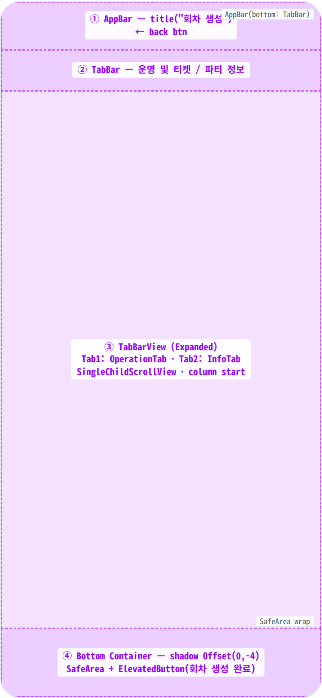
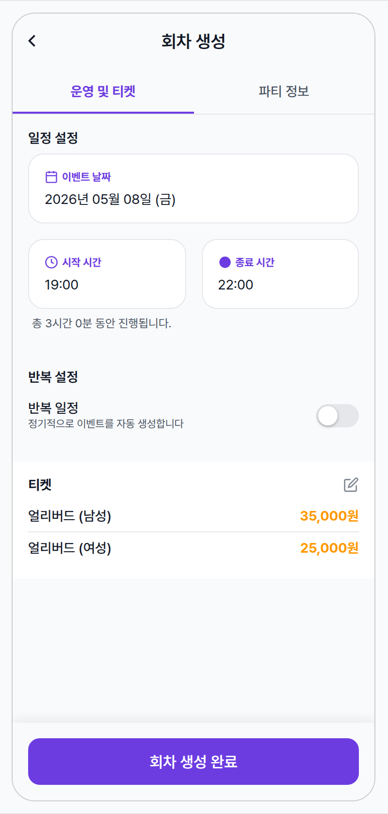
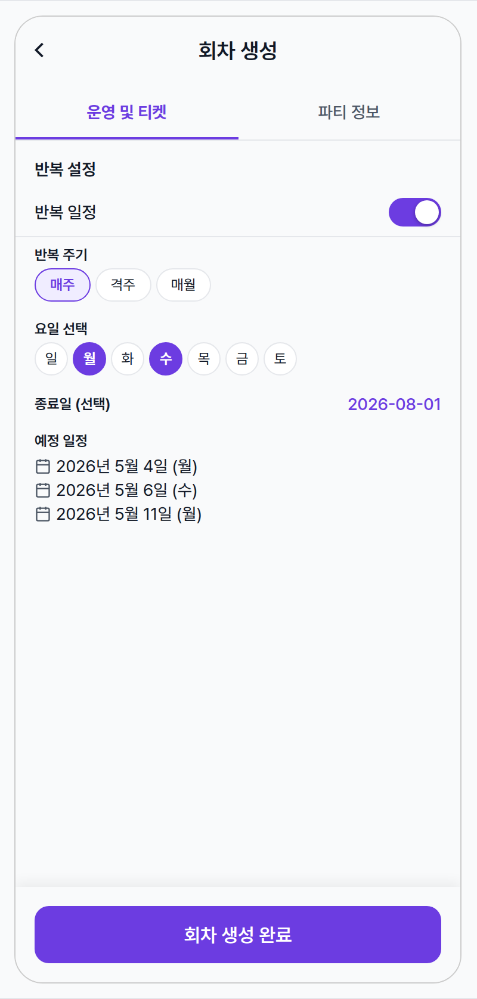
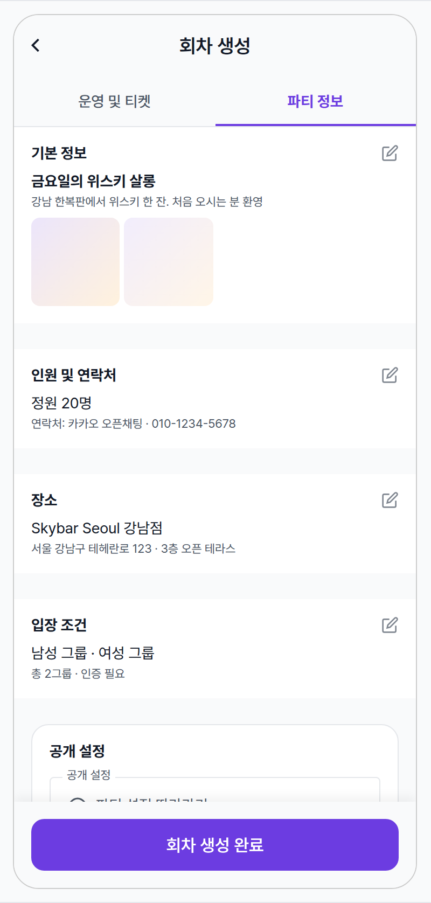
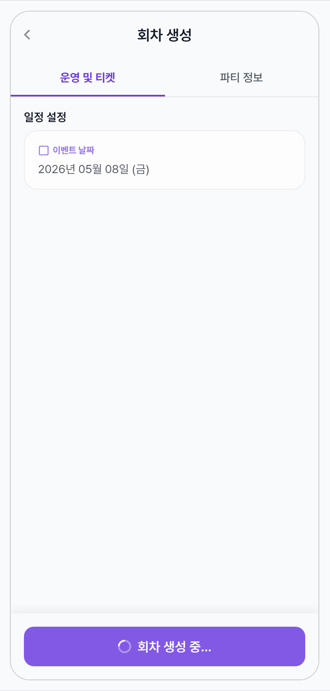
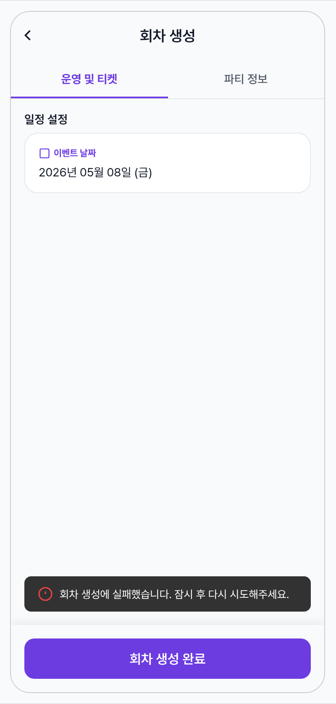
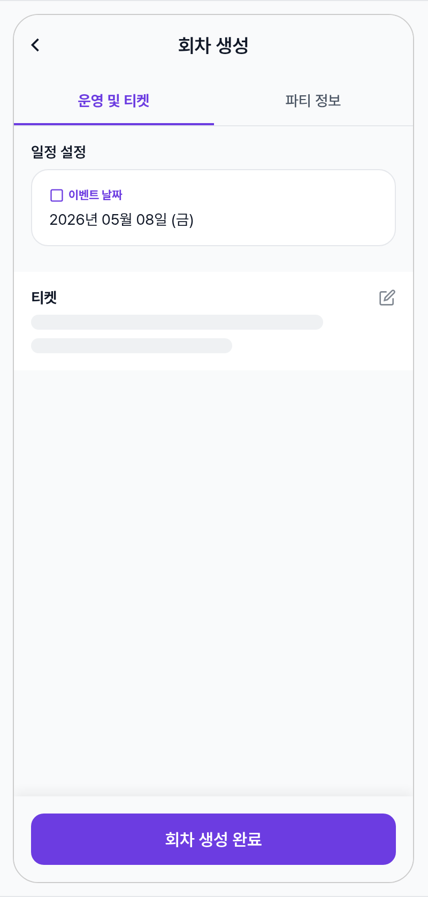

 Spec — EventCreatePage (app\_partner · EventCreateRoute)  

# Event Create

## Overview

| Status | ✅ 디자인완료 — 2 tab + recurrence on/off + submit/error/init = 6 state |
|---|---|
| App | app_partner |
| Category | party · event · create (new occurrence) |
| Route / Surface | EventCreateRoute · widget: EventCreatePage + EventCreateOperationTab + EventCreateInfoTab (TabBar 2-tab) |
| Path | /more/parties/:partyId/events/create |
| Hierarchy | Parent: PartyDetailPage (Tab1 "이벤트 관리" → "회차 만들기" 버튼에서 진입)Children: — (섹션별 편집은 MaterialPageRoute로 push되는 별도 화면 — PartyBasicInfoEditScreen, PartyCapacityContactEditScreen, PartyLocationEditScreen, TicketTemplateManageScreen. 같은 partyId scope을 공유.) |
| Purpose | 파트너가 기존 파티에서 새 회차(이벤트)를 생성한다. 진입 시 부모 파티의 기본 정보 / 정원 / 연락처 / 입장 그룹 / 티켓 템플릿이 자동으로 채워져 있으며, 파트너는 일정·반복 규칙·티켓 등 회차마다 달라지는 운영 정보만 보강하면 된다. |
| User journey | Entry points: 파티 상세의 "이벤트 관리" 탭에서 "회차 만들기" CTA를 탭하면 진입.Exit points: 생성 성공 → 화면이 닫히며 파티 상세로 돌아가고, "새로운 회차가 성공적으로 생성되었습니다." 토스트가 잠시 노출. 실패 → 안내 토스트가 잠시 노출되고 화면은 그대로 유지. 뒤로가기 → 변경사항 확인 다이얼로그 없이 즉시 닫힘. |
| Background | 밍글릿 파티 모델은 party (정기 모임 컨테이너) + event (한 번의 회차)로 분리된다. 매 회차마다 동일한 정보(타이틀/소개/장소/티켓)를 다시 입력하지 않도록 부모 파티의 template을 instance로 복사해서 시작한다. 반복 일정이 켜진 경우 recurrence_rule이 함께 생성되어 매주/격주/매월 자동 회차 생성 잡(server-side)이 활성화된다. 단, 화면 자체에는 eventId edit 모드 없음 — 항상 신규 생성. |
| Frequency | 한 파티당 회차마다 1회. 정기 파티(반복 사용)에선 1주~1달에 한 번씩 진입. |

## History

이 spec의 주요 변경 이력. 최신 항목 위.

| Date | Version | Author | Changes |
|---|---|---|---|
| 2026-05-01 | 1.0 | mark-yun | v1.4 template으로 작성. 6 state — Tab1 baseline · Tab1 recurrence on · Tab2 info · submitting · error · initial post-frame loading. Partner brand --color-partner-primary viewport-scoped. |

[🧱 Layout](#layout) [🎨 States](#states) [🔄 Global Behavior](#behavior) [📖 Reference](#reference)

🧱

## Layout

화면 구조 — 영역, 정렬, 간격 규칙. 색·타이포 무시.

## Blueprint & tree

`DefaultTabController(length: 2)`로 감싼 `Scaffold` — AppBar(title + bottom TabBar) + Column(Expanded(TabBarView) + bottom Container with SafeArea-wrapped ElevatedButton). bottomNavigationBar가 아니라 body 마지막 child로 부착된 submit Container라 shadow가 위쪽 방향으로 떨어진다(`Offset(0, -4)`).

**DefaultTabController**(length: 2) └─ **Scaffold** ├─ **appBar**: **AppBar** ← ①+② │ ├─ title: Text(l10n.eventCreate\_title) │ └─ bottom: **TabBar**(tabs: \[ │ Tab("운영 및 티켓"), │ Tab(l10n.partyDetail\_tab\_info), │ \]) └─ **body**: **Column** ├─ **Expanded** │ └─ **TabBarView** ← ③ │ ├─ **EventCreateOperationTab** │ │ └─ SingleChildScrollView │ │ ├─ "일정 설정" Header │ │ ├─ **EventDateTimeInput** │ │ │ ├─ pickerCard(이벤트 날짜) │ │ │ └─ Row(시작 시간 picker · 종료 시간 picker) │ │ ├─ "반복 설정" Header │ │ ├─ **RecurrenceSettingsSection** │ │ │ ├─ SwitchListTile(반복 일정) │ │ │ └─ if enabled: │ │ │ ├─ Divider │ │ │ ├─ \_PatternChips(매주/격주/매월) │ │ │ ├─ \_DayOfWeekChips OR \_MonthDayInput │ │ │ ├─ \_EndDateRow(종료일 선택) │ │ │ └─ \_PreviewDates(예정 일정) │ │ └─ **MinglitEditableSection**(티켓) │ │ └─ PartyTicketsSummary(showStats: false) │ └─ **EventCreateInfoTab** │ └─ SingleChildScrollView │ ├─ MinglitEditableSection(기본 정보 → EventBasicInfoSummary) │ ├─ MinglitEditableSection(인원 및 연락처 │ │ → EventCapacitySummary + EventContactSummary) │ ├─ MinglitEditableSection(장소 → EventLocationSummary) │ ├─ MinglitEditableSection(입장 조건 — read-only, │ │ onTap: () {}) → PartyEntranceConditionSummary │ └─ Container(공개 설정 카드) │ └─ DropdownButtonFormField(visibility: │ null/public/private) └─ **Container**(shadow Offset(0,-4)) ← ④ └─ **SafeArea** └─ **ElevatedButton** onPressed: state.status.isLoading ? null : \_submit child: isLoading ? "회차 생성 중..." : "회차 생성 완료"

## Spacing & alignment rules

| # | Region | Alignment | Spacing |
|---|---|---|---|
| ① | AppBar | title centered (Material default) · 56px | centerTitle 명시 안됨 — Material default. back 버튼 자동. |
| ② | TabBar | 2-tab equal flex · 48px · indicator 2px under active tab | indicator color = primary (theme override 없음 → partner indigo). |
| ③ | TabBarView body | SingleChildScrollView · column start | 섹션 간: spacing-large (24px). DateTimeInput 카드 간격: spacing-medium (16px). 카드 padding: spacing-medium. RecurrenceSettings: spacing-small (8) 사이 간격, horizontal pad spacing-medium. |
| ④ | Bottom submit | SafeArea + Padding(spacing-medium) | Container padding: spacing-medium all · button height ≈ 48px (ElevatedButton default) · BoxShadow blur 10 · alpha = MinglitOpacity.tintFill. |
| — | MinglitEditableSection | InkWell · Container padding all | padding: spacing-medium · header(title + edit pencil 16px) ↔ child gap: spacing-small (8). bg = surfaceContainerLowest @ MinglitOpacity.strong ≈ color-background. |
| — | 공개 설정 Card (Tab2) | Container with border + radius-card | Container padding: spacing-medium · title↔dropdown gap: spacing-medium. 외부 horizontal margin 없음 — InfoTab 자체에 padding 없으므로 이 카드만 화면에 edge-to-edge로 붙음 (drift 후보). |

🎨

## States

시각 변형 6종. baseline = Tab1 / 일정·반복 off, 나머지는 additive diff.

**State 식별 기준**: 활성 탭(운영 및 티켓 / 파티 정보), 반복 일정 켜짐 여부, 저장 진행/실패 여부에 따라 6가지 변형. 이 화면은 항상 새 회차를 만드는 흐름이며, 수정 모드는 없음. 진입 직후엔 부모 파티의 값으로 입력란이 채워지기 직전의 짧은 한 프레임이 잠시 보일 수 있다 (state 6).

### Tab1 / 운영 및 티켓 · 반복 off 🎯 baseline · 반복 일정 꺼져 있는 일반적인 신규 회차 작성 모습

| 항목 | 내용 |
|---|---|
| 조건 | 활성 탭이 "운영 및 티켓"이고, 반복 일정 토글이 꺼진 상태. 부모 파티의 값이 자동으로 채워져 일정 / 티켓이 표시되는 일반적인 신규 회차 작성 모습. |
| 사용자 액션 | ① 날짜 카드 탭 — 날짜 선택기가 열림 (선택 가능 범위: 30일 전 ~ 1년 후).② 시작 / 종료 시간 카드 탭 — 시간 선택기. 시작 시간을 변경했을 때 종료가 그보다 빠르면 종료가 자동으로 시작 + 3시간으로 보정됨.③ "반복 일정" 토글 탭 — 반복 설정 영역이 즉시 펼쳐지며 다음 state로 전환.④ "티켓" 섹션 탭 — 티켓 템플릿 편집 화면으로 이동.⑤ "파티 정보" 탭 헤더 탭 — Tab2(파티 정보)로 슬라이드 전환.⑥ "회차 생성 완료" 버튼 탭 — 저장 진행 상태로 전환.⑦ 뒤로가기 — 별도 확인 없이 즉시 닫힘. |
| 에지케이스 | · 부모 파티 값이 채워지기 직전 한 프레임 동안은 제목 / 티켓이 비어 있는 모습이 잠시 보일 수 있음 (State 6 참고).· 시작 시간을 종료 시간 이후로 옮기면 종료 시간이 자동으로 시작 + 3시간으로 재설정.· 종료 시간만 시작 시간 이전으로 직접 옮기면 안내 메시지 없이 "총 -X시간"이 표시되는 약점이 있음 — 후속 정리 후보.· 티켓이 비어 있는 경우 — 티켓 섹션 안 본문이 비어 보이는 상태로 노출 (별도 안내 카드는 없음). |
| 컴포넌트 | · AppBar(title + TabBar bottom)· TabBar(2-tab · indicator)· EventDateTimeInput._buildPickerCard × 3 (icon labelSmall primary + value titleMedium · radius-card · outlineVariant border)· SwitchListTile (반복 일정 토글 + sub)· MinglitEditableSection(title + Icons.edit_outlined 16px) + PartyTicketsSummary/TicketListView· 하단 ElevatedButton(SafeArea wrap, container shadow Offset(0,-4)) |
| 토큰 | · color: color-partner-primary (#6c3ce1 — tab indicator/active label, picker icon/label, 버튼 bg, switch on), color-surface (scaffold + AppBar bg), color-background (picker card · editable section bg), color-divider (TabBar border, picker border, switch off, ticket row 구분선), color-secondary (티켓 가격), color-text-primary/secondary· radius: radius-card (16 · pickerCard · editableSection 내부), radius-button (12 · 회차 생성 버튼)· spacing: spacing-medium (16 · body padding · field 간격), spacing-large (24 · 섹션 간), spacing-small (8 · 라벨↔본문)· typography: appBarTitle (18/600), titleMedium (16 · 카드 값/섹션 타이틀), labelSmall bold partner-primary (picker label, 11px), bodyMedium (티켓 라인), bodySmall (duration note) |
| 노트 | 📝 진입 시 기본 일정은 다음 주 같은 요일 19:00 ~ 22:00으로 미리 채워짐. 부모 파티의 제목 / 이미지 / 정원 / 연락 수단 / 입장 그룹 / 티켓 / 장소가 자동으로 적용되어, 사용자는 회차 일정과 반복 / 티켓만 손보면 됨. |

### Tab1 · 반복 일정 ON (매주 월/수) 반복 일정이 켜진 모습 — 매주 + 요일 두 개 선택 + 종료일 지정

| 항목 | 내용 |
|---|---|
| 조건 | 반복 일정이 켜져 있고, 주기는 "매주", 요일은 월·수 두 개가 선택되어 있으며, 종료일이 지정된 모습. |
| 사용자 액션 | + 주기 칩 탭 — "매주 / 격주 / 매월" 중 하나만 선택 가능. "매월"을 고르면 요일 칩 자리에 "1~31일" 드롭다운으로 즉시 교체.+ 요일 동그라미 칩 탭 — 요일을 복수 선택 가능. 선택된 요일은 강조 색의 채움 원으로 표시.+ "종료일" 버튼 탭 — 날짜 선택기가 열림 (선택 가능 범위: 30일 후 ~ 2년 후). 선택하면 날짜가 표시되고, 다시 누르면 종료일이 비워져 무기한으로 돌아감.+ "회차 생성 완료" 탭 — 첫 회차와 함께 반복 규칙도 같이 만들어짐. |
| 에지케이스 | · "매월"을 선택하면 요일 칩이 1~31일 드롭다운("매월 반복일")으로 즉시 교체됨.· "매주" / "격주"인데 요일을 한 개도 선택하지 않으면 미리보기 영역에 "요일 또는 날짜를 선택하면 미리보기가 표시됩니다" 안내가 표시.· 종료일 버튼은 미설정일 땐 "날짜 선택", 설정 후엔 "yyyy-MM-dd" 형태로만 라벨이 바뀜.· 저장이 진행되는 동안 사용자가 반복 설정을 바꾸더라도, 누른 시점의 설정대로 안전하게 저장되도록 보장됨. |
| 컴포넌트 | ↔ SwitchListTile → on state (subtitle 사라짐)+ ChoiceChip × 3 (Wrap)+ FilterChip × 7 요일 (또는 DropdownButtonFormField<int> for monthly)+ TextButton 종료일 picker+ 미리보기 Row(Icons.event 16px + 날짜 텍스트) × N나머지 동일 (DateTimeInput · TicketsSummary · BottomSubmit) |
| 토큰 | + ChoiceChip selected → color-partner-primary tint container · text 600+ FilterChip selected → fill color-partner-primary · text white+ 종료일 TextButton → text color-partner-primary+ 미리보기 icon → onSurfaceVariant (= color-text-secondary)나머지 동일 |
| 노트 | 📝 미리보기 일정은 이번 회차의 시작 시간을 기준으로 앞으로의 몇 개 회차 날짜를 계산해 보여주는 시각화다. |

### Tab2 / 파티 정보 부모 파티의 정보가 자동으로 채워진 모습

| 항목 | 내용 |
|---|---|
| 조건 | 활성 탭이 "파티 정보"이고, 부모 파티의 제목 / 설명 / 이미지 / 장소 / 입장 조건 / 정원 / 연락 수단이 자동으로 채워져 노출된 모습. |
| 사용자 액션 | + "기본 정보" 섹션 탭 — 제목 / 설명 / 사진 편집 화면으로 이동.+ "인원 및 연락처" 섹션 탭 — 정원 / 연락 수단 편집 화면으로 이동. 이 화면에선 최대 인원과 연락 수단만 사용되며, 최소 인원은 회차에선 적용되지 않음.+ "장소" 섹션 탭 — 장소 편집 화면으로 이동.+ "입장 조건" 섹션 탭 — 현재는 읽기 전용으로 동작해 탭해도 다음 화면으로 이동하지 않음 (헤더에 펜 아이콘이 보이는 약점은 후속 정리 후보).+ "공개 설정" 드롭다운 탭 — "파티 설정 따라가기 / 공개 / 비공개" 세 가지 중 선택. |
| 에지케이스 | · 부모 파티 값이 채워지기 직전엔 제목 / 부제 영역이 잠시 비어 보일 수 있음.· 등록된 사진이 없는 파티는 사진 영역에 기본 안내 placeholder가 노출.· 입장 그룹이 비어 있는 파티는 "입장 조건" 영역도 비어 보임.· "공개 설정" 카드만 좌우 여백이 다른 섹션들과 살짝 다르게 붙어 보이는 정렬 어긋남이 있음 — 후속 정리 후보. |
| 컴포넌트 | ↔ TabBar active → 1번 탭+ MinglitEditableSection × 4 (기본 정보 · 인원·연락처 · 장소 · 입장 조건) — 각 child는 PartyXxxSummary 위젯+ EventBasicInfoSummary → 내부적으로 PartyBasicInfoSummary aggregate (title fallback to party.title — Fix #1742)+ Container(공개 설정) + DropdownButtonFormField<String?> with prefixIcon Icons.visibility + outline border− DateTimeInput · RecurrenceSettings · TicketsSummary |
| 토큰 | + EditableSection bg → surfaceContainerLowest @ MinglitOpacity.strong ≈ color-background+ edit pencil icon → color-text-secondary @ MinglitOpacity.strong (16px)+ Dropdown border → color-divider, focus border → color-primary (Material default)+ Container(공개 설정) → color-background + outline 1px color-divider + radius-card나머지 동일 |
| 노트 | 📝 이 탭은 일정과 무관 — 시작 / 종료 시간은 "운영 및 티켓" 탭에서만 손본다. 어느 섹션이든 편집해서 저장하면 변경값이 즉시 화면에 반영되어, 탭을 전환해도 그대로 보존된다. |

### 제출 중 (submitting) "회차 생성 완료"를 누른 직후 서버 응답 대기

| 항목 | 내용 |
|---|---|
| 조건 | "회차 생성 완료"를 누른 직후, 서버에 회차(반복 일정이 켜져 있다면 반복 규칙도 함께)를 만드는 응답을 기다리는 짧은 구간. |
| 사용자 액션 | ↔ "회차 생성 완료" 버튼이 비활성화되며 라벨이 "회차 생성 중..."으로 변경, 안에 작은 흰 스피너가 함께 노출.↔ 본문(탭 / 입력 영역)은 여전히 손댈 수 있는 약점이 있어 후속 정리 후보 — 풀스크린 로딩 오버레이를 쓰지 않음.완료되면 — 성공 시 화면이 닫히고 부모 화면(파티 상세)으로 돌아가며 성공 토스트가 잠시 노출. 실패 시 다음 state로 전환. |
| 에지케이스 | · 새로 입력한 장소가 아직 등록되지 않은 곳이라면, 저장 도중에 장소를 먼저 만들고 그 결과로 회차가 만들어짐.· 반복 일정이 켜져 있더라도, 사용자가 저장 직전에 설정을 바꾸는 경우에 대비해 누른 순간의 설정값으로 안전하게 저장됨.· 저장이 끝나면 부모 화면(파티 상세)의 이벤트 목록과 대시보드 요약이 자동으로 갱신. |
| 컴포넌트 | ↔ ElevatedButton child → Text("회차 생성 중...") + (visual approximation in spec) loading spinner — 실제 위젯은 spinner 미포함, 텍스트만 변경나머지 동일 |
| 토큰 | ↔ button bg → 동일 partner-primary (disabled tint 별도 없음 — Material default disabled state)나머지 동일 |
| 노트 | 📝 화면 전체를 덮는 풀스크린 로딩은 사용하지 않으며, 사용자에게 진행을 알리는 신호는 하단 버튼 라벨 변화와 비활성화뿐. |

### 제출 실패 (error) 저장 도중 오류로 회차가 만들어지지 못한 경우

| 항목 | 내용 |
|---|---|
| 조건 | 저장 시도 중 네트워크 또는 서버 문제가 생겨 회차를 만들지 못한 상태. |
| 사용자 액션 | + 안내 토스트가 화면 하단에 잠시 노출되었다가 자동으로 사라짐.↔ "회차 생성 완료" 버튼이 활성화 상태로 복귀해 사용자가 즉시 다시 시도할 수 있음.입력 중이던 폼 값은 그대로 유지되어, 처음부터 다시 입력하지 않아도 됨. |
| 에지케이스 | · 네트워크 단절 / 서버 오류 / 권한 문제 모두 동일한 일반 안내 메시지로 표시되며, 구체적인 사유는 노출되지 않음.· 새로 만든 장소까지 함께 저장하다가 실패하는 경우 — 회차 자체가 만들어지지 않음.· 회차는 만들어졌지만 반복 규칙이 만들어지지 못해 부분 성공이 발생할 수 있음 — 사용자에겐 일반 안내 토스트만 표기되는 약점이 있어 후속 정리 후보. |
| 컴포넌트 | + SnackBar (handleMinglitError → MinglitSnackbar.showError) — bottom 96px 위 띄움나머지 동일 |
| 토큰 | + snackbar bg → #323232 (Material default surface inverse) · 아이콘 → color-error (#ef4444 ≈)나머지 동일 |
| 노트 | 📝 토스트 메시지는 일반적인 사유는 default 안내, 알려진 특정 케이스는 그에 맞는 안내로 자동 분기되어 노출. |

### 초기 prefill 전 (한 프레임 잠깐) 화면 진입 직후 부모 파티 값이 채워지기 직전의 짧은 순간

| 항목 | 내용 |
|---|---|
| 조건 | 화면이 그려진 첫 순간, 부모 파티의 값을 가져와 채우기 직전. 화면에는 기본 일정값(다음 주 19시)만 보이고, 제목 / 티켓 / 연락 수단 / 입장 그룹은 잠시 비어 있음. |
| 사용자 액션 | ↔ 이 순간에 일정을 손대더라도 잠시 후 부모 파티 값이 채워질 때 사용자가 입력한 시작 / 종료 시간은 그대로 보존됨.↔ 그 외(제목 / 티켓 / 연락 수단 / 입장 그룹 / 이미지 / 장소)는 부모 파티 값으로 덮여 자동으로 채워짐. |
| 에지케이스 | · 부모 파티의 정보를 끝내 가져오지 못한 경우 — 화면이 비어 있는 상태로 머무름. 사용자에게 명시적인 안내가 노출되지 않는 약점이 있어 후속 정리 후보.· 이 짧은 순간에 사용자가 빠르게 뒤로가기를 눌러도 안전하게 닫히도록 처리됨.· 장소 정보가 없는 파티에서 진입한 경우 — 장소 영역만 비어 있는 상태로 노출. |
| 컴포넌트 | ↔ TicketsSummary → 빈 list (showError=false 라 빈 영역 / 카드 자체는 보임)↔ EventBasicInfoSummary (Tab2) → title 빈 문자열 / imageUrls 빈 List나머지 동일 |
| 토큰 | + 스켈레톤 자리에 color-divider 톤 placeholder bar (spec 시각화용 — 실제 위젯에는 명시적 skeleton 없음)나머지 동일 |
| 노트 | 📝 보통은 부모 화면(파티 상세)에서 진입하기 때문에 데이터가 캐시되어 있어 사실상 한 프레임만 보이는 매우 짧은 전이 구간. 캐시가 비어 있는 콜드 진입에서만 잠깐 노출됨. |

🔄

## Global Behavior

화면 전체에 적용되는 인터랙션, 모션, edge case.

## Cross-cutting interactions

| Trigger | Effect |
|---|---|
| 탭 헤더 탭 또는 좌우 스와이프 | 본문이 새 탭으로 부드럽게 슬라이드. 양쪽 탭의 입력값은 그대로 유지. |
| 시작 시간을 종료 이후로 변경 | 종료 시간이 자동으로 시작 + 3시간으로 보정. (반대로 종료를 시작 이전으로 옮기면 자동 보정은 일어나지 않음 — 후속 정리 후보.) |
| 섹션 카드 탭 (Tab2) | 해당 섹션 전용 편집 화면이 우→좌로 슬라이드되어 열리고, 저장하고 돌아오면 변경값이 즉시 화면에 반영됨. |
| "회차 생성 완료" 탭 | 저장이 진행되는 동안 버튼 라벨이 "회차 생성 중..."으로 바뀌며 비활성화. 성공하면 화면이 닫히고 부모 화면(파티 상세)으로 복귀, 부모 화면의 이벤트 목록과 대시보드 요약이 자동으로 갱신. 실패하면 안내 토스트가 잠시 노출되고 화면은 그대로 유지. |
| 뒤로가기 | 별도 확인 다이얼로그 없이 즉시 닫힘. 입력 중이던 값은 보존되지 않음. |
| 반복 일정 ON + "매월" 선택 | 요일 칩 자리가 1~31일 드롭다운으로 즉시 교체. "매주" / "격주"로 다시 돌아오면 이전에 선택했던 요일들이 그대로 다시 보임. |

## Motion timing

| Transition | Token | Note |
|---|---|---|
| 탭 슬라이드 | MinglitAnimation.fast (200ms) | 본문이 좌우로 슬라이드되며 표시선이 따라 이동. |
| "반복 일정" 토글 | MinglitAnimation.micro (100ms) | 토글의 thumb이 슬라이드되며 배경 색이 부드럽게 전환. |
| 반복 설정 영역 펼치기 / 접기 | cut (no animation) | 토글 상태에 따라 영역이 즉시 나타나거나 사라짐 (별도 부드러운 전환 없음). |
| 섹션 편집 화면 진입 | MinglitAnimation.medium (350ms) | 우→좌 슬라이드 기본 푸시. |
| 안내 토스트 (성공 / 실패) | MinglitAnimation.fast (200ms) | 화면 하단에서 슬라이드 업으로 등장. |
| 저장 성공 → 부모 화면 복귀 | 좌→우 슬라이드 | 표준 닫힘 전환. |

## Global edge cases

-   **부모 파티 정보를 가져오지 못한 경우** — 화면이 빈 상태로 머무르며 사용자에게 명시적인 안내가 노출되지 않는 약점이 있음 — 후속 정리 후보.
-   **저장 진행 중 뒤로가기** — 사용자가 화면을 빠져나가더라도 저장은 백그라운드에서 그대로 진행되며, 이미 만들어진 회차는 서버에 그대로 남는다.
-   **새 장소 + 반복 일정 동시 저장** — 새 장소 만들기에 실패하면 회차 자체도 만들어지지 않음. 다만 회차는 만들어졌는데 반복 규칙이 만들어지지 못해 부분 성공이 발생할 가능성이 있고, 이때 사용자에겐 일반 안내 토스트만 표기 — 후속 정리 후보.
-   **"입장 조건" 섹션** — 현재는 읽기 전용으로 동작해 탭해도 다음 화면으로 이동하지 않으나, 헤더에 펜 아이콘이 그대로 보여 혼동을 줄 수 있음 — 후속 정리 후보.
-   **"공개 설정" 카드 정렬** — 다른 섹션과 좌우 여백이 살짝 어긋나 보이는 약점 — 후속 정리 후보.
-   **탭 라벨 일관성** — "운영 및 티켓" 탭 라벨은 한국어로 고정되어 있고, "파티 정보" 탭은 다국어 키로 노출되어 있어 일관성이 약간 부족 — 후속 정리 후보.

📖

## Reference

implementation source + 인접 화면. Components / Tokens는 위 mini-table 참고.

## Implementation source

| Widget | EventCreatePage — apps/app_partner/lib/src/features/party/event/create/event_create_page.dart |
|---|---|
| Tabs | EventCreateOperationTab · EventCreateInfoTab — apps/app_partner/lib/src/features/party/event/create/tabs/ |
| Controller | EventCreateController (eventCreateControllerProvider(partyId)) — initWithParty / updateStartTime / updateEndTime / updateMaxParticipants / updateTitle / updateDescription / updateImageUrl / updateContactOptions / updateLocation / updateAddressDetail / updateDirections / setVisibility / submit |
| Coordinator | EventCreateCoordinator — openBasicInfoEdit / openCapacityContactEdit / openLocationEdit / openTicketTemplateManage |
| Sub-widgets | EventDateTimeInput · RecurrenceSettingsSection (recurrenceSettingsControllerProvider) · MinglitEditableSection · PartyTicketsSummary · EventBasicInfoSummary · EventCapacitySummary · EventContactSummary · EventLocationSummary · PartyEntranceConditionSummary |
| Route | EventCreateRoute · /more/parties/:partyId/events/create · app_routes.dart |
| Provider | partyDetailProvider(partyId) · partyTicketsProvider(partyId) · locationDetailProvider(locationId) · recurrenceSettingsControllerProvider · dashboardRefreshProvider |
| Repository | partyRepository.createEvent · locationRepository.createLocation · recurrenceRuleRepository.create |
| Theme | MinglitTheme.partnerTheme — primary = MinglitPartnerColors.primary (#6c3ce1) · spec var: --color-partner-primary |
| ⚠️ 알려진 drift / 의문점 | · 입장 조건 EditableSection의 onTap이 빈 함수임에도 isEditable 미지정 → edit 아이콘 노출. isEditable: false 권장.· 공개 설정 Container만 horizontal margin 0 → 다른 섹션과 정렬 어긋남.· Tab1 라벨 "운영 및 티켓"은 하드코딩, Tab2는 l10n 참조 — 일관성 부족.· 제출 중 화면 인터랙션이 막히지 않음 (버튼만 disabled). 글로벌 로딩 오버레이 미사용.· recurrence + event 생성 부분 실패에 대한 cleanup 로직 없음.· "총 -X시간"이 가능한 시간 입력 (start > end) 방어 로직 없음.· partyDetailProvider future 실패 시 사용자에게 명시적 피드백 없음. |

## Related screens

| Spec | Relation |
|---|---|
| PartyDetailPage | 이 화면의 부모 — 이벤트 관리 탭의 "회차 만들기" CTA가 진입점. 저장 성공 시 화면이 닫히면 부모의 이벤트 목록이 자동으로 갱신. |
| PartyCreateWizardPage | 같은 partner 앱의 sibling — 파티(template) 자체를 만드는 6-step wizard. 이 화면은 그 template의 event(instance)를 만든다. |
| EventApplicationWizardPage | user app의 신청 wizard — 여기서 만들어진 event/ticket이 user 측에서 신청 대상으로 노출된다 (대응 화면). |