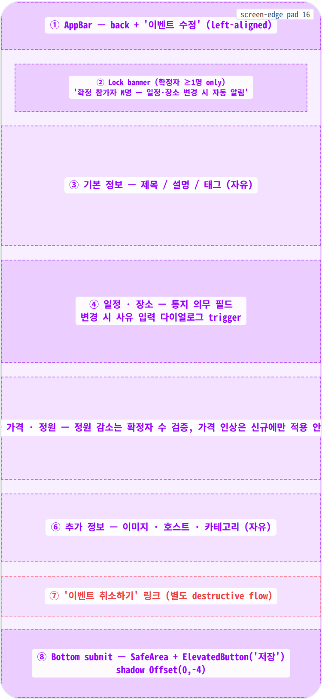
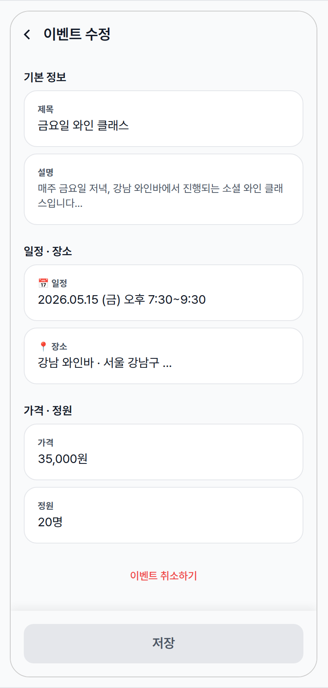
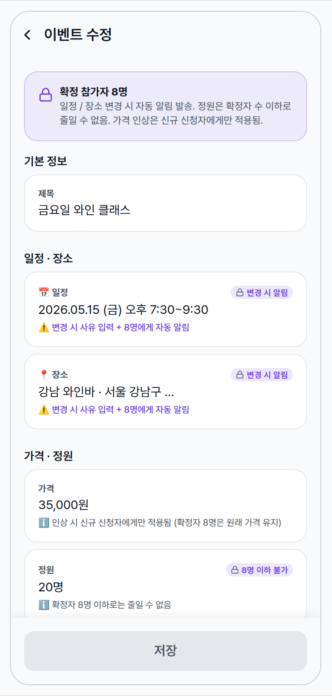
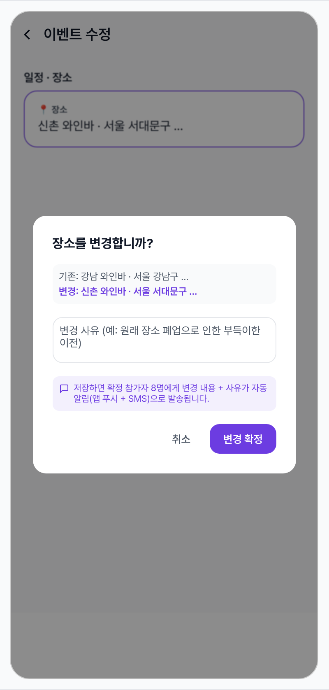
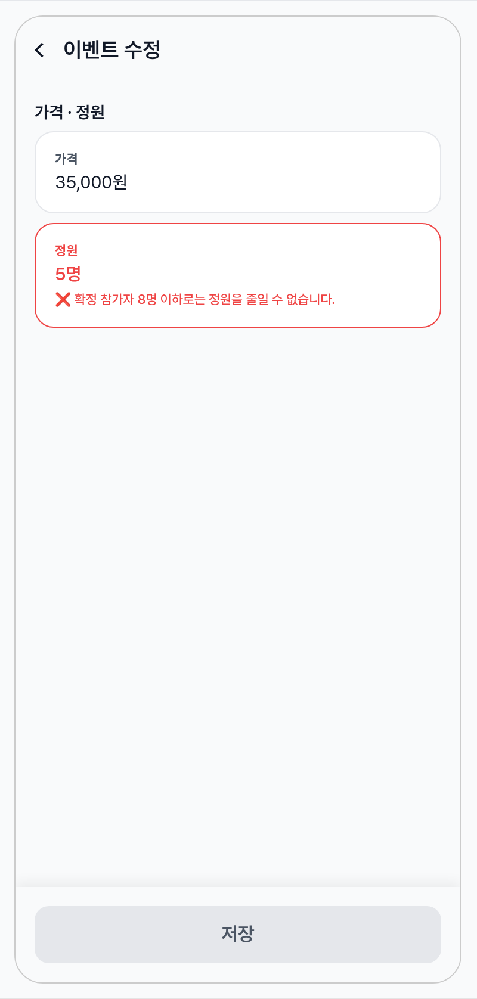
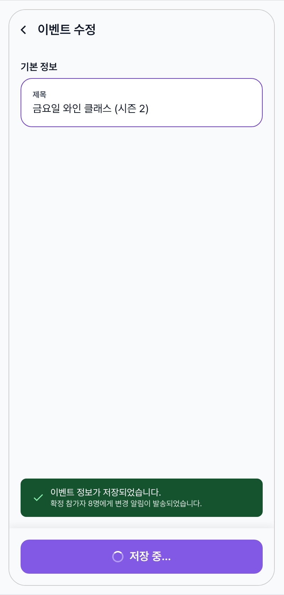

 Spec — EventEditPage (app\_partner · EventEditRoute)  

# Event Edit

## Overview

| Status | 📝 신규작성 — v1 초안 (확정자 0명 / ≥1명 / 변경 사유 다이얼로그 / 정원 감소 검증 / 저장 = 5 state) |
|---|---|
| App | app_partner |
| Category | party · event · edit (existing occurrence) |
| Route / Surface | EventEditRoute · widget: EventEditPage |
| Path | /more/parties/:partyId/events/:eventId/edit |
| Hierarchy | Parent: EventDetailPage (운영 관리 탭의 Hero "일정" 영역 탭 시 진입)Children: — (이벤트 취소 진입 시 별도 destructive flow — 본 spec 범위 밖) |
| Purpose | 파트너가 기존 이벤트의 정보를 수정한다. 확정 참가자(승인 또는 결제 완료) 수에 따라 필드별 잠금 정책이 적용되며, 통지 의무가 있는 필드(일정·장소)는 변경 시 사유 입력 + 자동 알림 발송이 강제된다. 확정자 0명일 때는 모든 필드 자유 수정 가능. |
| User journey | Entry points: 이벤트 상세(EventDetailPage)의 Hero "일정" 영역 탭.Exit points: 저장 성공 → 화면 닫히며 EventDetailPage로 복귀, 성공 snackbar 노출. 일정/장소 변경 시 → 알림 발송 안내 snackbar 추가. 뒤로가기 → 변경사항 있으면 confirm 다이얼로그 + "변경사항을 버리시겠습니까?", 없으면 즉시 닫힘. 이벤트 취소 → 본문 하단 "이벤트 취소하기" 텍스트 링크 → 별도 destructive flow. |
| Background | EventCreateRoute(신규 회차 생성)와 분리한 이유: 수정 흐름은 "확정 참가자 보호 + 통지 의무"라는 다른 도메인 규칙을 가진다. 가격 인상 시 신규 신청자만 새 가격이 적용되고 확정자는 원래 가격이 유지되는 등 DB 레벨 정책이 별도로 동작하며, UI는 이를 명시적으로 안내한다. 잠금 매트릭스의 단일 진실은 본 spec — 운영자 화면 / 이메일 안내 / SMS 알림이 모두 같은 정책을 참조한다. |
| Frequency | 이벤트당 평균 1~3회. 주 케이스: 만든 직후 오타·정보 보강(다수), 가격·정원 미세 조정(중), 확정자 발생 후 긴급 일정·장소 변경(소수, 통지 의무 발생). |

## History

이 spec의 주요 변경 이력. 최신 항목 위.

| 날짜 | 버전 | 변경 사항 |
|---|---|---|
| 2026-05-03 | v1 (initial) | 초안 작성. 확정자 0명/≥1명 두 모드 + 일정·장소 변경 사유 다이얼로그 + 정원 감소 검증(확정자 수 ≥ 새 정원이면 인라인 에러) + 가격 인상 시 "신규 신청자만 적용" 안내 + 저장 성공 시 EventDetailPage로 복귀. |

🧱

## Layout

화면 구조 — 영역, 정렬, 간격 규칙. 색·타이포 무시.

## Blueprint & tree

`Scaffold` — AppBar(title only, 좌측 정렬) + body(SingleChildScrollView with form sections) + bottom Container(SafeArea + ElevatedButton "저장"). TabBar 없음 — 단일 스크롤 폼. 확정자 ≥1명이면 body 최상단에 **잠금 안내 배너**가 추가되며 일정·정원·가격 필드에 lock chip이 붙는다.

**Scaffold** ├─ **appBar**: **AppBar** ← ① │ ├─ leading: BackButton (auto · onPressed: confirm-if-dirty) │ └─ title: Text('이벤트 수정') · centerTitle: false ├─ **body**: `MinglitAsyncValueWidget<Event>` │ ├─ loading: `MinglitCircularProgressIndicator` │ ├─ error: Centered text ('이벤트 로드 실패') │ └─ data: **SingleChildScrollView** │ └─ Column \[ │ ├─ if confirmedCount >= 1: ← ② │ │ **\_LockBanner**(confirmedCount, │ │ locked: \['일정', '장소'\], │ │ constrained: \['정원', '가격 인상'\]) │ ├─ _Section "기본 정보"_ ← ③ │ │ ├─ **\_TextField**(label: '제목', maxLines: 1, │ │ │ unlocked: 항상) │ │ ├─ **\_TextField**(label: '설명', maxLines: 6, │ │ │ unlocked: 항상) │ │ └─ **\_TagsInput**(label: '태그', unlocked: 항상) │ ├─ _Section "일정 · 장소"_ ← ④ │ │ ├─ **\_DateTimeField**(label: '일정', │ │ │ onChange: _if confirmed≥1 → showReasonDialog_) │ │ └─ **\_LocationField**(label: '장소', │ │ onChange: _if confirmed≥1 → showReasonDialog_) │ ├─ _Section "가격 · 정원"_ ← ⑤ │ │ ├─ **\_PriceField**(label: '가격', │ │ │ hint: '인상 시 신규 신청자만 적용') │ │ └─ **\_CapacityField**(label: '정원', │ │ validator: _newCapacity >= confirmedCount_) │ ├─ _Section "추가 정보"_ ← ⑥ │ │ ├─ **\_ImagePicker**(unlocked: 항상) │ │ ├─ **\_HostInfoFields**(unlocked: 항상) │ │ └─ **\_CategoryDropdown**(unlocked: 항상) │ └─ **\_CancelEventLink**('이벤트 취소하기') ← ⑦ │ · onTap: push EventCancelRoute (별도 flow) │ \] └─ **bottomNavigationBar**: **Container**(shadow -4) ← ⑧ └─ **SafeArea** └─ **ElevatedButton**( onPressed: _!isDirty || isLoading ? null : \_submit_, child: isLoading ? '저장 중...' : '저장')

## Spacing & alignment rules

| # | Region | Alignment | Spacing / tokens |
|---|---|---|---|
| ① | AppBar | title left-aligned · 56px · back btn 좌측 | centerTitle: false · h-pad spacing-screen-edge · bg color-surface |
| ② | Lock banner | full-width inside screen-edge · row(icon + body) crossAxis start | margin top spacing-medium · margin h spacing-screen-edge · padding spacing-medium all · bg color-primary @ 8% · border 1px color-primary @ 25% · radius radius-card |
| ③④⑤⑥ | Form section | section header(좌측 라벨) + 카드 stack 수직 배치 | 섹션 헤더 padding: spacing-medium screen-edge / spacing-small bottom · 카드 사이 spacing-small (8) · 섹션 사이 spacing-large (24) |
| — | Form field card | full-width with screen-edge h-margin · column(label / value / hint) | padding spacing-medium all · radius radius-card · border 1px color-divider · bg color-background · 잠금 시 opacity 0.7 + bg dim · 변경 감지 시 border color-primary 1.5px |
| — | Lock chip (필드 우측) | row trailing · label 같은 줄 | padding 2px 6px · bg color-primary @ 12% · color color-primary · radius radius-small · font-size 10px w600 · gap 3px (icon + text) |
| ⑦ | Cancel link | centered · 단독 한 줄 | margin top spacing-large / margin h spacing-screen-edge · color color-error · font-size 13px · w500 · padding spacing-small |
| ⑧ | Bottom submit | SafeArea + Padding(spacing-medium) · button 풀폭 | Container shadow Offset(0,-4) blur 10 alpha tintFill · button height 48 · radius radius-button · isDirty \|\| isLoading 아닐 때 color-divider bg + secondary text (disabled tone) |
| — | Reason dialog | centered overlay · max-width 320 · column gap spacing-medium | overlay bg rgba(0,0,0,0.45) · dialog padding spacing-large · radius radius-card · before/after row bg color-surface radius radius-small padding spacing-small |

🎨

## States

시각 변형 5종. baseline = 확정자 0명, 나머지는 추가 조건 또는 사용자 액션에 따른 분기.

**State 식별 기준**: (1) 확정 참가자 수 — 0명이면 모든 필드 자유 수정, ≥1명이면 잠금 배너 + 일정·장소·정원 잠금 정책 발동. (2) 사용자 액션 — 일정/장소 값 변경 시 사유 입력 다이얼로그 등장, 정원 감소 시 확정자 수 미달이면 인라인 에러, 저장 시 진행/성공/실패. 이 화면은 항상 _기존 이벤트 수정_ 흐름이며 신규 생성 모드는 없다([EventCreatePage](/specs/event_create_page/index.html)가 별도 담당).

### State 1 · 확정자 0명 (baseline) 🎯 default · 모든 필드 자유 수정

| 항목 | 내용 |
|---|---|
| 조건 | 이벤트 데이터 로드 완료 · 확정 참가자(approved 또는 paid) 0명 · 변경된 필드 없음. |
| 사용자 액션 | · 모든 필드 자유 수정 — 일정·장소·정원·가격 모두 잠금 배너 / lock chip 없이 직접 편집 가능· 저장 버튼은 dirty(변경 감지) 전까지 disabled, 1개라도 변경되면 활성· 저장 탭 → API 성공 후 EventDetailPage로 복귀 + "이벤트 정보가 저장되었습니다" snackbar· 뒤로가기 → dirty 없으면 즉시 닫힘 |
| 에지케이스 | · 이벤트 로드 실패 → body 자리에 에러 텍스트 + retry 버튼· 동시에 다른 운영자가 같은 이벤트 수정 → 저장 시 충돌 감지 → 별도 안내 (재로드 권장) |
| 컴포넌트 | Scaffold · AppBar(left title) · SingleChildScrollView · MinglitAsyncValueWidget<Event> · _TextField · _DateTimeField · _LocationField · _PriceField · _CapacityField · _ImagePicker · _CancelEventLink · 하단 ElevatedButton |
| 토큰 | color-primary(partner #6c3ce1 — 저장 버튼 / 변경 감지 border) · color-text-primary(field value) · color-text-secondary(label / hint) · color-divider(field border) · color-surface(scaffold) · color-background(field card bg) · color-error(취소 링크) · radius-card (16) · radius-button (12) · spacing-screen-edge (16) · spacing-medium (16) · spacing-small (8) · typography 11px w700(label) / 15px(value) / 11px(hint) |
| 노트 | 📝 가장 깔끔한 상태 — 신규 이벤트 직후 또는 신청자가 한 명도 없는 시점. 운영자는 이때 가능한 한 모든 정보를 마무리하는 게 권장된다. |

### State 2 · 확정자 ≥1명 restricted · 잠금 배너 + 일정·장소·정원·가격에 lock chip / 검증

| 항목 | 내용 |
|---|---|
| 조건 | 이벤트 데이터 로드 완료 · 확정 참가자(approved 또는 paid) ≥1명 · 아직 변경된 필드 없음. |
| 사용자 액션 | · 제목 / 설명 / 태그 / 이미지 / 호스트 / 카테고리 수정 → 자유 (잠금 표시 없음)· 일정 또는 장소 변경 시도 → State 3 (사유 입력 다이얼로그)로 이동· 정원을 확정자 수 이하로 변경 → State 4 (인라인 에러)· 가격 인상 → 자유 (단 hint 텍스트로 "신규 신청자만 적용" 안내)· 저장 → State 5 (성공 / 실패 처리) |
| 에지케이스 | · 잠금 배너 텍스트는 확정자 수에 따라 동적 ("확정 참가자 N명") · maxLines 2까지 줄바꿈· lock chip은 라벨이 길어지면 라벨 ellipsis 후 chip은 그대로 우측 노출· 이벤트 시작 24시간 전부터는 일정 변경 자체 차단 (banner 톤이 빨강으로 강조 — 별도 변형으로 추후 spec) |
| 컴포넌트 | State 1 + _LockBanner(confirmedCount, locked, constrained) · _LockChip(label · variant: '변경 시 알림' / 'N명 이하 불가') · _FieldHint(variant: warn / info / error) |
| 토큰 | 추가: color-primary @ 8%(banner bg) / @ 25%(banner border) / @ 12%(lock chip bg) · radius-small (8)(lock chip / hint pill) · 11px w500(hint warn) / 11px(hint info) · 10px w600(lock chip text) |
| 노트 | 🔒 핵심 변형. 잠금 배너 + lock chip + hint 텍스트 3중으로 잠금 정책을 명시 — 운영자가 어떤 필드가 왜 제약되는지 읽지 않고도 알 수 있어야 함. |

### State 3 · 변경 사유 입력 다이얼로그 modal · 일정 또는 장소 값 변경 직후 자동 등장

| 항목 | 내용 |
|---|---|
| 조건 | State 2(확정자 ≥1명) · 사용자가 일정 또는 장소 필드를 새 값으로 바꾼 직후. 다이얼로그가 즉시 등장하며 다른 영역은 dim + blur 처리. |
| 사용자 액션 | · 변경 사유 입력 → 다이얼로그 textarea에 1~200자. 비어있으면 "변경 확정" disabled· 변경 확정 탭 → 다이얼로그 닫힘 + 필드는 변경 감지(border color-primary) 상태 유지 + 사유는 폼 state에 보관 (저장 시 함께 전송)· 취소 탭 → 다이얼로그 닫힘 + 필드 값 원래대로 롤백 + 변경 감지 해제· 오버레이 외곽 탭 → "취소"와 동일 동작 |
| 에지케이스 | · 일정과 장소를 동시에 바꾸려는 경우 → 두 다이얼로그를 동시에 띄우지 않음. 첫 변경 후 닫힌 뒤 두 번째 필드 변경 시 두 번째 다이얼로그 등장 (순차 처리)· 변경 후 다시 원래 값으로 되돌리면 → 다이얼로그 안 뜨고 변경 감지 해제· 사유 입력 도중 키보드 dismiss 시 textarea 포커스만 해제 — 다이얼로그는 유지 |
| 컴포넌트 | showDialog · AlertDialog 또는 Dialog custom child · _BeforeAfterRow · TextField(maxLines: 3, maxLength: 200) · _NoticeBanner(앱 푸시 + SMS 안내) · 액션 row(취소 · 변경 확정) |
| 토큰 | overlay bg rgba(0,0,0,0.45) · dialog bg color-background · radius radius-card · padding spacing-large (24) · before/after pill bg color-surface · 변경된 값 텍스트 color-primary w600 · notice banner bg color-primary @ 8% · primary action color-primary |
| 노트 | 📣 통지 의무를 시각적으로 강제하는 핵심 다이얼로그. before/after를 명시해 운영자가 자기가 무엇을 바꿨는지 한 번 더 확인하도록 유도. 사유 텍스트는 알림 본문에 그대로 인용된다. |

### State 4 · 정원 감소 검증 실패 inline-error · 정원을 확정자 수 이하로 입력 시

| 항목 | 내용 |
|---|---|
| 조건 | State 2(확정자 ≥1명) · 사용자가 정원을 confirmedCount(예: 8) 이하 값으로 입력. 검증은 입력값 onChange 시 즉시 실행 (debounce 200ms). |
| 사용자 액션 | · 정원을 confirmedCount 이상 값으로 정정 → 인라인 에러 사라짐 + 변경 감지 색만 유지 + 저장 가능· 정원을 원래 값(원본)으로 되돌림 → 변경 감지 해제 (저장 disabled로 복귀)· 저장 시도 → 인라인 에러 있는 동안 저장 버튼은 disabled — 탭해도 동작 X· 다른 필드 수정 → 정원 검증과 무관하게 가능 (단, 저장은 모든 필드가 valid해야 활성) |
| 에지케이스 | · 확정자 수가 도중에 바뀌어도 (다른 운영자 승인 동시 진행) 폼 state는 진입 시점 confirmedCount 기준 — 저장 시 서버에서 재검증 + 충돌 시 안내· 정원을 0으로 비우면 → "정원을 입력해주세요" 다른 톤 에러· 숫자 외 문자 입력은 키보드 number-only로 차단 |
| 컴포넌트 | _CapacityField(confirmedCount, validator) · _FieldHint(variant: error) · field card border 색이 color-error로 전환 · 라벨 / 값 색도 동일 톤 |
| 토큰 | field error border color-error 1.5px · field error bg 그대로(color-background) · 라벨/값 color-error · hint color-error w500 11px · 저장 버튼은 color-divider bg + color-text-secondary 텍스트(disabled tone) |
| 노트 | ⚠️ 클라이언트 검증은 빠른 피드백용. 서버 검증이 단일 진실 — race condition 가능성 때문에 저장 응답에서도 같은 검증을 반드시 수행하고 실패 시 snackbar로 안내한다. |

### State 5 · 저장 진행 → 성공 submit · 저장 버튼 탭 후 EventDetailPage 복귀까지

| 항목 | 내용 |
|---|---|
| 조건 | 저장 버튼 탭 → API 호출 진행. 일정/장소가 변경됐으면 사유 + 알림 발송 트리거 함께. 성공 응답 후 EventDetailPage로 복귀하면서 success snackbar 노출. |
| 사용자 액션 | · 로딩 중 → 저장 버튼이 spinner + "저장 중..." 으로 전환, 다른 필드는 read-only로 일시 잠김 (포커스 빠짐)· 성공 → 본 화면 자동 close + 부모(EventDetailPage)의 데이터 invalidate + success snackbar 3.5초 노출· 일정/장소 변경 포함이면 snackbar 본문에 "확정 참가자 N명에게 알림 발송" 부가 텍스트 추가· 실패 → 화면 유지 + error snackbar (서버 메시지 그대로 또는 "저장에 실패했어요. 잠시 후 다시 시도해주세요.")· 네트워크 끊김 → 동일하게 실패 snackbar + 폼 state 유지 (재시도 가능) |
| 에지케이스 | · 저장 도중 뒤로가기 → 막힘 (loading 상태에선 back 무시 + 가벼운 진동 / 흔들림 hint)· 서버 검증 실패(예: 정원 race condition) → snackbar에 사유 명시 + 폼은 유지 + 해당 필드에 인라인 에러 표시· 알림 발송 자체는 서버 비동기 — 응답엔 "발송 큐에 적재됨"까지만 확인. snackbar 메시지는 그 가정 위에서 표현 |
| 컴포넌트 | ElevatedButton(loading variant) · btn-spinner · SnackBar(showMinglitSuccess / showMinglitError) · ref.invalidate(eventDetailProvider(eventId)) · Navigator.pop() |
| 토큰 | success snackbar bg #14532d · check icon #86efac · 폰트 13px / 11px(부가 텍스트, opacity 0.85) · 위치 bottom 96 (submit bar 위) · radius radius-small · padding 12 / 16 |
| 노트 | ✅ 사유 입력이 있었던 경우 snackbar 텍스트가 길어진다 → maxLines 2까지 허용. 알림 발송 결과 자체(성공/실패 N명)는 별도 운영자 활동 로그에서 확인 가능 (본 화면 책임 아님). |

🔄

## Global Behavior

모든 state에 동일하게 적용되는 동작 — 잠금 매트릭스, 변경 감지, 알림 정책, 변경 이력.

## 잠금 매트릭스 (필드별 정책)

이 매트릭스가 단일 진실. UI / 서버 검증 / 이메일·SMS 알림 모두 같은 정책을 참조.

| 필드 | 확정자 0명 | 확정자 ≥1명 |
|---|---|---|
| 제목 | 자유 | 자유 |
| 설명 / 안내문 | 자유 | 자유 |
| 이미지 / 태그 / 카테고리 | 자유 | 자유 |
| 호스트 정보 | 자유 | 자유 |
| 가격 (인하) | 자유 | 자유 |
| 가격 (인상) | 자유 | 자유 — DB 레벨에서 신규 신청자만 새 가격 적용 / 확정자는 원래 가격 보호. UI에 hint 안내. |
| 정원 (증가) | 자유 | 자유 |
| 정원 (감소) | 자유 | 새 정원 ≥ 확정자 수여야 허용. 미달 시 인라인 에러 + 저장 disabled (State 4). |
| 일정 (날짜/시간) | 자유 | 변경 사유 입력 다이얼로그 + 자동 알림 (State 3). 사유는 알림 본문에 인용. |
| 장소 | 자유 | 일정과 동일 — 사유 다이얼로그 + 알림. |
| 이벤트 취소 | 자유 (소프트 삭제) | 별도 destructive flow — 본 spec 범위 밖. 일괄 환불 + 취소 안내 알림 발송. |

## 변경 감지 (dirty state)

-   각 필드 컨트롤러는 _원본 값_을 보관. 현재 값이 원본과 다르면 **field card border가 `color-primary` 1.5px**로 강조.
-   필드 1개 이상이 dirty이고 모든 검증이 valid이면 **저장 버튼 활성**.
-   뒤로가기 / 외곽 탭 시 dirty이면 "변경사항을 버리시겠습니까?" 확인 다이얼로그 (Material AlertDialog · 취소 / 버리기).
-   저장 성공 후 폼 state는 즉시 폐기되며 EventDetailPage로 복귀 — 다음 진입 시 서버 fresh fetch.

## 알림 발송 정책

-   일정 또는 장소 변경 + 확정자 ≥1명 → 저장 시 **앱 푸시 + SMS 동시 발송**. 본문은 _"\[이벤트명\] 변경 안내: {필드}이(가) {기존} → {변경}으로 변경되었습니다. 사유: {사유}"_.
-   발송은 서버 비동기 큐 — UI는 "발송 큐에 적재됨" 시점까지만 확인. 실제 전송 결과는 운영자 활동 로그에서 사후 확인.
-   같은 이벤트가 짧은 시간 내(예: 30분) 여러 번 변경되면 알림은 **최신 변경 1건으로 합산** — 운영자가 사유를 묶어서 입력하도록 권장.
-   알림 비용은 운영자 부담 — 변경 사유 다이얼로그에 "발송됨" 안내로 비용 발생을 인지하도록 설계.

## 변경 이력 로그

-   저장 성공 시 `event_change_log` 테이블에 _변경 필드 / 기존 값 / 새 값 / 사유 / 운영자 ID / 시각_을 기록.
-   이력은 운영자 측 별도 화면(향후 spec)에서 조회 가능. 분쟁 시 단일 진실 자료.
-   본 화면은 _이력 작성_ 책임만 — 조회 / 노출은 다른 화면 책임.

🔗

## Reference

관련 라우트 · 화면 · 구현 소스.

## Implementation source

| Route | EventEditRoute |
|---|---|
| Path | /more/parties/:partyId/events/:eventId/edit |
| Widget class | EventEditPage (+ _LockBanner · _LockChip · _DateTimeField · _LocationField · _CapacityField · _PriceField · _TextField internal widgets) |
| App | app_partner |
| Source (예상) | apps/app_partner/lib/src/features/party/event/edit/event_edit_page.dart + apps/app_partner/lib/src/features/party/event/edit/widgets/* |
| Provider | eventDetailProvider(eventId) 로 fresh fetch · 저장은 eventEditCoordinator(eventId) 통해 mutate + invalidate |

## Related screens

| Spec | 관계 |
|---|---|
| EventDetailPage | Parent. Hero "일정" 영역 탭 → 본 화면 push. 저장 성공 시 본 화면 close + parent invalidate. |
| EventCreatePage | Sibling. 신규 회차 생성 흐름 — 본 화면(수정)과 별도. 잠금 정책 / 통지 의무 없음. |
| TicketEditPage | Sibling. 동일 이벤트의 입장권 수정. 본 화면이 다루지 않는 티켓 도메인 — 별도 화면. |
| EventCancelRoute (예정) | Child of "이벤트 취소하기" 링크. 별도 destructive flow — 일괄 환불 + 취소 알림. 본 spec 범위 밖. |
| event_change_log (DB 테이블) | 저장 시 변경 필드 / 사유 / 운영자 ID 기록. 분쟁 시 단일 진실. |