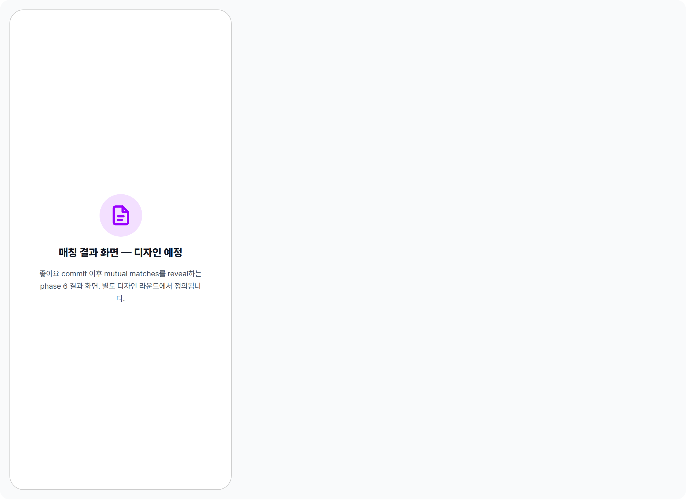

 Spec — EventMatchingResultsScreen (app\_user · EventMatchingResultsRoute · TBD)  

# 매칭 결과 화면 (TBD)

## Overview

| Status | 📝 TBD — 별도 디자인 라운드 예정 |
|---|---|
| App | app_user |
| Category | matching (Phase 6 — results) |
| Route / Surface | EventMatchingResultsScreen · /event/:id/matching/results (예정 · 확정 전) |
| Hierarchy | Parent: MyTicketsPage 또는 EventMatchingScreen phase 전환 진입.Children: — |
| Purpose | 좋아요 commit 이후 매칭 결과(mutual likes)를 reveal하는 화면. 서로 좋아요를 보낸 페어의 연락처를 양쪽에 공개. 본 spec은 stub — 디자인은 별도 라운드에서 진행되며, 본 페이지는 cross-reference 링크 깨짐 방지용. |
| Related spec | 입력 측: EventMatchingScreen — 좋아요 선택 + commit. |

## History

| Date | Version | Author | Changes |
|---|---|---|---|
| 2026-05-03 | 0.1 | mark-yun | Stub 생성 — EventMatchingScreen v2.0의 cross-reference 깨짐 방지. 실제 디자인은 후속 라운드. |

[📝 Placeholder](#placeholder) [🧭 예상 스코프](#scope) [📖 Reference](#reference)

📝

## Placeholder

디자인 미확정 — 본 화면은 후속 디자인 라운드에서 채워집니다.

🧭

## 예상 스코프

디자인 라운드에서 다룰 항목 — 변경 가능.

| 항목 | 설명 |
|---|---|
| 매치 reveal 시퀀스 | Mutual likes 페어를 어떻게 점진적으로 노출할지 — 단순 리스트 vs 한 명씩 reveal vs 카드 flip 등. |
| 연락처 교환 방식 | 인앱 채팅 vs 전화번호 노출 vs SNS 핸들 — privacy / safety 고려. |
| 매치 0건 케이스 | 좋아요는 보냈으나 mutual이 없는 경우의 메시지 톤. |
| 비공개 정보 공개 정책 | EventMatchingScreen에서 "비공개"였던 직업 / 나이를 매치 시 공개할지 여부. |
| 사후 액션 | 리포트 / 차단 / 다시 만남 신청 등 follow-up 액션 노출 위치. |
| 이벤트 종료와의 관계 | 이벤트 종료 직후 자동 진입 vs 사용자가 직접 진입 vs 푸시 알림 후 진입. |

📖

## Reference

Implementation 미정 + 인접 화면.

## Implementation source

| Widget class | — (TBD) |
|---|---|
| File path | — (TBD) |
| Provider | — (TBD) |
| Route | — (TBD) |

## Related screens

| Spec | Relation |
|---|---|
| EventMatchingScreen | Sibling — 좋아요 선택 + commit (입력 단계). 본 화면은 그 결과 단계. |
| MyTicketsPage | 진입 hub — 매칭 종료 이후 결과 진입점이 될 가능성. |
| EventOngoingBanner | Lifecycle hub — phase 5 → phase 6 전환 시 이 화면으로 라우팅 후보. |