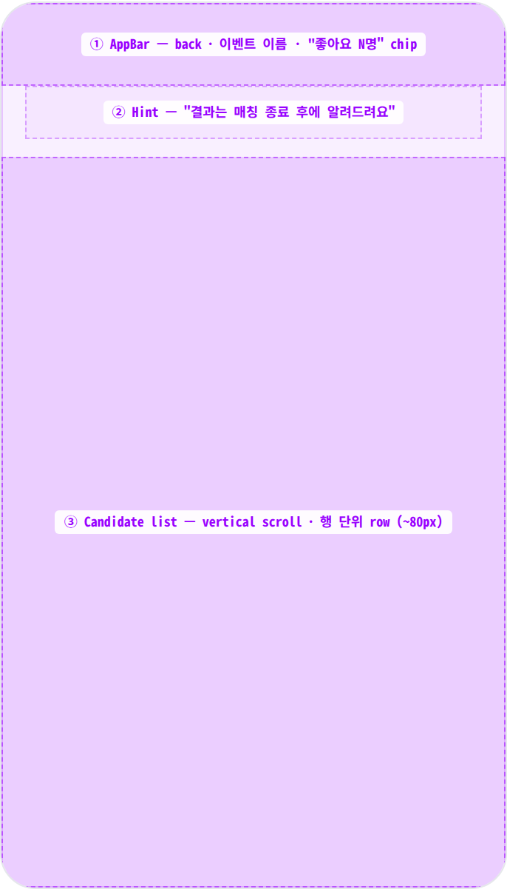
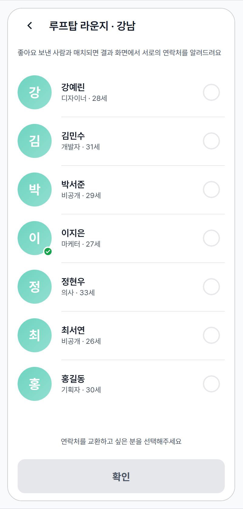
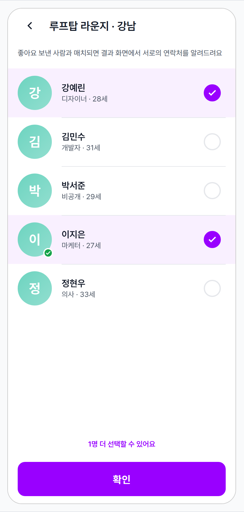
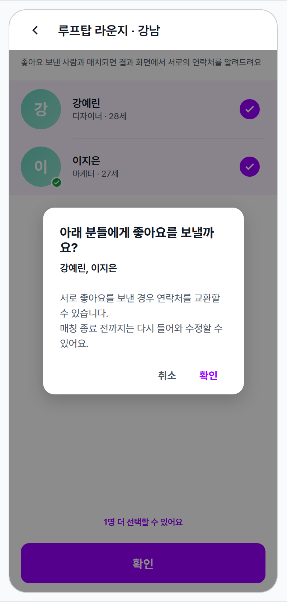
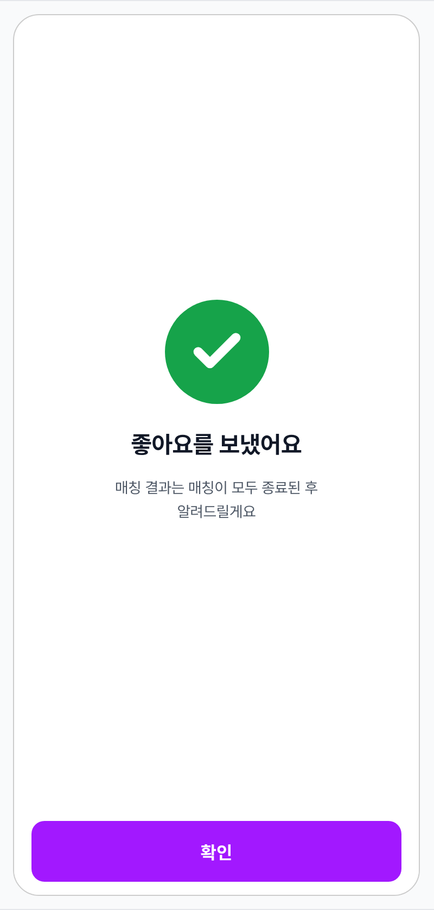
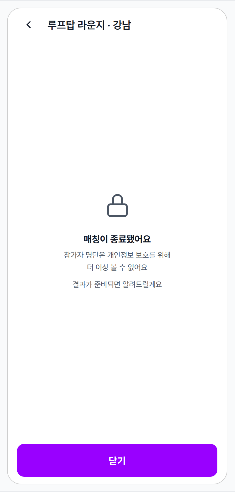
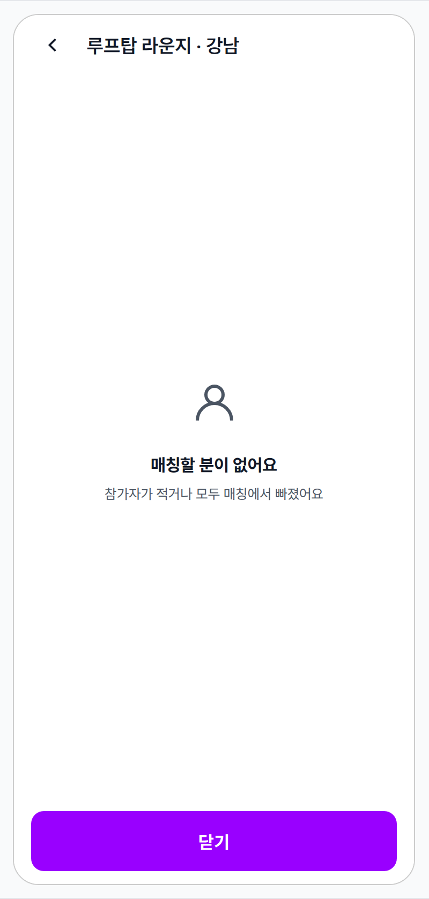
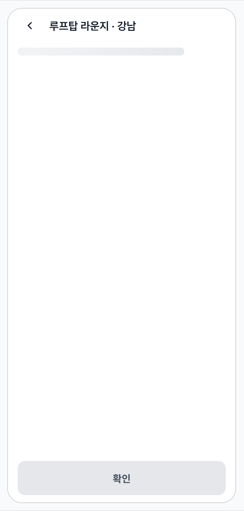

 Spec — EventMatchingScreen (app\_user · EventMatchingRoute)  

# Event Matching Screen

## Overview

| Status | 📐 디자인 진행 중 — v2.0 · 7 state · 풀 화면 페이지 + entry stagger 애니메이션 + Toss-style 성공 화면 + MinglitBottomCta "확인" + confirm dialog + 매칭 완료 privacy state · 결과는 별도 spec |
|---|---|
| App | app_user |
| Category | event · full-screen route · matching |
| Route / Surface | EventMatchingRoute · widget: EventMatchingScreen (Scaffold · 풀 화면) |
| Path | /events/:id/matching |
| Hierarchy | Parent: MyTicketsPage 또는 HomePage — OngoingBanner(matchingReady phase) 또는 EventNowBar(matching 상태)에서 push.Children: — (매치 결과는 별도 화면 — EventMatchingResultsScreen이 phase 6 results에서 진입) |
| Purpose | 이벤트에서 만난 다른 참가자 중 "연락처를 교환하고 싶은 사람"에게 좋아요를 보내는 화면. 풀 화면 페이지에서 후보 리스트(다른 입장 그룹의 참가자만 노출 — 예: 남↔여)를 스크롤하며 기억나는 사람을 찾고, 행 우측 체크 원 탭으로 선택 — 로컬 상태로만 토글, 최대 3명까지 선택 가능. 바텀 CTA "확인" 탭 → confirm dialog(선택한 사람 list 리뷰) → 확인 시 한꺼번에 backend로 commit. 매칭 결과(양방향 매치 reveal)는 매칭이 모두 종료된 후 별도 화면에서 한꺼번에 발표 — 진행 중에는 결과 정보 노출 X (산만함 / 비교의식 방지). |
| User journey | Entry points: ① OngoingBanner matchingReady phase에서 "매칭 시작하기" 탭 → push. ② EventNowBar가 matching 상태일 때 탭(재진입 — 좋아요 추가/취소).Exit points: AppBar back 또는 시스템 back → 진입 surface(MyTicketsPage / HomePage) 복귀. OngoingBanner는 좋아요 ≥1개면 phase 5 matching("결과 대기"), 0개면 phase 4 matchingReady 유지(pulse 계속). |
| Background | v1.0(2열 grid + "선택" 버튼 + 매치 banner)은 product 쇼핑 톤 + 진행 중 결과 노출로 산만 + "투표" 용어가 emotional moment에 안 어울림. v2 첫 시안(단일 카드 carousel)은 "찾기" mental model에 안 맞음 — 사용자가 이미 만난 사람을 빠르게 스캔해 좋아요만 토글하면 되는 상황. 한 명씩 풀카드는 과대 + 느림. v2 두 번째 시안(88% bottom sheet + 리스트)도 시트 폼이라 가벼움 — 매칭은 이벤트의 클라이맥스라 dismiss 가능한 sheet보다 풀 화면 페이지가 무게감 적합. 최종 v2: 풀 화면 페이지 + 행 단위 좋아요 토글. AppBar(back + 이벤트 이름 + 좋아요 카운터) + hint line + scroll list. 사용자가 이벤트에서 만난 얼굴을 떠올리며 빠르게 스캔 → 우측 하트 버튼 탭 1번이면 좋아요 끝. 카드 minimal(avatar + 이름 + meta) — 사진 / 직업 / 나이 같은 풍부한 정보가 없어도 동작 가능. |
| Frequency | 이벤트당 1단계. 한 번 들어가서 끝까지 스캔하고 닫음 — 재진입은 좋아요 추가 / 취소 시 (드물다). |

## History

이 spec의 주요 변경 이력. 최신 항목 위.

| Date | Version | Author | Changes |
|---|---|---|---|
| 2026-05-03 | 2.0 | mark-yun | 전면 재정의. (1) bottom sheet → 풀 화면 페이지, (2) 2열 grid → vertical 리스트(행 단위 row), (3) "선택" 버튼 per row + 확정 dialog → 행 우측 체크 원(28px round) 로컬 토글 + 바텀 CTA "확인" + confirm dialog batch commit, (4) 최대 3명 선택 제약, (5) 입장 그룹 필터링 — 같은 그룹(예: 남↔여) 외 참가자만 list에 노출 (백엔드 처리), (6) AppBar trailing chip 제거 — 카운트 강조는 CTA 위 안내 텍스트로 (3 conditions: 0명 / 1-2명 더 / 3명 도달), (7) 매치 banner 제거 → 결과는 별도 EventMatchingResultsScreen으로 분리, (8) Dialog body — 선택한 이름 list + "서로 좋아요시 연락처 교환 가능" + "수정 가능 안내" 3 단락 + MinglitAlert.showConfirm 표준 컴포넌트 사용, (9) 색 체계: avatar 민트(color-tertiary #48c9b0) — identity 자리만, 체크 + 선택 row tint + CTA + hint strong 모두 보라(color-primary #9900ff)로 통일 — selected / primary action 시그널 일관, (10) "투표" 용어 → "좋아요" / "선택"으로 정리, (11) Loading copy "참가자 명단을 불러오고 있습니다". State 5 → 7 (Default · Selecting · Confirm Dialog · Submitted (Toss-style 성공 화면) · Ended (list 비공개) · Empty · Loading skeleton). + 핵심 CUJ 애니메이션: (a) entry stagger — skeleton → 실제 list swap 시 row staggered fade-up (50ms 간격 · cubic-bezier 0.22, 1, 0.36, 1). (b) row 선택 시 bg tint fade-in (240ms ease) + 체크 원 scale-bounce (320ms cubic-bezier 0.34, 1.56, 0.64, 1). (c) Submitted culmination — success 초록 circle scale-bounce(450ms) + check stroke 손글씨 효과 draw(520ms · stroke-dasharray 트릭 · 320ms delay) + 텍스트/CTA stagger fade-up(880/980/1120ms delay) · 약 1.5초 sequence. |
| 2026-04-28 | 1.0 | mark-yun | v1.4 template으로 작성. 5 state · 2열 grid · 매치 banner · "선택" 버튼 + 확정 dialog · 88% bottom sheet 구조. |

[🧱 Layout](#layout) [🎨 States](#states) [🔄 Global Behavior](#behavior) [📖 Reference](#reference)

🧱

## Layout

풀 화면 Scaffold — AppBar(back + title + counter trailing) / hint line / 후보 list / 바텀 CTA "확인 (N명)" 4 region. dirty 시 CTA enabled · 탭 → confirm dialog.

## Blueprint & tree

Scaffold + AppBar(left back · title 이벤트 이름 · trailing 좋아요 카운터 chip) + body(hint line + scroll list) + 바텀 CTA "확인 (N명)". row는 avatar 56 + 이름 + meta + 우측 하트 버튼 — minimal하지만 한눈에 스캔 가능한 row(약 80px). 좋아요한 row는 옅은 primary tint bg + 채워진 하트로 시각 구분. hint 1줄("좋아요 보낸 사람과 매치되면 결과 화면에서 서로의 연락처를 알려드려요") — 결과 미리보기 안 하는 이유 명시. **좋아요는 로컬 상태로만 관리** — 바텀 CTA "확인" 탭 → confirm dialog → "보내기" 시 backend로 batch commit.

**Scaffold** └─ **AppBar** ← ① │ ├─ leading: _Icons.arrow\_back_ (← system back) │ ├─ title: 이벤트 이름 (_App bar title token_ · 1줄 ellipsis) │ └─ trailing: _Counter chip_ │ · "좋아요 N명" · 13/700 │ · 0개: surface bg + secondary text │ · ≥1개: primary 10% tint bg + primary text │ └─ body ├─ _Hint line_ ← ② │ · "좋아요 보낸 사람과 매치되면 결과 화면에서 서로의 연락처를 알려드려요" │ · 12/secondary · h-padding screen-edge · v-padding small/medium │ ├─ _Candidate list (flex: 1)_ ← ③ │ └─ `ListView` · vertical scroll │ └─ **MatchingRow** × N │ ├─ Avatar 56×56 (사진 또는 이니셜+gradient) │ │ └─ verified badge 16px 우하단 (본인인증 완료 시그널 · 모든 후보 universal 노출) │ ├─ Body (flex) │ │ ├─ name (15/600 · 1줄) │ │ └─ meta (12/secondary · 직업·나이 · placeholder if 없음) │ └─ Like button trailing │ · 44×44 round · heart icon 24 │ · default: outline gray · liked: filled primary │ · 탭 시 **로컬** 토글 (backend 호출 X) │ _· 좋아요한 row: primary 6% tint bg_ │ _· row 사이 hairline 0.5px (avatar+gap 다음 indent: 72px)_ │ └─ [_MinglitBottomCta_](/components#MinglitBottomCta)(single) ← ④ · Scaffold.bottomNavigationBar slot · 풀폭 · 56px · radius-button · primary fill · 라벨: "확인" · onPressed null (=0명 선택 시): disabled · divider bg + secondary text · 탭 → confirm dialog 노출 (state 2) · 상단 0.5px outlineVariant · safeArea / 키보드 자동 처리

| # | Region | Alignment | Spacing |
|---|---|---|---|
| — | Scaffold 외부 | 풀 화면 · color-background bg | safeArea bottom 자동 처리 |
| ① | AppBar | back 좌 · title 좌 · counter chip 우 | height 56 · h-padding spacing-screen-edge · sticky · border 없음 (scaffold bg와 동일) |
| ② | Hint line | 좌 정렬 | v-padding spacing-small top / spacing-medium bottom · h-padding spacing-screen-edge · 12/secondary · 1줄 |
| ③ | Candidate list | vertical scroll · flex: 1 | row v-padding 12 / h-padding spacing-screen-edge · row 사이 hairline 0.5px (indent: 72px = avatar 56 + gap 16) |
| ④ | Bottom CTA (MinglitBottomCta single 변형) | 풀폭 · 56px button · Scaffold.bottomNavigationBar slot | v-padding 12px(spacing-sm) · h-padding spacing-screen-edge · 상단 0.5px outlineVariant border · radius-button(12px) · 0명 선택 시 disabled (onPressed: null + divider bg + secondary text) · SafeArea 자동 처리 (Flutter) |

## MatchingRow sub-anatomy

행 단위 row는 minimal — avatar + 이름 + meta + 하트. 좋아요 toggle 시 row bg + 하트 아이콘 변화로 시각 구분. 사진 / 직업 / 나이 같은 풍부한 정보는 별도 프로필 필드 확장 issue로 분리.

| Region | Alignment | Notes |
|---|---|---|
| Avatar (leading) | 좌측 · 56×56 원형 | 사진 있으면 NetworkImage · 없으면 이니셜 + linear-gradient(primary 60% → 30%) · 22/700 흰 글자 · verified badge 우하단 16px circle (success bg + check icon · 2px background-tone 테두리로 cutout 효과) — 본인인증 완료 시그널 · universal로 노출(매칭 candidate는 모두 본인인증을 통과한 상태이므로 정보 가치보다 시각적 신뢰 시그널로 활용) |
| Body (flex) | 중간 · vertical column · gap 2 | name 15/600 · 1줄 ellipsis. meta 12/secondary · 1줄 ellipsis · 데이터 없으면 placeholder italic 톤 |
| Like button (trailing) | 우측 · 44×44 round | icon-only ♡(24) · default outline gray · liked filled primary · 탭 즉시 toggle · 확정 dialog 없음 |
| Row bg | — | 기본: transparent · 좋아요한 row: primary 6% tint · row 사이 hairline 0.5px (avatar+gap 다음 indent 72px) |

🎨

## States

7가지 변형 — Default(0명 · disabled CTA) · Selecting(1~max · enabled · 재진입 포함) · Confirm Dialog · Submitted(전송 완료 · Toss-style success) · Ended(매칭 종료 · list 비공개) · Empty · Loading(skeleton). baseline = Default. 선택 상태는 행 단위 variant.

**State 식별 기준**: ① 데이터 로드(loading) → ② 후보 0명(empty) / 후보 ≥1명(default). 좋아요 / 미좋아요는 각 row 단위 variant — 같은 list 안에 mixed. Error는 표준 `MinglitAsyncValueWidget`이 처리(snackbar / retry).

### Default · 후보 리스트 🎯 baseline · 진입 직후 0명 선택 · CTA disabled

| 항목 | 내용 |
|---|---|
| 조건 | 매칭 phase 진입(matchingReady 또는 matching) · 같은 입장 그룹의 다른 그룹(예: 남↔여) 참가자만 후보로 노출 · 후보 ≥1명. baseline = 진입 직후 0명 선택 상태 — CTA disabled · 안내 default 톤. 사용자가 첫 row를 체크하면 즉시 Selecting state로 transition. 최대 3명까지 선택 가능. 리스트는 가나다순 정렬. |
| 사용자 액션 | ① row 우측 체크 원 탭 — 로컬 toggle (체크 채워짐 + row bg primary 6% tint fade-in + bounce + CTA 위 안내 텍스트 갱신). backend mutation은 아직 X.② 3명 도달 시 추가 탭 — 무시 + snackbar "최대 3명까지 선택할 수 있어요". 이미 선택된 사람은 자유롭게 취소 가능.③ 바텀 CTA "확인" 탭 — 1명 이상 선택 시 enabled · confirm dialog 노출. 0명이면 disabled.④ list 스크롤 — 추가 후보 노출.⑤ AppBar back / 시스템 back — 선택 dirty 상태(commit 안 한 변경)면 confirm dialog "저장 안 된 선택이 있어요. 그래도 나가시겠어요?" 노출. |
| 에지케이스 | · 후보 많음(20+): list scroll로 자연스럽게 처리.· 같은 사용자 row 다시 탭 → 선택 취소 (idempotent).· 입장 그룹 분리 — backend가 본인과 같은 그룹은 list에서 제외 (프라이버시 + 매칭 의도).· 매칭 마감 후 진입 시 자동으로 Ended state로 라우팅. |
| 컴포넌트 | · Scaffold + AppBar(back · 이벤트 title only — trailing chip 없음)· Hint line — 결과 미리 안 보여주는 이유 명시· ListView · vertical scroll · expanded body· MatchingRow × N (avatar + body + check toggle 28px round)· CTAHint — CTA 위 안내 텍스트 (3 conditions)· MinglitBottomCta(single 변형) — "확인" · 0명 선택 시 onPressed: null(=disabled)· 선택은 로컬 상태로만 관리 — backend mutation은 confirm dialog 확인 시 batch upsert |
| 토큰 | · color: color-background(scaffold bg · default row bg · AppBar bg), color-text-primary(name · AppBar title), color-text-secondary(meta · hint default · 빈 체크 border), color-tertiary = 민트 #48c9b0(avatar gradient — 60-80% with white), color-primary = 보라 #9900ff(선택된 row 6% tint bg · 채워진 체크 fill · CTA hint strong 톤 · CTA primary fill button), color-divider(row hairline · 빈 체크 border · CTA disabled bg), color-success(verified badge), color-warning(매칭 종료 banner)· radius: 50%(avatar · check 외곽 button · check 내 원), radius-button(CTA button)· spacing: spacing-screen-edge(h-padding), spacing-medium(avatar↔body gap · hint v-padding bottom), spacing-small(hint v-padding top), 12px(row v-padding · CTA v-padding)· typography: AppBar title token, hint(12), avatar initial(22/700), name(15/600), meta(12), CTA(16/700) |
| 노트 | 📝 mockup은 7명 리스트 가나다순 정렬 (강·김·박·이·정·최·홍). 각 사용자는 직업·나이 노출 — 직업 비공개 케이스(박서준 · 최서연) 포함. 본인이 이벤트에서 만난 얼굴을 기억하므로 이름만으로도 결정 가능 + 직업/나이가 추가 단서.CTA 위 안내 (3 conditions):· 0명 선택: "연락처를 교환하고 싶은 분을 선택해주세요" (secondary 톤)· 1~2명 선택 (max=3): "N명 더 선택할 수 있어요" (strong primary 톤)· 3명 선택 (=max): "선택하신 분들과 연락처를 교환하시고 싶으시면 확인 버튼을 눌러주세요" (strong primary 톤) |

### Selecting · 선택 중 1명 이상 선택 — CTA enabled · hint strong 톤 · 재진입 케이스 포함

| 항목 | 내용 |
|---|---|
| 조건 | Default(0명)에서 사용자가 1명 이상 ~ 최대 미만 선택한 상태. CTA enabled(primary fill), hint strong 톤("N명 더 선택할 수 있어요"), 선택된 row tint bg + 채워진 체크. 매칭 진행 중 가장 흔히 머무는 상태. 재진입 케이스: 이미 commit한 선택이 있으면 이 state로 진입(서버 데이터 로드 시 선택 row 미리 체크) — 사용자는 추가/취소 후 재commit 가능, 매칭 종료 시점까지. |
| 사용자 액션 | ① 다른 row 체크 토글 — 추가 선택 / 취소 (로컬 상태). hint 카운트 갱신.② 3번째 체크 토글 — 선택 max 도달 시 hint copy 변경 ("선택하신 분들과 연락처를 교환하시고 싶으시면 확인 버튼을 눌러주세요"). 4번째 시도 시 무시 + snackbar.③ 모든 선택 취소 → Default(0명) state로 돌아감 (CTA disabled · hint default 톤).④ CTA "확인" 탭 → Confirm Dialog state로 전환.⑤ AppBar back: dirty 상태 보호 dialog 노출. |
| 에지케이스 | · 1명 선택 (min): hint "2명 더 선택할 수 있어요" · CTA enabled.· 3명 선택 (=max): hint "선택하신 분들과 연락처를 교환하시고 싶으시면 확인 버튼을 눌러주세요" · CTA enabled.· 4번째 체크 시도: 무시 + snackbar "최대 3명까지 선택할 수 있어요" · 기존 선택 취소하고 다시 선택해야 변경 가능.· scroll 도중 위쪽에 가려진 selected row도 카운트에 포함 — hint는 list 전체 기준. |
| 컴포넌트 | ↔ Default 대비:+ 일부 row가 --selected variant (tint bg + 채워진 체크)+ Hint variant: --strong (보라 · 600 weight)+ CTA onPressed non-null → enabled (primary fill)동일: AppBar / hint line / list 구조 / MinglitBottomCta single |
| 토큰 | ↔ Default ++ color-primary(선택 row 6% tint bg · 체크 fill · hint strong · CTA enabled bg)− color-divider(CTA disabled bg · hint default — variant swap) |
| 노트 | 📝 mockup은 2명 선택 케이스 (강예린 + 이지은). 1명·3명도 같은 시각이지만 hint copy가 다름 — 위 에지케이스 참고. row 선택 시 bg fade-in 240ms ease + 체크 원 bounce 320ms (cubic-bezier 0.34, 1.56, 0.64, 1) 같이 실행. |

### Confirm Dialog · 좋아요 보내기 확인 바텀 CTA 탭 직후 dialog 노출 — 확인 시 backend commit · MinglitAlert 표준 컴포넌트

| 항목 | 내용 |
|---|---|
| 조건 | Selecting state에서 바텀 CTA "확인" 탭 직후. dialog가 scrim 위에 노출되며 배경 list는 그대로 보임(어두워진 채). dirty(선택 ≥1명)인 경우만 진입 가능. |
| 사용자 액션 | + "확인" 탭 — backend batch mutation 호출 → 성공 시 Submitted state로 cross-fade 240ms.+ "취소" 탭 — dialog만 닫힘 (Selecting state로 복귀 · 로컬 선택 상태 유지).+ scrim 탭 / 시스템 back — 취소와 동일. |
| 에지케이스 | · backend mutation 실패 → snackbar "다시 시도해주세요" + dialog 다시 열림.· 1명만 선택이어도 title 동일 ("아래 분들에게 좋아요를 보낼까요?"). body의 이름 list는 단수/복수 자연스럽게.· 매칭 종료 임박 시점에 진입할 수도 있음 — 종료 직후엔 backend가 reject + Ended state로 라우팅. |
| 컴포넌트 | ↔ Selecting 동일 + scrim + dialog overlay:+ MinglitAlert.showConfirm (밍글릿 표준 다이얼로그 컴포넌트)+ Title: "아래 분들에게 좋아요를 보낼까요?" (1명이어도 동일)+ Body 내용 — 선택한 분들 이름 (bold · text-primary) → "서로 좋아요를 보낸 경우 연락처를 교환할 수 있습니다." → "매칭 종료 전까지는 다시 들어와 수정할 수 있어요."+ Actions: "취소"(secondary) + "확인"(primary) |
| 토큰 | ↔ Selecting ++ color-background(dialog surface)+ radius-card(dialog corner)+ scrim alpha 0.45 (Material default)+ color-primary(확인 버튼 텍스트), color-text-secondary(취소) |
| 노트 | 📝 dialog는 표준 형태. body의 "수정 가능" 안내로 부담 완화. backend commit 시점이라 선택 / 취소가 모두 한꺼번에 transactional 처리됨. "확인" → 즉시 Submitted state로 cross-fade. |

### Submitted · 좋아요 전송 완료 🎉 Toss-style success · 손글씨 체크 + 텍스트 stagger · 확인 후 MyTicketsPage 복귀

| 항목 | 내용 |
|---|---|
| 조건 | Confirm Dialog "확인" 탭 → backend batch mutation 성공 → 이 화면으로 cross-fade 전환. AppBar 미렌더 (focus on success). 매칭 CUJ의 마지막 시각적 culmination. |
| 사용자 액션 | ① "확인" 탭 — MyTicketsPage 복귀 (OngoingBanner phase 5 matching · "결과 대기" passive로 전환).② 시스템 back / swipe — 동일 (확인과 같은 동작).(자동 dismiss 없음 — 사용자가 명시적으로 닫음. 이 순간을 충분히 즐기게 함.) |
| 에지케이스 | · backend mutation 성공 후에만 진입 — 실패 시 Confirm Dialog로 복귀 + snackbar.· 재진입(이미 commit한 후 다시 들어와 수정 → 재commit) 시에도 동일하게 노출 — 매번 "보냈어요" 시각 culmination.· 매칭 종료 임박 시점에 진입할 수도 있음 — 종료된 후엔 자동으로 Ended state 또는 ResultsScreen으로 라우팅. |
| 컴포넌트 | · MinglitConfirmationPage 표준 컴포넌트 사용 — Toss style "Confirmation Page" 패턴.· props: title: '좋아요를 보냈어요' · description: '매칭 결과는 매칭이 모두 종료된 후 알려드릴게요' · tone: success (초록 fill) · icon: Icons.check · ctaLabel: '확인' · onPressed: () => Navigator.pop()· AppBar 미렌더 · 96×96 success 초록 circle + check 52px stroke-draw · CTA 위 divider 없음· 진입 transition: dialog → confirmation cross-fade 240ms |
| 토큰 | · color: color-success = 초록 #16a34a(icon circle bg — 자연스러운 success 톤), color-background(scaffold + icon stroke 흰색), color-primary(CTA bg), color-text-primary(title), color-text-secondary(sub)· radius: 50%(icon circle), radius-button(CTA)· spacing: spacing-medium(layout gap), spacing-large(h-padding)· typography: title(22/700), sub(14/regular)· SVG: stroke-width 4 · linecap/linejoin round · polyline points "4 12 9 17 20 6" (왼쪽 아래 → 오른쪽 위 자연 손글씨 방향)· animation: (1) icon circle scale 0→1.08→1 · 450ms · cubic-bezier(0.34, 1.56, 0.64, 1) (2) check stroke draw stroke-dashoffset 50→0 · 520ms · cubic-bezier(0.65, 0, 0.45, 1) · delay 320ms (손글씨 효과) (3) title fade+slide · 360ms ease · delay 880ms (4) sub fade+slide · 360ms ease · delay 980ms (5) CTA fade+slide · 360ms ease · delay 1120ms |
| 노트 | 📝 매칭 CUJ의 마지막 시각 culmination. Toss style — 큰 success 초록 circle + 손글씨 효과로 그어지는 체크 + bold message + subtle sub. (1) circle scale-bounce → (2) check stroke 손으로 그리듯 그어짐 → (3) 텍스트 stagger fade-up. 약 1.5초의 sequence가 끝까지 구경하게 만듦. 사용자가 명시적으로 "확인" 탭해서 마무리 — 자동 dismiss 안 함. |

### Ended · 매칭 완료됨 list 비공개 (개인정보 보호) · 안내만 노출 · 결과 화면 진입까지 brief window

| 항목 | 내용 |
|---|---|
| 조건 | 매칭 phase가 종료된 후 진입(이벤트 종료 시점 자동 또는 운영자 강제). 참가자 명단(list)은 개인정보 보호를 위해 비공개. 결과는 backend가 산출 중 — 산출 완료 시 OngoingBanner phase 6(results)로 전환되며 ResultsScreen으로 라우팅. |
| 사용자 액션 | ① "닫기" 탭 — 진입 surface(MyTicketsPage / HomePage) 복귀.② AppBar back / 시스템 back — 동일 동작.(결과 산출 완료 후 재진입 시 ResultsScreen으로 자동 redirect — 이 화면은 매칭 종료 ~ 결과 산출 사이의 짧은 window에서만 보임) |
| 에지케이스 | · 본인이 commit한 선택은 backend에 저장됨 — 종료 후 list가 비공개여도 본인 선택은 유실되지 않음 (양방향 매치 산출에 정상 사용됨).· 결과 산출은 backend 운영 — 보통 종료 직후 ~ 몇 분 이내. 그 사이 polling / push로 phase 6 transition 받음 → 자동으로 ResultsScreen으로.· 운영자 강제 종료 / 시간 종료 / 시스템 종료 모두 같은 시각 노출 (사유 분기 X — 사용자에게는 동일 결과). |
| 컴포넌트 | ↔ Default 대비 body 영역만 변경:↔ Scaffold · AppBar(back · title) 동일+ _MatchingEnded(private widget · Center+Column · lock icon + title + 2 sub lines)− ListView / MatchingRow 미렌더 (privacy)− Hint line 미렌더 (banner 아닌 centered 안내로 대체)동일: MinglitBottomCta(single · "닫기") · onPressed = pop |
| 토큰 | ↔ Default + color-text-secondary(lock icon · sub) + color-text-primary(title) + spacing-large(empty h-padding · centered 콘텐츠).− checkbox / row tint 토큰 미사용 |
| 노트 | 📝 개인정보 보호 정책 — 매칭 종료 후에는 본인이 누구를 선택했는지도 list로 다시 볼 수 없음 (다른 참가자 명단 노출 방지). 본인 commit은 backend에 안전 저장. 결과 발표는 별도 ResultsScreen에서 양방향 매치 + 본인이 좋아요 보낸 사람 확인 가능. |

### Empty · 후보 0명 매우 드문 케이스 — 본인 외 참가자 없음 또는 운영 정책으로 후보 비공개

| 항목 | 내용 |
|---|---|
| 조건 | 로드 완료 후 후보 list 0건. 본인 외 참가자가 없거나, 모두 운영 정책으로 hidden(예: 신원 미인증). 매우 드물지만 가능. |
| 사용자 액션 | ① "닫기" 탭 — 진입 surface(MyTicketsPage / HomePage) 복귀.② AppBar back / 시스템 back — 동일. |
| 에지케이스 | · 일반적으로 이벤트 운영자가 매칭 phase open 시점에 참가자 ≥2명을 보장 — 그래서 이 상태는 거의 안 보임.· 운영자가 강제로 매칭 종료한 경우도 같은 시각으로 fallback (sub 카피만 분기 가능). |
| 컴포넌트 | ↔ Default body 변경:+ _MatchingEmpty (Icon + title + sub · centered)− ListView / MatchingRow 미렌더 · hint line 미렌더동일: AppBar + MinglitBottomCta(single · "닫기") — onPressed = pop |
| 토큰 | ↔ Default + color-text-secondary(icon · sub) + spacing-large(empty h-padding). |
| 노트 | 📝 흔치 않은 상태 — 부정적 톤 X. 운영 사정 / 일시적 상황을 알리는 informational copy. |

### Loading · 후보 데이터 로드 중 진입 직후 잠깐 노출 (~100ms)

| 항목 | 내용 |
|---|---|
| 조건 | 화면 진입 직후 후보 list 데이터 fetch 중. 실제 row 모양을 유지하는 스켈레톤 placeholder가 노출 (shimmer pulse) — 빈 화면 / spinner보다 layout shift가 적고 "콘텐츠 곧 도착"이 자연스럽게 인지됨. |
| 사용자 액션 | − 입력 무시 (AppBar back은 가능). CTA disabled (라벨만 노출). |
| 에지케이스 | · 100ms 미만 fetch는 스켈레톤 노출 X (jank 방지) — 즉시 데이터 화면.· 1초 이상 지속 시 snackbar / retry prompt + error fallback.· skeleton row 개수는 6 fixed (실제 후보 수 모름) — 데이터 도착 시 list로 즉시 swap. |
| 컴포넌트 | ↔ Default 동일 골격 (AppBar / hint area / list / CTA) +MinglitSkeleton blocks:· hint 영역: text-line skeleton 80%· row × 6: avatar circle 56 + name text 45-60% + meta text 65-70% + check circle 28· CTA disabled (라벨 "확인") |
| 토큰 | · skeleton: color-divider(shimmer base) + white 50% mix(highlight)· radius: radius-small(text), 50%(circle)· animation: 1.4s linear infinite (shimmer)· 그 외 layout token은 Default와 동일 (row v-padding · h-padding 등) |
| 노트 | 📝 spinner 대신 스켈레톤 — 사용자 인지 부담 ↓ + 실제 layout 모양 유지로 "곧 도착" 시각 단서. MinglitSkeleton 컴포넌트 표준. |

🔄

## Global Behavior

back 동작 / OngoingBanner phase 동기화 / 좋아요 mutation / motion.

## 좋아요 commit flow (deferred batch)

-   row의 ♡ 버튼 탭 → **로컬 상태만** 토글 (UI 시각 변경 + 카운터 갱신 + CTA 라벨 갱신). backend 호출 X.
-   바텀 CTA "확인 (N명)" 탭 → confirm dialog 노출.
-   Dialog "보내기" 탭 → backend batch mutation 호출 (set + unset 모두 한 transaction · 좋아요 timestamp 저장) → 성공 시 화면 자동 pop.
-   Dialog "취소" / scrim 탭 / 시스템 back → dialog만 닫힘 (로컬 상태 유지 · 다시 mark / 추가 mark 가능).
-   backend 실패 → snackbar "다시 시도해주세요" + 시각 revert · 사용자가 CTA 다시 탭 시도.
-   backend는 idempotent — 같은 user-target 페어 mutation 재호출 시 final 상태가 진실.

## Dirty 상태 보호 (back 시)

-   로컬에 commit 안 한 변경(♡ 토글)이 있는데 사용자가 AppBar back / 시스템 back / scrim swipe로 나가려 할 때 → confirm dialog "저장 안 된 좋아요가 있어요. 그래도 나가시겠어요?" 노출.
-   "나가기" 선택 시 로컬 변경 폐기 + 진입 surface 복귀.
-   "이어서" 선택 시 dialog 닫고 화면 유지.
-   dirty 상태가 아니면(아무 변경 없음 또는 이미 commit됨) back 즉시 동작.

## Back 후 OngoingBanner 동기화

-   back 시 좋아요 ≥1개 → OngoingBanner phase 4(matchingReady) → phase 5(matching · "결과 대기" passive)로 전환.
-   좋아요 0개 → phase 4(matchingReady) 유지 — pulse 계속, 마음 바뀌면 재진입 가능.
-   EventNowBar도 같은 lifecycle 모델 watch — 동일하게 갱신.
-   이벤트 종료 시점 도달 → backend가 결과 산출 → phase 6(results)로 자동 전환 (여기서부터는 EventMatchingScreen 다시 진입 X · ResultsScreen으로).

## Motion timing — 핵심 CUJ 애니메이션

매칭은 사용자에게 가장 emotional한 순간이라 애니메이션이 중요. 진입은 스근하게, 완료는 뿌듯하게.

| Transition | Token / Duration | Notes |
|---|---|---|
| 화면 진입 (push) | MinglitAnimation.fast (200ms) | 표준 GoRouter slide-from-right. |
| Skeleton → list swap (entry stagger) | 320ms · cubic-bezier(0.22, 1, 0.36, 1) · row 50ms stagger | 각 row가 8px 위로 슬라이드 + opacity 0→1. 첫 row 0ms, 두 번째 50ms ... 6번째 250ms — 자연스럽게 차오르는 느낌. matching-list--entrance class 1회 적용 (forwards로 한 번만 실행). |
| row 체크 토글 (선택 시) | row bg fade 240ms ease + check bounce 320ms cubic-bezier(0.34, 1.56, 0.64, 1) | (1) row 배경 tint(primary 6%) 부드럽게 fade-in (240ms ease). (2) 체크 원이 scale(0.8 → 1.18 → 1) 살짝 튀어나오는 듯 bounce. 톤다운 / 빠른 반응 둘 다 챙김. 선택 취소도 같은 transition (역방향 fade-out + 체크 fill 사라짐). |
| CTA hint 카피 변경 (3 conditions) | 200ms ease (color + opacity cross-fade) | secondary↔primary tone 전환 시 부드럽게. |
| Confirm Dialog 노출 / dismiss | MinglitAnimation.fast (200ms) | scrim 0→0.45 fade + dialog scale 0.96→1 + opacity. MinglitAlert 표준 motion. |
| Confirm Dialog → Submitted (success transition) | 240ms cross-fade | dialog dismiss + matching-submitted layout swap. 직후 icon scale-bounce 시작. |
| Submitted icon circle scale-bounce | 450ms · cubic-bezier(0.34, 1.56, 0.64, 1) | 0 → 1.08 → 1 (overshoot bounce). success 초록(color-success #16a34a) fill circle 96px. Toss-style culmination. |
| Submitted check stroke draw (손글씨 효과) | 520ms · cubic-bezier(0.65, 0, 0.45, 1) · delay 320ms | stroke-dasharray + stroke-dashoffset 트릭으로 polyline이 왼쪽 아래 → 오른쪽 위로 그어지는 듯 그려짐. circle scale-bounce이 살짝 settling되는 시점부터 시작 (320ms delay) — 자연스러운 layering. SVG: stroke-width 4 · linecap/linejoin round · path direction 4,12 → 9,17 → 20,6. |
| Submitted text/CTA stagger | 360ms ease · 880ms / 980ms / 1120ms delay | title → sub → CTA 순서로 6px 위로 슬라이드 + opacity 0→1. check 그리기 완료 직후 차곡차곡 등장 — "축하해요" 느낌. 전체 sequence 약 1.5s. |
| Submitted "확인" 탭 → MyTicketsPage 복귀 | 200ms slide-back | 표준 pop. OngoingBanner phase 5(matching · 결과 대기) 즉시 갱신. |

## Cross-cutting interactions

| 사용자 액션 | 화면에 보이는 결과 |
|---|---|
| list 스크롤 | vertical 표준 scroll · momentum + bounce. |
| row ♡ 버튼 탭 | ❤ instant fill + row bg primary 6% tint + AppBar counter ±1 (animate ~100ms). |
| AppBar back / 시스템 back | 진입 surface로 pop (200ms slide). |
| 다크 모드 토글 | scaffold·row·hint 모두 다크 토큰으로 자동 전환. 좋아요 row tint도 dark primary 톤으로 자연스럽게 매핑. |

## Global edge cases

-   **네트워크 끊김** — 마지막 캐시된 후보 list 표시 + snackbar "오프라인". 좋아요 mutation은 retry queue 또는 시각 revert.
-   **매칭 종료 (시간 / 운영자 강제)** — 별도 state로 분리됨 (Ended state 참고). list 비공개 + 안내만 노출. 결과 산출 완료 시 자동으로 ResultsScreen으로 라우팅.
-   **본인이 좋아요 받은 사람 보임** — backend가 hidden 처리 (받은 좋아요는 결과 화면에서만 reveal — 진행 중 노출 X).
-   **list 길이 — 참가자 ~20명대 기준**: scroll로 충분. 50+ 케이스는 search/filter 별도 spec 고려.

📖

## Reference

implementation source + 인접 spec.

## Implementation source

| Widget | EventMatchingScreen — apps/app_user/lib/src/features/event/matching/event_matching_screen.dart (v2 폴리시 적용 예정) |
|---|---|
| Route | EventMatchingRoute · /events/:id/matching · 풀 화면 push (sheet 아님) |
| Provider | matchingCandidatesProvider(eventId) — 후보 list + 본인 좋아요 상태 watch. 입장 그룹 필터링은 backend에서 처리 — 같은 입장 그룹(예: "남자")에 속한 사용자는 list에서 제외, 다른 입장 그룹(예: "여자")만 노출. |
| Mutation | commitMatchLikesMutation(eventId, targetUserIds[]) — confirm dialog 확인 시 호출 · 선택 list 전체를 batch upsert (idempotent · timestamp 저장). 최대 3명. |
| Selection 제약 | 최대 3명 — 클라이언트 측에서 4번째 체크 시도 시 무시 + snackbar "최대 3명까지 선택할 수 있어요". 백엔드도 동일 제약 enforce. |
| Bottom CTA 컴포넌트 | MinglitBottomCta (single 변형) — Scaffold.bottomNavigationBar slot에 배치. label "확인" · onPressed: 선택 ≥1명 시 commit handler · 0명이면 null(=disabled). 키보드 자동 숨김 / SafeArea 자동 처리 / 상단 0.5px outlineVariant 표준. |
| Dialog 컴포넌트 | MinglitAlert.showConfirm — 밍글릿 표준 컴포넌트. title + multi-line content + (cancel + confirm) actions. content는 String이며 "선택 이름 list" + "서로 좋아요시 연락처 교환" + "수정 가능 안내" 3 단락 줄바꿈 처리. |
| Backend table (예상) | event_match_likes (user_id, target_user_id, event_id, liked_at) — RLS는 본인 own row만 read/write. (별도 migration issue 권장) |
| Profile fields | 현재 노출: name, avatarUrl, isVerified. 직업·나이는 placeholder — 별도 issue로 프로필 필드 확장 예정 (signup_consent_page 또는 my_profile spec에서 입력). |

## Related screens / atoms

| Spec | Relation |
|---|---|
| EventOngoingBanner | matchingReady phase에서 "매칭 시작하기" footer가 이 화면 진입점 — phase 4-5 lifecycle source. |
| EventNowBar | HomePage 하단 shortcut — matching 상태일 때 탭으로도 진입 가능 (재진입). |
| EventMatchingResultsScreen | 결과 화면 (별도 spec) — 매칭이 모두 종료된 후 양방향 매치 reveal. 진행 중 결과 노출은 여기서 일체 안 함. |
| MyTicketsPage | parent surface — OngoingBanner stack hub. back 시 복귀 지점. |