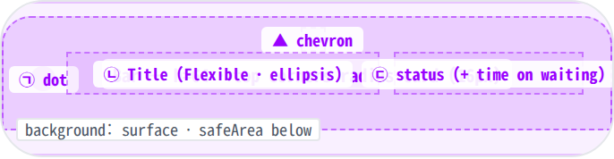
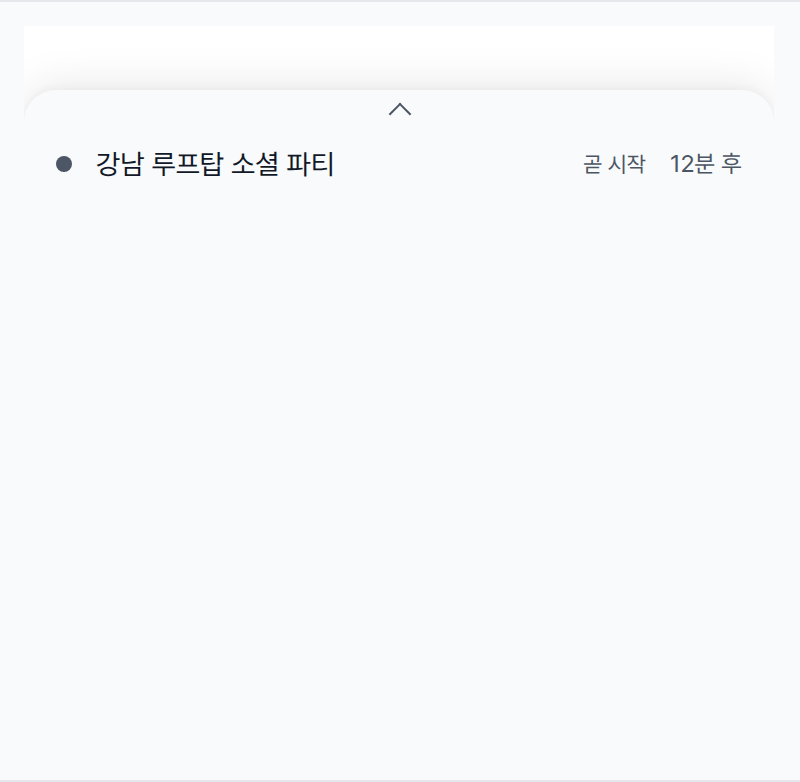
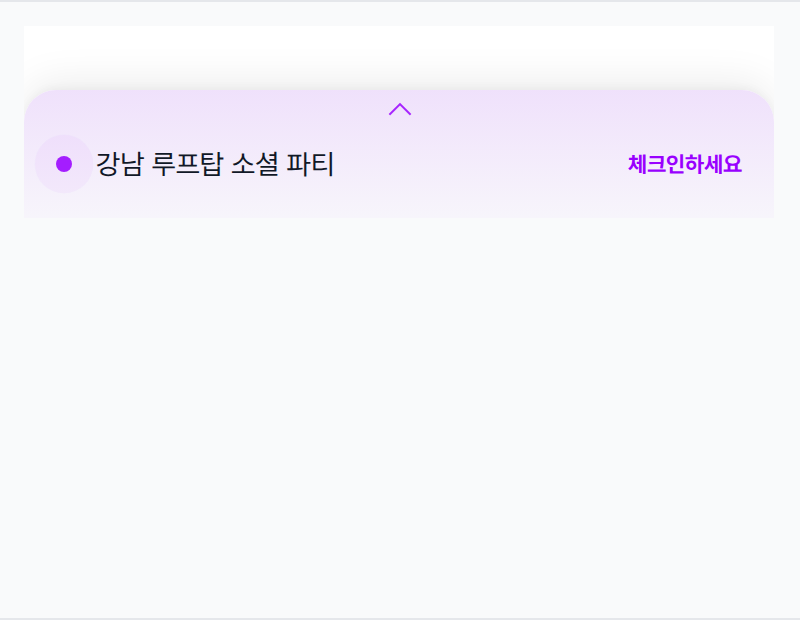
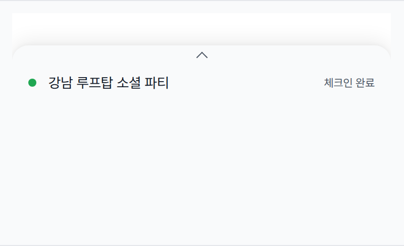
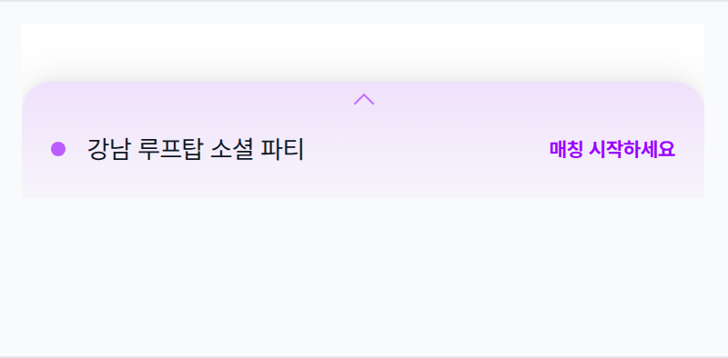
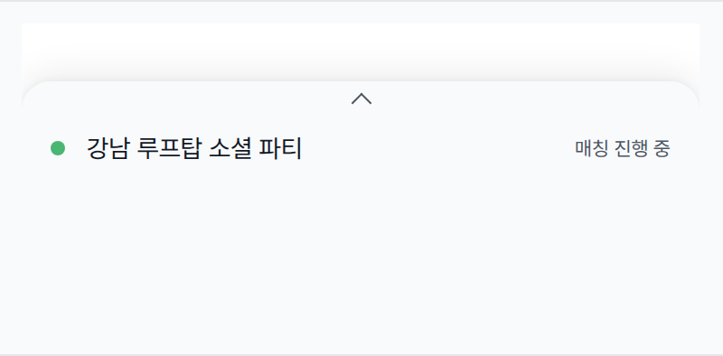
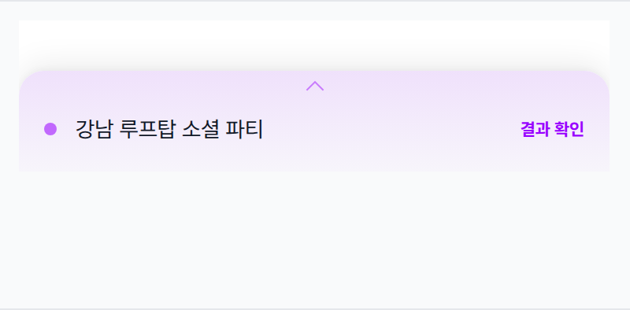
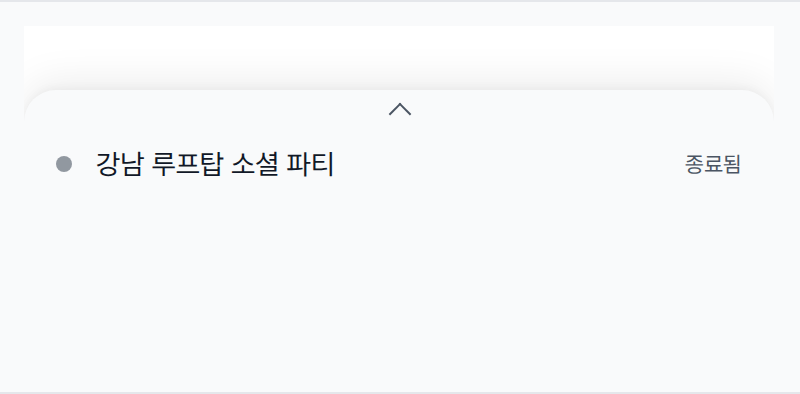

 Spec — EventNowBar (app\_user · embedded in HomePage)  

# Event Now Bar

## Overview

| Status | ✅ 디자인완료 — 7 visible state + 3 hidden state · 5개 routed sheet 진입점 |
|---|---|
| App | app_user |
| Category | home · persistent bar · sub-component |
| Route / Surface | EventNowBar (HomePage 하단 영역에 부착되는 sub-component, 자체 route 없음) |
| Path | / (홈 화면의 일부 — 자체 경로 없음) |
| Hierarchy | Parent: HomePage 하단 영역 — 오늘 참여 중인 이벤트가 있을 때만 노출.Children: — (탭 시 5개 시트로 진입 — Reference 섹션의 routed-sheet 매핑 참고) |
| Purpose | 홈 화면 하단에 떠 있는 64px persistent mini-bar. 사용자가 오늘 참여 중인 이벤트(active event) 1건을 항상 화면 위에 노출하고, 진행 단계에 맞는 다음 액션을 한 탭 거리에 둔다. 좌측 status dot · 가운데 이벤트 제목 · 우측 status 텍스트 + (waiting일 때만) 시간 텍스트. |
| User journey | Entry points: 홈 화면 진입 직후 — 하단 영역에 자동 부착. 오늘 참여 중인 이벤트가 있을 때만 보임 (없으면 안 보임).Exit points: 탭 → 현재 단계에 맞는 시트로 진입 (5종 — check-in / checked-in / matching / results / review). |
| Background | 밍글릿은 "오늘 참여 중인 이벤트의 다음 액션이 무엇인지" 즉시 인지시키는 게 핵심 UX. 진행 단계가 자주 바뀌고 (체크인 → 매칭 → 결과 발표) 각 단계마다 사용자 입력 타이밍이 다르므로, 홈 화면을 떠나지 않고 한 번의 탭으로 다음 단계를 밟을 수 있도록 persistent bar로 설계. action 상태(체크인 준비됨 · 투표 가능 · 결과 발표)는 dot pulse + halo + chevron blink + bold primary status로 강한 시선 유도, passive 상태는 dot blink만으로 살아있는 느낌만 유지. |
| Frequency | 홈 화면 진입 시마다 (오늘 참여 중인 이벤트가 있을 때). 단계가 바뀔 때마다 dot / status가 자동 갱신. |

## History

이 spec의 주요 변경 이력. 최신 항목 위.

| Date | Version | Author | Changes |
|---|---|---|---|
| 2026-05-01 | 1.0 | mark-yun | v1.4 template으로 신규 spec 작성 — home_page.html의 EventNowBar anatomy / visual gallery / 시트 매핑 섹션을 분리. mini-table per state (7 visible state, baseline = waiting), additive diff. 3 hidden state(loading / offline / no-active)는 Global Behavior 섹션에 정리. |

[🧱 Layout](#layout) [🎨 States](#states) [🔄 Global Behavior](#behavior) [📖 Reference](#reference)

🧱

## Layout

화면 구조 — 64px bar · top-rounded corners · 3 region (dot · title · status). 색·타이포 무시.

## Blueprint & tree

홈 화면 하단에 부착되는 64px persistent bar. top corners `radius-card (16px)`, 상단 부유감은 box-shadow로만 표현 (border 없음). top-center에 위치한 작은 ▲ chevron이 "탭 시 확장" 단서.

**HomePage** └─ _bottom slot_: **EventNowBar**(h=64) _· 오늘 참여 중인 이벤트가 없거나, 정보를 받아오는 중이거나, 오프라인이면 숨김_ **EventNowBar Container** ├─ height: 64 ├─ background: _color-surface_ _(action: 10%→2% primary tint gradient)_ ├─ border-radius: _radius-card (16px)_ _top-left + top-right only_ ├─ box-shadow: _0 -4px 20px rgba(0,0,0,0.08), 0 -1px 4px rgba(0,0,0,0.04)_ _(border 없음)_ ├─ padding: 10px _spacing-screen-edge (16px)_ 0 │ ├─ _Up-chevron_ (::before pseudo) ← top-center 확장 단서 │ · 7×7 rotated borders · top: 8px · centered │ · color: text-secondary _(action: primary + 1.4s opacity blink)_ │ └─ 가로 row(crossAxis: center · gap: spacing-sm) ├─ _Status dot_ ← ㉠ │ · 8×8 circle · color per state │ · action 상태 → primary + pulse(1.4s) + halo ring(1.6s) │ · passive 상태 → blink(1.8s) opacity only │ ├─ Gap: _spacing-sm (12px)_ ├─ _Event title_ (Flexible) ← ㉡ │ · bodyMedium · text-primary · 1줄 ellipsis ├─ Spacer (자동 grow) └─ _Status text_ ← ㉢ · bodySmall · text-secondary _(action: bold w700 · primary)_ · waiting only → 우측에 시간 텍스트 추가 ("N분 후" / "N시간 후")

| # | Region | Alignment | Spacing |
|---|---|---|---|
| — | Bar 외부 | height 64 · 풀폭 · bottomSheet 고정 | top corners: radius-card (16px) · 상단 부유감은 box-shadow로만 · safeArea 위에 배치 |
| — | Up-chevron | top-center · pseudo-element | 7×7 rotated borders · top: 8px · color: text-secondary (action: primary + blink) |
| — | Inner padding | row · crossAxis center · 10px top offset | horizontal: spacing-screen-edge (16px) · padding-top: 10px (chevron 공간) |
| ㉠ | Status dot | 좌측 시작 | 8×8 circle · dot↔title: spacing-sm (12px) |
| ㉡ | Event title | Flexible · 좌측 정렬 · 1줄 ellipsis | title↔Spacer: 자동 grow |
| ㉢ | Status text | 우측 끝 | bodySmall · waiting일 때만 시간 텍스트가 우측에 추가됨 |

🎨

## States

시각 변형 7종 (visible). baseline = waiting. action 상태(체크인 준비됨 / 투표 가능 / 결과 발표)는 시선 유도 강화. 3 hidden state는 Global Behavior 참고.

이벤트 진행 단계에 따라 자동 분기 (waiting · checkInReady · checkedIn · matchingReady · matching · results · ended). 모든 state는 같은 layout (dot + title + status)을 공유하고, dot 색상 / status 텍스트 / 강조 표현이 변경된다.

### waiting · 시작 전 🎯 baseline · passive

| 항목 | 내용 |
|---|---|
| 조건 | 이벤트 시작 전 (시작까지 일정 시간 이내) · 사용자 액션 미요구. |
| 사용자 액션 | 탭 → 체크인 화면 시트 진입 (체크인 사전 준비 화면). |
| 에지케이스 | · 시작까지 1시간 미만 → trailing "N분 후" / 1시간 이상 → "N시간 후" / 24시간 이상 → bar 숨김· 사용자가 다른 탭으로 이동하면 bar도 사라짐 (홈 화면에서만 노출). |
| 컴포넌트 | · StatusDot (8×8 · gray · blink 1.8s opacity)· EventTitle (Flexible · bodyMedium · text-primary · 1줄 ellipsis)· StatusText (bodySmall · text-secondary · "곧 시작")· TrailingTime (caption · text-secondary · "N분 후" / "N시간 후")· Up-chevron pseudo (text-secondary) |
| 토큰 | · color: color-surface (bg), color-text-secondary (dot · status · trailing · chevron), color-text-primary (title)· radius: radius-card (16 · top corners only)· spacing: spacing-screen-edge (16 · h-padding), spacing-sm (12 · dot↔title gap), 10px (top — chevron 공간)· typography: bodyMedium (14/400 · title), bodySmall (12 · status), caption (11 · trailing)· shadow: 0 -4px 20px rgba(0,0,0,0.08), 0 -1px 4px rgba(0,0,0,0.04) (custom · 토큰화 후보)· animation: 1.8s ease-in-out infinite (dot blink — opacity 0.55↔1) |
| 노트 | 📝 trailing 시간 텍스트가 등장하는 유일한 state. 다른 6 state는 trailing 없음. 시각 강조 약함 — 사용자가 인지만 하면 됨. |

### checkInReady ⚡ action · 체크인 가능 — 사용자 입력 필요

| 항목 | 내용 |
|---|---|
| 조건 | 이벤트 시작 시각이 도달했는데 사용자가 아직 체크인하지 않은 상태. |
| 사용자 액션 | 탭 → 체크인 화면 시트 (QR 코드 + 위치 안내). |
| 에지케이스 | · 시작 후 일정 시간 동안 미체크인 → no-show 처리 (ended 상태로 전환). |
| 컴포넌트 | ↔ StatusDot: gray + blink → primary + pulse(1.4s) + halo ring(1.6s)↔ StatusText: text-secondary → primary bold (w700) · 텍스트 "체크인하세요"↔ Up-chevron: text-secondary → primary + 1.4s blink+ --action bg 그라디언트 (10% → 2% primary tint)− TrailingTime |
| 토큰 | + color-primary (dot · status · chevron)+ color-mix(in srgb, primary 10%/2%, surface) (--action gradient bg)+ animation: 1.4s ease-in-out infinite (dot pulse), 1.6s ease-out infinite (halo ring) |
| 노트 | 📝 action variant 패턴 — checkInReady · matchingReady · results 3개 state가 동일한 시각 강조 (status 텍스트만 다름). |

### checkedIn passive · 체크인 완료

| 항목 | 내용 |
|---|---|
| 조건 | EventNowBarState.checkedIn · 체크인 완료 후 매칭 시작 전 |
| 사용자 액션 | 탭 → /events/:id/checked-in 시트 (체크인 confirmation + 곧 매칭 시작 안내) |
| 에지케이스 | 동일 |
| 컴포넌트 | ↔ Dot color → success (green) + blink↔ Status text → "체크인 완료" (text-secondary 유지 — passive)− TrailingTime |
| 토큰 | ↔ Dot bg → color-success나머지 동일 |
| 노트 | 📝 success dot은 "긍정적 진행 중" 시각 단서. action 강조 없이 차분하게 유지. |

### matchingReady ⚡ action · 매칭 시작 가능 — 사용자 입력 필요

| 항목 | 내용 |
|---|---|
| 조건 | EventNowBarState.matchingReady · 매칭 phase 진입 + 사용자 vote 미시작 |
| 사용자 액션 | 탭 → /events/:id/matching 시트 (잔여 투표 수 + 후보 grid + vote 액션) |
| 에지케이스 | · vote timeout 도달 → matching state로 자동 전환 (시스템 처리 대기) |
| 컴포넌트 | checkInReady와 동일 visual variant (action). Status 텍스트 → "매칭 시작하세요" |
| 토큰 | checkInReady와 동일 |
| 노트 | 📝 동일 action variant — checkInReady의 sibling. 차이는 status 텍스트 뿐. |

### matching passive · 매칭 진행 중 — 시스템 처리 중

| 항목 | 내용 |
|---|---|
| 조건 | EventNowBarState.matching · 사용자 vote 완료 후 결과 산출 대기 |
| 사용자 액션 | 탭 → /events/:id/matching 시트 (대기 표시 — 시스템 처리 중) |
| 에지케이스 | · 결과 산출 완료 → results state로 자동 전환 (Riverpod stream 갱신) |
| 컴포넌트 | checkedIn과 동일 visual variant (passive · success dot · blink). Status 텍스트 → "매칭 진행 중" |
| 토큰 | checkedIn과 동일 |
| 노트 | 📝 시스템 처리 진행 중 — 사용자는 결과 대기. action 강조 없음 (passive). |

### results ⚡ action · 결과 확인 — 사용자 입력 필요

| 항목 | 내용 |
|---|---|
| 조건 | EventNowBarState.results · 매칭 결과 산출 완료 + 사용자 미열람 |
| 사용자 액션 | 탭 → /events/:id/results 시트 (매치 카드 리스트 또는 empty fallback) |
| 에지케이스 | · 매치 0건 → results 시트에 empty state ("이번 이벤트는 매칭 결과가 없습니다") |
| 컴포넌트 | checkInReady · matchingReady와 동일 visual variant (action). Status 텍스트 → "결과 확인" |
| 토큰 | checkInReady와 동일 |
| 노트 | 📝 3개 action variant 중 마지막 — 이 이후 ended로 전환. |

### ended passive · 종료됨

| 항목 | 내용 |
|---|---|
| 조건 | EventNowBarState.ended · 결과 확인 후 또는 이벤트 자연 종료 |
| 사용자 액션 | 탭 → /events/:id/review 시트 (5-star 별점 + 리뷰 작성하기) |
| 에지케이스 | · 24시간 후 자동 dismiss (이 이벤트는 더 이상 active 아님 → bar 숨김) |
| 컴포넌트 | waiting과 동일 visual variant (passive · gray dot · blink). Status 텍스트 → "종료됨". TrailingTime 없음. |
| 토큰 | waiting과 동일 (단, trailing 없음) |
| 노트 | 📝 lifecycle의 마지막 visible state. 다음 phase는 hidden state(no-active)로 자동 전환. |

🔄

## Global Behavior

cross-cutting — 모든 state에 적용되는 액션, motion, hidden state. state별 액션은 위 mini-table 참고.

## Hidden states (bar 자체가 렌더되지 않음)

visible 7 state 외에 3개 hidden state가 있다. 이 경우 EventNowBar는 `SizedBox.shrink`로 화면에서 사라지고, HomePage 피드 하단 padding도 줄어든다 (bar 공간 만큼 64+safeArea).

| Hidden state | 조건 |
|---|---|
| loading | eventsAsync.loading — 초기 fetch 중. 활성 이벤트 유무 미확정 상태에선 노출하지 않음. |
| offline | 네트워크 실패 — 활성 이벤트 정보 신뢰할 수 없으므로 노출 안 함. |
| no-active | 활성 이벤트 0개 — 표시할 게 없음. |

## Cross-cutting interactions

| 사용자 액션 | 화면에 보이는 결과 |
|---|---|
| EventNowBar 탭 (모든 visible state) | state에 맞는 route를 router.push(). 모든 라우트는 ModalBottomSheetRoute로 화면 하단 슬라이드업 (Material 3 sheet detents · top corners radius-card · 검정 ~50% scrim · swipe-down dismiss). |
| 다크 모드 토글 | bar bg → color-dark-surface. shadow 그대로 (어두운 배경 위에서도 부유감 유지). dot 색상은 다크 토큰으로 자동 swap. |
| Phase 자동 전환 (백엔드 상태 변경) | Riverpod stream으로 EventNowBarState 갱신 → dot 색상 / status 텍스트 / variant 자동 변환. 별도 transition animation 없음 (cut). |

## Motion timing

Source: `shared/packages/mds/core/lib/src/theme/minglit_design_tokens.dart`

| Transition | Token / Duration | Notes |
|---|---|---|
| Routed sheet 진입 | MinglitAnimation.medium (350ms) | Material 3 sheet slide-up. scrim fade-in. |
| State 전환 (cut) | — | Phase 변경 시 dot/status 즉시 교체. 별도 transition 없음. |
| Action 상태 dot pulse | 1.4s loop | opacity 0.55↔1 (ease-in-out infinite). 시선 유도. |
| Action 상태 halo ring | 1.6s loop | scale 1→2.6, opacity 0.45→0 (ease-out infinite). |
| Action 상태 chevron blink | 1.4s loop | opacity 0.45↔1 (ease-in-out infinite). dot pulse와 동기. |
| Passive 상태 dot blink | 1.8s loop | opacity 0.55↔1 (ease-in-out infinite). 살아있는 느낌만 주고 시선 경쟁 안 함. |

※ 1.4s / 1.6s / 1.8s pulse / blink 속도는 attention loop 카테고리 — MinglitAnimation 토큰에 미정의. 향후 motion scale 확장 시 토큰화 후보.

## Global edge cases

-   **HomePage 한정 surface** — bar는 HomePage Scaffold.bottomSheet 슬롯에만 부착. 다른 탭/라우트로 이동 시 사라짐.
-   **피드 padding 보정** — bar 표시 시 피드 하단에 64+safeArea+spacing-medium 만큼 padding 추가 (마지막 카드가 bar에 가려지지 않도록).
-   **다중 활성 이벤트** — 같은 시점에 active event가 2개 이상이어도 bar는 1건만 노출 (가장 임박 / 가장 진행 phase 우선). 나머지는 bar 탭 후 시트 안에서 분기.

📖

## Reference

implementation source + routed-sheet 매핑 + 인접 화면.

## Routed sheet 매핑 (탭 → phase별 시트)

bar 탭 시 현재 `EventNowBarState`에 맞는 route을 push — 화면 하단 ModalBottomSheetRoute로 진입. **각 phase는 독립 라우트로 배포되는 진짜 screen** — 시트은 surface일 뿐이고 콘텐츠는 deep-link 가능한 페이지급. 동일 라우트를 MyPage("진행 중인 이벤트") · push 알림(매칭 결과 도착 등) · share URL 등 어디서든 진입 가능. Material 3 / GoRouter `pageBuilder → ModalBottomSheetRoute` 패턴.

| Bar state | Route | Screen | 역할 |
|---|---|---|---|
| waiting /checkInReady | /events/:id/check-in | EventCheckInScreen | QR 코드 + 이벤트명/시간 + 위치 deeplink |
| checkedIn | /events/:id/checked-in | EventCheckedInScreen | 체크인 완료 confirmation + 참석자 / 아바타 + "곧 매칭 시작" 안내 |
| matching /matchingReady | /events/:id/matching | EventMatchingScreen | 잔여 투표 수 + 후보 grid (vote 액션) |
| results | /events/:id/results | EventResultsScreen | 매칭 결과 — 매치 카드 리스트 또는 empty fallback |
| ended | /events/:id/review | EventReviewScreen | 종료 confirmation + 5-star 별점 + "리뷰 작성하기" CTA |

※ 기존 `/tickets/:ticketId/qr` (`TicketQRRoute`)는 `EventCheckInScreen`과 사실상 동일 화면 — 통합 또는 alias 처리 예정.  
※ 각 phase screen 스펙은 별도 작성 예정 (Phase 2 bulk).

## Implementation source

| Widget | EventNowBar — apps/app_user/lib/src/features/home/widgets/event_now_bar.dart |
|---|---|
| Embedded in | HomePage Scaffold.bottomSheet 슬롯 — apps/app_user/lib/src/features/home/home_page.dart |
| State enum | EventNowBarState (waiting · checkInReady · checkedIn · matchingReady · matching · results · ended) |
| Provider | activeEventNowBarStateProvider — Riverpod stream. 백엔드 phase 변경 시 자동 갱신. |
| Route registration | 5종 ModalBottomSheetRoute — app_routes.dart |

## Related screens

| Spec | Relation |
|---|---|
| HomePage | 이 bar의 parent surface — bottomSheet 슬롯에 부착. |
| EventDetailPage | bar에 표시되는 active event의 상세 화면. event card 탭 시 진입 (홈 피드 본문 경로 — bar와 별도). |
| EventOngoingBanner | 캐노니컬 lifecycle 카드 (MyTicketsPage 안). EventNowBar는 shortcut, OngoingBanner는 본 액션 hub. 같은 lifecycle 데이터 + 5 sheet endpoint 공유. EventNowBar는 phase 1-5(checkIn → matching)만 안내, phase 6(results) / noShow는 OngoingBanner 전속. |
| MyTicketsPage | OngoingBanner의 parent — EventNowBar에서 못 본 액션을 끝까지 수행할 수 있는 캐노니컬 페이지. |