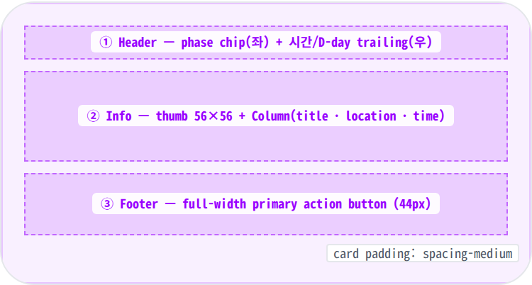
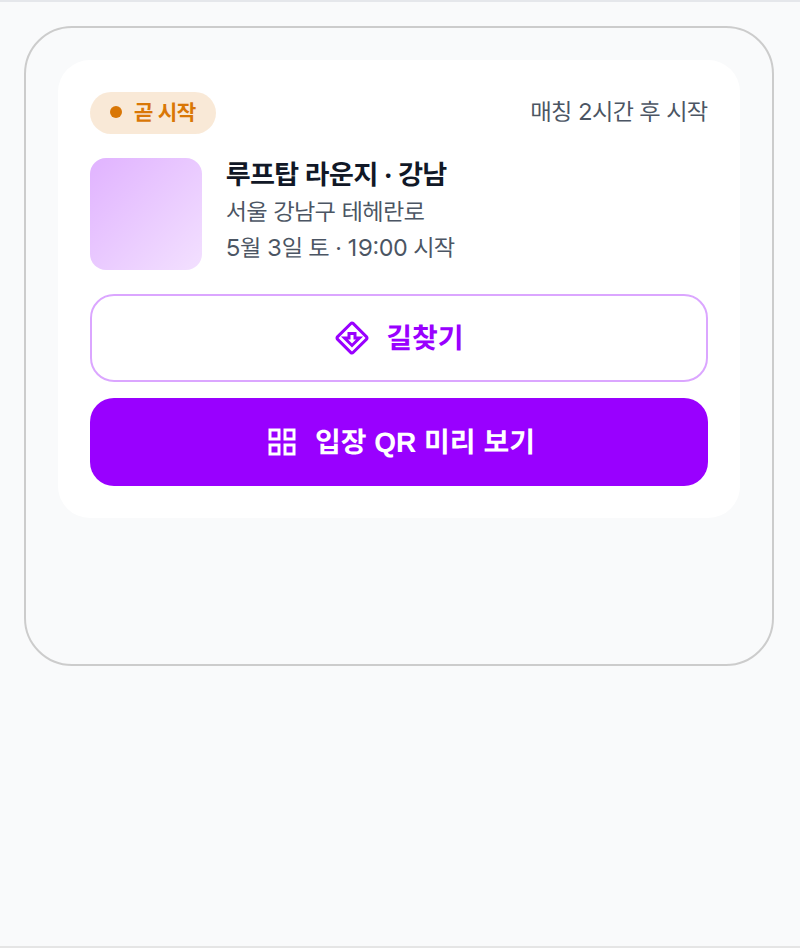
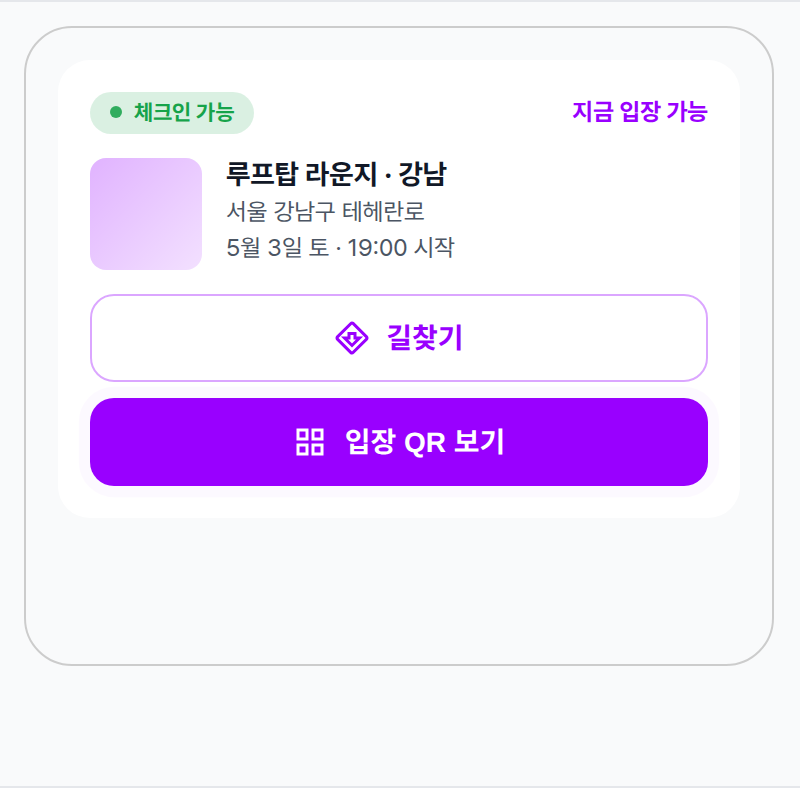
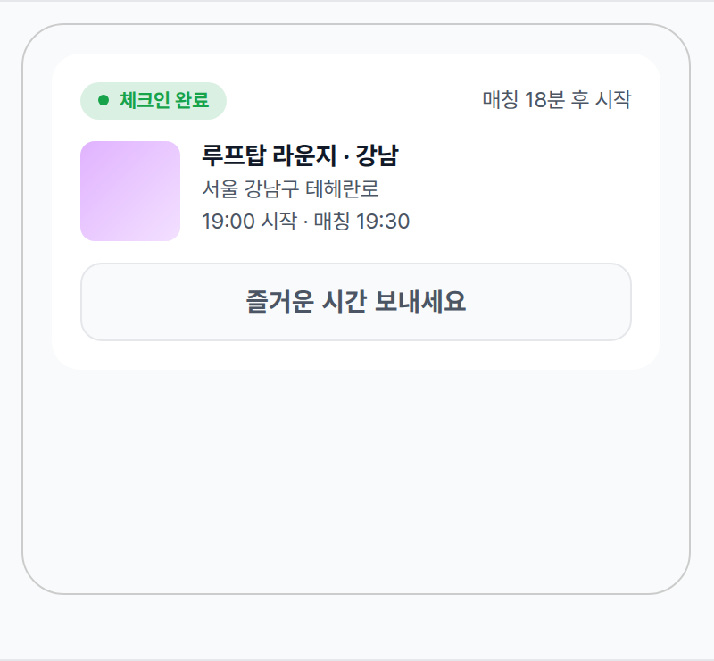
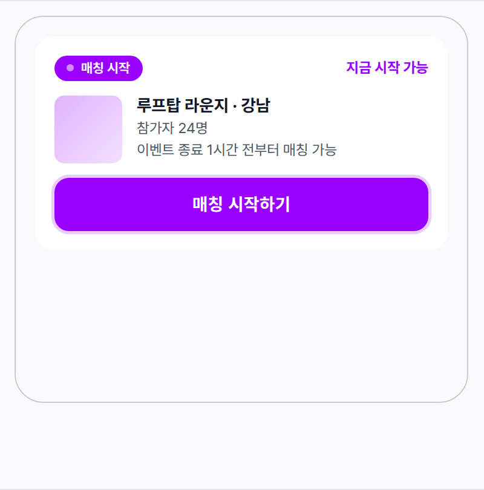
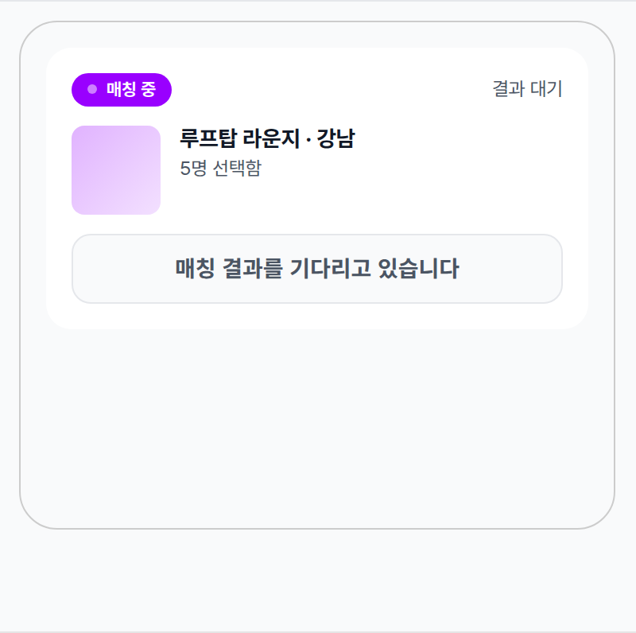
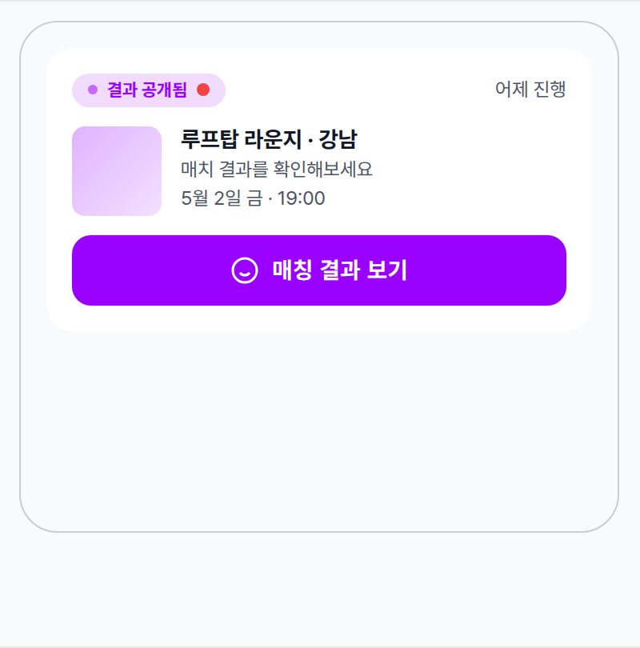
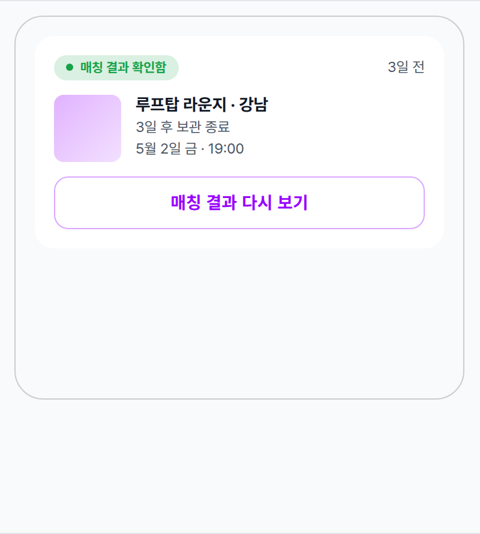
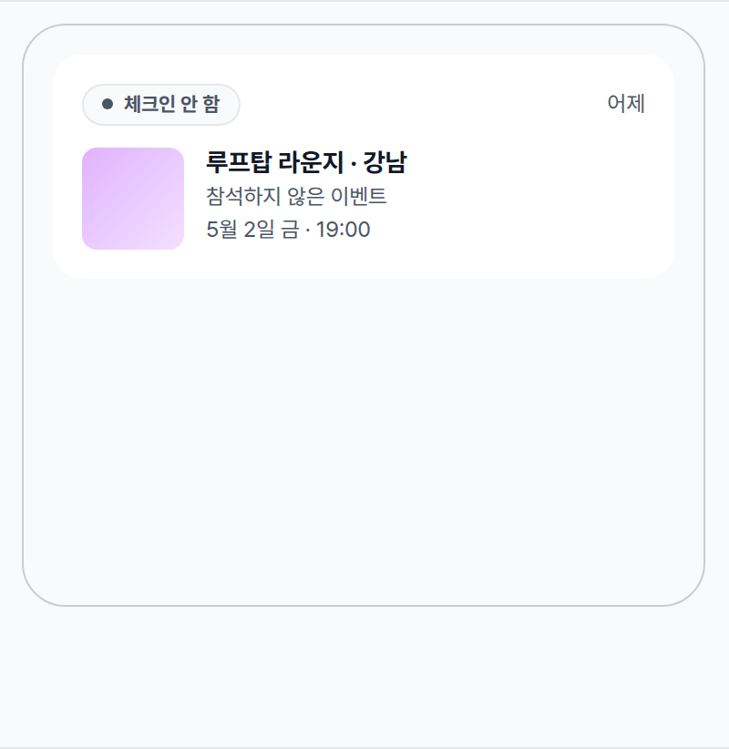
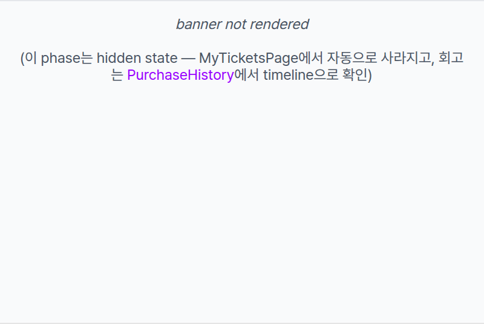

 Spec — EventOngoingBanner (app\_user · embedded in MyTicketsPage)  

# Event Ongoing Banner

## Overview

| Status | 📐 디자인 진행 중 — v1.0 초안 · 8 visible state (results 미확인/확인 분리 + noShow alt path) + 1 hidden · MyTicketsPage 캐노니컬 카드 |
|---|---|
| App | app_user |
| Category | my · ticket · live event hub · sub-component |
| Route / Surface | EventOngoingBanner (MyTicketsPage 안에 list로 배치되는 sub-component, 자체 route 없음) |
| Path | /tickets/my (부모 페이지 경로 — banner 자체는 자체 경로 없음) |
| Hierarchy | Parent: MyTicketsPage — 활성 이벤트가 있을 때 list로 노출 (다발 가능).Children: — (footer action 탭 시 routed sheet로 진입 — Reference 섹션의 sheet 매핑 참고. EventNowBar와 동일한 5 sheet endpoint 재사용) |
| Purpose | MyTicketsPage 안에 inline으로 배치되는 활성 이벤트 lifecycle 카드. 진행 단계(waiting → results)에 따라 phase chip / 시간 표시 / 액션 버튼이 자동 변경. EventNowBar가 HomePage 하단 64px shortcut으로 "지금 무슨 단계인지"만 알리는 용도라면, OngoingBanner는 같은 액션을 버튼 단위로 직접 노출하는 캐노니컬 카드 — 사용자가 EventNowBar를 못 보거나 무시해도 MyTicketsPage에 들어오면 같은 액션을 끝까지 수행할 수 있게 함. |
| User journey | Entry points: MyTicketsPage 진입 시 활성 이벤트가 있으면 자동 노출. 다발 가능 (예: 어제 결과 공개 + 오늘 매칭 진행).Exit points: footer action 탭 → 현재 phase에 맞는 routed sheet로 진입 (5종 — check-in / checked-in / matching / results / review). thumb / title 영역 탭 → EventDetailRoute push (이벤트 정보 재확인). |
| Background | 기존 MyTicketsPage v1.0은 today banner(D-Day) + upcoming/past 카드 list로 구성됐는데, 다가오는·지난 timeline은 PurchaseHistory가 이미 cover하므로 중복. MyTicketsPage의 미션을 "actionable 이벤트 hub"로 재정의하고, today / ongoing / result-pending 세 가지 actionable 카드를 OngoingBanner 한 atom으로 통합 (phase prop만 다름). 이렇게 통합하면 (1) MyTicketCard / TodayBanner / ResultPendingCard가 모두 OngoingBanner의 phase variant가 되어 spec / 구현이 단일 atom으로 수렴, (2) EventNowBar의 lifecycle 모델과 1:1 매핑되어 데이터 / sheet route를 그대로 재사용, (3) 사용자에게는 "활성 이벤트 = 한 종류의 카드"로 mental model이 단순해짐. |
| Frequency | 이벤트 사이클당 1-3회 — 입장 직전 / 매칭 시작 / 결과 확인 시점에 사용자가 MyTicketsPage 진입. |

## History

이 spec의 주요 변경 이력. 최신 항목 위.

| Date | Version | Author | Changes |
|---|---|---|---|
| 2026-05-03 | 1.0 | mark-yun | 신규 spec. EventNowBar(HomePage 하단 shortcut)의 lifecycle 모델을 재사용해 MyTicketsPage 안 캐노니컬 banner로 분리. waiting / checkInReady / checkedIn / matchingReady / matching / results(미확인) / results(확인 완료) / noShow 8 visible state mini-table + 1 hidden(ended). 결과 확인 여부는 event_applications.match_results_viewed_at로 백엔드 저장(device간 동기화). 체크인은 이벤트 종료 시점까지 가능, 미체크인 시 noShow alt path. 좋아요 0개로 시트 닫으면 matchingReady 유지. EventNowBar 5 sheet endpoint 그대로 재사용. MyTicketCard / TodayBanner / ResultPendingCard 통합 atom. (MyTicketsPage v2 폴리시 후속 PR에서 적용 예정) |

[🧱 Layout](#layout) [🎨 States](#states) [🔄 Global Behavior](#behavior) [📖 Reference](#reference)

🧱

## Layout

3 region — header(phase chip + 시간 trailing) · info(thumb + title/location) · footer(full-width primary action). 카드 폼이라 EventNowBar의 1줄 row와 다름.

## Blueprint & tree

MyTicketsPage list 안에 들어가는 카드. `spacing-medium` v-margin · `spacing-screen-edge` h-margin. 카드 자체는 둥근 모서리만 (border 없음 · 모든 phase 공통 흰 surface · scaffold gray 위에 떠 있음). action 강조는 **chip dot pulse + footer button pulse**로만 표현 (카드 bg 변형 없음). 내부 padding `spacing-medium`, 3 region 사이 `spacing-sm` gap.

**EventOngoingBanner** (Card) ├─ margin: _spacing-medium_ v · _spacing-screen-edge_ h ├─ background: _color-background_ _(모든 phase 공통 — bg 변형 없음)_ ├─ _border 없음_ _(scaffold gray surface 위에 흰 card로 떠 있음)_ ├─ borderRadius: _radius-card (16)_ ├─ padding: _spacing-medium (16)_ │ ├─ _Header row_ ← ① │ ├─ **PhaseChip** (좌) │ │ · 4×10 padding · radius-chip · 11/700 │ │ · waiting=warning · checkIn/checked=success · matching=primary │ │ · results=primary tint + dot pulse (미확인) / success 초록 + solid dot (확인 완료) │ └─ **Trailing meta** (우) │ · "X시간 후 시작" / "X분 남음" / D-Day · D+N │ · matching phase는 strong tone (primary w700) │ ├─ _Info row_ ← ② │ ├─ **Thumb** 56×56 (radius-small · gradient placeholder) │ └─ **Column** (flex 1 · gap 4) │ ├─ title (14/700 · 1줄 ellipsis) │ ├─ location (12/secondary) │ └─ datetime (12/secondary) │ └─ _Actions stack_ ← ③ · vertical · gap 8 ├─ _OutlineActionButton_ "길찾기" _(waiting · checkInReady에만 노출)_ │ · full-width 44px · radius-button · primary 35% border · transparent bg · primary text │ · 외부 지도 앱(카카오맵 등) 호출 └─ _FooterActionButton_ (primary fill — phase별 라벨/아이콘) · full-width 44px · radius-button · primary fill (active phase) · pulse animation (action phase) · passive variant: surface bg · text-secondary · cursor default · phase별 라벨 분기 (States 참조)

| # | Region | Alignment | Spacing |
|---|---|---|---|
| — | Card 외부 | list 안 단일 카드 · 다발 가능 | v-margin spacing-medium (16) · h-margin spacing-screen-edge (16) · radius-card · border 없음 (scaffold gray surface 위 흰 카드) |
| ① | Header row | spaceBetween · phase chip 좌 / 시간 trailing 우 | chip 11/700 · trailing 12/secondary · matching일 땐 strong |
| ② | Info row | start cross-axis · 56 thumb + flex column | thumb↔body gap spacing-sm · body 안 행 gap 4 · title 14/700 · meta 12/secondary |
| ③ | Actions stack | vertical · gap 8 · 길찾기 outline(waiting · checkInReady만) + primary CTA | 각 button full-width 44px · radius-button · 14/700 · gap 8(icon-text) · outline은 transparent bg + primary 35% border |
| — | region 사이 gap | — | spacing-sm (12) |

🎨

## States

시각 변형 8 visible (waiting · checkInReady · checkedIn · matchingReady · matching · results 미확인 · results 확인 완료 · noShow) + 1 hidden(ended). baseline = waiting. action phase(checkInReady · matchingReady · results 미확인)는 chip dot pulse + footer button pulse로 강조.

EventNowBar와 동일한 lifecycle 모델을 따르되 results phase는 **viewed/unviewed로 sub-state 분리**, 추가로 **noShow alt path**를 둠 (체크인 안 한 사용자). 전체: waiting · checkInReady · checkedIn · matchingReady · matching · results-미확인 · results-확인 · noShow · ended. banner는 ended에서 자동으로 사라짐 (hidden). 각 visible phase는 같은 layout(header / info / footer)을 공유하고, **phase chip 색·라벨**, **trailing 시간 표현**, **footer action 라벨·시각 강조**가 변경됨.

### waiting · 시작 전 대기 🎯 baseline · 이벤트 시작 전 (보통 D-Day · ~1-2시간 전)

| 항목 | 내용 |
|---|---|
| 조건 | 이벤트 시작 시간 전(보통 D-Day · 시작 1-2시간 전 활성). 아직 체크인 받기 시작 전 상태. 사용자는 입장 정보를 미리 확인하거나 길찾기를 사용. |
| 사용자 액션 | ① "입장 QR 미리 보기" 탭 — Check-in 시트 열림 (아직 체크인 비활성, QR 미리보기만 가능)② "길찾기" outline 버튼 탭 — 외부 지도 앱(카카오맵 등) 호출③ title / thumb 영역 탭 — EventDetailRoute push (이벤트 정보 재확인) |
| 에지케이스 | · 시작 시간이 매우 임박해도(예: 5분 전) 체크인이 아직 활성화 안 됐으면 이 상태 유지 — 운영자가 체크인 open한 시점이 phase 분기 트리거.· 사용자가 다른 이벤트에 동시 참석(다발) 중이면 banner가 둘 노출됨 — 시간순(임박 우선) 정렬. |
| 컴포넌트 | · Card container · border 없음 · radius-card · padding-medium · 흰 bg· PhaseChip (warning tone · "곧 시작") + TimeText (매칭 시작까지 남은 시간 — "매칭 X시간 후 시작")· Thumb 56×56 · TitleColumn (title · location · datetime)· ActionsStack (vertical · gap 8)· ├ OutlineActionButton ("길찾기" · primary 35% border · 외부 지도 앱 호출)· └ FooterActionButton (primary fill · "입장 QR 보기" + qr_code icon · 미리보기 sheet 호출) |
| 토큰 | · color: color-background(card surface · 흰), color-surface(scaffold bg · scaffold gray로 카드가 떠보이게), color-text-primary(title), color-text-secondary(meta · time), color-warning(chip text + chip 16% bg), color-primary(footer button bg · outline button text+border)· radius: radius-card(card · 16) · radius-button(footer button · 12) · radius-chip(phase chip)· spacing: spacing-medium(card padding · h-margin), spacing-sm(region gap · thumb-body gap), spacing-screen-edge(외곽)· typography: chip(11/700), trailing time(12/secondary), title(14/700), meta(12/secondary), action(14/700) |
| 노트 | 📝 baseline phase는 "아직 액션 단계가 아니지만 곧 다가옴"의 신호 — chip 톤은 warning(주황)로 attention 끌고, footer button은 primary fill이지만 pulse 없음. 사용자에게 "QR을 미리 한 번 봐두자" 정도의 가벼운 prompt. |

### checkInReady · 체크인 가능 현장 체크인 open · 사용자 액션 강하게 유도

| 항목 | 내용 |
|---|---|
| 조건 | 운영자가 체크인을 open한 시점부터 이벤트 종료 시점까지 활성. 늦게 도착해도 종료 전이면 체크인 가능 (checkInReady → checkedIn 정상 진입). 시간 압박이 가장 큰 단계 — 사용자는 "지금 들어가야 함"을 즉시 인지해야. 이벤트 종료 시 미체크인이면 noShow phase로 분기. |
| 사용자 액션 | + "입장 QR 보기" 탭 (pulse) — Check-in 시트 열림 (QR 풀스크린 노출 · 운영자가 스캔)동일: 길찾기 / EventDetail 진입 |
| 에지케이스 | · 사용자가 지각한 경우 — 체크인 시간이 끝나도 이 phase가 유지되다가 운영자가 강제 종료하면 ended로 분기.· QR 시트는 화면이 켜져 있는 동안 자동 갱신 (단, 위변조 방지 위한 짧은 TTL). |
| 컴포넌트 | ↔ baseline 대비:+ PhaseChip tone: success + dot pulse (action 시그널)+ Trailing 시간 표현: "지금 입장 가능" (strong primary)+ Footer primary button: pulse animation (1.6s) — chip dot pulse + button pulse 두 단서로 사용자 attention 유도. 길찾기 outline 버튼은 위에 그대로 stack(카드 bg는 모든 phase 공통 흰 surface — gradient 변형 없음) |
| 토큰 | ↔ baseline ++ color-success(chip text + chip 16% bg)+ color-primary(card border tint · trailing strong · button pulse halo)− color-warning(chip 톤 변경) |
| 노트 | 📝 가장 강한 시선 유도 단계. action 변형 카드 외곽 + chip dot pulse + footer button pulse 3중으로 사용자 attention을 끌어 입장 누락 방지. |

### checkedIn · 체크인 완료, 매칭 전 대기 passive · 매칭 시작 전까지 기다림

| 항목 | 내용 |
|---|---|
| 조건 | QR 체크인 완료 시점부터 매칭 시작까지의 대기 구간 (보통 10-30분). 사용자는 자리에 앉아 기다리거나 안내를 받음. |
| 사용자 액션 | ⊝ Footer action 비활성 — 탭해도 변화 없음 (cursor default)− 길찾기 outline 버튼은 노출 안 함 (이미 현장 도착)동일: title / thumb 탭 → EventDetailRoute (운영 안내 / 매칭 룰 등)+ 별도: CheckedIn 시트 진입 가능 (참가자 명단 / 매칭 안내) — banner 본체 탭으로 진입 |
| 에지케이스 | · 매칭 시작 시간이 운영 사정으로 지연되면 trailing 시간이 "매칭 곧 시작"으로 변경 (정확한 시간 미정 시).· 사용자가 화면을 보지 않아도 phase 5(matching)로 자동 전환되며 EventNowBar 알림이 뜸. |
| 컴포넌트 | ↔ baseline 대비:+ PhaseChip: success outline (체크인 완료 시그널)+ Footer button variant: --passive (surface bg · secondary text · cursor default)+ Banner body 탭 영역 활성화 → CheckedIn 시트 |
| 토큰 | ↔ baseline ++ color-success(chip)+ color-surface(button bg)− color-warning · primary footer |
| 노트 | 📝 passive phase. 사용자에게 "지금은 기다리세요"를 명확히 — pulse / 강조 없음. 다만 banner는 살아있어서 시간 카운트가 자동 갱신됨. |

### matchingReady · 매칭 시작 가능 action 단계 · 매칭 진입 강하게 유도

| 항목 | 내용 |
|---|---|
| 조건 | 이벤트 종료 1시간 전부터 활성. 모든 체크인 참가자가 매칭에 참여할 수 있는 시점. 사용자가 시트에 진입해 좋아요를 보내면 phase 5(matching · 결과 대기)로 전환. |
| 사용자 액션 | + "매칭 시작하기" 탭 (pulse) — Matching 시트 열림 (좋아요 보낼 상대 카드 swipe UI 진입)동일: title / thumb 탭 → EventDetail |
| 에지케이스 | · 좋아요 0개로 시트 닫음 / 시트 진입 X: matchingReady에 머무름 — pulse + "매칭 시작하기" 그대로 유지. 사용자가 마음 바뀌어 다시 들어갈 수 있도록 강조 회수하지 않음.· 이벤트 종료 시점까지 0개로 끝나면 자동으로 phase 6(results)로 전환 + 좋아요 0건 처리 (= 매치 0건 결과).· 좋아요 보낼 카드 수가 0명(체크인 참가자 본인 1명뿐)이면 안내 메시지 후 자동 phase 5/6 skip.· ≥1개 보내고 시트 닫음: phase 5(matching · 결과 대기)로 전환 — passive 톤. |
| 컴포넌트 | ↔ baseline 대비:+ PhaseChip tone: primary fill (흰 dot + pulse) — 가장 강한 액션 시그널+ Trailing: "지금 시작 가능" (strong primary)+ Footer button: pulse · 텍스트 only ("매칭 시작하기")(카드 bg는 모든 phase 공통 흰 surface — gradient 변형 없음. action 강조는 chip dot pulse + button pulse만으로) |
| 토큰 | ↔ baseline ++ color-primary(chip fill · button bg + pulse · trailing strong)+ 흰 dot inside chip− warning |
| 노트 | 📝 checkInReady와 더불어 가장 강한 attention phase. 차이는 chip이 success(체크인) → primary(매칭)로 바뀌어 "다음 단계로 이동"을 시그널. |

### matching · 매칭 진행 중 live · 시간 카운트 + 계속하기 액션

| 항목 | 내용 |
|---|---|
| 조건 | 사용자가 좋아요 ≥1개를 보내고 시트를 닫은 후의 대기 구간. 결과 공개 전까지 passive 톤 유지. 마감 시간 개념은 없고, 운영자가 결과를 산출하면 자동으로 phase 6(results)로 전환. (좋아요 0개로 시트 닫은 경우는 matchingReady 그대로 유지) |
| 사용자 액션 | ⊝ Footer action 비활성 — 탭해도 변화 없음 (cursor default).동일: title / thumb 탭 → EventDetail.(매칭 자체는 시트 안에서 완결되고, banner는 결과 공개까지의 상태 표시 역할만) |
| 에지케이스 | · 사용자가 0명 선택했어도 banner는 동일하게 노출 ("0명 선택함").· 결과 산출은 백엔드 운영 — 클라이언트는 push / polling으로 phase 6 transition 받음. |
| 컴포넌트 | ↔ matchingReady 대비:+ PhaseChip dot pulse 유지 ("매칭 중") — 백엔드에서 결과 처리 중인 시그널+ Trailing: "결과 대기" (passive · secondary)+ Info meta: "X명 선택함" (선택 카운트만 · 진행률·마감시간 없음)+ Footer button variant: --passive (surface bg · secondary text · cursor default)+ Footer 라벨: "매칭 결과를 기다리고 있습니다" |
| 토큰 | ↔ matchingReady ++ color-surface(button bg passive)− color-primary footer fill / pulse 제거 — "내 할 일은 끝났다" 시그널 |
| 노트 | 📝 matching phase는 "내가 할 일은 다 했고, 결과 기다리는 중"의 passive 상태. matchingReady의 적극적 톤(pulse)과 대비되어 사용자 인지를 분리. 시트 활동(좋아요 보내기)은 matchingReady에서 진입한 시트 안에서 완결되며, banner는 그 후 상태 표시만 담당. |

### results · 매칭 결과 공개됨 (미확인) 🎯 가장 두근거리는 transition · 결과 시트 진입 전

| 항목 | 내용 |
|---|---|
| 조건 | 매칭 마감 후 결과가 공개된 상태. 결과 공개 시점부터 최대 1주일(7일) 동안 banner가 노출됨. 핵심 transition — 사용자가 가장 기다리는 순간. 결과 확인(시트 진입) 또는 1주일 경과 시 phase 7(ended)로 전환되며 banner 사라짐. |
| 사용자 액션 | + "매칭 결과 보기" 탭 (pulse) — Results 시트 열림 (매치된 사람 / 받은 좋아요 / 채팅 진입점)+ 결과 확인 후에도 banner는 1주일까지 유지 (재진입 가능). 1주일 경과 시 자동 사라짐 → 회고는 PurchaseHistory에서 |
| 에지케이스 | · 매치 0건이어도 banner는 동일하게 노출 — 결과 시트에서 "이번엔 매치가 없었어요" 빈 상태 표시.· 조회 가능 기간 1주일(7일) 정책 — 결과 공개 시점부터 7일까지 banner 노출. 시간 경과 시 자동으로 PurchaseHistory 지난 티켓 timeline으로 이관 (재진입은 그쪽에서).· 한 사용자가 동시에 여러 이벤트의 results phase일 수 있음 — banner stack에 시간순 정렬 (최신 결과 위). |
| 컴포넌트 | ↔ matchingReady 대비:+ PhaseChip tone: results variant (primary 14% bg + primary text + dot pulse + 알림 error dot)+ Trailing: 진행 일자(과거형 — "어제" / "X일 전" 같은 상대 표기)+ Info meta: "매치 결과를 확인해보세요" copy+ Footer 아이콘: 매칭 결과 (smile / heart_check 등) |
| 토큰 | ↔ matchingReady ++ color-error(알림 dot — 미확인 시그널 · 8×8)+ chip variant: primary 14% bg + primary text− chip primary fill (results variant로 swap) |
| 노트 | 📝 본 페이지 신설의 가장 큰 add-value. 기존 v1.0에서는 Past 카드 회색에 묻혀 있던 결과 발표가 명시적 banner + 알림 dot으로 격상. 결과 확인 = 사용자에게 가장 두근거리는 순간이라 시각적 강조 + AppBar bottom-nav badge와 동기화 권장. |

### results · 매칭 결과 확인 완료 이미 결과 시트 본 상태 · 1주일까지 재진입 가능 · pulse 없음

| 항목 | 내용 |
|---|---|
| 조건 | 사용자가 결과 시트를 한 번 진입한 후의 상태. 결과 공개 시점부터 1주일까지 banner 유지되며, 그 안에서 재진입 가능. match_results_viewed_at 백엔드 저장값으로 분기 — device간 동기화됨. |
| 사용자 액션 | + "매칭 결과 다시 보기" 탭 (outline · pulse 없음) — Results 시트 재진입동일: title / thumb 탭 → EventDetail |
| 에지케이스 | · 1주일 보관 만료 임박 시(예: 1일/3일 남음) info meta에 "X일 후 보관 종료" 표시 — 사용자가 회고 종료 시점을 알 수 있도록.· 보관 만료 후 phase 7(ended)로 자동 전환 — banner 사라지고 PurchaseHistory로 이관.· 한 사용자가 동시에 여러 이벤트의 6b 상태일 수 있음 — banner stack 시간순 정렬. |
| 컴포넌트 | ↔ 6a(미확인) 대비:+ PhaseChip variant: --success 초록 (확인 완료 의미) · 라벨 "매칭 결과 확인함" (dot pulse 없음 — solid dot)+ Footer button variant: --outline (primary 35% border · transparent bg · primary text · pulse 없음)+ Footer 라벨: "매칭 결과 다시 보기"+ Info meta 추가: "X일 후 보관 종료" (만료 임박 시 노출) |
| 토큰 | ↔ 6a ++ color-success(chip text + chip 16% bg) — "확인 완료" 시그널+ outline button border: color-primary @ 35%− chip dot pulse animation 제거 (solid dot)− footer pulse animation 제거 (이미 봤으니 attention 회수)− results variant chip(primary tint) 제거 — 6a 전속 |
| 노트 | 📝 6a → 6b transition은 결과 시트 첫 진입 시점에 백엔드 mutation. match_results_viewed_at 컬럼이 set되면 클라이언트가 6b로 자동 전환. 이후 1주일까지는 회고용으로 banner 유지 — 매치된 상대와의 채팅 진입점 등 follow-up 액션 빠른 접근. |

### noShow · 체크인 안 함 참석하지 않은 이벤트 · 매칭 / 결과 진입 없이 종료된 alt path

| 항목 | 내용 |
|---|---|
| 조건 | 이벤트 종료 시점까지 사용자가 체크인을 하지 않은 경우. matching / results phase 진입 없이 종료되는 alt path. 환불 진행 없음 — 단순 정보성 표시. |
| 사용자 액션 | ⊝ Footer action 없음 (pure informational banner).동일: title / thumb 영역 탭 → EventDetailRoute (놓친 이벤트 정보 재확인). |
| 에지케이스 | · 체크인 가능 시점은 이벤트 종료까지 — 늦게 도착해도 종료 전이면 checkInReady → checkedIn 정상 진입. 종료 시점에 미체크인이면 자동으로 noShow.· 환불 정책과 분리 — 체크인 안 했다고 자동 환불은 없음. 환불은 사용자가 별도 요청 (취소 정책 따름).· noShow 상태도 1주일까지 banner 노출 후 ended로 전환 — 같은 정책 라인 유지. |
| 컴포넌트 | ↔ baseline 대비:+ PhaseChip variant: --neutral (gray · 회색 톤 · solid dot · pulse 없음)+ Trailing: 진행 일자(과거형 — "어제" / "X일 전")+ Info meta: "참석하지 않은 이벤트"− 길찾기 outline 버튼 미노출 (이미 종료된 이벤트)− Footer primary action 미노출 (informational only · 카드 본체만 EventDetail로 탭 가능) |
| 토큰 | ↔ baseline ++ color-text-secondary(chip + dot · 옅은 회색 톤)+ chip neutral variant: surface bg + divider border− warning / primary / pulse 일체 제거 — informational |
| 노트 | 📝 사용자에게 "이 이벤트는 참석하지 않았어요"를 가볍게 알려주는 회고용 표시. 환불은 별도 동선이고, 이 banner 자체는 액션이 없는 정보성 카드. 1주일 후 자동 사라짐. |

### ended · 종료 (banner 사라짐) hidden · 결과 공개 후 1주일 경과

| 항목 | 내용 |
|---|---|
| 조건 | 매칭 결과 공개 후 또는 noShow 시점부터 1주일(7일) 경과 시 자동으로 ended로 전환. results / noShow 모두 동일한 7일 정책. 7일 초과 시점에 banner는 MyTicketsPage list에서 사라지고, PurchaseHistory 지난 티켓 timeline으로 이관 (재진입 가능). |
| 사용자 액션 | − banner 자체가 없어 직접 액션 없음. 회고 / 영수증 / 매칭 결과 재진입은 PurchaseHistory에서 진입. |
| 에지케이스 | · 7일 만료 시 자동 transition — banner가 page에서 fade out (200ms). 결과 확인(6a→6b)은 banner를 즉시 제거하지 않음 — 7일 정책은 결과 공개 시점 기준으로 일관 적용.· MyTicketsPage 모든 banner가 ended이면 페이지 자체가 empty state로 분기 (다른 spec에서 정의 예정). |
| 컴포넌트 | − banner 미렌더 (parent list가 해당 entry 자체를 제외). |
| 토큰 | — |
| 노트 | 📝 ended는 lifecycle 종착점이며 더 이상 actionable이 없음. PurchaseHistory의 timeline 카드(영수증 · 후기 · 매칭 결과 재진입 등)가 이후 모든 회고 액션의 캐노니컬 진입점. |

🔄

## Global Behavior

phase 전환 · 다발 케이스 정렬 · EventNowBar와의 동기화 · 모션.

## Phase 전환 동작

-   phase는 운영자 / 시스템 트리거로 자동 전환 — 클라이언트는 push / polling으로 갱신.
-   전환 시 banner 본체는 유지된 채 chip · trailing · footer만 cross-fade (200ms).
-   `waiting → checkInReady`는 운영자가 체크인 open · `checkInReady → checkedIn`은 사용자 QR 스캔 완료 시.
-   `checkInReady → noShow`는 이벤트 종료 시점까지 미체크인이면 자동 분기 (alt path).
-   `checkedIn → matchingReady`는 운영자가 매칭 phase open (이벤트 종료 1시간 전 자동).
-   `matchingReady → matching`은 사용자가 좋아요 ≥1개 보내고 시트 닫음. 0개면 matchingReady 유지.
-   `matching/matchingReady → results`는 이벤트 종료 + 백엔드 결과 산출 완료 시 (0개로 끝나면 0건 결과 처리).
-   `results 미확인 → results 확인`은 사용자가 결과 시트 첫 진입 시점 — 백엔드에 `match_results_viewed_at`이 set되며 chip dot pulse / footer button pulse 회수. 시트는 그대로 닫혀도 banner는 outline 톤으로 유지(재진입 가능).
-   `results → ended`는 결과 공개 후 **1주일(7일) 경과** 시 자동 전환. 미확인/확인 무관하게 7일 초과 시 banner 제거 + PurchaseHistory 지난 티켓으로 이관.

## 다발 케이스 — banner stack

-   한 사용자가 동시에 여러 활성 이벤트를 가질 수 있음 (예: 어제 results pending + 오늘 ongoing).
-   MyTicketsPage list 정렬 우선순위 — **action 시급도 → 시간 임박도**.
-   같은 시급도 내에서는 시간 임박 순 (matchingReady 19:30 시작 > matchingReady 20:30 시작).
-   action phase(checkInReady · matchingReady · results)는 항상 passive phase(waiting · checkedIn) 위에 노출.

| 우선 순위 | Phase | 이유 |
|---|---|---|
| 1 | checkInReady · matchingReady · results 미확인 | action — pulse 강조 · 즉시 사용자 입력 필요 또는 가장 기다린 transition |
| 2 | matching | passive — 결과 대기 중 |
| 3 | results 확인 완료 | passive — 회고 진입 가능 (outline 톤) |
| 4 | checkedIn | passive — 자동 전환 대기 |
| 5 | waiting | passive — 시작 전 대기 |
| 6 | noShow | passive — 정보성만 (액션 없음) |

## EventNowBar와의 동기화

-   EventNowBar(HomePage 하단 64px shortcut)와 OngoingBanner는 **같은 lifecycle 데이터**를 보지만 표현이 다름.
-   EventNowBar phase 1-5(waiting → matching)는 양쪽 모두 노출. phase 6(results)는 OngoingBanner 전속 (EventNowBar는 결과 안내까진 안 가도록 분리).
-   EventNowBar 탭 → 해당 phase 시트 진입 = OngoingBanner footer action 탭 → 동일 시트 진입 (5 sheet endpoint 공유).
-   사용자가 EventNowBar로 액션 처리하면 OngoingBanner도 즉시 phase 갱신 (반대로도 동일).

## Motion timing

| Transition | Token / Duration | Notes |
|---|---|---|
| phase 전환 (chip · trailing · footer) | MinglitAnimation.fast (200ms) | cross-fade — banner 본체 위치 유지. |
| banner 추가 (다발) | MinglitAnimation.medium (300ms) | 위에서 슬라이드 다운 + opacity fade-in. |
| banner 제거 (ended transition) | MinglitAnimation.fast (200ms) | opacity fade-out → height collapse. |
| phase chip dot pulse | 1.4s loop | action phase에만 적용 (checkInReady · matchingReady · matching · results). |
| footer button pulse halo | 1.6s loop | action phase에만 적용. box-shadow 변화로 표현. |

## Global edge cases

-   **네트워크 끊김** — banner는 마지막 phase 그대로 유지 + Snackbar로 "오프라인" 안내. 액션 탭 시 시트 진입은 시도하되 실패 시 retry prompt.
-   **시간이 매우 임박한 다발** — 두 이벤트가 같은 시각에 겹치면(이론상) banner 두 개가 모두 action phase. 정렬 우선순위 따름.
-   **이벤트 취소** — 운영자가 이벤트를 cancel하면 banner는 다음 새로고침에서 사라지고 PurchaseHistory에 환불 진행 카드로 이관.
-   **thumb 이미지 누락** — 기본 gradient placeholder (현재 mockup도 placeholder 사용).

📖

## Reference

routed sheet 매핑 + implementation source + 인접 spec.

## Routed sheet 매핑 (footer action → phase별 시트)

EventNowBar와 동일한 5 sheet endpoint를 재사용. footer 라벨/아이콘만 phase 별로 분기.

| Phase | Footer 라벨 | Sheet (재사용) | 주요 컨텐츠 |
|---|---|---|---|
| waiting | "입장 QR 미리 보기" | CheckInPreviewSheet | QR 미리보기 (체크인 비활성 · 시간 전) |
| checkInReady | "입장 QR 보기" (pulse) | CheckInSheet | QR 풀스크린 · 운영자 스캔용 |
| checkedIn | (passive · "즐거운 시간 보내세요") | CheckedInSheet (banner 본체 탭으로 진입 가능) | 참가자 명단 · 매칭 안내 |
| matchingReady | "매칭 시작하기" (pulse) | MatchingSheet | 좋아요 swipe UI 진입 |
| matching | (passive · "매칭 결과를 기다리고 있습니다") | — | 좋아요 ≥1개 보낸 후 결과 대기 — footer 비활성 |
| results · 미확인 | "매칭 결과 보기" (pulse) | ResultsSheet (첫 진입 시 match_results_viewed_at mutation) | 매치된 사람 / 받은 좋아요 / 채팅 진입점 |
| results · 확인 완료 | "매칭 결과 다시 보기" (outline) | ResultsSheet (재진입) | 회고 / 채팅 진입점 — 1주일까지 유지 |
| noShow | (footer 없음) | — | informational only · 카드 본체 탭 → EventDetail |
| ended | — | (banner 미렌더) | 회고는 PurchaseHistory에서 |

## Implementation source (예상)

| Widget | EventOngoingBanner — apps/app_user/lib/src/features/my/event_ongoing_banner.dart (신설 예정) |
|---|---|
| Phase enum | EventLifecyclePhase (재사용 — EventNowBar와 공유) · shared/packages/minglit_kit/lib/src/models/event_lifecycle_phase.dart |
| Provider | activeEventBannersProvider — phase 별 정렬된 active 이벤트 list 제공 · MyTicketsPage가 watch |
| Backend 저장 | event_applications.match_results_viewed_at TIMESTAMPTZ 컬럼 (또는 별도 event_match_result_views(user_id, event_id, viewed_at) 정규화 테이블) — ResultsSheet 첫 진입 시 mutation. device간 동기화 source. |
| 1주일 만료 정책 | banner 노출 윈도우는 결과 공개 시점부터 7일 — backend가 phase 6/7 분기 진실값 (server-side timestamp 비교). |
| Animations | MinglitAnimation.fast · MinglitAnimation.medium · phase chip / footer button pulse는 widget-level (1.4s · 1.6s) |

## Related screens / atoms

| Spec | Relation |
|---|---|
| MyTicketsPage | 유일한 parent — banner는 이 페이지 안의 list element. v2 폴리시에서 today/upcoming/past 구조 폐기 + OngoingBanner stack으로 재정의. |
| EventNowBar | HomePage 하단 64px shortcut. 같은 lifecycle 모델 + 5 sheet endpoint 공유. phase 1-5만 안내, phase 6(results)는 OngoingBanner 전속. |
| PurchaseHistory | ended phase 이후 회고 timeline. 다가오는 / 지난 이벤트 list 역할은 여기로 위임. |
| HomePage | EventNowBar의 parent. OngoingBanner의 같은 액션을 shortcut 폼으로 보여줌. |