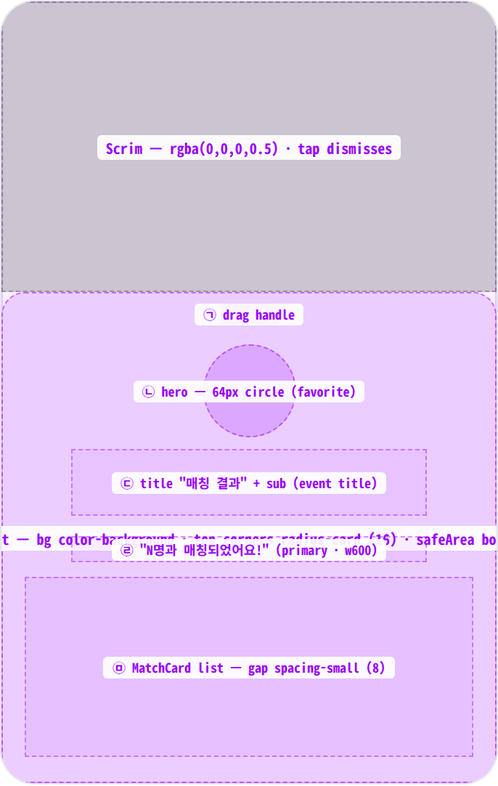
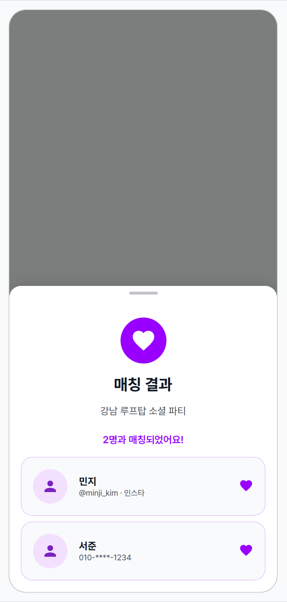
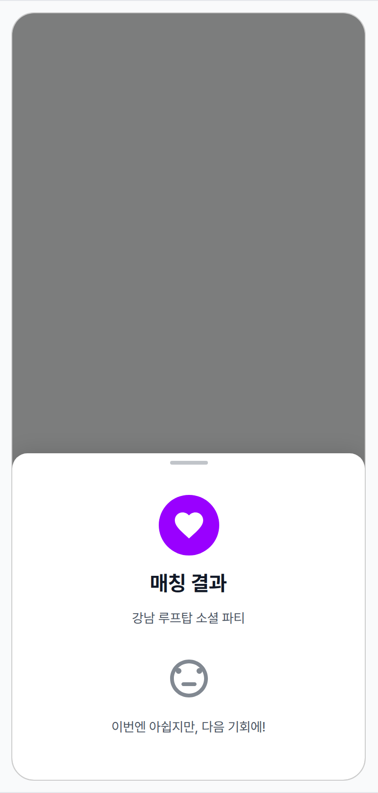
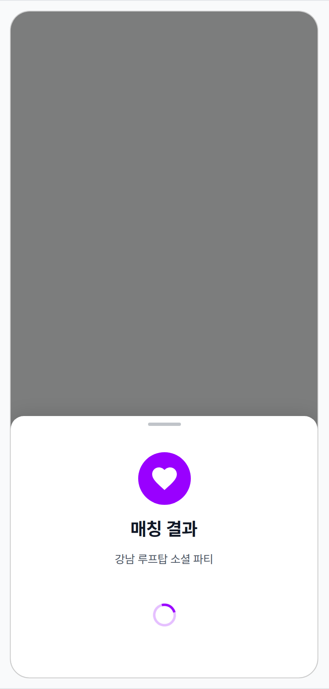
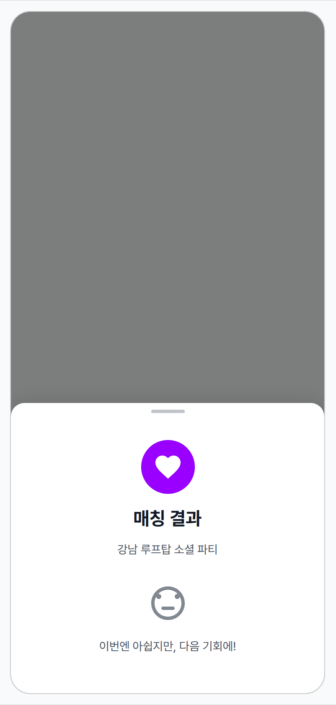

 Spec — EventResultsScreen (app\_user · EventResultsRoute)  

# Event Results

## Overview

| Status | 🚧 디자인중 — 4 state · 홈 위에 올라오는 바텀시트 |
|---|---|
| App | app_user |
| Category | event · routed bottom-sheet · result reveal |
| Route / Surface | EventResultsRoute · widget: EventResultsScreen (홈 위에 올라오는 바텀시트) |
| Path | /events/:id/results |
| Hierarchy | Parent: HomePage — 시트가 올라와도 홈 화면은 어두워진 상태로 그대로 보임. 진입은 EventNowBar가 "결과 발표" 상태일 때 탭.Children: — (매치 카드만 노출 · 후속 액션은 외부 메신저로 이관) |
| Purpose | 매칭 결과 산출 후 사용자가 누구와 매칭됐는지 한 화면에서 확인. 64px hero(하트 아이콘 + "매칭 결과" 타이틀 + 이벤트명 sub)와 그 아래 매치 카드 리스트(이름 · 연락처 · 하트 trailing)로 구성. 매치 0건 / 로딩 / 오류 시 fallback 메시지로 분기. |
| User journey | Entry points: EventNowBar가 "결과 발표" 상태일 때 탭 → 시트가 화면 아래에서 올라옴.Exit points: 핸들 아래로 끌어내리기 · 시트 외곽 어두운 영역 탭 · 시스템 back → 시트 닫힘 (홈 화면 복귀). 결과는 푸시 알림 / 마이페이지 "진행 중인 이벤트"에서 동일 화면으로 재진입 가능. |
| Background | 밍글릿 매칭의 클라이맥스 화면 — 사용자 입력 없이 결과만 노출하는 보기 전용 화면이므로 바텀시트로 가볍게 처리. 매치 카드 자체는 익명성 보호 차원에서 상대 측에서 동의한 연락처만 표시 (연락처 누락 가능). empty fallback("이번엔 아쉽지만, 다음 기회에!")은 사용자가 거절감을 받지 않도록 톤 조절. |
| Frequency | 이벤트 1회당 최대 1회 진입 (결과 확인 후 EventNowBar는 "종료" 상태로 자동 전환). 다만 같은 경로로 deeplink 재진입은 가능. |

## History

이 spec의 주요 변경 이력. 최신 항목 위.

| Date | Version | Author | Changes |
|---|---|---|---|
| 2026-05-01 | 1.0 | mark-yun | v1.4 template으로 신규 작성 — EventNowBar가 "결과 발표" 상태일 때 진입하는 바텀시트. mini-table per state (4종 · baseline = withMatches), 익명성 · empty fallback 정책 명시. |

[🧱 Layout](#layout) [🎨 States](#states) [🔄 Global Behavior](#behavior) [📖 Reference](#reference)

🧱

## Layout

화면 구조 — 어두워진 홈 위에 올라오는 바텀시트 · 상단 모서리만 radius-card · drag handle / hero / list 3 region. 색·타이포 무시.

## Blueprint & tree

아래에서 위로 슬라이드되며 올라오는 바텀시트. **AppBar 없음** — 상단 drag handle(40×4)이 닫기 단서. 시트 내부는 안전 영역(하단 inset 보정). 콘텐츠가 길어지면 시트 자체가 스크롤(현재는 짧은 콘텐츠라 거의 발생하지 않음).

**Modal Bottom Sheet** └─ scrim 0.5 black └─ top corners: _radius-card 16_ └─ box-shadow: _0 -4px 20px rgba(0,0,0,0.10)_ **EventResultsScreen** ├─ _Drag handle_ ← ㉠ │ · 40×4 · radius 2 · text-secondary 흐린 색 · top 8px · centered │ └─ Padding(symmetric · h: spacing-screen-edge · v: spacing-large) └─ 가운데 정렬 stacked column ├─ _Hero icon_ ← ㉡ │ · 64×64 circle · color-primary bg │ · Icon(favorite · 36 · color-background) ├─ Gap: _spacing-medium (16)_ ├─ _Title_ "매칭 결과" ← ㉢ │ · titleLarge · w700 · text-primary ├─ Gap: _spacing-small (8)_ ├─ _Sub_ 이벤트 이름 ← ㉢ │ · bodyMedium · text-secondary · centered ├─ Gap: _spacing-xlarge (32)_ │ └─ 매치 정보 분기: ├─ 매치 1+건: │ ├─ _Count line_ ← ㉣ │ │ · "N명과 매칭되었어요!" · titleSmall · primary · w600 │ ├─ Gap: _spacing-medium (16)_ │ └─ 각 매치마다: │ ├─ **MatchResultCard** ← ㉤ │ └─ Gap: _spacing-small (8)_ ├─ 매치 0건: _EmptyResult_ ├─ 로딩: _120px spinner_ └─ 에러: _EmptyResult_ _(조용히 empty로 폴백)_

| # | Region | Alignment | Spacing |
|---|---|---|---|
| — | Sheet 외부 | screen 하단 부착 · 좌우 풀폭 · top corners radius-card (16) | scrim ~50% black 위에 슬라이드업 · 콘텐츠 길이만큼 height auto |
| ㉠ | Drag handle | top-center | 40×4 · radius 2 · margin-top 8px · text-secondary @35% alpha |
| ㉡ | Hero icon (favorite circle) | centered · column | 64×64 · color-primary bg · icon 36 · gap below: spacing-medium (16) |
| ㉢ | Title + sub | centered · column | title↔sub: spacing-small (8) · sub 아래: spacing-xlarge (32) |
| ㉣ | Count line ("N명과 매칭되었어요!") | centered | titleSmall · primary · w600 · 아래: spacing-medium (16) |
| ㉤ | MatchCard list | vertical stack · 좌우 spacing-screen-edge (16) | card ↔ card: spacing-small (8) · card padding: spacing-medium (16) |

## MatchCard anatomy

매치 1건당 1 카드. avatar · 이름+연락처 · 하트 trailing의 가로 row 구조. radius-card · 1px primary tint border. 익명성 정책: 이름 / 연락처는 상대 측 동의 여부에 따라 노출 또는 누락.

| Element | Behavior |
|---|---|
| Avatar (48 dia 원형) | 상대 프로필 이미지가 있으면 표시, 없으면 person 아이콘 (primary tint). |
| Name | 상대 이름 (없으면 "알 수 없음") · bodyLarge · w700 · 1줄 ellipsis. |
| Contact | 상대가 연락처를 노출 동의한 경우에만 표시. bodySmall · text-secondary · 1줄 ellipsis · 위 gap 2px. |
| Trailing heart | Icon(favorite · primary · 20). |
| Tap | 현재 정의되지 않음 — 카드는 보기 전용. 후속 액션(채팅 등)은 외부 메신저로 이관 예정. |

🎨

## States

시각 변형 4종. baseline = withMatches (1+ 매치). 매치 결과 정보 도착 / 로딩 / 에러 + 빈 리스트로 분기.

매치 정보가 도착했는지, 매치가 있는지, 받아오는 중인지에 따라 분기. 에러는 의도적으로 empty fallback과 동일한 모습 — 사용자 거절감을 완화하기 위함.

### withMatches · 매치 1+ 건 🎯 baseline · 결과 reveal

| 항목 | 내용 |
|---|---|
| 조건 | 매치 정보가 도착했고 매치가 1건 이상 있는 상태. 매칭 알고리즘 cap에 따라 일반적으로 1~3건. |
| 사용자 액션 | · 카드 보기 전용 — 탭 동작 없음· 핸들 아래로 끌어내리기 · 시트 외곽 어두운 영역 탭 · 시스템 back → 시트 닫힘 (홈 복귀). EventNowBar는 잠시 후 "종료" 상태로 자동 전환 (확인 처리). |
| 에지케이스 | · 상대 이름이 비어있으면 "알 수 없음"· 상대 연락처 미동의 시 contact 라인 자체가 사라짐· 상대 프로필 이미지 없을 시 person 아이콘으로 폴백· 매치 4건 이상이면 시트 내부에서 스크롤 |
| 컴포넌트 | · 시트 (color-background · 상단 모서리 radius-card · 안전 영역 보정)· DragHandle (40×4 · text-secondary 흐린 색)· HeroAvatar (64×64 · color-primary bg · Icons.favorite 36)· Title (titleLarge w700) + Sub (bodyMedium text-secondary)· CountLine ("N명과 매칭되었어요!" · titleSmall primary w600)· MatchResultCard × N (avatar 48 · 이름 + 연락처 · trailing heart icon) |
| 토큰 | · color: color-background (sheet bg), color-surface (card bg), color-primary (hero · count · heart · border tint), color-text-primary (title · name), color-text-secondary (sub · contact · handle)· radius: radius-card (16 · sheet top + cards), 50% (avatars)· spacing: spacing-screen-edge (16 · h-padding), spacing-large (24 · v-padding), spacing-xlarge (32 · sub→count gap), spacing-medium (16 · count→list gap), spacing-small (8 · card↔card)· typography: titleLarge (22/700), bodyMedium (14/400), titleSmall (14/600), bodyLarge (16/700), bodySmall (12), caption (11)· opacity: MinglitOpacity.muted (border tint), highlight (avatar bg) |
| 노트 | 📝 결과는 보기 전용 — 거의 인터랙션이 없음. 익명성 정책상 상대가 연락처를 동의하지 않으면 "이름만" 카드로 노출되며, 실제 연락은 상대가 연락처를 등록한 경우에만 가능. |

### empty · 매치 0건 fallback · 거절감 완화 톤

| 항목 | 내용 |
|---|---|
| 조건 | 매치 정보가 도착했지만 매치가 0건인 상태 (양방향 매치 없음). |
| 사용자 액션 | 동일 (보기 전용 · 닫기만 가능). |
| 에지케이스 | · 에러 상태도 동일한 화면으로 폴백 (사용자 입장에서 구분 불필요)· "다음 이벤트 추천" CTA는 현재 미존재 — 후속 후보. |
| 컴포넌트 | ↔ CountLine + MatchResultCard 리스트 → EmptyResult block+ EmptyIcon (Icons.sentiment_neutral · 48 · text-secondary @70% alpha)+ EmptyText ("이번엔 아쉽지만, 다음 기회에!" · bodyMedium · text-secondary)나머지(handle · hero · title · sub) 동일 |
| 토큰 | ↔ icon color → text-secondary @ strong opacity (≈ 0.70)+ spacing-xlarge (32 · 위·아래 v-padding), spacing-medium (16 · icon↔text gap)나머지 동일 |
| 노트 | 📝 hero 영역(64px 하트 + "매칭 결과" 타이틀)은 그대로 유지 — 거절감을 줄이고 "결과를 받았다"는 사실만 부드럽게 전달. |

### loading fetch in flight · 첫 진입 짧은 시간

| 항목 | 내용 |
|---|---|
| 조건 | 시트가 처음 떠서 매치 정보를 받아오는 중 (보통 200~500ms). |
| 사용자 액션 | 동일 (닫기만 가능). |
| 에지케이스 | · 이전에 봤던 매치 정보가 캐시되어 있으면 로딩 없이 바로 결과 노출.· 네트워크 지연 시 스피너 계속 반복 — 별도 타임아웃 미정의. |
| 컴포넌트 | ↔ count + list 영역 → 120px LoadingBlock+ 스피너 (28px primary · 1s linear loop)나머지(handle · hero · title · sub) 동일 |
| 토큰 | + animation: 1s linear infinite (spinner)나머지 동일 |
| 노트 | 📝 hero는 미리 노출 — fetch 중에도 "어떤 이벤트의 결과인지" 컨텍스트는 유지. |

### error fetch 실패 · 의도적 silent degrade → empty와 동일

| 항목 | 내용 |
|---|---|
| 조건 | 매치 정보 받아오기 실패 (네트워크 / 서버 오류). |
| 사용자 액션 | 동일. |
| 에지케이스 | · 다시 시도 버튼 없음 — 사용자 입장에서 empty와 구분 불가 (의도적).· 실제 에러는 모니터링 시스템에 보고됨 (UI에는 표면화하지 않음). |
| 컴포넌트 | 동일 (empty와 시각적으로 동일) |
| 토큰 | 동일 |
| 노트 | 📝 의도된 silent degrade — 결과 화면에서 에러 노출 시 사용자 거절감과 혼동될 수 있어 empty와 동일 fallback. 향후 retry CTA 도입 시 분리 검토. |

🔄

## Global Behavior

cross-cutting — 모든 state에 적용되는 dismiss · motion · 시스템 동작.

## Cross-cutting interactions

| 사용자 액션 | 화면에 보이는 결과 |
|---|---|
| 핸들 아래로 끌어내리기 | 핸들 또는 시트 본문을 아래로 드래그 → 일정 거리 이상 끌면 시트가 슬라이드다운하며 닫힘 (홈 화면 복귀). |
| 시트 외곽 어두운 영역 탭 | 시트가 동일하게 닫힘. |
| 시스템 back / 안드로이드 back gesture | 시트 닫힘. EventNowBar는 잠시 후 "종료" 상태로 자동 전환. |
| 다크 모드 토글 | sheet bg → color-dark-background. card bg → color-dark-surface. scrim 그대로. handle / 텍스트 컬러 dark 토큰으로 자동 swap. |
| 매치 정보 실시간 갱신 | 시트가 열려 있는 동안 새 매치 정보가 도착하면 리스트가 즉시 갱신 (별도 전환 애니메이션 없음). |

## Motion timing

Source: `shared/packages/mds/core/lib/src/theme/minglit_design_tokens.dart`

| Transition | Token / Duration | Notes |
|---|---|---|
| Sheet 슬라이드업 진입 | MinglitAnimation.medium (350ms) | Material 3 modal sheet default · scrim fade-in 동기. |
| Sheet dismiss (swipe / scrim tap) | MinglitAnimation.medium (350ms) | Slide-down + scrim fade-out. drag-to-dismiss는 user velocity 기반. |
| Loading spinner | 1s linear infinite (unscoped) | 스피너 기본 — token 미정의. |
| List → empty / loading → list 교차 | — | 현재 즉시 swap. 향후 MinglitAnimation.fast (200ms) crossfade 도입 후보. |

## Global edge cases

-   **익명성** — 상대 이름 / 연락처는 상대가 동의한 경우에만 노출. 모든 매치가 연락처 미동의면 카드는 "이름만" 표시되고 실제 연락은 불가.
-   **매치 상한** — 매칭 알고리즘 cap에 따라 일반적으로 1~3건. 4건 이상은 시트 내부에서 스크롤.
-   **재진입** — 푸시 알림 / 마이페이지 "진행 중인 이벤트" 등 다른 surface에서도 같은 화면으로 재진입 가능. EventNowBar에서만 진입하는 게 아님.
-   **이벤트 종료 처리** — 시트 닫기 시 EventNowBar가 자동으로 "종료" 상태로 전환 (사용자가 결과를 "확인 처리"한 것으로 간주).
-   **error silent degrade** — 매치 정보 받아오기에 실패하면 empty와 동일한 화면. 사용자에게 다시 시도 옵션은 노출하지 않고 모니터링 시스템에만 보고.

📖

## Reference

implementation source + 인접 화면.

## Implementation source

| Screen widget (계획) | EventResultsScreen — 아직 추출 전. 현재 동등 콘텐츠는 MatchResultsContent가 EventNowBottomSheet 내부 phase로 렌더. |
|---|---|
| Content widget | MatchResultsContent — apps/app_user/lib/src/common/widgets/match_results_content.dart (home + event/admission이 공유) |
| Re-export shim | ResultsContent typedef — apps/app_user/lib/src/features/home/widgets/event_now_phases/results_content.dart (Fix #1934) |
| Current host | EventNowBottomSheet · showModalBottomSheet 호출 — event_now_bottom_sheet.dart |
| Data provider | myMatchesProvider(eventId) · returns List<MatchPair> (Riverpod stream — minglit_kit) |
| Model | MatchPair · fields: matchId · eventId · partnerId · matchedAt · partnerName? · partnerProfileImage? · partnerContact? |
| Route registration (planned) | EventResultsRoute · path /events/:id/results · ModalBottomSheetRoute — app_routes.dart (추후 추가) |

## Related screens

| Spec | Relation |
|---|---|
| EventNowBar | 이 sheet의 진입점. results state 탭 시 push. |
| HomePage | parent route. dismiss 시 복귀하는 surface. |
| EventDetailPage | 매치된 이벤트의 상세. eventEndedWithResults CTA에서도 같은 콘텐츠가 렌더됨 (admission flow의 sibling 사용처). |