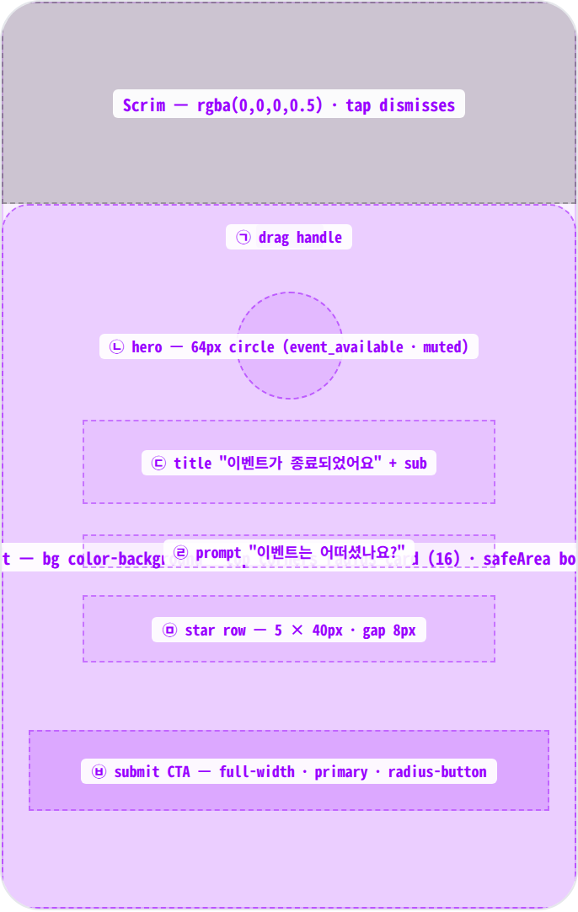
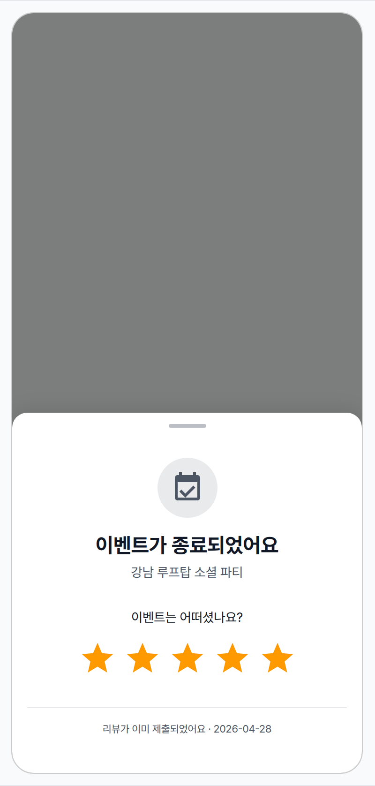
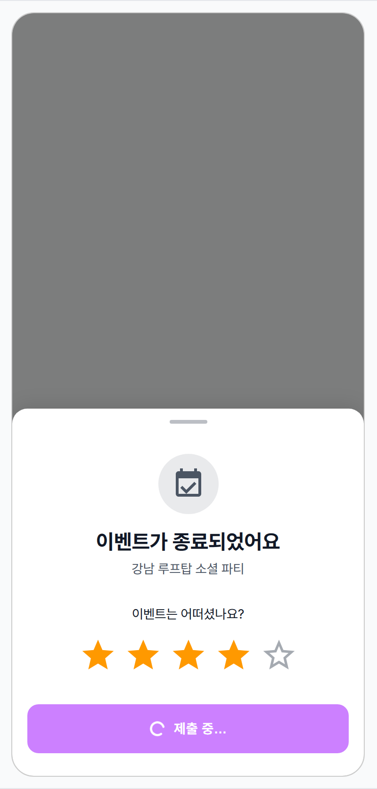
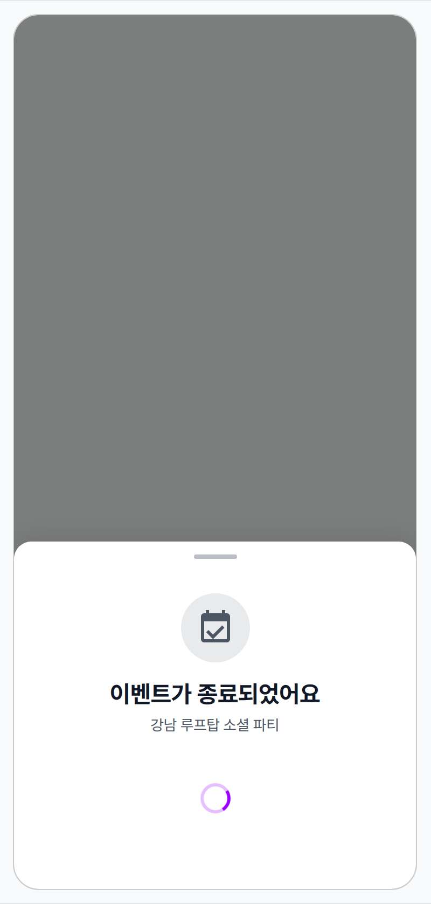
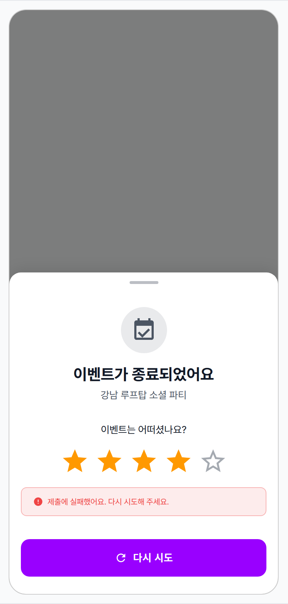

 Spec — EventReviewScreen (app\_user · EventReviewRoute)  

# Event Review

## Overview

| Status | 🚧 디자인중 — 5 state · 홈 위에 올라오는 바텀시트 |
|---|---|
| App | app_user |
| Category | event · routed bottom-sheet · review capture (5-star) |
| Route / Surface | EventReviewRoute · widget: EventReviewScreen (홈 위에 올라오는 바텀시트) |
| Path | /events/:id/review |
| Hierarchy | Parent: HomePage — 시트가 올라와도 홈 화면은 어두워진 상태로 그대로 보임. 진입은 EventNowBar가 "리뷰 가능" 상태일 때 탭.Children: — ("리뷰 작성하기" CTA는 현재 시트 닫기만 수행 — 별도 장문 리뷰 화면은 미정의) |
| Purpose | 이벤트 종료 후 사용자가 1탭으로 별점(1~5)을 남길 수 있는 가벼운 캡처 surface. 64px hero(event_available 아이콘 · text-secondary 톤 · 종료 무드)와 그 아래 prompt + 5-star row + 제출 CTA로 구성. 장문 리뷰는 후속 화면(미설계) 또는 외부로 위임. |
| User journey | Entry points: EventNowBar가 "리뷰 가능" 상태일 때 탭 → 시트가 화면 아래에서 올라옴. 푸시 알림 / 마이페이지 "지난 이벤트" 등에서도 같은 화면으로 재진입 가능 (딥링크).Exit points: 핸들 아래로 끌어내리기 · 시트 외곽 어두운 영역 탭 · 시스템 back · CTA 제출 성공 시 자동 닫힘 → 홈 복귀. 한 번 제출하면 EventNowBar는 잠시 후 사라지거나 보기 전용으로 전환. |
| Background | 매칭의 마지막 단계 — 사용자에게 거절감 없이 가볍게 "이벤트 어땠어?"를 묻는 자리. 별점만 받고 즉시 닫을 수 있도록 friction 최소화. 현재는 별점 입력만 로컬에 임시 보관하고 CTA 탭 시 그대로 닫힘 — 제출 backend 도입 예정. |
| Frequency | 이벤트 1회당 최대 1회(제출 후 보기 전용). 미제출 상태에서는 닫기 / 재진입 반복 가능. |

## History

이 spec의 주요 변경 이력. 최신 항목 위.

| Date | Version | Author | Changes |
|---|---|---|---|
| 2026-05-01 | 1.0 | mark-yun | v1.4 template으로 신규 작성 — EventNowBar가 "리뷰 가능" 상태일 때 진입하는 바텀시트. mini-table 5종(Default · AlreadySubmitted · Submitting · Loading · Error) + 톤 정책 명시. |

[🧱 Layout](#layout) [🎨 States](#states) [🔄 Global Behavior](#behavior) [📖 Reference](#reference)

🧱

## Layout

화면 구조 — 어두워진 홈 위에 올라오는 바텀시트 · 상단 모서리만 radius-card · drag handle / hero / star row / CTA. 색·타이포 무시.

## Blueprint & tree

아래에서 위로 슬라이드되며 올라오는 바텀시트. **AppBar 없음** — 상단 drag handle(40×4)이 닫기 단서. 시트 내부는 안전 영역(하단 inset 보정). 콘텐츠 길이가 짧음(약 460px) — 화면을 거의 넘지 않음.

**Modal Bottom Sheet** └─ scrim 0.5 black └─ top corners: _radius-card 16_ └─ box-shadow: _0 -4px 20px rgba(0,0,0,0.10)_ **EventReviewScreen** ├─ padding: _h: spacing-screen-edge · v: spacing-large_ ├─ 안전 영역 (하단 inset 보정) │ ├─ _Drag handle_ ← ㉠ │ · 40×4 · radius 2 · text-secondary 흐린 색 · margin-top 12 · centered │ └─ 가운데 정렬 stacked column ├─ Gap: _spacing-xlarge (32)_ ├─ _Hero icon_ ← ㉡ │ · 64×64 circle · text-secondary 흐린 톤 bg │ · Icon(event\_available · 36 · text-secondary) ├─ Gap: _spacing-medium (16)_ ├─ _Title_ "이벤트가 종료되었어요" ← ㉢ │ · titleLarge · w700 · text-primary ├─ Gap: _spacing-small (8)_ ├─ _Sub_ 이벤트 이름 ← ㉢ │ · bodyMedium · text-secondary · centered ├─ Gap: _spacing-xlarge (32)_ ├─ _Prompt_ "이벤트는 어떠셨나요?" ← ㉣ │ · bodyMedium · text-primary ├─ Gap: _spacing-medium (16)_ ├─ _StarRatingRow_ ← ㉤ │ · 가운데 정렬 row · 5 × 탭 가능한 별 │ · each: Icon(star/star\_border · 40 · secondary 또는 text-secondary 흐린) │ · 별마다 양 옆 padding 4 (≈ 8 gap) ├─ Gap: _spacing-xlarge (32)_ └─ **제출 CTA "리뷰 작성하기"** ← ㉥ · width: 풀폭 · padding: vertical spacing-medium (16) · icon: rate\_review\_outlined · label: "리뷰 작성하기" · 탭 시: 현재는 시트 닫기, 향후 제출 + 닫기

| # | Region | Alignment | Spacing |
|---|---|---|---|
| — | Sheet 외부 | screen 하단 부착 · 좌우 풀폭 · top corners radius-card (16) | scrim ~50% black 위에 슬라이드업 · 콘텐츠 길이만큼 height auto |
| ㉠ | Drag handle | top-center | 40×4 · radius 2 · margin-top 12 · text-secondary @38% alpha |
| ㉡ | Hero icon (event_available circle) | centered · column | 64×64 · text-secondary @subtle bg · icon 36 · gap below: spacing-medium (16) |
| ㉢ | Title + sub | centered · column | title↔sub: spacing-small (8) · sub 아래: spacing-xlarge (32) |
| ㉣ | Prompt "이벤트는 어떠셨나요?" | centered | bodyMedium · text-primary · 아래: spacing-medium (16) |
| ㉤ | Star rating row | Row · main: center | 5 × 40px · 각 GestureDetector h-padding 4 (≈ 8px gap) · 아래: spacing-xlarge (32) |
| ㉥ | Submit CTA | full-width · centered icon+label | radius-button (12) · padding-v: spacing-medium (16) · primary bg |

## StarRatingRow anatomy

별 5개가 가로로 나란히 표시. 사용자가 N번째 별을 탭하면 1~N번째 별이 모두 채워짐 (누적형 5-star UX).

| Element | Behavior |
|---|---|
| Star icon (filled) | Icons.star · 40px · color-secondary (brand accent · 노란/주황 톤) |
| Star icon (empty) | Icons.star_border · 40px · text-secondary 흐린 톤 |
| Tap target | 각 별: 40+8 = 48px (권장 탭 최소 영역 충족) · 별도 ripple 없음. |
| State holding | 별점 값은 시트 내부에 임시 보관. 닫고 다시 열면 초기화 (제출 backend 도입 후에는 서버 보존). |
| Cumulative fill | "3별 탭 → 1·2·3 모두 filled" — 누적형. |
| 0별 | 초기 별점 0 — 모두 outline. CTA 비활성 처리 권장 (현재는 미적용). |

🎨

## States

시각 변형 5종. baseline = default (별점 입력 가능 · 미제출). 나머지: alreadySubmitted · submitting · loading · error.

이미 제출했는지 여부, 제출 진행 중인지, 정보를 받아오는 중인지에 따라 5종으로 분기. 현재는 별점 입력만 동작 — 나머지 4종은 backend 제출 도입 후 활성화 예정.

### default · 5-star 입력 가능 🎯 baseline · 미제출

| 항목 | 내용 |
|---|---|
| 조건 | EventNowBar "리뷰 가능" 상태 탭 직후 진입 · 아직 별점을 제출하지 않은 상태 · 별점은 0 또는 사용자가 한 번이라도 탭한 값(예: 4). |
| 사용자 액션 | · 별 탭 → 별점이 갱신, 누적으로 채워짐· "리뷰 작성하기" 탭 → 제출 (향후) / 현재는 즉시 닫힘· 핸들 아래로 끌어내리기 · 시트 외곽 어두운 영역 탭 · 시스템 back → 시트 닫힘 (미제출 상태 유지). |
| 에지케이스 | · 0별 상태에서 CTA 탭 → 권장: 비활성 (현재는 그대로 닫힘)· 매우 긴 이벤트 제목 → 1줄 ellipsis 권장 (현재는 줄바꿈)· 텍스트 입력 없음 — 키보드 미사용. |
| 컴포넌트 | · 시트 (color-background · 상단 모서리 radius-card · 안전 영역 보정)· DragHandle (40×4 · text-secondary 흐린 색)· HeroCircle (64 · text-secondary 흐린 톤 bg · Icon(event_available · 36 · text-secondary))· Title (titleLarge w700) + Sub (bodyMedium text-secondary)· Prompt ("이벤트는 어떠셨나요?" · bodyMedium · text-primary)· StarRatingRow (5 × star/star_border · 40 · secondary 또는 text-secondary 흐린 톤)· 제출 CTA (풀폭 · rate_review_outlined · "리뷰 작성하기") |
| 토큰 | · color: color-background (sheet bg), color-text-primary (title · prompt), color-text-secondary (sub · hero icon · empty stars · handle), color-secondary (filled stars), color-primary (CTA bg)· radius: radius-card (16 · sheet top), radius-button (12 · CTA), 50% (hero)· spacing: spacing-screen-edge (16 · h-padding), spacing-large (24 · v-padding), spacing-xlarge (32 · 핸들↓·sub↓·prompt↑·CTA↑), spacing-medium (16 · hero↓·prompt↓), spacing-small (8 · title↔sub)· typography: titleLarge (22/700), bodyMedium (14/400 · prompt+sub), button (14/600)· opacity: MinglitOpacity.subtle (hero bg), scrimMedium (empty star color), muted (handle alpha base) |
| 노트 | 📝 현재는 별점 입력만 임시 보관하고 CTA 탭 시 그대로 시트 닫힘 — 제출 backend 도입 예정. |

### alreadySubmitted · 기제출 (read-only) 이미 별점 남긴 후 재진입

| 항목 | 내용 |
|---|---|
| 조건 | + 사용자가 같은 이벤트에 이미 별점을 제출한 상태에서 재진입. 푸시 알림 / 마이페이지 등에서 진입. |
| 사용자 액션 | − 별 탭 비활성 (보기 전용)− CTA 미노출+ 하단 "리뷰가 이미 제출되었어요 · {날짜}" caption· 시트 닫기는 동일. |
| 에지케이스 | · 별점 수정 불가 (1회 한정 · 정책)· 제출 직후 자동 전환 — 사용자가 시트 안에서 보지 못하고 닫힐 수도 있음 (서버 응답 후 자동 닫힘). |
| 컴포넌트 | ↔ StarRatingRow → 보기 전용 5-star (별점은 기존 제출값으로 채워짐)− 제출 CTA+ SubmittedCaption ("리뷰가 이미 제출되었어요 · {날짜}" · caption · text-secondary · 위에 1px divider) |
| 토큰 | + color-divider (1px top border on caption block)+ typography caption (11/400)나머지 동일 |
| 노트 | 📝 정책 미확정 — 제출 후 시트를 자동 닫을지, 보기 전용으로 보존할지 결정 필요. 본 spec은 "재진입 시 보기 전용 노출" 시나리오 가정. |

### submitting · 제출 중 CTA 탭 직후 · network in flight

| 항목 | 내용 |
|---|---|
| 조건 | + CTA 탭 후 제출 응답을 기다리는 중 (보통 200~600ms). |
| 사용자 액션 | − 별 탭 비활성↔ CTA 비활성 · label "제출 중…" + 좌측 스피너· 시트 닫기 차단 권장 (사용자 의도 모호 방지). |
| 에지케이스 | · 응답 지연(2초+) → 스피너 계속 — 별도 타임아웃 UI 미정의· 제출 성공 → 자동으로 시트 닫히고 "리뷰가 등록되었어요" 안내가 잠깐 노출· 중복 탭 방지 — 비활성 처리로 충분. |
| 컴포넌트 | ↔ StarRatingRow → 비활성↔ 제출 CTA → 비활성 + 좌측에 18px 스피너 + label "제출 중…" |
| 토큰 | + animation: 1s linear infinite (spinner · unscoped — token 미정의)+ opacity 0.5 (disabled CTA)나머지 동일 |
| 노트 | 📝 제출 backend 도입 후 활성화될 상태. 현재는 즉시 닫히므로 이 상태 미발생. |

### loading · 기존 리뷰 조회 중 sheet 진입 직후 · existingReview 조회

| 항목 | 내용 |
|---|---|
| 조건 | + 시트 진입 직후 기제출 여부를 조회하는 중 (보통 100~400ms · 캐시되면 skip). |
| 사용자 액션 | · 시트 닫기만 가능− star row · prompt · CTA 미노출. |
| 에지케이스 | · 캐시가 있으면 로딩 없이 즉시 결과 노출 (대부분의 경우)· 매우 느린 응답(3초+) → 사용자가 시트 닫고 다시 진입할 수 있음 — 중복 요청 방지 권장. |
| 컴포넌트 | − Prompt · StarRatingRow · 제출 CTA↔ 그 자리에 120px LoadingBlock + 28px 스피너 (1s linear loop)나머지(handle · hero · title · sub) 동일. |
| 토큰 | + animation: 1s linear infinite (spinner)나머지 동일 |
| 노트 | 📝 hero · title · sub는 미리 노출 — fetch 중에도 "어떤 이벤트의 리뷰 화면인지" 컨텍스트 유지. |

### error · 제출 실패 네트워크 / 5xx 등 · retry 가능

| 항목 | 내용 |
|---|---|
| 조건 | + 제출 실패 (network · 5xx · 검증 오류 등). |
| 사용자 액션 | · 별 탭 가능 (재선택 허용)· "다시 시도" CTA → 제출 재요청· 시트 닫기 → 미제출 상태로 시트 닫힘 (별점은 보존되지 않음). |
| 에지케이스 | · 동일 에러 반복 시 사용자 이탈 가능 — 분석 이벤트로 보고· 별점 0 같은 검증 오류 → CTA 비활성으로 사전 방지 권장· 모니터링 시스템에도 동시 보고. |
| 컴포넌트 | + ErrorBanner (color-error tint bg · 1px error border · radius-small · "제출에 실패했어요. 다시 시도해 주세요.")↔ CTA label → "다시 시도" + Icons.refresh leading icon나머지 동일 |
| 토큰 | + color-error (banner border · text · icon)+ radius-small (8 · banner)나머지 동일 |
| 노트 | 📝 결과 화면은 silent degrade지만, 리뷰는 사용자 액션이 있으므로 명시적 에러 노출 + 다시 시도 CTA를 둔다 (거절감 무관 · 단순 시스템 오류). |

🔄

## Global Behavior

cross-cutting — 모든 state에 적용되는 dismiss · motion · 시스템 동작.

## Cross-cutting interactions

| 사용자 액션 | 화면에 보이는 결과 |
|---|---|
| 핸들 아래로 끌어내리기 | 핸들 또는 시트 본문을 아래로 드래그 → 일정 거리 이상 끌면 시트가 슬라이드다운하며 닫힘 (홈 복귀). 제출 중에는 차단 권장. |
| 시트 외곽 어두운 영역 탭 | 시트 동일하게 닫힘. 제출 중에는 차단 권장. |
| 시스템 back / 안드로이드 back gesture | 시트 닫힘. 미제출이면 EventNowBar는 "리뷰 가능" 상태 유지 — 다음 진입에 같은 시트를 다시 노출 가능. |
| 제출 성공 | 시트 자동 닫힘 → 홈 복귀 + "리뷰가 등록되었어요" 안내가 잠깐 노출. EventNowBar는 잠시 후 사라지거나 보기 전용으로 전환. |
| 다크 모드 토글 | sheet bg → color-dark-background. handle / 텍스트 / 별 컬러 dark 토큰으로 자동 swap. scrim 그대로. |
| 기제출 정보 실시간 갱신 | 시트가 열려 있는 동안 새 정보가 도착하면 default → alreadySubmitted로 즉시 swap (별도 전환 애니메이션 없음). |

## Motion timing

Source: `shared/packages/mds/core/lib/src/theme/minglit_design_tokens.dart`

| Transition | Token / Duration | Notes |
|---|---|---|
| Sheet 슬라이드업 진입 | MinglitAnimation.medium (350ms) | Material 3 modal sheet default · scrim fade-in 동기. |
| Sheet dismiss (swipe / scrim tap / 제출 성공 auto-pop) | MinglitAnimation.medium (350ms) | Slide-down + scrim fade-out. drag-to-dismiss는 user velocity 기반. |
| 별 탭 → fill toggle | MinglitAnimation.micro (100ms) | 현재 widget은 setState만 — 별도 transition 없음. 향후 fill in 효과 도입 시 micro 권장. |
| CTA 탭 → submitting transition | MinglitAnimation.fast (200ms) | label "리뷰 작성하기" → "제출 중…" crossfade 권장 (현재 cut). |
| Loading / submitting spinner | 1s linear infinite (unscoped) | 스피너 기본 — token 미정의. |

## Global edge cases

-   **0별 제출 방지** — 별점 0 상태의 CTA는 비활성이 권장 정책. 현재는 그대로 닫히므로 향후 backend 도입 시 수정 필요.
-   **1회 한정** — 한 사용자 / 한 이벤트 / 한 리뷰. 이미 제출한 상태에서는 별점 수정 불가. 정책 변경 시 별도 edit 화면 도입 검토.
-   **재진입 딥링크** — 푸시 알림 / 마이페이지 "지난 이벤트" 등 EventNowBar 외에서도 같은 화면으로 진입 가능. 이 경우 보기 전용 상태로 자주 진입.
-   **제출 중 닫기 차단** — 네트워크 진행 중 핸들 / 외곽 / back으로 닫으면 사용자 의도 모호 발생. 시트 닫기 차단 권장 (현재 미구현).
-   **익명성** — 별점은 파트너 측에 평균값으로만 노출. 개별 사용자 식별 X. 본 spec은 capture surface — 노출 surface는 별도 (파트너 분석 페이지).

📖

## Reference

implementation source + 인접 화면.

## Implementation source

| Screen widget (계획) | EventReviewScreen — 아직 추출 전. 현재 동등 콘텐츠는 EndedContent가 EventNowBottomSheet 내부 phase로 렌더. |
|---|---|
| Content widget | EndedContent — apps/app_user/lib/src/features/home/widgets/event_now_phases/ended_content.dart (Fix #665) |
| Star row | _StarRatingRow · same file · 5 × Icon(star/star_border) · local int _rating |
| Drag handle | _DragHandle · same file · 40×4 · text-secondary @muted |
| Current host | EventNowBottomSheet · showModalBottomSheet 호출 — event_now_bottom_sheet.dart |
| Data provider | — (existingReviewProvider(eventId) · submitReviewProvider 모두 미구현 — Fix #665 TODO) |
| Model | — (EventReview · fields TBD: reviewId · eventId · userId · rating · createdAt) |
| Route registration (planned) | EventReviewRoute · path /events/:id/review · ModalBottomSheetRoute — app_routes.dart (추후 추가 · 현재 routes 파일에 미존재) |

## Related screens

| Spec | Relation |
|---|---|
| EventNowBar | 이 sheet의 진입점. ended state 탭 시 push. |
| HomePage | parent route. dismiss 시 복귀하는 surface. |
| EventResultsScreen | 직전 phase의 sibling sheet. results dismiss 후 EventNowBar는 ended state로 전환되며 본 sheet로 진입. |
| EventDetailPage | 이벤트의 상세 화면. 종료된 이벤트 카드 탭 시 "리뷰 남기기" CTA 진입점이 될 수도 있음 (정책 미확정). |