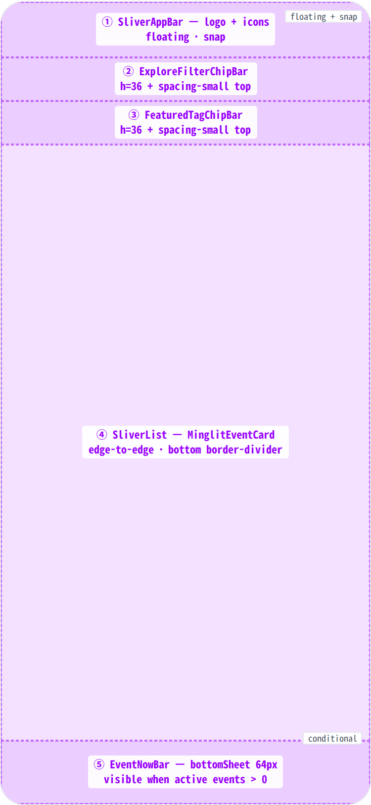
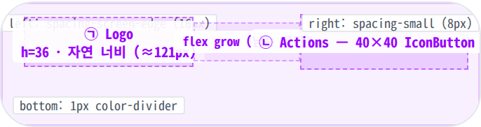
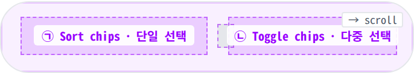
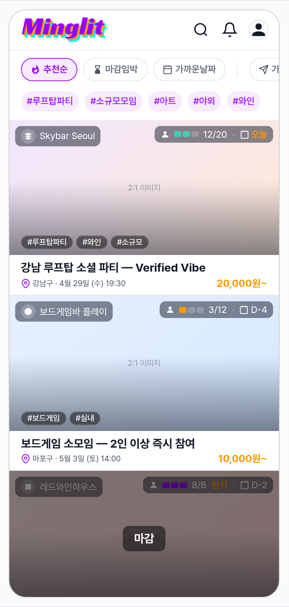
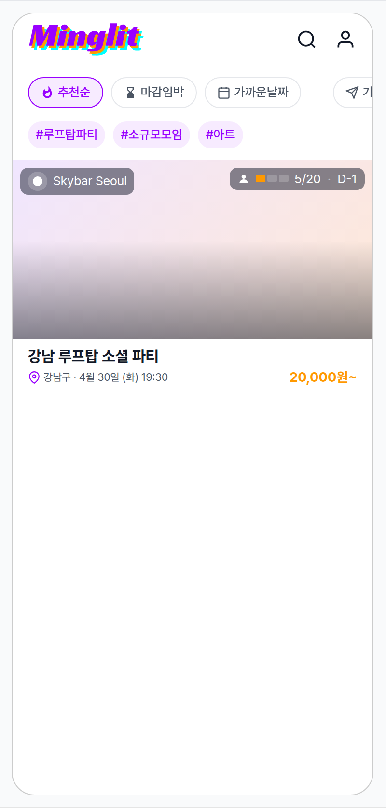
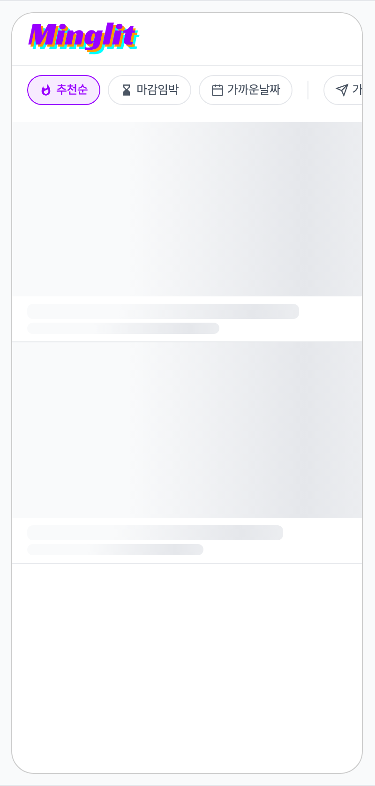
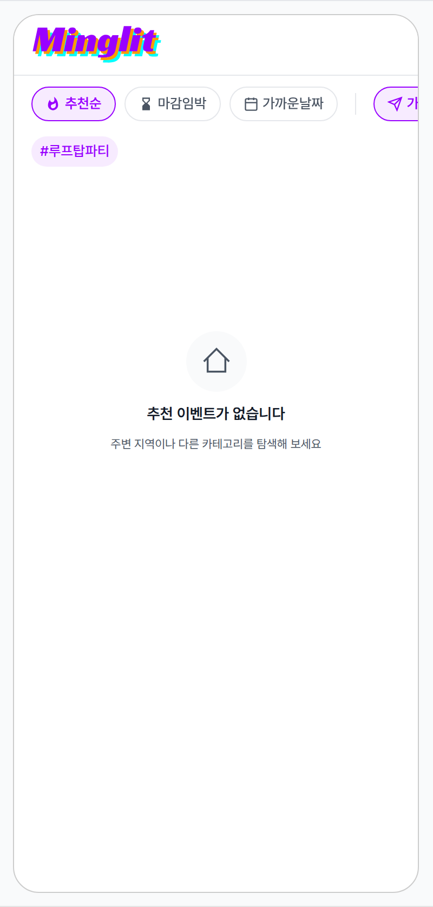
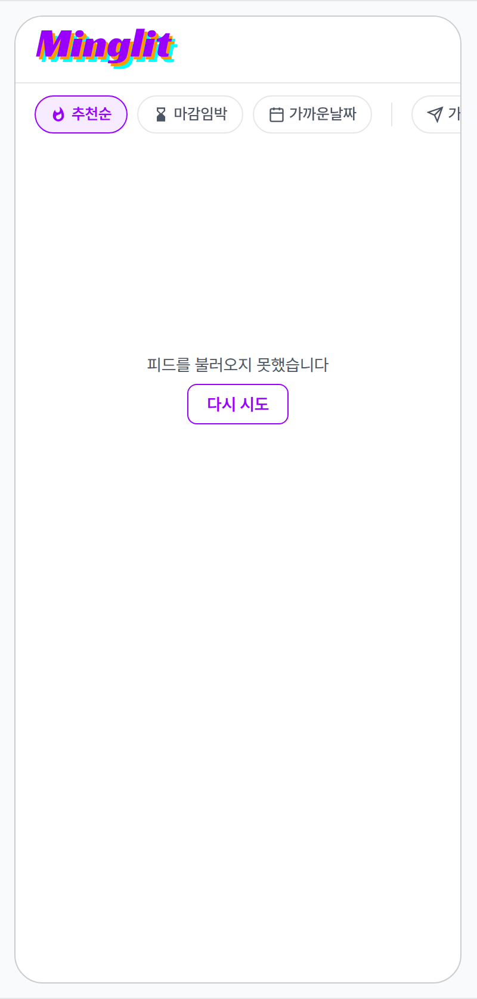
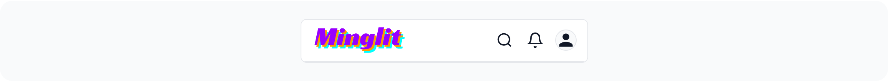
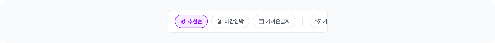

 Spec — HomePage (app\_user · HomeRoute)  

# Home

## Overview

| Status | ✅ 디자인완료 — 5 page-level state · 2 sub-component spec(EventCard / EventNowBar) 분리 |
|---|---|
| App | app_user |
| Category | home · feed · entry hub |
| Route / Surface | HomeRoute · widget: HomePage |
| Path | / |
| Hierarchy | Parent: — (top-level screen — 앱의 기본 진입 화면)Children: MinglitEventCard (피드 cell — 4 state) · EventNowBar (Scaffold.bottomSheet — 7 visible state · 5 routed sheet 진입점) |
| Purpose | 인증된 사용자가 추천 이벤트를 탐색하고, 관심 있는 이벤트 상세 페이지로 진입하는 앱의 중심 허브. 필터·태그·피드를 통해 원하는 모임을 빠르게 발견하도록 돕는다. |
| User journey | Entry points: 로그인 성공 후 자동 이동 / 하단 탭 홈 버튼 탭 / 앱 재진입.Exit points: 이벤트 카드 탭 → EventDetailPage / 검색 아이콘 → SearchPage / 알림 아이콘 → NotificationCenter / 프로필 아이콘 → MyPage / EventNowBar 탭 → phase별 routed sheet (check-in / matching / results / review) / 태그 칩 탭 → TagEventListPage. |
| Background | 밍글릿의 핵심 가치인 "Verified Vibe" 탐색 경험을 실현하는 화면. 추천 피드는 pgvector 기반 개인화 알고리즘으로 구성되며, 필터(추천순·마감임박·가까운날짜)와 위치 기반 근거리 토글로 세밀하게 조정 가능. 오늘 참여 중인 이벤트가 있을 때에만 하단에 EventNowBar가 고정 표시되어 실시간 이벤트 상태를 빠르게 확인할 수 있다. |
| Frequency | 매일 여러 번 — 앱의 기본 진입 화면. |

## History

이 spec의 주요 변경 이력. 최신 항목 위.

| Date | Version | Author | Changes |
|---|---|---|---|
| 2026-05-01 | 1.0 | mark-yun | v1.4 template으로 마이그레이션. EventCard / EventNowBar sub-anatomy 및 visual gallery 분리 → event_card.html · event_now_bar.html로 별도 spec. home_page는 page-level scaffold (AppBar + Filter chip bar + Feed + bottomSheet 슬롯)에 집중. 5 page-level state → mini-table per state (default · guest · loading · feed empty · error). additive diff 패턴. |

[🧱 Layout](#layout) [🎨 States](#states) [🔄 Global Behavior](#behavior) [📖 Reference](#reference)

🧱

## Layout

화면 구조 — 영역, 정렬, 간격 규칙. 색·타이포 무시.

## Blueprint & tree

Floating SliverAppBar(snap+floating) + 고정 chip 바 2단 + 무한 피드(SliverList, edge-to-edge). 오늘 활성 이벤트가 있으면 하단에 64px EventNowBar가 bottomSheet으로 고정. 전체 스크롤은 CustomScrollView — AppBar만 floating.

**Scaffold** ├─ _floatingActionButton_: **BugReportFab** (dev-only) ├─ _bottomSheet_: **EventNowBar** (h=64) ← ⑤ _(conditional)_ └─ **body**: **RefreshIndicator** └─ **CustomScrollView** ├─ **SliverAppBar**(floating, snap) ← ① │ ├─ title: **Logo** (h=36 · tap → scroll-to-top) │ ├─ actions: **BugReportAction** (dev) │ │ **IconButton** search (tooltip "검색") │ │ **IconButton** notifications (tooltip "알림") _(authenticated)_ │ │ **CircleAvatar** 28px profile (wrap IconButton tooltip "마이페이지") _(authenticated)_ │ │ **IconButton** person\_outline (tooltip "마이페이지") _(unauthenticated)_ │ └─ backgroundColor: surface │ ├─ **SliverToBoxAdapter** ← ② │ └─ **ExploreFilterChipBar** (h=36, padding-top: _spacing-small=8px_) │ ├─ FilterChip: 추천순 · 마감임박 · 가까운날짜 _(sort, single-select)_ │ ├─ VerticalDivider │ └─ FilterChip: 가까운 거리 · 참여 가능 _(toggle)_ │ ├─ **SliverToBoxAdapter** ← ③ │ └─ **FeaturedTagChipBar** (h=36, padding-top: _spacing-small_) │ └─ TagChip(#태그이름) × N _(hidden if empty)_ │ └─ _Feed content_ ← ④ ├─ \[loading\] **SliverFillRemaining** → **MinglitCircularProgressIndicator** ├─ \[empty\] **SliverFillRemaining** → **MinglitEmptyState** ├─ \[error\] **SliverFillRemaining** → error Text + TextButton 재시도 └─ \[data\] **SliverList** └─ **MinglitEventCard** × N (edge-to-edge, bottom border-divider) padding-bottom: (EventNowBar height + safe area + _spacing-medium_)

## Spacing & alignment rules

| # | Region | Alignment | Spacing |
|---|---|---|---|
| — | AppBar 좌우 여백 | — | left: spacing-screen-edge (16px) · right: spacing-small (8px) (icon trailing) |
| ① | SliverAppBar | crossAxis: stretch · height 56px | titleSpacing: 0 (logo 직접 배치) |
| ② | ExploreFilterChipBar | crossAxis: center · horizontal scroll | h-padding: spacing-medium (16px) · chip gap: spacing-small (8px) · top: spacing-small (8px) |
| ③ | FeaturedTagChipBar | crossAxis: center · horizontal scroll | h-padding: spacing-medium (16px) · chip gap: spacing-small (8px) · top: spacing-small (8px) |
| ④ | Feed (SliverList) | column stretch · 카드 edge-to-edge 풀폭 | per-card h-margin 없음 — bottom border-divider로 카드 분리. top: spacing-small · bottom: EventNowBar+safeArea+spacing-medium |
| ⑤ | EventNowBar | crossAxis: center · bottomSheet 고정 | h-padding: spacing-screen-edge (16px) · dot↔title: spacing-sm (12px) · status↔trailing: spacing-small (8px) |

## AppBar anatomy (ⓐ)

상단 56px SliverAppBar — 로고 + trailing 액션 아이콘 그룹. floating + snap (스크롤 시 즉시 숨김/노출). Material AppBar의 기본 titleSpacing(16px)을 사용 — 로고가 좌측 가장자리에서 정확히 16px 떨어진 위치에 정렬됨. 액션 아이콘은 우측 끝까지 채워 배치 (margin-left: auto로 push) — 로고와 액션 사이 빈 공간이 생긴다.

**SliverAppBar**(floating: true, snap: true, height: 56) └─ Row(crossAxis: center) ├─ Padding(left: _spacing-screen-edge = 16px_) │ ├─ _Logo_ ← ㉠ │ └─ **SVG image**(height: 36, 자연 너비 ≈121) │ · onTap → 스크롤 top │ · 좌측 가장자리에서 spacing-screen-edge(16px) 떨어진 곳에 정렬 │ ├─ **Spacer** (flex: grow) │ _로고 ↔ 액션 사이 빈 공간 — 화면 너비 따라 가변_ │ ├─ _Actions_ ← ㉡ │ ├─ \[dev\] **BugReportAction** (visibleForTesting) │ ├─ **IconButton**(Icons.search, 22, tooltip "검색") — 40×40 hit zone │ ├─ **IconButton**(Icons.notifications\_outlined, 22, tooltip "알림") _— authenticated only_ │ └─ **CircleAvatar**(28, wrap tooltip "마이페이지") _or_ **IconButton**(person\_outline, 22, tooltip "마이페이지") │ _— authenticated → 프로필 사진 / unauthenticated → 사람 아이콘_ │ └─ Padding(right: _spacing-small = 8px_) _Bottom border:_ 1px solid _color-divider_ (하단 1px 라인) _Background:_ _color-background_ (light) / _color-dark-background_ (dark)

| # | Region | Alignment | Spacing |
|---|---|---|---|
| — | AppBar 외부 | height 56 · 풀폭 | left: spacing-screen-edge (16px) · right: spacing-small (8px) · bottom: 1px color-divider |
| ㉠ | Logo | 좌측 정렬 · 자연 너비 (flex 0) | height: 36px · width: auto · 좌측 가장자리에서 16px |
| — | Spacer | flex grow (남는 공간 흡수) | 로고 우측 끝 ↔ 액션 좌측 끝 사이 가변 폭 |
| ㉡ | Actions | 우측 끝 정렬 · margin-left: auto로 push | icon 사이 gap: 0 (각 IconButton의 40×40 hit zone에 자체 padding) · icon 시각 사이즈: 22 · avatar: 28 |

## Filter chip bar anatomy (ⓑ)

AppBar 바로 아래 36px 가로 스크롤 영역. 정렬(추천순 · 마감임박 · 가까운날짜) — 단일 선택. VerticalDivider — 토글(가까운 거리 · 참여 가능) — 다중 선택. 모든 칩은 leading 아이콘 + 라벨 구조. 좌우 가장자리 padding은 `spacing-medium (16px)`.

**SliverToBoxAdapter** └─ **SizedBox**(height: 36) └─ **ListView.scrollable**(horizontal, padding: _spacing-medium = 16_) ├─ _Sort chips group_ ← ㉠ │ ├─ **MinglitFilterChip**(label: '추천순', icon: local\_fire\_department, isSelected: sortType==recommended) │ ├─ Gap: _spacing-small = 8_ │ ├─ **MinglitFilterChip**(label: '마감임박', icon: hourglass\_bottom) │ ├─ Gap: _spacing-small_ │ └─ **MinglitFilterChip**(label: '가까운날짜', icon: event) │ ├─ **VerticalDivider**(width 1, indent 8, h-padding spacing-small) │ └─ _Toggle chips group_ ← ㉡ ├─ **MinglitFilterChip**(label: '가까운 거리', icon: near\_me\_outlined) │ · onTap → 위치 권한 요청 → 활성 ├─ Gap: _spacing-small_ └─ **MinglitFilterChip**(label: '참여 가능', icon: check\_circle\_outline) · onTap → 즉시 토글 _Chip 내부 구조 (MinglitFilterChip):_ height 32 · radius-chip (100px pill) · border 1px color-divider padding: 0 _spacing-sm (12)_ h icon 14 + Gap _xsmall (4)_ + label (chipLabel · w500) active 상태: bg=primary 0.08 · border=primary · color=primary · w600

| # | Region | Alignment | Spacing |
|---|---|---|---|
| — | Bar 외부 | height 36 · 가로 스크롤 | h-padding: spacing-medium (16px) · top: spacing-small (8px) |
| ㉠ | Sort chips (3개) | row · 단일 선택 (선택 시 다른 sort 자동 해제) | chip 사이 gap: spacing-small (8px) |
| — | VerticalDivider | 중앙 정렬 · width 1px · indent 8 | 좌우 padding: spacing-small (8px) |
| ㉡ | Toggle chips (2개) | row · 다중 선택 (각자 독립적 토글) | chip 사이 gap: spacing-small (8px) |
| — | Chip 내부 | row · crossAxis center | padding: 0 spacing-sm (12px) · icon↔label: spacing-xsmall (4px) · icon size: 14 |

## Event card anatomy (ⓓ)

별도 spec으로 분리 — [`MinglitEventCard`](/specs/event_card/index.html) 참고. 4 visible state (normal · today · soldOut · ended), 각 state의 anatomy / 토큰 / 동작은 child spec에 있음.  
  
_⚠️ 이전 inline anatomy / spacing rules 표는 child spec으로 이전됨 (2026-05-01)._

## EventNowBar anatomy (ⓔ)

별도 spec으로 분리 — [`EventNowBar`](/specs/event_now_bar/index.html) 참고. Scaffold의 `bottomSheet` 슬롯에 부착되는 64px persistent bar. 7 visible state + 3 hidden state + 5 routed-sheet 진입점은 child spec에 있음.  
  
_⚠️ 이전 inline anatomy / state table / routed-sheet 매핑은 child spec으로 이전됨 (2026-05-01)._

🎨

## States

시각 변형 5종 (page-level). baseline = Default 로그인. EventCard / EventNowBar 자체 state 변형은 child spec 참고.

**State 식별 기준**: 인증 여부 + 피드 로딩 상태 + 결과 유무에 따라 5가지 page-level 변형. EventCard / EventNowBar 자체 state는 child spec 참고.

### Default · 로그인 + 피드 로드됨 + 이벤트 진행 중 🎯

| 항목 | 내용 |
|---|---|
| 조건 | 로그인된 사용자가 추천 피드를 받았고, 오늘 참여 중인 이벤트가 있어 하단 EventNowBar가 액션 안내를 노출하는 상태. |
| 사용자 액션 | ① 스크롤 → 카드 차례 노출 · 끝에 다다르면 다음 결과가 자동으로 이어짐② EventCard 탭 → EventDetailPage로 이동③ FilterChip 탭 → 필터 적용 (추천순 · 마감임박 · 가까운날짜) → 피드 갱신④ "근처" 토글 → 위치 권한 요청 (필요 시) → 위치 기반 정렬⑤ TagChip 탭 → TagEventListPage로 이동⑥ AppBar 검색 아이콘 → SearchPage / 알림 → NotificationCenter / 아바타 → MyPage⑦ EventNowBar 탭 → 단계별 시트 (child spec) |
| 에지케이스 | · 스크롤 마지막에 도달 → "더 이상 결과 없음" 메시지 (피드 끝)· 위치 권한 거부 후 "근처" 토글 시도 → 권한 다이얼로그 재요청 안내· 동시 활성 이벤트가 여러 건 → EventNowBar에는 가장 임박한 1건만 노출 |
| 컴포넌트 | · MinglitAppBar (검색 · 알림 · 아바타 3개 액션 아이콘)· FilterChipBar (추천순 · 마감임박 · 가까운날짜 · "근처" 토글)· MinglitEventCard 피드 (edge-to-edge · normal/today/soldOut/ended state — child spec)· EventNowBar (Scaffold.bottomSheet · 7 visible state — child spec) |
| 토큰 | · color: color-background, color-surface, color-text-primary, color-text-secondary, color-divider, color-primary (active chip · location icon)· radius: radius-card (16 · EventNowBar top corners), radius-chip (filter chips)· spacing: spacing-screen-edge (16 · h-padding), spacing-medium (16 · feed top), spacing-small (8 · 카드 간 시각 분리), 64+safeArea+spacing-medium (피드 하단 — bar clearance)· typography: appBarTitle (18/600), bodyMedium · bodySmall · labelSmall (chips) |
| 노트 | 📝 가장 많이 쓰이는 page state — 다른 4 state는 이 baseline에서 변경분만. EventCard / EventNowBar 자체 state 변형은 child spec mini-table 참고. |

### Default · 비로그인

| 항목 | 내용 |
|---|---|
| 조건 | 로그인되지 않은 상태로 화면에 진입한 경우. |
| 사용자 액션 | + "로그인하고 시작하기" 탭 → LoginPage로 이동− 그 외 액션은 모두 막힘 (피드 / 칩 / 하단 바 모두 노출되지 않음) |
| 에지케이스 | · 로그인이 완료되면 자동으로 default 상태로 전환. |
| 컴포넌트 | ↔ AppBar 우측 아이콘 → 없음 (검색 · 알림 · 아바타 모두 hidden)↔ Body → 중앙 정렬 login prompt + "로그인하고 시작하기" CTA− FilterChipBar− Feed (EventCards)− EventNowBar |
| 토큰 | 동일 (단, primary CTA 버튼은 color-primary 강조) |
| 노트 | 📝 "Verified Vibe" 컨셉상 비인증은 모든 콘텐츠 차단 — feed/discovery 자체가 보호된 기능. |

### Loading · 피드 로드 중

| 항목 | 내용 |
|---|---|
| 조건 | 피드를 불러오는 중. 진입 직후 또는 풀-다운 새로고침 직후. |
| 사용자 액션 | · AppBar 액션은 가능 (검색 · 알림 · 아바타)· 풀-다운 새로고침으로 다시 트리거 가능 (이미 진행 중이면 무반응)− 피드 / 칩 액션 (스켈레톤 표시 — 미인터랙티브) |
| 에지케이스 | · 응답이 길어지면 스켈레톤이 그대로 유지됨. 별도 타임아웃 없음.· 빠르게 응답이 오면 곧바로 결과 화면으로 전환 (fade 없이 cut). |
| 컴포넌트 | ↔ Feed → 카드 자리 표시(스켈레톤) × 5장 (이미지 자리 회색 + 본문 라인)↔ EventNowBar → 노출되지 않음 |
| 토큰 | + color-divider (skeleton 라인) + shimmer animation (1.5s linear infinite gradient sweep) |
| 노트 | 📝 AppBar / FilterChipBar는 loading 중에도 그대로 표시 — Skeleton는 피드 영역만. |

### Empty · 추천 이벤트 없음

| 항목 | 내용 |
|---|---|
| 조건 | 피드 로드는 완료됐지만 표시할 이벤트가 0건이고 필터도 적용되지 않은 상태. |
| 사용자 액션 | + "필터 초기화" 탭 → 필터를 리셋하고 다시 받아옴+ "검색하기" 탭 → SearchPage로 이동 |
| 에지케이스 | · 필터 적용 후 결과가 0건이면 안내 문구가 다름 ("이 필터로 보이는 이벤트가 없어요").· 비로그인 상태에서는 이 상태에 도달하지 않음. |
| 컴포넌트 | ↔ Feed → 안내 박스 (아이콘 + 타이틀 + 본문 + 액션 버튼 2개)↔ EventNowBar → 노출되지 않음− EventCard, FilterChipBar(필터가 비어있는 상태)는 그대로 |
| 토큰 | + color-text-secondary (empty 아이콘 / 메시지)+ spacing-large (icon ↔ title gap) |
| 노트 | 📝 추천 알고리즘이 결과 0개를 낼 가능성은 낮음 — 신규 사용자 또는 데이터 부족 지역에서만. |

### Error · 피드 로드 실패

| 항목 | 내용 |
|---|---|
| 조건 | 피드를 받아오지 못한 상태. 네트워크 끊김 / 서버 오류 / 타임아웃. |
| 사용자 액션 | + "다시 시도" 탭 → 피드를 다시 불러옴 (Loading 상태로 전환)+ "새로고침" 탭 → 화면 전체를 다시 불러옴 |
| 에지케이스 | · 재시도 시 같은 오류가 반복되면 동일 화면 유지.· 네트워크 회복만으로 자동 재시도되지 않음 — 사용자 액션 필요. |
| 컴포넌트 | ↔ Feed → 안내 박스 (아이콘 + 타이틀 + 본문 + "다시 시도" 버튼)↔ EventNowBar → 노출되지 않음 |
| 토큰 | + color-error (icon · "다시 시도" 버튼 강조)+ spacing-large (icon ↔ title gap) |
| 노트 | 📝 에러 메시지는 generic ("이벤트를 불러오지 못했습니다") — 구체 사유는 dev console에만. |

## AppBar — visual

56px 고정 AppBar. 좌측 16px 안쪽에 brand SVG 로고, 우측 끝에 액션 아이콘 3개 (search · notifications · 프로필). 배경 `color-background`, 하단 1px `color-divider` 라인.

※ 인증 상태에 따라 우측 마지막 슬롯이 바뀜: 로그인 시 28px 원형 아바타(프로필 사진), 비로그인 시 person\_outline 아이콘.

## Filter chip bar — visual

AppBar 바로 아래 36px 가로 스크롤 영역. 정렬(추천순 · 마감임박 · 가까운날짜) — 단일 선택. VerticalDivider — 토글(가까운 거리 · 참여 가능) — 다중 선택. 모든 칩은 **아이콘 + 라벨** 구조 (mds\_icons.dart 직접 참조). active 상태는 primary tint 배경 + primary 보더.

| Chip | Icon | 역할 |
|---|---|---|
| 추천순 | local_fire_department (불꽃) | 정렬 — 단일 선택 (default active) |
| 마감임박 | hourglass_bottom (모래시계) | 정렬 — 단일 선택 |
| 가까운날짜 | event (캘린더) | 정렬 — 단일 선택 |
| 가까운 거리 | near_me_outlined (위치 화살표) | 토글 — 위치 권한 요청 후 활성 |
| 참여 가능 | check_circle_outline (체크 동그라미) | 토글 — 사용자 참여 자격 필터 |

🔄

## Global Behavior

cross-cutting — 모든 page state에 적용. EventCard / EventNowBar 내부 액션은 child spec 참고.

## Cross-cutting interactions

| 사용자 액션 | 화면에 보이는 결과 |
|---|---|
| AppBar 로고 탭 | 피드 스크롤 최상단으로 부드럽게 이동 (MinglitAnimation.medium · easeOut). 이미 최상단이면 무반응. |
| Pull-to-refresh | RefreshIndicator 스피너 → 피드 전체 reload. 완료 후 최신 결과 표시. |
| 피드 하단 도달 (200px 전) | 다음 페이지 자동 로드 — 하단에 spinner 표시. 로드 완료 후 카드 추가. |
| 다크 모드 토글 | 모든 viewport · visual-gallery가 dark 토큰으로 전환. 로고 SVG light/dark 분기. 필터 칩 active 보라 유지. |
| OS back button | HomePage에서는 별도 처리 없음 — Android는 앱 종료 confirm, iOS는 무반응. |

## Motion timing

Source: `shared/packages/mds/core/lib/src/theme/minglit_design_tokens.dart`. EventNowBar 자체 attention-loop 모션은 [child spec](/specs/event_now_bar/index.html) 참고.

| Transition | Token / Duration | Notes |
|---|---|---|
| 화면 진입 (로그인 후 / 탭 전환) | MinglitAnimation.fast (200ms) | 표준 페이지 전환 slide/fade. 캐시된 피드는 즉시 표시. |
| AppBar logo 탭 → 스크롤 top | MinglitAnimation.medium (350ms) | easeOut · 자연스러운 감속. |
| 필터 칩 active 전환 | MinglitAnimation.micro (100ms) | 배경색 fade — 즉각 피드백. |
| 피드 카드 → 상세 화면 | MinglitAnimation.fast (200ms) | GoRouter 좌→우 slide. |
| Pull-to-refresh 스피너 | OS default | Material RefreshIndicator 기본. |
| EventNowBar phase route push | MinglitAnimation.medium (350ms) | ModalBottomSheetRoute slide-up + scrim fade. |

## Global edge cases

-   **FeaturedTagChipBar 비어있음** — 태그 칩 바 height 0으로 접힘. 다음 컨텐츠가 즉시 위로.
-   **클라이언트 필터(근거리/참여가능) 후 첫 페이지 모두 걸러짐** — 빈 목록 대신 로딩 인디케이터 유지 + 다음 페이지 자동 fetch. 더 이상 페이지 없으면 Empty state로 전환.
-   **무한 스크롤 중 추가 오류** — 하단 스피너 사라지고 조용히 실패. 스낵바 없음 (pull-to-refresh로 재시도 유도).
-   **위치 권한 거부 후 "근처" 칩** — 권한 다이얼로그 재요청. 거부 유지 시 스낵바 + 칩 비활성.

📖

## Reference

implementation source + 인접 화면. Components / Tokens는 위 mini-table + child spec 참고.

## Implementation source

| Widget | HomePage — apps/app_user/lib/src/features/home/home_page.dart |
|---|---|
| Route | HomeRoute · / · app_routes.dart |
| Feed provider | recommendationFeedProvider — pgvector 기반 개인화 (loading / data / error AsyncValue 분기 — 5 page state로 노출) |
| Auth gate | currentUserProvider — null 시 guest state 노출 |
| Sub-component widgets | · MinglitEventCard (피드 cell — kit-shared)· EventNowBar (Scaffold.bottomSheet 슬롯 — app_user 한정) |
| Page atoms | MinglitAppBar · FilterChipBar · FeaturedTagChipBar · RefreshIndicator · MinglitCircularProgressIndicator · MinglitEmptyState · MinglitErrorState |

## Related screens

| Spec | Relation |
|---|---|
| MinglitEventCard | 피드의 반복 cell — sub-component spec. |
| EventNowBar | 하단 persistent bar — sub-component spec. 5 routed sheet 진입점은 child spec 참고. |
| EventDetailPage | EventCard 탭 시 이동하는 상세 화면. |
| LoginPage | 비로그인 state에서 진입. |
| Layout foundations | CustomScrollView 기반 단독 scaffold — 하단 탭바 없음 (tab은 Navigator 상위 레이어). |