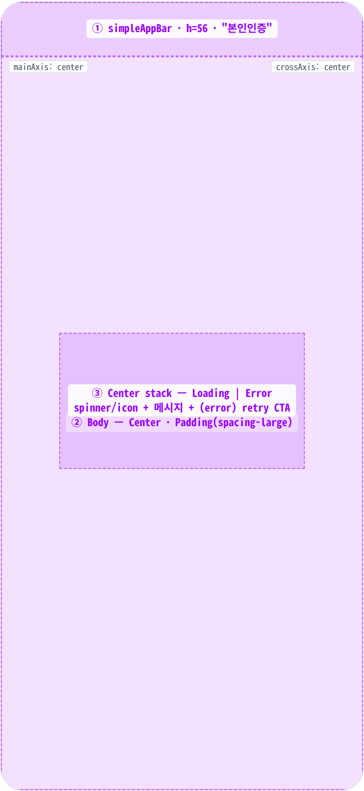
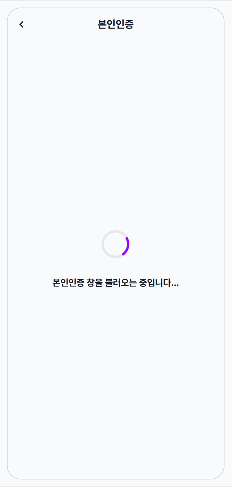
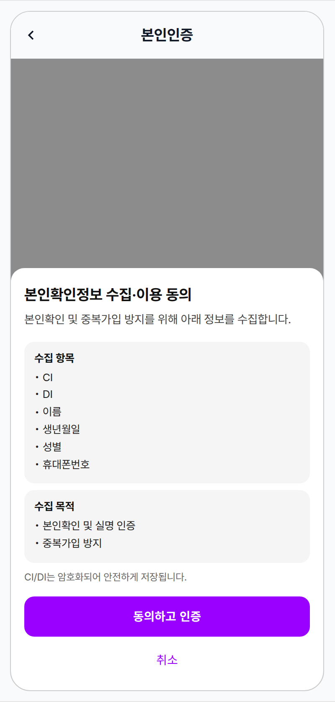
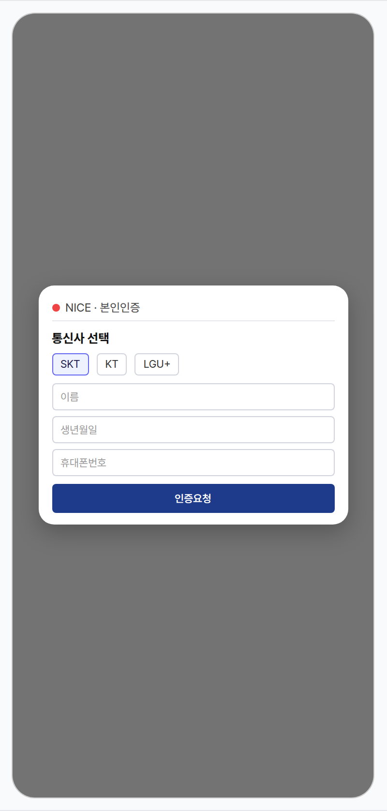
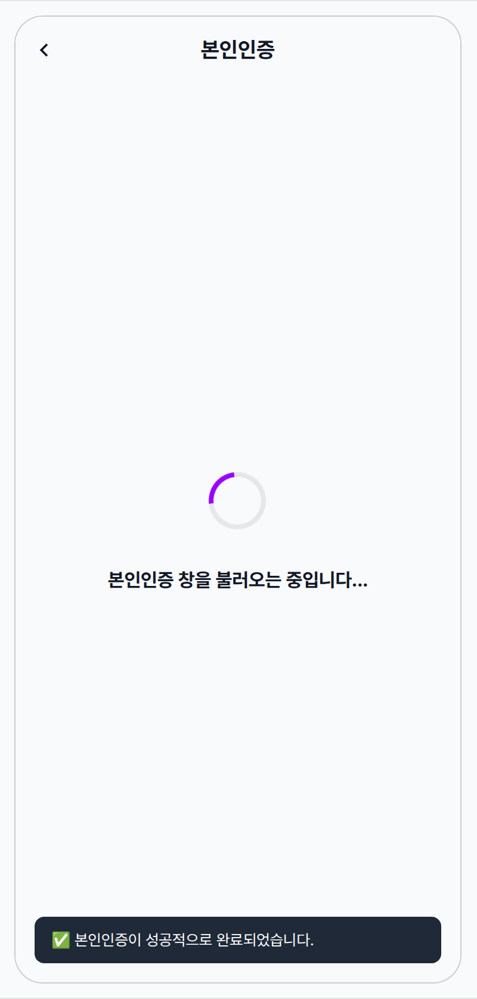
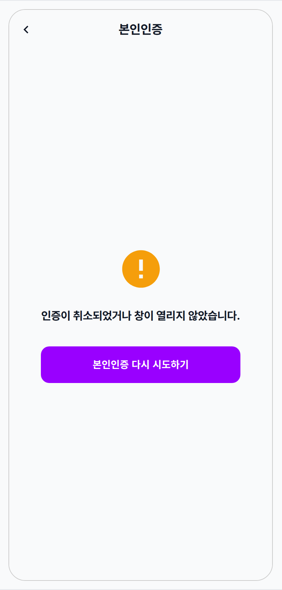

 Spec — IdentityVerificationScreen (kit-shared · CertificationRoute)  

# Identity Verification (본인인증)

## Overview

| Status | ✅ 디자인완료 — 5개 state · 양 앱 공유 (kit) |
|---|---|
| App | shared (app_user · app_partner 둘 다 CertificationRoute로 진입) |
| Category | verification · trust · 신원 확인 (Iamport V2 · NICE) |
| Route / Surface | CertificationRoute · widget: IdentityVerificationScreen (kit-shared) |
| Path | /certification (양 앱 공통) |
| Hierarchy | Parent: — (top-level screen · 양 앱에서 push로 진입)Children: IdentityVerificationConsentSheet (BottomSheet · 동의 미수집 시 자동 표시) |
| Purpose | NICE / KCB CI(연계정보) · DI(중복가입확인정보)를 발급받아 사용자의 실명 신원을 확인한다. 본인확인 동의가 없으면 먼저 BottomSheet로 동의를 수집 후 Iamport SDK의 NICE 인증 창을 띄움. User 앱: 회원가입 후 알림 / 결제 / 파티 참여 시 트리거. Partner 앱: 사업자 신원 확인 단계에서 트리거. |
| User journey | Entry points: 양 앱에서 보호된 액션 시 CertificationRoute push (예: 결제 흐름, 파티 만남, 파트너 입점 신청 단계).Exit points: 인증 성공 → Navigator.pop(true) + SnackBar. 취소 / 실패 → "다시 시도하기" 버튼 또는 AppBar back. |
| Background | 한국 법규(정보통신망법 / 본인확인기관 가이드)상 신원 확인이 필요한 거래(결제 · 매칭 · 사업자 등록 등) 전에 NICE / KCB 본인인증이 강제됨. CI / DI는 암호화되어 안전하게 저장된다. 본인인증에 앞서 별도 동의 시트를 띄우는 이유: 개인정보 수집·이용 동의 적법 처리근거 확보. |
| Frequency | 사용자 1회 (CI/DI 영구 저장 — 회원 탈퇴 시까지). 실패 시 재시도 가능. |

## History

최신 항목 위.

| Date | Version | Author | Changes |
|---|---|---|---|
| 2026-05-01 | 1.0 | mark-yun | v1.4 template으로 작성. kit-shared (양 앱 공유) — 시스템 색만 사용. 5 states (Loading baseline · Consent sheet · WebView 인증 창 · Success / pop · Error / retry). Iamport V2 + NICE 흐름. |

[🧱 Layout](#layout) [🎨 States](#states) [🔄 Global Behavior](#global-behavior) [📖 Reference](#reference)

🧱

## Layout

Scaffold(simpleAppBar + Center body). 인증 창은 Iamport SDK가 자체 호스팅 (full-screen WebView overlay 또는 Custom Tabs).

## Blueprint & tree

Iamport SDK가 띄우는 NICE 인증 창은 **이 Scaffold의 children이 아니라** 별도 native overlay (WebView / Custom Tabs / SFSafariViewController). 본 화면은 인증 창의 entry/exit guard로 동작 — 사용자에게는 spinner나 retry 버튼만 보임.

**Scaffold** ├─ **appBar: MinglitTheme.simpleAppBar(title: '본인인증')** ← ① └─ **body: Center** ← ② └─ **Padding**(`spacing-large (24px)`) └─ **Column**(mainAxis: center) ├─ _Loading branch_ _(\_isLoading == true)_ ← ③ │ ├─ **MinglitCircularProgressIndicator**(size: 48) │ ├─ Gap: `spacing-xlarge (32px)` │ └─ **Text**('본인인증 창을 불러오는 중입니다...' · titleMedium) │ └─ _Error / idle branch_ _(\_isLoading == false)_ ← ③ ├─ **Icon**(error\_outline · 64px · MinglitColors.warning) ├─ Gap: `spacing-large (24px)` ├─ **Text**(\_errorMessage ?? '인증을 진행해주세요.' · titleMedium · center) ├─ Gap: `spacing-xlarge (32px)` └─ **SizedBox**(width: ∞ · height: 52) └─ **ElevatedButton**('본인인증 다시 시도하기')

## Spacing & alignment rules

| # | Region | Alignment | Spacing |
|---|---|---|---|
| — | Body padding | — | all sides: spacing-large (24px) |
| ① | simpleAppBar | title centered · back left | height: 56 · 좌우 spacing-xsmall |
| ② | Center body | Center child (mainAxis · cross axis 중앙) | — |
| ③ | Loading stack — spinner ↔ 메시지 | cross axis: center | gap: spacing-xlarge (32px) |
| ③ | Error stack — icon ↔ 메시지 ↔ CTA | cross axis: center · CTA width: ∞ | icon↔msg: spacing-large (24px) · msg↔CTA: spacing-xlarge (32px) · CTA height: 52 |

🎨

## States

시각 변형 5종 — 로딩 / 동의 시트 / NICE 인증 창 / 성공 / 실패 후 재시도. 사용자가 인지할 수 있는 모든 단계를 나열.

**State 식별 기준**: 로딩 진행 여부 · 에러 메시지 유무 · 동의 시트 노출 여부 · NICE 인증 창 노출 여부. 화면 진입 직후 자동으로 로딩 상태에서 시작.

### State summary

| State | Tag | 조건 (요약) | Key visual differentiator |
|---|---|---|---|
| Loading 🎯 | baseline | 화면 진입 직후 인증 창을 준비하는 동안의 로딩 상태. | 화면 중앙 스피너 + "창을 불러오는 중..." 메시지 |
| Consent sheet | modal | 본인확인 정보 수집·이용 동의가 아직 수집되지 않은 사용자에게만 자동으로 노출되는 시트. | 하단 modal — 수집 항목 / 목적 / 보유 기간 + "동의하고 인증" / "취소" |
| WebView · NICE 인증 | external | 동의가 완료된 뒤 NICE 본인인증 창이 화면에 떠 있는 상태. | NICE 통신사 선택 / 정보 입력 폼 (앱이 호스팅하는 외부 인증 창) |
| Success | complete | 본인인증이 성공적으로 처리되어 화면이 자동으로 종료되기 직전. | "✅ 본인인증이 성공적으로 완료되었습니다" 스낵바가 잠깐 표시된 뒤 화면 종료 |
| Error / retry | failure | 인증이 취소되거나 창이 열리지 않았거나 서버 오류로 실패한 상태. | 경고 아이콘 + 에러 메시지 + "본인인증 다시 시도하기" 버튼 |

### Loading 🎯 baseline · 진입 직후

| 항목 | 내용 |
|---|---|
| 조건 | 화면 진입 직후 인증 창을 준비하는 동안의 로딩 상태. 동의 여부 확인과 NICE 인증 호출 준비가 진행되는 구간. |
| 사용자 액션 | ① AppBar 뒤로가기 탭 — 인증을 마치지 않은 채로 화면이 종료되고 이전 화면으로 복귀.② 그 외 화면에 인터랙션 가능한 요소가 없어 다른 탭은 받아들여지지 않음. |
| 에지케이스 | · 로그인 정보가 없는 채로 진입하면 "로그인이 필요합니다" 메시지와 함께 즉시 실패 화면으로 전환됨.· 디바이스 처리 속도가 느리면 스피너가 평소보다 오래 보일 수 있음. |
| 컴포넌트 | · MinglitTheme.simpleAppBar(title: '본인인증') — ⓐ· MinglitCircularProgressIndicator(size: 48) — ⓑ· Text(titleMedium · "본인인증 창을 불러오는 중입니다...") — ⓒ |
| 토큰 | · color: color-surface (Scaffold + AppBar bg), color-text-primary (메시지 · AppBar title), color-primary (spinner)· spacing: spacing-large (24 · body padding), spacing-xlarge (32 · spinner↔메시지)· typography: titleMedium (16/700/1.4) · AppBar title 18/700 |
| 노트 | 📝 사용자 앱과 파트너 앱이 같은 화면을 공유하므로 파트너 브랜드 색은 사용하지 않고 표준 시스템 색을 그대로 적용. AppBar는 화면 배경과 같은 회색에 구분선 없음. |

### Consent sheet 아직 동의가 수집되지 않은 사용자에게만 노출되는 시트

| 항목 | 내용 |
|---|---|
| 조건 | 본인확인 정보 수집·이용 동의가 아직 한 번도 수집되지 않은 사용자에게만 자동으로 노출되는 시트. |
| 사용자 액션 | ① "동의하고 인증" 탭 — 동의가 저장되고 NICE 인증 창이 열림.② "취소" 탭 — 시트가 닫히고 "본인확인정보 수집·이용 동의 후 인증을 진행할 수 있습니다" 메시지와 함께 실패 화면으로 전환됨.③ 시트 바깥(어두워진 영역) 탭 또는 시스템 뒤로가기 — 취소와 동일하게 처리됨. |
| 에지케이스 | · 시트가 떠 있는 동안 앱이 백그라운드로 가도 시트는 닫히지 않고 그대로 유지됨.· 네트워크 문제로 동의 저장에 실패하면 공통 에러 처리에 따라 실패 화면으로 전환됨. |
| 컴포넌트 | + IdentityVerificationConsentSheet (kit · showMinglitBottomSheet · isScrollControlled: true)+ FilledButton ("동의하고 인증") · TextButton ("취소")+ _ConsentSection × 3 (수집 항목 · 수집 목적 · 보유 기간) |
| 토큰 | + radius-card (16 · 시트 상단 라운드 + section 박스)+ scrim/backdrop opacity (시트 modal default)+ typography: titleLarge (시트 헤더), bodyMedium (설명/항목), bodySmall (CI/DI 안내), titleSmall (section 헤더) |
| 노트 | 📝 시트는 별도 컴포넌트(IdentityVerificationConsentSheet)라 본 화면 spec에서는 레이아웃만 요약. 정식 spec은 추후 별도 페이지로 분리 가능. 동의 없이 NICE 인증으로 진입하지 않는 것이 핵심. |

### WebView · NICE 인증 NICE 본인인증 창이 화면에 떠 있는 상태

| 항목 | 내용 |
|---|---|
| 조건 | 동의가 완료된 직후 NICE 본인인증 창이 앱 위에 외부 인증 창으로 표시된 상태. 인증 창의 디자인은 NICE 측 가이드라인을 따른다. |
| 사용자 액션 | ① 통신사 선택 + 정보 입력 + "인증요청" 탭 — SMS · PASS 등 통신사 인증을 거쳐 성공하면 성공 화면으로 전환됨.② 창 닫기 / 뒤로가기 — 인증이 취소된 것으로 판단되어 "인증이 취소되었거나 창이 열리지 않았습니다" 메시지와 함께 실패 화면으로 전환됨. |
| 에지케이스 | · 웹 / macOS에서 팝업이 차단되면 인증 창 자체가 뜨지 않으므로 즉시 실패 화면으로 전환됨.· NICE 측 점검이나 서버 오류가 발생하면 인증 창 안에서 자체 메시지가 노출됨.· 정부 정책 변화로 인증 흐름(예: 휴대폰 본인확인이 PASS 앱 강제로 변경 등)이 바뀌면 인증 창이 그 흐름을 그대로 따른다. |
| 컴포넌트 | ↔ 로딩 화면 위에 NICE 본인인증 창이 외부 인증 창으로 덮여 있는 상태. 인증 창이 닫히면 아래의 로딩 화면이 다시 보인다. |
| 토큰 | — (인증 창 내부는 NICE 자체 디자인 — 밍글릿 디자인 토큰이 적용되지 않음) |
| 노트 | 📝 mockup은 NICE 실제 화면을 단순화한 시뮬레이션. 실제 화면은 NICE가 정부 가이드라인에 따라 제공하는 페이지. 밍글릿은 인증 창의 내용에 관여하지 않으며 인증 창의 진입과 종료만 관리. |

### Success 인증 성공 — 화면 종료 직전

| 항목 | 내용 |
|---|---|
| 조건 | NICE 인증이 성공적으로 처리된 직후. 성공 스낵바가 표시되고 화면이 자동으로 종료되어 이전 화면으로 돌아감. |
| 사용자 액션 | — (인터랙션 없음. 화면이 자동으로 닫히고 사용자는 스낵바만 잠깐 본 뒤 이전 화면으로 복귀.) |
| 에지케이스 | · 인증 결과 검증이 서버 오류로 실패하면 실패 화면으로 전환됨.· 화면이 이미 닫힌 상태라면 스낵바는 노출되지 않음. |
| 컴포넌트 | + SnackBar (한 줄 메시지 · 약 4초 표시)· 화면 종료 직전이라 본 화면은 마지막으로 로딩 모습이 그대로 유지됨. |
| 토큰 | + 스낵바 자체 색 (Material 기본). 화면이 보이는 시간은 보통 수백 ms 정도. |
| 노트 | 📝 본 화면 자체는 거의 노출되지 않은 채 즉시 종료됨. 스낵바는 이전 화면에서 잠깐 보이는 형태가 될 수도 있음. |

### Error / retry 실패 — 사용자가 다시 시도해야 하는 상태

| 항목 | 내용 |
|---|---|
| 조건 | 인증이 정상적으로 완료되지 못한 상태. 발생 경로: ① 동의 시트에서 취소를 눌렀을 때 ② 인증 창에서 사용자가 인증을 취소했거나 창이 열리지 않았을 때 ③ NICE 또는 서버에서 오류가 발생했을 때. |
| 사용자 액션 | ① "본인인증 다시 시도하기" 버튼 탭 — 처음부터 다시 시작. 이미 동의가 완료된 상태라면 NICE 인증 창부터 바로 노출됨.② AppBar 뒤로가기 탭 — 인증을 마치지 않은 채로 화면을 종료하고 이전 화면으로 복귀. 이후 재시도는 호출 화면이 책임. |
| 에지케이스 | · 로그인 정보가 없으면 메시지가 "로그인이 필요합니다."로 바뀜.· 동의 시트에서 취소한 경우는 "본인확인정보 수집·이용 동의 후 인증을 진행할 수 있습니다"라는 별도 메시지가 보이며 별도 스낵바는 노출되지 않음. |
| 컴포넌트 | ↔ 스피너 자리가 경고 아이콘 (Icons.error_outline · 64px · MinglitColors.warning)으로 교체됨+ ElevatedButton ("본인인증 다시 시도하기" · 화면 가로 풀폭 · height 52)↔ 로딩 메시지 자리에 상황별 에러 메시지 (메시지가 없으면 "인증을 진행해주세요.") |
| 토큰 | + MinglitColors.warning (#f59e0b 계열 · 경고 아이콘 — error 토큰이 아닌 warning 토큰 사용)↔ spinner gap → spacing-large (24 · icon↔메시지)+ ElevatedButton: color-primary bg · radius-button (12) · height 52 |
| 노트 | 📝 아이콘 색은 빨간 error 톤이 아닌 주황 warning 톤을 사용. 의도는 "사용자가 다시 시도하면 회복 가능"한 상태임을 강조하기 위함 (시스템 자체 실패가 아닌 사용자 개입으로 해결되는 케이스). |

🔄

## Global Behavior

화면 전반 — Iamport lifecycle, consent gate, 양 앱 공유 특성.

## Cross-cutting interactions

| 사용자 액션 | 화면에 보이는 결과 |
|---|---|
| AppBar 뒤로가기 / OS 뒤로가기 / 스와이프 | 어떤 상태에서든 인증을 미완료한 상태로 화면이 종료되고 이전 화면으로 복귀. 인증 창이 떠 있던 상태라면 그 창이 먼저 닫힘. 이후 재시도는 호출 화면이 책임. |
| 앱이 백그라운드 → 다시 포그라운드로 복귀 | 인증 창이 떠 있던 경우 NICE 페이지가 그대로 유지됨. 로딩/실패 화면이었다면 동일하게 유지. 동의 시트가 떠 있던 경우에도 사라지지 않음. |
| 네트워크 끊김 (모든 상태) | · 동의 조회나 인증 결과 검증이 실패하면 공통 에러 처리에 따라 실패 화면으로 전환됨.· 인증 창 안에서 네트워크가 끊기면 인증 창이 자체 메시지를 노출. |

## Motion & timing

Source: `shared/packages/mds/core/lib/src/theme/minglit_design_tokens.dart` → `MinglitAnimation`.

| Token | Value | Use case |
|---|---|---|
| MinglitAnimation.medium | 350ms | 동의 시트가 위로 올라오거나 닫히는 전환 |
| MinglitAnimation.fast | 200ms | 화면이 등장하거나 사라질 때 / 스낵바 페이드 |
| (unscoped) 스피너 회전 | 약 700ms / cycle | 스피너 컴포넌트 내부에서 자체 동작 |

| Transition | Duration (token) | Curve / notes |
|---|---|---|
| 화면 진입 | fast (200ms) | 표준 라우트 전환 (slide). |
| Loading → 동의 시트가 올라옴 | medium (350ms) | BottomSheet 기본 (ease-out). |
| 동의 시트가 닫힘 (동의 / 취소) | medium (350ms) | BottomSheet 기본 (ease-in). |
| Loading ↔ NICE 인증 창 | OS 기본 | OS가 처리하는 외부 인증 창 전환. 앱 차원에서 커스터마이징 불가. |
| Loading → Error (컷) | 즉시 | 페이드 없이 텍스트와 아이콘이 즉시 교체됨. |
| Success → 화면 종료 + 스낵바 | fast (200ms) | 표준 라우트 닫힘 + 스낵바 페이드 인. |

## Global edge cases

-   **로그인 안 됨** — 로그인 정보가 없는 채 진입하면 즉시 "로그인이 필요합니다." 메시지가 노출되는 실패 화면으로 전환됨. 본 화면에서는 로그인 유도를 하지 않으며 호출 화면이 책임.
-   **동의 거부** — 동의 시트에서 "취소"를 누르면 명시적 안내 메시지와 함께 실패 화면으로 전환됨. 다시 시도하면 시트가 같은 선택지로 다시 떠서 다시 결정할 수 있음.
-   **플랫폼 차이** — iOS / Android에서는 네이티브 인증 창, Web / macOS에서는 팝업으로 NICE 인증이 노출됨. 웹에서 팝업이 차단되면 즉시 실패 화면으로 전환됨.
-   **다크 모드** — 화면 배경 / 메시지 / 스피너는 토큰에 따라 자동 전환됨. 경고 아이콘의 주황 톤은 다크 모드에서도 의도적으로 그대로 유지됨. NICE 인증 창 내부는 영향을 받지 않음.
-   **접근성** — AppBar 타이틀이 큰 글씨로 표시되어 보이스 오버에서 잘 읽힘. 스피너는 장식 요소이고, 에러 아이콘의 의미는 옆 메시지가 전달.
-   **중복 진입 방지** — 진입 직후 자동 시작은 1회만 일어남. 재시도는 명시적인 버튼 탭으로만 트리거됨.

📖

## Reference

implementation source + 인접 화면.

## Implementation source

| Widget class | IdentityVerificationScreen · ConsumerStatefulWidget |
|---|---|
| File path | shared/packages/minglit_kit/lib/src/features/verification/ui/identity_verification_screen.dart |
| Sub-component | IdentityVerificationConsentSheet · identity_verification_consent_sheet.dart |
| Iamport service | getCertificationService() · package minglit_iamport_v1 (V2 API · NICE / KCB) |
| Repositories | iamportRepositoryProvider (verifyCertification) · consentRepositoryProvider (getConsents) |
| Controllers | consentControllerProvider (toggleConsent — autoDispose, 화면 lifecycle에 watch로 핀) |
| Auth provider | currentUserProvider (kit-shared) |
| Config | iamportConfigProvider · userCode + mobileRedirectUrl |
| Route | CertificationRoute · path: /certification · 양 앱 (app_user · app_partner) 모두 정의 |
| Notable fix | Fix #1271 — consentControllerProvider autoDispose 보호 (build 안에서 ref.watch로 화면 lifecycle에 핀) |

## Related screens

| Spec | Relation |
|---|---|
| SignupConsentPage | 가입 시점에 다른 동의(서비스 이용 등)를 수집. 본인확인 동의는 인증 진입 시점에 별도 수집. |
| VerificationManagePage | (파트너) 사업자/대표자 신원 관리. 본인인증 결과를 사용한다. |
| AccountManagementPage | (사용자) 본인인증 상태 표시 / 재인증 유도 진입점. |
| PartnerApplyPage | (파트너) 입점 신청 단계에서 본인인증을 트리거. |