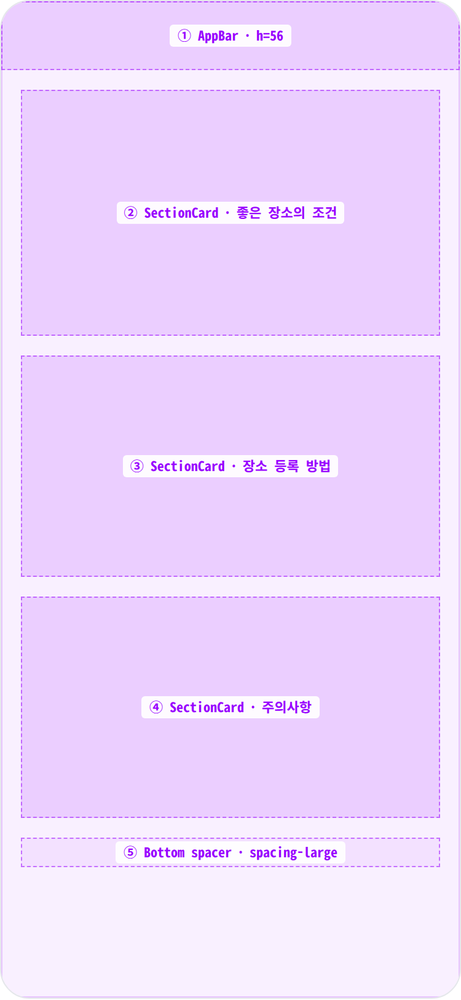
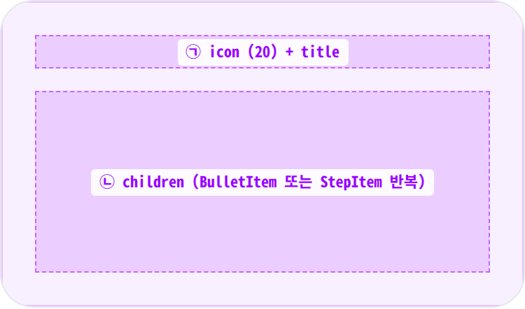
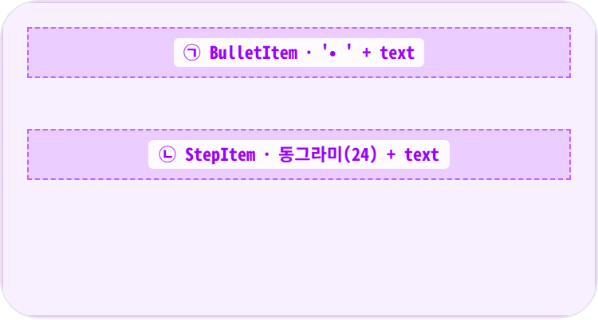
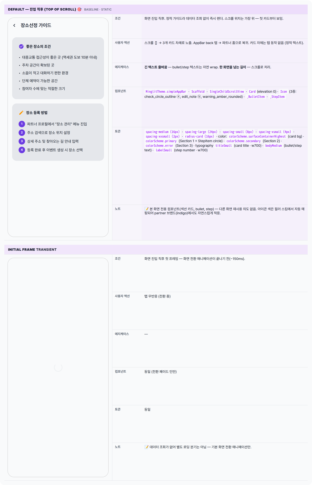

 Spec — LocationGuidePage (app\_partner · LocationGuideRoute)  

# 장소선정 가이드

## Overview

| Status | ✅ 디자인완료 |
|---|---|
| App | app_partner |
| Category | home · guide |
| Route / Surface | LocationGuideRoute |
| Path | /location-guide |
| Hierarchy | Parent: PartnerHomePage (location banner CTA로 진입)Children: — |
| Purpose | 파트너가 이벤트 장소를 등록하기 전에 좋은 장소의 조건 · 등록 절차 · 주의사항을 한눈에 이해할 수 있도록 안내한다. 정적 read-only 가이드 화면으로, 입력/제출 동작은 없고 학습 + 외부 흐름(장소 관리 메뉴)으로의 진입 유도가 목적이다. |
| User journey | Entry points: PartnerHomePage 상단 location banner ("장소를 등록해 주세요") 탭 · 신규 파트너 온보딩 흐름.Exit points: AppBar back → PartnerHomePage 복귀. 장소 관리 메뉴는 본 화면에서 직접 진입 동선 제공 안 함 (Step 안내만). |
| Background | 파트너가 처음 장소를 등록할 때 흔히 놓치는 항목(접근성, 예약 가능성, 사진 일치 등)을 앱이 사전에 명시해 운영 분쟁과 cancel 사유를 줄인다. UI 입력보다 학습 가치가 우선이라 Form이 아닌 정적 information card stack으로 설계. |
| Frequency | 온보딩 1-2회 / 이벤트 생성 전 참고용으로 가끔. |

## History

| Date | Version | Author | Changes |
|---|---|---|---|
| 2026-05-01 | 1.0 | mark-yun | v1.4 template으로 신규 작성. 정적 가이드 화면이라 state는 Default 단일 + Loading(스크롤 진입 직전 짧은 비어있음 상태) 정도. 3개 SectionCard 구조 (조건 / 등록방법 / 주의사항). |

[🧱 Layout](#layout) [🎨 States](#states) [🔄 Global Behavior](#global-behavior) [📖 Reference](#reference)

🧱

## Layout

simpleAppBar + 단일 SingleChildScrollView. body는 3개의 SectionCard가 수직 스택으로 쌓임.

## Blueprint & tree

AppBar (h56) + 스크롤 body. body는 padding all 16, Column(crossAxis: stretch). 3개 카드가 spacing-medium gap으로 배치되고 마지막에 spacing-large 하단 여백.

**Scaffold** └─ **AppBar** = MinglitTheme.simpleAppBar ← ① │ └─ title: "장소선정 가이드" └─ **SingleChildScrollView** └─ **Padding**(`spacing-medium (16px)` all) └─ **Column**(crossAxis: stretch) ├─ _SectionCard #1_ ← ② │ · icon: check\_circle\_outline · color: primary │ · title: "좋은 장소의 조건" │ · 5 BulletItems ├─ Gap: `spacing-medium (16px)` │ ├─ _SectionCard #2_ ← ③ │ · icon: edit\_note · color: secondary │ · title: "장소 등록 방법" │ · 4 StepItems (1~4) ├─ Gap: `spacing-medium (16px)` │ ├─ _SectionCard #3_ ← ④ │ · icon: warning\_amber\_rounded · color: error │ · title: "주의사항" │ · 4 BulletItems │ └─ Gap: `spacing-large (24px)` ← ⑤

## Spacing & alignment rules

| # | Region | Alignment | Spacing |
|---|---|---|---|
| — | Outer body padding | — | all spacing-medium (16px) |
| ① | AppBar | title leading aligned (back arrow + title) | height: 56 |
| ②③④ | SectionCard | crossAxis: stretch · 풀폭 | card 사이 gap: spacing-medium (16px) |
| ⑤ | Bottom spacer | — | height: spacing-large (24px) |

## Sub-anatomy ① — SectionCard

Card(elevation 0 · surfaceContainerHighest · radius-card · padding spacing-large all). 내부는 Row(icon + title) → spacing-medium gap → 자식 children Column.

**Card**(elevation: 0) bg: `surfaceContainerHighest` radius: `radius-card (16px)` └─ **Padding**(`spacing-large (24px)` all) └─ **Column**(crossAxis: start) ├─ **Row** ← ㉠ │ ├─ **Icon**(size: 20, color: section) │ ├─ Gap: `spacing-small (8px)` │ └─ **Text**(titleSmall · w700) ├─ Gap: `spacing-medium (16px)` │ └─ _...children_ ← ㉡

| # | Region | Alignment | Spacing / tokens |
|---|---|---|---|
| ㉠ | Header row | icon + title baseline | icon↔title: spacing-small (8px) |
| ㉡ | Children list | crossAxis: start | item 사이: spacing-xsmall (4px) v-padding (BulletItem/StepItem 자체 패딩) |

## Sub-anatomy ② — BulletItem & StepItem

BulletItem: '• ' + Expanded(Text). StepItem: 24px primary 동그라미(흰색 숫자) + spacing-small + Expanded(Text). 둘 다 bodyMedium · padding vertical xsmall.

**BulletItem** (㉠) └─ **Padding**(v: `spacing-xsmall (4px)`) └─ **Row**(crossAxis: start) ├─ **Text**('• ', bodyMedium) └─ **Expanded**(**Text**(text, bodyMedium)) **StepItem** (㉡) └─ **Padding**(v: `spacing-xsmall (4px)`) └─ **Row**(crossAxis: start) ├─ **Container**(24×24, circle, primary) │ └─ **Text**('1', labelSmall · w700 · onPrimary) ├─ Gap: `spacing-small (8px)` └─ **Expanded**(**Padding**(top: `xxsmall (2px)`) + Text)

| # | Region | Alignment | Spacing / tokens |
|---|---|---|---|
| ㉠ | BulletItem | start aligned · '•' inline | v-padding: spacing-xsmall (4px) |
| ㉡ | StepItem | circle + text baseline 보정 (Padding top: 2px) | circle 24×24 · gap spacing-small (8px) |

🎨

## States

정적 가이드라 state 분기가 거의 없음. Default(전체 카드 풀 렌더) + 짧은 진입 직후 화면 전환 프레임 정도.

## States gallery

외부 데이터 조회가 없는 정적 가이드 화면이라 빈 상태 / 에러 / 로딩 분기가 없다. 모든 내용이 화면에 즉시 노출.

🔄

## Global Behavior

정적 가이드라 cross-cutting 동작이 매우 단순. 뒤로 가기 + 스크롤만.

## Cross-cutting interactions

| 사용자 액션 | 화면에 보이는 결과 |
|---|---|
| 뒤로 가기 (OS back / AppBar back) | 파트너 홈으로 복귀 — 기본 reverse transition (~250ms) |
| 스크롤 ↕ | body 영역만 스크롤되고 AppBar는 고정. iOS는 바운스, Android는 overscroll glow. |
| 아래로 당기기 | 동작 없음 — 정적 컨텐츠라 새로고침 비활성. |

## Motion & timing

| Token | Value | Use case |
|---|---|---|
| MinglitAnimation.fast | 200ms | route push/pop · Material 기본 transition |

| Transition | Duration (token) | Curve / notes |
|---|---|---|
| 화면 진입 (PartnerHome → 본 화면) | fast (200ms) | Material slide from right (Android) / iOS-style horizontal push |
| 화면 이탈 (back) | fast (200ms) | reverse transition |

## Global edge cases

-   **다크 모드** — 카드 배경과 아이콘 색상이 다크 스킴에 맞춰 자동 어두워짐.
-   **접근성** — 섹션 헤더 + bullet 텍스트는 리스트 구조로 읽힘. 큰 글씨 모드에선 카드 내부가 자연 줄바꿈.
-   **다국어** — 본 화면은 현재 한국어 고정. 다국어 도입 시 문자열 외부화 필요.

📖

## Reference

Implementation source + 인접 화면.

## Implementation source

| 항목 | Path / Reference |
|---|---|
| Widget class | LocationGuidePage (StatelessWidget) |
| File path | apps/app_partner/lib/src/features/home/guide/location_guide_page.dart |
| Controller / Provider | — (정적 화면 · 외부 상태 없음) |
| Route | LocationGuideRoute · path: /location-guide |
| Internal widgets | _SectionCard · _BulletItem · _StepItem (private, 같은 파일) |

## Related screens

| Spec | Relation |
|---|---|
| PartnerHomePage | Parent — location banner CTA로 진입. |
| PartnerWelcomePage | 온보딩 흐름 — 신규 파트너가 환영 → 가이드 순서로 학습. |