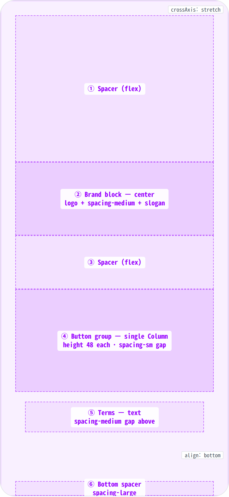
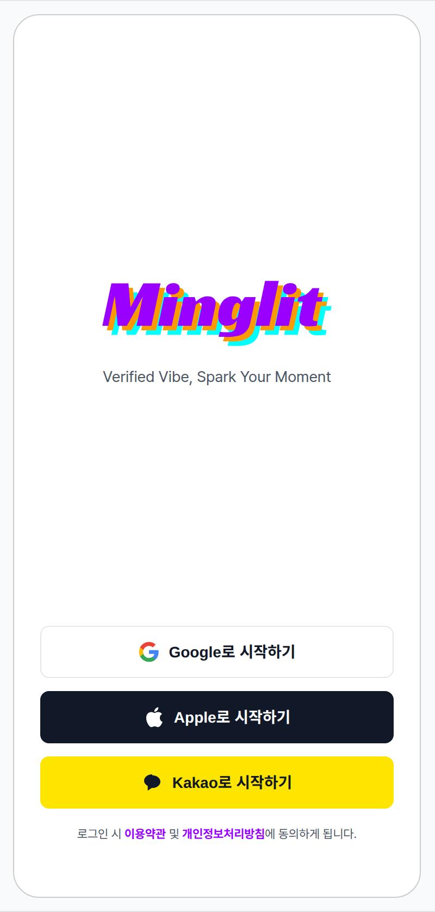
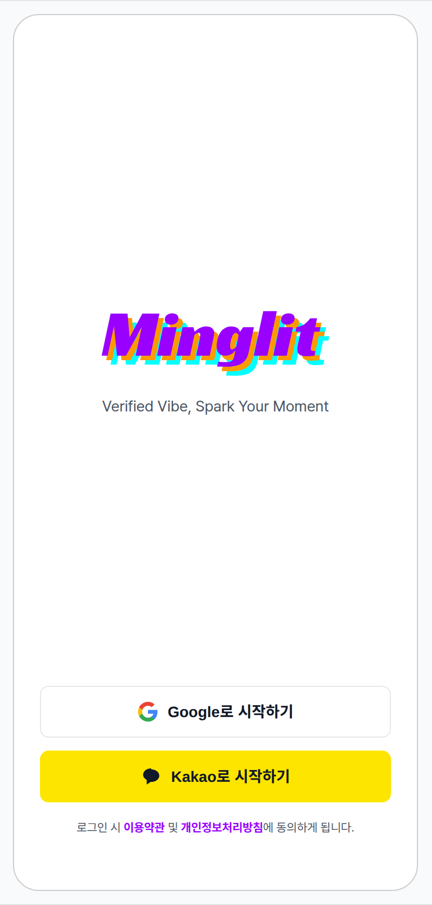
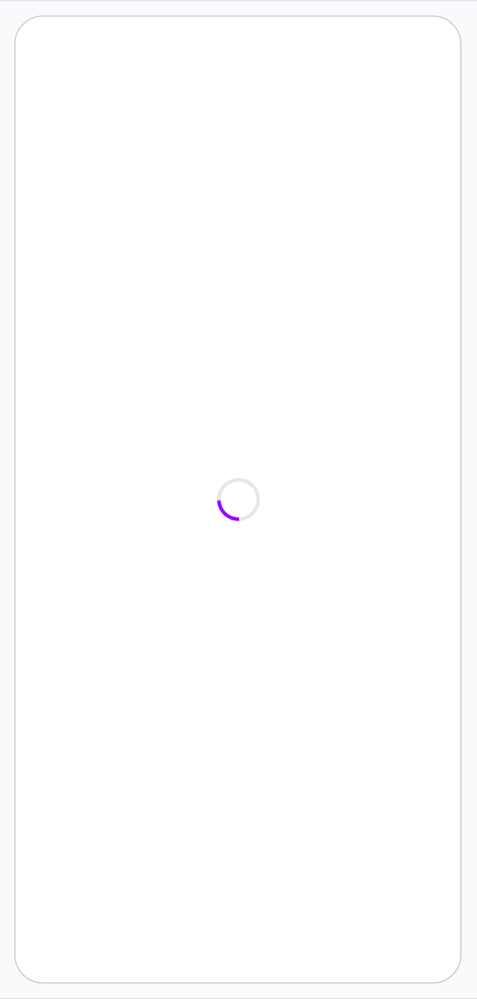
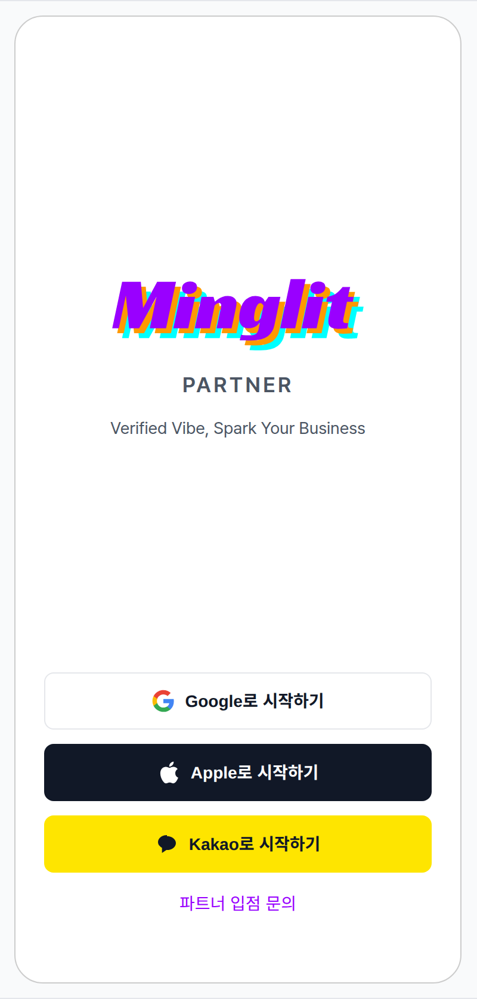

 Spec — LoginPage (app\_user · LoginRoute)  

# Login

## Overview

| Status | ✅ 디자인완료 — 4개 state · 양 앱 공유 |
|---|---|
| App | app_user · app_partner (widget 공유) |
| Category | auth · entry |
| Route / Surface | LoginRoute · widget: LoginPage + MinglitLoginScreen (kit-shared) |
| Path | /login |
| Hierarchy | Parent: — (top-level screen)Children: — |
| Purpose | 소셜 로그인(Google / Apple / Kakao)으로 사용자를 인증해 앱의 모든 보호된 기능 (이벤트 참여, 파티 생성, 알림 수신, 결제 등)에 진입할 수 있도록 한다. 이메일/비밀번호 자체 인증은 지원하지 않는다 — OAuth 전용. |
| User journey | Entry points: 앱 첫 실행 / 로그아웃 직후 / 보호된 화면 직접 진입(from 파라미터로 redirect).Exit points: 인증 성공 → HomeRoute (또는 from이 가리키는 원래 화면). 외부 OAuth 페이지로 이탈했다가 callback으로 자동 복귀. |
| Background | 밍글릿은 검증된 사용자(Verified Vibe)만 모임에 참여할 수 있는 컨셉이라 OAuth 기반 신원 확인이 핵심. 이메일/비밀번호 가입은 신원 위변조 위험이 커서 의도적으로 배제. User / Partner 두 앱이 widget을 공유 — Partner 변형은 입점 문의 link만 다름. |
| Frequency | 로그아웃 상태에선 매번. 인증된 사용자에겐 1회 / 세션 만료 시. |

## History

이 spec의 주요 변경 이력. 최신 항목 위.

| Date | Version | Author | Changes |
|---|---|---|---|
| 2026-05-01 | 1.0 | mark-yun | v1.4 template으로 마이그레이션. Header(breadcrumb + Widget/Role meta) → Overview 테이블 흡수 (Status · App · Category · Route · Path · Hierarchy 6행 추가). States(4개 카드 + annotations) → mini-table per state (6 aspect rows · baseline = Default iOS, additive diff). Behavior(Interactions 테이블) → mini-table에 분산. Reference(Components/Tokens used) → 각 state mini-table에 분산. |

[🧱 Layout](#layout) [🎨 States](#states) [🔄 Global Behavior](#behavior) [📖 Reference](#reference)

🧱

## Layout

화면 구조 — 영역, 정렬, 간격 규칙. 색·타이포 무시.

## Blueprint & tree

좌측은 영역 경계를 표시한 wireframe (음영 = 콘텐츠 영역, 흰색 = Spacer). 우측은 위젯 위계. 기준선: 화면 좌우 `spacing-large (24px)` 패딩. 콘텐츠는 두 개의 flex Spacer 사이에서 수직 중앙 정렬.

**Scaffold** └─ **SafeArea** └─ **Padding**(horizontal: _spacing-large = 24px_) └─ **Column**(mainAxis: center, crossAxis: stretch) ├─ **Spacer**(flex: 1) ← ① │ ├─ _Brand block_ ← ② │ ├─ **Logo** (height: 64) — minglit\_logo SVG │ ├─ Gap: _spacing-medium = 16px_ │ └─ **Slogan** — Text(textAlign: center) │ ├─ **Spacer**(flex: 1) ← ③ │ ├─ _Button group_ ← ④ _(single Column · 3 buttons)_ │ ├─ **Google** (height 48 · radius-small) │ ├─ Gap: _spacing-sm = 12px_ │ ├─ **Apple** _(conditional — iOS/macOS/Web only)_ │ ├─ Gap: _spacing-sm = 12px_ │ └─ **Kakao** (height 48 · brand-locked yellow) │ ├─ Gap: _spacing-medium = 16px_ │ ├─ _Terms block_ ← ⑤ │ └─ **Text.rich** — center-aligned · 약관/개인정보 inline links │ └─ Bottom spacer: _spacing-large = 24px_ ← ⑥

## Spacing & alignment rules

| # | Region | Alignment | Spacing |
|---|---|---|---|
| — | Outer page padding | — | horizontal: spacing-large (24px) |
| ① | Top spacer | flex — 위에서 brand block까지 가변 높이 | — |
| ② | Brand block (logo + slogan) | cross axis: center · 수직 중앙 정렬 | logo↔slogan: spacing-medium (16px) |
| ③ | Mid spacer | flex — brand 아래에서 button group까지 | — |
| ④ | Button group | cross axis: stretch · 모든 버튼 풀폭 | 버튼 사이: spacing-sm (12px) |
| ⑤ | Terms block | center text · group 바로 아래 고정 | group↔terms: spacing-medium (16px) |
| ⑥ | Bottom spacer | SafeArea 위 고정 | height: spacing-large (24px) |

🎨

## States

시각 변형 4종. 각 state는 독립 mini-table — 6 aspect rows. 첫 state(Default iOS) baseline 풀 리스트, 나머지는 변경분만.

**State 종류 식별 기준**: 실행 중인 OS(iOS/Android) · 인증 진행 여부 · 어느 앱인지(사용자용/파트너용)에 따라 4가지 변형으로 분기.

### Default · iOS / macOS / Web 🎯 baseline · production

| 항목 | 내용 |
|---|---|
| 조건 | iOS · macOS · Web에서 진입한 상태. 인증이 진행 중이 아니고 아직 로그인되지 않은 상태. |
| 사용자 액션 | ① Google 버튼 탭 — 화면이 즉시 로딩으로 바뀌고 외부 Google 로그인 페이지로 넘어감.② Apple 버튼 탭 — 시스템이 제공하는 Apple 로그인 시트가 올라옴. 인증이 끝나면 자동으로 앱에 복귀.③ Kakao 버튼 탭 — KakaoTalk 앱이 설치돼 있으면 그쪽으로, 없으면 Kakao 로그인 페이지로 이동.④ 이용약관 / 개인정보처리방침 링크 탭 — 외부 브라우저에서 해당 문서가 열림. 로그인 화면은 그대로 유지.⑤ 로고를 2초 안에 5번 탭 (개발 환경 전용) — 테스트 계정 전환 화면으로 이동. |
| 에지케이스 | · 인증 실패 (서버/네트워크 문제) — 공통 에러 다이얼로그가 잠깐 떴다가 닫히고 다시 기본 화면으로 복귀.· 외부 로그인 페이지를 사용자가 임의로 닫음 — 별도 에러 메시지 없이 기본 화면으로 복귀.· 이미 로그인된 사용자가 이 URL로 진입 — 화면이 보이지 않고 즉시 홈으로 이동.· 다크 모드 전환 — Google은 흰 배경에서 어두운 배경으로, Apple은 검정 배경에서 흰 배경으로 자동 교체. Kakao는 브랜드 가이드라인에 따라 노랑색 유지. |
| 컴포넌트 | · Logo (SVG · 64px h · light/dark 자동 swap — minglit_logo_background_transparent.svg)· Slogan (Text · bodyMedium · color-text-secondary · "Verified Vibe, Spark Your Moment")· OAuth 버튼 3종 (brand-locked — Google · Apple · Kakao · 모두 height 48 · radius-small · MinglitButton에 매핑 안 됨)· Terms (Text.rich · bodySmall · 약관 + 개인정보처리방침 inline 링크) |
| 토큰 | · color: color-background, color-text-primary, color-text-secondary, color-divider (Google border)· radius: radius-small (8px · OAuth 버튼)· spacing: spacing-large (24 · 좌우 padding · 하단 SafeArea), spacing-medium (16 · 로고↔슬로건 · 그룹↔terms), spacing-sm (12 · 버튼 사이 · terms 좌우), spacing-small (8 · 버튼 내 아이콘↔라벨)· typography: bodyMedium / bodySmall / titleSmall· brand-locked exception: Kakao #FEE500 (mds_tokens 우회 — OAuth provider 가이드라인) |
| 노트 | 📝 4 state 중 가장 일반적 — 다른 state는 이 baseline에서 변경분만 명시. |

### Default · Android no-apple · platform = Android

| 항목 | 내용 |
|---|---|
| 조건 | Android 환경에서 진입한 상태. |
| 사용자 액션 | 동일 (Apple 버튼은 화면에 노출되지 않으므로 해당 액션도 없음) |
| 에지케이스 | 동일 |
| 컴포넌트 | − Apple OAuth 버튼 (Apple Sign In은 Android 미지원). 자리는 빈 공간 없이 Kakao가 위로 올라옴 |
| 토큰 | 동일 |
| 노트 | 📝 Apple 버튼이 빠진 자리에 빈 공간이 남지 않음. 버튼 그룹 전체 높이만 줄어듦. |

### Loading 로그인 처리가 진행 중인 상태

| 항목 | 내용 |
|---|---|
| 조건 | OAuth 버튼 중 하나를 탭한 직후부터 외부 로그인 페이지가 화면에 뜨기 직전까지의 짧은 구간 (보통 0.1~0.3초). |
| 사용자 액션 | — (모든 탭이 받아들여지지 않음. 화면 중앙의 스피너만 회전.) |
| 에지케이스 | · 외부 로그인 페이지가 늦게 뜨면 스피너만 오래 보임. 자동 시간 초과는 없으며 OS가 처리.· 사용자가 시스템 뒤로가기를 누르면 인증이 취소되고 기본 화면으로 복귀. |
| 컴포넌트 | ↔ Login 전체 → MinglitCircularProgressIndicator (화면 중앙) |
| 토큰 | − OAuth 버튼/Logo/Slogan 토큰 모두 미사용. 스피너 색상만 color-primary |
| 노트 | 📝 외부 로그인 페이지로 넘어가는 짧은 전환 구간을 채우기 위한 화면. 별도의 페이드 전환 없이 즉시 교체됨. |

### Partner variant 파트너 앱에서 진입한 변형

| 항목 | 내용 |
|---|---|
| 조건 | 파트너 앱(app_partner)에서 진입한 상태. |
| 사용자 액션 | ↔ "이용약관 / 개인정보처리방침 링크" 자리가 "파트너 입점 문의" 단일 텍스트 버튼으로 교체됨. 탭하면 외부 브라우저에서 입점 문의 페이지가 열림. |
| 에지케이스 | 동일 |
| 컴포넌트 | + PARTNER 배지 (Text · 18px · weight 600 · letter-spacing 2 · color-text-secondary · 로고 아래)↔ Slogan 텍스트 → "Verified Vibe, Spark Your Business"↔ Terms (Text.rich) → "파트너 입점 문의" TextButton |
| 토큰 | 동일 (단, "파트너 입점 문의" TextButton은 color-primary 사용) |
| 노트 | 📝 사용자 앱과 파트너 앱이 같은 화면 구조를 공유한다. 로고 아래 PARTNER 배지와 슬로건 끝의 단어, 하단 텍스트 버튼만 다르다. |

🔄

## Global Behavior

cross-cutting — 모든 state에 적용되는 액션, motion, 글로벌 에지케이스. 각 state 한정 액션은 위 mini-table 참고.

## Cross-cutting interactions

| 사용자 액션 | 화면에 보이는 결과 |
|---|---|
| 로고를 2초 안에 5번 탭 (개발 환경 전용) | 테스트 계정 목록 화면으로 전환됨. 운영 환경에서는 반응하지 않음. |
| 뒤로 가기 (시스템 뒤로가기 / 스와이프) | 보호된 화면에서 자동으로 이동된 경우는 홈으로 이동. 앱 첫 진입이면 OS 기본 동작 (Android는 앱 종료, iOS는 무반응). |
| 다크 모드 토글 | OAuth 버튼 색상이 자동으로 교체됨 (Google은 흰 배경에서 어두운 배경으로, Apple은 검정 배경에서 흰 배경으로). Kakao는 브랜드 가이드라인에 따라 노랑색 유지. |

## Motion timing

Source: `shared/packages/mds/core/lib/src/theme/minglit_design_tokens.dart`

| Transition | Token / Duration | Notes |
|---|---|---|
| 화면 진입 (앱 처음 시작 / 로그아웃 직후) | — | OS 기본 화면 전환을 그대로 사용. 별도의 진입 애니메이션 없음. |
| OAuth 버튼 탭 → 로딩 화면 | MinglitAnimation.micro (100ms) | 전체 화면이 스피너로 즉시 교체됨. 페이드 없이 컷 전환 — 사용자에게 즉각 피드백. |
| 로딩 → 외부 로그인 페이지 | OS 기본 | OS가 제공하는 브라우저 전환을 그대로 사용. 커스터마이징 불가. |
| 외부 인증에서 복귀 → 홈/원래 화면 | MinglitAnimation.fast (200ms) | 표준 라우트 전환 (slide / fade). 사용자 동작 없이 자동 이동. |
| 에러 다이얼로그 노출 / 닫힘 | MinglitAnimation.fast (200ms) | 중앙에서 페이드 인/아웃 + 살짝 확대 (Material 기본). |

## Global edge cases

-   **이미 로그인된 사용자가 이 URL로 진입** — 화면이 보이지 않고 즉시 홈으로 이동.
-   **보호된 화면에서 자동으로 진입한 경우** — 로그인을 마치면 처음 가려던 화면으로 자동 복귀 (홈으로 가지 않음).
-   **로고 5탭 트리거 타이밍** — 마지막 탭으로부터 2초가 지나면 카운트가 리셋됨. 천천히 탭하면 발동되지 않음.

📖

## Reference

implementation source + 인접 화면. Components / Tokens는 위 mini-table 참고.

## Implementation source

| Widget (app_user) | LoginPage — apps/app_user/lib/src/features/auth/login_page.dart |
|---|---|
| Widget (app_partner) | PartnerLoginPage — apps/app_partner/lib/src/features/auth/partner_login_page.dart |
| Shared widget | MinglitLoginScreen — shared/packages/minglit_kit/lib/src/features/auth/ (kit-shared, props로 user/partner 분기) |
| Route | LoginRoute · /login · app_routes.dart |
| Auth provider | authStateProvider · OAuth: Google · Apple · Kakao (provider별 SDK). |
| Brand-locked exception | Kakao yellow #FEE500 — mds_tokens 우회. OAuth provider 가이드라인 강제. |

## Related screens

| Spec | Relation |
|---|---|
| AuthCallbackPage | OAuth 복귀 처리 화면. 사용자에겐 잠깐의 로딩만 보임. |
| DevUserSwitchScreen | Logo 5탭 (dev 환경)으로 이동하는 테스트용 계정 전환 화면. |
| SignupConsentPage | 최초 가입 시 약관 동의를 받는 후속 화면. |
| Layout foundations | 이 화면은 어느 scaffold에도 속하지 않는 단독 진입 화면. 자체 padding + Spacer 구성. |