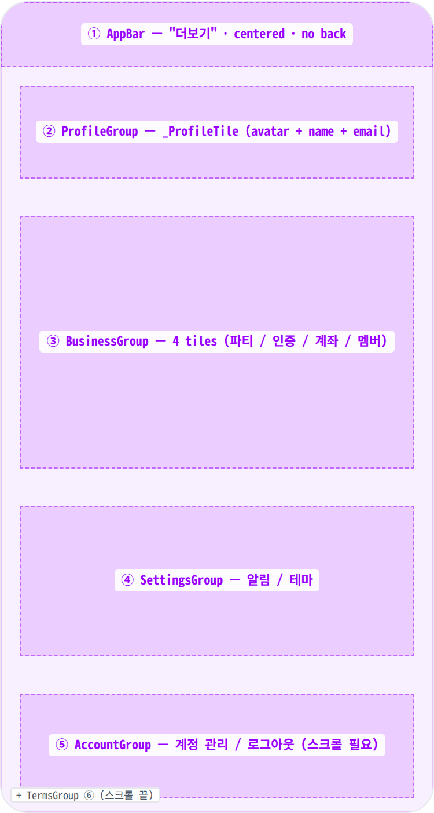
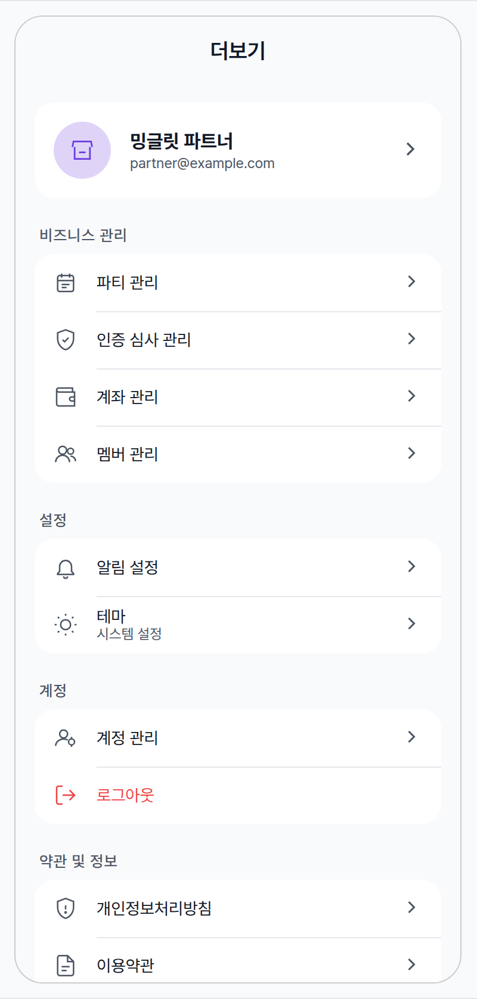
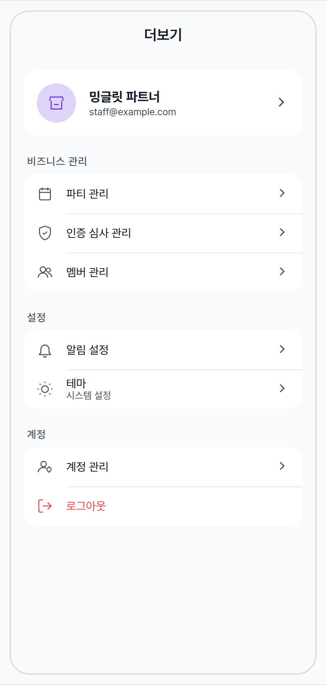

 Spec — MorePage (app\_partner / MoreRoute)  

# More

## Overview

| Status | ✅ 디자인완료 — 2 state · 5 SettingsGroup |
|---|---|
| App | app_partner |
| Category | more · settings hub (partner "더보기") |
| Route / Surface | MoreRoute · widget: MorePage · MoreBranch (StatefulShell branch 5) |
| Path | /more |
| Hierarchy | Parent: — (top-level — PartnerScaffold 하단 탭바 5번 슬롯)Children: PartyDetailPage 등 비즈니스 관리 / 설정 / 계정 하위 화면 (대부분 별도 spec 후속). |
| Purpose | 파트너의 비즈니스 관리(파티 / 인증 / 계좌 / 멤버), 앱 설정(알림 / 테마), 계정(관리 / 로그아웃), 약관 및 정보(정책 / 약관 / 앱 버전)를 모두 진입 가능한 단일 settings hub. 5개 그룹으로 나뉜 tile list + 최상단 partner 프로필 카드. |
| User journey | Entry points: PartnerScaffold 하단 탭바 5번 ("더보기") · push 알림에서 일부 설정으로 deep-link.Exit points: 각 tile 탭 → 하위 관리/설정 화면 push (StatefulShell branch 내부) · 로그아웃 → confirm 다이얼로그 → LoginRoute. |
| Background | 파트너 앱은 비즈니스 운영 도구라 항목이 사용자 앱보다 많고, 멤버의 권한에 따라 일부 항목이 노출되지 않을 수 있음 (예: 정산 권한이 없으면 "계좌 관리" 숨김). 그룹화는 의미 단위(비즈니스 / 설정 / 계정 / 약관)로만 — 카테고리 안에 또 카테고리를 두지 않는 평면 리스트. |
| Frequency | 설정 변경 / 멤버 관리 / 정산 계좌 확인 시 — 주 1-3회. |

## History

이 spec의 주요 변경 이력. 최신 항목 위.

| Date | Version | Author | Changes |
|---|---|---|---|
| 2026-05-01 | 1.0 | mark-yun | v1.4 template으로 작성. Overview / History / Layout(blueprint + 5 SettingsGroup sub-anatomy) / States(2 mini-table — Default / Limited permissions) / Global Behavior / Reference 풀세트. |

[🧱 Layout](#layout) [🎨 States](#states) [🔄 Global Behavior](#behavior) [📖 Reference](#reference)

🧱

## Layout

simpleAppBar + ListView body의 ProfileGroup + 4 SettingsGroup. 그룹 사이 spacing-large.

## Blueprint & tree

Scaffold + `MinglitTheme.simpleAppBar(title: '더보기', showBackButton: false)` + SafeArea wrap + ListView로 5 그룹 + body padding (top: medium · bottom: xxxlarge — home bar 가림 방지). 각 그룹은 _padded card_: 좌우 16 margin · radius-card 라운드 · 내부 tile 사이 0.5px divider (indent 52). 그룹 헤더는 카드 _바깥_ 위에 UPPERCASE labelMedium으로 노출.

**Scaffold** └─ **AppBar**(_MinglitTheme.simpleAppBar · title: "더보기" · showBackButton: false_) ← ① └─ **SafeArea** └─ **ListView**(padding top: medium · bottom: xxxlarge) ├─ _ProfileGroup_ (MinglitSettingsGroup · header 없음 · 1 tile) ← ② │ └─ **\_ProfileTile** MinglitAvatarImage(radius:24) + name + email + chevron ├─ Gap: _spacing-large (24)_ │ ├─ _BusinessGroup_ (header: "비즈니스 관리" · 3 또는 4 tiles) ← ③ │ ├─ **파티 관리** (Icons.event\_note\_outlined) │ ├─ **인증 심사 관리** (Icons.verified\_user\_outlined) │ ├─ **계좌 관리** (Icons.account\_balance\_wallet\_outlined · `canEditSettlement` 일 때만) │ └─ **멤버 관리** (Icons.people\_outline) ├─ Gap: _spacing-large_ │ ├─ _SettingsGroup_ (header: "설정" · 2 tiles) ← ④ │ ├─ **알림 설정** (Icons.notifications\_outlined) │ └─ **ThemeSettingsTile** (theme\_settings\_tile.dart · 동적 icon + subtitle) ├─ Gap: _spacing-large_ │ ├─ _AccountGroup_ (header: "계정" · 2 tiles) ← ⑤ │ ├─ **계정 관리** (Icons.manage\_accounts\_outlined) │ └─ **로그아웃** (Icons.logout\_outlined · destructive · trailing none) ├─ Gap: _spacing-large_ │ └─ _TermsGroup_ (header: "약관 및 정보" · 3 tiles) ← ⑥ ├─ **개인정보처리방침** (Icons.privacy\_tip\_outlined · launchUrl 외부) ├─ **이용약관** (Icons.description\_outlined · launchUrl 외부) └─ **앱 버전** (Icons.info\_outline · subtitle: PackageInfo.version · trailing none · 탭 무반응)

| # | Region | Alignment | Spacing |
|---|---|---|---|
| — | Body padding | — | top: spacing-medium (16) · bottom: spacing-xxxlarge (home bar 안전 영역) |
| ① | AppBar | title centered · no back · no border | height: 56 · bg: scaffold gray (no divider) |
| ② | ProfileGroup | header 없음 · 단일 _ProfileTile (custom · 48px 보다 큼) | card h-margin: 16 · _ProfileTile padding: medium all (16) · row gap: medium · MinglitAvatarImage radius 24 (= 48px) |
| ③–⑥ | SettingsGroup × 4 | header (외부 · UPPERCASE) + tile list (carded) | 그룹 사이: spacing-large (24) · 카드 h-margin: spacing-medium (16) · header v-padding: spacing-small (8) 하단 + spacing-xsmall (4) 좌측 · 카드 radius: radius-card (16) |
| — | tile (MinglitSettingsTile) | row · icon + title-stack + trailing | height 고정 48 · h-padding: spacing-medium · icon → title gap: spacing-medium (16) · trailing gap: spacing-small (8) · icon size: 20 (MinglitIconSize.small) |
| — | tile-tile divider | indent 52 (16+20+16) | height/thickness 0.5 · color outlineVariant |

## SettingsGroup sub-anatomy (per group)

각 SettingsGroup별 tile 구성 — 4 그룹 × tile 디테일. 권한/상태 분기 변형은 States 섹션 mini-table 참고.

③ BusinessGroup — header "비즈니스 관리"

| Tile | Icon (Material) | onTap |
|---|---|---|
| 파티 관리 | Icons.event_note_outlined | moreCoordinator.pushPartyList() → PartyListRoute (/more/parties) |
| 인증 심사 관리 | Icons.verified_user_outlined | moreCoordinator.pushVerificationManage() → VerificationManageRoute |
| 계좌 관리 (조건부) | Icons.account_balance_wallet_outlined | moreCoordinator.pushBankAccountManagement() · canEditSettlement(SETTLEMENT_EDIT 권한) 일 때만 노출 · Fix #1859로 라벨이 "계좌 관리"로 통일됨 (이전: "정산 계좌 관리") |
| 멤버 관리 | Icons.people_outline | moreCoordinator.pushMemberList(partner.id) · partner null이면 MinglitInfo 스낵바 ("파트너 정보를 불러오는 중입니다") |

④ SettingsGroup — header "설정"

| Tile | Icon (Material) | onTap |
|---|---|---|
| 알림 설정 | Icons.notifications_outlined | moreCoordinator.pushNotificationSettings() |
| 테마 (ThemeSettingsTile) | Icons.dark_mode_outlined 또는 Icons.light_mode_outlined (현재 테마 + 시스템 brightness 기반 동적) | SimpleDialog로 system / light / dark 라디오 선택. subtitle = 현재 모드 ("시스템 설정" / "라이트 모드" / "다크 모드") |

⑤ AccountGroup — header "계정"

| Tile | Icon (Material) | onTap |
|---|---|---|
| 계정 관리 | Icons.manage_accounts_outlined | moreCoordinator.pushAccountManagement() → PartnerAccountManagementRoute |
| 로그아웃 (destructive) | Icons.logout_outlined · color-error | MinglitAlert.showConfirm(isDestructive: true · "정말 로그아웃 하시겠습니까?") → 확인 시 authControllerProvider.notifier.signOut() · trailing none (chevron 없음) |

⑥ TermsGroup — header "약관 및 정보"

| Tile | Icon (Material) | onTap |
|---|---|---|
| 개인정보처리방침 | Icons.privacy_tip_outlined | launchUrl(minglitUrlConfigProvider.privacyUrl) · 외부 브라우저 |
| 이용약관 | Icons.description_outlined | launchUrl(minglitUrlConfigProvider.termsUrl) · 외부 브라우저 |
| 앱 버전 | Icons.info_outline | 탭 무반응 · subtitle = PackageInfo.fromPlatform().version (fallback "26.04.1455") · trailing none |

🎨

## States

2개 변형. baseline = 전권 파트너. 정산 권한이 없는 멤버에서는 "계좌 관리" 항목이 노출되지 않음.

**State 식별 기준**: ① 정산 권한을 가진 일반(전권) 파트너로 진입하면 baseline. 비즈니스 관리 그룹의 4개 항목과 모든 그룹이 노출. ② 정산 권한이 없는 멤버(예: 일반 직원)로 진입하면 비즈니스 관리 그룹에서 "계좌 관리" 항목 한 줄만 빠짐. ③ 프로필 정보를 가져오는 동안 / 가져오기에 실패한 동안에는 화면 최상단의 프로필 영역만 로딩 인디케이터 또는 "정보를 불러올 수 없습니다" 안내로 바뀜 — 별도 변형으로 분리하지 않고 본 노트에 정리.

### Default · 전권 파트너 🎯 baseline · 모든 그룹과 비즈니스 관리 4개 항목이 모두 노출되는 상태

| 항목 | 내용 |
|---|---|
| 조건 | 파트너 정보가 정상 도착했고 정산 권한도 부여된 상태. 비즈니스 관리 그룹의 4개 항목이 모두 노출. |
| 사용자 액션 | ① 프로필 영역 탭 — 계정 관리 화면으로 이동.② 비즈니스 관리 항목 탭 (파티 · 인증 · 계좌 · 멤버) — 각각의 관리 화면으로 이동.③ 알림 설정 / 테마 항목 탭 — 알림 설정 화면으로 이동, 또는 테마 선택 다이얼로그 노출.④ 로그아웃 탭 — 위험 강조 톤의 확인 다이얼로그를 거쳐 로그아웃이 진행됨.⑤ 약관 / 정보 항목 탭 — 외부 브라우저에서 해당 약관 페이지가 열림.⑥ 스크롤 — 화면 아래쪽의 약관·정보 그룹이 노출. |
| 에지케이스 | · 파트너 정보가 아직 도착하지 않은 동안 멤버 관리 항목을 탭하면 "파트너 정보를 불러오는 중입니다" 안내 메시지가 잠깐 노출됨.· 앱 버전 항목은 탭해도 반응이 없음 — 정보 표시 전용.· 프로필 영역은 다음 세 가지 형태로 변할 수 있음: – 정보를 가져오는 중: 로딩 인디케이터 – 정보 가져오기 실패: 비활성 프로필 영역 + "정보를 불러올 수 없습니다" 안내, 화살표 미노출 – 파트너 정보가 비어있는 경우: 비활성 프로필 영역 + "파트너 정보를 불러올 수 없습니다" 안내 |
| 컴포넌트 | · MinglitTheme.simpleAppBar(title: '더보기', showBackButton: false)· SafeArea + ListView(EdgeInsets.only top: medium · bottom: xxxlarge) — Fix #1824 / #1803 (home bar 가림 방지)· MinglitSettingsGroup × 5 (header optional · 외부 위치 · padded card)· MinglitSettingsTile × 11 (icon + title-stack + chevron · destructive 분기 · trailing 옵션)· _ProfileTile (private widget · MinglitAvatarImage radius 24 + Icons.store fallback · displayName · email · chevron) — Fix #2069· ThemeSettingsTile (kit-shared · 동적 icon + subtitle · SimpleDialog 라디오)· FutureBuilder<PackageInfo> (앱 버전 tile · package_info_plus)· MinglitAlert.showConfirm (로그아웃 destructive) · launchUrl (약관 외부) |
| 토큰 | · color: color-surface (scaffold + AppBar gray), color-background (group card white = surfaceContainerLowest), color-text-primary (title · name), color-text-secondary (subtitle · header · email · icon · chevron = onSurfaceVariant), color-divider (= outlineVariant · 0.5px tile divider · indent 52), color-partner-primary (avatar bg @ 22% · scoped to viewport), color-error (로그아웃 destructive)· spacing: spacing-medium (16) (body top · group h-margin · tile h-padding · row gap), spacing-large (24) (그룹 사이), spacing-small (8) (header bottom · trailing gap), spacing-xsmall (4) (header left), spacing-xxxlarge (body bottom safeArea)· radius: radius-card (16) (group card)· typography: appBarTitle (18/600), bodyMedium (16 · tile title), bodySmall (13 · subtitle · email), titleMedium (16/700 · profile name), labelMedium (12/500 · UPPERCASE group header · letter-spacing 0.5)· icon: MinglitIconSize.small (20) |
| 노트 | 📝 위 mockup은 5개 그룹을 한 화면에 모두 노출했지만 실제로는 한 번의 스크롤로 마지막 그룹까지 도달함. 라벨은 "정산 계좌 관리" 대신 "계좌 관리"로 통일됨 — 정산 메뉴와 동일한 표기. |

### Limited permissions · 정산 권한 없는 멤버 비즈니스 관리 그룹에서 "계좌 관리" 한 줄이 빠진 형태

| 항목 | 내용 |
|---|---|
| 조건 | 정산 권한이 없는 멤버(예: 일반 직원)로 진입한 경우. 비즈니스 관리 그룹에서 "계좌 관리" 항목 한 줄이 노출되지 않음. |
| 사용자 액션 | − "계좌 관리" 항목이 노출되지 않음 — 정산 화면에 들어갈 수 없도록 차단됨.↔ 그 외의 모든 항목 액션은 baseline과 동일. |
| 에지케이스 | · 권한 정보가 늦게 도착하는 짧은 시점에는 baseline 형태가 잠깐 노출되었다가, 권한이 도착하면 "계좌 관리" 항목이 자연스럽게 사라짐.· 일반적으로는 정산 권한이 없는 직원 멤버에게서만 이 형태가 노출됨. |
| 컴포넌트 | − 비즈니스 관리 그룹 내 "계좌 관리" 항목 미노출.↔ 나머지 항목은 baseline과 동일. |
| 토큰 | 동일 |
| 노트 | 📝 권한이 없는 사용자가 외부 딥링크로 정산 화면에 직접 진입하더라도 자동으로 차단됨. |

🔄

## Global Behavior

cross-cutting — 모든 state에 적용되는 액션, motion, 글로벌 에지케이스.

## Cross-cutting interactions

| 사용자 액션 | 화면에 보이는 결과 |
|---|---|
| 탭바의 다른 탭 → 더보기 | 더보기 탭의 이전 스크롤 위치와 진입했던 하위 화면이 보존된 상태로 복귀. |
| 다크 모드 토글 | scaffold·그룹 카드·항목이 다크 토큰으로 자동 전환. 테마 항목의 아이콘이 즉시 다크 톤 아이콘으로 갱신됨. |
| 항목 탭 피드백 | 탭 가능한 모든 항목은 가벼운 리플 피드백을 제공. 앱 버전 항목만 피드백 없음. |
| 약관 / 정책 항목 탭 | 외부 브라우저에서 해당 페이지가 열림. 앱으로 복귀하면 더보기 화면이 그대로 유지됨. |
| 로그아웃 확인 후 | 로그아웃이 진행되며 로그인 화면으로 자동 복귀. |

## Motion timing

Source: `shared/packages/mds/core/lib/src/theme/minglit_design_tokens.dart` → `MinglitAnimation`.

| Transition | Token / Duration | Notes |
|---|---|---|
| 탭바 → 더보기 진입 | — | 탭바 전환 시 별도 부드러운 전환 없이 즉시 교체. |
| 항목 → 하위 화면 이동 | MinglitAnimation.fast (200ms) | 화면이 좌→우로 슬라이드되며 다음 화면이 위에 얹힘. |
| 로그아웃 확인 다이얼로그 | MinglitAnimation.fast (200ms) | 화면 중앙에 다이얼로그가 살짝 커지며 부드럽게 페이드 인. |
| 테마 선택 다이얼로그 | MinglitAnimation.fast (200ms) | 라디오 선택 직후 즉시 닫힘. |
| 프로필 정보 도달 → 본문 노출 | — | 로딩 인디케이터에서 프로필 영역으로 즉시 교체. |

## Global edge cases

-   **스크롤 끝 도달** — 약관·정보 그룹의 마지막 항목(앱 버전)이 화면 하단 마지막에 위치. 시스템 홈바에 가려지지 않도록 하단에 충분한 여백을 확보.
-   **그룹 헤더 스크롤 동작** — 그룹 헤더는 카드 바깥 위에 평범히 배치되며, 스크롤할 때 함께 흘러감.
-   **권한 정보가 늦게 도착** — 권한이 도착하기 전에는 비즈니스 관리 그룹이 잠깐 다른 개수로 보일 수 있고, 권한이 도착하면 자연스럽게 최종 형태로 전환됨.
-   **파트너 정보 가져오기 실패** — 프로필 영역만 비활성 상태("정보를 불러올 수 없습니다")가 되고, 나머지 그룹은 정상 노출됨. 멤버 관리 항목은 파트너 정보가 필요하므로 탭하면 잠깐 안내 메시지가 노출됨.
-   **앱 버전 임시 표기** — 앱 버전을 가져오는 데 시간이 걸리는 짧은 동안에는 임시 버전 문자열이 잠깐 노출될 수 있음.

📖

## Reference

implementation source + 인접 화면.

## Implementation source

| Widget | MorePage — apps/app_partner/lib/src/features/more/more_page.dart |
|---|---|
| Route | MoreRoute · /more · MoreBranch (StatefulShell branch 5) · app_routes.dart |
| Coordinator | moreCoordinatorProvider · more_coordinator.dart — pushPartyList / pushVerificationManage / pushBankAccountManagement / pushMemberList / pushNotificationSettings / pushAccountManagement. |
| Auth / Permission gates | · currentPartnerInfoProvider — async partner profile (loading / error / data / null 분기)· currentMemberPermissionsProvider — owner 폴백 시 ['SETTLEMENT_VIEW','SETTLEMENT_EDIT'] 자동 부여 (Fix #1568 · Fix #1533 · Fix #1217)· canEditSettlement = permissions.contains('SETTLEMENT_EDIT') — false면 "계좌 관리" tile 미렌더 |
| SettingsGroup atom | MinglitSettingsGroup — padded card (h-margin 16) · radius-card · header 외부 UPPERCASE labelMedium · 내부 0.5px divider (indent 52) |
| SettingsTile atom | MinglitSettingsTile — height 48 · icon 20 (MinglitIconSize.small) · title + optional subtitle (Column) · trailing: navigation(chevron) / toggle / value / none · destructive (color-error) |
| ThemeSettingsTile | kit-shared widget — 테마 모드 (system / light / dark) 분기 · subtitle = 현재 모드 · icon = 현재 effective brightness 반영 · theme_settings_tile.dart |
| _ProfileTile | private widget · MinglitAvatarImage(radius:24 · Icons.store fallback · primaryContainer bg) · name (titleMedium/bold) · email (bodySmall/onSurfaceVariant) · chevron — Fix #2069 (캐싱 + 에러 폴백) |
| App version | FutureBuilder<PackageInfo> — package_info_plus.PackageInfo.fromPlatform() · fallback "26.04.1455" |
| External URLs | minglitUrlConfigProvider.privacyUrl / termsUrl → launchUrl (외부 브라우저) |
| Logout flow | MinglitAlert.showConfirm(isDestructive: true · "로그아웃" / "정말 로그아웃 하시겠습니까?" · 확인 라벨 "로그아웃") → 확인 시 authControllerProvider.notifier.signOut() |
| Bug fix anchors | · Fix #1859 — "정산 계좌 관리" → "계좌 관리" 라벨 통일· Fix #1824 / #1803 — SafeArea + bottom padding xxxlarge로 home bar 가림 방지· Fix #2069 — MinglitAvatarImage로 caching + 에러 폴백 통일· Fix #1568 / #1533 / #1217 — 권한 폴백 (owner 자동 SETTLEMENT_EDIT) |
| Sub-screens (각 tile) | PartyListPage · VerificationManagePage · BankAccountPage · MemberListPage · NotificationSettingsPage · PartnerAccountManagementPage — 각각 별도 spec 후보 (Phase 2 backlog). |

## Related screens

| Spec | Relation |
|---|---|
| PartnerHomePage | 같은 PartnerScaffold StatefulShell 내 다른 branch — 탭바로 swap. |
| PartyDetailPage | 비즈니스 관리 → 파티 관리 → 파티 상세로 이어지는 nested push 경로. |
| SettlementDetailPage | SETTLEMENT_EDIT 권한자 only — "계좌 관리" tile에서 BankAccountPage로 진입, 그 다음 settlement 상세는 별도 탭/branch. |
| Layout foundations | Standard Scaffold + ListView. PartnerScaffold StatefulShell branch 내부 단독 화면 (탭바 유지). |