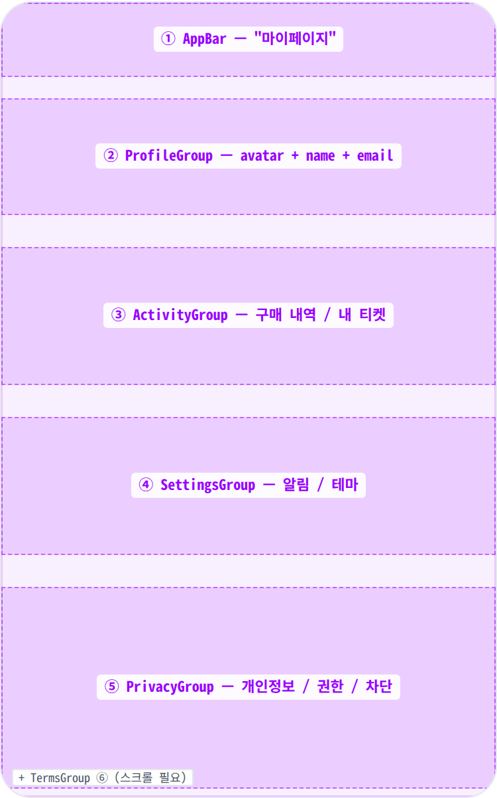
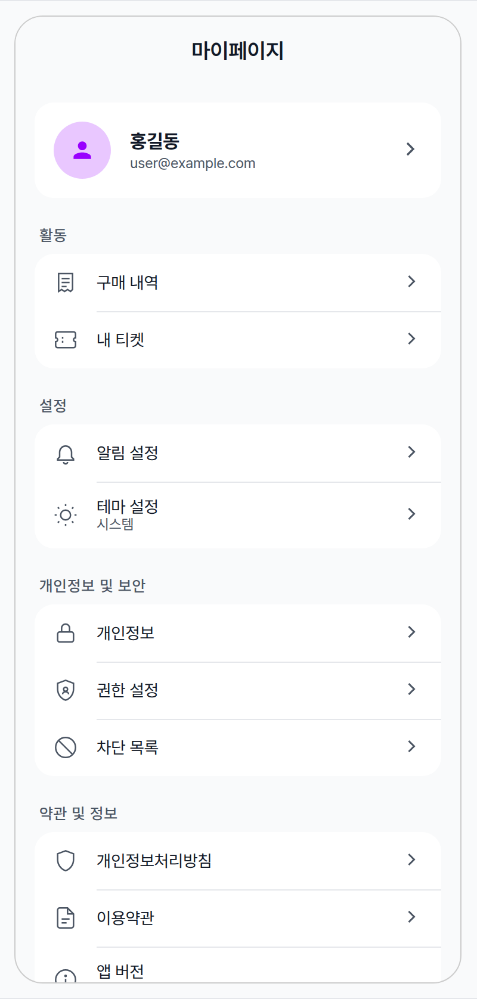
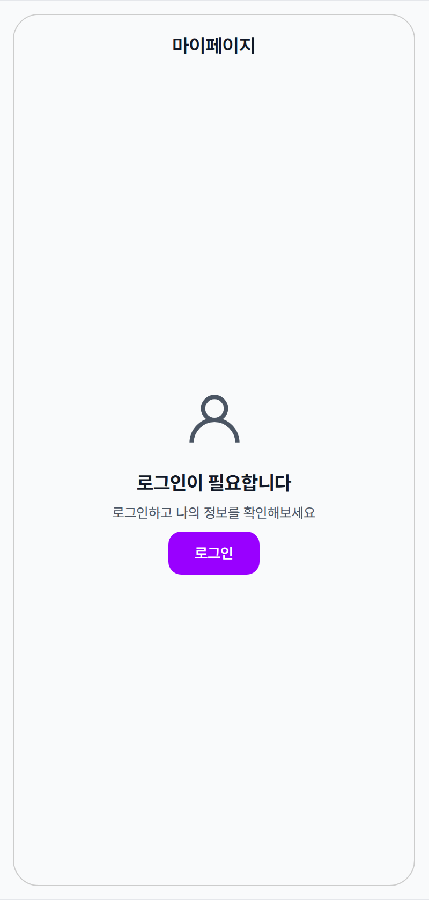

 Spec — MyPage (app\_user / MyPageRoute)  

# My Page

## Overview

| Status | ✅ 디자인완료 — 2 state · 1 ProfileGroup + 5 SettingsGroup |
|---|---|
| App | app_user |
| Category | my · settings hub |
| Route / Surface | MyPageRoute · widget: MyPage |
| Path | /my |
| Hierarchy | Parent: — (top-level — HomePage AppBar 아바타 탭으로 진입)Children: — (각 tile은 하위 settings 화면으로 push — 별도 spec으로 분리 예정) |
| Purpose | 사용자의 활동(구매 내역 / 내 티켓), 설정(알림 / 테마), 개인정보 / 보안, 약관 / 정보를 모두 진입 가능한 단일 settings hub. 상단 ProfileGroup(프로필 영역)을 탭하면 계정 관리(로그아웃 · 회원 탈퇴 포함) 화면으로 이동. 5개 settings 그룹 + 1 프로필 그룹 구조. |
| User journey | Entry points: HomePage AppBar 우측 아바타 탭 (인증 후) / push 알림에서 일부 settings로 deep-link.Exit points: 각 tile 탭 → 하위 settings 화면 / 뒤로 가기 → HomePage 복귀. |
| Background | 밍글릿은 settings를 가능한 한 평면 list로 노출해 사용자가 원하는 항목을 빠르게 찾도록 함 — 그룹화는 의미 단위(활동 / 설정 / 개인정보 / 약관 / 계정)로만, 카테고리 페이지 내 nested 구조 회피. 현재 HomePage의 아바타 탭이 유일한 진입점 — 하단 탭바 없는 단독 화면. |
| Frequency | 설정 변경 시 또는 활동 내역 확인 시 — 주 1-2회 정도. |

## History

이 spec의 주요 변경 이력. 최신 항목 위.

| Date | Version | Author | Changes |
|---|---|---|---|
| 2026-05-03 | 1.1 | mark-yun | 하단 AccountGroup(계정 관리 · 로그아웃) 통째로 제거 · 상단 ProfileGroup이 계정 관리 진입점으로 일원화. iOS / Android 설정 패턴(상단 프로필 → 계정 hub)과 동일. 로그아웃 / 회원 탈퇴는 계정 관리 화면 하위 destructive 카드("계정 관리" 헤더)로 이동. blueprint · tree · 그룹 카운트(7→6) · mockup · 사용자 액션 · 에지케이스 · 컴포넌트 · 토큰 · motion table · 글로벌 에지케이스 · Reference(Icons / Logout flow / Sub-screens) 일괄 정리. |
| 2026-05-01 | 1.0 | mark-yun | v1.4 template으로 전면 재작성. 이전 spec은 v0.5 era — 인라인 토큰 정의 + 단일 mockup + spec notes 정도. 이번 버전은 Overview / History / Layout(blueprint + 6 SettingsGroup sub-anatomy) / States(2 mini-table — Default / Logged out) / Global Behavior / Reference 풀세트. |

[🧱 Layout](#layout) [🎨 States](#states) [🔄 Global Behavior](#behavior) [📖 Reference](#reference)

🧱

## Layout

AppBar + scroll body의 1 ProfileGroup + 5 SettingsGroup. 그룹 사이 spacing-large.

## Blueprint & tree

Scaffold + AppBar (간단 title only · "마이페이지") + ListView 또는 SingleChildScrollView로 1 ProfileGroup + 5 SettingsGroup + spacing-medium body padding (vertical). 각 그룹은 horizontal padding 안의 둥근 카드, 그 안에 tile들이 배치. 상단 ProfileGroup은 단일 \_ProfileTile 카드 — 탭 시 계정 관리 화면으로 이동(로그아웃 · 회원 탈퇴 등 위험 액션은 그쪽에서).

**Scaffold** └─ **AppBar**(_title: "마이페이지"_ · _showBackButton: false_) ← ① └─ **SingleChildScrollView** └─ Padding(_spacing-medium_ vertical) └─ Column ├─ _ProfileGroup_ (MinglitSettingsGroup · 1 tile) ← ② │ └─ **\_ProfileTile** avatar + name + email + chevron — 탭 시 계정 관리 화면 진입 ├─ Gap: _spacing-large (24)_ │ ├─ _ActivityGroup_ (header: "활동" · 2 tiles) ← ③ │ ├─ **구매 내역** tile │ └─ **내 티켓** tile ├─ Gap: _spacing-large_ │ ├─ _SettingsGroup_ (header: "설정" · 2 tiles) ← ④ │ ├─ **알림 설정** tile │ └─ **테마 설정** tile (subtitle: "시스템") ├─ Gap: _spacing-large_ │ ├─ _PrivacyGroup_ (header: "개인정보 및 보안" · 3 tiles) ← ⑤ │ ├─ **개인정보** tile │ ├─ **권한 설정** tile │ └─ **차단 목록** tile ├─ Gap: _spacing-large_ │ └─ _TermsGroup_ (header: "약관 및 정보" · 3 tiles) ← ⑥ ├─ **개인정보처리방침** tile ├─ **이용약관** tile └─ **앱 버전** tile (subtitle: "26.04.x-dev" · cursor 미적용)

| # | Region | Alignment | Spacing |
|---|---|---|---|
| — | Body padding | — | vertical: spacing-medium (16px) · horizontal: 0 (그룹 자체에 좌우 padding 16) |
| ① | AppBar | title center · showBackButton: false · scaffold bg · border 없음 | height: 56 · gray bg · surfaceTintColor: transparent · elevation 0 |
| ② | ProfileGroup | headerless · 1 tile (_ProfileTile · avatar 48 + name/email + chevron) | card bg color-background · radius radius-card · h-padding spacing-medium · 탭 영역 전체에 ripple — 탭 시 계정 관리 화면으로 이동 |
| ③–⑥ | SettingsGroup × 4 | 헤더 + tile list (그룹 카드) | 그룹 사이: spacing-large (24) · header h-padding: spacing-xsmall · header v-padding: spacing-small (8) · tile h-padding: spacing-medium · tile height: 48 (subtitle 있을 시 56+ 자동) |
| — | tile-tile divider | 두 번째 tile부터 top hairline 0.5px · indent 52(= padding 16 + icon 20 + gap 16) | color-divider · per-tile |

🎨

## States

2 state. baseline = Default(로그인). 비로그인 시 auth guard로 settings list 미노출.

**State 식별 기준**: 사용자의 로그인 여부에 따라 2가지 변형. 로그인 상태이면 settings hub 전체가 노출되고, 비로그인 상태이면 안내 화면만 노출. 진입 직후 즉시 분기 — 별도의 로딩 화면은 보이지 않음.

### Default · 로그인 🎯 baseline · 1 ProfileGroup + 5 SettingsGroup 노출

| 항목 | 내용 |
|---|---|
| 조건 | 로그인된 상태로 마이페이지에 진입한 경우. 1 ProfileGroup + 5 SettingsGroup이 모두 노출. |
| 사용자 액션 | ① 프로필 영역 탭 — 계정 관리 화면으로 이동(본인인증 · 파트너 프로필 · 로그아웃 · 회원 탈퇴는 그 안에서).② 각 settings tile 탭 — 해당 하위 settings 화면으로 이동.③ 스크롤 — 화면 아래쪽의 약관·정보 그룹이 노출.④ 뒤로 가기 — 홈으로 복귀. |
| 에지케이스 | · 앱 버전 tile은 탭해도 반응이 없음 — 정보 표시 전용.· 아직 준비되지 않은 일부 tile은 탭 시 "구현 준비 중" 안내 메시지가 잠깐 나타남.· 계정 관리 / 로그아웃 / 회원 탈퇴는 마이페이지에 별도 tile로 노출되지 않음 — 상단 프로필 영역 탭으로만 진입. |
| 컴포넌트 | · MinglitTheme.simpleAppBar(title: '마이페이지', showBackButton: false)· ListView + EdgeInsets.symmetric(vertical: MinglitSpacing.medium)· _ProfileTile (private widget · CircleAvatar radius 24 + Icons.person fallback · displayName · email · Icons.chevron_right · 탭 시 계정 관리 화면으로 push)· MinglitSettingsGroup × 6 (1 ProfileGroup + 5 SettingsGroup · header + tile list · 그룹 카드)· MinglitSettingsTile (leading icon + title + optional subtitle + chevron · destructive variant · trailing 옵션)· ThemeSettingsTile (별도 widget · 테마 설정 tile — 시스템/dark/light 분기)· FutureBuilder<PackageInfo> (앱 버전 tile — packageInfoFromPlatform)· PopScope (시스템 back → homeCoordinator.goToHome()) |
| 토큰 | · color: color-surface (scaffold bg), color-background (그룹 카드 surface), color-text-primary (tile title · profile name), color-text-secondary (subtitle · email · 그룹 헤더 · chevron · leading icon), color-divider (tile 사이 indent hairline), color-primary (avatar bg)· spacing: spacing-medium (16 · body v-padding · 그룹 h-padding · tile h-padding · icon ↔ title gap), spacing-large (24 · 그룹 사이 gap), spacing-small (8 · 헤더 v-padding · subtitle tile padding), spacing-xsmall (헤더 h-padding)· radius: radius-card (그룹 카드 corner)· typography: appBarTitle (18/600), 그룹 헤더(13 · 500 · uppercase · letter-spacing 0.5), tile title (14), tile subtitle (12), profile name (16/700), profile email (12) |
| 노트 | 📝 위 mockup은 프로필 ~ 개인정보·보안 그룹까지만 보임. 실제 화면에서는 약관·정보 그룹은 스크롤로 확인 가능. 계정 관리는 별도 그룹이 아닌 상단 프로필 영역 탭으로 진입. |

### Logged out · 비로그인 로그인이 필요한 안내 화면이 노출되는 상태

| 항목 | 내용 |
|---|---|
| 조건 | 로그인되지 않은 상태로 화면이 노출된 경우. 외부 딥링크로 직접 진입했거나, 로그아웃 직후 잠깐 보이는 상태. |
| 사용자 액션 | + "로그인" 버튼 탭 — 로그인 화면으로 이동. 로그인 성공 시 마이페이지로 자동 복귀.− settings hub 항목들은 이 상태에서는 노출되지 않음. |
| 에지케이스 | · 로그인 도중 실패하면 다시 이 안내 화면으로 돌아옴.· 로그인이 완료되는 즉시 깜빡임 없이 settings hub 화면으로 자동 전환. |
| 컴포넌트 | ↔ Body → Center(Column): Icons.person_outline(64 · onSurfaceVariant) + Text "로그인이 필요합니다" (titleMedium) + Text "로그인하고 나의 정보를 확인해보세요" (bodyMedium · onSurfaceVariant) + MinglitButton "로그인"− ProfileGroup, 5 SettingsGroup (모두 미렌더) |
| 토큰 | + onSurfaceVariant (icon · sub text — color-text-secondary 매핑)+ spacing-medium (icon → title), spacing-small (title → sub), spacing-xlarge (sub → CTA)+ color-primary (MinglitButton bg)− 그룹 / tile 토큰 (미렌더) |
| 노트 | 📝 일반적인 사용자 흐름에서는 거의 보이지 않는 상태. 홈의 진입 아이콘이 로그인 사용자에게만 노출되므로, 외부 딥링크나 로그아웃 직후처럼 예외적인 경로에서만 잠깐 보임. |

🔄

## Global Behavior

cross-cutting — 모든 state에 적용되는 액션, motion, 글로벌 에지케이스.

## Cross-cutting interactions

| 사용자 액션 | 화면에 보이는 결과 |
|---|---|
| 뒤로 가기 (시스템 back · AppBar back) | 홈으로 복귀. |
| 다크 모드 토글 | scaffold·그룹·tile 배경이 다크 배경으로 전환. 프로필 아바타의 강조 색은 동일한 톤으로 유지. |
| tile 탭 피드백 | 탭 가능한 모든 tile은 가벼운 리플과 haptic light 피드백을 제공. 앱 버전 tile만 피드백 없음. |

## Motion timing

Source: `shared/packages/mds/core/lib/src/theme/minglit_design_tokens.dart`

| Transition | Token / Duration | Notes |
|---|---|---|
| 화면 진입 (홈 → 마이페이지) | MinglitAnimation.fast (200ms) | 화면이 좌우로 슬라이드되며 진입. |
| tile → 하위 settings 화면 | MinglitAnimation.fast (200ms) | 슬라이드로 다음 화면이 위에 얹힘. |
| 로그인 완료 → settings hub 노출 | — | 별도 전환 애니메이션 없이 즉시 교체. 의도적으로 부드러운 전환을 생략. |

## Global edge cases

-   **스크롤 끝 도달** — 약관 및 정보 그룹의 마지막 항목(앱 버전)이 화면 하단 마지막에 위치. 별도 여백 없이 시스템 안전 영역까지 자연스럽게 마감.
-   **그룹 헤더 스크롤 동작** — 그룹 헤더는 화면 상단에 고정되지 않고 일반 스크롤과 함께 흘러감.
-   **준비 중인 tile** — 아직 활성화되지 않은 항목은 탭 시 "구현 준비 중" 안내 메시지가 잠깐 노출.

📖

## Reference

implementation source + 인접 화면.

## Implementation source

| Widget | MyPage — apps/app_user/lib/src/features/home/my_page.dart |
|---|---|
| Route | MyPageRoute · /my · app_routes.dart |
| Auth gate | currentUserProvider — null 시 auth guard prompt 노출. HomePage 측에서도 인증 사용자만 아바타 표시 → 일반 진입은 항상 default state. |
| SettingsGroup atom | MinglitSettingsGroup (kit-shared · components 등록됨) — uppercase header(13 · 500 · letter-spacing 0.5) outside + 둥근 카드(color-background bg · radius-card) · 카드는 spacing-medium 좌우 padding 안에 위치 (NOT edge-to-edge) |
| SettingsTile atom | MinglitSettingsTile — leading: IconData · title · subtitle · trailing (chevron / none) · destructive 분기 |
| ThemeSettingsTile | ThemeSettingsTile 전용 widget — 테마 모드 (system / light / dark) 분기 + 현재 모드 subtitle. shared/packages/minglit_kit/lib/src/features/theme/theme_settings_tile.dart |
| Icons (Material) | person_outline (auth guard) · person (avatar fallback) · chevron_right · receipt_long_outlined · confirmation_number_outlined · notifications_outlined · lock_outline · admin_panel_settings_outlined · block · shield_outlined · description_outlined · info_outline |
| App version | FutureBuilder<PackageInfo> — package_info_plus.PackageInfo.fromPlatform() |
| Terms URL | minglitUrlConfigProvider.termsUrl → launchUrl (외부 브라우저) |
| Pop behavior | PopScope(canPop: Navigator.canPop) → 시스템 back / swipe 시 homeCoordinator.goToHome() 호출 (HomePage로 명시 복귀) |
| Sub-screens | 프로필 영역 탭 → 계정 관리(본인인증 · 로그아웃 · 회원 탈퇴 포함) · 각 settings tile → 구매 내역 · 내 티켓 · 알림 설정 · 테마 설정 · 개인정보 · 권한 설정 · 차단 목록 · 약관 — 각각 별도 spec 후보 (Phase 2 backlog). |

## Related screens

| Spec | Relation |
|---|---|
| HomePage | 유일한 정상 진입점 — AppBar 아바타 탭. |
| AccountManagementPage | 상단 프로필 영역 탭의 push 목적지 — 본인인증 · 로그아웃 · 회원 탈퇴를 책임지는 sub-settings hub. |
| LoginPage | auth guard CTA → LoginRoute (from='/my') → 성공 시 자동 복귀. |
| Layout foundations | Standard Scaffold + SingleChildScrollView. 단독 화면 (탭바 없음). |