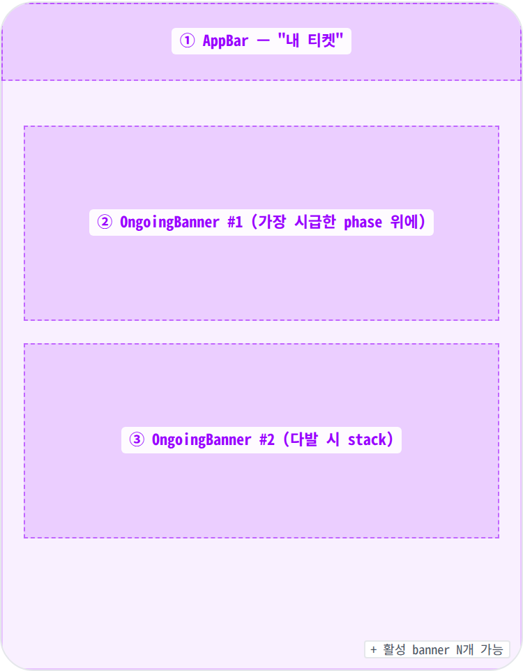
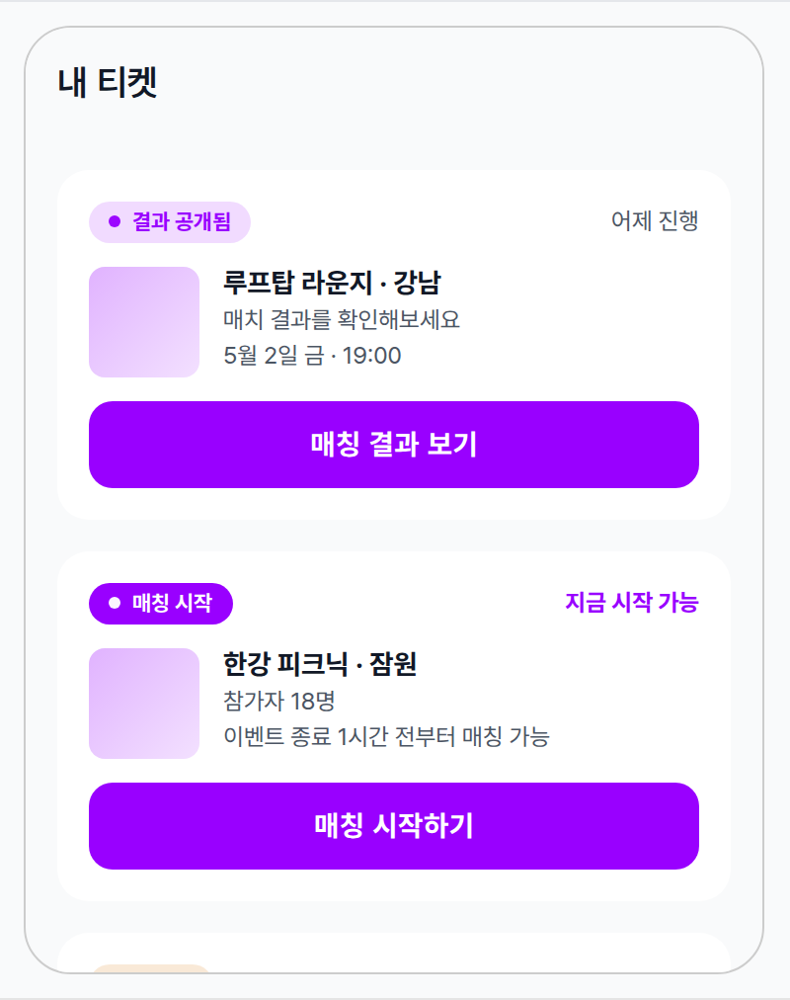
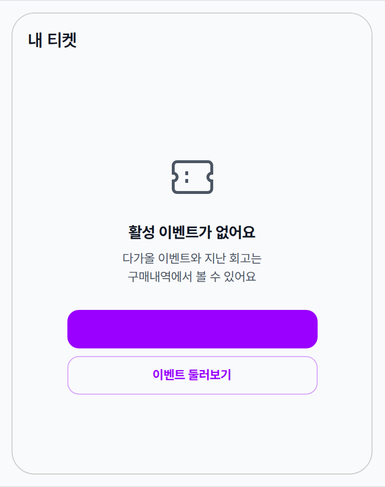
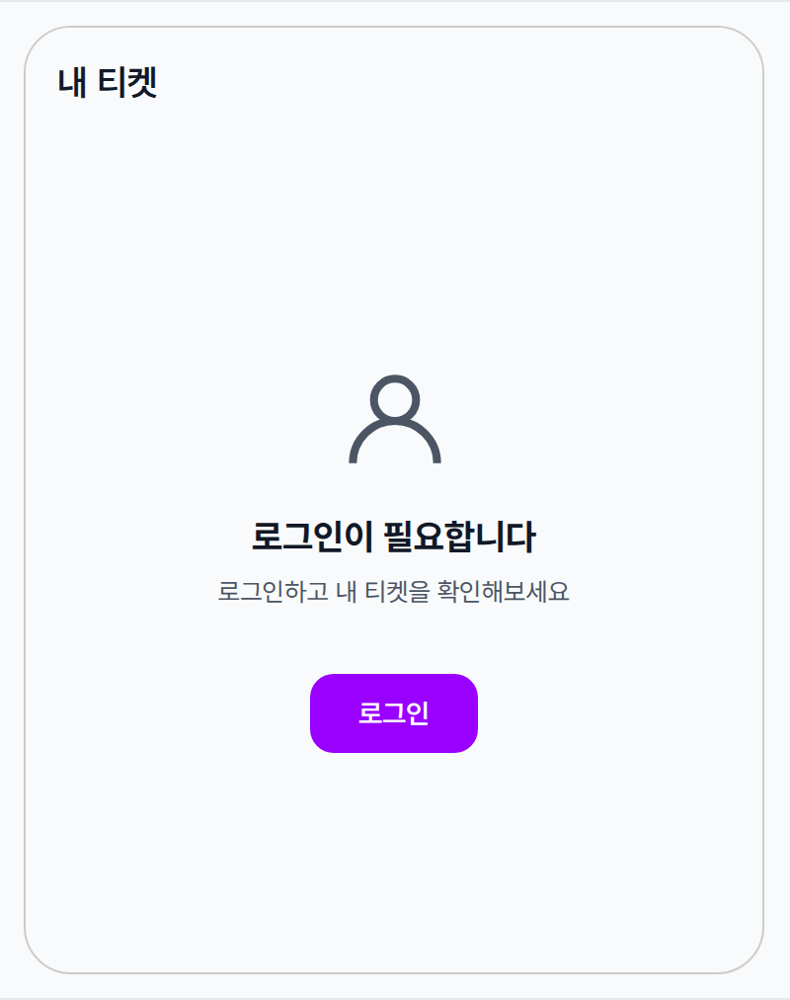

 Spec — MyTicketsPage (app\_user · MyTicketsRoute)  

# My Tickets Page

## Overview

| Status | ✅ 디자인완료 — v2.0 · 활성 이벤트 lifecycle hub · 3 state · OngoingBanner stack |
|---|---|
| App | app_user |
| Category | my · ticket · live event hub |
| Route / Surface | MyTicketsRoute · widget: MyTicketsPage |
| Path | /tickets/my |
| Hierarchy | Parent: MyPage "활동 → 내 티켓" tile에서 진입.Children: EventOngoingBanner atom × N (활성 이벤트별 1개) — 각 banner footer 탭 시 routed sheet 5종(check-in / checked-in / matching / results / review)으로 진입. EventNowBar와 동일한 sheet endpoint 공유. |
| Purpose | 활성 이벤트 lifecycle 액션 hub — "지금·오늘·결과 대기" actionable 카드만 노출. 진행 중이거나 결과 공개됐거나 체크인 안 한 이벤트들이 OngoingBanner stack으로 쌓임. 다가오는 / 지난 이벤트 timeline 뷰는 PurchaseHistory에 위임 — 이 페이지는 actionable에만 집중. |
| User journey | Entry points: MyPage "활동 → 내 티켓" tile / 결제 완료·매칭 시작·결과 공개 푸시 알림에서 deep-link.Exit points: OngoingBanner footer action 탭 → routed sheet (5종) · 카드 본체 탭 → EventDetailRoute · empty state "구매내역 보기" → PurchaseHistory · "이벤트 둘러보기" → HomePage · 뒤로 가기 → MyPage. |
| Background | v1.0은 Today banner + 다가오는/지난 list로 구성됐으나, 다가오는·지난 timeline은 PurchaseHistory가 이미 cover하므로 중복. v2에서 미션을 "actionable 이벤트 hub"로 재정의 — 사용자 시간 압박이 큰 시점(입장 직전 · 매칭 시작 · 결과 공개)에 진입하면 즉시 action 버튼이 보이는 단순한 페이지. MyTicketCard / TodayBanner / ResultPendingCard 모두 OngoingBanner atom으로 통합 (phase prop 분기). EventNowBar(HomePage 하단 64px shortcut)와 같은 lifecycle 모델 + sheet endpoint 공유 — sync source는 backend. |
| Frequency | 이벤트 사이클당 1-3회 — 입장 직전 / 매칭 시작 / 결과 확인 시점에 진입. |

## History

이 spec의 주요 변경 이력. 최신 항목 위.

| Date | Version | Author | Changes |
|---|---|---|---|
| 2026-05-03 | 2.0 | mark-yun | 활성 이벤트 lifecycle hub로 재정의. 기존 Today banner / 다가오는 / 지난 3섹션 구조 폐기 → OngoingBanner atom stack으로 통합. MyTicketCard / TodayBanner / ResultPendingCard sub-anatomy 모두 OngoingBanner로 흡수 (phase prop 분기). 다가오는·지난 timeline은 PurchaseHistory에 위임. State: 4 → 3 (Default with banners / Empty / Logged out · Loading-Error는 AsyncValueWidget 표준). |
| 2026-05-01 | 1.0 | mark-yun | v1.4 template으로 작성. 4 state mini-table, today banner / upcoming / past 3 sub-anatomy, MyTicketCard atom 분해. |

[🧱 Layout](#layout) [🎨 States](#states) [🔄 Global Behavior](#behavior) [📖 Reference](#reference)

🧱

## Layout

AppBar + scroll body — OngoingBanner stack(다발 가능) 또는 empty state. 단순 단층 구조.

## Blueprint & tree

Scaffold + AppBar(title "내 티켓") + ListView. 활성 이벤트가 있으면 [OngoingBanner](/specs/event_ongoing_banner/index.html)들이 시간순 정렬로 stack. 활성 이벤트가 없으면 empty state 카드 노출. 섹션 헤더 / 그룹 분리 없이 **flat list** — 모든 banner가 동등한 actionable 카드로 보임.

**Scaffold** └─ **AppBar**(_title: "내 티켓"_) ← ① └─ **MinglitAsyncValueWidget<ActiveBannerList>** ├─ data: │ └─ _if banners.isNotEmpty_ │ └─ **ListView** · vertical · spacing-medium gap │ └─ [**EventOngoingBanner**](/specs/event_ongoing_banner/index.html) × N ← ②③ │ _(phase별 정렬 — Behavior 참조)_ │ ├─ data + empty: │ └─ **\_TicketsEmptyState** │ ├─ Icon (ticket\_outlined · 64px · onSurfaceVariant) │ ├─ Title "활성 이벤트가 없어요" │ ├─ Sub "다가올 이벤트와 지난 회고는 구매내역에서 볼 수 있어요" │ └─ Actions (vertical stack) │ ├─ "구매내역 보기" primary → PurchaseHistoryRoute │ └─ "이벤트 둘러보기" outline → HomeRoute │ └─ unauthenticated: └─ **\_AuthGuard** (Icon + 로그인 안내 + LoginRoute CTA)

| # | Region | Alignment | Spacing |
|---|---|---|---|
| — | Body padding | — | vertical: spacing-medium (16) · horizontal: 0 (banner 자체에 좌우 padding) |
| ① | AppBar | title only · scaffold gray bg · no border | height: 56 · surfaceTintColor: transparent · elevation 0 |
| ②③ | OngoingBanner stack | vertical · 시간순 / phase 시급도 정렬 | 각 banner v-margin spacing-medium (16) · h-margin spacing-screen-edge (16) · 자세한 시각 contract은 event_ongoing_banner spec |

🎨

## States

3가지 변형 — Default(banner stack) / Empty(활성 X) / Logged out(auth guard). banner 내부 phase 분기는 OngoingBanner spec에서 다룸.

**State 식별 기준**: ① 로그인 여부 (비로그인이면 auth guard) → ② 활성 banner 데이터 (있으면 stack, 없으면 empty). 데이터 로딩 / 에러는 표준 `MinglitAsyncValueWidget`이 처리(spinner / retry).

### Default · 활성 이벤트 있음 🎯 baseline · 1개 이상의 OngoingBanner stack

| 항목 | 내용 |
|---|---|
| 조건 | 로그인된 상태로 진입했고 활성 이벤트(waiting ~ results 확인 / noShow phase 중 어떤 것이든)가 1개 이상 존재하는 경우. banner stack으로 노출. |
| 사용자 액션 | ① OngoingBanner footer action 탭 — 현재 phase에 맞는 routed sheet로 진입 (5종 — check-in / checked-in / matching / results / review).② "길찾기" outline 탭 (waiting · checkInReady에만 노출) — 외부 지도 앱 호출.③ 카드 본체(thumb / title) 탭 — EventDetailRoute push (이벤트 정보 재확인).④ 뒤로 가기 — MyPage로 복귀. |
| 에지케이스 | · banner는 phase 시급도 → 시간 임박 순으로 정렬 (Behavior 참조).· 다발 케이스 흔함 — "어제 결과 미확인 + 오늘 시작 예정" 동시 노출.· banner 내부 phase 분기 / sub-state는 OngoingBanner spec에서 다룸 — 여기서는 stack 컨테이너만 책임. |
| 컴포넌트 | · Scaffold + AppBar(title: "내 티켓")· MinglitAsyncValueWidget<ActiveBannerList> (loading spinner / error retry 표준 처리)· ListView · vertical · phase 시급도 정렬· EventOngoingBanner × N (phase prop으로 시각 분기) |
| 토큰 | · color: color-surface(scaffold), color-background(banner card surface), color-text-primary(title), color-text-secondary(meta)· spacing: spacing-medium(banner v-margin · body v-padding), spacing-screen-edge(banner h-margin)· radius: radius-card(banner)· 그 외 token은 OngoingBanner spec 참조 |
| 노트 | 📝 mockup은 다발 케이스(3 banner stack) 예시 — 실제로는 0~N개 가변. flat list라 섹션 헤더 없음 — 모든 banner가 동등한 actionable 카드. |

### Empty · 활성 이벤트 없음 활성 banner 0개 — 구매내역 / 둘러보기로 안내

| 항목 | 내용 |
|---|---|
| 조건 | 로그인 상태이고 데이터 로드 완료 — 활성 banner 0개. 가장 흔한 진입 케이스 중 하나 (이벤트 사이클 사이의 평소 시점). |
| 사용자 액션 | ① "구매내역 보기" primary 탭 → PurchaseHistoryRoute (다가올·지난 이벤트 timeline)② "이벤트 둘러보기" outline 탭 → HomeRoute (이벤트 추천 feed)③ 뒤로 가기 → MyPage 복귀 |
| 에지케이스 | · 사용자가 결제는 했는데 ended 이후로만 들어왔다면 empty 상태 (회고는 PurchaseHistory에).· 신규 가입 직후 결제 0건이면 동일하게 empty — sub 카피가 동일하게 작동 (구매내역으로 보내면 또 empty겠지만 거기서도 추천 link). |
| 컴포넌트 | ↔ Default 대비 body 영역만 변경:↔ Scaffold · AppBar · MinglitAsyncValueWidget 동일+ _TicketsEmptyState(private widget · Center+Column · Icon + title + sub + 2 button stack)− ListView / OngoingBanner stack 미사용 |
| 토큰 | ↔ Default ++ color-text-secondary(icon · sub text)+ spacing-large(empty wrapper h-padding · icon → title gap)+ radius-button(link button) |
| 노트 | 📝 empty는 부정적 톤 X — "할 거 있을 때 다시 와요" 보다 "구매내역 / 둘러보기로 가요"의 forward-leaning 메시지. 사용자가 잘못 들어온 게 아님을 명시. |

### Logged out · 비로그인 auth guard — 일반적인 사용자 흐름엔 거의 안 보임

| 항목 | 내용 |
|---|---|
| 조건 | 로그인되지 않은 상태에서 진입(외부 딥링크 등 예외적 케이스). 일반 사용자는 MyPage 자체가 auth guard라 드물게 발생. |
| 사용자 액션 | + "로그인" CTA 탭 → LoginRoute (성공 시 자동 복귀). |
| 에지케이스 | · 로그인 성공 후 자동으로 Default 또는 Empty로 분기 (banner 데이터 fetch 결과 따라). |
| 컴포넌트 | ↔ Default body 영역만 변경 → _AuthGuard(Icon + title + sub + MinglitButton). |
| 토큰 | ↔ Default + color-primary(CTA bg) + spacing-xlarge(sub → CTA gap). |
| 노트 | 📝 거의 안 보이는 예외 상태 — 메인 동선은 MyPage auth guard에서 잡힘. |

🔄

## Global Behavior

stack 정렬 / phase 전환 motion / EventNowBar와의 동기화 / 다발 케이스.

## Stack 정렬 우선순위

활성 banner가 다발일 때 시급도 + 시간 임박 순으로 정렬. [OngoingBanner](/specs/event_ongoing_banner/index.html) spec의 phase 우선순위와 동일.

| 우선 순위 | Phase | 이유 |
|---|---|---|
| 1 | checkInReady · matchingReady · results 미확인 | action — pulse 강조 · 즉시 사용자 입력 필요 |
| 2 | matching | passive — 결과 대기 중 |
| 3 | results 확인 완료 | passive — 회고 진입 (outline) |
| 4 | checkedIn | passive — 자동 전환 대기 |
| 5 | waiting | passive — 시작 전 대기 |
| 6 | noShow | passive — 정보성 (액션 없음) |

같은 우선 순위 내에서는 시간 임박 순 (이벤트 시작 시각 / 종료 시각 가까운 것이 위).

## EventNowBar와의 동기화

-   [EventNowBar](/specs/event_now_bar/index.html)(HomePage 하단 64px shortcut)는 활성 이벤트 1건의 phase 1-5만 안내 — 같은 lifecycle 데이터를 공유.
-   EventNowBar에서 sheet 진입 → mutation → MyTicketsPage banner도 즉시 phase 갱신 (반대 방향도 동일).
-   phase 6(results)부터는 OngoingBanner 전속 — EventNowBar는 결과 안내까진 안 감.
-   noShow alt path / 결과 확인 여부 / 1주일 보관 등 lifecycle 정책은 모두 backend가 진실 source.

## Cross-cutting interactions

| 사용자 액션 | 화면에 보이는 결과 |
|---|---|
| 뒤로 가기 (시스템 back · AppBar back) | MyPage로 복귀. |
| 다크 모드 토글 | scaffold·banner card·empty illust 모두 다크 토큰으로 자동 전환. |
| 새로 banner 추가됨 (push 도착 등) | list 상단에 슬라이드 다운 + opacity fade-in (300ms · MinglitAnimation.medium). |
| banner 제거됨 (1주일 만료 / 결과 확인 후 1주일) | opacity fade-out → height collapse (200ms · MinglitAnimation.fast). |
| list 끝 도달 | banner 마지막 카드 아래 spacing-medium 여백 후 safeArea로 자연스럽게 마감 (load more 없음 — 활성 이벤트는 finite). |

## Global edge cases

-   **네트워크 끊김** — 마지막 캐시된 banner stack 그대로 유지 + Snackbar "오프라인" 안내. 개별 banner 액션은 시도 시 retry prompt.
-   **이벤트 cancel** — banner는 다음 새로고침 시 사라지고 PurchaseHistory에 환불 진행 카드로 이관.
-   **phase 동기화 지연** — backend / 클라이언트 phase 불일치 시 polling 또는 push로 자동 보정 (EventNowBar와 동일 동작).
-   **매우 많은 활성 이벤트 (10+)** — 이론상 가능하나 실제 사용자 동시 활성은 ≤3건 수준. ListView가 vertical scroll 처리.

📖

## Reference

implementation source + 인접 spec.

## Implementation source

| Widget | MyTicketsPage — apps/app_user/lib/src/features/tickets/my_tickets_page.dart (v2 폴리시 적용 예정) |
|---|---|
| Route | MyTicketsRoute · /tickets/my |
| OngoingBanner atom | EventOngoingBanner — 8 visible state + 1 hidden · phase prop 분기 · 5 sheet endpoint 공유 |
| Provider | activeEventBannersProvider — phase 시급도 정렬된 active banner list 제공. EventNowBar와 같은 source. |
| Backend | event_applications.match_results_viewed_at — 결과 확인 여부. 1주일 보관 정책은 server-side timestamp 비교로 enforce. |
| Empty state copy | "활성 이벤트가 없어요" / "다가올 이벤트와 지난 회고는 구매내역에서 볼 수 있어요" |

## Related screens / atoms

| Spec | Relation |
|---|---|
| EventOngoingBanner | 이 페이지의 핵심 atom — list 안의 모든 카드. phase별 시각/액션 분기 풀세트. |
| MyPage | 유일한 진입 surface — "활동 → 내 티켓" tile. |
| PurchaseHistory | 다가오는 / 지난 이벤트 timeline 위임 — empty state primary CTA의 목적지. |
| EventNowBar | HomePage 하단 64px shortcut — 같은 lifecycle 데이터 공유 · phase 1-5만 cover. |
| HomePage | empty state outline CTA "이벤트 둘러보기" 목적지. |
| LoginPage | logged-out auth guard CTA 목적지. |