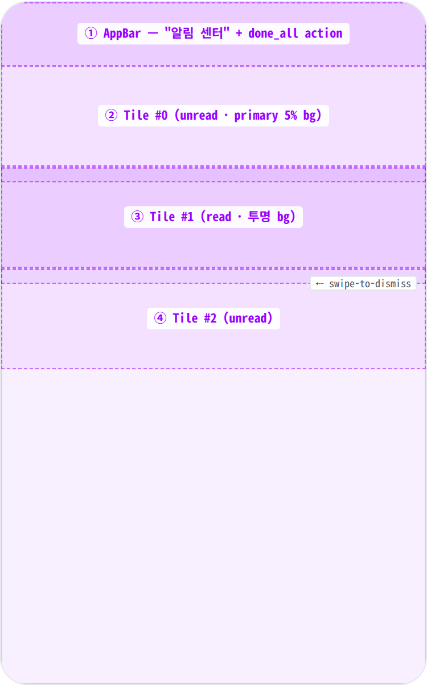
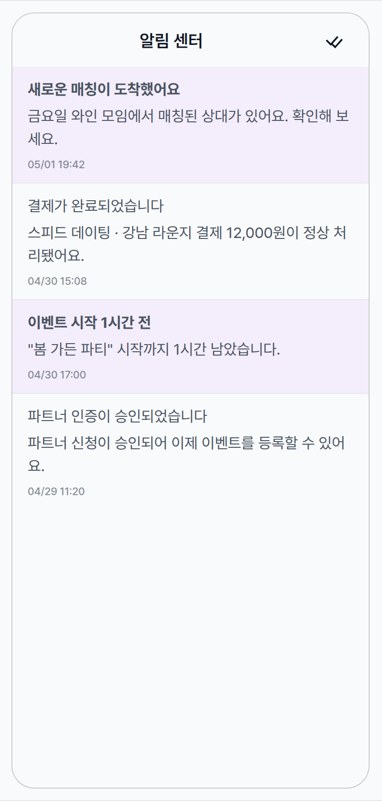
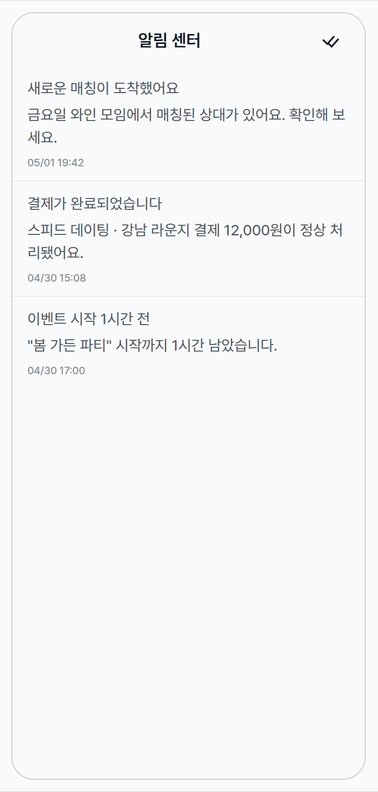
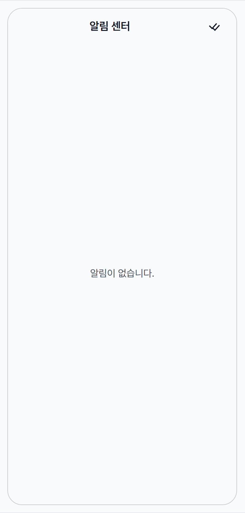
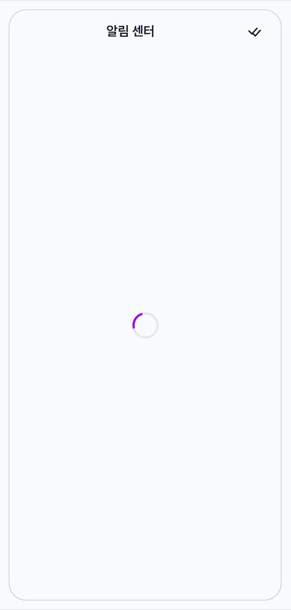
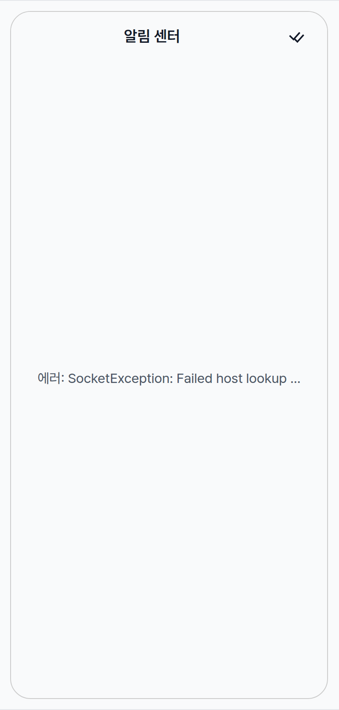

 Spec — NotificationListScreen (kit-shared · NotificationCenterRoute)  

# Notification List Screen

## Overview

| Status | 디자인완료 — 5 state · kit-shared (user + partner) |
|---|---|
| App | app_user + app_partner — shared between user / partner. 두 앱 모두 NotificationCenterRoute가 동일한 NotificationListScreen(kit-shared)을 그대로 push 한다. 분기 props 없음. |
| Category | notification · feed · async-list |
| Route / Surface | NotificationCenterRoute · widget: NotificationListScreen (shared/packages/minglit_kit) |
| Path | /notifications (user · partner 동일) |
| Hierarchy | Parent: user — HomePage AppBar 알림 아이콘 · partner — PartnerHomePage AppBar 알림 아이콘Children: — (알림 탭 시 해당 알림이 가리키는 화면으로 이동 — 별도 spec) |
| Purpose | 푸시 / 인앱 알림 히스토리를 한곳에서 보고, 읽음 처리·전체 읽음·개별 삭제·deep-link 이동을 수행하는 단일 list 화면. 데이터 소스는 user_notifications 테이블 (page size 20). |
| User journey | Entry points: HomePage / PartnerHomePage AppBar 알림 아이콘 (미읽음 배지) · 외부 push 알림 → 직접 진입 (deep-link).Exit points: 알림 탭 → 해당 알림이 가리키는 화면으로 이동 · 우→좌 스와이프 → 해당 알림이 화면에서 사라지고 화면은 유지 · AppBar "모두 읽음" → 전체 읽음 처리 후 화면 갱신 · 뒤로 가기 → 홈으로 복귀. |
| Background | 알림의 읽음 / 미읽음 시각 구분이 핵심. 미읽음 알림은 살짝 들어간 강조 톤과 굵은 제목으로 표시되고, 읽은 알림은 일반 텍스트로 표시됨. 알림을 탭하면 화면에 즉시 반영되고, 서버 처리에 실패하더라도 화면은 항상 성공한 것처럼 동작해 사용자 경험이 끊기지 않음. 스와이프 삭제 역시 화면에서 즉시 사라지는 형태. |
| Frequency | 활성 사용자 일 1-3회 (push 알림 도착 빈도 / 읽지 않은 알림 누적 시). |

## History

이 spec의 주요 변경 이력. 최신 항목 위.

| Date | Version | Author | Changes |
|---|---|---|---|
| 2026-05-01 | 1.0 | mark-yun | v1.4 template으로 작성. 5 state(Default mixed / All-read / Empty / Loading / Error) mini-table, kit-shared 1 widget · 2 앱 동시 entry, ListTile + Dismissible swipe + primary tintFill 0.05 unread overlay 분해. |

[🧱 Layout](#layout) [🎨 States](#states) [🔄 Global Behavior](#behavior) [📖 Reference](#reference)

🧱

## Layout

AppBar(타이틀 + "모두 읽음" 액션) + 당겨서 새로고침 가능한 알림 목록. 각 알림 항목은 우→좌 스와이프 시 빨간 삭제 배경이 노출되며, 끝까지 밀면 해당 항목이 사라짐.

## Blueprint & tree

Scaffold + AppBar(타이틀 "알림 센터", 우측 "모두 읽음" 아이콘) + 본문은 알림 데이터 진행 상태에 따라 노출되는 형태가 갈림. 알림이 도착한 경우에는 당겨서 새로고침 가능한 목록이 노출되며, 항목 사이에는 1px 구분선이 들어감. 항목 자체에는 좌측 아이콘 없이 제목 + 본문 + 시간 정보가 세로로 쌓여 노출됨.

**Scaffold** └─ **AppBar**(_title: "알림 센터"_) ← ① │ └─ actions: \[**IconButton**(Icons.done\_all, tooltip "모두 읽음")\] └─ **MinglitAsyncValueWidget<List<Map>>** └─ data: _if notifications.isEmpty → Center("알림이 없습니다.")_ _else →_ └─ **RefreshIndicator**(onRefresh: `controller.refresh()`) └─ **ListView.separated** ├─ separator: **Divider**(height: 1) └─ itemBuilder: **Dismissible**(key: id, direction: endToStart) ← ②③④ ├─ background: Container(_color: error_) + Icons.delete (right) ├─ onDismissed: `controller.deleteNotification(id)` └─ child: **ListTile** ├─ tileColor: _isRead ? null : primary.withValues(0.05)_ ├─ title: **Text**(title, _w700 if !isRead else normal_) ├─ subtitle: **Column** │ ├─ SizedBox(_xsmall_) │ ├─ **Text**(body) │ ├─ SizedBox(_xsmall_) │ └─ **Text**(_MM/dd HH:mm_, labelSmall · outline color) └─ onTap: markAsRead(id) → push(deep\_link) | snackBar 분기

| # | Region | Alignment | Spacing |
|---|---|---|---|
| — | Body padding | — | ListView edge-to-edge · 좌우 padding 없음 (ListTile 내부 default 16px horizontal) |
| ① | AppBar | title centered (Material default) · trailing action right | height 56 · scaffold gray bg · border-bottom 없음 · IconButton 48×48 hit target |
| ②③④ | Notification ListTile | title left · time bottom-left of subtitle | ListTile default density · horizontalTitleGap 16 · vertical pad 8 · 좌우 16 · subtitle Column에 SizedBox(xsmall=4) × 2 (title gap · time gap) |
| — | Inter-tile divider | full width | Divider(height: 1) · color outlineVariant — full width (indent 없음 — leading icon 부재) |
| — | Dismissible swipe BG | centerRight — Icon delete 우측 정렬 | padding-right spacing-large (24) · bg MinglitColors.error · icon color MinglitColors.background (white) |

## Notification tile sub-anatomy

tile 자체는 plain Material `ListTile`. 단 두 가지 변주: **tileColor**(unread → primary tintFill 0.05) + **title fontWeight**(unread → bold). leading 아이콘 / trailing chevron 없음. Dismissible로 감싼 결과 좌측 swipe 시 background 노출.

| Region | Alignment | Notes |
|---|---|---|
| title | top-left · single line (overflow ellipsis — Material default) | bodyMedium · color onSurfaceVariant · weight bold (unread) / normal (read) |
| subtitle Column · body | title 아래 좌측 | bodyMedium 그대로 — Text(body) · multi-line wrap (Material ListTile은 height auto-grow) |
| subtitle Column · time | body 아래 좌측 | labelSmall · color colorScheme.outline · format DateFormat('MM/dd HH:mm') → created_at UTC를 toLocal() |
| tileColor | — | unread → theme.colorScheme.primary.withValues(alpha: MinglitOpacity.tintFill = 0.05) · read → null (투명, scaffold 비침) |
| swipe background | centerRight | 전체 영역을 덮는 Container(error red) · Icons.delete 22px · padding-right spacing-large |

🎨

## States

5개 변형. baseline = 읽음 / 미읽음이 섞여있는 일반 상태. 데이터가 도착하기 전 / 도착하지 않을 때의 변형도 함께 다룸.

**State 식별 기준**: 알림 데이터를 가져오는 진행 상태(로딩 / 오류 / 도착) + 도착한 데이터의 건수에 따라 5가지 변형. All-read 변형은 도착한 알림이 모두 읽음 처리되었을 때의 시각적 변주이며, 본문 구조는 Default와 동일.

### Default · 읽음 + 미읽음 혼합 🎯 baseline · 미읽음 알림에 옅은 강조 톤이 적용된 형태

| 항목 | 내용 |
|---|---|
| 조건 | 로그인된 사용자에게 알림이 1건 이상 도착해 있는 상태. 최신 항목이 위에 오는 순서로 노출. |
| 사용자 액션 | ① 알림 탭 — 해당 알림이 즉시 읽음 처리되며, 알림이 가리키는 화면으로 이동.② 우→좌 스와이프 — 빨간 삭제 배경과 휴지통 아이콘이 노출되고, 끝까지 밀면 해당 알림이 화면에서 즉시 사라짐.③ AppBar "모두 읽음" 탭 — 모든 알림이 읽음 처리되며, 모두 읽음 변형으로 전환.④ 아래로 당겨 새로고침 — 알림 목록을 다시 가져옴.⑤ 뒤로 가기 — 홈으로 복귀. |
| 에지케이스 | · 알림이 가리키는 링크가 비어 있으면 "이동할 링크가 없습니다." 안내가 잠깐 노출됨. 이때도 읽음 처리는 정상적으로 수행.· 알림이 가리키는 링크가 올바르지 않으면 "올바르지 않은 링크입니다." 안내가 잠깐 노출됨. 이때도 읽음 처리는 정상적으로 수행.· 알림 본문이 비어 있는 경우 빈 영역으로 표시되어도 화면이 깨지지 않음.· 읽음 / 삭제 처리는 화면에서 즉시 반영되며, 서버 처리에 실패하더라도 사용자에게 별도 알림은 노출되지 않음. 다음 새로고침 시점에 서버 상태와 다시 맞춰짐.· 파트너 앱에서도 동일한 목록·포맷이 노출됨 (분기 없음). |
| 컴포넌트 | · Scaffold + AppBar(title: Text('알림 센터'), actions: [IconButton(Icons.done_all)])· MinglitAsyncValueWidget<List<Map>> 외곽 wrap (단 error 분기는 inline override)· RefreshIndicator (Material default · primary spinner)· ListView.separated + Divider(height: 1)· Dismissible(direction: endToStart · key: id) — background Container(error) + Icons.delete· ListTile(tileColor 분기 · title bodyMedium · subtitle Column 3-row · onTap)· SnackBar(deep_link null/invalid 분기 시) |
| 토큰 | · color: color-surface (scaffold + AppBar bg · light gray), color-primary (unread tint tintFill = 0.05), color-text-primary (AppBar title · IconButton fg · ListTile title), color-text-secondary (subtitle body · onSurfaceVariant), color-divider (outlineVariant · inter-tile divider · time outline color), color-error (Dismissible bg), color-background (Dismissible delete icon = white)· radius: — (tile은 사각, ListTile default · radius 없음)· spacing: spacing-large (24 · Dismissible padding-right), spacing-screen-edge (16 · ListTile horizontal default), spacing-xsmall (4 · subtitle Column에 SizedBox 2개 — title→body, body→time)· opacity: MinglitOpacity.tintFill = 0.05 (unread tile bg)· typography: appBarTitle (18/600), bodyMedium (16 · title + body — title은 unread 때 w700, read 때 normal), labelSmall (11/500 · time · outline color) |
| 노트 | 📝 위 mockup은 4건만 노출했지만 실제로는 한 번에 최대 20건까지 보임. kit-shared 위젯이라 사용자 / 파트너 양쪽에서 같은 화면이 노출되며, 파트너 앱의 강조 색이 약간 다른 톤이라 미읽음 강조 톤 색이 사용자 앱과 미세하게 다르게 보일 수 있음 — 의도된 결과. |

### All-read · 모두 읽음 처리됨 알림이 있지만 모두 읽음 처리된 상태 — 강조 톤 없이 평면 형태

| 항목 | 내용 |
|---|---|
| 조건 | baseline과 동일하지만 화면 안의 모든 알림이 읽음 처리된 상태. 사용자가 "모두 읽음"을 탭한 직후나, 시간이 지나며 자연스럽게 모두 확인된 경우. |
| 사용자 액션 | 동일: 알림 탭 / 스와이프 / 당겨서 새로고침 / 뒤로 가기.↔ "모두 읽음" 버튼 탭은 그대로 유효하지만 시각적 변화는 없음.− 미읽음 강조 톤이 없으므로 사용자 입장에서는 평면적인 목록으로 보임. |
| 에지케이스 | · 이미 모두 읽음인 상태에서 다시 "모두 읽음"을 탭해도 화면은 변하지 않음.· 새 알림이 도착하면 그 항목만 미읽음 강조 톤이 적용되어 자동으로 혼합 변형으로 전환됨. |
| 컴포넌트 | 동일 — ListTile tileColor: null (unread 분기 미적용) |
| 토큰 | ↔ baseline 동일− MinglitOpacity.tintFill = 0.05 미사용 (unread 0건)− title w700 분기 미사용 — 모든 tile w400 normal |
| 노트 | 📝 미읽음 강조 톤이 모두 빠지므로 화면이 "지난 알림 보관함" 같은 인상이 됨. |

### Empty · 알림 없음 도착한 알림이 한 건도 없는 상태

| 항목 | 내용 |
|---|---|
| 조건 | 도착한 알림이 한 건도 없는 상태. 신규 사용자이거나 모든 알림을 직접 스와이프해 지운 경우. |
| 사용자 액션 | − 목록 항목이 없으므로 탭·스와이프 액션은 없음.↔ "모두 읽음" 버튼은 노출되지만 사실상 변화 없음.동일: 뒤로 가기 → 홈으로 복귀. |
| 에지케이스 | · 이 상태에서는 아래로 당겨 새로고침 제스처가 작동하지 않음. 다시 시도하려면 화면을 떠났다 다시 들어와야 함 (개선 후보).· "모두 읽음" 버튼은 알림이 없을 때도 노출됨 (시각적 noise — 개선 후보). |
| 컴포넌트 | ↔ ListView / RefreshIndicator → Center(child: Text('알림이 없습니다.')) 단일 — 전용 EmptyState atom 미사용 (plain Text) |
| 토큰 | − list 토큰 모두 미사용+ color-text-secondary (Text 색 — bodyMedium default)+ color-surface (scaffold bg 유지) |
| 노트 | 📝 다른 화면들의 표준 Empty 비주얼(아이콘 + 안내 + CTA) 대비 매우 빈약한 안내. 후속 작업에서 보강 검토 가치. |

### Loading 알림 목록을 가져오는 중에 노출되는 상태

| 항목 | 내용 |
|---|---|
| 조건 | 화면에 처음 들어왔거나, "모두 읽음" 직후 목록을 다시 가져오는 동안 노출되는 상태. 본문 영역 중앙에 로딩 인디케이터만 노출. |
| 사용자 액션 | ↔ 목록 액션 / 새로고침 / 스와이프는 모두 사용 불가.동일: "모두 읽음" 버튼은 노출되며 탭하면 다음 응답에 반영됨.동일: 뒤로 가기 → 홈으로 복귀. |
| 에지케이스 | · "모두 읽음" 직후 목록을 다시 가져올 때 잠깐 인디케이터가 보일 수 있음.· 응답이 매우 느리면 인디케이터가 길게 노출될 수 있음 (별도의 시간 제한 없음). |
| 컴포넌트 | ↔ list 전체 → MinglitCircularProgressIndicator (MinglitAsyncValueWidget default loading) · 화면 중앙 |
| 토큰 | − list 토큰 모두 미사용+ color-primary (spinner 색)+ color-surface (scaffold bg 유지) |
| 노트 | 📝 짧게 지나가는 전환 변형 — 보통 수백 밀리초. AppBar는 그대로 노출되어 응답 대기 중에도 "모두 읽음" 버튼이 보임. |

### Error 알림을 가져오는 데 실패한 상태

| 항목 | 내용 |
|---|---|
| 조건 | 알림 데이터를 가져오는 데 실패한 상태. 네트워크 / 권한 / 서버 오류 등. |
| 사용자 액션 | − 목록·스와이프·당겨서 새로고침 모두 사용 불가.− 별도의 다시 시도 버튼은 없음.↔ "모두 읽음" 버튼은 노출되지만 화면에 변화는 없음.동일: 뒤로 가기 → 홈으로 복귀. |
| 에지케이스 | · 현재는 표준 오류 화면 대신 원본 오류 메시지가 그대로 노출됨 — 디버깅에 유리하지만 사용자 경험 측면에서는 보강 필요.· 후속 작업에서 표준 오류 화면("오류가 발생했습니다." + 다시 시도)으로 통일 권장. |
| 컴포넌트 | ↔ list 전체 → Center + Text('에러: $err') (inline override). Default error UI 미적용. |
| 토큰 | − list 토큰 모두 미사용+ color-text-secondary (Text default)+ color-surface (scaffold)− color-error 미사용 (icon / 경고 색 없음) |
| 노트 | 📝 원본 오류 메시지가 그대로 노출되므로 민감 정보가 보일 위험이 있음. 운영 환경에서는 사용자 친화적인 안내 문구로 정제 권장. |

🔄

## Global Behavior

cross-cutting — 모든 state에 적용되는 액션, motion, 글로벌 에지케이스. kit-shared 위젯이라 user/partner 양쪽에서 동일하게 작동.

## Cross-cutting interactions

| 사용자 액션 | 화면에 보이는 결과 |
|---|---|
| 뒤로 가기 (시스템 back · AppBar back) | 홈으로 복귀 (좌→우 슬라이드). |
| 다크 모드 토글 | scaffold·tile·구분선이 다크 토큰으로 자동 전환. 미읽음 강조 톤은 동일한 의미로 유지. |
| tile · 아이콘 버튼 탭 피드백 | 탭 시 가벼운 리플과 haptic light 피드백을 제공. |
| 아래로 당겨 새로고침 | 알림 목록이 노출된 상태에서만 동작. 알림이 없거나 로딩 / 오류 변형에서는 동작하지 않음. |
| 스와이프 일부만 끌고 놓기 | 일정 거리 이상 끌지 않으면 항목이 원래 자리로 돌아옴. 일정 거리 이상 끌면 항목이 사라지면서 삭제됨. |
| 외부 푸시 알림 도착 (백그라운드) | OS 알림 배너가 떠 있을 때 사용자가 배너를 탭하면 알림이 가리키는 화면으로 곧장 이동 (이 화면을 거치지 않음). 이 화면이 떠 있는 동안 새 알림은 자동 갱신되지 않으며, 사용자가 직접 새로고침하거나 다시 들어와야 반영됨. |
| 파트너 앱에서 진입 | 동일한 화면·동일한 동작. 다만 파트너 앱의 강조 색이 살짝 다른 톤이라 미읽음 강조 톤 색이 사용자 앱과 미세하게 다를 수 있음. |

## Motion timing

Source: `shared/packages/mds/core/lib/src/theme/minglit_design_tokens.dart` → `MinglitAnimation`

| Transition | Token / Duration | Notes |
|---|---|---|
| 화면 진입 (홈 → 알림 센터) | MinglitAnimation.fast (200ms) | 화면이 좌→우로 슬라이드되며 진입. |
| 알림 탭 → 다음 화면 이동 | MinglitAnimation.fast (200ms) | 표준 슬라이드 전환. |
| 로딩 → 본문 교체 | — | 별도 부드러운 전환 없이 즉시 교체. |
| 스와이프 후 항목 사라짐 | ~200ms | 스와이프된 항목이 페이드 아웃되며 자리가 자연스럽게 좁혀짐. |
| 탭 리플 | MinglitAnimation.micro (100ms) | 모든 탭 가능한 항목에 적용되는 짧은 리플 피드백. |
| 당겨서 새로고침 인디케이터 | MinglitAnimation.medium (350ms) | 당기는 거리에 따라 인디케이터가 나타났다가 새로고침 후 자연스럽게 사라짐. |

## Global edge cases

-   **읽음 / 삭제 처리는 화면에서 즉시 반영** — 사용자에게는 항상 성공한 것처럼 보이지만, 서버 처리에 실패한 경우 다음 새로고침 시 서버 상태로 되돌아갈 수 있음.
-   **홈의 미읽음 배지와 동기화** — 이 화면에서 읽음 처리하면 홈의 미읽음 배지도 즉시 갱신됨.
-   **페이지네이션 없음** — 한 번에 최대 20건까지만 노출되며, 더 오래된 알림은 보이지 않음. 향후 무한 스크롤 보강 후보.
-   **당겨서 새로고침 영역 한정** — 알림 목록이 보이는 변형에서만 동작. 알림이 없거나 로딩 / 오류 변형에서는 다시 시도하려면 화면을 떠났다 다시 들어와야 함.
-   **사용자 / 파트너 공용 화면** — 동일한 화면이 양쪽 앱에서 노출됨. 미읽음 강조 톤과 로딩 인디케이터 색만 앱별 강조 색에 따라 살짝 다름. 동작·문구·구조는 100% 동일.
-   **실시간 갱신 없음** — 이 화면이 떠 있는 동안 새 알림이 도착해도 자동으로 추가되지 않음. 사용자가 직접 새로고침하거나 다시 들어와야 반영됨.

📖

## Reference

implementation source + 인접 화면.

## Implementation source

| Widget (kit-shared) | NotificationListScreen — shared/packages/minglit_kit/lib/src/features/notification/notification_list_screen.dart (단일 위젯 · user + partner 공용) |
|---|---|
| Controller | NotificationList (Riverpod) — shared/packages/minglit_kit/lib/src/features/notification/notification_list_controller.dart (build / refresh / markAsRead / markAllAsRead / deleteNotification — 모두 optimistic) |
| Repository | NotificationRepository — shared/packages/minglit_kit/lib/src/data/repositories/notification_repository.dart (Supabase user_notifications · page size 20 · created_at desc · markAsRead/All/delete 에러 swallow Fix #1955) |
| Route (user) | NotificationCenterRoute · /notifications · apps/app_user/.../app_routes.dart (line 213) |
| Route (partner) | NotificationCenterRoute · /notifications · apps/app_partner/.../app_routes.dart (line 92) |
| Navigation (user) | homeCoordinator — _router.push(const NotificationCenterRoute().location) (apps/app_user/.../home_coordinator.dart:34) |
| Navigation (partner) | partnerHomeCoordinator — _router.push(const NotificationCenterRoute().location) (apps/app_partner/.../partner_home_coordinator.dart:18) |
| Async wrapper | MinglitAsyncValueWidget — loading은 default(MinglitCircularProgressIndicator) · error는 inline override(plain Center(Text('에러: $err'))) → _DefaultErrorView 미적용 |
| Icons (Material) | done_all (AppBar action — 모두 읽음) · delete (Dismissible swipe BG) |
| Date format | DateFormat('MM/dd HH:mm') (intl) · DateTime.parse(created_at).toLocal() |
| Unread tint | theme.colorScheme.primary.withValues(alpha: MinglitOpacity.tintFill) · tintFill = 0.05 |
| Deep-link 검증 | 코드 114-128행: null/empty → SnackBar "이동할 링크가 없습니다." · prefix '/' 미일치 → SnackBar "올바르지 않은 링크입니다." · valid → context.push(trimmed) |

## Related screens

| Spec | Relation |
|---|---|
| HomePage | user 진입점 — AppBar 알림 아이콘 + 미읽음 배지에서 push. |
| PartnerHomePage | partner 진입점 — 동일 패턴, 동일 위젯. |
| NotificationSettingsScreen | 알림 카테고리별 on/off 설정 — 본 화면과 데이터 모델은 분리(user_settings) 되었지만 동일 repository(NotificationRepository)에서 다룸. |
| deep_link push targets | tile 탭 시 push되는 destination — EventDetailRoute / TicketQRRoute / ApplicationDetailRoute 등 임의. 별도 spec 참조. |