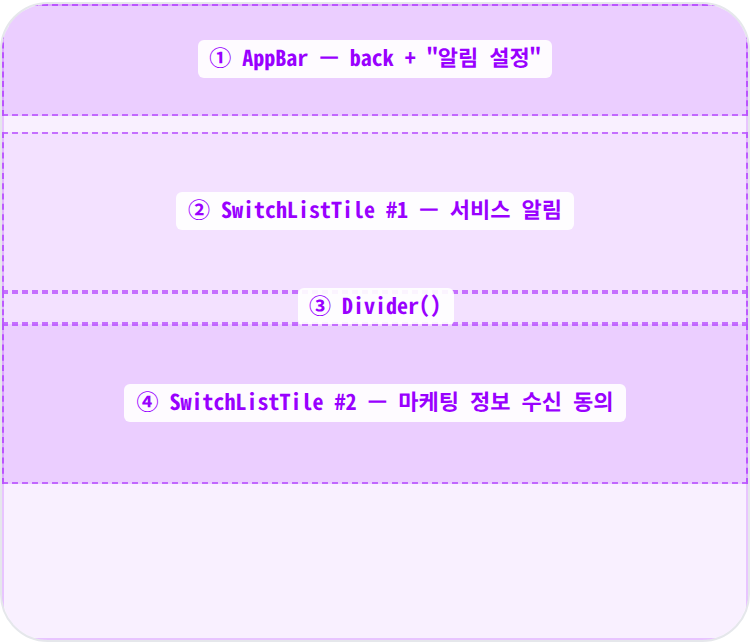
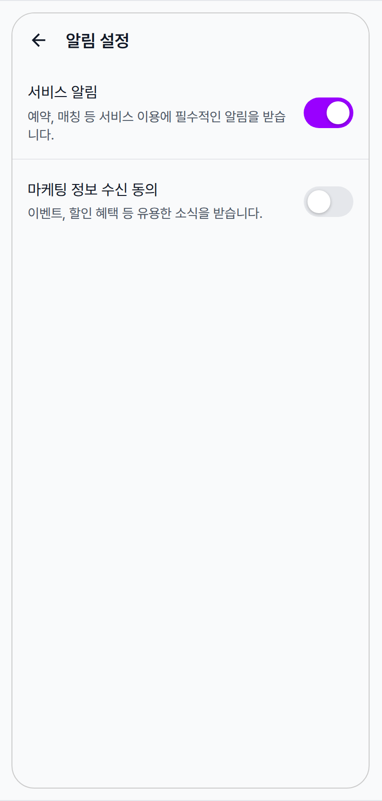
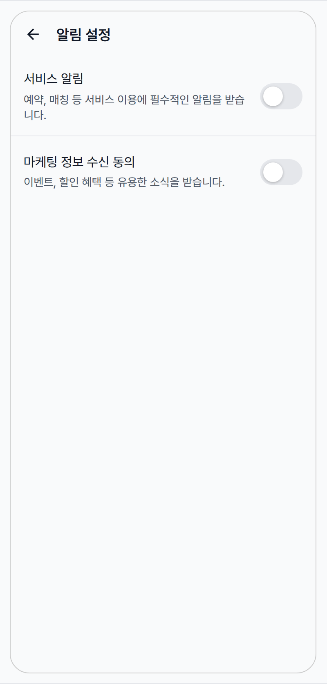
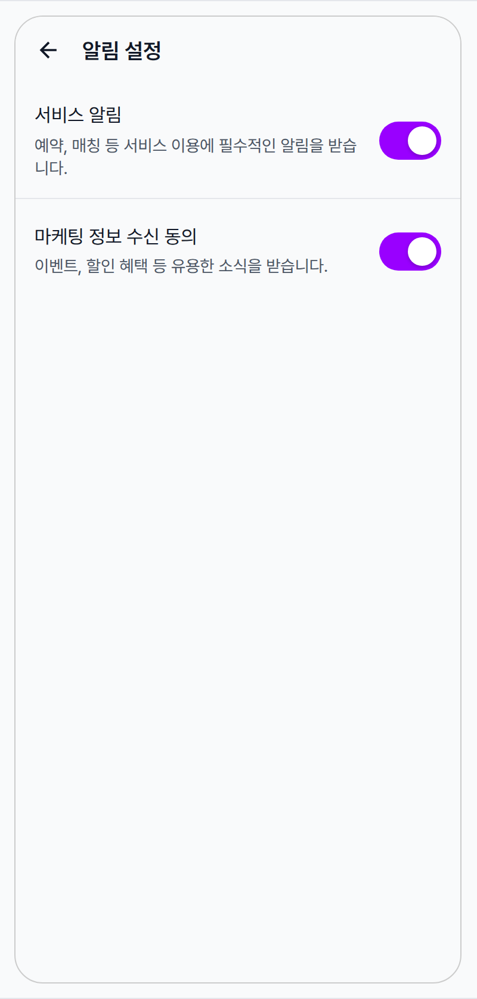
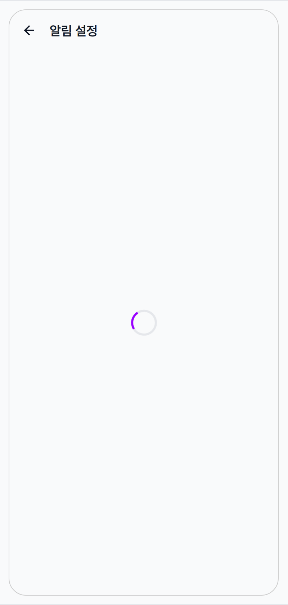
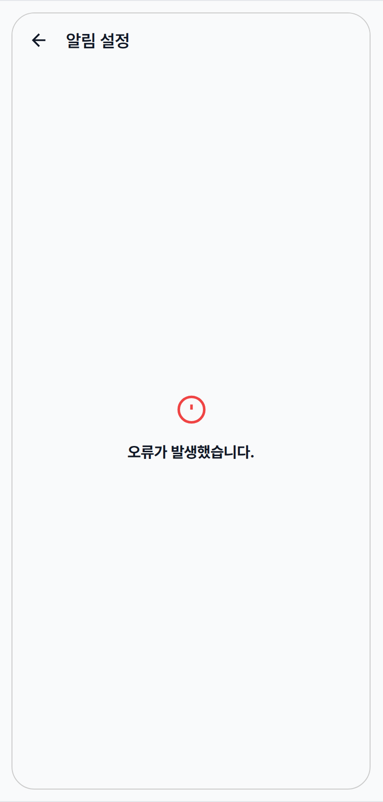
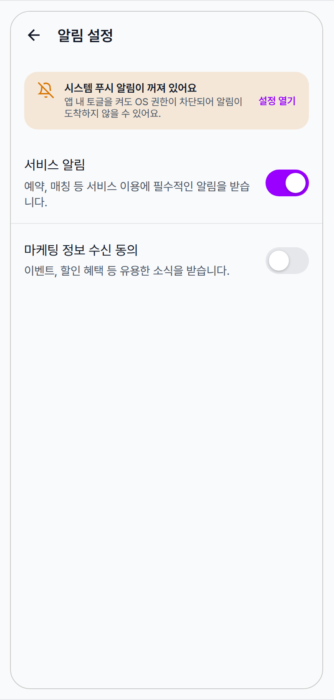

 Spec — NotificationSettingsScreen (kit-shared · NotificationSettingsRoute)  

# Notification Settings Screen

## Overview

| Status | 디자인완료 — 6 state · kit-shared (user + partner) · 토글 2개만 노출하는 minimal settings |
|---|---|
| App | app_user + app_partner — shared. 두 앱 모두 NotificationSettingsRoute가 동일한 NotificationSettingsScreen(kit-shared)을 그대로 push. 분기 props 없음. |
| Category | settings · notification · toggle-list |
| Route / Surface | NotificationSettingsRoute · widget: NotificationSettingsScreen (shared/packages/minglit_kit) |
| Path | /my/notification-settings (user) · /more/notification-settings (partner) |
| Hierarchy | Parent: user — MyPage 알림 설정 tile · partner — MorePage 알림 설정 tileChildren: — |
| Purpose | 앱이 보낼 알림 카테고리(서비스 알림 · 마케팅 정보 수신)에 대한 사용자의 동의를 켜고 끄는 단일 설정 화면. 두 토글은 앱 내 알림 수신 의사를 나타내며, OS 차원의 푸시 권한과는 별개임. |
| User journey | Entry: MyPage / MorePage "알림 설정" tile → context.push(NotificationSettingsRoute().location).Exit: AppBar 뒤로 가기 · 시스템 뒤로 가기 → 직전 화면 복귀. 별도의 저장 버튼은 없음 — 토글을 바꿀 때마다 화면이 즉시 반응하며 변경이 적용됨. |
| Background | 토글 단위 즉시 저장 모델. 사용자가 토글을 바꾸면 화면은 즉시 반응하고, 변경 적용에 실패한 경우 화면 전체가 오류 화면으로 전환되어 사용자가 분명히 인지하도록 함 (알림 센터의 정책과는 다름). |
| Frequency | 매우 낮음 — 가입 직후 1회 또는 마케팅 푸시가 거슬릴 때 산발적. 일반적으로 세션당 ≤ 1회. |

## History

이 spec의 주요 변경 이력. 최신 항목 위.

| Date | Version | Author | Changes |
|---|---|---|---|
| 2026-05-01 | 1.0 | mark-yun | v1.4 template으로 작성. 6 state(Default mixed / All-off / All-on / Loading / Error / Permission-denied) mini-table. kit-shared 단일 위젯 · user(MyPage) + partner(MorePage) 진입점. 주의: 실제 구현은 MinglitSettingsTile이 아니라 Flutter Material SwitchListTile + Divider() 조합 — MDS atom 미적용. |

[🧱 Layout](#layout) [🎨 States](#states) [🔄 Global Behavior](#behavior) [📖 Reference](#reference)

🧱

## Layout

Scaffold + AppBar(타이틀 "알림 설정") + 본문은 토글 항목 2개와 가운데 구분선. 설정 정보 진행 상태에 따라 본문이 로딩 / 오류 / 토글 목록으로 갈림.

## Blueprint & tree

AppBar는 표준 형태(좌측 뒤로가기 · 좌측 타이틀 정렬). 본문은 설정 정보 진행 상태에 따라 분기되며, 설정 정보가 비어 있으면 "설정 정보를 불러올 수 없습니다." 안내가, 정상이면 토글 두 개와 가운데 구분선이 노출됨. 다른 설정 화면들의 카드 기반 그룹 톤과는 달리 단순한 토글 두 개만 노출되는 형태.

**Scaffold** └─ **AppBar**(_title: "알림 설정"_) ← ① └─ **MinglitAsyncValueWidget<UserSettings?>** ├─ loading: _MinglitCircularProgressIndicator_ ├─ error: _\_DefaultErrorView_ (icon + "오류가 발생했습니다.") └─ data: settings == null ? **Center**(_"설정 정보를 불러올 수 없습니다."_) : **ListView**(children) ├─ **SwitchListTile**(서비스 알림) ← ② │ ├─ title: Text(_"서비스 알림"_) │ ├─ subtitle: Text(_"예약, 매칭 등 …"_) │ ├─ value: settings.serviceNotification │ └─ onChanged: controller.updateSetting('service\_notification', v) ├─ **Divider**() ← ③ └─ **SwitchListTile**(마케팅 정보 수신 동의) ← ④ ├─ title: Text(_"마케팅 정보 수신 동의"_) ├─ subtitle: Text(_"이벤트, 할인 혜택 …"_) ├─ value: settings.marketingConsent └─ onChanged: controller.updateSetting('marketing\_consent', v)

| # | Region | Alignment | Spacing |
|---|---|---|---|
| — | Body padding | — | ListView default top/bottom 8 padding · 좌우 0 (SwitchListTile 자체 16 horizontal) |
| ① | AppBar | title left-aligned (Android Material default · centerTitle 미설정) · leading back arrow auto | height 56 · scaffold gray bg · border-bottom 없음 (theme elevation 0 + surfaceTintColor transparent) |
| ②④ | SwitchListTile | title 좌상 · subtitle 좌하 (Column) · Switch 우측 | min-height ≈ 72 · contentPadding (Material default) 16 horizontal · title bodyLarge 16 · subtitle bodyMedium 14 onSurfaceVariant · Switch.adaptive 52×32 |
| ③ | Divider | full width | Divider() default — height 16 reserved · 1px 가운데 라인 · color theme.dividerColor (≈ outlineVariant) |

## SwitchListTile sub-anatomy

Material 기본 `SwitchListTile` — `MinglitSettingsTile`(48px 고정 · trailing toggle)과는 별개 atom이다. subtitle이 두 줄 이상으로 늘어날 수 있고 row 높이도 가변이라 본 화면에서는 평균 ≈ 72px. **Phase 2 후보**: 기존 SwitchListTile을 `MinglitSettingsGroup` + `MinglitSettingsTile(trailing: SettingsTileTrailing.toggle)`로 교체해 my\_page와 시각 통일.

| Region | Alignment | Notes |
|---|---|---|
| title | top-left | bodyLarge 16 · color onSurface · single line (보통) |
| subtitle | title 아래 좌측 | bodyMedium 14 · color onSurfaceVariant · 자연스럽게 wrap (현재 두 항목 모두 1-2줄) |
| Switch (trailing) | centerRight | Switch.adaptive(value, onChanged, activeTrackColor: colorScheme.primary) · Android Material 52×32 · iOS Cupertino 51×31 |
| tile background | — | 투명 (scaffold gray가 비침). disabled/loading 시 별도 색 변경 없음 — onChanged null로만 차단 |
| tap behavior | — | tile 어디를 눌러도 toggle 발동 (SwitchListTile default). subtitle 영역 탭도 토글 트리거. |

🎨

## States

6개 변형. baseline = 서비스 알림 켜짐 / 마케팅 정보 수신 꺼짐 (신규 사용자 기본 형태). 두 토글의 켜짐 / 꺼짐 조합과 데이터 진행 상태(로딩 / 오류 / 도착) + OS 푸시 권한 차단 안내(후속 작업) 변형까지 다룸.

**State 식별 기준**: 설정 정보를 가져오는 진행 상태(로딩 / 오류 / 도착) + 두 토글의 켜짐 / 꺼짐 조합으로 시각이 갈림. Permission-denied 변형은 OS 푸시 권한이 차단된 경우의 디자인 의도를 표현한 후속 작업 후보.

### Default · 서비스 ON / 마케팅 OFF 🎯 baseline · 가장 흔한 초기 상태

| 항목 | 내용 |
|---|---|
| 조건 | 설정 정보가 정상 도착한 일반 신규 가입자의 기본 형태. 서비스 알림은 켜짐, 마케팅 정보 수신은 꺼짐. |
| 사용자 액션 | ① 서비스 알림 토글 탭 — 스위치가 즉시 반응하여 off로 전환되고 변경이 적용됨.② 마케팅 토글 탭 — 스위치가 즉시 반응하여 on으로 전환되고 변경이 적용됨.③ tile 본문 탭 — 제목·보조 문구 영역을 탭해도 토글과 동일하게 동작.④ 뒤로 가기 — 직전 화면(마이페이지 / 더보기)으로 복귀. |
| 에지케이스 | · 변경 적용에 실패하면 화면 전체가 오류 화면으로 전환되어 토글이 보이지 않게 됨. 다시 시도하려면 화면을 떠났다 다시 들어와야 함 — 향후 보강 후보.· 동일 토글을 매우 빠르게 연속 탭하면 마지막 상태가 최종 결과가 됨.· 서비스 알림을 끄면 매칭·결제 같이 중요한 알림도 함께 차단되지만, 현재는 별도 경고가 노출되지 않음 — 향후 확인 안내 도입 후보.· OS 푸시 권한이 꺼져 있어도 이 화면의 토글은 자유롭게 변경 가능 — 두 설정은 별개임. |
| 컴포넌트 | · Scaffold + AppBar(title: Text('알림 설정'))· MinglitAsyncValueWidget<UserSettings?> wrap (default loading / default error)· ListView (separated 아님 · plain children 리스트)· SwitchListTile × 2 (Material · MDS atom 아님)· Divider() × 1 (가운데 1개) |
| 토큰 | · color: color-surface (scaffold + AppBar bg), color-text-primary (title · AppBar title · back arrow), color-text-secondary (subtitle · onSurfaceVariant), color-primary (Switch on track), color-divider (Switch off track · Divider line)· radius: — (SwitchListTile · Divider 모두 사각)· spacing: spacing-medium (16 · contentPadding horizontal), spacing-xsmall (4 · title-subtitle gap)· typography: appBarTitle (18/600), bodyLarge (16 · title), bodyMedium (14 · subtitle) |
| 노트 | 📝 마이페이지의 카드 기반 그룹 톤과 달리 단순 토글 두 개와 가운데 구분선만 있는 형태로 노출됨 — 후속 작업에서 시각 통일 검토 가치. |

### All-off · 둘 다 OFF 두 토글 모두 꺼진 상태 — 화면에서 강조 색이 사라짐

| 항목 | 내용 |
|---|---|
| 조건 | baseline과 동일하지만 사용자가 두 토글을 모두 끈 상태. |
| 사용자 액션 | 동일 — 다시 켜려면 토글을 탭하면 됨. |
| 에지케이스 | · 서비스 알림이 꺼진 상태에서는 매칭·결제 같이 중요한 알림도 도착하지 않음. 현재는 별도 확인 안내가 노출되지 않음.· 마케팅 동의 철회 시 법적으로 사용자에게 즉시 통지가 필요한 경우가 있을 수 있으나 현재는 별도 안내가 없음 — 향후 보강 후보. |
| 컴포넌트 | 동일 — 두 Switch 모두 off 시각 |
| 토큰 | ↔ baseline 동일− color-primary 미사용 (활성 트랙 없음)+ color-divider 활용도 증가 (Switch off track 색상) |
| 노트 | 📝 본문 구조는 baseline과 동일. 두 토글의 강조 색이 빠지면서 화면이 시각적으로 매우 단조로워짐. |

### All-on · 둘 다 ON 두 토글 모두 켜진 상태 — 화면에 강조 색이 두 줄로 노출

| 항목 | 내용 |
|---|---|
| 조건 | baseline에서 마케팅 토글이 추가로 켜진 상태. 가입 시 마케팅 동의를 체크했거나, 사용자가 이 화면에서 직접 켠 경우. |
| 사용자 액션 | 동일. |
| 에지케이스 | · 마케팅 동의·철회 시각이 별도로 기록되지 않아 법적 감사 추적이 부족함 — 향후 보강 후보.· 사용자가 본 화면에서 토글을 껐다 다시 켜더라도 가입 시점의 동의 시각만 남아 있고, 실제 재동의 시각이 갱신되지 않음. |
| 컴포넌트 | 동일 |
| 토큰 | ↔ baseline 동일+ color-primary 활용도 증가 (두 Switch 모두 active track) |
| 노트 | 📝 두 토글이 모두 켜져 있을 때 강조 색이 두 줄에 걸쳐 노출되어 "모든 알림이 켜져 있다"는 시각 단서가 강하게 전달됨. |

### Loading 설정 정보를 가져오는 중에 노출되는 상태

| 항목 | 내용 |
|---|---|
| 조건 | 화면에 처음 들어와 설정 정보가 도착하기 전 짧게 노출되는 상태. 토글을 변경한 직후에는 이 변형으로 빠지지 않음 — 토글 변경은 화면에서 즉시 반영됨. |
| 사용자 액션 | − 토글·항목 액션은 사용 불가.동일: 뒤로 가기는 평소대로 동작. |
| 에지케이스 | · 응답이 매우 느리면 인디케이터가 길게 노출될 수 있음.· 신규 사용자라면 설정 정보가 없을 수도 있지만, 화면이 비지 않도록 기본값으로 자연스럽게 채워짐. |
| 컴포넌트 | ↔ list 전체 → MinglitCircularProgressIndicator (MinglitAsyncValueWidget default) |
| 토큰 | − list 토큰 미사용+ color-primary (spinner)+ color-surface (scaffold bg) |
| 노트 | 📝 짧게 지나가는 전환 변형 — 보통 수백 밀리초 안에 다음 변형으로 교체됨. AppBar는 그대로 노출됨. |

### Error 설정 정보를 가져오지 못했거나 토글 변경에 실패한 상태

| 항목 | 내용 |
|---|---|
| 조건 | 설정 정보를 가져오지 못했거나, 토글 변경 적용에 실패해 화면이 오류 화면으로 전환된 상태. |
| 사용자 액션 | − 토글 사용 불가, 별도의 다시 시도 버튼은 없음.동일: 뒤로 가기로 화면을 떠났다 다시 들어오면 새로 가져옴. |
| 에지케이스 | · 토글 변경에 실패하면 화면 전체가 갑자기 오류 화면으로 바뀜 — 사용자 입장에선 다소 가혹한 경험. 향후 안내 메시지로 가볍게 처리하는 패턴이 권장됨.· 화면에는 일반 안내 문구만 노출되며, 구체적인 오류 사유는 표시되지 않음.· 자동 다시 시도는 일어나지 않으며, 사용자가 화면을 떠났다 다시 들어와야 새로 시도됨. |
| 컴포넌트 | ↔ list 전체 → _DefaultErrorView (MinglitAsyncValueWidget 내부 private) — Icon(error_outline · xlarge) + Text("오류가 발생했습니다." · titleMedium bold) |
| 토큰 | − list 토큰 미사용+ color-error (icon)+ color-text-primary (title)+ color-surface (scaffold) |
| 노트 | 📝 토글 변경 실패가 화면 전체를 오류로 전환시키는 흐름은 사용자에게 가혹한 경험 — 향후 안내 메시지(스낵바)로 가볍게 처리하고 본문은 baseline을 유지하는 패턴 권장. |

### Permission-denied · OS 푸시 권한 차단 OS 차원에서 푸시 권한이 차단되었을 때의 디자인 의도 — 후속 작업 후보

| 항목 | 내용 |
|---|---|
| 조건 | OS 차원에서 푸시 권한이 차단되어 있는 상태. 현재 화면에는 구현되어 있지 않으며, 향후 도입 시 본문 토글 위에 안내 배너가 함께 노출되는 형태가 권장됨. |
| 사용자 액션 | + 배너 "설정 열기" 탭 — OS 시스템 설정으로 이동해 사용자가 권한을 직접 허용한 뒤 앱으로 복귀.동일: 토글은 그대로 변경 가능 (앱 내 설정과 OS 권한은 별개).동일: 뒤로 가기. |
| 에지케이스 | · iOS는 사용자가 한 번 거부하면 시스템 설정에서 직접 허용해야 다시 켤 수 있음 — 배너 CTA가 가장 좋은 진입점.· 안드로이드도 푸시 권한이 별도이므로 동일한 안내 배너가 적합.· 권한이 다시 허용되면 배너는 자연스럽게 사라짐. |
| 컴포넌트 | + 경고 banner(현재 미구현) — Icon(notifications_off) + title/sub + "설정 열기" CTA Text. MinglitAlert 활용 후보 |
| 토큰 | ↔ baseline 동일+ color-warning (banner bg 14% tint · icon 색)+ color-primary ("설정 열기" CTA text)+ radius-card (banner 카드) |
| 노트 | 📝 현재 화면에는 권한 검사 / 안내 배너가 없음. 후속 작업에서 도입할 디자인 의도를 미리 정리해 둔 변형. |

🔄

## Global Behavior

cross-cutting — 모든 state에 적용되는 액션, motion, 글로벌 에지케이스. kit-shared 위젯 — user/partner 동일.

## Cross-cutting interactions

| 사용자 액션 | 화면에 보이는 결과 |
|---|---|
| 뒤로 가기 (시스템 back · AppBar back) | 직전 화면(마이페이지 · 더보기)으로 복귀. 토글마다 즉시 저장되므로 미저장 안내 없음. |
| 다크 모드 토글 | scaffold·꺼진 스위치 트랙·구분선·텍스트가 다크 토큰으로 자동 전환. 켜진 스위치의 강조 색은 동일하게 유지. |
| tile 탭 피드백 | 제목·보조 문구를 포함한 tile 전체가 hit target. 탭 시 가벼운 리플과 haptic light 피드백을 제공. |
| 토글 빠른 연타 | 탭마다 화면이 즉시 반응. 매우 빠르게 연속 탭한 경우 중간 처리에서 실패가 생기면 화면이 오류 화면으로 전환될 수 있음. |
| 파트너 앱에서 진입 | 동일한 화면·동일한 동작. 다만 파트너 앱의 강조 색이 살짝 다른 톤이라 켜진 스위치 색이 미세하게 다를 수 있음. |
| 로그아웃 후 진입 | 로그인 정보가 없는 사용자에게는 "설정 정보를 불러올 수 없습니다." 안내가 노출됨. 일반적으로는 이 화면에 도달하기 전에 로그인 화면으로 자동으로 보내짐. |
| 외부 푸시 알림 도착 (백그라운드) | OS 배너가 떠 있는 동안 이 화면 자체에는 영향이 없음. 두 토글의 상태가 푸시 발송 여부 게이트로 작용. |

## Motion timing

Source: `shared/packages/mds/core/lib/src/theme/minglit_design_tokens.dart` → `MinglitAnimation`

| Transition | Token / Duration | Notes |
|---|---|---|
| 화면 진입 (마이페이지 / 더보기 → 알림 설정) | MinglitAnimation.fast (200ms) | 화면이 좌→우로 슬라이드되며 진입. |
| 스위치 thumb 이동 | ~200ms | 스위치의 thumb가 자연스럽게 좌우로 이동. |
| 스위치 트랙 색 전환 | ~200ms | 꺼짐 → 켜짐 시 회색 트랙이 강조 색으로 부드럽게 페이드. |
| 로딩 → 본문 교체 | — | 별도 부드러운 전환 없이 즉시 교체. |
| 본문 → 오류 화면 전환 | — | 토글 변경에 실패하면 즉시 오류 화면으로 교체됨. 부드러운 전환 없음. |
| 탭 리플 | MinglitAnimation.micro (100ms) | 모든 탭 가능한 항목에 적용되는 짧은 리플 피드백. |

## Global edge cases

-   **토글 변경 실패 → 오류 화면 전환** — 토글 변경 실패가 화면 전체를 오류 화면으로 보내므로 사용자에게 다소 가혹한 경험. 향후 안내 메시지 + 본문은 baseline 유지 패턴이 권장됨.
-   **OS 권한과 앱 내 토글 분리** — 이 화면의 토글은 앱 내 알림 수신 의사를 저장할 뿐, OS 차원의 푸시 권한과는 별개. OS 권한이 차단되어 있으면 토글이 켜져 있어도 알림이 도달하지 않을 수 있음.
-   **마케팅 동의 시각 기록 부재** — 동의·철회 시각이 별도로 기록되지 않음. 법적 감사가 필요하다면 향후 보강 필요.
-   **기본값 보장** — 설정 정보가 아직 없는 신규 사용자도 화면이 비어 보이지 않도록 기본값으로 자연스럽게 채워짐.
-   **사용자 / 파트너 공용 화면** — 동일한 화면이 양쪽 앱에서 노출됨. 켜진 스위치 색만 앱별 강조 색에 따라 살짝 다름. 동작·문구·구조는 100% 동일.
-   **자동 다시 시도 없음** — 오류 화면에서 다시 시도 버튼이 없음. 사용자가 화면을 떠났다 다시 들어와야 새로 시도됨.

📖

## Reference

implementation source + 인접 화면.

## Implementation source

| Widget (kit-shared) | NotificationSettingsScreen — shared/packages/minglit_kit/lib/src/features/notification/notification_settings_screen.dart (단일 위젯 · user + partner 공용 · 67 LOC) |
|---|---|
| Controller | NotificationSettingsController (Riverpod) — shared/packages/minglit_kit/lib/src/features/notification/logic/notification_settings_controller.dart (build / updateSetting · optimistic + revert + AsyncError 정책) |
| Data model | UserSettings (freezed) — shared/packages/minglit_kit/lib/src/data/models/user_settings.dart · 필드: userId, updatedAt, marketingConsent (default false), serviceNotification (default true) |
| Repository | NotificationRepository — shared/packages/minglit_kit/lib/src/data/repositories/notification_repository.dart (getSettings(userId) · updateSettings(userId, Map)) |
| Route (user) | NotificationSettingsRoute · /my/notification-settings · apps/app_user/.../app_routes.dart (line 225) |
| Route (partner) | NotificationSettingsRoute · /more/notification-settings · apps/app_partner/.../app_routes.dart (line 181, 499) |
| Async wrapper | MinglitAsyncValueWidget — loading default(MinglitCircularProgressIndicator) · error default(_DefaultErrorView: error_outline icon + "오류가 발생했습니다." titleMedium bold, showErrorDetails false) |
| Tile widget | Flutter Material SwitchListTile — NOT MinglitSettingsTile. 결과적으로 my_page의 SettingsGroup 카드 시각과 통일되지 않음 (Phase 2 정비 후보). |
| Toggle key constants | 코드 inline string: 'service_notification', 'marketing_consent'. 그 외 key는 controller 43행에서 return 처리(no-op). |
| Update 정책 | (1) optimistic state · (2) server call · (3) 실패 시 state = previousState + state = AsyncError(e, st)로 화면을 에러 갈래로 전환 (코드 49-57행). |

## Related screens

| Spec | Relation |
|---|---|
| MyPage | user 진입점 — 설정 group의 "알림 설정" tile에서 push. |
| MorePage | partner 진입점 — 동일 패턴, 동일 위젯. |
| NotificationListScreen | 알림 히스토리 화면 — 동일 NotificationRepository를 공유하지만 데이터 모델은 다름(user_notifications vs user_settings). 본 화면의 토글이 push 발송 게이트로 작용한다. |
| SignupConsentPage | 가입 시 마케팅 동의 최초 수집 화면 — 본 화면이 사후 변경 진입점. |