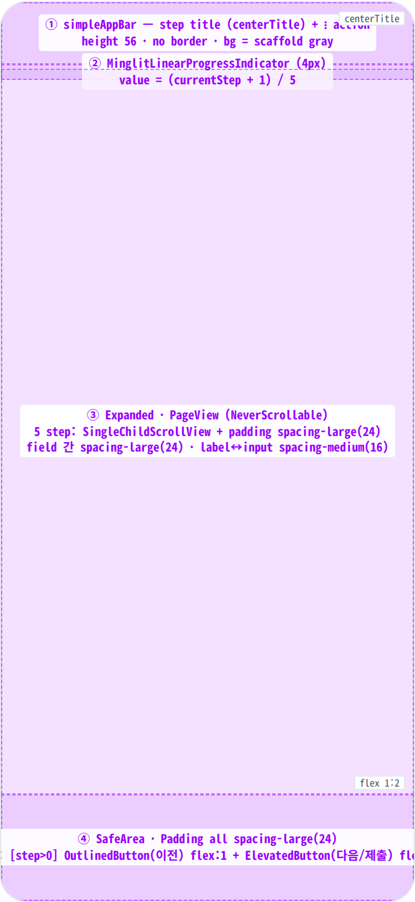
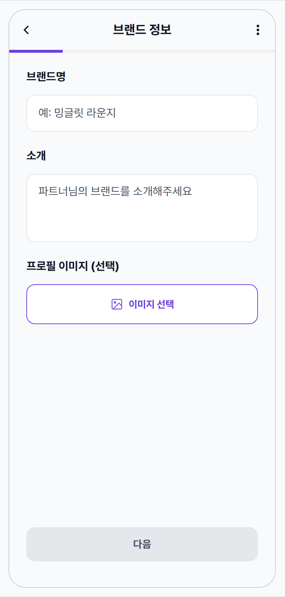
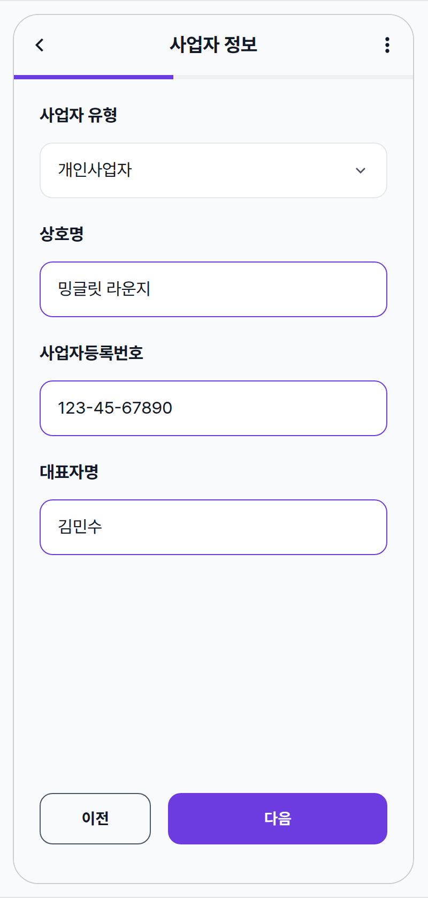
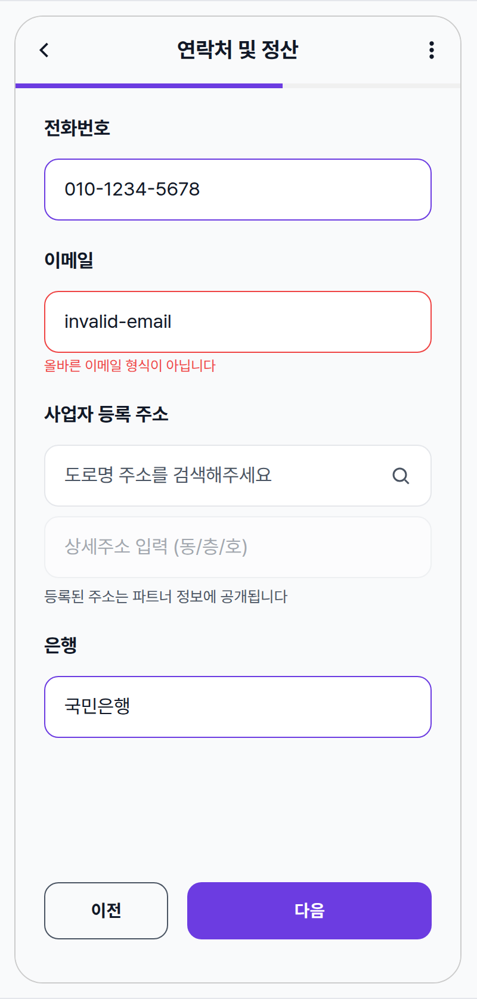
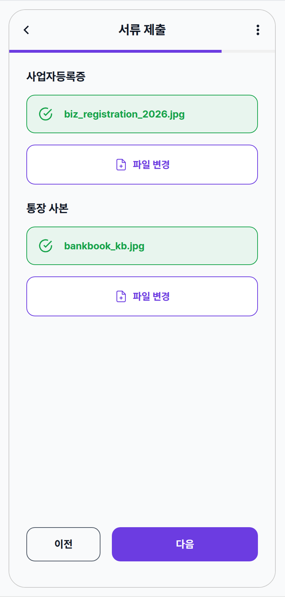
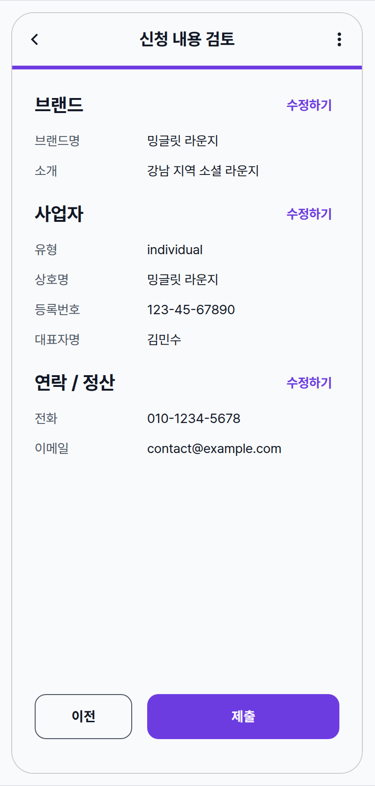
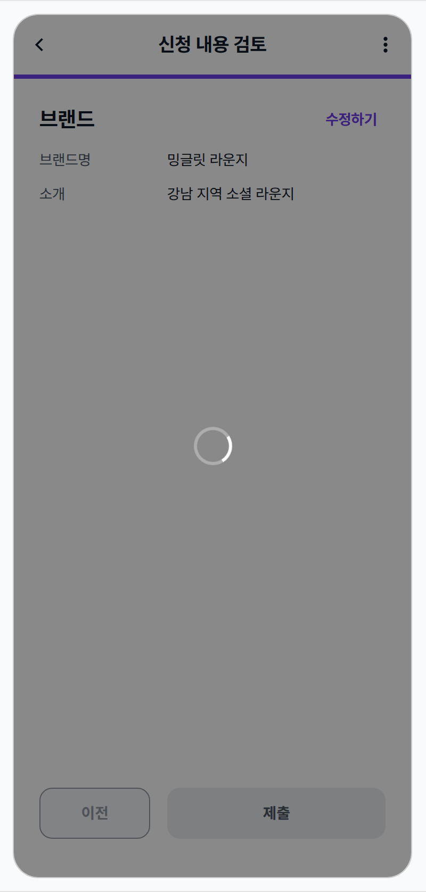
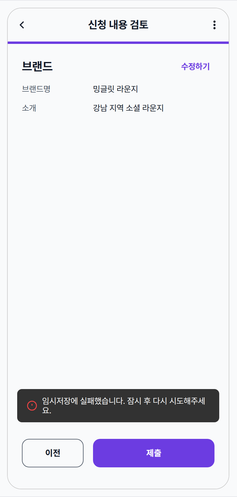

 Spec — PartnerApplyPage (app\_partner · PartnerApplyRoute)  

# Partner Apply

## Overview

| Status | ✅ 디자인완료 — 5-step wizard · 6 state (5 step + submitting + error) |
|---|---|
| App | app_partner |
| Category | onboarding · application · partner-only |
| Route / Surface | PartnerApplyRoute · widget: PartnerApplyPage (ConsumerStatefulWidget · PageView · NeverScrollableScrollPhysics) + Step1BasicInfo / Step2BizInfo / Step3ContactSettlement / Step4Documents / Step5Review |
| Path | /apply |
| Hierarchy | Parent: — (top-level screen, no shell — outside StatefulShellRoute. PartnerWelcomePage CTA에서 진입)Children: — (5 step은 internal sub-widget — PageView child로 한 화면 안에서 처리, 별도 spec 없음) |
| Purpose | 파트너 입점 신청서를 5단계(브랜드 · 사업자 · 연락처/정산 · 서류 · 검토)로 입력받아 심사 대기 상태로 제출한다. 매 step마다 partial draft가 서버에 저장되어 중간 이탈 시 다음 진입에서 이어서 작성 가능 (loadDraft()). 제출이 성공하면 onboardingStateProvider가 pendingReview로 전환되어 PartnerApplyStatusPage로 자동 이동. |
| User journey | Entry: PartnerWelcomePage CTA → onboardingCoordinator.goToApply(). 또는 router redirect: 로그인 + OnboardingState.draftInProgress면 모든 경로에서 /apply로 강제 이동.Exit: 마지막 step "신청서 제출하기" → 성공 시 onboardingCoordinator.goToApplyStatus() (/apply/status) · AppBar 우측 ⋮ → 로그아웃 (/login) · 시스템 back → 한 단계 이전 step (또는 stack pop). |
| Background | 입점 정보가 많고(브랜드명·소개·사업자등록·정산계좌·서류 2종) 한 화면에 모으면 인지 부담이 커서 5단계 위저드로 분할. 매 step nextStep() 호출 시 saveDraft()가 실행되어 partial 저장 → 네트워크 끊김에도 데이터 보존. PageView는 NeverScrollableScrollPhysics로 swipe 차단 — 사용자는 하단 "다음/이전" 버튼으로만 이동. AppBar title은 step별로 동적 ("브랜드 정보" → "사업자 정보" → "연락처 및 정산" → "서류 제출" → "신청 내용 검토"). |
| Frequency | 파트너 계정당 1회. 제출 후엔 router가 /apply/status로 우회. 보완 요청(needsCorrection) 발생 시 재진입 가능. |

## History

이 spec의 주요 변경 이력. 최신 항목 위.

| Date | Version | Author | Changes |
|---|---|---|---|
| 2026-05-01 | 1.0 | mark-yun | v1.4 template으로 작성. 5 step (Basic / Biz / Contact&Settlement / Documents / Review) baseline + submitting overlay + submit error 6 state. partner brand primary scoped via .viewport. |

[🧱 Layout](#layout) [🎨 States](#states) [🔄 Global Behavior](#behavior) [📖 Reference](#reference)

🧱

## Layout

화면 구조 — 영역, 정렬, 간격 규칙. 색·타이포 무시.

## Blueprint & tree

Scaffold + simpleAppBar(56) + Stack(Column\[ProgressIndicator + Expanded PageView\] · 옵셔널 loading overlay) + bottomNavigationBar(SafeArea + Padding 24 + Row\[OutlinedButton 이전 + ElevatedButton 다음/제출\]). PageView는 `NeverScrollableScrollPhysics` · `animateToPage`로만 이동 (`MinglitAnimation.medium` · easeInOut). Step 콘텐츠는 `SingleChildScrollView` + `EdgeInsets.all(spacing-large)`.

**Scaffold** ├─ **appBar**: _MinglitTheme.simpleAppBar_ ← ① │ ├─ title: _\_getStepTitle(currentStep)_ │ │ · 0 → "브랜드 정보" │ │ · 1 → "사업자 정보" │ │ · 2 → "연락처 및 정산" │ │ · 3 → "서류 제출" │ │ · 4 → "신청 내용 검토" │ ├─ centerTitle: _true_ │ ├─ showBackButton: _true_ (default) │ └─ actions: │ └─ **PopupMenuButton**(icon: more\_vert) │ └─ "로그아웃" → _MinglitAlert.showConfirm_ │ ├─ **body**: **Stack** │ ├─ **Column** │ │ ├─ **MinglitLinearProgressIndicator** ← ② │ │ │ · value: (currentStep + 1) / 5 │ │ │ · color: _MinglitColors.primary_ │ │ │ · bg: _colorScheme.surfaceContainerHighest_ │ │ └─ **Expanded** │ │ └─ **PageView**(controller, _NeverScrollableScrollPhysics_) ← ③ │ │ ├─ **Step1BasicInfo** — 브랜드명 · 소개 · 프로필 이미지(선택) │ │ ├─ **Step2BizInfo** — 사업자 유형 · 상호 · 등록번호 · 대표자 │ │ ├─ **Step3ContactSettlement** — 전화 · 이메일 · 주소 · 은행 · 계좌 · 예금주 · 세금계산서 이메일 │ │ ├─ **Step4Documents** — 사업자등록증 · 통장 사본 (image\_picker) │ │ └─ **Step5Review** — 4개 섹션 요약 + 수정하기 텍스트버튼 │ │ │ └─ \[if isLoading\] **Positioned.fill** ← (overlay) │ └─ **ColoredBox**(_MinglitColors.scrim_) │ └─ **Center**(MinglitCircularProgressIndicator) │ └─ **bottomNavigationBar**: **SafeArea** ← ④ └─ **Padding**(all: spacing-large = 24) └─ **Row** ├─ \[currentStep > 0\] **Expanded**(flex:1) │ └─ **OutlinedButton**("이전") │ · vertical pad: spacing-medium (16) │ · radius-button (12) ├─ \[currentStep > 0\] SizedBox(width: spacing-medium) └─ **Expanded**(flex:2) └─ **ElevatedButton**(_"다음"_ or _"제출"_) · bg: MinglitColors.primary · fg: MinglitColors.background (#fff) · disabled: !canProceed() (last step) || isLoading · vertical pad: spacing-medium (16) · radius-button (12)

## Spacing & alignment rules

| # | Region | Alignment | Spacing |
|---|---|---|---|
| ① | AppBar | centerTitle · back left · ⋮ right | height 56 · no border · scaffold gray bg · padding-horizontal spacing-xsmall |
| ② | LinearProgressIndicator | full-width · height 4px | margin 없음 — AppBar 바로 아래 flush |
| ③ | Step body | SingleChildScrollView · column start (crossAxisAlignment.start) | outer pad spacing-large (24) all · 필드 간 spacing-large (24) · 레이블↔필드 spacing-medium (16) · 주소 도로명↔상세 spacing-small (8) |
| ④ | bottomNavigationBar | SafeArea · Row · 이전(flex:1) + 다음(flex:2) | EdgeInsets.all spacing-large (24) · 버튼 간 spacing-medium (16) · 버튼 vertical pad spacing-medium (16) |
| — | Step 5 review row | Row · label width 120 · value Expanded | row 간 spacing-medium (16) · 섹션 간 spacing-large (24) · 섹션 헤더 padding-bottom spacing-medium |
| — | Step 4 file picked card | Row · check icon + filename ellipsis | padding spacing-medium · icon↔name spacing-medium · 카드↔picker spacing-medium |

🎨

## States

시각 변형 6종 — 5단계 폼 + 제출 중 오버레이 + 제출 실패 스낵바. baseline = Step 1 (브랜드 정보, 빈 폼). 나머지는 변경분만.

**State 식별 기준**: 현재 노출된 단계(0–4) + 임시 저장/제출 진행 여부 (로딩 오버레이) + 저장/제출 실패 (스낵바). 단계 사이 이동은 좌우 스와이프가 아닌 하단의 "이전 / 다음" 버튼으로만 가능하며, 단계 간 이동은 약 0.35초의 부드러운 전환으로 일어난다. 모든 단계는 같은 화면 구조 (AppBar + 진행 바 + 본문 + 하단 버튼)를 공유하며, AppBar 타이틀 / 진행 바 채움 비율 / 본문 / "이전" 버튼 노출 여부만 다르다.

### Step 1 · 브랜드 정보 (empty) 🎯 baseline · 첫 번째 단계 · 빈 폼

| 항목 | 내용 |
|---|---|
| 조건 | 화면에 진입한 직후 첫 단계가 노출된 상태. 모든 필드가 비어 있고, "이전" 버튼은 노출되지 않으며 "다음" 버튼은 활성 (실제 통과 여부는 탭 시점에 검증). |
| 사용자 액션 | ① 브랜드명 입력 — 입력하는 즉시 화면에 반영됨.② 소개 입력 (여러 줄 텍스트 영역) — 입력하는 즉시 반영됨.③ "이미지 선택" 탭 — 갤러리에서 사진을 고르면 프로필 이미지로 업로드됨.④ "다음" 버튼 탭 — 브랜드명이 비어 있지 않으면 통과되어 임시 저장 후 다음 단계로 이동.⑤ AppBar 뒤로가기 탭 — 이전 화면으로 복귀. 자동으로 진입한 경우는 갈 곳이 없을 수 있음.⑥ AppBar 우상단 ⋮ 탭 — "로그아웃" 항목이 들어 있는 메뉴가 펼쳐짐. |
| 에지케이스 | · 브랜드명을 비운 채 "다음"을 눌러도 다음 단계로 넘어가지 않음. 별도의 에러 토스트나 스낵바는 노출되지 않는다 — 그냥 반응이 없는 형태.· 갤러리 접근 권한이 거부되면 사진 선택이 일어나지 않고 기존 상태가 그대로 유지된다.· 이전에 저장한 임시 데이터가 없는 경우 빈 폼으로 시작 (이 baseline). |
| 컴포넌트 | · MinglitTheme.simpleAppBar(title="브랜드 정보", centerTitle, actions=[PopupMenuButton])· MinglitLinearProgressIndicator(value=0.2, color=primary, bg=surfaceContainerHighest)· TextFormField × 2 (single + maxLines:4) · OutlineInputBorder radius-input(12)· _ProfileImagePicker → OutlinedButton.icon(icon: image_outlined, side: primary, label="이미지 선택")· ElevatedButton(다음 · bg primary · fg #fff · radius-button) |
| 토큰 | · color: color-partner-primary (#6c3ce1 · progress fill · 다음 bg · picker border/text), color-surface (scaffold + appbar bg), color-background (input · #fff button fg), color-text-primary (label · input value), color-text-secondary (placeholder · help text), color-divider (input border idle)· radius: radius-input (12 · TextFormField · picker), radius-button (12 · CTA)· spacing: spacing-large (24 · body padding · field 간격 · bottombar pad), spacing-medium (16 · label↔input · row gap · CTA vertical pad), spacing-small (8 · 도로명↔상세주소 in step 3)· typography: titleMedium.bold (16/700 · field label), bodyMedium (16 · input value · placeholder), bodySmall (13 · help text · address note)· motion: MinglitAnimation.medium (350ms · PageView animateToPage curve easeInOut) |
| 노트 | 📝 5단계 모두 같은 화면 구조를 공유한다 — 2~5단계는 본문 / AppBar 타이틀 / 진행 바 채움 비율만 바뀐다. baseline은 첫 단계라서 "이전" 버튼이 노출되지 않는다. |

### Step 2 · 사업자 정보 두 번째 단계 · 모든 필드가 채워진 예시

| 항목 | 내용 |
|---|---|
| 조건 | ↔ 두 번째 단계 · 사업자 유형 · 상호명 · 등록번호 · 대표자명이 모두 채워진 정상 상태 · "이전" 버튼이 등장. |
| 사용자 액션 | ↔ AppBar 타이틀이 "사업자 정보"로 바뀌고 진행 바가 20% → 40%로 채워짐.+ 유형 드롭다운 탭 — 개인사업자 / 법인사업자 중 선택 (기본은 개인사업자).+ 등록번호 입력 — 숫자 전용 키보드가 올라옴. 대표자명은 일반 텍스트 키보드.+ "이전" 버튼 탭 — 이전 단계로 부드럽게 이동 (약 0.35초의 슬라이드 전환). |
| 에지케이스 | · 등록번호의 형식은 클라이언트에서 별도로 검증되지 않음 — 비어 있지만 않으면 다음 단계로 진행할 수 있고, 검토 단계에서도 입력값이 그대로 표시된다. |
| 컴포넌트 | ↔ AppBar title↔ Progress fill 0.2 → 0.4+ DropdownButtonFormField<String> (items: individual/corporate · l10n option)+ 이전 OutlinedButton (radius-button · partner primary border via partnerOutlinedButton theme)− 이미지 picker (Step 1 전용) |
| 토큰 | + color-primary의 OutlinedButton border / fg (이전 버튼 — partnerOutlinedButton theme)나머지 동일 |
| 노트 | 📝 사업자 유형은 처음부터 "개인사업자"가 기본값으로 채워져 있다. |

### Step 3 · 연락처/정산 (에러 변형) 세 번째 단계 · 이메일 형식 오류 시각화

| 항목 | 내용 |
|---|---|
| 조건 | ↔ 세 번째 단계 · 이메일 필드에 잘못된 형식이 입력된 상태 · 도로명 주소가 아직 선택되지 않아 상세주소 입력이 비활성 · 이후 필드(계좌번호 / 예금주 / 세금계산서 이메일)는 스크롤 아래에 있음. |
| 사용자 액션 | ↔ AppBar 타이틀이 "연락처 및 정산"으로 바뀌고 진행 바가 40% → 60%로 채워짐.+ 도로명 주소 탭 — 주소 검색 화면이 전체 화면으로 올라옴. 선택하면 도로명 주소가 채워지고 상세주소는 초기화됨.+ 상세주소 입력 — 도로명 주소가 채워진 뒤에만 입력 가능. 입력하면 전체 주소가 자동으로 합쳐진다.+ 입력별 키보드 — 전화번호 / 계좌번호는 숫자 키보드, 이메일은 이메일 키보드가 올라옴.↔ "다음" 버튼 탭 — 전화 · 이메일 · 은행 · 계좌번호 · 예금주 5개 항목이 모두 비어 있지 않아야 다음 단계로 진행됨. |
| 에지케이스 | 주의: 현재 이메일 형식 검증은 클라이언트에서 수행되지 않으며, 비어 있지만 않으면 다음 단계로 진행할 수 있다. 위 mockup의 "올바른 이메일 형식이 아닙니다" 표시는 추후 강화될 수 있는 위치를 미리 보여주는 spec 권고이며 현재는 노출되지 않는다.· 도로명만 선택하고 상세주소를 비워 두면 도로명만 최종 주소로 사용된다.· 도로명 주소를 다시 선택하면 상세주소는 자동으로 초기화된다. |
| 컴포넌트 | ↔ Progress fill 0.4 → 0.6+ TextFormField(readOnly, suffixIcon: Icons.search, onTap: openAddressSearch) — 도로명+ TextFormField(enabled: roadAddress.isNotEmpty) — 상세+ AddressSearchDialog (fullscreenDialog · MaterialPageRoute<String>)+ 일반 TextFormField × 5 (phone/email/bankName/accountNumber/accountHolder/taxEmail)+ bodySmall help text "등록된 주소는 파트너 정보에 공개됩니다" (textSecondary · alpha=separator) |
| 토큰 | + color-error (validation error border + 메시지 — 권고 시각화)나머지 동일 |
| 노트 | 📝 가장 긴 단계 (8개 필드). 이메일과 전화번호의 형식은 서버에서 점검되며, 클라이언트는 비어 있는지만 확인한다. 세금계산서 이메일은 선택 항목. |

### Step 4 · 서류 제출 (filled) 네 번째 단계 · 두 서류 파일이 모두 선택된 상태

| 항목 | 내용 |
|---|---|
| 조건 | ↔ 네 번째 단계 · 사업자등록증과 통장 사본 두 파일이 모두 선택된 상태. |
| 사용자 액션 | ↔ AppBar title "서류 제출" · Progress 60% → 80%+ "파일 변경" 탭 → ImagePicker.pickImage(gallery, requestFullMetadata: false) → uploadBizRegistration / uploadBankbook+ filename 표시: file?.name ?? path.split('/').last↔ "다음" 탭 → Step 5 진입 (animateToPage) |
| 에지케이스 | · 한 개만 picked → validateStep(3) 실패 → 다음 무반응· 동일 파일 재선택 → 새 path 갱신, 이전 파일 cleanup은 controller 내부· iOS EXIF/GPS 메타데이터 → requestFullMetadata: false로 최소화 (Fix #1230) |
| 컴포넌트 | ↔ Progress 0.6 → 0.8 · AppBar title+ _DocumentPicker × 2 — 두 영역 (사업자등록증 / 통장사본)+ filled 상태일 때 Container(border: success · bg success.withAlpha(highlight)) + Icons.check_circle + filename+ OutlinedButton.icon(icon: upload_file · side: primary · minimumSize.height: 56)− 도로명/주소 검색 (Step 3 전용) |
| 토큰 | + color-success (file picked card border + icon + text), success.withAlpha(highlight) (card bg)나머지 동일 |
| 노트 | 📝 image_picker만 사용 (PDF 미지원). source: gallery 고정 — camera 옵션 없음. 향후 PDF/카메라 지원 시 spec 갱신 필요. |

### Step 5 · 신청 내용 검토 currentStep = 4 · 마지막 step · 제출 직전

| 항목 | 내용 |
|---|---|
| 조건 | ↔ currentStep == 4 (isLastStep) · 모든 step 채워짐 · canProceed() == validateAll() true → 제출 버튼 활성 |
| 사용자 액션 | ↔ AppBar "신청 내용 검토" · Progress 100%+ "수정하기" 탭 → notifier.setStep(0..3) → 해당 step으로 PageView animate (back)↔ "다음" → "제출" 라벨 변경 (partnerApplication_wizard_submit)+ "제출" 탭 → notifier.submit() → State 6 (submitting overlay) 전환 |
| 에지케이스 | · validateAll() 실패 → 제출 버튼 disabled (canProceed() ? submit : null) — 앞 step 누락 가능성· state.applicationId == null (이전 saveDraft 모두 실패) → submit이 즉시 status=error로 분기, 서버 호출 없음 (Fix #1599)· 비어있는 필드는 "-" 플레이스홀더로 표시 |
| 컴포넌트 | ↔ Progress 0.8 → 1.0+ _SectionHeader × 4 (브랜드 / 사업자 / 연락·정산 / 서류) — title titleLarge.bold + TextButton "수정하기"+ _ReviewItem × 13+ — Row(label width:120 · bodyMedium.textSecondary) + Expanded(value · bodyMedium · "-" 빈값 fallback)↔ 다음 ElevatedButton label "다음" → "제출" (partnerApplication_wizard_submit) |
| 토큰 | + titleLarge (20/700 · section header), bodyMedium (16 · review value), bodyMedium.textSecondary (label)나머지 동일 |
| 노트 | 📝 "수정하기"는 PageView animateToPage라 sub-route push 아님 — back stack은 그대로 유지. Step 5 → Step 1 점프 후 다시 "다음"으로 5까지 빠르게 복귀 가능. |

### Submitting (loading overlay) isSaving || isSubmitting · scrim + spinner

| 항목 | 내용 |
|---|---|
| 조건 | + state.isSaving \|\| state.isSubmitting == true — Stack의 Positioned.fill branch 활성. nextStep()의 saveDraft, 또는 submit()의 submitDraft 진행 중. |
| 사용자 액션 | − 모든 입력 차단 (scrim이 탭을 흡수) · 이전 / 다음 버튼은 비활성으로 흐려짐 · ⋮ AppBar 액션 버튼은 시각적으로는 활성 상태이지만 메뉴 선택은 차단됨 |
| 에지케이스 | · 네트워크 늦어짐 → 무한 스피너 · 사용자 cancel 수단 없음 (코드상 timeout 미설정)· saveDraft 실패 → isSaving=false로 복귀하나 별도 에러 표시는 없음 — 다음 step 진입 차단· submit 성공 → status=data → listener가 goToApplyStatus() 호출 → /apply/status로 라우팅 |
| 컴포넌트 | + Positioned.fill + ColoredBox(MinglitColors.scrim) + Center(MinglitCircularProgressIndicator)↔ ElevatedButton onPressed: null (disabled visual)↔ OutlinedButton onPressed: null |
| 토큰 | + MinglitColors.scrim (~rgba(0,0,0,0.45)) · CircularProgressIndicator color = primary (default ColorScheme)나머지 동일 |
| 노트 | 📝 saveDraft 중에도 동일 overlay — submit 전용 분기 없음. 사용자에겐 "저장 중" / "제출 중" 구분 텍스트가 없다. |

### Submit error status.whenOrNull(error: handleMinglitError) · transient SnackBar

| 항목 | 내용 |
|---|---|
| 조건 | + 임시저장 또는 제출이 실패한 직후 — 화면 하단에 오류 안내 SnackBar가 노출되고 폼은 다시 조작 가능한 상태로 복귀. |
| 사용자 액션 | + SnackBar 자동 dismiss (Material default ~4s)+ "제출" 다시 탭 → 재시도. applicationId == null이면 즉시 동일 에러 분기.↔ 폼은 살아있어 step 이동 가능 — 누락 발견 시 "수정하기" → 보정 → 다시 제출. |
| 에지케이스 | · 동시에 multi-error (saveDraft + submit) 발생 시 가장 최근 에러만 표시 — Riverpod listener는 prev/next diff 기반· Sentry 등 외부 reporter는 handleMinglitError 내부에서 처리 (별도 spec) |
| 컴포넌트 | + Material SnackBar via handleMinglitError (kit-shared) — bg #323232 · radius-small · padding 12·16 · icon error− Loading overlay (사라짐)↔ 버튼 활성화 복귀 |
| 토큰 | + color-error (snackbar icon)나머지 동일 |
| 노트 | 📝 두 가지 에러 경로: ① applicationId == null 즉시 분기 (saveDraft 모두 실패) · ② repo.submitDraft()가 throw — 둘 다 동일 SnackBar로 노출. 사용자 입장 구분 어려움. |

🔄

## Global Behavior

cross-cutting — 모든 state에 적용되는 액션, motion, 글로벌 에지케이스. step별 차이는 위 mini-table 참고.

## Cross-cutting interactions

| 사용자 액션 | 화면에 보이는 결과 |
|---|---|
| "다음" 버튼 탭 (Step 0–3) | nextStep() → validateStep(currentStep) 통과 시 saveDraft()(서버 호출 · isSaving=true) → 성공 시 currentStep+1 → state listener가 animateToPage(MinglitAnimation.medium 350ms · easeInOut). 실패 시 isSaving=false 복귀, 시각적 피드백은 SnackBar 또는 무반응. |
| "제출" 버튼 탭 (Step 4) | submit() → validateAll() 체크 → applicationId 검증 → repo.submitDraft(isSubmitting=true · loading overlay) → 성공 시 onboardingState invalidate + onboardingCoordinator.goToApplyStatus() (/apply/status). 실패 시 SnackBar. |
| "이전" 버튼 탭 (Step 1–4) | previousStep() → currentStep-1 → animateToPage 역방향. validation 미수행, draft 저장 미수행. |
| Step 5 "수정하기" 탭 | notifier.setStep(target) → 직접 점프 (skip). Step 5 → Step 0/1/2/3 어디든 한 번에 animateToPage. validation 미체크. |
| AppBar ⋮ → 로그아웃 | PopupMenu open → "로그아웃" 선택 → MinglitAlert.showConfirm → 확인 시 Future.delayed(Duration.zero) 후 authRepo.signOut(). router redirect로 /login. 이 시점 작성 중인 draft는 서버에 partial 저장된 상태 — 다음 로그인에서 loadDraft()로 복원. |
| 시스템 back / 스와이프 back | showBackButton: true. 보통 stack에 PartnerWelcomePage가 있으면 그쪽으로 pop. 단 router redirect로 직접 /apply 진입한 경우 stack 비어 종료/무반응. PageView swipe back은 NeverScrollable로 차단. |
| onboarding state 변경 (외부 트리거) | 다른 디바이스에서 application 제출 완료 → onboardingStateProvider가 pendingReview로 갱신 → router refreshListenable이 /apply/status로 자동 redirect. |
| 다크모드 토글 | scaffold gray ↔ dark surface · partner-primary 라이트(#6c3ce1) ↔ 다크(#9b7bec) swap. 모든 토큰 자동 매핑. |

## Motion timing

Source: `shared/packages/mds/core/lib/src/theme/minglit_design_tokens.dart` (`MinglitAnimation`).

| Transition | Token / Duration | Notes |
|---|---|---|
| 화면 진입 (router push) | MinglitAnimation.fast (200ms) | GoRouter 기본 라우트 전환 — slide/fade. |
| Step 이동 (next / prev / setStep) | MinglitAnimation.medium (350ms · easeInOut) | _pageController.animateToPage(step, duration: medium, curve: easeInOut). listener가 currentStep 변경 감지 후 호출. |
| LinearProgressIndicator fill | Material default (~250ms) | Flutter LinearProgressIndicator 자체 implicit animation. 별도 token 없음. |
| Loading overlay in/out | 즉시 (no animation) | Stack의 if (isLoading) 분기 — fade transition 없음. |
| SnackBar in/out | Material default (~250ms) | handleMinglitError via ScaffoldMessenger 기본 slide-up/fade. |
| PopupMenu open / dismiss | Material default (~150ms) | fade + scale. |
| Confirm dialog (logout) | MinglitAnimation.fast (200ms) | 중앙 fade-in scale (Material default). |
| AddressSearchDialog (Step 3) | MinglitAnimation.medium (350ms) | fullscreenDialog → bottom-up slide (Material default). |

## Global edge cases

-   **loadDraft가 진행 중인 상태로 사용자가 빠르게 입력** — initState의 `WidgetsBinding.addPostFrameCallback` 로 호출되며 result로 state가 덮어써짐. 사용자가 그 사이 입력한 값은 _덮일 수 있음_. 코드상 race condition 보호 미흡 — 일반적으로 첫 프레임 직후 즉시 resolve되어 체감 불가.
-   **제출 성공 후 다시 `/apply` 직접 진입** — router redirect의 `pendingReview` 분기로 즉시 `/apply/status`로 우회. 이 화면이 보이지 않는다.
-   **네트워크 끊긴 채 "다음" 탭 반복** — 매번 saveDraft가 실패 → applicationId가 null인 채 누적. Step 4까지 갔다가 제출 시 "임시저장에 실패했습니다" SnackBar (Fix #1599 분기).
-   **signOut 도중 step 이동** — `Future.delayed(Duration.zero)` 패턴이 dialog close 후 signOut 호출을 다음 frame으로 미뤄 invalidated context 회피. 이론상 그 사이 사용자가 step 이동을 시도해도 router redirect가 `/login`으로 우회한다.
-   **이미지/파일 picker 권한 거부** — `ImagePicker.pickImage`가 null 반환 · onPick 미호출 · 기존 파일 유지 · 별도 안내 미노출. 사용자는 OS 설정에서 직접 권한 부여 필요.

📖

## Reference

implementation source + 인접 화면. Components / Tokens는 위 mini-table 참고.

## Implementation source

| Widget | PartnerApplyPage — apps/app_partner/lib/src/features/onboarding/partner_apply_page.dart |
|---|---|
| Step widgets | Step1BasicInfo · Step2BizInfo · Step3ContactSettlement · Step4Documents · Step5Review — apps/app_partner/lib/src/features/onboarding/steps/ |
| Controller | PartnerApplyController (Riverpod · Freezed · 5 mixins: Validation / Draft / Steps / Submit) — partner_apply_controller.dart |
| Coordinator | OnboardingCoordinator — onboarding_coordinator.dart · goToApply() · goToApplyStatus() |
| Address picker | AddressSearchDialog (fullscreenDialog) — widgets/address_search_dialog.dart |
| Route | PartnerApplyRoute · /apply · top-level (no shell) · app_routes.dart |
| Redirect logic | app_router.dart — OnboardingState.draftInProgress이면 모든 경로에서 /apply로 강제. 제출 후 pendingReview 시 /apply/status로 우회. |
| State enum | OnboardingState · loading / needsApplication / draftInProgress / pendingReview / needsCorrection / hasPartner — onboarding_state_provider.dart |
| Brand color | MinglitPartnerColors.primary = #6c3ce1 · scoped via .viewport의 --color-primary 오버라이드. MinglitColors.primary(#9900ff)는 사용 안 함. |
| l10n | partnerApplication_wizard_title / step{1..5}_title / next / prev / submit · partnerApplication_field_{brandName / intro / bizType / bizName / bizNumber / repName / phone / email / address / bankName / accountNum / holder} · partnerApplication_hint_* · partnerApplication_option_individual / corporate · partnerApplication_section_{brand / biz / account / files} · partnerApplication_label_{bizReg / bankbook} · partnerApplication_hint_fileSelect · home_button_logout · common_button_cancel |

## Related screens

| Spec | Relation |
|---|---|
| PartnerWelcomePage | 이 화면 직전. CTA "파트너 신청서 작성하기"로 진입. OnboardingState.needsApplication에서 도달, 입력 시작과 동시에 draftInProgress로 전환. |
| PartnerApplyStatusPage (spec 미작성) | 이 화면 직후. submit 성공 시 자동 이동. pendingReview / needsCorrection 상태에서 머무름. |
| LoginPage | ⋮ 로그아웃 시 도달. |
| PartnerHomePage | 심사 승인(hasPartner) 후 최종 도달점. |
| PartyCreateWizardPage | 유사 패턴 — 파트너 앱의 또 다른 다단계 wizard. 같은 PageView+NeverScrollable+bottomNav 구조. |
| EventApplicationWizardPage | 유사 제출 패턴(단계별 polling + AsyncValue.error → SnackBar) 참고용. |