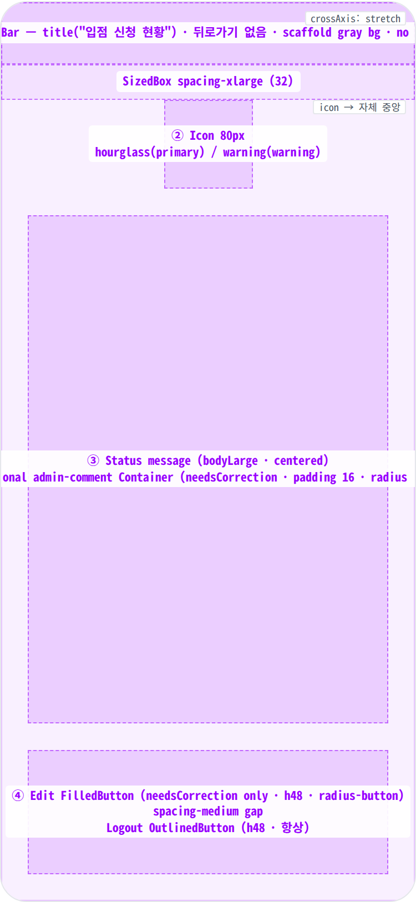
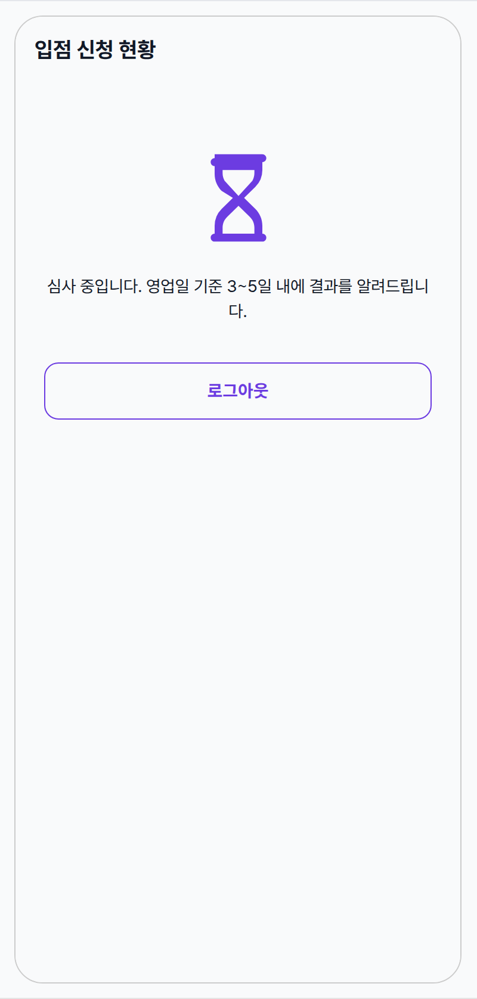
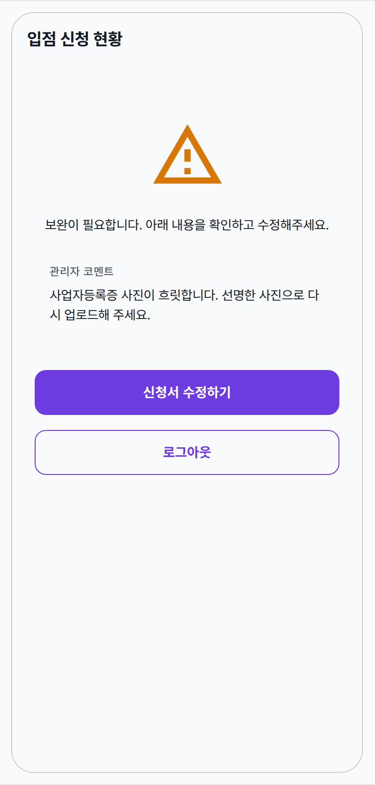
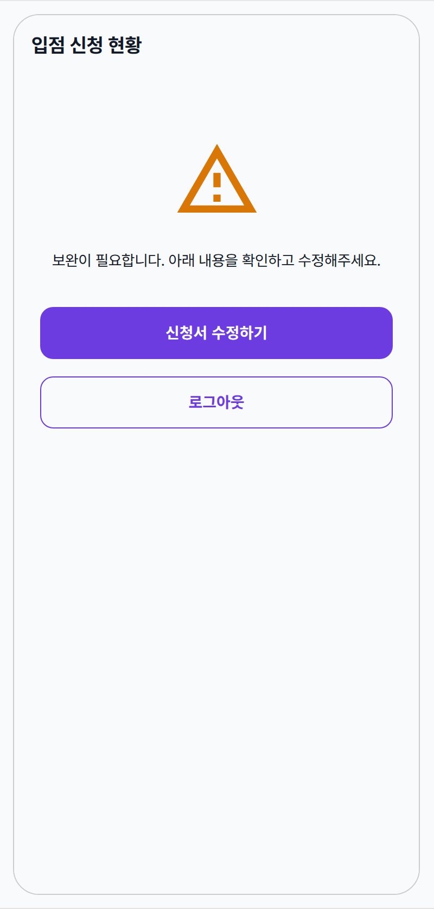
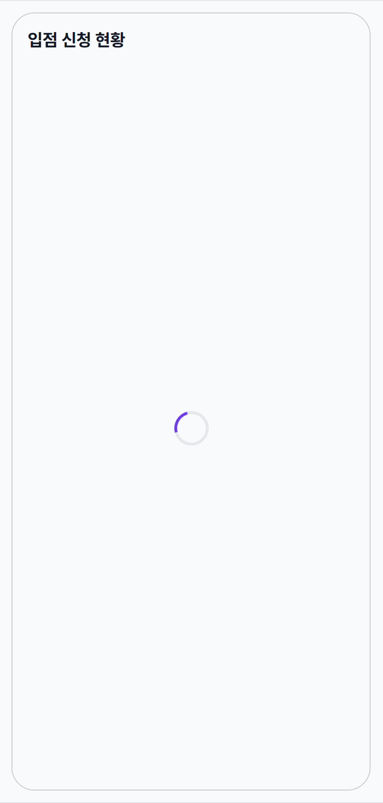
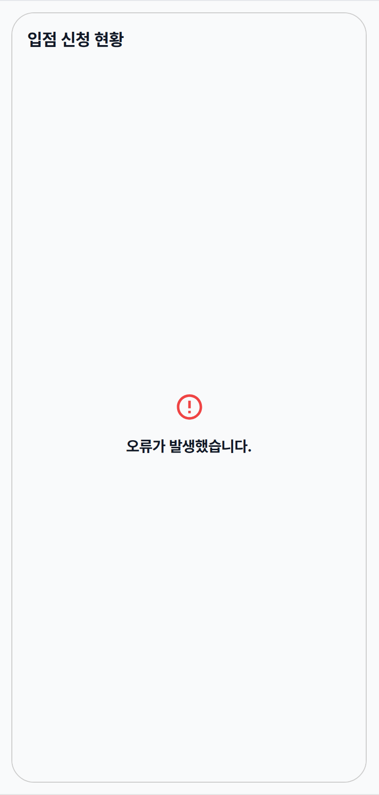

 Spec — PartnerApplyStatusPage (app\_partner · PartnerApplyStatusRoute)  

# Partner Apply Status

## Overview

| Status | ✅ 디자인완료 — 4 main state (pending / needsCorrection w/ comment · w/o comment / loading) + error |
|---|---|
| App | app_partner |
| Category | onboarding · status · partner-only |
| Route / Surface | PartnerApplyStatusRoute · widget: PartnerApplyStatusPage (full-page · 단독 진입) |
| Path | /apply/status |
| Hierarchy | Parent: — (top-level screen, no shell — outside StatefulShellRoute)Children: — |
| Purpose | 신청서 제출 직후 또는 관리자 보완 요청 후의 사용자에게 현재 심사 상태를 알리고, 보완 요청 상태에서는 신청서로 되돌아가 수정할 수 있는 진입점을 제공한다. 심사 대기 / 보완 요청 두 상태에만 노출되는 화면. |
| User journey | Entry: 신청서 제출 성공 직후 또는 앱 재진입 시 자동 이동. 심사 대기 / 보완 요청 상태에서는 어느 경로로 진입해도 이 화면으로 강제 이동.Exit: ① 심사 통과: 별도 CTA 없이 자동으로 PartnerHomePage로 이동.② 보완 요청 → 신청서 수정: "신청서 수정하기" → 신청서 마법사로 이동.③ 로그아웃: "로그아웃" 탭 → 로그인 화면으로 복귀. |
| Background | 파트너 신청은 관리자 수동 심사 + 서류 검토 단계가 있어 즉시 결과가 안 나온다 (영업일 기준 3~5일). 그 사이에 사용자가 앱을 다시 열어도 신청 마법사가 다시 열리지 않도록 별도 status 화면을 둔다. 이 화면은 심사 대기 / 보완 요청 두 상태에만 노출. |
| Frequency | 심사 진행 중 사용자가 앱을 열 때마다. 일반적으로 며칠 동안 지속, 승인/거절 시 자동 우회. |

## History

이 spec의 주요 변경 이력. 최신 항목 위.

| Date | Version | Author | Changes |
|---|---|---|---|
| 2026-05-01 | 1.0 | mark-yun | v1.4 template으로 작성. pending baseline + needsCorrection (with/without admin comment) + loading + error state 정리. partner brand primary scoped via .viewport. |

[🧱 Layout](#layout) [🎨 States](#states) [🔄 Global Behavior](#behavior) [📖 Reference](#reference)

🧱

## Layout

화면 구조 — 영역, 정렬, 간격 규칙. 색·타이포 무시.

## Blueprint & tree

AppBar(title only · automaticallyImplyLeading=false · 56) → SingleChildScrollView(EdgeInsets.all `spacing-large` = 24) · Column(crossAxis: stretch). 카드/그룹 chrome 없음 — 콘텐츠가 scaffold gray 위에 직접 놓인다. Spacer(xlarge) → 80px Icon → Spacer(large) → message → Spacer(xlarge) → \[Edit FilledButton + Spacer(medium)\] (needsCorrection only) → Logout OutlinedButton.

**Scaffold** ├─ **AppBar** ← ① │ ├─ title: "입점 신청 현황" │ └─ 뒤로가기 없음 │ └─ **body**: 비동기 분기 (onboarding / application 도착 후 콘텐츠 표시) └─ **SingleChildScrollView**(padding all `spacing-large`) └─ **Column**(crossAxis: stretch) ├─ SizedBox(`spacing-xlarge`) ├─ **Icon**(size 80, partner-primary 또는 warning) ← ② ├─ SizedBox(`spacing-large`) ├─ **\_buildStatusMessage** ← ③ │ ├─ _심사 대기_: 안내 텍스트 (bodyLarge · 가운데 정렬) │ └─ _보완 요청_: **Column**(crossAxis: start) │ ├─ 안내 텍스트 (bodyLarge · 가운데 정렬) │ └─ _(관리자 코멘트가 있을 때)_ 코멘트 박스 │ ├─ padding all `spacing-medium` │ ├─ bg: scaffold gray │ ├─ radius: `radius-input` (12) │ └─ Column(crossAxis: start) │ ├─ Text("관리자 코멘트" · labelMedium · textSecondary) │ ├─ SizedBox(`spacing-small`) │ └─ Text(코멘트 본문 · bodyMedium) ├─ SizedBox(`spacing-xlarge`) ├─ _(보완 요청에서만)_ **FilledButton**("신청서 수정하기") ← ④ │ └─ 탭 시 신청서 마법사로 이동 ├─ _(보완 요청에서만)_ SizedBox(`spacing-medium`) └─ **OutlinedButton**("로그아웃") └─ 탭 시 로그인 화면으로 복귀

## Spacing & alignment rules

| # | Region | Alignment | Spacing |
|---|---|---|---|
| ① | AppBar | start: title · no leading · no actions | height 56 · no border · scaffold gray bg |
| ② | Status icon | icon 자체 중앙 (Column crossAxis: stretch + Icon이 폭 80 fixed → 자연스레 중앙) | top spacer spacing-xlarge (32) · 다음 spacer spacing-large (24) |
| ③ | Status message + admin comment | pending: bodyLarge text-align center · needsCorrection: Column crossAxis: start (텍스트는 center, comment box는 stretch) | message 내부 spacer spacing-medium (16) · 메시지↔버튼 spacer spacing-xlarge (32) · adminBox padding all spacing-medium · adminBox 내부 label↔body spacer spacing-small (8) |
| ④ | Buttons | crossAxis: stretch (full-width) · 둘 다 h48 | edit↔logout spacer spacing-medium (16) · 외곽 padding spacing-large (24 · scrollview padding) |

🎨

## States

시각 변형 5종 — pending baseline · needsCorrection (admin comment 있음/없음) · loading · error. 첫 state 풀 리스트, 나머지는 변경분만.

**State 식별 기준**: 데이터 로딩 상태 + 심사 상태(심사 대기 vs 보완 요청) + 관리자 코멘트 유무에 따라 5가지 변형. 그 외 상태(승인 / 거절 / 신청 전)에서는 이 화면이 자동 우회되어 다른 화면으로 이동.

### Pending review 🎯

| 항목 | 내용 |
|---|---|
| 조건 | 신청서를 제출하고 관리자 검토를 기다리는 상태. |
| 사용자 액션 | ① "로그아웃" 탭 → 로그인 화면으로 복귀② 스크롤 → 콘텐츠가 일반적으로 한 화면에 다 들어와 스크롤 발생 안 함 (넘칠 때만)③ 시스템 back / 스와이프 back → 무반응 (위로 갈 화면 없음) |
| 에지케이스 | · 다른 디바이스 / 관리자 콘솔에서 심사 결과가 갱신되어도 이 화면이 곧바로 알지 못함 — 앱 재진입 시점에 갱신됨.· 다크모드 토글 → scaffold gray↔dark surface, hourglass 아이콘은 partner-primary 라이트↔다크 전환.· 로그아웃을 누른 직후 화면 전환 사이의 짧은 race가 발생하지 않도록 안전 장치가 있음. |
| 컴포넌트 | · AppBar(타이틀 "입점 신청 현황" · 뒤로가기 없음)· SingleChildScrollView(padding all spacing-large) + Column(crossAxis: stretch)· Icon(Icons.hourglass_top_rounded · size 80 · color partner-primary)· 안내 Text(bodyLarge · 가운데 정렬) — "심사 중입니다."· OutlinedButton — "로그아웃" |
| 토큰 | · color: color-partner-primary (#6c3ce1 · icon · OutlinedButton border/fg), color-surface (scaffold + appbar 배경), color-text-primary (메시지 · appbar title)· radius: radius-button (12 · OutlinedButton)· spacing: spacing-large (24 · scrollview padding), spacing-xlarge (32 · top spacer · 메시지↔버튼 spacer), spacing-medium (16 · edit↔logout spacer)· typography: titleLarge (appbar title) · bodyLarge (status message)· motion: MinglitAnimation.fast (200ms · 화면 진입) |
| 노트 | 📝 심사 대기 상태에는 수정 버튼이 없음. 사용자에게 능동적으로 할 게 없는 wait-only 화면. |

### Needs correction · with admin comment

| 항목 | 내용 |
|---|---|
| 조건 | 관리자가 보완을 요청한 상태이며, 코멘트가 함께 첨부된 경우. |
| 사용자 액션 | + ① "신청서 수정하기" 탭 → 신청서 마법사가 기존 내용으로 채워진 채 다시 열림↔ "로그아웃" 동일 |
| 에지케이스 | + 코멘트가 매우 길면(여러 줄) 코멘트 박스가 자라고 화면이 스크롤됨 — 외부 패딩과 radius는 유지.+ 신청서를 수정해 다시 제출하면 심사 대기 상태로 돌아가, 다음 진입에서는 baseline으로 자동 전환. |
| 컴포넌트 | ↔ 아이콘: 모래시계 → 경고 (warning_amber_rounded)↔ 아이콘 색: partner-primary → warning↔ 안내 텍스트: "심사 중입니다." → "보완이 필요합니다." + 관리자 코멘트 박스(padding all spacing-medium · bg scaffold gray · radius radius-input)+ 코멘트 박스 내부: "관리자 코멘트" 라벨(labelMedium · textSecondary) + SizedBox(spacing-small) + 코멘트 본문(bodyMedium)+ FilledButton "신청서 수정하기" 추가 |
| 토큰 | ↔ icon color: color-partner-primary → color-warning+ admin box bg: color-surface (=scaffold gray) — 같은 색이지만 의도된 분리감 (radius로 구분)+ admin box radius: radius-input (12)+ admin box padding: spacing-medium (16) · 내부 label↔body spacing-small (8)+ FilledButton bg: color-partner-primary · fg: color-background (#fff) |
| 노트 | 📝 코멘트 박스 배경이 scaffold와 같은 색인 점이 의도적 — radius / padding으로 영역만 분리하여, 카드 chrome 없는 호스트 페이지의 톤과 어울림. 별도 테두리는 그리지 않음. |

### Needs correction · without admin comment

| 항목 | 내용 |
|---|---|
| 조건 | 관리자가 코멘트 없이 보완 요청만 남긴 드문 케이스. |
| 사용자 액션 | 동일 (수정 / 로그아웃) |
| 에지케이스 | − 코멘트 박스 부재 — 사용자는 어떤 부분을 수정할지 알 길이 없어 신청서로 들어가 모든 필드를 다시 살펴야 함. 운영 정책상 항상 코멘트를 남기도록 강제하면 이 상태는 사라짐. |
| 컴포넌트 | − 관리자 코멘트 박스 제거 — 안내 텍스트만 남음 |
| 토큰 | − 코멘트 박스 관련 토큰 (radius-input · spacing-medium padding · color-surface) 미사용 |
| 노트 | 📝 코멘트가 빈 문자열로 들어오면 박스는 보이지만 본문이 빈 줄로 렌더링됨. 빈 문자열을 별도로 다루는 정책은 미정. |

### Loading

| 항목 | 내용 |
|---|---|
| 조건 | 심사 상태 또는 신청서 데이터를 불러오는 중. |
| 사용자 액션 | − 모든 인터랙션 막힘 (로그아웃 버튼 / 본문 미노출) |
| 에지케이스 | · 진입 직후 짧게 깜빡일 가능성 — 빠르게 도착하면 사용자가 인지 못 할 수도. 네트워크 느림 시 무한 스피너 (타임아웃 별도 처리 없음). |
| 컴포넌트 | ↔ body: 화면 중앙 단일 스피너 (36px · partner-primary) |
| 토큰 | ↔ color-divider (스피너 base) + color-partner-primary (스피너 active arc) |
| 노트 | 📝 심사 상태 / 신청서 두 데이터가 순차로 도착하므로 각각의 로딩이 독립적으로 일어날 수 있음. 사용자 입장에서는 동일한 스피너로 보임. |

### Error

| 항목 | 내용 |
|---|---|
| 조건 | 심사 상태 또는 신청서 데이터를 받지 못한 상태. 네트워크 / 서버 / 권한 오류. |
| 사용자 액션 | − 명시적 재시도 버튼 없음 — 앱 재진입 시 재시도. 화면 자체에 액션 버튼 없음. |
| 에지케이스 | · 구체적인 오류 사유는 화면에 표시되지 않음 — 일반 안내 문구만 노출.· 로그아웃 진입 경로 사라짐 — 사용자가 갇힐 수 있음. 풀-다운 새로고침 없음. |
| 컴포넌트 | ↔ body: 중앙 정렬 에러 아이콘 + "오류가 발생했습니다." (titleMedium bold) |
| 토큰 | ↔ color-error (아이콘) · titleMedium bold (제목) |
| 노트 | 📝 모든 오류는 동일한 안내 문구로 보임. |

🔄

## Global Behavior

cross-cutting — 모든 state에 적용되는 액션, motion, 글로벌 에지케이스. state별 차이는 위 mini-table 참고.

## Cross-cutting interactions

| 사용자 액션 | 화면에 보이는 결과 |
|---|---|
| "신청서 수정하기" 탭 (보완 요청에서만) | 신청서 마법사가 기존에 입력했던 내용으로 채워진 채 다시 열림. 재제출하면 심사 대기 상태로 돌아가 다음 진입 시 baseline으로 자동 전환. |
| "로그아웃" 탭 | 로그인 화면으로 복귀. |
| 관리자가 외부에서 심사 상태를 변경 | 이 화면이 떠 있는 동안에는 자동 갱신되지 않음. 앱을 재진입하면 새 상태에 맞춰 자동으로 다른 화면으로 우회:· 승인 → PartnerHomePage· 거절 → PartnerWelcomePage· 심사 대기 ↔ 보완 요청 → 이 화면 안에서 표시 변경. |
| 시스템 back / 스와이프 back | 위로 갈 곳이 없음 → Android에서 종료, iOS에서 무반응. |
| 다크모드 토글 | scaffold gray ↔ dark surface · partner-primary 라이트(#6c3ce1) ↔ 다크(#9b7bec) 전환 · warning 색은 자동 매핑. |

## Motion timing

Source: `shared/packages/mds/core/lib/src/theme/minglit_design_tokens.dart` (`MinglitAnimation`).

| Transition | Token / Duration | Notes |
|---|---|---|
| 화면 진입 (자동 이동) | MinglitAnimation.fast (200ms) | 플랫폼 기본 라우트 전환. 사용자 입력으로 시작된 push와 시각적으로 동일. |
| Loading → data 전환 | cut | fade 없이 즉시 교체. 짧은 깜빡임으로 보일 수 있음. |
| "신청서 수정하기" → 신청서 화면 전환 | MinglitAnimation.fast (200ms) | 플랫폼 기본 슬라이드/페이드. |
| 로그아웃 → 로그인 화면 전환 | MinglitAnimation.fast (200ms) | 일반 라우트 전환과 동일. |
| 심사 통과 → 홈 전환 | MinglitAnimation.fast (200ms) | 이 화면에서는 별도 축하 화면 없이 자동으로 홈으로 이동. |
| 스피너 회전 | 0.7s linear loop (unscoped · attention) | 플랫폼 기본 동작 — design token 없음. |

## Global edge cases

-   **비로그인 상태로 직접 진입** — 곧바로 로그인 화면으로 우회. 이 화면이 보이지 않음.
-   **이미 승인된 사용자가 이 URL로 진입** — 곧바로 PartnerHomePage로 우회.
-   **심사 상태는 있으나 신청서 데이터가 없음** — 안전하게 처리되어 화면이 깨지지 않음. 보완 요청 화면이라면 코멘트 박스가 노출되지 않고, 심사 대기 화면이라면 안내 텍스트만 표시.
-   **신청 전 / 작성 중 상태로 도달** — 짧은 깜빡임 후 환영 화면 또는 신청서로 자동 우회.
-   **거절된 케이스** — 이 화면이 아닌 환영 화면으로 우회.
-   **관리자 코멘트가 빈 문자열** — 박스는 그려지지만 본문이 빈 줄로 표시될 수 있음.
-   **로그아웃 실패** — 화면에 별도 오류 표시 없이 그대로 머무름. 사용자가 다시 로그아웃을 시도할 수 있음.

📖

## Reference

implementation source + 인접 화면. Components / Tokens는 위 mini-table 참고.

## Implementation source

| Widget | PartnerApplyStatusPage — apps/app_partner/lib/src/features/onboarding/partner_apply_status_page.dart |
|---|---|
| Coordinator | OnboardingCoordinator — onboarding_coordinator.dart · goToApply() → /apply · goToApplyStatus() → /apply/status |
| Route | PartnerApplyStatusRoute · /apply/status · top-level (no shell) · app_routes.dart |
| Redirect logic | app_router.dart redirect — 로그인 + (OnboardingState.pendingReview \| needsCorrection)일 때 모든 경로에서 /apply/status로 강제. status 변경 시 router refresh가 자동 우회. |
| State provider | onboardingStateProvider — onboarding_state_provider.dart · enum: loading / needsApplication / draftInProgress / pendingReview / needsCorrection / hasPartner |
| Application repo | partnerRepositoryProvider.getMyApplication() — Supabase 조회. PartnerApplication?의 status(string) + adminComment(nullable string) 사용. |
| Brand color | MinglitPartnerColors.primary = #6c3ce1 · scoped via .viewport에서 --color-primary 오버라이드. MinglitColors.primary(#9900ff)는 사용 안 함. |
| l10n | partnerApplication_status_title · partnerApplication_status_pending · partnerApplication_status_needsCorrection · partnerApplication_status_adminComment · partnerApplication_button_editApplication · home_button_logout |
| Bug fix history | // Fix #180: application?.adminComment null-safe 접근으로 crash 방지 · // Fix #845: edit 버튼이 coordinator를 통해 navigation 위임 · 익명 fix: signOut 중 widget tree race condition 방지를 위한 await |

## Related screens

| Spec | Relation |
|---|---|
| PartnerWelcomePage | OnboardingState.needsApplication일 때의 화면. 본 화면과 직접 전환은 없지만, application이 'rejected'로 떨어지면 router가 /welcome으로 우회. |
| PartnerApplyPage (spec 작성 중) | 본 화면의 입력 화면이자 수정 진입점. needsCorrection 상태에서 "신청서 수정하기" CTA로 이 페이지로 이동. |
| PartnerHomePage | 심사 통과(hasPartner) 후의 메인 홈. 이 화면에서 transient 축하 화면 없이 router redirect로 자동 도달. |
| LoginPage | 로그아웃 시 도달. |