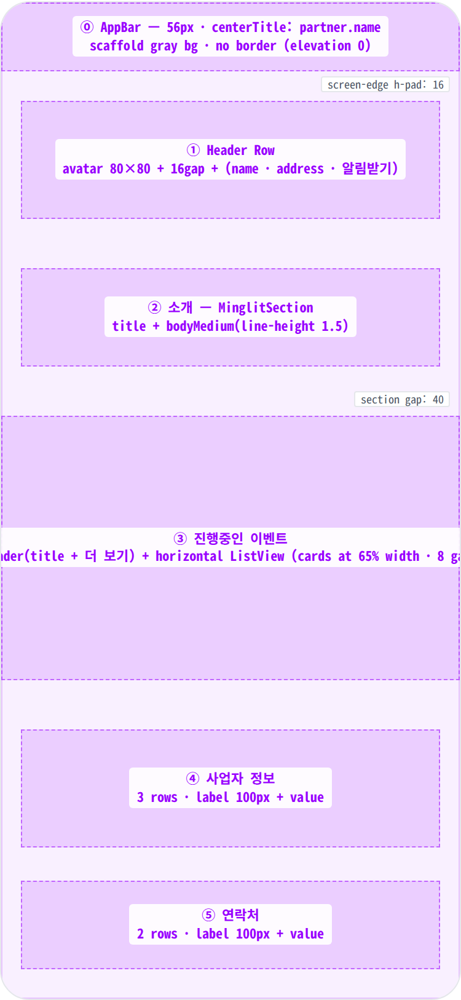
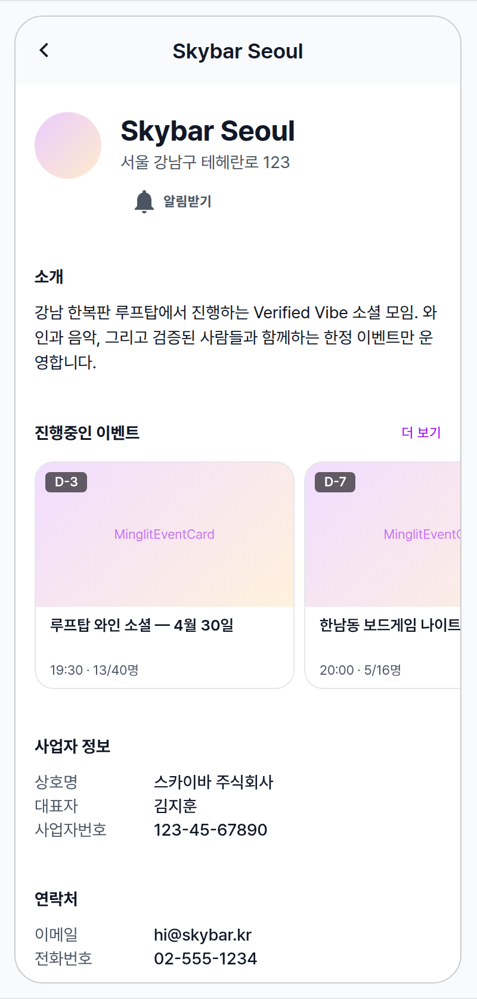
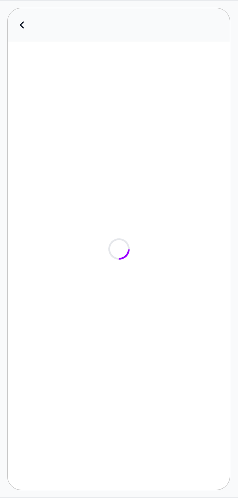
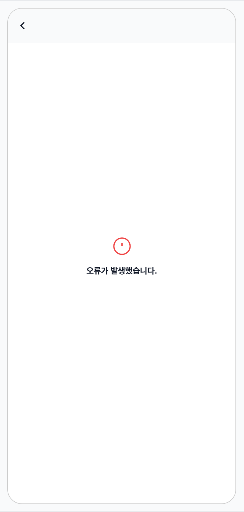
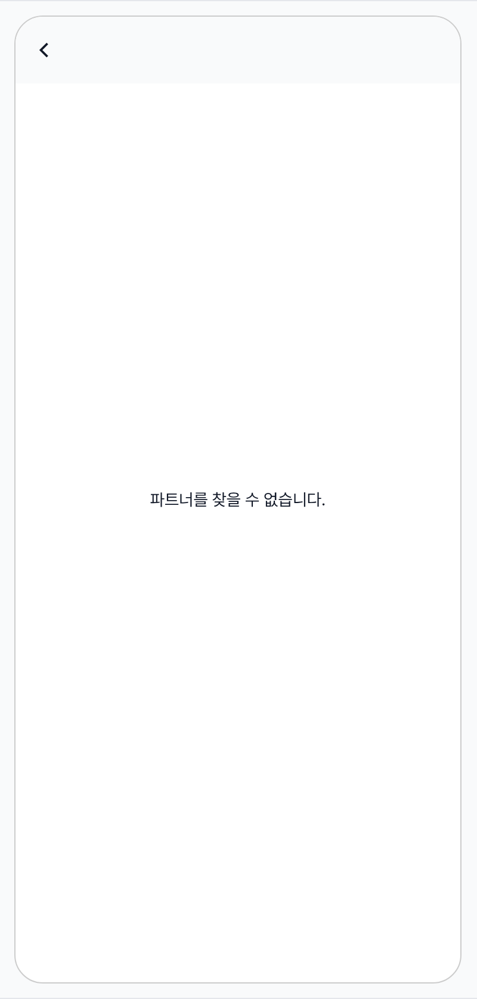
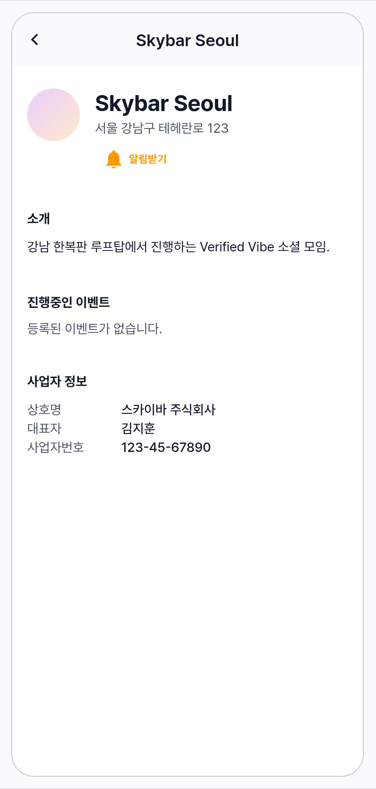

 Spec — PartnerDetailPage (app\_user · PartnerDetailRoute)  

# Partner Detail

## Overview

| Status | 🚧 디자인중 — 5 states · 사업자 정보 / 연락처 노출 정책 검토 중. |
|---|---|
| App | app_user |
| Category | partner · detail |
| Route / Surface | PartnerDetailRoute · widget: PartnerDetailPage + PartnerDetailView (kit-shared body) |
| Path | /partners/:partnerId |
| Hierarchy | Parent: — (top-level screen)Children: MinglitEventCard (가로 카드 — 별도 spec) |
| Purpose | 파트너(점주/모임 운영자)의 프로필을 한 화면에 정리해 — 소개글, 진행중 이벤트, 사업자 정보, 연락처 — 사용자가 신뢰 판단 후 이벤트 참여로 진입할 수 있게 한다. "알림받기"로 새 이벤트 알림 구독, 가로 카드의 이벤트로 바로 진입, "더 보기"로 전체 목록(PartnerEventsPage) 확장 — 3가지 다음 액션을 제공. |
| User journey | Entry points: EventDetailPage의 파트너 행 탭 → 이 화면 (주 경로) · PurchaseHistoryDetailPage의 파트너 정보 카드 row 탭 (2차 경로 · #2098) · 공유 링크 / 딥링크 직접 진입.Exit points: 뒤로 가기 → 이전 화면 / 가로 카드 탭 → EventDetailPage로 이동 / "더 보기" → PartnerEventsPage로 이동 / "알림받기" 토글 → 알림 구독 토글 (비로그인이면 로그인 화면으로 이동). |
| Background | 파트너 신뢰 평가 + 이벤트 디스커버리 보조 화면. AppBar 타이틀에는 파트너 이름이 들어가는데, 데이터가 도착하기 전에는 빈 자리로 둔다. 이벤트 가로 리스트 카드 width = (screenWidth − 48) × 0.65 → 한 화면에 ~1.5장 노출 (Fix #171). 카드 하단 메타가 1px 잘리지 않도록 컨테이너 height = (cardWidth × 9/16) + 68 (Fix #1214). |
| Frequency | 관심 파트너마다 1~2회 — 첫 발견 시 + 새 이벤트 알림 받았을 때 재방문. |

## History

| Date | Version | Author | Changes |
|---|---|---|---|
| 2026-05-01 | 1.0 | mark-yun | v1.4 template으로 작성 — 5 states (Default · Loading · Error · NotFound · EmptyEvents). 가로 이벤트 카드 영역은 MinglitEventCard 별도 spec 위임. |
| 2026-05-05 | 1.0.1 | needs-uiux-claude-1 | Entry points / Related screens에 PurchaseHistoryDetailPage 2차 진입 경로 한 줄 추가 — 양방향 hierarchy 비대칭 해소 (#2098). |

[🧱 Layout](#layout) [🎨 States](#states) [🔄 Global Behavior](#global-behavior) [📖 Reference](#reference)

🧱

## Layout

화면 구조 — 영역, 정렬, 간격 규칙. 색·타이포 무시.

## Blueprint & tree

`Scaffold` · centered AppBar(title = partner.name) + `SingleChildScrollView` body. Body는 `MinglitContentLayout`(top 24 · bottom 32 · 섹션 사이 sectionGap 40)으로 5개 섹션을 세로로 배열. ① Header(avatar 80 + name/address/notify 칼럼) → ② 소개 → ③ 진행중인 이벤트(가로 스크롤) → ④ 사업자 정보(3 행) → ⑤ 연락처(2 행). 모든 섹션은 `MinglitSection` 패턴(타이틀 + spacing-sm + body)이며 ①은 직접 Padding으로 감싼 Row.

**Scaffold** ├─ **AppBar**(centerTitle: true) │ └─ title: partnerAsync.whenOrNull(data: (p) => Text(p?.name ?? '')) │ ?? _SizedBox.shrink()_ _(loading/error 시 빈 타이틀)_ │ └─ body: **MinglitAsyncValueWidget**(value: partnerAsync) ├─ \[loading\] **MinglitCircularProgressIndicator** (default) ├─ \[error\] **\_DefaultErrorView**(icon.error\_outline + "오류가 발생했습니다.") └─ \[data\] ├─ partner == null → **Center**(Text "파트너를 찾을 수 없습니다.") └─ partner != null → **PartnerDetailView** └─ **SingleChildScrollView** └─ **MinglitContentLayout**(top: 24 · bottom: 32 · sectionGap: 40) ├─ ① _Header_ Padding(h: _screenEdge 16_) │ └─ Row │ ├─ **CircleAvatar**(radius: _card 16 + button 12 = 28_) — 80×80 │ │ ├─ photoUrl != null → NetworkImage │ │ └─ else → bg surfaceContainerHighest + Icon(store · _xlarge×1.25 = 40_ · outline) │ ├─ Gap: _spacing-medium 16_ │ └─ Expanded · Column(crossAxis: start) │ ├─ Text(partner.name) — _headlineSmall · bold_ │ ├─ Text(partner.address) — _bodyMedium · onSurfaceVariant_ _(if address != null)_ │ ├─ Gap: _spacing-small 8_ │ └─ **MinglitSocialButton**(targetType: partner · interactionType: subscribe · label: '알림받기') │ · TextButton.icon · 24px Icons.notifications\_none/active │ · padding: 8h · 2v · onSurfaceVariant↔secondary 토글 │ ├─ Gap: _sectionGap 40_ │ ├─ ② **MinglitSection**(title: '소개') │ └─ Text(partner.introduction ?? '소개글이 없습니다.') │ · _bodyMedium · height 1.5_ │ ├─ Gap: _sectionGap 40_ │ ├─ ③ _\_buildEventSection_ (Padding 없음 — 헤더만 screen-edge 적용 + ListView가 풀폭 가로 스크롤) │ ├─ Row \[h-pad screenEdge 16\] │ │ ├─ Text('진행중인 이벤트') — _titleMedium · bold_ │ │ ├─ Spacer │ │ └─ TextButton('더 보기') — _bodySmall · color-primary_ _(if onMoreEventsTap != null)_ │ ├─ Gap: _spacing-medium 16_ │ └─ **MinglitAsyncValueWidget**(eventsAsync) │ ├─ \[data + empty\] Text('등록된 이벤트가 없습니다.') · outline │ ├─ \[data + nonempty\] SizedBox(h: cardW×9/16 + 68) │ │ └─ **ListView.separated**(horizontal · gap: small 8) │ │ └─ SizedBox(width: cardW) → ClipRRect(radius-card) │ │ └─ [**MinglitEventCard**](/specs/event_card/index.html) _(별도 spec)_ │ └─ \[error\] Text('Error: $e') │ ├─ Gap: _sectionGap 40_ │ ├─ ④ **MinglitSection**(title: '사업자 정보') │ └─ Column(crossAxis: start) │ ├─ _\_buildInfoRow_('상호명', partner.bizName) │ ├─ _\_buildInfoRow_('대표자', partner.representativeName) │ └─ _\_buildInfoRow_('사업자번호', partner.bizNumber) │ · 각 row Padding(v: _xxsmall 2_) · label 100px outline + value bodyMedium w500 │ ├─ Gap: _sectionGap 40_ │ └─ ⑤ **MinglitSection**(title: '연락처') └─ Column ├─ _\_buildInfoRow_('이메일', partner.contactEmail) └─ _\_buildInfoRow_('전화번호', partner.contactPhone)

## Spacing & alignment rules

| # | Region | Alignment | Spacing |
|---|---|---|---|
| ⓪ | AppBar | centerTitle · 56dp · scaffold-gray bg · 테두리 없음 | title typography titleLarge (Material default for AppBar) · loading 시 SizedBox.shrink |
| ① | Header Row | row crossAxis center · 좌측 정렬 · 양측 screen-edge | avatar 80×80 (radius 40) · avatar↔text gap: spacing-medium (16) · column 내부: name → address → spacing-small (8) → notify TextButton |
| ② | 소개 (MinglitSection) | column start · 좌우 screen-edge (16) | title↔body: spacing-sm (12) · ① ↔ ② section gap: sectionGap (40) |
| ③ | 진행중인 이벤트 | header h-pad screen-edge · ListView는 edge-to-edge 가로 스크롤 | title↔ListView gap: spacing-medium (16) · 카드 사이 gap: spacing-small (8) · 카드 width: (screenW − spacing-large×2) × 0.65 · 컨테이너 height: cardW×9/16 + 68 (Fix #1214) |
| ④ | 사업자 정보 | column start · 각 row 좌측 정렬 | row v-pad: spacing-xxsmall (2) · label width: 100px 고정 · header↔body gap sm (12) |
| ⑤ | 연락처 | 동일 (info row 패턴) | 동일 — sectionGap 40 · row v-pad 2 |
| — | Bottom padding | — | MinglitContentLayout bottom: spacing-xlarge (32) |

🎨

## States

5 states (Default · Loading · Error · NotFound · EmptyEvents). 모두 동일 `Scaffold` 골격 — body만 분기. Default가 baseline; 나머지는 additive diff (`+` · `−` · `↔` · `동일` · `—`).

## State summary

| State | Tag | 조건 (요약) | Key visual differentiator |
|---|---|---|---|
| Default 🎯 | production | 파트너가 로드됐고 이벤트도 1개 이상 도착한 상태 | Header (아바타 + 이름 + 알림받기) + 소개 + 가로 이벤트 카드(~1.5장) + 사업자 / 연락처 |
| Loading | async | 파트너 정보를 불러오는 중 | 화면 중앙 단일 스피너 · AppBar 타이틀 비어있음 |
| Error | network/server | 파트너 정보를 받지 못한 상태 | 중앙 에러 아이콘 + "오류가 발생했습니다." |
| NotFound | data·null | 파트너가 존재하지 않거나 삭제된 상태 | 화면 중앙 "파트너를 찾을 수 없습니다." · AppBar 타이틀 비어있음 |
| EmptyEvents | partial | 파트너는 정상이지만 진행중 이벤트가 0건 | ③ 영역만 "등록된 이벤트가 없습니다." 텍스트로 대체. 나머지 섹션 동일. |

## States gallery

각 state mini-table — mockup(rowspan=6) + 6 aspect rows. **Default가 baseline**; 나머지 4 states는 additive diff. ③ 영역의 카드 자체 디자인(D-Day · sold out · 오늘 등 4 variant)은 [MinglitEventCard](/specs/event_card/index.html) child spec에서 다룸 — 이 spec은 페이지 골격에 집중.

### Default 🎯 baseline · production · partner + events 모두 로드

| 항목 | 내용 |
|---|---|
| 조건 | 파트너가 로드됐고 이벤트도 1개 이상 도착한 상태. |
| 사용자 액션 | · 뒤로 가기 → 이전 화면· 가로 카드 탭 → EventDetailPage로 이동· "더 보기" 탭 → PartnerEventsPage로 이동· "알림받기" 탭 (로그인) → 알림 구독 토글 — 아이콘 notifications_none ↔ notifications_active · 색상 onSurfaceVariant ↔ secondary· "알림받기" 탭 (비로그인) → 로그인 화면으로 이동· 가로 카드 스와이프 → 카드 가로 스크롤 (다음 카드 노출) |
| 에지케이스 | — |
| 컴포넌트 | Scaffold · AppBar(centerTitle: true) · MinglitAsyncValueWidget · PartnerDetailView · SingleChildScrollView · MinglitContentLayout(top 24 / bottom 32 / sectionGap 40) · CircleAvatar(radius 40 · NetworkImage 또는 surfaceContainerHighest fallback + Icons.store) · MinglitSocialButton(SocialInteractionType.subscribe · label '알림받기' · 24px notifications_none/active) · MinglitSection(소개 · 사업자 정보 · 연락처) · TextButton('더 보기' · bodySmall · color-primary) · ListView.separated(horizontal · separatorBuilder: SizedBox(width: small)) · SizedBox(width: cardW) + ClipRRect(radius-card) → MinglitEventCard(showPartnerOverlay: false · 별도 spec) · _buildInfoRow(label 100px width + value bodyMedium w500) |
| 토큰 | color-surface (#f9fafb) (scaffold + AppBar bg) · color-background (#ffffff) (Scaffold elevated 영역 — 이 페이지에선 카드 없음, 평면 배경) · color-primary (더 보기 텍스트) · color-secondary (구독 active 색상) · color-text-primary (name · 섹션 타이틀 · info value) · color-text-secondary = onSurfaceVariant (address · 섹션 본문 fallback · info label · subscribe inactive) · color-divider = surfaceContainerHighest (avatar fallback bg) · spacing: screen-edge (16) · medium (16) · small (8) · sm (12) · xxsmall (2) · large (24) (top padding) · xlarge (32) (bottom padding) · sectionGap (40) · radius: radius-card (16) (이벤트 카드 ClipRRect) · typography: titleLarge (AppBar title · Material default) · headlineSmall bold (partner name) · bodyMedium (address · intro · info value) · titleMedium bold (섹션 헤더 — '진행중인 이벤트') · bodySmall ('더 보기') · iconSize: medium (24) (notifications icon · default MinglitIconSize.medium) · xlarge × 1.25 (40) (avatar fallback Icons.store) |
| 노트 | — |

### Loading async

| 항목 | 내용 |
|---|---|
| 조건 | 파트너 정보를 불러오는 중. 처음 진입 시점. |
| 사용자 액션 | · 뒤로 가기 → 이전 화면 (즉시)· 그 외 무반응 (스피너 회전). |
| 에지케이스 | 로딩 동안에는 AppBar 타이틀이 비어 있음 — 길게 걸리면 사용자가 "어디로 진입했는지" 단서를 잃을 수 있음. |
| 컴포넌트 | ↔ 본문 → 화면 중앙 단일 스피너 · AppBar 타이틀은 비워둠 |
| 토큰 | − Default의 텍스트/카드 토큰 미사용. + 스피너 color: color-primary |
| 노트 | 📝 스켈레톤은 미구현 — 후속 보강에서 hero / info 스켈레톤 추가 검토. |

### Error network/server

| 항목 | 내용 |
|---|---|
| 조건 | 파트너 정보를 받지 못한 상태. 네트워크 / 서버 / 권한 오류. |
| 사용자 액션 | · 뒤로 가기만 가능. 재시도 버튼 없음 — 풀-다운 새로고침도 없음. |
| 에지케이스 | · 구체적인 오류 사유는 화면에 표시되지 않음 — 일반 안내 문구만 노출. |
| 컴포넌트 | ↔ 본문 → 중앙 정렬 에러 아이콘(xlarge 32 · color-error) + spacing-medium 간격 + 텍스트 "오류가 발생했습니다." (titleMedium bold) |
| 토큰 | + color-error (아이콘)+ spacing-large (외곽 패딩 24)− Default body 토큰 |
| 노트 | 📝 재시도 버튼 부재는 향후 보강 후보. 현재는 "뒤로 → 다시 진입" 우회로 재시도. |

### NotFound data·null

| 항목 | 내용 |
|---|---|
| 조건 | 파트너가 존재하지 않거나 삭제된 상태. |
| 사용자 액션 | · 뒤로 가기만 가능. |
| 에지케이스 | · 외부 링크로 잘못된 / 만료된 파트너에 진입 — 가장 빈번한 진입 경로· 구독했던 파트너가 삭제됨 — 알림 탭 → 이 화면 |
| 컴포넌트 | ↔ 본문 → 화면 중앙 단일 텍스트 "파트너를 찾을 수 없습니다." (bodyMedium · color-text-primary) |
| 토큰 | − Default body 토큰 (단순 텍스트만) |
| 노트 | 📝 Error state와 시각적으로 거의 동일 (아이콘만 없음). 향후 두 케이스를 같은 컴포넌트로 합치는 것도 검토. |

### EmptyEvents partial

| 항목 | 내용 |
|---|---|
| 조건 | 파트너는 정상이지만 진행중 이벤트가 0건. |
| 사용자 액션 | · "더 보기" 탭 — 빈 상태에서도 그대로 노출되며 PartnerEventsPage로 이동 (그쪽도 EmptyEvents 안내). 디자인 리뷰 후 숨김 여부 결정 가능.· "알림받기" 토글 — 새 이벤트 알림 수신 의도 (이 빈 상태에서 가장 가치 있는 액션).· 그 외는 Default와 동일 (뒤로 가기, 사업자 정보 텍스트 길게 눌러 복사 등 OS 기본 동작). |
| 에지케이스 | · 모든 이벤트가 종료 → 동일 처리 (진행 / 예정만 모이는 가정).· 파트너는 활성 상태이지만 첫 이벤트를 아직 만들지 않은 신규 가입자. |
| 컴포넌트 | ↔ 가로 카드 리스트 → "등록된 이벤트가 없습니다." (bodyMedium · outline)· "더 보기" 버튼은 그대로 노출 (빈 상태에서도 숨겨지지 않음) |
| 토큰 | − radius-card (이벤트 카드 사라짐) · 나머지 동일 |
| 노트 | 📝 빈 상태에서 "더 보기" 노출은 의도 미확정 — 리뷰 후 이벤트가 있을 때만 노출하는 보강 가능. |

🔄

## Global Behavior

cross-cutting — 모든/다수 state에 적용. state-specific 액션은 위 mini-table 참고.

## Cross-cutting interactions

| 사용자 액션 | 화면에 보이는 결과 |
|---|---|
| 뒤로 가기 (OS back / AppBar 뒤로 버튼) | 이전 화면으로 복귀 — 5 state 모두 동일. sharedAxisScaled 역방향 전환. |
| 이벤트 카드 가로 스와이프 | 이벤트가 한 화면에 약 1.5장씩 보이며 자유롭게 스크롤. 강제 페이지 스냅 없음. |
| "알림받기" 탭 | 알림 구독 토글. 비로그인이면 로그인 화면으로 이동. |
| 딥링크로 직접 진입 | /partners/:partnerId URL로 곧장 진입 → Loading → Default (또는 Error / NotFound). 진입 전환은 sharedAxisScaled. |

## Motion timing

Source: `shared/packages/mds/core/lib/src/theme/minglit_design_tokens.dart` → `MinglitAnimation`.

| Transition | Token / Duration | Notes |
|---|---|---|
| 화면 진입 | MinglitPageTransitions.sharedAxisScaled | 가로 슬라이드 + scale fade. |
| "알림받기" 토글 | MinglitAnimation.micro (100ms) | 아이콘 전환 (notifications_none ↔ active) + 색상 fade. |
| Loading → Data 교체 | cut | fade 없이 즉시 교체 — 스피너가 콘텐츠로 곧바로 바뀜. |
| 가로 리스트 스크롤 관성 | OS 기본 | iOS는 끝에서 살짝 튕김, Android는 Material 기본. 별도 token 없음. |

## Global edge cases

-   **프로필 이미지 없음** — 아바타가 회색 배경 + 가게 아이콘(40px · outline)으로 대체 표시. 두 상태 모두 80×80.
-   **주소 없음** — Header에서 그 줄이 사라지고 알림받기 버튼이 위로 붙음. 빈 자리 안 남음.
-   **소개글 없음** — '소개글이 없습니다.' 안내 텍스트 (회색 처리 없이 본문 색).
-   **사업자 정보 모두 없음** — 각 행 값이 모두 '-'로 표시. 섹션 자체는 항상 노출.
-   **연락처 모두 없음** — 동일하게 '-'. 빈 섹션이 사용자에게 노출 — 디자인 리뷰 필요.
-   **다크 모드** — scaffold gray → dark surface로 전환, AppBar 동기화. 아바타 fallback / 아이콘 outline 모두 다크 토큰으로 자동 전환.
-   **접근성** — AppBar 뒤로 버튼은 플랫폼 기본 접근성. "알림받기" 텍스트 버튼은 별도 툴팁 없음 (라벨이 접근성 라벨 역할).
-   **스크롤 동작** — 외부는 세로 스크롤, ③ 영역만 가로 스크롤. 두 축이 자연스럽게 분리되어 충돌 없음.

📖

## Reference

implementation source + 인접 화면. Components / Tokens는 위 mini-table 참고.

## Implementation source

| Widget (page) | PartnerDetailPage — apps/app_user/lib/src/features/partner/detail/partner_detail_page.dart |
|---|---|
| Widget (body) | PartnerDetailView (kit-shared) — shared/packages/minglit_kit/lib/src/ui/widgets/partner/partner_detail_view.dart |
| Provider | partnerDetailProvider(partnerId) · partnerEventsProvider(partnerId) (event_feed_provider.dart) |
| Coordinator | partnerCoordinatorProvider — partner_coordinator.dart (Fix #634: home_coordinator → partner_coordinator). pushEventDetail · pushPartnerEvents |
| Repository | partnerRepositoryProvider.getPartnerById(id) |
| Async helper | MinglitAsyncValueWidget — loading: MinglitCircularProgressIndicator · error: _DefaultErrorView (Icons.error_outline + "오류가 발생했습니다.") |
| Layout helpers | MinglitContentLayout(top 24 / bottom 32 / sectionGap 40 · showDividers: false) · MinglitSection(title + spacing-sm + child) · MinglitSocialButton(label '알림받기' · subscribe interaction) |
| Route | PartnerDetailRoute · path /partners/:partnerId · transition MinglitPageTransitions.sharedAxisScaled · app_routes.dart |
| Related fix | Fix #171 (가로 카드 + 알림받기 + 더 보기) · Fix #634 (coordinator 분리) · Fix #1214 (이벤트 카드 1px 오버플로 — 68px content padding) |

## Related screens

| Spec | Relation |
|---|---|
| EventDetailPage | 주 진입 경로 — partner row 탭 → 이 화면. ③ 영역의 카드 탭으로 다시 EventDetail로 이동(loop). |
| PurchaseHistoryDetailPage | 2차 진입 경로 — 파트너 정보 카드 row 탭 → 이 화면 (양방향 hierarchy · #2098). |
| MinglitEventCard | ③ 영역의 카드 위젯 — 별도 spec. D-Day · sold out · 오늘 · ended 4 variant. |
| PartnerEventsPage (TBD spec) | "더 보기" 탭 시 진입 — 같은 partnerId의 이벤트 목록 (세로 ListView). |
| LoginPage | 비로그인 + "알림받기" 탭 시 controller 내부에서 LoginRoute push (auth-required interaction). |
| HomePage | 차단된 파트너 관리 화면(BlockedPartnersRoute)이 MyPage 하위에 있음 — 이 화면에는 직접 차단 액션 없음. |