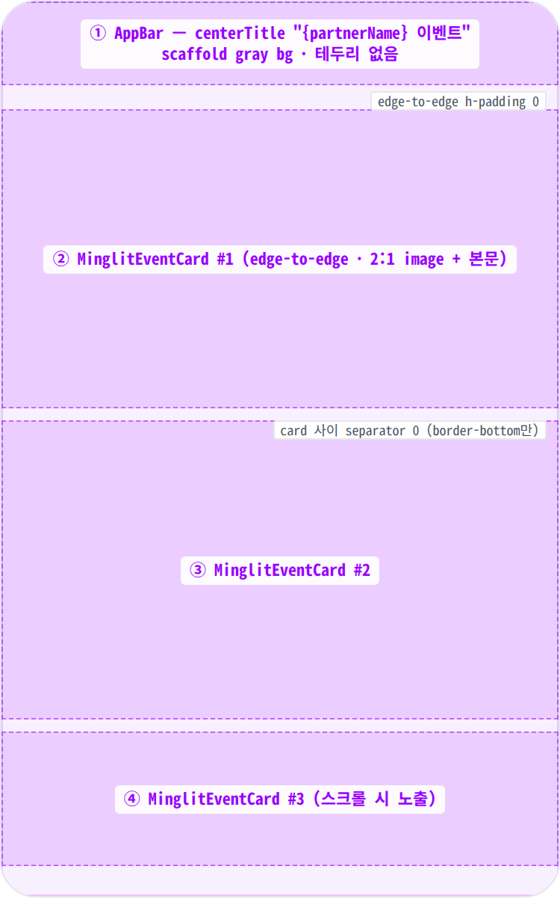
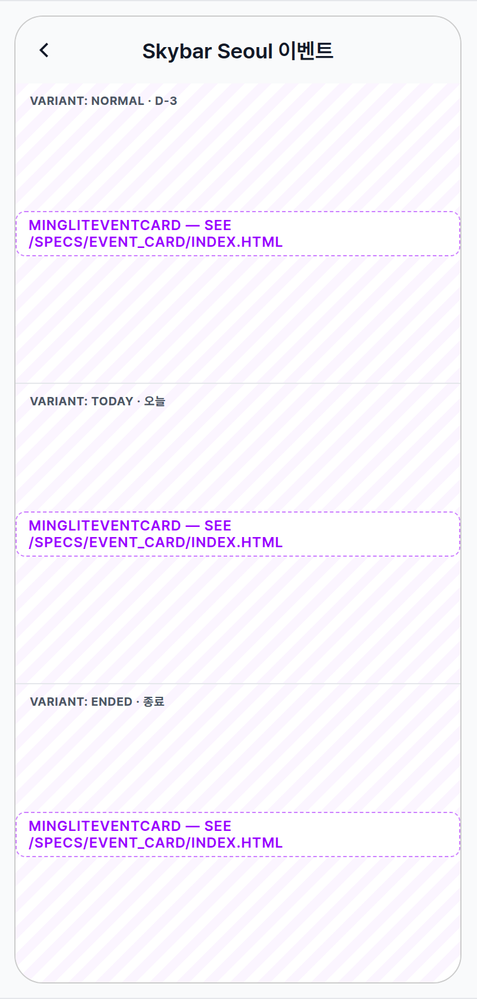
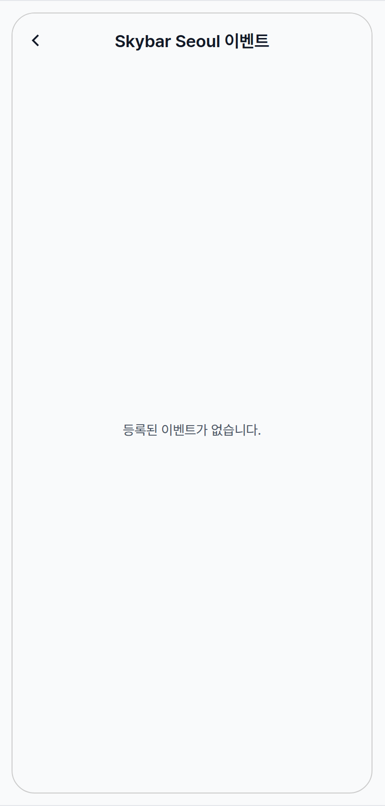
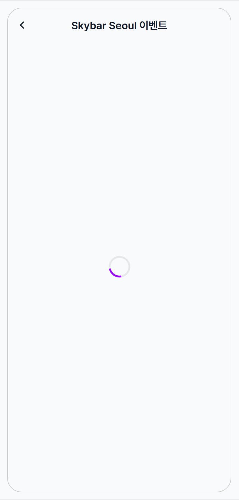
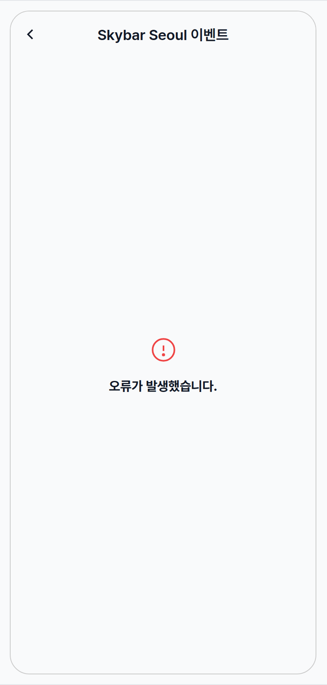

 Spec — PartnerEventsPage (app\_user · PartnerEventsRoute)  

# Partner Events

## Overview

| Status | 🚧 디자인중 — 4 states · 단순 vertical list (filter / sort 미구현). PartnerDetailPage "더 보기"에서 확장된 풀 리스트. |
|---|---|
| App | app_user |
| Category | partner · events list |
| Route / Surface | PartnerEventsRoute · widget: PartnerEventsPage |
| Path | /partners/:partnerId/events |
| Hierarchy | Parent: PartnerDetailPage ("진행중인 이벤트 → 더 보기" 탭으로 진입)Children: MinglitEventCard (수직 셀 · 파트너 오버레이 숨김 · 4 visible state — 별도 spec) |
| Purpose | 한 파트너가 운영하는 모든 이벤트를 시간순으로 한 화면에 펼쳐 보여준다. PartnerDetailPage의 가로 스크롤(약 1.5장 노출)은 발견·미리보기 용도이고, 이 화면은 "이 파트너의 이벤트 목록 전체를 천천히 훑어보기" — 사용자의 결정/탐색 단계를 받쳐주는 보조 화면. |
| User journey | Entry points: PartnerDetailPage "진행중인 이벤트 → 더 보기" 텍스트 버튼 탭 — 사실상 단일 진입점. 딥링크 /partners/:partnerId/events도 가능 (URL 공유 / 외부 링크).Exit points: 카드 탭 → EventDetailPage로 이동 · 뒤로 가기 → PartnerDetailPage 복귀. |
| Background | PartnerDetailPage의 가로 스크롤은 한 화면에 1.5~2장만 노출 — "더 많은 이벤트가 있을 수 있다"는 단서만 준다. 이 화면은 그 "더 많은 이벤트"를 풀폭 수직 리스트로 풀어주는 자리. 별도 필터 / 정렬 / 페이지네이션 없이 카드 리스트 한 묶음만 노출. 한 번 본 결과는 짧은 시간 동안 유지되어, 곧바로 다시 들어오면 즉시 같은 리스트가 보인다. |
| Frequency | 관심 파트너에 대해 이벤트 사이클당 0~1회 — PartnerDetail에서 카드를 다 보고 더 둘러보고 싶을 때만 진입. |

## History

| Date | Version | Author | Changes |
|---|---|---|---|
| 2026-05-01 | 1.0 | mark-yun | v1.4 template으로 작성 — 4 states (Default · EmptyEvents · Loading · Error). 카드 자체 디자인은 MinglitEventCard child spec으로 위임. |

[🧱 Layout](#layout) [🎨 States](#states) [🔄 Global Behavior](#global-behavior) [📖 Reference](#reference)

🧱

## Layout

Scaffold + AppBar + ListView 단순 골격. body는 loading / error / data 3개 분기를 같은 영역에서 교체 노출.

## Blueprint & tree

Body는 카드가 화면 끝에서 끝까지(edge-to-edge) 이어진 단일 수직 리스트. 카드 사이 별도 구분선 없음, 외곽 패딩 없음. 카드 자체가 2:1 이미지 + 본문(타이틀 · 메타 · 태그)을 포함하므로 별도 섹션 헤더 / 고정 영역을 두지 않는다.

**Scaffold** ├─ **AppBar**(centerTitle: true) ← ① │ └─ title: `Text('$partnerName 이벤트')` │ └─ body: 비동기 분기 ├─ \[loading\] **MinglitCircularProgressIndicator** ├─ \[error\] 아이콘 + "오류가 발생했습니다." └─ \[data\] ├─ 이벤트 0개 → **Center**(`Text('등록된 이벤트가 없습니다.')` · bodyMedium · outline) └─ 이벤트 N개 → **ListView** └─ [**MinglitEventCard**](/specs/event_card/index.html) ← ②③④ · 파트너 오버레이 숨김 _(Fix #1214: AppBar에 이미 파트너 이름이 노출되므로 중복 제거)_ · onTap → EventDetailPage로 이동

| # | Region | Alignment | Spacing |
|---|---|---|---|
| ① | AppBar | centerTitle (Material default · auto-back arrow) | height: 56 · scaffold gray bg · border-bottom 없음 · title typography titleLarge |
| ②③④ | MinglitEventCard cell | edge-to-edge · 외곽 패딩 없음 | 카드 사이 별도 구분선 0 — 카드 본체의 하단 divider만으로 분리. 카드 height = 2:1 이미지 + 본문 — 2026-04 기준 (~252px on 384). 자세한 anatomy는 child spec. |
| — | Body | — | 외곽 padding 0 — 리스트만 노출. |

🎨

## States

4 states (Default · EmptyEvents · Loading · Error). 모두 동일 `Scaffold` + AppBar — body만 분기. Default가 baseline; 나머지는 additive diff (`+` · `−` · `↔` · `동일` · `—`). 카드 자체의 4 visible state(normal · today · soldOut · ended) 변형은 [MinglitEventCard child spec](/specs/event_card/index.html) 참고.

## State summary

| State | Tag | 조건 (요약) | Key visual differentiator |
|---|---|---|---|
| Default 🎯 | production | 이벤트가 1개 이상 도착한 상태 | 수직 카드 리스트 · 이벤트 카드 × N (임박 / 오늘 / 만석 / 종료가 자유롭게 섞여 노출) |
| EmptyEvents | data·empty | 파트너는 정상이지만 이벤트가 0개 | 화면 중앙 단일 안내 메시지 "등록된 이벤트가 없습니다." |
| Loading | async | 이벤트 목록을 불러오는 중 | 화면 중앙 스피너 · AppBar 파트너 이름은 그대로 노출 |
| Error | network/server | 이벤트 목록을 받지 못한 상태 | 중앙 에러 아이콘 + "오류가 발생했습니다." |

## States gallery

각 state mini-table — mockup(rowspan=6) + 6 aspect rows. **Default가 baseline**; 나머지 3 states는 additive diff. 카드 자체 anatomy / D-Day 칩 / 만석 scrim 등은 child spec에서 다룸 — 이 spec은 페이지 골격(AppBar + 리스트 분기)에 집중.

### Default 🎯

| 항목 | 내용 |
|---|---|
| 조건 | 이벤트가 1개 이상 도착한 상태. |
| 사용자 액션 | · 뒤로 가기 → PartnerDetailPage 복귀· 카드 탭 → EventDetailPage로 이동· 스크롤 → 추가 카드 노출· 카드 길게 누르기 — 별도 액션 없음 |
| 에지케이스 | · 임박 / 오늘 / 만석 / 종료 카드가 섞여 노출. 정렬은 시작 시간 기준으로 보이지만 명시적 보장은 아님.· 종료된 이벤트는 카드 자체에서 흑백 처리되어 "지난 이벤트"로 시각 구분.· 운영 이력이 긴 파트너 — 페이지네이션 없이 한 번에 전체 리스트가 노출, 보이는 만큼만 점진적으로 그려짐. |
| 컴포넌트 | Scaffold · AppBar(centerTitle · 타이틀 "{파트너 이름} 이벤트") · 카드 리스트 · MinglitEventCard(파트너 오버레이 숨김 · 탭 시 EventDetailPage로 이동 · 별도 spec — child) |
| 토큰 | · color: color-surface (#f9fafb) (scaffold + AppBar bg) · color-background (#ffffff) (카드 본체 — child spec) · color-text-primary (AppBar title) · color-text-secondary = onSurfaceVariant (back arrow ripple 등)· spacing: list 외곽 padding 0 (edge-to-edge) · 카드 사이 separator 0 — 카드 내부 token은 child spec 참고· radius / typography / iconSize: 모두 카드 자체에 위임 — child spec |
| 노트 | 📝 mockup은 카드 3장 placeholder로 표시 (실제 카드 미렌더링 — child spec 위임 규칙). 실제 사용 시 N개. AppBar의 파트너 이름은 진입 직후부터 즉시 노출 — 데이터 도착 전에도 어디로 들어왔는지 단서 제공. |

### EmptyEvents data·empty

| 항목 | 내용 |
|---|---|
| 조건 | 파트너는 정상이지만 이벤트 목록이 비어있는 상태. |
| 사용자 액션 | · 뒤로 가기 → PartnerDetailPage 복귀.· 그 외 무반응 — 별도 CTA 없음. |
| 에지케이스 | · PartnerDetailPage 가로 리스트에서 1~2장이 보였더라도, 이 풀 리스트가 새로 받아오는 시점에는 0개로 보일 수 있음.· 모든 이벤트가 종료된 파트너라면 빈 상태로 표시될 수 있음.· 새로 가입한 파트너 — 첫 이벤트를 아직 만들지 않은 케이스에 자연스럽게 표시. |
| 컴포넌트 | ↔ 카드 리스트 → 화면 중앙 단일 안내 텍스트 "등록된 이벤트가 없습니다." (bodyMedium · outline 색) |
| 토큰 | − Default list 토큰 미사용+ color-text-secondary = outline (메시지 색) |
| 노트 | 📝 재시도 / "둘러보기" CTA 없음 — 단순 텍스트만. 향후 "이 파트너 알림받기" 유도 또는 홈으로 보내기 등 보강 후보. |

### Loading async

| 항목 | 내용 |
|---|---|
| 조건 | 이벤트 목록을 불러오는 중인 상태. 첫 진입 또는 캐시 만료 후 재진입 시. |
| 사용자 액션 | · 뒤로 가기 → PartnerDetailPage 복귀 (즉시).· 그 외 무반응 (스피너 회전). |
| 에지케이스 | · 직전에 같은 파트너 화면을 본 적이 있다면 캐시 덕분에 이 상태를 거의 거치지 않고 곧장 리스트가 노출됨.· 스켈레톤 / 풀-다운 새로고침 없음. 타임아웃 없음. |
| 컴포넌트 | ↔ 카드 리스트 → 화면 중앙 단일 스피너 |
| 토큰 | − Default list 토큰 미사용+ color-primary (스피너 색) |
| 노트 | 📝 AppBar의 파트너 이름은 진입 직후부터 즉시 표시 — Loading 상태에서도 "어디 진입했는지" 단서 제공. |

### Error network/server

| 항목 | 내용 |
|---|---|
| 조건 | 이벤트 목록을 받지 못한 상태. 네트워크 / 서버 / 권한 오류. |
| 사용자 액션 | · 뒤로 가기만 가능 — 재시도 버튼 없음.· 풀-다운 새로고침 없음 — "뒤로 → 다시 진입"으로 우회 재시도. |
| 에지케이스 | · 구체적인 오류 사유는 화면에 표시되지 않음 — 일반 안내 문구만 노출.· 인증 만료도 동일한 오류 화면 (별도 분기 없음). |
| 컴포넌트 | ↔ 카드 리스트 → 중앙 정렬 에러 아이콘 + "오류가 발생했습니다." (titleMedium bold) |
| 토큰 | + color-error (아이콘)+ color-text-primary (타이틀)+ spacing: spacing-large (24) (외곽 패딩) · spacing-medium (16) (아이콘↔타이틀 gap)− Default list 토큰 |
| 노트 | 📝 재시도 버튼 부재는 향후 보강 후보. |

🔄

## Global Behavior

cross-cutting — 모든/다수 state에 적용. state-specific 액션은 위 mini-table 참고.

## Cross-cutting interactions

| 사용자 액션 | 화면에 보이는 결과 |
|---|---|
| 뒤로 가기 (OS back / AppBar 뒤로 버튼) | 이전 화면(PartnerDetailPage)으로 복귀 — 4 state 모두 동일. |
| 카드 탭 (Default 한정) | EventDetailPage로 이동. |
| 풀-다운 새로고침 | 없음 — 짧은 캐시 시간이 지나야 자동으로 다시 받아옴. |
| 딥링크로 직접 진입 | /partners/:partnerId/events URL로 곧장 진입 가능 → Loading → Default (또는 Empty / Error). 외부 진입 경로에서는 AppBar의 파트너 이름이 비어 보일 수 있음. |
| 다크 모드 토글 | scaffold / AppBar / 카드 모두 다크 토큰으로 자동 전환. |

## Motion timing

Source: `shared/packages/mds/core/lib/src/theme/minglit_design_tokens.dart` → `MinglitAnimation`.

| Transition | Token / Duration | Notes |
|---|---|---|
| 화면 진입 (PartnerDetail → PartnerEvents) | MinglitAnimation.fast (200ms) | 플랫폼 기본 push 전환. |
| 카드 탭 → EventDetail 진입 | MinglitAnimation.medium (350ms) | MinglitPageTransitions.sharedAxisScaled — EventDetail 진입의 표준 전환. |
| Loading → Default 교체 | cut | fade 없이 즉시 교체. |
| 카드 탭 ripple | MinglitAnimation.micro (100ms) | Material 잉크 리플 — 카드 내부에서 처리. |
| 리스트 스크롤 관성 | OS 기본 | iOS는 끝에서 살짝 튕김, Android는 Material 기본. 별도 token 없음. |

## Global edge cases

-   **파트너 이름이 빈 문자열** — AppBar 타이틀이 " 이벤트"(앞뒤 빈 칸)로 보일 수 있음. PartnerDetailPage 진입 경로에선 사실상 발생 안 함, 외부 진입에서만 가능.
-   **리스트 캐시 공유** — PartnerDetailPage와 같은 데이터 묶음을 공유 — 한쪽에서 데이터를 받으면 다른 쪽도 곧바로 반영.
-   **대용량 리스트** — 페이지네이션 없음. 파트너가 운영 이력이 길면 한 번에 큰 리스트가 내려옴 (보이는 만큼만 점진적으로 그려짐).
-   **접근성** — AppBar 뒤로 버튼은 플랫폼 기본 접근성 동작. 카드 자체의 접근성 안내는 child spec 참고 (만석 / 종료 안내 포함).
-   **파트너 오버레이 숨김** — 이미 AppBar에 파트너 이름이 노출되므로 카드 좌상단의 파트너 오버레이는 중복 노출하지 않음. PartnerDetailPage 가로 리스트와 동일 정책.

📖

## Reference

implementation source + 인접 화면. Components / Tokens는 위 mini-table 참고.

## Implementation source

| Widget | PartnerEventsPage — apps/app_user/lib/src/features/partner/detail/partner_events_page.dart |
|---|---|
| Provider | partnerEventsProvider(partnerId:) — event_feed_provider.dart (@riverpod · 5분 keepAlive · isAutoDispose). |
| Repository | eventRepositoryProvider.getEventsByPartnerId(partnerId) |
| Coordinator | partnerCoordinatorProvider — partner_coordinator.dart · pushEventDetail(eventId) (Fix #634: home_coordinator → partner_coordinator). |
| Async wrapper | MinglitAsyncValueWidget<List<Event>> — loading: MinglitCircularProgressIndicator · error: _DefaultErrorView (Icons.error_outline + "오류가 발생했습니다."). |
| Card cell | MinglitEventCard — event_card.dart · showPartnerOverlay: false (Fix #1214: partner 컨텍스트에서 중복 뱃지 숨김). |
| Route | PartnerEventsRoute · /partners/:partnerId/events · 인자: partnerId (path) + partnerName (state.extra) · app_routes.dart. |
| Related fix | Fix #634 (coordinator 분리 · onTap pushEventDetail) · Fix #1214 (partner 컨텍스트 카드 overlay 숨김). |

## Related screens

| Spec | Relation |
|---|---|
| PartnerDetailPage | 유일한 진입점 — "진행중인 이벤트 → 더 보기" TextButton 탭. 같은 partnerEventsProvider를 공유 (캐시 hit). |
| MinglitEventCard | list cell 위젯 — 별도 spec. 4 visible state(normal · today · soldOut · ended). showPartnerOverlay: false 모드. |
| EventDetailPage | 카드 탭 시 진입. sharedAxisScaled 350ms 전환. |
| HomePage | 유사한 수직 이벤트 리스트 패턴 — 추천 피드 (다른 컨텍스트). |
| MyTicketsPage | 유사한 단일 리스트 화면 패턴. 다만 상단에 todayBanner / section header 있음 — 이 화면은 단순 리스트 한 묶음만. |