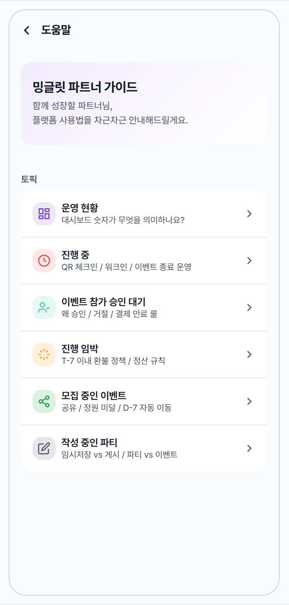
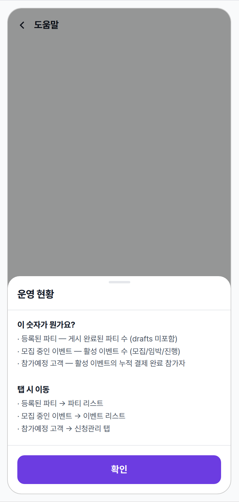

 Spec — PartnerGuide (도움말)  

# Partner Guide

## Overview

| Status | 🚧 작성 중 (v0.1 초안) |
|---|---|
| App | app_partner |
| Route / Surface | PartnerGuideRoute · widget: PartnerGuidePage |
| Path | /guide |
| Purpose | 파트너 도움말의 진입점 페이지. 6개 토픽 리스트로 구성되며, 각 토픽은 바텀시트로 열림 (route 변경 없이 한 페이지 안에서).홈의 각 섹션 ⓘ 버튼은 이 페이지를 거치지 않고 해당 토픽 시트로 직접 진입한다. |
| 진입점 | ① 파트너 홈 onboarding의 welcome 카드 "도움말 보기" CTA② 더보기 → 마이페이지 → 도움말 메뉴(각 섹션의 ⓘ 버튼은 메인을 거치지 않고 시트 직접 진입) |
| 설계 패턴 | 토픽 리스트 (메인) + showModalBottomSheet (Flutter) — 단일 route, 시트 stacking으로 sub-page처럼 노출. |

[🧱 Layout](#layout) [🎨 States](#states) [📋 Sheet 콘텐츠](#sheets) [📖 Reference](#reference)

🧱

## Layout

메인 토픽 리스트 + 바텀시트 stacking 구조.

## Tree

단일 route로 동작 — 토픽 탭 시 시트만 stack됨. 시트 dismiss → 메인 리스트로 복귀 (back stack 없음).

**Scaffold**
├─ **AppBar**: 좌측 ← back · 타이틀 "도움말"
├─ **body**:
│   ├─ Intro hero (밍글릿 파트너 가이드 + sub)
│   ├─ "토픽" 섹션 라벨
│   └─ **토픽 리스트 카드** (6 rows)
│       ├─ 운영 현황 — 대시보드 안내
│       ├─ 진행 중 — 운영 가이드
│       ├─ 이벤트 참가 승인 대기 — 승인 가이드
│       ├─ 진행 임박 — 운영 체크리스트
│       ├─ 모집 중인 이벤트 — 모집 가이드
│       └─ 작성 중인 파티 — 작성 가이드
│
└─ **Bottom sheet** (modal · 토픽 탭 시):
    ├─ handle
    ├─ header: 토픽 제목 (구분선)
    ├─ body: Q&A 섹션들 (스크롤)
    └─ footer: "확인" CTA (primary 풀폭)

🎨

## States

메인 리스트 + 시트 변형 2종.

### 메인 — 토픽 리스트 🎯 baseline · 도움말 진입 첫 화면

| 항목 | 내용 |
|---|---|
| 조건 | 도움말 진입 — 메인 토픽 리스트. |
| 사용자 액션 | ① 토픽 row 탭 → 해당 토픽 바텀시트 push (modal).② AppBar ← back → 이전 화면 (홈 또는 마이페이지). |
| 컴포넌트 | · AppBar (back + "도움말")· Intro hero (gradient 카드 + 환영 카피)· "토픽" 섹션 라벨· 토픽 리스트 카드 (6 row · iOS Settings 스타일 · 컬러 아이콘 박스) |
| 노트 | 📝 단일 route. 시트 dismiss 시 이 화면으로 자연 복귀. 홈 ⓘ 버튼은 이 메인 안 거치고 시트 직접 push. |

### 시트 열림 — "운영 현황" 예시 토픽 탭 시 push되는 modal sheet

| 항목 | 내용 |
|---|---|
| 조건 | 메인에서 토픽 row 탭 또는 홈의 ⓘ 버튼 직접 진입. |
| 사용자 액션 | ① 시트 body 스크롤 → 콘텐츠 탐색.② "확인" CTA 또는 시트 외부(overlay) 탭 / swipe down → dismiss.③ Dismiss 후 메인 리스트로 자연 복귀. |
| 컴포넌트 | · Modal overlay (rgba 0.4)· 시트 (bottom-anchored · max-height 80% · top-radius 20px)· 핸들 + 헤더(타이틀 + 구분선) + 스크롤 body + 풀폭 "확인" CTA· body 안 섹션: 타이틀(14/700) + 본문(13 secondary line-height 1.6) |
| 노트 | 📝 콘텐츠는 토픽별로 다름 (아래 "Sheet 콘텐츠" 섹션 참고). 닫기 X 없음 — "확인" 또는 swipe. |

📋

## Sheet 콘텐츠

6개 토픽별 시트 본문. 시스템 동작 / 기능 위치 / 정책 룰 중심.

## 1\. 운영 현황

| 섹션 | 내용 |
|---|---|
| 이 숫자가 뭔가요? | · 등록된 파티 — 게시 완료된 파티 수 (drafts 미포함)· 모집 중인 이벤트 — 활성화된 이벤트 수 (모집/임박/진행 — 종료/draft 미포함)· 참가예정 고객 — 활성화된 이벤트의 누적 결제 완료 참가자 |
| 탭 시 이동 | · 등록된 파티 → 파티 리스트· 모집 중인 이벤트 → 이벤트 리스트· 참가예정 고객 → 신청관리 탭 |

## 2\. 진행 중

| 섹션 | 내용 |
|---|---|
| 체크인은 언제부터? | · 이벤트 시작 시각의 2시간 전 자동 활성화· 그 전엔 QR 체크인 버튼 비활성 |
| QR 체크인 vs 수동 체크인 | · QR 체크인 = 정산 대상 (사용자가 보여준 QR 스캔)· 수동 체크인 — QR 못 읽거나 폰 분실 시 명단에서 직접· 수동 체크인의 정산 포함 여부는 정산 정책 참조 |
| 워크인 추가 | · 정원 미달일 때 명단 화면 상단 + 워크인 버튼· 워크인은 즉시 출석 처리 |
| 이벤트 종료 | · 종료 시각 도달 후 24시간 동안 홈에 남고 자동 소멸· 정산 탭에서 계속 추적 가능 |

## 3\. 이벤트 참가 승인 대기

| 섹션 | 내용 |
|---|---|
| 왜 승인이 필요한가요? | · 사용자 프로필 / 사진 / 자기소개를 파트너가 검토· 승인 후에야 사용자 결제 → 참가 확정 |
| 거절할 때 | · 사유 입력 — 사용자에게 통보됨· 거절 단계에서는 결제 자체가 진행되지 않음 (환불 불필요) |
| 승인 후 흐름 | · 승인 → 사용자에게 결제 알림 푸시· 사용자 결제 완료 → 참가 확정 (참가예정 고객 +1)· 승인 후 24시간 이내 결제 안 하면 자동 만료 |
| 일괄 처리 / 재신청 | · 신청관리 탭에서 다중 선택 → 일괄 승인· 거절된 사용자도 동일 이벤트 재신청 가능· 자동 승인 미지원 — 모든 신청은 수동 검토 |

## 4\. 진행 임박

T-7 이내 이벤트 — 환불 정책과 정산 규칙이 적용되기 시작하는 단계.

| 섹션 | 내용 |
|---|---|
| 참가자 명단 | · 최종 명단 확인 — 참가자 명단 화면에서· 정원 미달 시 → 워크인 추가 가능 (T-1까지) |
| 환불 정책 | · T-7 이내 사용자 환불 요청 → 부분 환불 (정책에 따라 차등)· 파트너 사유로 취소 시 → 전액 환불 (파트너 부담) |
| 정산 규칙 | · QR 체크인 완료된 참가자만 정산 대상· 정산 마감일: 이벤트 종료 후 익월 말일 |

## 5\. 모집 중인 이벤트

| 섹션 | 내용 |
|---|---|
| 공유는 어떻게? | · 카드 탭 → 이벤트 상세 → 우상단 공유 버튼· 미설치 사용자도 웹뷰로 미리보기 가능 |
| 정원 미달 시 | · 정원 미만이어도 진행 가능 (최소 인원 미설정 시)· D-7부터 사용자가 부분 환불 요청 가능· 파트너 사유로 취소 시 전액 환불 (파트너 부담) |
| D-7부터 자동 이동 | · 시작 7일 이내가 되면 진행 임박 섹션으로 자동 이동· 명단 확정 단계 진입 — 환불 정책 적용 시작 |
| 가격 변경 불가 | · 이미 결제한 사용자가 있을 수 있어 모집 시작 후 가격 변경 불가· 변경하려면 이벤트 취소 → 재생성 (사용자 모두 환불 처리됨) |

## 6\. 작성 중인 파티

| 섹션 | 내용 |
|---|---|
| 임시저장 vs 게시 | · 임시저장 — 사용자에게 노출 안 됨· 게시 — 사용자 검색에 노출 시작· 게시 ≠ 모집 시작 — 이벤트를 만들어야 사용자가 신청 가능 |
| 파티 vs 이벤트 | · 파티 = 모임의 브랜드 (예: "강남 와인러버스")· 이벤트 = 회차 (예: "금요 와인 모임 #12")· 한 파티 안에 여러 이벤트를 반복 운영 가능 |
| 이미지 권장 사양 | 16:9 비율, 최소 1080×608, JPG/PNG (5MB 이내) — 사용자 앱 hero로 노출 |
| 게시 후 변경 / 삭제 | · 게시 후에도 이름 / 이미지 / 설명 수정 가능 (참가자에게 알림 발송)· 진행 중인 이벤트가 있는 파티는 삭제 불가 — 모두 종료 후 삭제 가능· 임시저장 파티는 언제든 삭제 가능 |

📖

## Reference

진입점 + 인접 화면.

## Related

| Spec | Relation |
|---|---|
| PartnerHomePage | parent — onboarding welcome 카드 "도움말 보기" CTA + 각 섹션 ⓘ 버튼이 진입점. |
| 마이페이지 (TBD) | 더보기 → 마이페이지 → 도움말 메뉴 (welcome 카드 dismiss 후에도 항상 접근 가능) |