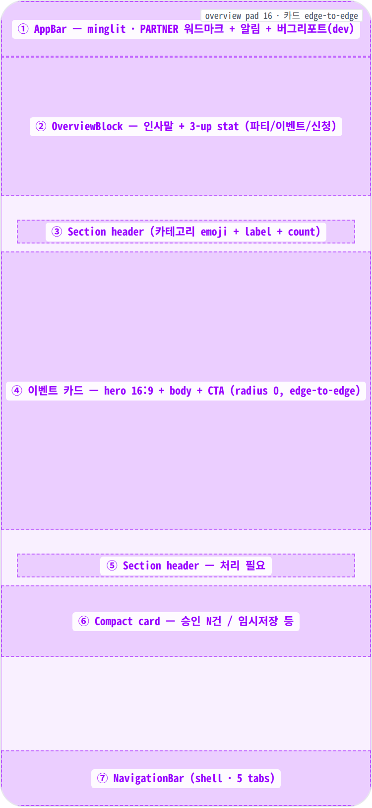
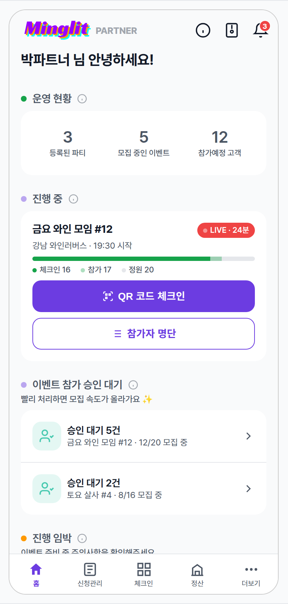
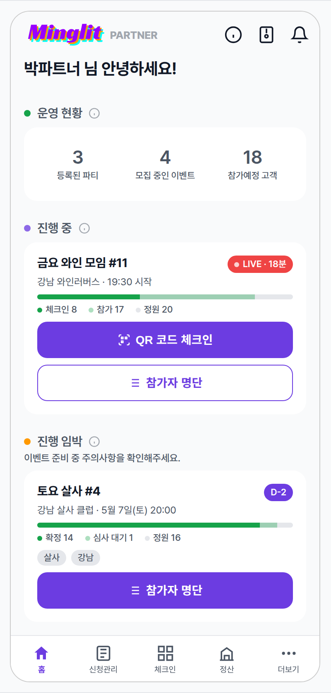
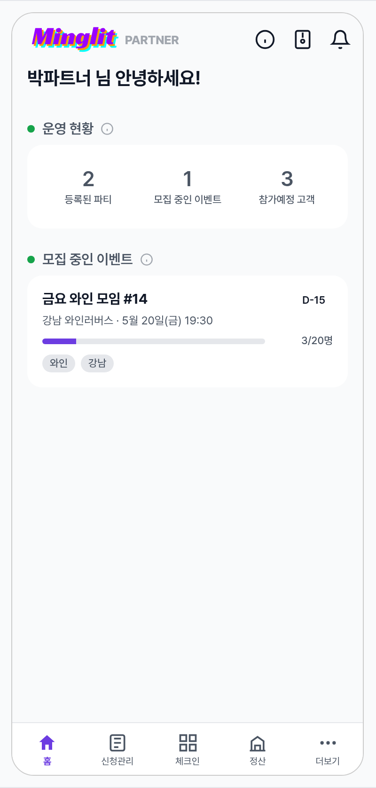
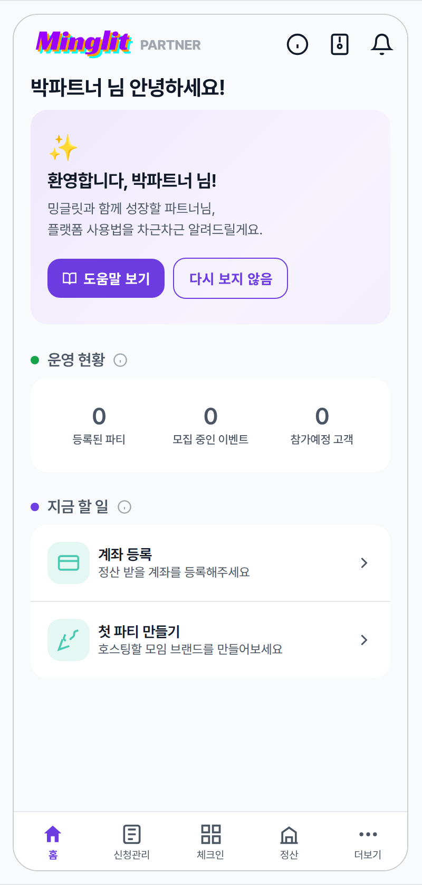
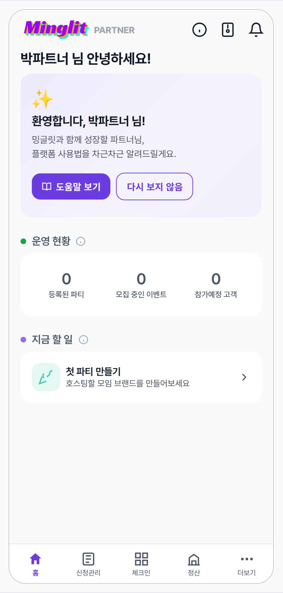
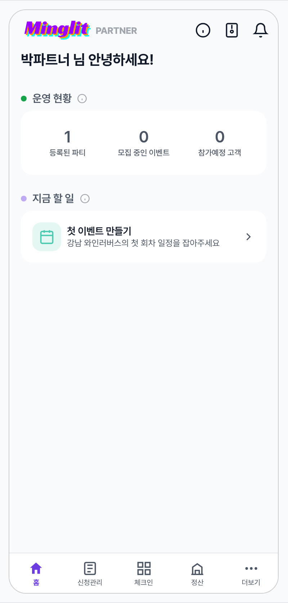
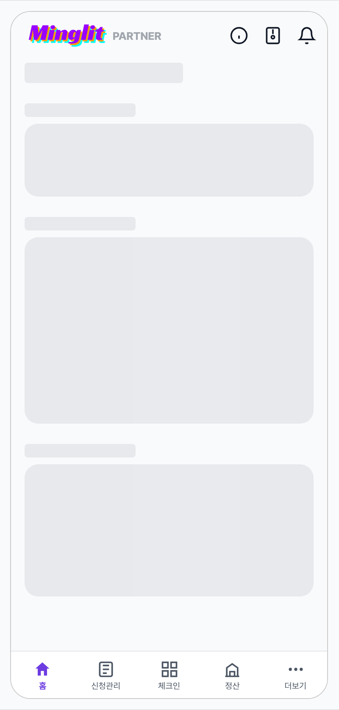
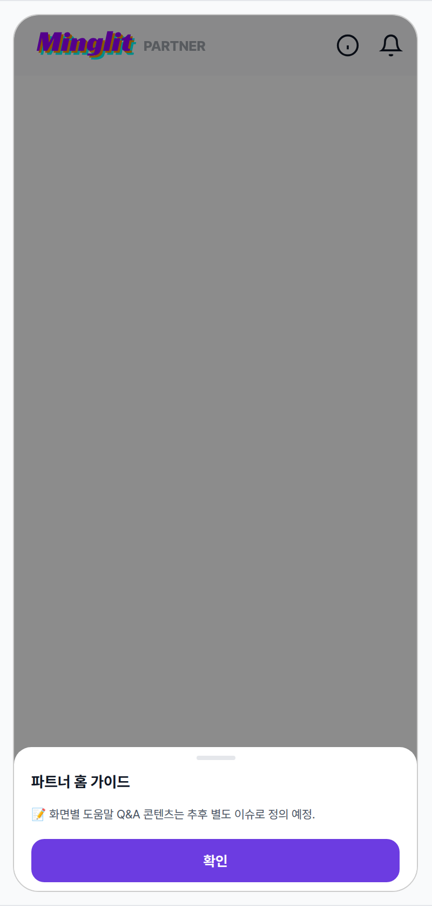

 Spec — PartnerHomePage (app\_partner · HomeRoute)  

# Partner Home

## Overview

| Status | 🚧 리디자인 중 (v2 초안) — 5 state · dynamic feed |
|---|---|
| App | app_partner |
| Category | dashboard · entry hub · 알림 센터형 피드 |
| Route / Surface | HomeRoute · widget: PartnerHomePage (StatefulShell home branch) |
| Path | / |
| Hierarchy | Parent: — (top-level partner shell screen — bottom-nav home tab)Children: HomeOverviewBlock / HomeFeedSection / HomeEventCard / HomeApprovalCard / HomeDraftCard / OnboardingStepGuide (internal widgets — no separate spec) |
| Purpose | 파트너가 앱에 진입했을 때 "지금 신경 써야 할 일"이 무엇인지 한눈에 보여준다. 상단의 변하지 않는 오버뷰(파티/이벤트/신청 카운트)와 하단의 시급도 카테고리 피드(진행 중 → 처리 필요 → 모집 중 → 종료 직후 → 작성 중)로 이루어진 동적 알림 센터형 화면. 이전 카드 남발 패턴을 폐기하고, 이벤트 lifecycle 어디에 있든 같은 피드 구조로 노출. |
| User journey | Entry points: 앱 cold start (로그인 후 → 홈 redirect) / 다른 탭에서 홈 탭 재선택 / 푸시 알림 → 홈.Exit points: 알림 센터(우측 상단), 오버뷰 stat 탭(파티 리스트 / 이벤트 리스트 / 신청관리), 피드 카드 액션(체크인 / 신청 검토 / 홍보 / 다음 회차 만들기 / 임시저장 이어 작성), 하단 NavigationBar(신청관리/체크인/정산/더보기). |
| Background | 이전 v1은 이벤트 단계별로 EventActionCard 한 장을 크게 보여주는 구조였다 — 운영 중인 이벤트가 여러 개여도 가장 임박한 1개만 노출되어 다른 lifecycle 작업이 묻혔다. v2는 알림 센터 mental model로 전환 — 시급도 카테고리별 섹션 헤더 + 그 안에 카드들이 쌓이고, 빈 카테고리는 헤더 자체를 hide해서 "오늘 신경 쓸 것"만 보이게 한다. 액션 완료(승인 처리 · 체크인 · 다음 회차 생성 · 임시저장 게시)로 DB 상태가 바뀌면 다음 진입 시 자동으로 해당 카드가 사라진다 — dismiss UI 별도 없음. |
| Frequency | 로그인 세션마다 진입. 운영 중인 이벤트가 있을 땐 하루 수회. 진행 중 이벤트(LIVE) 동안엔 새로고침 빈번. |

## History

이 spec의 주요 변경 이력. 최신 항목 위.

| Date | Version | Author | Changes |
|---|---|---|---|
| 2026-05-05 | 2.0 | mark-yun | Dynamic feed 리디자인 — 알림 센터 mental model로 전체 재구성. 제거: LocationGuideBanner(장소 가이드), TodoSummaryChips(승인대기/다가오는/준비중), EventActionCard(phase별 큰 카드 1장), WeeklyStatsRow(이번 주 매출/신청/체크인율). 추가: HomeOverviewBlock(인사 + 3개 stat tap target — 파티/이벤트/이번 주 신청), HomeFeedSection × 6 카테고리(진행 중 / 오늘 / 처리 필요 / 모집 중 / 종료 직후 / 작성 중), 카테고리별 카드 (event hero · approval compact · draft compact). AppBar 로고: minglit 단독 → minglit · PARTNER 서픽스 추가 (파트너 컨텍스트 명시). Empty 카테고리는 섹션 헤더 자체 숨김. dismiss UI 없음 — DB 상태 변화로 자연 소멸. |
| 2026-05-01 | 1.0 | mark-yun | v1.4 template으로 작성. 5 state(Default · LIVE · Ended · Onboarding pre-party · Loading) → mini-table per state, baseline = Default(recruiting), additive diff. 파트너 brand color(#6c3ce1) viewport-scoped override. |

[🧱 Layout](#layout) [🎨 States](#states) [🔄 Global Behavior](#behavior) [📖 Reference](#reference)

🧱

## Layout

화면 구조 — 영역, 정렬, 간격 규칙. 색·타이포 무시.

## Blueprint & tree

AppBar(로고 좌측) + 스크롤 body + 하단 NavigationBar. body는 **오버뷰 블록**(상단 고정 컨텐츠) + **피드**(시급도 카테고리 섹션)로 구성. 이벤트가 한 번도 없으면 피드 자리에 온보딩 가이드가 들어간다.

**Scaffold** ├─ **AppBar** │ ├─ 좌측에 minglit · PARTNER 워드마크 │ └─ 우측 actions: \[ │ IconButton(info\_outline) → showMinglitHelpSheet(...), │ BugReportAction() (개발 빌드 한정), │ Stack(IconButton(notifications\_outlined) + 미읽음 배지), │ \] ├─ **body**: 데이터 단계별 분기 │ ├─ 로딩 → 중앙 스피너 │ ├─ 에러 → 일반 안내 │ └─ 결과 → 아래로 당겨 새로고침 가능한 스크롤 body │ ├─ **OverviewBlock** (상단 고정 컨텐츠 · padding 16) ← ② │ │ ├─ 인사말 (이름 + 오늘 할 일 N건) │ │ └─ 3-up stat row (등록된 파티 N · 모집 중인 이벤트 N · 참가예정 고객 N) │ │ — 각 stat 탭 시 해당 리스트 화면으로 이동 │ │ │ └─ **피드**: 데이터 분기 │ ├─ 이벤트가 한 번도 없을 때 → **OnboardingStepGuide** │ │ (환영 + 진행도 + 단계 카드 + CTA) │ │ │ └─ 그 외 → **Sectioned feed** (시급도 순서) │ ├─ 🔴 진행 중 (LIVE) ← 카드: hero + 체크인 진행 + CTA │ ├─ 🟠 오늘 (D-0) ← 카드: hero + 시간 + 점검 CTA │ ├─ ⚡ 처리 필요 (승인 대기) ← 컴팩트 카드 × 이벤트 수 │ ├─ 📣 모집 중 (D-1~7) ← 카드: hero + 정원 진행 + 홍보/수정 CTA │ ├─ 🌙 종료 직후 (24h 이내) ← 카드: hero + 결과 stats + 다음 회차 CTA │ └─ ✏️ 작성 중 (임시저장) ← 컴팩트 카드 × 이벤트 수 │ ※ 빈 카테고리는 섹션 헤더 자체를 hide │ └─ **NavigationBar** (하단 5탭 · 홈 활성) ← ⑦ 홈 · 신청관리 · 체크인 · \[정산\] · 더보기

## Spacing & alignment rules

| # | Region | Alignment | Spacing |
|---|---|---|---|
| ① | AppBar | height 56 · 워드마크 좌측 · 3 actions 우측 (info + bug report + 알림) | 워드마크: minglit(18px) + 4px gap + PARTNER(11px uppercase) · bg = surface (no border) |
| — | SingleChildScrollView body | column stretch · scroll vertical · pull-to-refresh | 전체 padding 0 · 카드는 edge-to-edge · 오버뷰 블록만 내부 padding 16 |
| ② | OverviewBlock | column · 인사 위, stat row 아래 | 블록 inner padding: spacing-medium (16) · 인사↔stat row: spacing-medium (16) · stat 간: spacing-small (8) · 블록 하단 1px divider |
| ③/⑤ | Feed section header | row · emoji + label 좌측, count 우측 | 좌우 padding: spacing-medium (16) · header 위 마진: spacing-large (24) · header 아래 마진: spacing-small (8) |
| ④ | 이벤트 카드 (hero) | edge-to-edge · 16:9 hero + body padding 16 | 카드 radius 0 · hero aspect 16:9 · body inner pad: spacing-medium (16) · 카드 간: spacing-small (8) |
| ⑥ | 컴팩트 카드 (no hero) | row · 40px 아이콘 + flex 텍스트 + chev | 카드 inner pad: spacing-medium (16) · row gap: spacing-small (8) · 카드 radius 0 · edge-to-edge |
| ⑦ | NavigationBar | shell이 관리 — 5 destinations | height 56 · indicatorColor transparent · backgroundColor = colorScheme.surface (= white) |

## AppBar sub-anatomy

파트너 홈 AppBar — 좌측 워드마크 + 우측 actions(info + bug report(dev only) + 알림). info icon은 화면별 컨텍스트 도움말 sheet 트리거 (파트너 앱 일관 패턴).

| Region | Alignment | Notes |
|---|---|---|
| ① Brand (leading) | 좌측 정렬 | minglit 로고 + "PARTNER" suffix · 탭 동작 없음 · 홈 식별자 역할. |
| ② Info action (1st trailing) | 우측 · 40×40 hit-region | info_outline 22×22 · 탭 시 도움말 bottom sheet 진입 (State 8). 파트너 앱 모든 화면에 동일 패턴 적용. |
| ③ Bug report (2nd trailing · dev only) | 우측 · 40×40 hit-region | 개발 빌드 한정 — BugReportAction 컴포넌트. |
| ④ Notification (3rd trailing) | 우측 · 40×40 hit-region | notifications_outlined 22×22 · 미읽음 배지(뱃지) 오버레이 가능. |
| — | AppBar bg | --color-surface · surfaceTint transparent · border-bottom 없음. |

## Help bottom sheet sub-anatomy _(MinglitHelpSheet 컴포넌트 후보)_

info 아이콘 탭 시 노출되는 컨텍스트 도움말 sheet. 파트너 앱 모든 주요 화면에서 같은 chrome 재사용 — 화면별 sections 콘텐츠만 다름.

| Region | Alignment | Notes |
|---|---|---|
| ① Scrim (barrier) | full-screen overlay | rgba(0,0,0,0.45) · 하단 정렬 컨테이너 · 탭 시 sheet dismiss. |
| ② Sheet container | bottom-anchored · max-height 75% | bg --color-background · 상단 모서리 radius-card 16. |
| ③ Handle bar | 중앙 정렬 | 36×4 · radius 2 · --color-divider · drag-down dismiss affordance. |
| ④ Header | 좌측 정렬 | "파트너 홈 가이드" · 16/700 primary · padding small/medium. |
| ⑤ Body (scrollable) | flex 1 · 세로 스크롤 | sections list · 화면별 콘텐츠는 호출 측 정의. |
| ⑥ Confirm CTA | bottom · sticky | "확인" · filled partner-primary · height 48 · 15/700 white. |

🎨

## States

시각 변형 5종. baseline = Default(다양한 카테고리 mix), 나머지는 additive diff.

이벤트가 한 번도 없으면 온보딩, 그 외엔 시급도 카테고리(진행 중 / 오늘 / 처리 필요 / 모집 중 / 종료 직후 / 작성 중) 중 데이터가 있는 섹션만 노출. 섹션 내부 카드는 카테고리에 따라 hero 카드 또는 컴팩트 카드로 분기. 색상은 _partner brand `#6c3ce1`_이며 사용자 앱(`#9900ff`)과 다르다.

### Default · 운영 중 🎯 baseline · 처리 필요/모집 중/종료 직후/작성 중 mix

| 항목 | 내용 |
|---|---|
| 조건 | 이벤트를 1개 이상 만든 적 있고, 처리할 신청·모집 중·종료 직후·임시저장 중 일부 카테고리에 데이터가 있는 일반적 진입. 진행 중(LIVE) 이벤트는 없음. |
| 사용자 액션 | ① 알림 아이콘 탭 → 알림 센터 화면. 미읽음 99 초과 시 "99+".② 오버뷰 stat 탭 — "등록된 파티" → 파티 리스트 / "모집 중인 이벤트" → 이벤트 리스트 / "참가예정 고객" → 신청관리.③ 처리 필요 카드 탭 → 해당 이벤트의 신청 검토 화면.④ 모집 중 카드의 "공유 / 홍보하기" → 공유 시트. 카드 영역 탭 → 이벤트 상세.⑤ 종료 직후 카드의 "다음 회차 만들기" → 이벤트 생성 화면. 카드 영역 탭 → 이벤트 상세 (정산/리뷰 진입).⑥ 작성 중 카드 탭 → 이벤트 생성 화면 (임시저장 이어서 작성).⑦ 아래로 당기기 → 피드 데이터 새로고침. |
| 에지케이스 | · 모든 카테고리가 비어있으면 "오늘은 한가하네요!" empty 안내가 피드 끝에 노출.· 같은 이벤트가 모집 중 + 처리 필요 둘 다 해당하면 처리 필요 쪽에만 노출 (시급도 우선) — 모집 중 섹션에서는 제외.· 알림 미읽음 99 초과 → "99+" 표시.· 파트너 정보가 아직 로딩 중이면 인사 자리에 "파트너" placeholder.· 종료 직후 카드는 종료 후 24시간이 지나면 자동으로 사라짐.· 임시저장 카드는 작성을 마치고 게시(published)되면 자동으로 사라지고, 모집 중 또는 처리 필요 섹션으로 자연 이동. |
| 컴포넌트 | · AppBar (좌측 정렬 · minglit · PARTNER 워드마크 · 버그 리포트 액션[개발 한정] · 알림 아이콘 + 미읽음 배지)· OverviewBlock (인사 + 3-up stat row · 각 stat 탭 가능)· 처리 필요 섹션 — 컴팩트 카드 × 이벤트 수 (40px warning 아이콘 + 승인 N건 + 이벤트 요약)· 모집 중 섹션 — hero 카드 (16:9 + partner overlay + D-day chip + 태그 + 정원 진행 바 + 공유 outlined CTA)· 종료 직후 섹션 — hero 카드 (회색 톤 + ended chip + 3-셀 mini stats + 다음 회차 filled CTA)· 작성 중 섹션 — 컴팩트 카드 × 임시저장 수 (회색 펜 아이콘 + 제목 + 마지막 수정일)· 하단 NavigationBar (partner primary 인디케이터) |
| 토큰 | · color: color-partner-primary (#6c3ce1 — D-day soon · 모집 중 카드 액센트), color-warning (처리 필요 아이콘 · 오늘 chip), color-success (모집 중 진행 바 success 변형 · LIVE 카드 CTA), color-error (LIVE chip · 알림 배지), color-surface (scaffold), color-background (카드), color-divider (작성 중 아이콘 · 진행 바 트랙)· radius: radius-button (12 · D-day chip · partner overlay · 태그 · 컴팩트 아이콘 박스), radius-input (12 · CTA · stat box) — 카드 자체는 radius 0 (edge-to-edge)· spacing: spacing-medium (16 · 오버뷰 inner pad · 카드 body pad · section header h-pad), spacing-large (24 · 섹션 사이), spacing-small (8 · stat 간 · 카드 간 · 헤더↔카드)· typography: titleSmall (18/800 — 인사), bodySmall (13 — 인사 sub), titleSmall (15/800 — 카드 title), labelSmall (11/700 — D-day chip · stat label · partner overlay), headlineSmall (22/900 — stat number · 카드 stat number) |
| 노트 | 📝 가장 일반적 상태 (운영 중인 파트너 · LIVE 없음). 다른 4개 state는 baseline에서 변경분만 표시. 카드는 모두 edge-to-edge (radius 0) — 알림 센터 mental model 강화. |

### LIVE · 진행 중 이벤트 이벤트 시작 ~ 종료 사이 — 진행 중 섹션이 피드 최상단

| 항목 | 내용 |
|---|---|
| 조건 | 가장 임박한 이벤트가 진행 중인 단계 (시작 시각 지나고 종료 시각 전). 다른 이벤트들은 모집/진행 임박/작성 등 일반 단계. |
| 사용자 액션 | ① "QR 코드 체크인" (primary) → QR 스캐너 화면. 빠른 체크인 흐름.② "참가자 명단" (outlined) → 명단 화면 (수동 체크인 / 워크인 / 노쇼 / 전화 등 운영 액션).③ 진행 중 카드 영역 탭 → 이벤트 상세.④ 다른 섹션 동작은 baseline과 동일 (진행 임박 카드 명단 CTA 등). |
| 에지케이스 | · 진행 중에는 새 신청이 차단되므로 이벤트 참가 승인 대기 섹션이 비어있는 게 정상 (그래서 mockup에 없음).· 같은 시간대에 LIVE 이벤트가 2개 이상이면 진행 중 섹션에 모두 노출.· LIVE 카드는 종료 시각 도달 시 24h 동안 같은 슬롯에서 종료 안내로 변환 후 자연 소멸.· 진행 단계별 데이터 변화는 별도 섹션 "진행 중 카드 · 진행 단계별 변형" 참고. |
| 컴포넌트 | + 🟣✨ 진행 중 섹션 (보라 블링크 도트 + ⓘ 도움말).+ LIVE 카드 (detail style · 빨간 LIVE chip 펄스 + 3-layer 진행 바[체크인 solid + 참가 faded + 정원 트랙] + dual CTA: QR 코드 체크인 primary + 참가자 명단 outlined).− baseline의 이벤트 참가 승인 대기 섹션은 진행 중 동안 비어있음 (신청 차단).+ 진행 임박 섹션은 그대로 (다음 이벤트가 D-7 이내라면). |
| 토큰 | + color-error (LIVE chip 배경 + 펄스 도트), color-primary (진행 중 섹션 도트 블링크 + QR CTA), color-success (진행 바 체크인 solid + 참가 fade)· LIVE chip 펄스 (1.4s ease-in-out, opacity 1↔0.3). |
| 노트 | 📝 LIVE는 운영 현황 바로 다음 (피드 최상단). dual CTA로 QR 빠른 진입 + 명단 manual ops 두 진입점 분리. 체크인 진행 단계별 시각은 "진행 중 카드 · 진행 단계별 변형" 7단계 참고. |

### 한가한 날 · 처리할 일 거의 없음 모집 중 1개만, 다른 카테고리 모두 비어있음

| 항목 | 내용 |
|---|---|
| 조건 | 운영 중인 파트너이지만 처리할 일이 거의 없는 상태 — D-15 멀리 있는 모집 중 이벤트 1개만 있고 신청 처리 / LIVE / 진행 임박 / 작성 중 모두 0건. |
| 사용자 액션 | ① 운영 현황 stat 탭 → 해당 리스트.② 모집 중 카드 탭 → 이벤트 상세 (홍보 등).③ 비어있는 카테고리 섹션은 헤더 자체가 안 그려져 액션 대상 없음.④ 피드 하단의 ☕ empty 안내는 정보용 (탭 액션 없음). |
| 에지케이스 | · 모든 카테고리가 완전히 비어있어도 (모집 중 0개) 운영 현황 + empty 안내가 항상 노출.· empty는 모든 섹션 헤더보다 아래에 위치.· 정원이 D-7 이내로 가까워지면 진행 임박 섹션이 자동으로 추가됨. |
| 컴포넌트 | ↔ baseline에서 진행 중 / 이벤트 참가 승인 대기 / 진행 임박 / 작성 중인 파티 섹션이 모두 hide.+ 피드 하단 empty 안내 (☕ 이모지 + 1줄 타이틀 "오늘은 한가하네요" + 2줄 sub) — center, padding 24.↔ 운영 현황 stat 숫자가 모두 작음 (2 / 1 / 3). |
| 토큰 | · empty 안내: text-secondary 색 · 카드 없이 surface 위에 직접 노출.· 나머지 토큰 baseline과 동일. |
| 노트 | 📝 "할 일 0건" 강조보다 "한가하다"를 차분히 알리는 톤. 강한 액션 권유 (CTA 풀폭 등) 지양 — 사용자가 스스로 다음 행동 선택할 수 있게. |

### Onboarding · 계좌 등록 필요 !hasBankAccount — 정산 계좌 미등록

| 항목 | 내용 |
|---|---|
| 조건 | 파트너 가입 승인 직후 첫 진입 또는 계좌 등록을 미루고 있는 상태. !hasBankAccount. 계좌 등록은 정산의 prerequisite (게시 등 기타 액션은 가능). 계좌 + 파티가 동시에 미충족이라 두 todo가 함께 노출. |
| 사용자 액션 | ① "도움말 보기" CTA (welcome 카드) → 플랫폼 사용법 가이드 시트 (좌르륵 설명 — 파티 vs 이벤트, 신청·승인·체크인·정산 흐름 등 첫 사용자가 알아야 할 핵심을 감성 톤으로).② "다시 보지 않음" (welcome 카드 secondary 버튼) → 확인 dialog "도움말은 마이페이지에서 보실 수 있어요" → 확인 시 welcome 카드 영구 dismiss.③ "계좌 등록" todo 탭 → 계좌 등록 화면.④ "첫 파티 만들기" todo 탭 → 파티 생성 위저드 (계좌 미등록이어도 파티 작성 가능 — 게시 시점에 계좌 필요).⑤ 운영 현황 stat 탭 → 빈 리스트 화면.⑥ ⓘ 도움말 (각 섹션) → 해당 섹션별 도움말 시트.⑦ 알림 / 하단 nav는 일반 동작 (도움말은 더보기 → 마이페이지에서도 진입 가능). |
| 에지케이스 | · welcome 카드는 명시적으로 dismiss(다시 보지 않음)할 때까지 노출. "도움말 보기" 탭만으로는 dismiss되지 않음 — 사용자가 계속 보고 싶을 수 있음.· 다시 보지 않음 dialog: 타이틀 "도움말을 띄우지 않습니다" + 본문 "도움말은 마이페이지에서 계속 보실 수 있어요." + 확인/취소 CTA. 확인 → welcome 카드 영구 dismiss · 취소 → 카드 유지.· 마이페이지에서 도움말 항상 접근 가능 (더보기 → 마이페이지 → 도움말 메뉴).· 계좌 인증 실패 → 재입력 화면. todo 카드 라벨 동일 유지.· 계좌 등록 미룸 일정 기간 (예: 7일) → 푸시 / 이메일 리마인더.· 계좌 등록 완료 → 자동으로 State 5 (첫 파티 만들기 필요)로 전환. |
| 컴포넌트 | · Greeting "박파트너 님 안녕하세요!"· Welcome 카드 (가입 직후 hero — primary tinted gradient bg + ✨ emoji + 환영 타이틀 + 감성 sub + "도움말 보기" filled CTA)· 운영 현황 섹션 (0/0/0)· "지금 할 일" 섹션 (보라 블링크 도트 + ⓘ) — 계좌 등록 todo 카드 (40px mint 아이콘 박스)− 진행 중 / 진행 임박 / 모집 중인 이벤트 / 작성 중인 파티 모두 미노출 |
| 토큰 | · todo 아이콘 박스: tertiary mint (생성 액션 시그널)· 섹션 도트: primary blink (action 시각 신호)· radius / spacing baseline과 동일. |
| 노트 | 📝 v1의 1/2/3/4 progress bar 제거 — 단계 압박감 감소. 현재 시점에 필요한 todo 1개만 노출. 모든 prerequisite 통과 시 자동으로 일반 dashboard로 promote. |

### Onboarding · 첫 파티 만들기 필요 publishedParty 0 · draftParty 0 (계좌 등록과 독립)

| 항목 | 내용 |
|---|---|
| 조건 | publishedPartyCount === 0 && draftPartyCount === 0 — 호스팅할 모임 브랜드(파티)를 한 번도 만든 적 없는 상태. 계좌 등록 여부와 독립 — 계좌 미등록이라도 파티는 만들 수 있고, 두 todo가 "지금 할 일" 섹션에 동시에 나올 수 있음. |
| 사용자 액션 | ① "첫 파티 만들기" todo 탭 → 파티 생성 위저드 (이름 / 카테고리 / 지역 / 이미지 / 설명).② 운영 현황 stat 탭 → 빈 리스트 화면.③ ⓘ 도움말 → 파티/이벤트 개념 안내 시트.④ 계좌도 미등록이면 같은 섹션에 계좌 등록 todo도 함께 노출. |
| 에지케이스 | · 파티 위저드 도중 "임시저장" 시 → State 5 (이 화면) 유지하되 todo 카드가 "작성 중인 파티" 카드로 교체 (제목 = 작성한 파티명, sub = "임시저장 · YYYY-MM-DD 마지막 수정", 아이콘 = 펜).· 파티 게시 완료 시 자동으로 State 6 (첫 이벤트 만들기 필요)로 전환.· 다중 작성 중 파티 (드물지만 가능) → 카드 여러 개 row로 나열. |
| 컴포넌트 | · 운영 현황 (0/0/0)· "지금 할 일" 섹션 + 첫 파티 만들기 todo 카드 (mint 아이콘 박스 + 폭죽 아이콘)· 작성 중 파티 있을 시 → todo 카드 자리에 작성 중 카드 sub-state (회색 펜 아이콘 박스) |
| 토큰 | · todo 아이콘 박스: tertiary mint (계속 동일 — 생성 액션 시그널)· 작성 중 sub-state 아이콘 박스: divider 회색· 나머지 baseline과 동일. |
| 노트 | 📝 파티는 모임의 브랜드 — 한 번 잘 만들면 이벤트 반복 가능. ⓘ 도움말에서 파티 vs 이벤트 차이 강조. |

### Onboarding · 첫 이벤트 만들기 필요 publishedParty >= 1 · publishedEvent 0 · draftEvent 0 (계좌 등록과 독립)

| 항목 | 내용 |
|---|---|
| 조건 | 파티 1+ (게시 완료) + publishedEventCount === 0 && draftEventCount === 0 — 파티는 만들었지만 첫 회차(이벤트)를 아직 안 만든 상태. 운영 현황 "등록된 파티" = 1. 계좌 등록과 독립 — 계좌 미등록이어도 이벤트 작성 가능 (게시 시점에 계좌 필요할 수 있음). |
| 사용자 액션 | ① "첫 이벤트 만들기" todo 탭 → 이벤트 생성 위저드 (날짜 / 시간 / 정원 / 가격 / 장소 등). 파티가 1개면 자동 선택 — 2개 이상이면 파티 선택 시트 먼저.② 운영 현황 "등록된 파티" 1 탭 → 파티 리스트 (자기 파티 1개).③ ⓘ 도움말 → 첫 이벤트 만들기 가이드 시트 (날짜 / 정원 정하는 팁). |
| 에지케이스 | · 이벤트 위저드 도중 "임시저장" 시 → todo 카드가 "작성 중인 이벤트" 카드로 교체 (sub = "임시저장 · 마지막 수정일", 아이콘 = 펜).· 이벤트 게시 완료 시 자동으로 일반 dashboard (State 1 또는 한가한 날 State 3)로 전환.· 다중 파티 보유 시: todo 카드 sub에 "어떤 파티의 이벤트인지" 명시 또는 위저드 진입 시 파티 선택 시트.· 파티가 임시저장 (작성 중)이고 게시 안 됐다면 State 5(첫 파티)로 다시 분기. |
| 컴포넌트 | · 운영 현황 (1/0/0) — 파티만 1개· "지금 할 일" 섹션 + 첫 이벤트 만들기 todo 카드 (mint 아이콘 박스 + 달력 아이콘)· 작성 중 이벤트 있을 시 → todo 카드 자리에 작성 중 카드 sub-state |
| 토큰 | · todo 아이콘: tertiary mint + 달력 아이콘· 나머지 baseline과 동일. |
| 노트 | 📝 파티는 만들었지만 첫 이벤트 없으면 사용자에게 노출되지 않음 — 첫 이벤트 게시가 모집 시작 트리거. ⓘ 도움말에서 "이벤트 = 회차" 개념 + 날짜/정원 설정 팁 안내. |

### Loading state.status async · 진입 직후 dashboard fetch

| 항목 | 내용 |
|---|---|
| 조건 | 대시보드 데이터를 불러오는 중 (첫 진입 또는 새로고침 직후). |
| 사용자 액션 | · AppBar / 하단 NavigationBar는 그대로 동작 — 다른 탭으로 이동 가능.· body 영역은 스피너만 노출되어 그 외 동작 없음. |
| 에지케이스 | · 데이터 로딩 실패 시 일반 에러 화면으로 폴백 (이 spec에서 별도 mockup 생략).· 매우 빠른 응답이면 스피너가 한 프레임도 안 보일 수 있음. |
| 컴포넌트 | ↔ body 전체 → MinglitSkeleton 플레이스홀더 (실제 레이아웃과 동일한 영역 점유 — 인사 placeholder + 섹션 타이틀 placeholder + 카드 placeholder × 3).− 실제 OverviewBlock / 피드 섹션 / 카드 콘텐츠.· AppBar / NavigationBar는 유지. |
| 토큰 | · skeleton: color-divider 배경 + shimmer 애니메이션 (1.5s ease-in-out · opacity 0.6↔0.95)· 실제 데이터 도착 시 cut transition (no fade) — content 즉시 교체. |
| 노트 | 📝 spinner 대신 skeleton 사용 — layout shift 방지 + 사용자 인지 부담 감소. AppBar + 하단 NavigationBar는 유지 (다른 탭으로 즉시 이동 가능). |

### Help · 도움말 bottom sheet 🆘 info 아이콘 탭 시 노출 — 파트너 앱 일관 패턴

| 항목 | 내용 |
|---|---|
| 조건 | AppBar의 info 아이콘 탭 → 화면 위 bottom sheet 슬라이드 업. 파트너 앱 전체 일관 패턴. |
| 사용자 액션 | ① "확인" 버튼 탭 — sheet dismiss (primary).② handle 드래그 / scrim 탭 — dismiss (보조).③ sheet 내부 스크롤 — max-height 초과 시. |
| 컴포넌트 | · MinglitHelpSheet — props: title: String · sections: List<HelpSection>.· 화면별 도움말 내용은 호출 측에서 정의 — sheet chrome만 책임.· 진입: showModalBottomSheet(isScrollControlled · barrierColor · shape rounded top). |
| 토큰 | · scrim: rgba(0,0,0,0.45) · sheet bg --color-background · 상단 모서리 radius-card· handle 36×4 · --color-divider · header 16/700 primary· CTA "확인" — height 48 · partner-primary filled · 15/700 white · margin medium· max-height 75vh |
| 노트 | 📝 화면별 sections 콘텐츠(도움말 Q&A)는 추후 별도 이슈로 디자인 결정 예정. 파트너 앱 모든 화면이 동일 info 아이콘 → bottom sheet 패턴을 따른다. |

## 카드 노출 순서 (Order priority)

홈 피드는 시급도 + 운영 단계에 따라 섹션 순서가 고정됨. 데이터가 없는 섹션은 헤더 자체를 hide. Onboarding 단계(prerequisite 미충족)는 별도 순서를 따른다.

### ① 운영 dashboard 순서 (모든 prerequisite 충족 시)

| # | 섹션 | 카드 type | 도트 | 노출 조건 |
|---|---|---|---|---|
| 1 | 운영 현황 | Stat 3-up (등록된 파티 / 모집 중인 이벤트 / 참가예정 고객) | 🟢 success | 항상 노출 (0 카운트도 노출) |
| 2 | 진행 중 | 이벤트 detail 카드 (LIVE chip + dual CTA QR/명단) 또는 사전 체크인 대기 카드 | 🟣 primary blink | 이벤트 당일(D-0) 또는 LIVE 진행 중인 이벤트 1+ |
| 3 | 이벤트 참가 승인 대기 | Compact 카드 × 이벤트 수 (mint 아이콘 + 승인 N건) | 🟣 primary blink | 신청 검토 대기 1+ (sub: "빨리 처리하면 모집 속도가 올라가요 ✨") |
| 4 | 진행 임박 | 이벤트 detail 카드 (D-day chip + capacity bar 3-layer + 명단 CTA) | 🟠 secondary | T-7 이내 이벤트 (승인 대기는 별도 섹션, 여기엔 처리 완료된 이벤트만) |
| 5 | 모집 중인 이벤트 | 이벤트 detail 카드 (D-day chip + capacity bar + tags · CTA 없음 link) | 🟢 success | T-8+ 이상 모집 중 이벤트 |
| 6 | 종료 직후 | Compact 카드 (회색 체크 아이콘 + 결과 stats sub) | ⚫ gray | 24h 이내 종료 이벤트 (자동 소멸) |
| 7 | 지금 할 일 | Compact 카드 (작성 중인 파티 drafts only — 이벤트 draft 미포함) | 🟣 primary blink | 파티 임시저장 1+ · 이벤트 draft는 별도 흐름 |

### ② Onboarding 순서 (prerequisite 미충족)

| # | 섹션 | 카드 type | 도트 | 노출 조건 |
|---|---|---|---|---|
| 1 | Welcome (hero) | Welcome 카드 (✨ + 환영 + "도움말 보기" CTA + "다시 보지 않음") | — | 가입 직후 + 미dismiss · "다시 보지 않음" → dialog 후 영구 dismiss |
| 2 | 운영 현황 | Stat 3-up (모두 0 또는 일부) | 🟢 success | 항상 노출 |
| 3 | 지금 할 일 | Todo 카드 × 미충족 prerequisite (compact mint 아이콘) | 🟣 primary blink | · !hasBankAccount → 💳 계좌 등록 todo· publishedParty 0 && draftParty 0 → 🎉 첫 파티 만들기 todo· publishedEvent 0 && draftEvent 0 && publishedParty >= 1 → 📅 첫 이벤트 만들기 todo· drafts 있으면 todo 자리에 작성 중 카드로 sub-state 교체 |

**중복 노출 회피**: 같은 이벤트가 여러 섹션 조건에 해당하면 시급도 높은 한 섹션에만 노출 (예: D-3 + 승인 대기 → 이벤트 참가 승인 대기 섹션에만, 진행 임박에서 제외).  
**섹션 hide**: 카드가 0개인 섹션은 헤더 자체 미노출.  
**card 자연 소멸**: 액션 완료 시 DB 상태 변화로 다음 fetch에서 사라짐 (dismiss UI 없음).

## 카드별 명세 — ① 운영 현황 카드 (Stat 3-up)

대시보드 최상단 stat 카드. 3개 숫자(파티 / 이벤트 / 고객)와 각각 탭 가능한 영역.

| Mockup | 명세 |
|---|---|
| 운영 현황3등록된 파티5모집 중인 이벤트12참가예정 고객 | Anatomy:· 섹션 타이틀 (success 도트 + ⓘ)· 3-up stat row (각 cell flex 1 · 가운데 정렬)· stat: 숫자(22/600 secondary) + 라벨(11/500 secondary)Stat 정의:· 등록된 파티 = 게시 완료된 파티 수 (drafts 미포함)· 모집 중인 이벤트 = 활성화된 이벤트 수 (모집/임박/진행 — 종료/draft 미포함)· 참가예정 고객 = 활성화된 이벤트의 누적 결제 완료 참가자Variants:· 일반: 의미 있는 값 (예: 3 / 5 / 12)· Onboarding 초기: 0 / 0 / 0· 파티만 있는 단계: 1 / 0 / 0Tap 액션: 각 stat 탭 시 → 파티 리스트 / 이벤트 리스트 / 신청관리 탭 |

## 카드별 명세 — ② 진행 중 카드 · 단계별 변형

"진행 중" 섹션의 카드는 이벤트 당일(D-0) 새벽부터 종료까지 같은 슬롯에서 단계별로 모습이 바뀐다. **체크인은 이벤트 시작 2시간 전부터 활성** — 그 전엔 QR CTA 비활성, 명단만 접근 가능. LIVE 진입 후엔 chip이 빨간색 펄스로 변경되고 진행 바가 체크인/참가/정원 3-layer로 시각화됨.

| 단계 | 카드 mockup | 비고 |
|---|---|---|
| ⓪ 이벤트 당일 · 체크인 대기D-0 새벽 ~ T-2 · 진행 중 섹션 | 진행 중금요 와인 모임 #11오늘 19:30강남 와인러버스 · 체크인 17:30부터체크인은 17:30부터 가능해요QR 코드 체크인 참가자 명단 | 오늘 진행 예정이지만 아직 체크인 시작 전.· D-day chip: warning yellow "오늘 19:30"· QR CTA 비활성 (회색 + not-allowed cursor)· 명단 CTA outlined로 활성· 체크인 시작 시간 inline note (warning 톤)· 시간이 가까워지면 "체크인 N분 후" 카운트다운으로 변경 가능 |
| ① 체크인 시작 가능T-2 ~ T+0 · 진행 중 섹션 | 진행 중금요 와인 모임 #11체크인 가능강남 와인러버스 · 19:30 시작 (1시간 32분 후)체크인 0 참가 17 정원 20QR 코드 체크인 참가자 명단 | 체크인 윈도우 열림.· D-day chip: primary "체크인 가능" (보라)· 진행 바 노출 시작 — 페이드(참가) 영역만 visible· QR CTA 활성 (primary 보라)· 첫 참가자가 도착하기 시작하는 단계 |
| ② LIVE 진행 중T+0 ~ 종료 · 진행 중 섹션 (가장 흔한 상태) | 진행 중금요 와인 모임 #11LIVE · 18분강남 와인러버스 · 19:30 시작체크인 8 참가 17 정원 20QR 코드 체크인 참가자 명단 | 이벤트 시작 후 체크인 진행 중.· D-day chip: error red "LIVE · N분" + 펄스 도트· 진행 바 3-layer (체크인 solid + 참가 fade + 정원 트랙) 모두 visible· 듀얼 CTA: QR primary + 명단 outlined· 시간 경과는 chip의 분(min)으로 실시간 표시 |
| ③ 체크인 완료참가자 모두 도착 · 진행 중 섹션 | 진행 중금요 와인 모임 #11LIVE · 32분강남 와인러버스 · 19:30 시작체크인 17 참가 17 정원 20체크인 완료! 모든 참가자 도착했어요 ✓QR 코드 체크인 참가자 명단 | 모든 참가자 체크인 완료 (체크인 = 참가). 정원이 미달인 채로 출석 100%인 케이스.· 진행 바: solid가 페이드 영역을 완전히 덮음 → 페이드 사라짐· "체크인 완료!" success note 추가 (success 톤 — 초록)· QR CTA는 disabled 상태로 유지 (회색) — 노출은 하되 더 받을 사람 없음을 시각화· 명단 CTA는 outlined로 활성 (워크인 / 노트 / 사진 업로드 등) |
| ④ 정원 만석 + 출석 100%이상적 케이스 · 진행 중 섹션 | 진행 중금요 와인 모임 #11LIVE · 40분강남 와인러버스 · 19:30 시작체크인 20 참가 20 정원 20정원 만석! 체크인 완료 ✨QR 코드 체크인 참가자 명단 | 정원 = 참가 = 체크인 동일. 트랙(미판매석) 사라짐.· 진행 바 100% 채워짐· "정원 만석! 체크인 완료 ✨" success note (가장 축하 톤)· QR CTA disabled (회색)· 명단 CTA outlined· 운영 마무리 / 후기 정리 단계로 자연 진입 |
| ⑤ 이벤트 종료종료 시각 ~ 24h 이내 · 종료 직후 섹션 | 종료 직후금요 와인 모임 #11 · 종료17명 참석 · ₩340K · 출석률 100% | 종료된 이벤트는 detail 카드 → compact 한 줄로 축약.· 회색 체크 아이콘 + "이벤트명 · 종료" 타이틀· sub: 결과 요약 (참석 / 매출 / 출석률)· 카드 탭 → 이벤트 상세 (다음 회차 만들기 / 후기 / 사진 / 명단 등 모든 액션)· QR / 진행 바 / dual CTA 모두 제거 — chip 형태로 가벼움 유지· 종료 후 24시간 동안 홈에 남고, 그 후 자동 소멸 (정산 탭에서 계속 추적) |

## 카드별 명세 — ③ 이벤트 참가 승인 대기 카드 (Compact mint)

신청 검토를 기다리는 이벤트 단위 compact 카드. 1 이벤트 = 1 카드, 검토 대기 건수 합산.

| Mockup | 명세 |
|---|---|
| 이벤트 참가 승인 대기빨리 처리하면 모집 속도가 올라가요 ✨승인 대기 5건금요 와인 모임 #12 · 12/20 모집 중 | Anatomy:· 40px mint(tertiary) 아이콘 박스 + 사람·체크 아이콘· title (14/600): "승인 대기 N건"· sub (12 secondary): "이벤트명 · 확정/정원 모집 상태"· 우측 chev (18px secondary)Variants:· 1건만: "승인 대기 1건"· 다건 (다른 이벤트 동시): 카드 여러 개 row 나열· 처리 완료되면 자동 소멸Tap 액션: 카드 → 해당 이벤트의 신청 검토 화면섹션 sub-text: "빨리 처리하면 모집 속도가 올라가요 ✨" — 12px secondary, 끝에 sparkle emoji |

## 카드별 명세 — ④ 진행 임박 카드 (Detail + capacity bar)

T-7 이내 이벤트. capacity bar (확정/심사대기/정원 3-layer) + 명단 CTA 강조.

| Mockup | 명세 |
|---|---|
| 진행 임박이벤트 준비 중 주의사항을 확인해주세요.일요 브런치 #2D-3강남 와인러버스 · 5월 8일(일) 11:00확정 14 심사 대기 1 정원 20브런치강남참가자 명단 | Anatomy:· header: title(15/700) + D-day chip(soon = primary purple)· meta (12 secondary): "파티명 · 날짜 시간"· capacity bar (3-layer): 확정 solid primary + 심사대기 0.35 fade + 정원 트랙· legend (3 dots + 라벨): 확정 / 심사 대기 / 정원· tags (회색 칩): 카테고리 / 지역· primary CTA "참가자 명단"D-day chip 색: D-1~7 = primary purple (soon)Variants:· D-3 일반 케이스 (mockup)· 정원 만석: capacity bar 100% + chip 라벨 "마감"· D-1: chip "D-1" 같은 색 + meta 강조· 심사 대기 0: 페이드 영역 0% (해당 이벤트는 다 처리됨)Tap 액션: 카드 영역 → 이벤트 상세 / "참가자 명단" CTA → 명단 화면 |

## 카드별 명세 — ⑤ 모집 중인 이벤트 카드 (Detail + capacity, link)

T-8+ 이상 모집 중 이벤트. CTA 없는 link card — 카드 자체 탭으로 detail 진입.

| Mockup | 명세 |
|---|---|
| 모집 중인 이벤트금요 와인 모임 #12D-15강남 와인러버스 · 5월 20일(금) 19:30확정 12 심사 대기 5 정원 20와인강남 | Anatomy: 진행 임박 카드와 거의 동일하지만 CTA 없음.· header / meta / capacity bar / tags 동일 구조· D-day chip 색: D-8+ = later (회색 라벨)· 카드 자체 탭으로 detail 진입 (link card 패턴)왜 CTA 없나?: 모집 단계는 액션 시급도 낮음. 홍보/공유는 detail 화면에서 가능.Variants:· D-15 일반 케이스 (mockup)· 정원 미달 deep (확정 적음): 페이드 영역 거의 없고 솔리드만 작음· 정원 거의 만석: capacity bar 90%+Auto-promote: D-7 이내가 되면 자동으로 진행 임박 섹션으로 이동 |

## 카드별 명세 — ⑥ 종료 직후 카드 (Compact 회색)

종료된 이벤트 — 24h 동안 홈에 남는 chip-form compact 카드. 자세한 결과는 탭하여 detail에서.

| Mockup | 명세 |
|---|---|
| 종료 직후금요 와인 모임 #11 · 종료17명 참석 · ₩340K · 출석률 100% | Anatomy:· 40px 회색 아이콘 박스 (체크 아이콘)· title: "이벤트명 · 종료"· sub: "N명 참석 · ₩매출 · 출석률 N%"· 우측 chev섹션 도트: 회색 (text-secondary opacity 0.4) — 종료된 이벤트의 차분한 톤Variants:· 출석률 100% (이상적): mockup 예시· 출석률 낮음 (예: 60%): sub에 그대로 노출· 매출 0 (무료 이벤트): "₩0" 또는 "참석 N명"만Tap 액션: 카드 → 이벤트 상세 (다음 회차 만들기 / 후기 / 사진 / 명단 모두 거기서)자연 소멸: 종료 후 24시간 지나면 홈에서 자동 사라짐 (정산 탭에서는 계속 추적) |

## 카드별 명세 — ⑦ 지금 할 일 — 작성 중인 파티 카드

작성 중인 **파티** 임시저장. compact 카드로 "이어서 작성하기" 진입점. 이벤트 draft는 별도로 처리 (이 섹션에 포함되지 않음).

| Mockup | 명세 |
|---|---|
| 지금 할 일주말 와인 클럽 · 이어서 작성하기임시저장 · 5월 3일 마지막 수정 | Anatomy:· 40px 회색 아이콘 박스 (펜 아이콘)· title: "파티명 · 이어서 작성하기"· sub: "임시저장 · 마지막 수정일"· chevVariants:· 단일 작성 중 파티 (mockup 예시)· 다중 작성 중 파티 (드물지만 가능): 카드 여러 row 나열 (마지막 수정일 늦은 순)Tap 액션: 카드 → 파티 작성 위저드 (저장된 시점에서 resume)자연 소멸: 파티 게시 완료 시 자동 사라짐 (게시 후 운영 현황 stat "등록된 파티" +1).이벤트 draft는?: 작성 중 이벤트는 별도 처리 — Onboarding 단계에선 Todo 카드 ⑨의 sub-state로 흡수, 운영 단계에선 이벤트 detail 섹션 안에 작성 중 변형으로 노출 (별도 spec). |

## 카드별 명세 — ⑧ Welcome 카드 (Onboarding hero)

가입 직후 + onboarding 단계에서만 hero 위치에 노출. 도움말 진입점 + 영구 dismiss option.

| Mockup | 명세 |
|---|---|
| ✨환영합니다, 박파트너 님!밍글릿과 함께 성장할 파트너님,플랫폼 사용법을 차근차근 알려드릴게요.도움말 보기 다시 보지 않음 | Anatomy:· primary tinted gradient bg + radius 16 (3-stop gradient)· ✨ emoji (24px)· title (17/700): "환영합니다, 박파트너 님!"· sub (13 secondary, line-height 1.55): 감성 톤· primary filled CTA "도움말 보기" + 책 아이콘· primary outlined CTA "다시 보지 않음" (1px primary border + primary text)Motion (Toss-style sequential):· 모든 섹션 fade-up 동일 패턴 — opacity 0→1 + translateY 10→0 · 0.45s · cubic-bezier(0.32, 0.72, 0, 1) · 150ms 간격 stagger· ① Card entrance (0 → 0.5s) — opacity + translateY 12 + scale 0.97· ② Emoji (0.4 → 0.85s) — fade-up· ③ Title (0.55 → 1.0s) — fade-up· ④ Sub (0.7 → 1.15s) — fade-up· ⑤ Actions (0.85 → 1.3s) — fade-up· Gradient shimmer (entrance 후 무한 반복) — 6s ease-in-out · background-position 0%↔100%· Emoji heartbeat (1.5s 후 무한 반복) — 1.6s ease-out · 두근! 두근! (scale 1→1.1→1→1.08→1 + 긴 pause)· 약 1.3초 안에 모든 요소 자리잡음 — 깔끔하고 정돈된 등장Tap 액션:· "도움말 보기" → 플랫폼 사용법 가이드 시트 (좌르륵 설명)· "다시 보지 않음" → 확인 다이얼로그 노출 (아래 명세)"다시 보지 않음" 확인 다이얼로그:· 타이틀: "도움말을 띄우지 않습니다"· 본문: "도움말은 마이페이지에서 계속 보실 수 있어요."· CTA: 확인 (primary) / 취소 (text)· 확인 → welcome 카드 영구 dismiss · 취소 → 카드 그대로 유지노출 조건: Onboarding 단계 (계좌 / 첫 파티 / 첫 이벤트 미충족) + 미dismiss접근성: 한 번 dismiss해도 더보기 → 마이페이지 → 도움말 메뉴에서 항상 접근 가능 |

## 카드별 명세 — ⑨ Todo 카드 (계좌/파티/이벤트)

Onboarding "지금 할 일" 섹션의 미완료 prerequisite todo. compact mint 아이콘 + 단일 액션.

| Mockup | 명세 |
|---|---|
| 지금 할 일계좌 등록정산 받을 계좌를 등록해주세요첫 파티 만들기호스팅할 모임 브랜드를 만들어보세요첫 이벤트 만들기강남 와인러버스의 첫 회차 일정을 잡아주세요 | Anatomy (3 variants — 각 row):· 40px mint(tertiary) 아이콘 박스· title (14/600): action 라벨· sub (12 secondary): 안내 문구· chevIcon variants:· 💳 계좌 (지갑 아이콘)· 🎉 첫 파티 (폭죽 아이콘)· 📅 첫 이벤트 (달력 아이콘)노출 조건 (독립적 — 미충족 항목만 각각 노출):· !hasBankAccount → 계좌 등록 row· publishedParty 0 && draftParty 0 → 첫 파티 만들기 row· publishedEvent 0 && draftEvent 0 && publishedParty >= 1 → 첫 이벤트 만들기 rowDrafts 변형: 작성 중 파티/이벤트 있으면 todo 자리에 작성 중 카드 (회색 펜 아이콘)로 sub-state 교체 → 카드별 명세 ⑦ 참고완료 시 자동 소멸: prerequisite 충족 시 row 사라짐. 모두 충족 시 "지금 할 일" 섹션 자체 hide. |

🔄

## Global Behavior

cross-cutting — 모든 state에 적용되는 액션, motion, 글로벌 에지케이스. 각 state 한정 액션은 위 mini-table 참고.

## Cross-cutting interactions

| 사용자 액션 | 화면에 보이는 결과 |
|---|---|
| 아래로 당기기 (pull-to-refresh) | 피드 데이터를 다시 불러옴. 갱신이 끝나면 자동으로 화면에 반영. 로딩 화면에선 새로고침 동작 자체가 비활성. |
| 알림 아이콘 탭 | 알림 센터 화면이 셸 밖으로 push되어 진입 (하단 nav 사라짐). 미읽음 카운트는 99 초과 시 "99+"로 캡. |
| 버그 리포트 액션 (개발 빌드 한정 · 알림 좌측) | 운영 빌드에서는 노출되지 않음. 디자인 1:1 비교 시 운영 빌드 기준으로 무시. |
| 오버뷰 stat 탭 | "등록된 파티" → 파티 리스트 / "모집 중인 이벤트" → 이벤트 리스트 (모집/임박/진행 모두 포함) / "참가예정 고객" → 신청관리 탭. 셸 push. |
| 피드 카드 액션 완료 (승인 · 체크인 · 다음 회차 생성 · 임시저장 게시) | 해당 액션이 DB 상태를 바꾸면 다음 진입 시 카드가 자연 소멸. 즉시 dismiss UI는 없음 — pull-to-refresh 또는 화면 재진입으로 갱신. |
| 하단 탭 전환 | 홈 스택은 유지된 채 다른 탭으로 전환. 정산 탭은 권한이 있을 때만 노출되며, 권한이 없으면 탭 자체가 보이지 않음. |
| 다크 모드 토글 | scaffold/카드 배경이 다크 톤으로 자동 전환. partner primary는 다크 변형(#9b7bec)으로 매핑. |

## Feed ordering & grouping rules

| Rule | Detail |
|---|---|
| 섹션 정렬 (시급도) | 🔴 진행 중 → 🟠 오늘 (D-0) → ⚡ 처리 필요 → 📣 모집 중 → 🌙 종료 직후 → ✏️ 작성 중. 고정 순서. 데이터가 없는 카테고리는 헤더 자체 hide. |
| 중복 노출 회피 | 같은 이벤트가 여러 카테고리에 해당하면 시급도가 높은 한 곳만 노출. (예: 모집 중 이벤트에 승인 대기가 있으면 → 처리 필요만 노출, 모집 중 섹션에서는 제외.) |
| 섹션 내부 정렬 | 이벤트 시작 시각 빠른 순. 진행 중 / 오늘 / 모집 중에 적용. 종료 직후는 종료 시각 늦은 순(가장 최근). 작성 중은 마지막 수정일 늦은 순. |
| 처리 필요 그룹핑 | 이벤트 단위로 합쳐서 1카드 = 1이벤트의 승인 대기 N건. 신청 1건당 카드를 만들지 않음. |
| 카드 자연 소멸 | 액션이 DB 상태를 바꾸면 다음 fetch에서 사라짐. 종료 직후는 24h, 작성 중은 게시되면, 처리 필요는 모든 신청 처리되면 자동 소멸. |

## Motion timing

Source: `shared/packages/mds/core/lib/src/theme/minglit_design_tokens.dart` · `MinglitAnimation`.

| Transition | Token / Duration | Notes |
|---|---|---|
| 탭 전환 (홈 ↔ 신청관리/체크인/정산/더보기) | MinglitAnimation.medium (350ms) | FadeThroughTransition. 떠나는 화면은 입력이 차단됨. |
| Loading → 데이터 표시 | cut (no animation) | 부드러운 페이드 없이 즉각 교체. |
| Pull-to-refresh | OS 기본 (iOS/Android) | Material 기본 — primary 색 스피너. |
| LIVE chip 펄스 | 1.4s ease-in-out infinite | opacity 1 ↔ 0.3. 진행 중 chip 도트만 적용. |
| 온보딩 → 일반 피드 (첫 이벤트 생성 후 복귀) | MinglitAnimation.medium (350ms) | 다음 진입 시 데이터를 새로 불러와 화면이 자연스럽게 교체. 자동 폴링은 없음 — 진입이 트리거. |

## Global edge cases

-   **파트너 정보 로딩 중** — 인사 자리에 "파트너" placeholder가 잠깐 노출됨. 다른 컴포넌트는 영향 없음.
-   **활성 파티 수** — 0개이면 온보딩의 "첫 파티" CTA · 1개이면 이벤트 생성으로 바로 진입 · 2개 이상이면 파티 선택 시트 노출 후 선택.
-   **오버뷰 "모집 중인 이벤트" 카운트** — 활성화된 이벤트 수 (모집 중·진행 임박·진행 중 모두 포함 · 종료/draft 미포함).
-   **오버뷰 "참가예정 고객" 카운트** — 활성화된 이벤트(모집/임박/진행 중)의 누적 결제 완료 참가자 수.
-   **완전 빈 피드** — 모든 카테고리가 비어있으면 ☕ empty 안내 노출 ("오늘은 한가하네요!"). 별도 state로 다루지는 않음 — Default의 변형으로 취급.
-   **정산 권한 미보유** — 하단 nav에서 정산 탭이 노출되지 않음. URL 직접 진입 시 라우팅에서 처리.

📖

## Reference

implementation source + 인접 화면. Components / Tokens는 위 mini-table 참고.

## Implementation source

⚠️ **v2 리디자인 — 아직 Flutter 미구현.** 아래 source는 v1 기준이며, v2 적용 시 별도 구현 PR이 필요.

| Widget | PartnerHomePage — apps/app_partner/lib/src/features/home/partner_home_page.dart |
|---|---|
| Route | HomeRoute · / · app_routes.dart (HomeBranch · StatefulShell) |
| Shell | PartnerScaffold — bottom NavigationBar 5 tab (Home · 신청관리 · 체크인 · [정산] · 더보기). PageTransitionSwitcher + FadeThroughTransition. |
| Controller / providers | v1: partnerDashboardControllerProvider · currentPartnerInfoProvider · notificationListProvider · hasSettlementAccessProvider · partnerHomeCoordinatorProviderv2 신규 후보: homeFeedControllerProvider (시급도 카테고리별 fetch + 그룹핑) · homeOverviewProvider (파티/이벤트/신청 카운트) |
| Internal widgets (v2 후보) | HomeOverviewBlock · HomeFeedSection + HomeFeedSectionHeader · HomeEventCard (hero · D-day chip · partner overlay · 진행 바 · CTA) · HomeApprovalCard (compact · 이벤트별 그룹) · HomeDraftCard (compact · 임시저장) · HomeFeedEmpty · OnboardingStepGuide (kept from v1) |
| Removed (v1 → v2) | LocationGuideBanner (장소 가이드 — 홈에서 빠짐) · TodoSummaryChips (오버뷰 stat이 대체) · EventActionCard + phase 변형 (피드 카드 시스템이 대체) · WeeklyStatsRow (오버뷰 "이번 주 신청"이 대체) |
| Phase logic | 이벤트 단계는 시작 시각까지 남은 시간으로 결정 — 모집 중(시작 3시간 이상 전), 준비 중(3시간 이내), 진행 중, 종료 후 24시간 이내. v2 피드 섹션 매핑: 진행 중 → 🔴 진행 중 / 준비 중 → 🟠 오늘 / 모집 중 → 📣 모집 중 / 종료 후 24h → 🌙 종료 직후. |
| Theme | partner 전용 테마 — primary #6c3ce1. 사용자 앱(#9900ff)과 다름. |
| ⚠️ 알려진 drift | 이벤트 단계 전환은 시간 기반이지만 화면이 자동 재계산하지 않음 — 새로 진입하거나 새로고침이 필요. 시작 3시간 경계 같은 시점은 사용자가 인지하지 못할 수 있음. 향후 개선 후보. |

## 진입 가능한 서브 페이지 (Subpages map)

홈에서 도달할 수 있는 모든 화면 / 라우트. status: ✅ spec 있음 · 🚧 작성 중 · 📝 TBD (미작성).

| 진입점 | 도착 화면 | Status | 비고 |
|---|---|---|---|
| AppBar 알림 아이콘 | 알림 센터 | 📝 TBD | shell push · 미읽음 99+ 캡 처리 |
| AppBar 버그 리포트 (dev) | 버그 리포트 화면 | 📝 TBD | 개발 빌드 한정 · 운영 빌드 미노출 |
| 운영 현황 — "등록된 파티" | PartyListPage | ✅ | 파티 리스트 |
| 운영 현황 — "모집 중인 이벤트" | 이벤트 리스트 | 📝 TBD | 모집/임박/진행 중 활성 이벤트 모두 |
| 운영 현황 — "참가예정 고객" | 신청관리 탭 | 📝 TBD | 하단 nav 신청관리와 동일 surface |
| Welcome 카드 "도움말 보기" | PartnerGuide | 🚧 | 도움말 메인 — 6 토픽 리스트 + 바텀시트 |
| 섹션 ⓘ 버튼 (운영 현황 / 진행 중 / 승인 대기 / 진행 임박 / 모집 중) | PartnerGuide 토픽 시트 직접 진입 | 🚧 | guide 메인 거치지 않고 해당 토픽 modal sheet push |
| 진행 중 카드 — "QR 코드 체크인" CTA | QR 스캐너 화면 | 📝 TBD | 체크인 탭의 sub-screen 또는 별도 |
| 진행 중 / 진행 임박 카드 — "참가자 명단" CTA | OngoingEventListPage (참가자 명단 화면) | 📝 TBD | QR 모드 토글 / 워크인 / 노쇼 / 전화 액션 모두 여기서 |
| 진행 중 / 모집 중 / 진행 임박 카드 영역 탭 | EventDetailPage | 📝 TBD | 이벤트 상세 (수정 / 공유 / 명단 / 결과 등) |
| 이벤트 참가 승인 대기 카드 | EventApplicationListPage | ✅ | 해당 이벤트의 신청 검토 리스트 |
| 종료 직후 카드 | EventDetailPage (결과 모드) | 📝 TBD | 다음 회차 만들기 / 후기 / 사진 / 명단 모두 detail에서 |
| Todo "계좌 등록" | 계좌 등록 화면 | 📝 TBD | 은행 / 계좌번호 / 인증 흐름 |
| Todo "첫 파티 만들기" | PartyCreateWizardPage | ✅ | 파티 생성 위저드 |
| Todo "첫 이벤트 만들기" | 이벤트 생성 위저드 | 📝 TBD | 날짜 / 시간 / 정원 / 가격 / 장소 |
| 지금 할 일 — 작성 중 파티 카드 | PartyCreateWizardPage (resume) | ✅ | 저장 시점에서 이어서 작성 |
| 하단 nav — 신청관리 | 신청관리 탭 | 📝 TBD | 모든 이벤트의 신청 통합 리스트 |
| 하단 nav — 체크인 | 체크인 탭 (LIVE 운영 dashboard) | 📝 TBD | 진행 중 이벤트 있을 때 dashboard로 변신 — 별도 PR로 강화 예정 |
| 하단 nav — 정산 | SettlementDetailPage (탭 내 항목) | 📝 TBD | SETTLEMENT_VIEW 권한 보유 시만 노출 |
| 하단 nav — 더보기 → 마이페이지 → 도움말 | PartnerGuide | 🚧 | 홈 외 두 번째 진입점 |
| Pull-to-refresh | (현재 페이지 갱신) | — | 피드 데이터 fetch · 라우트 변경 없음 |

## Related screens

| Spec | Relation |
|---|---|
| PartnerLoginPage | 로그인 후 onboarding 미완료면 PartnerWelcome → PartnerApply → PartnerApplyStatus 거쳐 이 홈으로 진입. |
| PartyListPage | 오버뷰 "파티" stat 탭 시 도착지. 같은 시각 언어(event-feed hero 카드, D-day chip 시스템)를 공유. |
| PartyCreateWizardPage | Onboarding 상태에서 "첫 파티 만들기" CTA의 도착지. |
| EventApplicationListPage | 처리 필요 카드 탭 시 도착지 (해당 이벤트의 신청 검토 화면). |
| EventDetailPage | 모집 중 / 종료 직후 카드 영역 탭 시 도착지. |
| SettlementDetailPage | 하단 정산 탭 진입 후 항목 탭으로 진입하는 detail (SETTLEMENT_VIEW 권한 보유 시). |
| Layout foundations | Standard Scaffold + SingleChildScrollView + StatefulShell bottom nav. |