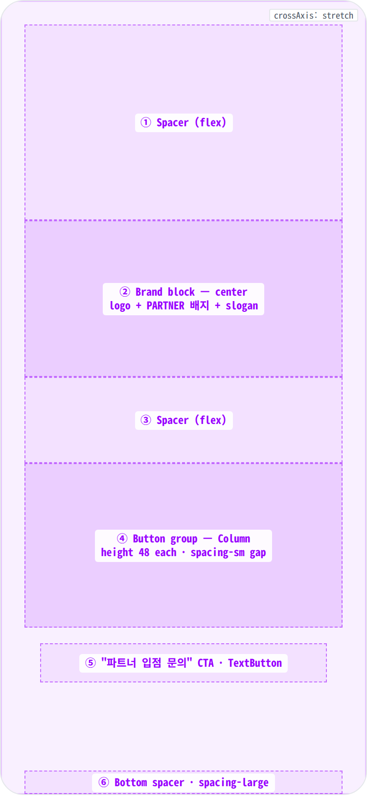
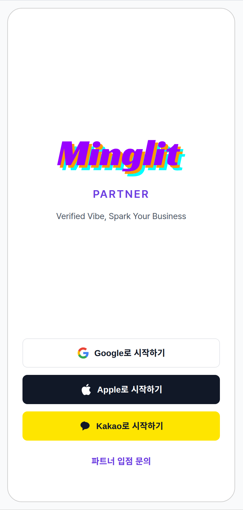
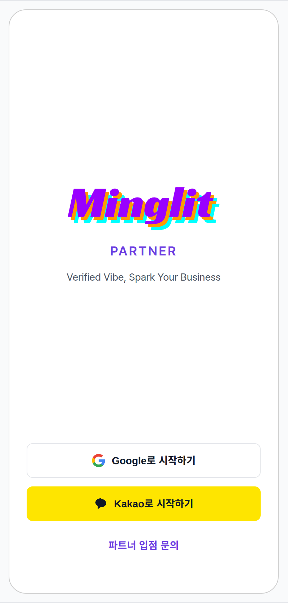
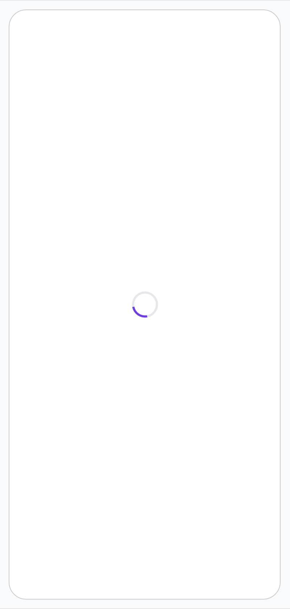
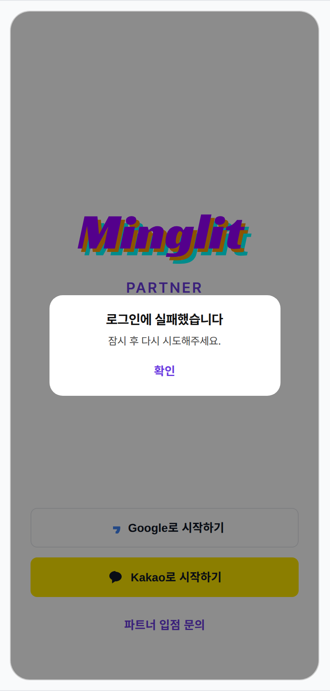

 Spec — PartnerLoginPage (app\_partner · LoginRoute)  

# Partner Login

## Overview

| Status | ✅ 디자인완료 — 4 states · 파트너 입점 / 운영자 진입 전용 entry |
|---|---|
| App | app_partner |
| Category | auth · entry · partner |
| Route / Surface | LoginRoute (app_partner · 사용자 앱 LoginRoute와 별개) · widget: PartnerLoginPage + MinglitLoginScreen(isPartner: true) |
| Path | /login |
| Hierarchy | Parent: — (top-level screen)Children: — · 5탭 시 DevUserSwitchScreen으로 전환 (dev only) |
| Purpose | 파트너 앱(app_partner)의 OAuth 진입점. 사용자 앱과 widget(MinglitLoginScreen)을 공유하지만 isPartner: true props로 PARTNER 배지 · "Spark Your Business" 슬로건 · 파트너 색(#6c3ce1) 적용. 입점 사장님 / 운영자가 로그인 후 자기 가게/이벤트 관리에 바로 진입. |
| User journey | Entry points: 파트너 앱 첫 실행 / 로그아웃 직후 / 보호 화면 직접 진입 (redirect).Exit points: 인증 성공 → PartnerHomeRoute (또는 redirect 원본). 5탭(dev) → DevUserSwitchScreen. |
| Background | User / Partner 두 앱이 같은 Supabase 계정 시스템을 공유하지만, 진입 시 어느 앱인지에 따라 후속 흐름이 달라짐 (사용자: HomePage / 파트너: PartnerHome). widget을 MinglitLoginScreen으로 공유해 OAuth 흐름을 단일 책임으로 유지하되, props로 분기. 색은 파트너 indigo(#6c3ce1)로 명시 분기 — 사용자 앱 보라(#9900ff)와 시각적으로 구분. |
| Frequency | 로그아웃 상태에선 매번. 인증된 파트너에겐 1회 / 세션 만료 시. |

## History

최신 항목 위.

| Date | Version | Author | Changes |
|---|---|---|---|
| 2026-05-01 | 1.0 | mark-yun | v1.4 template으로 작성. 파트너 indigo(#6c3ce1) 색 분기를 .viewport로 scope. MinglitLoginScreen(isPartner: true)의 partner 변형을 partner 앱 관점에서 단독 spec화 — login_page.html(공유 spec)의 partner state와는 다른 entry 시점. |

[🧱 Layout](#layout) [🎨 States](#states) [🔄 Global Behavior](#global-behavior) [📖 Reference](#reference)

🧱

## Layout

Scaffold(SafeArea + Padding(24) + Column) — login\_page.html 공유 widget(`MinglitLoginScreen`) 동일 구조. partner 변형: PARTNER 배지 + slogan 변경 + Terms 자리 → "파트너 입점 문의" CTA.

## Blueprint & tree

좌측은 영역 경계 wireframe (음영 = 콘텐츠), 우측은 위젯 위계. 좌우 `spacing-large (24px)` 패딩. 콘텐츠는 두 Spacer 사이 수직 중앙. PARTNER 배지가 logo와 slogan 사이에 추가됨.

**Scaffold** └─ **SafeArea** └─ **Padding**(horizontal: _spacing-large = 24px_) └─ **Column**(mainAxis: center, crossAxis: stretch) ├─ **Spacer**(flex: 1) ← ① │ ├─ _Brand block_ ← ② │ ├─ **Logo** (height: 64) — minglit\_logo SVG │ ├─ Gap: _spacing-medium = 16px_ │ ├─ **PARTNER 배지** — Text("PARTNER" · weight 600 · letter-spacing 2 · `color-partner-primary`) │ ├─ Gap: _spacing-medium = 16px_ │ └─ **Slogan** — Text("Verified Vibe, Spark Your Business") │ ├─ **Spacer**(flex: 1) ← ③ │ ├─ _Button group_ ← ④ │ ├─ **Google** (height 48 · radius-small) │ ├─ Gap: _spacing-sm = 12px_ │ ├─ **Apple** _(conditional — kIsWeb || iOS / macOS)_ │ ├─ Gap: _spacing-sm = 12px_ │ └─ **Kakao** (height 48 · brand-locked yellow) │ ├─ Gap: _spacing-medium = 16px_ │ ├─ _Partner CTA_ ← ⑤ │ └─ **TextButton**("파트너 입점 문의" · `color-partner-primary`) │ └─ Bottom spacer: _spacing-large = 24px_ ← ⑥

## Spacing & alignment rules

| # | Region | Alignment | Spacing |
|---|---|---|---|
| — | Outer page padding | — | horizontal: spacing-large (24px) |
| ① | Top spacer | flex | — |
| ② | Brand block | cross axis: center | logo↔배지: spacing-medium (16px) · 배지↔slogan: spacing-medium (16px) |
| ③ | Mid spacer | flex | — |
| ④ | Button group | cross axis: stretch · 풀폭 | 버튼 사이: spacing-sm (12px) |
| ⑤ | Partner CTA | cross axis: center | group↔CTA: spacing-medium (16px) |
| ⑥ | Bottom spacer | — | height: spacing-large (24px) |

🎨

## States

시각 변형 4종 — 실행 OS 분기와 인증 진행 상태에 따라 분기. 사용자 앱과 동일한 화면 구조를 공유하지만 파트너 인디고 색과 PARTNER 배지가 시각적 차별점.

**State 식별 기준**: 실행 중인 OS(iOS / Android / Web 등) · 인증 진행 여부 · 개발 환경 여부에 따라 4가지 변형으로 분기.

### Default · iOS / macOS / Web 🎯 baseline · 풀 OAuth 3종

| 항목 | 내용 |
|---|---|
| 조건 | iOS · macOS · Web에서 진입한 상태. 인증이 진행 중이 아니고 아직 로그인되지 않은 상태. |
| 사용자 액션 | ① Google 버튼 탭 — 화면이 로딩으로 바뀌고 외부 Google 로그인 페이지로 이동. 인증이 끝나면 파트너 홈으로 자동 이동.② Apple 버튼 탭 — 시스템이 제공하는 Apple 로그인 시트가 올라오고, 인증이 끝나면 자동으로 앱에 복귀.③ Kakao 버튼 탭 — KakaoTalk 앱이 설치돼 있으면 그쪽으로, 없으면 Kakao 로그인 페이지로 이동.④ "파트너 입점 문의" 탭 — 외부 브라우저에서 입점 문의 페이지가 열림. 로그인 화면은 그대로 유지.⑤ 로고를 2초 안에 5번 탭 (개발 환경 전용) — 테스트 계정 전환 화면으로 이동. |
| 에지케이스 | · 인증 실패 (서버/네트워크 문제) — 공통 에러 다이얼로그가 떴다가 닫히고 다시 기본 화면으로 복귀.· 외부 로그인 페이지를 사용자가 임의로 닫음 — 별도 에러 메시지 없이 기본 화면으로 복귀.· 이미 로그인된 파트너가 진입하면 화면이 보이지 않고 즉시 파트너 홈으로 이동.· 로고 5탭 트리거는 개발 환경에서만 동작. 운영 환경에서는 5번 탭해도 반응 없음. |
| 컴포넌트 | · MinglitLoginScreen(isPartner: true · kit-shared)· Logo (SVG · 64px h · light/dark auto-swap) — ⓐ· PARTNER 배지 (Text · 18px · weight 600 · letter-spacing 2 · color-partner-primary) — ⓑ· Slogan (Text · bodyMedium · color-text-secondary · "Verified Vibe, Spark Your Business") — ⓒ· OAuth 버튼 3종 (brand-locked — Google · Apple · Kakao · height 48 · radius-small) — ⓓ· "파트너 입점 문의" TextButton (color-partner-primary · 외부 링크) — ⓔ |
| 토큰 | · brand-scoped: color-partner-primary (#6c3ce1 · PARTNER 배지 · CTA · spinner)· color: color-background · color-text-primary · color-text-secondary · color-divider (Google border)· radius: radius-small (8 · OAuth 버튼)· spacing: spacing-large (24 · 좌우 padding · bottom safe), spacing-medium (16 · 로고↔배지↔slogan · group↔CTA), spacing-sm (12 · 버튼 사이), spacing-small (8 · 아이콘↔라벨)· typography: bodyMedium (slogan), titleMedium (PARTNER 배지 18/600), bodySmall (CTA)· brand-locked exception: Kakao #FEE500 |
| 노트 | 📝 사용자 앱과 같은 화면 구조를 공유하지만, 이 spec은 파트너 앱 관점에서 단독으로 정의된다. 파트너 인디고 색은 viewport 안에서만 적용되며, spec 문서 자체의 다른 영역은 사용자 보라색을 유지. |

### Default · Android Apple 버튼이 빠진 변형 · Android에서 진입한 상태

| 항목 | 내용 |
|---|---|
| 조건 | Android 환경에서 진입한 상태. 이 환경에서는 Apple 로그인 버튼이 노출되지 않음. |
| 사용자 액션 | 동일 (Apple 버튼은 화면에 노출되지 않으므로 해당 액션도 없음) |
| 에지케이스 | 동일 |
| 컴포넌트 | − Apple OAuth 버튼 (Apple 로그인은 Android에서 지원되지 않음). Apple 자리에는 빈 공간이 남지 않고 Kakao가 위로 올라옴. |
| 토큰 | 동일 |
| 노트 | 📝 한국 시장에서 Android 비중이 크기 때문에 실제 사용자 입장에서는 이 변형이 가장 자주 보일 수 있음. |

### Loading 로그인 처리가 진행 중인 상태

| 항목 | 내용 |
|---|---|
| 조건 | OAuth 버튼 중 하나를 탭한 직후부터 외부 로그인 페이지가 화면에 뜨기 직전까지의 짧은 구간 (보통 0.1~0.3초). 본체 화면 대신 화면 가운데 스피너만 보이는 풀스크린 로딩. |
| 사용자 액션 | — (모든 탭이 받아들여지지 않음. 화면 중앙의 스피너만 회전.) |
| 에지케이스 | · 외부 로그인 페이지가 늦게 뜨면 스피너만 오래 보임. 자동 시간 초과는 없으며 OS가 처리.· 사용자가 시스템 뒤로가기를 누르면 인증이 취소되고 공통 에러 다이얼로그가 떴다가 닫히면서 기본 화면으로 복귀. |
| 컴포넌트 | ↔ 본 화면 자리에 풀스크린 스피너 (MinglitCircularProgressIndicator)가 화면 중앙에 표시됨. 평소 노출되던 로고 / 배지 / 버튼은 모두 사라짐. |
| 토큰 | − OAuth 버튼 / 로고 / 배지의 토큰은 사용되지 않음. 스피너 색은 color-partner-primary. |
| 노트 | 📝 외부 로그인 페이지로 넘어가는 짧은 전환 구간을 채우기 위한 화면. 별도의 페이드 없이 즉시 교체됨. 사용자 앱과 같은 패턴이지만 스피너 색이 파트너 인디고. |

### Auth Error (transient) 인증 실패 — 잠깐 다이얼로그가 노출됐다가 닫히는 상태

| 항목 | 내용 |
|---|---|
| 조건 | 인증 처리 중 오류가 발생해 공통 에러 다이얼로그가 잠깐 노출되는 상태. 본체 화면(기본 상태)은 다이얼로그 뒤에 그대로 남아 있음. |
| 사용자 액션 | "확인" 버튼을 탭하면 다이얼로그가 닫히고 기본 상태로 복귀. 사용자가 다시 OAuth 버튼을 눌러 재시도할 수 있음. |
| 에지케이스 | · 짧은 시간에 여러 번 시도해도 다이얼로그가 중복으로 쌓이지 않고 하나만 표시됨.· 다이얼로그가 떠 있는 동안 다른 OAuth 버튼을 탭하면 다이얼로그가 닫히면서 새 흐름이 시작됨. |
| 컴포넌트 | + 공통 에러 다이얼로그 (MinglitAlert · kit-shared)· 본체 화면(기본 상태)은 다이얼로그 뒤에 그대로 보이며, 다이얼로그가 닫히면 다시 활성화됨. |
| 토큰 | + 다이얼로그 뒤 어두워지는 영역 (Material 기본), radius-card (16 · 다이얼로그 박스), "확인" 액션 색 color-partner-primary. |
| 노트 | 📝 짧게 떴다 사라지는 상태. 사용자가 "확인"을 누르면 즉시 사라지며, 같은 오류 메시지를 다시 보려면 OAuth 버튼을 다시 눌러 재시도해야 한다. |

🔄

## Global Behavior

cross-cutting — 모든 state에 적용. 사용자 앱과 동일 widget이지만 partner-specific 동작 강조.

## Cross-cutting interactions

| 사용자 액션 | 화면에 보이는 결과 |
|---|---|
| 로고 2초 안에 5번 탭 (개발 환경 전용) | 개발 환경에서만 테스트 계정 전환 화면으로 이동. 운영 환경에서는 반응하지 않음. |
| OS 뒤로가기 / 뒤로가기 스와이프 | 보호된 화면에서 자동으로 이동된 경우는 홈으로 이동. 앱 첫 진입이면 OS 기본 동작 (Android는 앱 종료, iOS는 무반응). |
| 다크 모드 토글 | OAuth 버튼 색상이 자동 교체됨 (Google은 흰 배경에서 어두운 배경으로, Apple은 검정에서 흰 배경으로). PARTNER 배지와 입점 문의 CTA의 색이 다크 모드용 파트너 인디고로 전환됨. Kakao는 노랑색 그대로 유지. |
| "파트너 입점 문의" 탭 | 외부 브라우저에서 입점 문의 페이지가 열림. 로그인 화면은 그대로 유지. |

## Motion & timing

Source: `shared/packages/mds/core/lib/src/theme/minglit_design_tokens.dart` → `MinglitAnimation`.

| Token | Value | Use case |
|---|---|---|
| MinglitAnimation.micro | 100ms | 버튼 탭 → Loading state 전환 (cut) |
| MinglitAnimation.fast | 200ms | OAuth 복귀 → 홈/원래 화면 · 다이얼로그 fade |

| Transition | Duration (token) | Curve / notes |
|---|---|---|
| 화면 진입 (앱 처음 시작) | — | OS 기본 화면 전환을 그대로 사용. 별도의 진입 애니메이션 없음. |
| OAuth 버튼 탭 → 로딩 화면 | micro (100ms) | 전체 화면이 스피너로 즉시 교체됨. 페이드 없이 컷 전환 — 사용자에게 즉각 피드백. |
| 로딩 → 외부 로그인 페이지 | OS 기본 | OS가 처리하는 외부 페이지 전환. |
| 외부 인증에서 복귀 → 파트너 홈 | fast (200ms) | 표준 라우트 전환 (slide / fade). |
| 인증 에러 다이얼로그 노출 / 닫힘 | fast (200ms) | 중앙에서 페이드 인/아웃 + 살짝 확대 (Material 기본). |

## Global edge cases

-   **이미 로그인된 파트너가 진입** — 화면이 보이지 않고 즉시 파트너 홈으로 이동.
-   **보호된 화면에서 자동으로 진입한 경우** — 로그인을 마치면 처음 가려던 화면으로 자동 복귀 (홈으로 가지 않음).
-   **개발 환경 식별** — local / development / dev 환경에서만 로고 5탭 트리거가 동작. 그 외 환경에서는 반응하지 않음.
-   **다크 모드** — 파트너 인디고가 다크 모드용 톤으로 자동 전환됨. PARTNER 배지와 입점 문의 CTA 색이 다크 톤으로 변경됨.
-   **접근성** — OAuth 버튼은 충분한 높이(48)와 명확한 라벨을 가져 보이스 오버에서 의미 전달이 잘 됨. PARTNER 배지는 시각 강조용 텍스트.

📖

## Reference

implementation source + 인접 화면.

## Implementation source

| Widget class | PartnerLoginPage · ConsumerWidget |
|---|---|
| File path | apps/app_partner/lib/src/features/auth/partner_login_page.dart |
| Shared widget | MinglitLoginScreen(isPartner: true · onGoogle/Apple/Kakao/DevTrigger props) — kit-shared |
| Auth controller | authControllerProvider (kit-shared) — signInWithGoogle · signInWithApple · signInWithKakao |
| Route | LoginRoute (app_partner) · path: /login · app_routes.dart |
| Brand color | MinglitPartnerColors.primary = #6c3ce1 · scoped via .viewport의 --color-primary override. MinglitColors.primary(#9900ff · 사용자 보라)는 사용 안 함. |
| Dev trigger gate | String.fromEnvironment('ENVIRONMENT', defaultValue: 'production') ∈ {local, development, dev} · Fix #1624: dev 추가 |
| Test override | isDevEnvOverride (@visibleForTesting) — compile-time 상수를 우회 |

## Related screens

| Spec | Relation |
|---|---|
| LoginPage (user) | 같은 widget(MinglitLoginScreen) 사용 — props로 분기. 본 spec과 partner state는 시각적으로 동일. |
| PartnerHomePage | 로그인 성공 후 도착하는 메인 화면. |
| PartnerApplyPage | "파트너 입점 문의"가 외부 링크로 보내는 별도 신청 흐름. (앱 내 신청 화면) |
| AuthCallbackPage | OAuth 복귀 처리. Note: app_user에 정의됨 — partner 앱은 자체 처리 흐름. |
| DevUserSwitchScreen | Logo 5탭 (dev 환경)으로 이동하는 테스트용 계정 전환 화면. |