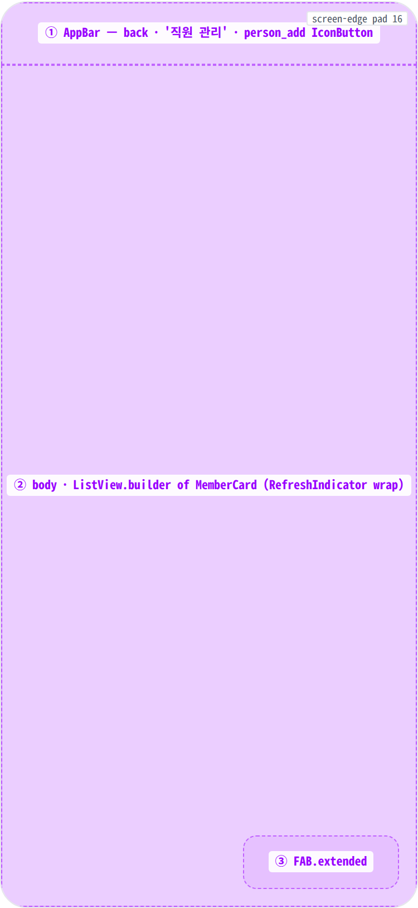
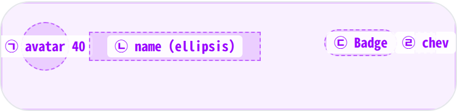
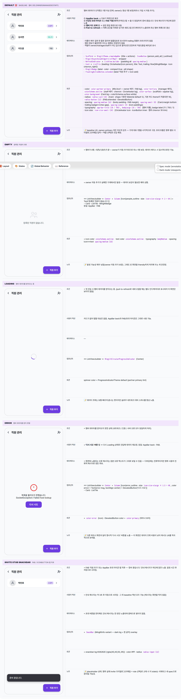

 Spec — PartnerMemberListPage (app\_partner · MemberListRoute)  

# Partner Member List

## Overview

| Status | ✅ 디자인완료 — 5 state · 파트너 직원 명단 + 역할 배지 |
|---|---|
| App | app_partner |
| Category | member · partner ops · staff roster |
| Route / Surface | MemberListRoute · widget: PartnerMemberListPage |
| Path | /more/partners/:partnerId/members |
| Hierarchy | Parent: MorePage (더보기 → "직원 관리")Children: PartnerMemberPermissionPage (멤버 카드 탭 시 push) |
| Purpose | 파트너 가게에 등록된 직원(owner/manager/staff)을 한 화면에 모아 누가 어떤 역할인지 한눈에 보여주고, 카드 탭으로 권한 편집 화면으로 보내는 명단 허브. 파트너 권한 위임 흐름의 진입점. |
| User journey | Entry points: 더보기 화면 → "직원 관리" 메뉴 탭.Exit points: AppBar back → 이전 화면 복귀 · 멤버 카드 탭 → 권한 편집 화면으로 이동 · FAB/AppBar 초대 아이콘 "직원 추가" 탭 → 현재는 '준비 중입니다.' 안내 메시지가 잠깐 노출됨 (초대 다이얼로그 미구현). |
| Background | 파트너 멤버는 owner(설립자) · manager(운영/심사) · staff(현장 단순업무) 3 단계로 권한이 분리되어 있고, 이 화면은 그 권한 편집의 첫 진입점이다. 카드별 trailing 배지 색은 시맨틱 컬러로 통일해 한눈에 권한 위계를 파악하게 했다 — owner=primary(파트너 보라), manager=tertiary, staff=outline(중립). 초대 흐름은 별도 다이얼로그 화면이 필요해 현재는 placeholder 안내 메시지로 막아둠. |
| Frequency | 활성 파트너 기준 월 0~수회. 신규 직원 합류/이탈 이벤트 발생 시점에만 진입. |

## History

이 spec의 주요 변경 이력. 최신 항목 위.

| Date | Version | Author | Changes |
|---|---|---|---|
| 2026-05-01 | 1.0 | mark-yun | v1.4 template으로 작성. 5 state(Default · Empty · Loading · Error · Invite stub snackbar) — baseline = Default(3명 멤버 owner/manager/staff 섞임). 파트너 brand color(#6c3ce1) viewport-scoped override. role 배지 시맨틱 컬러 (owner=primary · manager=tertiary · staff=outline) 명시. |

[🧱 Layout](#layout) [🎨 States](#states) [🔄 Global Behavior](#global-behavior) [📖 Reference](#reference)

🧱

## Layout

화면 구조 — 영역, 정렬, 간격 규칙. 색·타이포 무시.

## Blueprint & tree

Scaffold = AppBar(title '직원 관리' + 우측 person\_add\_alt\_1\_outlined IconButton) + body(MinglitAsyncValueWidget) + FloatingActionButton.extended('직원 추가' + add icon · 우하단). 본문은 ListView.builder + RefreshIndicator(pull-to-refresh).

**Scaffold** ├─ **appBar**: MinglitTheme.simpleAppBar │ ├─ leading: BackButton (auto) │ ├─ title: Text('직원 관리') │ └─ actions: \[**IconButton**(person\_add\_alt\_1\_outlined → \_showInviteDialog)\] ├─ **body**: `MinglitAsyncValueWidget<List<Map>>` ← ② │ ├─ loading: MinglitCircularProgressIndicator │ ├─ error: \_buildErrorView (Icon error\_outline + msg + ElevatedButton '다시 시도') │ └─ data: if isEmpty → \_emptyView(Icon people\_outline + '등록된 직원이 없습니다.') │ else → RefreshIndicator │ └─ ListView.builder │ └─ Card · ListTile │ ├─ leading: CircleAvatar(Icon person) │ ├─ title: Text(userName, ellipsis) │ └─ trailing: Row\[MinglitBadge(role · compact) · chevron\_right\] └─ **floatingActionButton**: FloatingActionButton.extended ← ③ └─ label '직원 추가' + Icon add

## Spacing & alignment rules

| # | Region | Alignment | Spacing |
|---|---|---|---|
| ① | AppBar | height 56 · centerTitle:false (left-aligned via simpleAppBar) · scaffold-gray bg · no border | title typography app-bar-title (18) · trailing IconButton 40×40 with person_add_alt_1_outlined |
| ② | body — ListView.builder | EdgeInsets.all(spacing-medium = 16) · vertical scroll · RefreshIndicator on top | 카드 사이: SizedBox(height: spacing-small = 8) via Card.margin |
| — | MemberCard 내부 (ListTile) | row · leading(40 avatar) · flex Title · trailing(Badge + chevron) | Card.margin only-bottom spacing-small (8) · ListTile default 패딩 horizontal 16 |
| — | Trailing Row | mainAxisSize.min · 끝 정렬 | Badge ↔ chevron: SizedBox(width: spacing-small = 8) · chevron icon-size-small (18px) |
| ③ | FAB.extended | Scaffold default placement (right-bottom · margin 16 from edges) | height 48 · horizontal padding spacing-medium (16) · gap label↔icon spacing-small (8) |

## Sub-anatomy ① — MemberCard (ListTile)

각 멤버 카드는 Material Card + ListTile 합성. leading(원형 아바타) + title(Text · ellipsis) + trailing(역할 Badge + chevron). 전체 카드 onTap → 권한 화면 push.

**Card**(margin only-bottom 8) └─ **ListTile**(onTap → ref.read(memberCoordinatorProvider).goToMemberPermission) ├─ leading: **CircleAvatar** ← ㉠ │ └─ Icon(person) ├─ title: **Text**(userName) ← ㉡ │ └─ maxLines:1 · overflow.ellipsis · bodyLarge bold └─ trailing: **Row**(mainAxisSize.min) ├─ **MinglitBadge**(label · color · compact:true) ← ㉢ ├─ SizedBox(width: `spacing-small (8)`) └─ **Icon**(chevron\_right · `icon-size-small (18)`) ← ㉣

| # | Region | Alignment | Spacing / tokens |
|---|---|---|---|
| ㉠ | CircleAvatar(person) | 40×40 · circle · ListTile leading slot | bg = primaryContainer (theme default) · color onPrimaryContainer |
| ㉡ | Title | flex · left align · ellipsis | typography bodyLarge · fontWeight bold |
| ㉢ | Role Badge | compact:true · pill · 끝 정렬 | 색은 role별: owner=color-primary · manager=color-tertiary · staff=colorScheme.outline |
| ㉣ | Chevron | 끝 정렬 · 22 size box → icon 18 | color colorScheme.outline |

🎨

## States

시각 변형 5종. baseline = Default(3명 멤버 owner/manager/staff 혼합), 나머지는 additive diff.

**State 식별 기준**: 멤버 데이터 도착 여부 · 멤버 수 · 초대 버튼 탭으로 띄우는 안내 메시지.

### State summary — 5 states

| State | Tag | 조건 (요약) | Key visual differentiator |
|---|---|---|---|
| Default | baseline | 멤버 데이터가 도착했고 1명 이상 존재 | 멤버 카드 목록, owner=보라/manager=라임/staff=중립 배지 |
| Empty | no data | 멤버가 0명 | 중앙 인물 아이콘 + '등록된 직원이 없습니다.' (FAB만 살아있음) |
| Loading | async | 멤버 데이터를 받아오는 중 | 중앙 스피너 (AppBar/FAB 그대로) |
| Error | network/server | 멤버 데이터를 받지 못함 | 중앙 오류 아이콘 + 메시지 + '다시 시도' 버튼 |
| Invite stub snackbar | overlay | FAB 또는 AppBar 초대 버튼 탭 직후 | 하단 dark snackbar('준비 중입니다.') overlay |

🔄

## Global Behavior

cross-cutting · motion · global edges.

## Cross-cutting interactions

| 사용자 액션 | 화면에 보이는 결과 |
|---|---|
| OS back / AppBar back | 이전 화면으로 복귀 (모든 state 동일 · 로딩/오류 중에도 가능) |
| Pull-to-refresh | Default state에서만 가능 — 목록 상단을 아래로 당기면 인디케이터가 노출되며 멤버 목록이 갱신됨 (로딩/빈/오류 화면에서는 목록이 없어 동작하지 않음) |
| FAB '직원 추가' 또는 초대 아이콘 | 모든 state에서 동작 가능 · 현재는 '준비 중입니다.' 안내 메시지가 잠깐 노출됨 |
| 앱 background → foreground | 자동 새로고침 없음 — 사용자가 직접 pull-to-refresh 해야 갱신 |

## Motion & timing

| Token | Value | Use case |
|---|---|---|
| MinglitAnimation.micro | 100ms | ListTile ripple · IconButton ripple |
| MinglitAnimation.fast | 200ms | RefreshIndicator scale-in/out · FAB lift on tap |
| MinglitAnimation.medium | 350ms | route push to MemberPermissionRoute (sharedAxisScaled — 권한 페이지가 직접 정의) |

| Transition | Duration (token) | Curve / notes |
|---|---|---|
| loading → data | fast (200ms) | 로딩에서 목록으로 부드럽게 전환 |
| error → loading (retry) | fast (200ms) | 같은 위치에서 스피너로 교체 |
| card 탭 → permission push | medium (350ms) | sharedAxisScaled — 권한 화면이 정의하는 표준 전환 |
| snackbar slide-up/dismiss | medium (350ms) | 안내 메시지 슬라이드 업, 약 3초 후 자동 사라짐 |

## Global edge cases

-   **네트워크 끊김** — 즉시 오류 화면으로 전환. '다시 시도' 버튼으로 재시도 가능
-   **인증 만료** — 오류 화면으로 진입. 인증 만료가 감지되면 로그인 화면으로 자동 이동될 수 있음
-   **다크 모드** — scaffold / 카드 / 배지 색상 모두 다크 토큰으로 자동 전환
-   **접근성** — 아바타에는 별도 음성 안내가 없음(향후 보강 후보) · 역할 배지 텍스트는 스크린 리더가 읽음 · 카드 탭은 키보드로도 가능

📖

## Reference

Implementation source + 인접 화면 link.

## Implementation source

| 항목 | Path / Reference |
|---|---|
| Widget class | PartnerMemberListPage |
| File path | apps/app_partner/lib/src/features/member/partner_member_list_page.dart |
| Provider | partnerMembersProvider(partnerId) (file-local riverpod) · memberCoordinatorProvider (navigation) |
| Repository | partnerRepositoryProvider.getPartnerMembers(partnerId) |
| Route | MemberListRoute · path: /more/partners/:partnerId/members · app_routes.dart |

## Related screens

| Spec | Relation |
|---|---|
| MorePage | Parent — 진입점 |
| PartnerMemberPermissionPage | Child — 카드 탭 시 push (역할 + 권한 편집) |