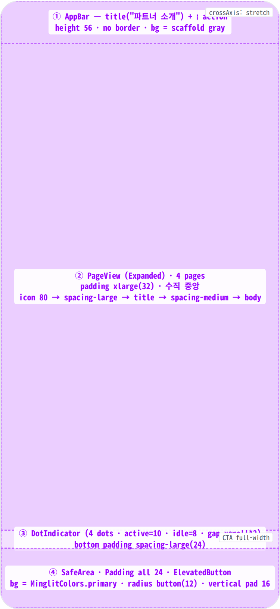
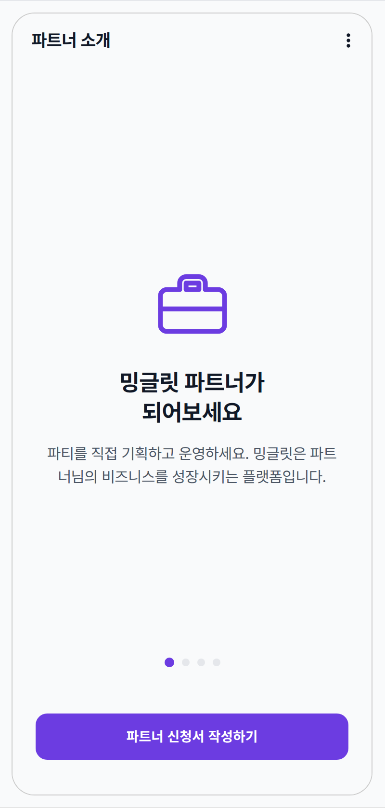
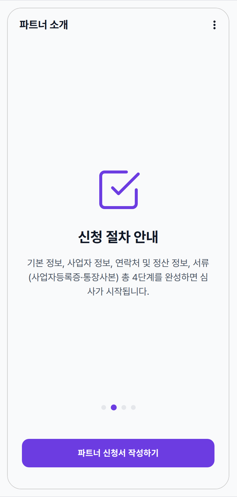
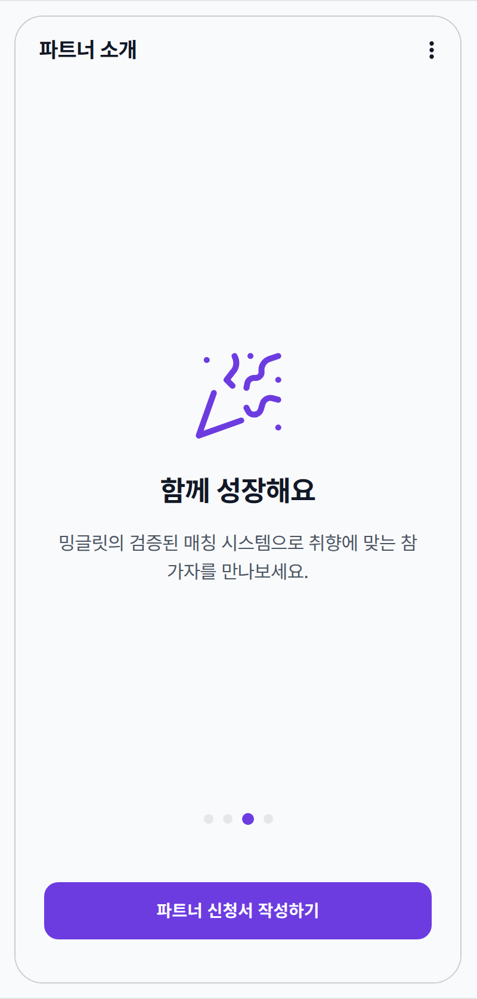
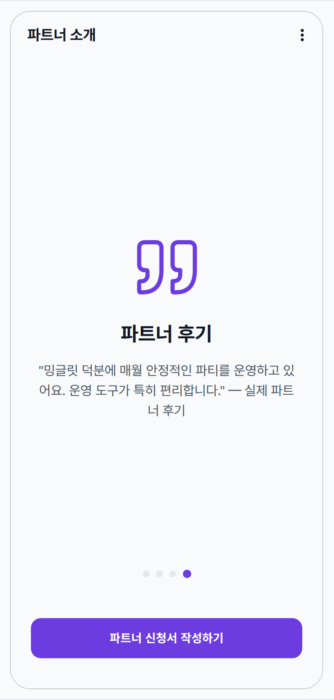
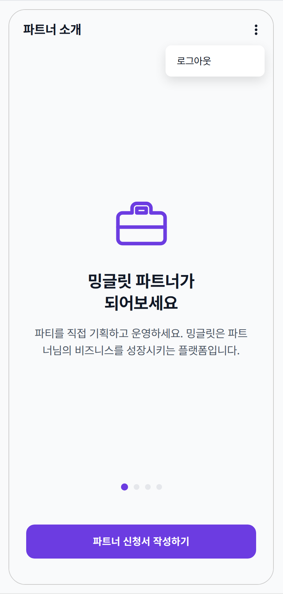
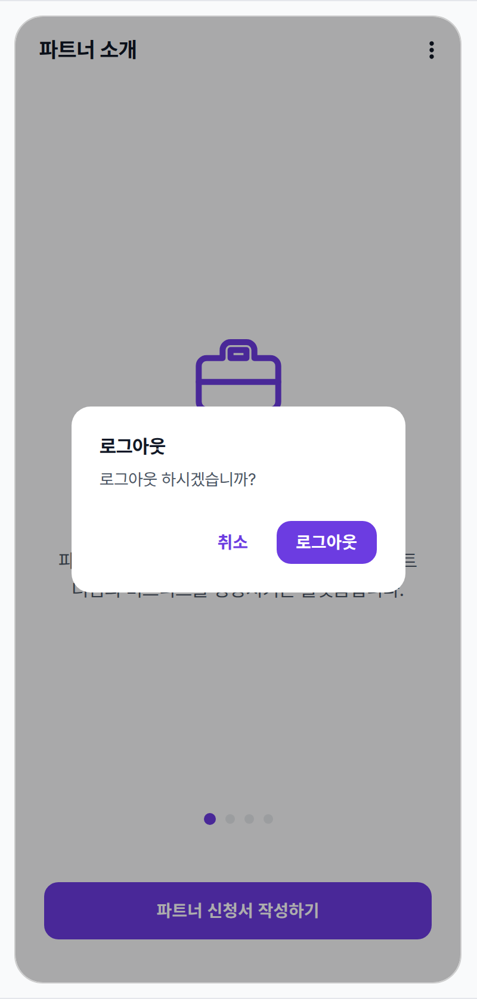

 Spec — PartnerWelcomePage (app\_partner · PartnerWelcomeRoute)  

# Partner Welcome

## Overview

| Status | ✅ 디자인완료 — 4 PageView 페이지 + logout 변형 |
|---|---|
| App | app_partner |
| Category | onboarding · entry · partner-only |
| Route / Surface | PartnerWelcomeRoute · widget: PartnerWelcomePage (ConsumerStatefulWidget · PageView · DotIndicator) |
| Path | /welcome |
| Hierarchy | Parent: — (top-level screen, no shell — outside StatefulShellRoute)Children: — (내부 PageView 4페이지는 같은 위젯의 sub-state, 별도 spec 없음) |
| Purpose | 파트너 신청 전 사용자에게 밍글릿 파트너 서비스를 4페이지 carousel로 소개하고 신청 마법사(PartnerApplyRoute) 진입점을 제공한다. 로그인은 끝났지만 아직 신청서가 없는 사용자(OnboardingState.needsApplication)만 도달. |
| User journey | Entry: 로그인 직후 또는 보호된 화면 직접 진입 시 router redirect. onboardingStateProvider가 needsApplication으로 resolve되면 모든 경로에서 /welcome으로 강제 이동.Exit: 하단 "파트너 신청서 작성하기" CTA → PartnerApplyRoute (/apply) · AppBar 우측 ⋮ → 로그아웃 (/login). |
| Background | 신청 플로우는 4단계(기본·사업자·연락처/정산·서류)로 양이 많아 신청서 진입 직전에 가치 제안과 절차를 미리 보여주는 단계가 필요했다. OnboardingState enum의 6 상태 중 이 화면에 도달하는 유일한 상태가 needsApplication — 즉 onboarding 게이트. |
| Frequency | 신청 시작 전까지 진입할 때마다. draft 생성 후엔 router가 자동으로 /apply로 우회 — 일반적으로 1회성. |

## History

이 spec의 주요 변경 이력. 최신 항목 위.

| Date | Version | Author | Changes |
|---|---|---|---|
| 2026-05-01 | 1.0 | mark-yun | v1.4 template으로 작성. 4 PageView 페이지(Welcome/Process/Growth/Testimonial) baseline + logout popup + confirm dialog state 정리. partner brand primary scoped via .viewport. |

[🧱 Layout](#layout) [🎨 States](#states) [🔄 Global Behavior](#behavior) [📖 Reference](#reference)

🧱

## Layout

화면 구조 — 영역, 정렬, 간격 규칙. 색·타이포 무시.

## Blueprint & tree

AppBar(`simpleAppBar` · 56) → Expanded PageView(swipe carousel) → DotIndicator → bottomNavigationBar(SafeArea + Padding 24 + ElevatedButton). Scaffold 배경 = scaffold-gray. PageView 페이지 콘텐츠는 `SingleChildScrollView`로 padding xlarge(32) · 수직 중앙 정렬.

**Scaffold** ├─ **appBar**: _MinglitTheme.simpleAppBar_ ← ① │ ├─ title: "파트너 소개" (`welcome_appbar_title`) │ ├─ showBackButton: _false_ │ └─ actions: │ └─ **PopupMenuButton**(icon: more\_vert) │ └─ "로그아웃" item → _MinglitAlert.showConfirm_ │ ├─ **body**: **Column** │ ├─ **Expanded** ← ② │ │ └─ **PageView**(controller, ClampingScrollPhysics, onPageChanged) │ │ ├─ _\_WelcomePage_(business\_center, page1) │ │ ├─ _\_WelcomePage_(checklist, page2) │ │ ├─ _\_WelcomePage_(celebration, page3) │ │ └─ _\_WelcomePage_(format\_quote, page4) │ │ │ └─ **Padding**(bottom: spacing-large) ← ③ │ └─ **DotIndicator**(currentIndex, totalCount=4) │ └─ **bottomNavigationBar**: **SafeArea** ← ④ └─ **Padding**(all: spacing-large = 24) └─ **ElevatedButton** ├─ bg: MinglitColors.primary ├─ fg: MinglitColors.background (#fff) ├─ vertical pad: spacing-medium (16) ├─ shape: RoundedRectangleBorder(radius-button = 12) └─ child: Text("파트너 신청서 작성하기")

## Spacing & alignment rules

| # | Region | Alignment | Spacing |
|---|---|---|---|
| ① | AppBar | start: title · end: actions | height 56 · no border · scaffold gray bg |
| ② | PageView 페이지 콘텐츠 | mainAxis: center · crossAxis: center | page outer pad spacing-xlarge (32) · top spacer xlarge → icon 80 → spacing-large (24) → title → spacing-medium (16) → body |
| ③ | DotIndicator | row · mainAxis center | dot 사이 horizontal spacing-xsmall 양쪽 (=8 gap) · 하단 pad spacing-large (24) |
| ④ | bottomNavigationBar | SafeArea wrap · CTA full-width stretch | EdgeInsets.all spacing-large (24) · 버튼 vertical pad spacing-medium (16) |

🎨

## States

시각 변형 6종 — 캐러셀 4페이지(같은 레이아웃에서 콘텐츠만 교체) + 우상단 메뉴 노출 + 로그아웃 확인 다이얼로그. 첫 페이지 baseline 풀 리스트, 나머지는 변경분만.

**State 식별 기준**: 현재 노출된 캐러셀 페이지 번호 + 우상단 메뉴 노출 여부 + 로그아웃 확인 다이얼로그 노출 여부. 캐러셀 4개 페이지는 레이아웃·간격·CTA 모두 동일하고 아이콘·제목·본문만 교체된다.

### Page 1 · 환영 인사 🎯 baseline · 첫 번째 페이지

| 항목 | 내용 |
|---|---|
| 조건 | 화면에 진입한 직후 노출되는 첫 번째 페이지. |
| 사용자 액션 | ① 왼쪽으로 스와이프 — 두 번째 페이지로 이동하고 인디케이터의 활성 dot이 1번째에서 2번째로 옮겨감 (약 0.3초의 부드러운 전환).② "파트너 신청서 작성하기" 버튼 탭 — 신청서 작성 화면으로 이동.③ AppBar 우상단 ⋮ 탭 — "로그아웃" 항목이 들어 있는 메뉴가 펼쳐짐.④ 시스템 뒤로가기 / 뒤로가기 스와이프 — 반응 없음. 이 화면은 자동으로 진입한 화면이라 위로 갈 곳이 없음. |
| 에지케이스 | · 첫 페이지 왼쪽으로 더 스와이프해도 반응이 없으며 바운스 효과도 없음.· CTA를 빠르게 여러 번 눌러도 같은 화면이 중복 진입되지 않으며 별도의 로딩 표시는 없음.· 다크 모드 전환 시 화면 배경과 아이콘 / CTA 색이 다크용 파트너 인디고로 자동 교체됨. |
| 컴포넌트 | · MinglitTheme.simpleAppBar(title="파트너 소개", showBackButton=false, actions=[PopupMenuButton])· PopupMenuButton<String>(icon: Icons.more_vert, items: ["로그아웃"])· PageView(ClampingScrollPhysics · 4 children · onPageChanged)· _WelcomePage(icon=Icons.business_center_outlined, title=welcome_page1_title, body=welcome_page1_body)· DotIndicator(currentIndex=0, totalCount=4) — 활성 10px partner-primary, idle 8px outlineVariant, AnimatedContainer with MinglitAnimation.medium· ElevatedButton(MinglitColors.primary · MinglitColors.background · radius-button · vertical pad spacing-medium) — Text(welcome_cta_button) |
| 토큰 | · color: color-partner-primary (#6c3ce1 · icon · CTA bg · active dot), color-surface (scaffold + appbar 배경), color-background (#fff · CTA fg), color-text-primary (title), color-text-secondary (body), outlineVariant (idle dot)· radius: radius-button (12 · CTA)· spacing: spacing-xlarge (32 · page padding), spacing-large (24 · icon↔title · bottombar padding · DotIndicator 하단 pad), spacing-medium (16 · title↔body · CTA vertical pad), spacing-xsmall (4 · dot 사이 양쪽 horizontal padding)· typography: headlineSmall.bold (title) · bodyLarge (body · onSurfaceVariant) · titleLarge (appbar title)· motion: MinglitAnimation.medium (350ms · DotIndicator 크기/색 transition) |
| 노트 | 📝 4 PageView 페이지가 모두 같은 layout — Page 2/3/4는 icon/title/body만 swap, 나머지 동일. |

### Page 2 · 신청 절차 안내 두 번째 페이지

| 항목 | 내용 |
|---|---|
| 조건 | 첫 페이지에서 왼쪽으로 스와이프해 도착하는 두 번째 페이지. |
| 사용자 액션 | ↔ 좌우 스와이프로 첫 페이지 또는 세 번째 페이지로 이동 가능. CTA와 우상단 메뉴 동작은 동일. |
| 에지케이스 | 동일 |
| 컴포넌트 | ↔ icon: Icons.business_center_outlined → Icons.checklist_outlined↔ title/body: welcome_page2_title / welcome_page2_body↔ DotIndicator currentIndex 0 → 1 |
| 토큰 | 동일 |
| 노트 | 📝 신청서 4단계의 분량을 미리 알려주는 페이지 — 이후 신청서 마법사의 4단계 흐름과 일치. |

### Page 3 · 함께 성장해요 세 번째 페이지

| 항목 | 내용 |
|---|---|
| 조건 | 두 번째 페이지에서 왼쪽으로 스와이프해 도착하는 세 번째 페이지. |
| 사용자 액션 | 동일 (좌우 스와이프 + CTA + 우상단 메뉴) |
| 에지케이스 | 동일 |
| 컴포넌트 | ↔ icon: Icons.celebration_outlined↔ title/body: welcome_page3_title / welcome_page3_body↔ DotIndicator currentIndex 1 → 2 |
| 토큰 | 동일 |
| 노트 | 📝 매칭 가치를 강조하는 페이지. celebration 아이콘의 외곽선 변형을 사용. |

### Page 4 · 파트너 후기 네 번째 페이지 — 마지막 페이지

| 항목 | 내용 |
|---|---|
| 조건 | 캐러셀의 마지막 페이지. |
| 사용자 액션 | ↔ 오른쪽으로 스와이프해 세 번째 페이지로 이동만 가능. 더 왼쪽으로 스와이프해도 반응 없음. |
| 에지케이스 | − 자동으로 다음 페이지로 넘어가는 동작은 없음. 사용자가 직접 스와이프해야 페이지가 바뀜. |
| 컴포넌트 | ↔ icon: Icons.format_quote_outlined↔ title/body: welcome_page4_title / welcome_page4_body↔ DotIndicator currentIndex 2 → 3 |
| 토큰 | 동일 |
| 노트 | 📝 후기 인용 페이지. 본문에 따옴표가 포함되어 있지만 본문 typography가 별도로 바뀌지는 않는다. |

### Popup menu open 우상단 ⋮ 메뉴가 펼쳐진 상태

| 항목 | 내용 |
|---|---|
| 조건 | + AppBar 우상단 ⋮을 탭한 직후 — 메뉴가 우상단 모서리 아래쪽에 펼쳐짐. |
| 사용자 액션 | ① "로그아웃" 탭 — 메뉴가 닫히면서 로그아웃 확인 다이얼로그가 노출됨.② 메뉴 바깥 영역 탭 — 메뉴가 닫히고 기본 화면으로 복귀. |
| 에지케이스 | · 메뉴가 펼쳐진 동안에는 캐러셀 좌우 스와이프가 받아들여지지 않음. |
| 컴포넌트 | + Material PopupMenuButton overlay (단일 PopupMenuItem · value="logout" · child = Text(home_button_logout)) |
| 토큰 | + color-background (popup surface) · radius-small (popup card) · 그림자 = Material elevation 8 (token 없음) |
| 노트 | 📝 메뉴의 위치와 스타일은 Material 기본을 그대로 사용. 별도 커스터마이즈 없음. |

### Logout confirm dialog 로그아웃 확인 다이얼로그가 노출된 상태

| 항목 | 내용 |
|---|---|
| 조건 | + 우상단 메뉴에서 "로그아웃"을 선택한 직후 — 화면 중앙에 확인 다이얼로그가 노출됨. |
| 사용자 액션 | ① "로그아웃" 확인 버튼 탭 — 다이얼로그가 닫히고 짧게 뒤이어 로그아웃 처리가 실행됨. 그 결과 자동으로 로그인 화면으로 이동.② "취소" 탭 / 다이얼로그 바깥 영역 탭 / 시스템 뒤로가기 — 다이얼로그가 닫히고 기본 화면으로 복귀. |
| 에지케이스 | · 로그아웃 처리에 실패해도 다이얼로그는 이미 닫힌 상태이고, 화면은 그대로 유지된다. 별도 에러 메시지는 노출되지 않으며 사용자가 다시 시도할 수 있다. |
| 컴포넌트 | + MinglitAlert.showConfirm (title=home_button_logout · content="로그아웃 하시겠습니까?" · confirmText/cancelText l10n) |
| 토큰 | + scrim rgba(0,0,0,0.32) · radius-card (16 · dialog) · spacing-large (24 · dialog padding) |
| 노트 | 📝 다이얼로그가 닫힌 뒤 한 박자 늦게 로그아웃이 실행되도록 의도된 동작 — 화면 전환 흐름이 어색해지지 않도록 함. |

🔄

## Global Behavior

cross-cutting — 모든 state에 적용되는 액션, motion, 글로벌 에지케이스. 페이지별 차이는 위 mini-table 참고.

## Cross-cutting interactions

| 사용자 액션 | 화면에 보이는 결과 |
|---|---|
| "파트너 신청서 작성하기" CTA 탭 | 신청서 작성 화면(/apply)으로 이동. 한 번 신청서가 시작되면 다음 진입부터는 이 환영 화면을 거치지 않고 곧바로 신청서 화면으로 우회됨. |
| 좌우 스와이프 (캐러셀) | 좌우 스와이프로 캐러셀 페이지가 전환됨. 양쪽 끝에서는 바운스 없이 부드럽게 정지. dot 인디케이터는 약 0.35초의 부드러운 전환으로 활성 dot 위치가 따라감. |
| AppBar 우상단 ⋮ 탭 → 로그아웃 | 메뉴가 펼쳐지고 "로그아웃" 선택 시 확인 다이얼로그가 노출됨. 확인하면 로그아웃 처리 후 자동으로 로그인 화면으로 이동. |
| 시스템 뒤로가기 / 뒤로가기 스와이프 | 뒤로가기 버튼 자체가 노출되지 않고, 자동 진입한 화면이라 위로 갈 곳도 없음 — Android는 앱 종료, iOS는 무반응. |
| 외부에서 신청 상태가 바뀐 경우 | 다른 기기에서 신청서 작성을 시작하면 이 화면이 자동으로 닫히고 신청서 화면으로 이동. |
| 다크 모드 토글 | 화면 배경이 다크용 surface로 전환되고, 파트너 인디고가 다크 톤으로 자동 교체됨. |

## Motion timing

Source: `shared/packages/mds/core/lib/src/theme/minglit_design_tokens.dart` (`MinglitAnimation`).

| Transition | Token / Duration | Notes |
|---|---|---|
| 화면 진입 (자동 이동) | MinglitAnimation.fast (200ms) | 표준 라우트 전환. 자동 이동으로 진입한 경우와 사용자 동작으로 진입한 경우의 시각적 차이는 없음. |
| 캐러셀 좌우 스와이프 → 다음/이전 페이지 | 약 300ms | OS 기본 캐러셀 전환 곡선 (cubic ease-out). |
| 인디케이터 활성 dot 전환 | MinglitAnimation.medium (350ms) | 활성 dot의 크기와 색이 부드럽게 전환됨. |
| 우상단 메뉴 노출 / 닫힘 | 약 150ms | OS 기본 fade + scale. 디자인 토큰 없음. |
| 확인 다이얼로그 노출 / 닫힘 | MinglitAnimation.fast (200ms) | 중앙에서 페이드 인/아웃 + 살짝 확대. 다이얼로그 뒤 어두워지는 영역도 동시에 페이드. |
| CTA 탭 → 신청서 화면 전환 | MinglitAnimation.fast (200ms) | 표준 라우트 전환 (slide / fade). |

## Global edge cases

-   **이미 신청서가 있는 사용자가 이 URL로 진입** — 화면이 보이지 않고 자동으로 신청서 화면 또는 홈으로 이동.
-   **로그아웃 직후 이 URL로 진입** — 즉시 로그인 화면으로 이동.
-   **신청 상태가 아직 확인되지 않은 채 진입** — 화면이 잠깐 보였다가 상태가 확인되면 필요 시 다른 화면으로 자동 이동. 사용자에게는 짧은 깜빡임으로 인지됨.
-   **로그아웃 실패** — 별도 에러 메시지가 노출되지 않고 화면이 그대로 유지된다. 사용자는 메뉴를 다시 열어 재시도할 수 있다. _의도된 동작_.

📖

## Reference

implementation source + 인접 화면. Components / Tokens는 위 mini-table 참고.

## Implementation source

| Widget | PartnerWelcomePage — apps/app_partner/lib/src/features/onboarding/partner_welcome_page.dart |
|---|---|
| Sub-widget | DotIndicator — apps/app_partner/lib/src/features/onboarding/widgets/dot_indicator.dart |
| Coordinator | OnboardingCoordinator — onboarding_coordinator.dart · goToApply() → /apply |
| Route | PartnerWelcomeRoute · /welcome · top-level (no shell) · app_routes.dart |
| Redirect logic | app_router.dart redirect — 로그인 + OnboardingState.needsApplication일 때 모든 경로에서 /welcome으로 강제. draft 생성 후엔 /apply로 우회. |
| State provider | onboardingStateProvider — onboarding_state_provider.dart · enum: loading / needsApplication / draftInProgress / pendingReview / needsCorrection / hasPartner |
| Brand color | MinglitPartnerColors.primary = #6c3ce1 (toned-down indigo) · scoped via .viewport에서 --color-primary 오버라이드. MinglitColors.primary(#9900ff)는 사용 안 함. |
| l10n | welcome_appbar_title · welcome_page1~4_title/body · welcome_cta_button · home_button_logout · common_button_cancel |

## Related screens

| Spec | Relation |
|---|---|
| LoginPage | 이 화면 직전. 로그인 성공 + needsApplication이면 자동 redirect로 도달. |
| PartnerApplyPage (spec 미작성) | CTA 탭 시 진입하는 신청 마법사 (4-step). draft 시작과 동시에 onboardingState가 draftInProgress로 변환. |
| PartnerApplyStatusPage (spec 미작성) | 제출 완료 후 심사 대기/보완 요청 상태 화면. pendingReview / needsCorrection에서 도달. |
| PartnerHomePage | 승인 완료(hasPartner) 후 진입하는 메인 홈. 이 화면의 최종 도달점. |