 Spec — PartyCreateWizardPage (app\_partner · PartyCreateWizardRoute)  

# Party Create Wizard

## Overview

| Status | ✅ 디자인완료 — 6 step + validation/submitting 8 state · Create / Edit 공유 |
|---|---|
| App | app_partner |
| Category | party · create / edit |
| Route / Surface | PartyCreateRoute · PartyEditRoute (shared spec) · widget: PartyCreateWizardPage + Step1BasicInfo…Step6Review |
| Path | Create: /more/parties/new · Edit: /more/parties/:partyId/edit |
| Hierarchy | Parent: — (top-level partner screen — 파티 목록에서 진입하는 wizard)Children: — (6 step은 internal sub-routes 아닌 stepper widget으로 한 화면 안에서 처리) |
| Purpose | 파트너가 새 파티(모임)를 생성하거나 기존 파티를 수정할 수 있도록 6단계 위저드로 안내한다. 각 단계에서 입력한 정보를 마지막 검토 단계에서 한눈에 확인하고 최종 생성/수정 처리한다. |
| User journey | Entry points: 파티 목록(PartyListPage) "새 파티 만들기" 버튼 / 기존 파티 상세(PartyDetailPage) "수정" 메뉴 (partyId 전달 시 Edit 모드).Exit points: 생성/수정 성공 → 파티 목록 복귀 + 성공 스낵바 / 뒤로 가기 → (단계 이탈 확인 다이얼로그 없음) 파티 목록 복귀. |
| Background | 파티 정보가 복잡하고 다양한 필드(기본 정보, 위치, 정원/연락처, 입장 규칙, 티켓, 검토)로 나뉘기 때문에 단계별 위저드가 UX를 단순화한다. 기존 파티를 수정하기 위해 진입한 경우엔 기존 값을 채워 넣는 짧은 대기 동안 풀스크린 스피너가 잠시 노출된다. "다음" 버튼은 빠르게 두 번 누르더라도 단계가 두 칸 진행되지 않도록 안전 처리되어 있다. |
| Frequency | 파트너당 파티 생성 1회 / 이후 수정 시 재진입. |

## History

이 spec의 주요 변경 이력. 최신 항목 위.

| Date | Version | Author | Changes |
|---|---|---|---|
| 2026-05-01 | 1.0 | mark-yun | v1.4 template으로 마이그레이션. Header → Overview 흡수 (Status · App · Category · Route · Path · Hierarchy 6행 추가). 8 states (6 step + validation error + submitting) → mini-table per state, baseline = Step 1 (기본 정보), additive diff. Reference의 Components / Tokens → 각 state mini-table에 분산. |

[🧱 Layout](#layout) [🎨 States](#states) [🔄 Global Behavior](#behavior) [📖 Reference](#reference)

🧱

## Layout

화면 구조 — 영역, 정렬, 간격 규칙. 색·타이포 무시.

## Blueprint & tree

AppBar(단계 타이틀) + LinearProgressIndicator(4px) + Expanded(PageView 6단계) + SafeArea bottomNavigationBar(이전/다음 버튼). PageView는 NeverScrollableScrollPhysics — 사용자가 직접 스와이프 불가.

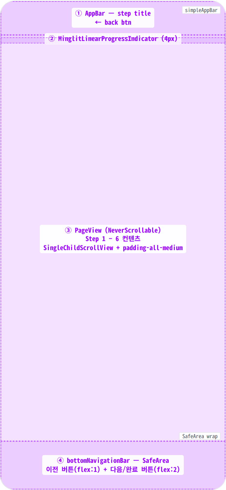

**Scaffold** ├─ **appBar**: MinglitTheme.simpleAppBar(title: stepTitle) ← ① ├─ **body**: **Column** │ ├─ **MinglitLinearProgressIndicator** ← ② │ │ value: (currentStep.index + 1) / 6 │ │ color: primary · bg: surfaceContainerHighest │ └─ **Expanded** │ └─ **PageView**(controller, NeverScrollable) ← ③ │ ├─ **Step1BasicInfo** — 기본 정보 │ │ ├─ 파티 제목 TextFormField │ │ ├─ 파티 소개 QuillEditor (rich text) │ │ ├─ 커버 이미지 PartyImageEditor (4-slot grid) │ │ ├─ 공개 범위 SwitchListTile (비공개 파티) │ │ └─ 태그 TagSelectionSection │ ├─ **Step2Location** — 장소 선택 │ │ ├─ 장소 검색 버튼 (→ LocationSearchPage) │ │ ├─ 상세 주소 TextFormField │ │ └─ 찾아오는 방법 TextFormField │ ├─ **Step3CapacityContact** — 정원 & 연락처 │ │ ├─ 최소 확정 인원 NumberInput │ │ ├─ 연락처 방법 toggle chips (phone/email/kakao) │ │ └─ 성비 균형 SwitchListTile + tolerance slider │ ├─ **Step4EntryRules** — 입장 규칙 │ │ ├─ EntryGroupCard × N (이름+인증+조건) │ │ └─ "+ 그룹 추가" 버튼 │ ├─ **Step5Tickets** — 티켓 │ │ └─ PartyTicketTemplateInput (add/remove/edit) │ └─ **Step6Review** — 검토 & 완료 │ ├─ 유효성 오류 카드 (있으면) │ └─ MinglitEditableSection × 5 (각 단계 요약 + 수정 버튼) │ └─ **bottomNavigationBar**: **SafeArea** ← ④ └─ **Padding**(all: spacing-medium) └─ **Row** ├─ \[step > 0\] OutlinedButton(이전) flex:1 └─ ElevatedButton(다음 / 생성하기 / 수정 완료) flex:2

## Spacing & alignment rules

| # | Region | Alignment | Spacing |
|---|---|---|---|
| ① | AppBar | crossAxis: center · height 56px | standard AppBar — back 버튼 포함 MinglitTheme.simpleAppBar. |
| ② | LinearProgressIndicator | full-width · height 4px | margin 없음 — AppBar 바로 아래 flush. |
| ③ | 각 Step(PageView child) | SingleChildScrollView → column start | outer pad: spacing-medium (16px) all · 필드 간: spacing-large (24px) · 레이블↔필드: spacing-medium (16px) |
| ④ | bottomNavigationBar | Row · SafeArea · center | outer pad: spacing-medium (16px) all · 이전↔다음 버튼 간: spacing-medium (16px) · 버튼 height: 48px |
| — | 입장 그룹 카드 (Step 4) | column start · border radius-card | pad: spacing-medium · 그룹 간: spacing-sm (12px) |
| — | 검토 섹션 (Step 6) | column stretch · editable section card | 섹션 간: spacing-large (24px) |

## AppBar anatomy (①)

상단 56px 고정 바 — 좌측 back 아이콘 + 단계 타이틀. 스크롤과 무관하게 항상 화면 상단에 고정. back 버튼은 40×40 hit zone 안에 22px chevron, 좌측 가장자리에서 `spacing-xsmall (4px)` 떨어짐. 타이틀은 back 버튼 우측에 `spacing-small (8px)` 간격으로 좌측 정렬되며, 단계가 바뀔 때마다 라벨이 즉시 교체됨.

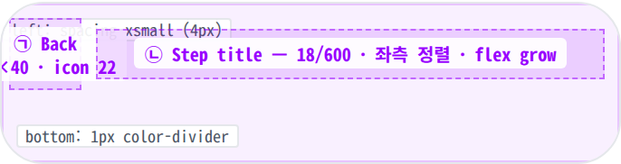

**AppBar**(height: 56, titleSpacing: 0) └─ Row(crossAxis: center) ├─ Padding(left: _spacing-xsmall = 4px_) │ ├─ _Back button_ ← ㉠ │ └─ **IconButton**(Icons.chevron\_left, size: 22) │ · 40×40 hit zone │ · onTap → 파티 목록으로 복귀 │ ├─ Gap: _spacing-small = 8px_ │ └─ _Step title_ ← ㉡ └─ **Text**(stepTitle, style: appBarTitle 18/600) · 좌측 정렬 · flex grow (남는 공간 차지) · 단계별 라벨: 기본 정보 · 장소 선택 · 정원 & 연락처 · 입장 규칙 · 티켓 · 검토 및 완료 _Bottom border:_ 1px solid _color-divider_ _Background:_ _color-background_ (light) / _color-dark-background_ (dark)

| # | Region | Alignment | Spacing |
|---|---|---|---|
| — | AppBar 외부 | height 56 · 풀폭 | left: spacing-xsmall (4px) · right: spacing-xsmall (4px) · bottom: 1px color-divider |
| ㉠ | Back 버튼 | 좌측 정렬 · 40×40 hit zone | icon size: 22px · hit zone padding: 9px (40-22)/2 |
| ㉡ | Step title | 좌측 정렬 · flex grow | back 버튼과 사이: spacing-small (8px) · padding-h 0 |

## Progress bar anatomy (②)

AppBar 바로 아래 4px 얇은 가로 막대 — 단계 진척도를 시각화. 채워진 부분은 좌측에서 시작해 강조 색으로, 나머지는 옅은 표면 색으로 비워 둠. 단계가 진행될수록 채움이 균등하게 늘어나며, 마지막 단계에 100%에 도달. AppBar와 본문 사이에 다른 여백 없이 flush하게 붙음.

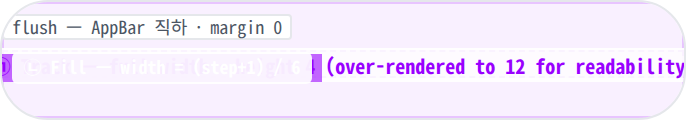

**MinglitLinearProgressIndicator**(height: 4) ├─ _Track_ ← ㉠ │ · width: 100% · height: 4 │ · background: _color-surface_ (옅은 표면 색) │ └─ _Fill_ ← ㉡ · width: _(currentStep.index + 1) / 6 × 100%_ · height: 4 · radius: 2 (좌측 끝만 둥글게 처리될 수 있음) · background: _color-primary_ (partner indigo) · 단계별 채움: Step 1 → 16.7% Step 2 → 33.3% Step 3 → 50.0% Step 4 → 66.7% Step 5 → 83.3% Step 6 → 100.0% _Position:_ AppBar 직하 · margin 0 (flush) _Animation:_ width transition 350ms — 단계 슬라이드와 동시에 부드럽게 채워짐

| # | Region | Alignment | Spacing |
|---|---|---|---|
| — | Progress bar 외부 | full width · AppBar 직하 flush | height: 4px · margin: 0 |
| ㉠ | Track | full width · 좌측 정렬 | background: color-surface |
| ㉡ | Fill | 좌측에서 시작 · 폭 가변 | width: 단계 비율 · background: color-primary · transition: 350ms |

## Step body anatomy (③)

AppBar/Progress 바로 아래부터 하단 버튼 바 직전까지의 가변 높이 스크롤 영역. 단계가 바뀌면 좌우로 슬라이드되며 본문이 교체됨. 좌우 / 상하 모두 `spacing-medium (16px)` padding이 둘러싸고, 그 안에서 필드 그룹이 위에서 아래로 쌓임. 필드 그룹 사이는 `spacing-large (24px)`, 그룹 안에서 라벨↔필드 사이는 `spacing-medium (16px)`. 세로 스크롤은 자동으로 활성화되며, 사용자가 직접 좌우로 스와이프해 단계를 넘기는 것은 차단됨.

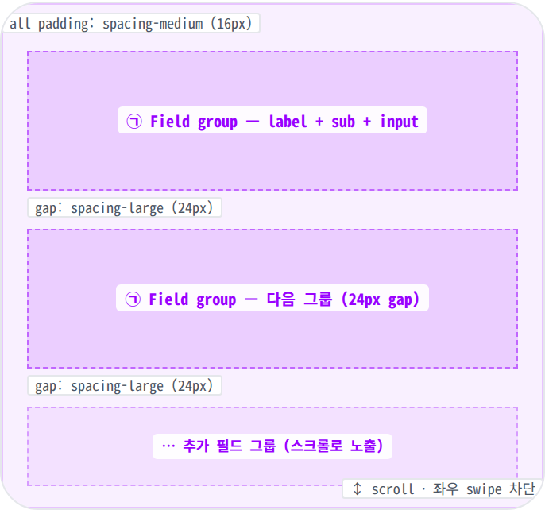

**PageView**(NeverScrollableScrollPhysics) └─ **Step{N}** child (단계별 위젯) └─ **SingleChildScrollView** └─ **Padding**(all: _spacing-medium = 16px_) └─ **Column**(crossAxis: stretch) ├─ _Field group_ ← ㉠ │ ├─ **Text**(label · titleSmall 14/700) │ ├─ Gap: _spacing-medium = 16px_ │ ├─ \[optional\] **Text**(sub · bodySmall 12) │ │ _설명 / 힌트 텍스트 — 일부 그룹에만_ │ └─ _Input atom_ │ _(TextField · Quill · ImageGrid · │ LocationPicker · SwitchRow · ChipGroup · │ EntryRuleCard · TicketCard · ReviewSection)_ │ ├─ Gap: _spacing-large = 24px_ │ ├─ _Field group_ (다음) ← ㉠ │ └─ … (단계마다 필드 수 가변) _Slide:_ 좌→우 (forward) / 우→좌 (back) — _MinglitAnimation.medium (350ms)_ _User scroll:_ 세로만. 좌우 스와이프는 차단됨.

| # | Region | Alignment | Spacing |
|---|---|---|---|
| — | Step body 외부 | AppBar+progress 직하 ↔ 하단 버튼 바 직전 · 가변 높이 | padding all: spacing-medium (16px) · 세로 스크롤만 |
| ㉠ | Field group | column stretch (full width) | 그룹 사이: spacing-large (24px) · 그룹 안 라벨↔필드: spacing-medium (16px) |
| — | 슬라이드 전이 | 좌→우 (forward) · 우→좌 (back) | duration: 350ms · easeOut · 진행 바 채움과 동기 |

## Form input atoms anatomy (③-a)

각 단계의 본문에 등장하는 입력 atom들. 모두 같은 height 52px (높이가 큰 Quill / Image grid는 예외)와 `radius-input (12px)`를 공유해, 사용자가 한 단계 안에서 시각적 리듬이 일정하게 느껴지도록 정렬됨. 비활성 상태는 1px `color-divider` 보더, 채워진 상태는 1px `color-primary` 보더로 강조. 오류 상태는 1px `color-error` 보더 + 그 아래 11px caption 안내 문구.

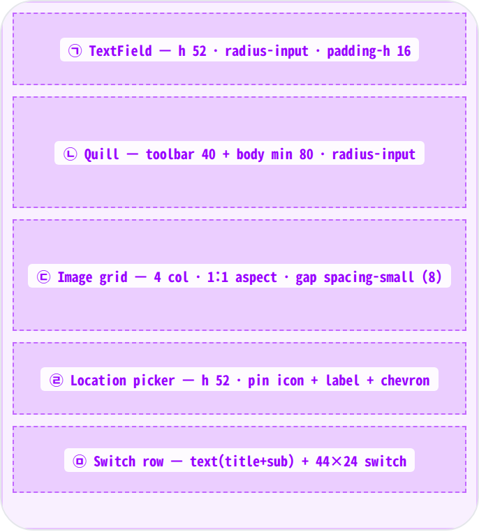

_① Text input_ ← ㉠ └─ **MinglitTextField**(height: 52, radius-input) · padding-h: _spacing-medium = 16_ · 비활성: border 1px _color-divider_ · 채움: border 1px _color-primary_ · 오류: border 1px _color-error_ + 하단 11px helper _② Rich text (소개)_ ← ㉡ └─ **QuillEditor**(radius-input · min-height 120) ├─ **Toolbar**(height 40, border-bottom 1px divider) │ └─ Btn × N (B · I · ≡ · · — 28×28, gap 4) └─ **Body**(padding 12, min-height 80) · placeholder: _color-text-secondary_ _③ Image grid (커버 이미지)_ ← ㉢ └─ **GridView**(crossAxisCount: 4, aspectRatio: 1) · gap: _spacing-small = 8_ ├─ _Add slot_: dashed 1px divider · plus + "추가" ├─ _Filled slot_: image + 우상단 × remove (20×20 scrim) └─ _Empty slot_: opacity 0.4 (정원 미달) · 4슬롯이 모두 채워지면 add 슬롯 자동 사라짐 _④ Location picker_ ← ㉣ └─ **LocationPicker**(height 52, radius-input) ├─ **Icon**(pin, 18, color-text-secondary) ├─ Gap: _spacing-small = 8_ ├─ **Text**(장소명 또는 placeholder, flex grow) └─ **Icon**(chevron\_right, 16) · 선택되면 border _color-primary_ _⑤ Switch row_ ← ㉤ └─ Row(crossAxis: center, padding-v: 8) ├─ **Column**(flex grow) │ ├─ **Text**(title · bodyMedium 14/500) │ └─ **Text**(sub · bodySmall 12 · color-text-secondary) └─ **Switch**(44×24, thumb 20) · off: bg _color-divider_ · on: bg _color-primary_

| # | Region | Alignment | Spacing |
|---|---|---|---|
| ㉠ | Text input | height 52 · 좌측 정렬 텍스트 | radius: radius-input (12) · padding-h: spacing-medium (16) · border 1px (divider / primary / error) |
| ㉡ | Rich text editor (Quill) | column · toolbar 위 + body 아래 | toolbar h: 40 · body min-h: 80 · padding 12 · 토lbar btn 28×28 · gap 4 |
| ㉢ | Image grid | 4-column grid · aspect 1:1 | gap: spacing-small (8) · radius: radius-small (8) · 채움 4개 한도 |
| ㉣ | Location picker | row · pin + label + chevron | height 52 · padding-h: spacing-medium · icon 18/16 · gap: spacing-small |
| ㉤ | Switch row | row · text 좌측 + switch 우측 | padding-v: spacing-small (8) · switch: 44×24 · thumb 20 · 켜짐 시 thumb 좌→우 슬라이드 |

## Bottom navigation buttons anatomy (④)

화면 하단에 고정되는 80px 버튼 바. 좌측에 "이전"(보더 버튼, flex 1), 우측에 "다음" 또는 마지막 단계의 "생성하기 / 수정 완료"(채움 버튼, flex 2)가 배치. Step 1에서는 "이전" 슬롯이 비어 있고 "다음" 버튼이 가로 폭 전체를 차지함. 두 버튼 모두 height 48, 사이 간격은 `spacing-medium (16px)`. 바 자체는 `spacing-medium` all-padding 안에 SafeArea로 감싸짐.

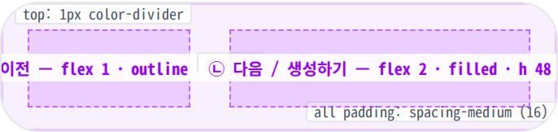

**bottomNavigationBar**: **SafeArea** └─ **Container**(border-top: 1px _color-divider_, bg: _color-background_) └─ **Padding**(all: _spacing-medium = 16_) └─ **Row**(crossAxis: center, gap: _spacing-medium = 16_) ├─ \[step > 0\] _Prev button_ ← ㉠ │ └─ **OutlinedButton**(height: 48, flex: 1) │ · border 1px _color-divider_ │ · bg _color-background_ · text _color-text-primary_ │ · radius _radius-button = 12_ │ · 라벨: "이전" │ · onTap → 직전 단계로 슬라이드 │ └─ _Next / Submit button_ ← ㉡ └─ **FilledButton**(height: 48, flex: 2) · bg _color-primary_ · text white · radius _radius-button = 12_ · 라벨 (단계별): Step 1 – 5 → "다음" Step 6 (Create) → "생성하기" Step 6 (Edit) → "수정 완료" · disabled (제출 중): bg _color-divider_, text _color-text-secondary_ · onTap → 유효성 통과 시 다음 단계 / 마지막엔 제출 _Step 1 예외:_ "이전" 슬롯 자체가 없음 → "다음"이 풀폭 차지 _Double-tap guard:_ 빠른 두 번 탭 시 두 번째 탭은 무시

| # | Region | Alignment | Spacing |
|---|---|---|---|
| — | Bottom nav 외부 | 화면 하단 고정 · height 80 · SafeArea | padding all: spacing-medium (16) · top: 1px color-divider |
| ㉠ | Prev 버튼 | 좌측 정렬 · flex 1 (Step 2~6) | height 48 · radius: radius-button (12) · border 1px divider · bg background · Step 1에선 미노출 |
| ㉡ | Next/Submit 버튼 | 우측 정렬 · flex 2 (Step 1엔 풀폭) | height 48 · radius: radius-button · bg color-primary · disabled 시 bg color-divider |
| — | 두 버튼 사이 | row · gap | gap: spacing-medium (16) |

## Review section anatomy (③-b)

마지막 단계(검토 및 완료)에서만 본문에 등장하는 카드. 1~5단계의 입력값을 단계별로 묶어 한눈에 보여주며, 각 카드 우측 상단의 "수정" 텍스트 버튼으로 해당 단계로 빠르게 점프할 수 있음. 카드는 `radius-card (16)` 보더로 감싸지고, header 영역은 옅은 표면 색으로 본문과 시각적으로 분리됨. 카드 사이 간격은 `spacing-medium (16px)`, 본문 내부의 key-value 줄 사이는 6px의 좁은 간격.

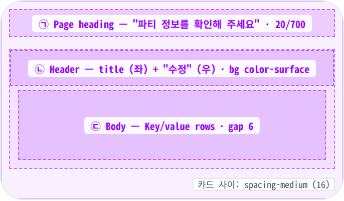

_Page heading_ ← ㉠ └─ **Text**("파티 정보를 확인해 주세요") · sectionTitle 20/700 · color-text-primary · 헤딩 ↔ 첫 카드 사이: _spacing-medium = 16_ _Review section card × 5_ (1~5단계 요약) ← (per section) └─ **Container**(radius: _radius-card = 16_, border: 1px _color-divider_) ├─ _Header_ ← ㉡ │ └─ Row(padding: _spacing-sm spacing-medium_, │ bg: _color-surface_, │ border-bottom: 1px _color-divider_) │ ├─ **Text**(섹션 타이틀 · bodyMedium 14/600) │ └─ **TextButton**("수정" · bodySmall 12/600 · primary) │ · onTap → 해당 단계로 슬라이드 점프 │ └─ _Body_ ← ㉢ └─ **Padding**(all: _spacing-medium_) └─ Column └─ _Key/value row × N_ · key: 14/600 · min-width 60 · color-text-primary · value: 14/400 · color-text-secondary · 줄 사이 gap: 6px _카드 사이:_ _spacing-medium = 16_ _섹션 5종:_ 기본 정보 · 장소 · 정원/연락처 · 입장 규칙 · 티켓 _오류 카드(있을 때):_ 같은 카드 형식, bg/border가 옅은 빨간 톤 — 헤딩 직하에 노출

| # | Region | Alignment | Spacing |
|---|---|---|---|
| ㉠ | Page heading | 좌측 정렬 · 카드 위에 단독 줄 | 20/700 · 헤딩↔첫 카드: spacing-medium (16) |
| ㉡ | Section header | row · 타이틀 좌 · "수정" 우 | padding: spacing-sm (12) v · spacing-medium (16) h · bg: color-surface · 하단 1px divider |
| ㉢ | Section body | column · key 좌 + value 우 | padding: spacing-medium (16) all · 줄 사이: 6px · key min-w: 60 · key↔value gap: spacing-sm (12) |
| — | 카드 사이 | column · 위에서 아래로 | gap: spacing-medium (16) · 카드 5개 (단계별) |

## Loading overlay anatomy (⑤)

마지막 단계의 "생성하기 / 수정 완료"를 누른 직후, 서버 응답을 기다리는 짧은 동안만 화면 전체에 등장하는 막. 배경은 반투명 검정 scrim, 가운데 36×36 흰색 회전 스피너 한 개. 이 막이 떠 있는 동안 그 아래의 모든 컨트롤은 터치에 반응하지 않으며, 시스템 뒤로가기도 일시적으로 막힘. 위저드 외 결제 / 인증 등의 다른 전역 흐름에서도 동일한 모습으로 재사용되는 공유 atom.

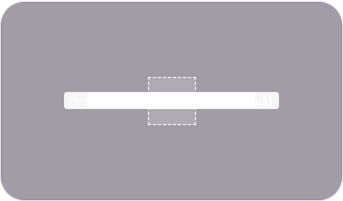

**GlobalLoadingOverlay** (전역 atom) ├─ _Scrim_ ← ㉠ │ · position: 화면 전체 inset 0 │ · background: rgba(0,0,0,0.5) — _color-scrim_ │ · 터치 차단 (그 아래 모든 위젯이 터치에 반응하지 않음) │ · 등장: 100ms 페이드 인 (_MinglitAnimation.micro_) │ └─ _Spinner_ ← ㉡ └─ **CircularProgressIndicator**(size: 36, color: white) · 화면 중앙 정렬 (X · Y 모두 50%) · stroke 3px · 반투명 흰 트랙 + 흰 진행 호 · 회전 0.7s linear infinite _버튼 시각 변화:_ "생성하기" 버튼은 disabled 톤(bg _color-divider_ · text _color-text-secondary_)으로 함께 노출 _해제 시점:_ 응답 도착(성공/실패 모두) 즉시 fade-out

| # | Region | Alignment | Spacing |
|---|---|---|---|
| ㉠ | Scrim | 화면 전체 · inset 0 · z-top | background: color-scrim rgba(0,0,0,0.5) · 터치 차단 |
| ㉡ | Spinner | 중앙 정렬 (X·Y 50%) | size: 36×36 · stroke 3 · 흰색 · 0.7s linear infinite 회전 |
| — | 등장 / 사라짐 | fade in / out | 등장: 100ms (micro) · 사라짐: 응답 즉시 |

🎨

## States

시각 변형 8종 (6 step + validation error + submitting). baseline = Step 1, 나머지는 additive diff.

**State 식별 기준**: 현재 단계 (기본 정보 / 장소 / 정원·연락처 / 입장 규칙 / 티켓 / 검토), 다음으로 넘어갈 때 입력값이 유효한지 여부, 마지막 단계에서 저장이 진행 중인지 여부에 따라 8가지 변형. 수정 모드의 첫 진입 직후엔 잠깐 풀스크린 스피너가 떠서 기존 값을 채우는 짧은 전이 구간이 있음 (별도 state로 분류하지 않음).

### Step 1 / 6 · 기본 정보 🎯 baseline · 위저드 첫 단계, 제목·소개·이미지·공개 여부 입력

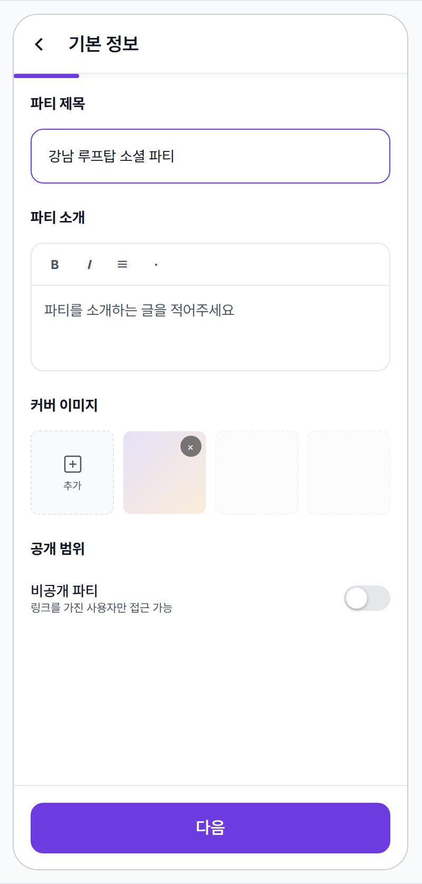

| 항목 | 내용 |
|---|---|
| 조건 | 위저드 첫 단계인 "기본 정보". 새로 만들기로 진입한 직후, 또는 수정 모드에서 기존 값이 채워진 직후의 모습. |
| 사용자 액션 | ① 제목 입력 — 입력란 테두리가 강조 색으로 바뀌며 채워짐을 시각적으로 표시.② 소개 본문 편집 — 굵게 / 기울임 / 목록 등 툴바로 서식을 적용하며 본문 입력.③ 이미지 추가 슬롯 탭 — 갤러리에서 사진 선택 후 슬롯에 채워짐.④ 이미지 슬롯 우상단 × 탭 — 해당 사진이 슬롯에서 즉시 제거.⑤ "비공개 파티" 스위치 토글 — 켜면 링크를 받은 사람만 접근 가능한 파티로 전환.⑥ "다음" 탭 — 입력값이 유효하면 다음 단계로 슬라이드, 미흡하면 입력란이 빨간 톤으로 강조되며 안내 토스트가 잠시 노출.⑦ 뒤로가기 — 별도 확인 없이 파티 목록으로 복귀, 입력 중이던 값은 유지되지 않음. |
| 에지케이스 | · 이미지 4개 슬롯이 모두 채워지면 "추가" 슬롯은 자동으로 사라짐.· 제목이 허용 글자 수를 넘으면 입력란이 빨간 톤으로 바뀌고 아래에 안내 문구가 노출.· "비공개 파티"를 켠 결과는 마지막 검토 단계의 요약에서도 그대로 확인됨. |
| 컴포넌트 | · MinglitAppBar (back · title)· WizardProgressBar (16.7% fill — 1/6 step)· MinglitTextField (filled · placeholder · error variant)· QuillEditor (bold/italic/list toolbar · placeholder)· ImageSlotGrid 4개 슬롯 (add 슬롯 · 채워진 슬롯 + remove · 비활성 슬롯)· SwitchRow (제목 + 부제 + Switch)· WizardBottomNav + FilledButton (다음 — Step 1엔 prev 없음) |
| 토큰 | · color: color-primary (progress fill · 다음 버튼), color-background, color-surface, color-divider (input border · 비활성 슬롯), color-text-primary/secondary· radius: radius-input (12 · input · slot), radius-button (12 · 다음 버튼), radius-card (16 · Quill body)· spacing: spacing-medium (16 · body padding · field 간격), spacing-sm (12 · label↔input · slot gap), spacing-small (8 · 부제↔본문 · toolbar btn gap)· typography: appBarTitle (18/600), titleSmall (14/700 — field label), bodyMedium (14/400 — input), bodySmall (12 — sub-label · sub) |
| 노트 | 📝 6단계 모두 같은 골격(상단 AppBar + 얇은 진행 바 + 본문 + 하단 이전/다음 바)을 공유. 다음 단계부터는 body 콘텐츠 / 진행 바 채움 / AppBar 타이틀의 변경분만 표기. |

### Step 2 / 6 · 장소 선택 파티가 열릴 장소와 상세 주소 / 찾아오는 방법 입력

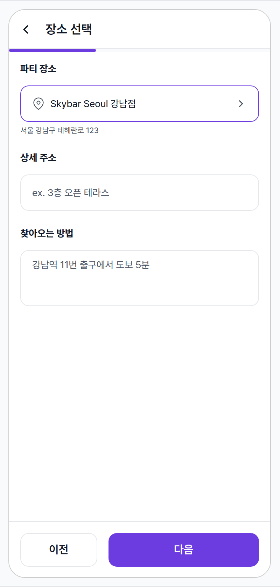

| 항목 | 내용 |
|---|---|
| 조건 | 두 번째 단계인 "장소 선택". 장소를 한 곳 골랐고, 상세 주소는 아직 비어 있는 일반적인 모습. |
| 사용자 액션 | + 장소 선택 영역 탭 — 장소 검색 시트가 열리고, 선택하면 이름과 주소가 자동으로 채워짐.+ 상세 주소 / 찾아오는 방법 입력 — 일반 텍스트 입력란.이전 / 다음 / 뒤로가기는 baseline과 동일. |
| 에지케이스 | · 검색 결과가 없을 땐 사용자가 직접 입력하는 길로 안내됨.· 장소를 선택하지 않은 채 "다음"을 누르면 안내 토스트가 잠시 노출되며 다음 단계로 넘어가지 않음. |
| 컴포넌트 | + LocationPicker (선택된 장소 + arrow chevron)+ WizardBottomNav의 OutlinedButton "이전" (Step 2부터 등장)↔ WizardProgressBar fill → 33.3% (2/6)↔ AppBar title → "장소 선택"− 이미지 grid · Quill · Switch |
| 토큰 | + LocationPicker 활성 border → color-primary (선택 시)나머지 동일 |
| 노트 | 📝 진행 바는 단계가 진행될수록 1/6, 2/6 ... 식으로 균등하게 채워지며, 마지막 검토 단계에서 100%에 도달. |

### Step 3 / 6 · 정원 & 연락처 최소 확정 인원 / 연락 수단 / 성비 균형 옵션 입력

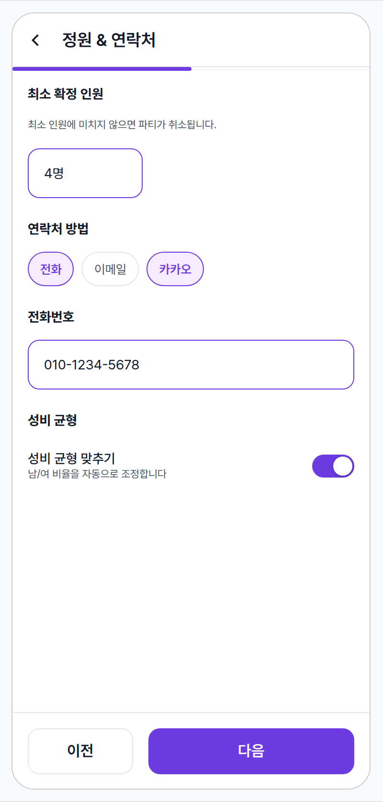

| 항목 | 내용 |
|---|---|
| 조건 | 세 번째 단계인 "정원 & 연락처". 최소 인원이 입력되어 있고, 연락 수단 칩 두 개가 활성화된 모습. |
| 사용자 액션 | + 최소 인원 입력 — 숫자를 직접 입력 (단위 "명").+ 연락처 방법 칩 탭 — 전화 / 이메일 / 카카오를 복수로 선택 가능. 선택된 칩은 강조 색으로 바뀌며 채움 배경.+ 선택한 연락 수단별 입력란 — 칩을 켤 때마다 해당 수단의 입력란이 노출.+ "성비 균형 맞추기" 스위치 — 켜면 남/여 비율이 자동으로 조정되도록 표기. |
| 에지케이스 | · 연락 수단을 한 개도 선택하지 않은 채 "다음"을 누르면 안내 토스트가 잠시 노출되며 다음 단계로 넘어가지 않음.· 최소 인원이 발행 예정 티켓 총량보다 많으면 마지막 검토 단계에서 경고가 표시됨. |
| 컴포넌트 | + NumberStepperInput (최소 인원, 최대 4 자리)+ MinglitFilterChipGroup (연락처 방법 multi-select)+ SwitchRow (성비 균형)↔ WizardProgressBar fill → 50% (3/6)↔ AppBar title → "정원 & 연락처" |
| 토큰 | + chip 활성 bg → rgba(var(--spec-blueprint-rgb), 0.08) + color-primary border+ chip 비활성 → color-divider border + color-background bg+ radius-chip (100px · fully rounded) |
| 노트 | 📝 칩 다중 선택 패턴은 다른 위저드에서도 동일하게 사용되는 디자인 시스템 표준. |

### Step 4 / 6 · 입장 규칙 입장 그룹 2개가 설정된 모습

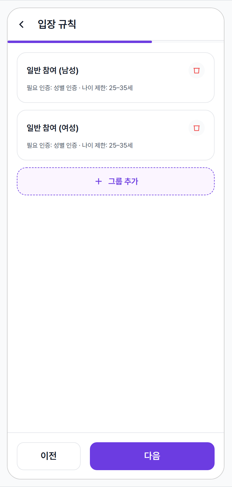

| 항목 | 내용 |
|---|---|
| 조건 | 네 번째 단계인 "입장 규칙". 인증 요구사항 / 나이 제한 / 성별 제한이 묶인 입장 그룹이 한 개 이상 설정되어 있는 일반 모습. |
| 사용자 액션 | + "그룹 추가" 버튼 탭 — 새 입장 그룹을 만드는 편집 시트가 열림.+ 그룹 카드 본문 탭 — 같은 편집 시트가 열려 기존 그룹을 수정.+ 그룹 카드 우측 휴지통 아이콘 탭 — 삭제 확인 다이얼로그가 뜨고, 확인하면 카드가 사라짐. |
| 에지케이스 | · 그룹이 한 개도 없는 상태에서 "다음"을 누르면 "최소 1개 그룹이 필요합니다" 안내가 잠시 노출.· 그룹 수가 한도(10개)에 이르면 "그룹 추가" 버튼이 흐릿하게 비활성화됨.· 마지막 남은 그룹을 삭제하려 하면 다이얼로그에 경고가 함께 표시. |
| 컴포넌트 | + EntryRuleCard (이름 · detail · delete icon · radius-card)+ WizardAddButton (dashed border · plus icon · 그룹/티켓 추가 공통)↔ WizardProgressBar fill → 66.7% (4/6)↔ AppBar title → "입장 규칙"− body 일반 input / chip / switch (이 step은 카드 list 위주) |
| 토큰 | + radius-card (16 · EntryRuleCard) + dashed border (color-divider · WizardAddButton)나머지 동일 |
| 노트 | 📝 그룹 편집 시트는 별도 spec 후보 (현재 이 spec 안에서 다루지 않음 — wizard 본체에 집중). |

### Step 5 / 6 · 티켓 티켓 두 종류가 설정된 모습

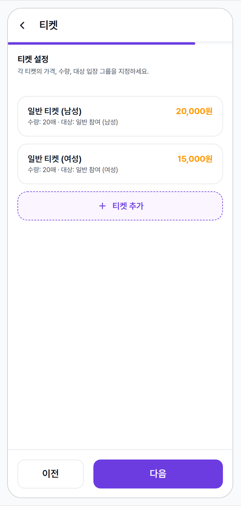

| 항목 | 내용 |
|---|---|
| 조건 | 다섯 번째 단계인 "티켓". 한 종류 이상의 티켓(이름 / 가격 / 수량 / 대상 입장 그룹)이 설정된 일반 모습. |
| 사용자 액션 | + "티켓 추가" 또는 카드 탭 — 티켓 편집 시트가 열림.+ 티켓 카드 우측 휴지통 아이콘 탭 — 삭제 확인 다이얼로그. |
| 에지케이스 | · 티켓이 한 개도 없는 상태에서 "다음"을 누르면 안내 토스트가 잠시 노출.· 이전 단계에서 입장 그룹을 삭제하면 그 그룹과 연결된 티켓의 대상 표기가 자동으로 비워지고 사용자가 다시 지정해야 함.· 가격을 0원으로 설정하면 무료 파티로 표기됨. |
| 컴포넌트 | + TicketCard (이름 · 가격 양 끝 정렬 · meta 라인 · radius-card)↔ WizardProgressBar fill → 83.3% (5/6)↔ AppBar title → "티켓" |
| 토큰 | + 가격 → color-text-primary bold (14/700)+ meta 라인 → color-text-secondary bodySmall |
| 노트 | 📝 티켓 편집 시트는 입장 그룹 편집 시트와 같은 패턴 — 별도 spec 후보. 가격은 천 단위 콤마 + "원" 접미로 표기됨. |

### Step 6 / 6 · 검토 & 생성 모든 입력이 유효하고 "생성하기" 버튼이 활성화된 마지막 단계

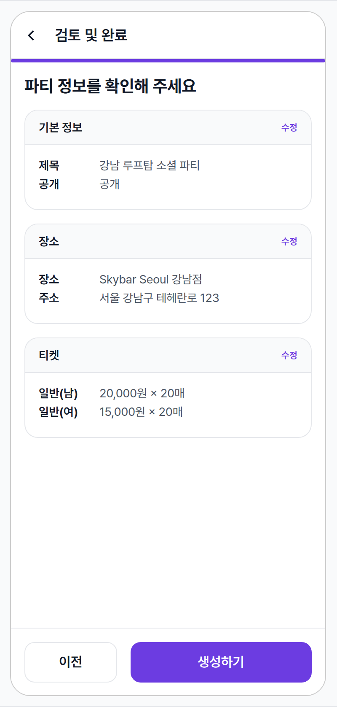

| 항목 | 내용 |
|---|---|
| 조건 | 마지막 단계인 "검토 및 완료". 1~5단계의 입력이 모두 유효해 화면에는 "파티 정보를 확인해 주세요" 헤딩과 함께 섹션별 요약이 노출됨. |
| 사용자 액션 | ① 섹션 우측 "수정" 탭 — 해당 단계로 화면이 슬라이드 전환되어 그 단계만 다시 손볼 수 있음. 다른 단계의 입력값은 그대로 유지.② "생성하기" 탭 — 저장 진행 중 상태로 전환 (다음 state) 후, 성공하면 파티 목록으로 돌아가며 성공 토스트가 잠시 노출.③ "이전" 탭 — 직전 단계(티켓)로 복귀. |
| 에지케이스 | · 수정 모드일 때는 "생성하기" 라벨이 "수정 완료"로 바뀐다.· 이 단계에서는 요약을 읽기만 하며, 값 변경은 반드시 해당 단계로 이동해서 수행한다. |
| 컴포넌트 | + ReviewSection (header + body · 섹션 타이틀 · "수정" TextButton)+ ReviewKvRow (key/value 좌우 정렬)+ Page heading (20/700) "파티 정보를 확인해 주세요"↔ WizardProgressBar fill → 100% (6/6)↔ "다음" 버튼 → "생성하기" 라벨− Step 1-5의 input 필드 일체 (검토 모드라 read-only) |
| 토큰 | + Page heading → typography-font-size-section-title (20px) + bold (700)+ "수정" link → color-primary · bodySmall+ ReviewSection card → radius-card + color-divider border |
| 노트 | 📝 "수정" 점프는 화면만 해당 단계로 이동시킬 뿐, 다른 단계의 입력값은 그대로 보존된다. 검토 단계로 돌아오면 손본 값이 즉시 반영되어 표시. |

### Validation error "다음"을 눌렀는데 입력이 미흡할 때 — 어떤 단계에서도 동일하게 노출

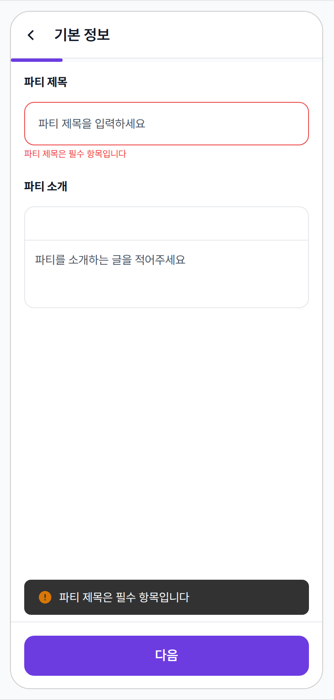

| 항목 | 내용 |
|---|---|
| 조건 | "다음"을 눌렀지만 현 단계의 입력이 미흡한 상태. 화면 하단에 안내 토스트가 잠시 노출되고, 단계는 그대로 머무른다. |
| 사용자 액션 | · 토스트는 잠시 후 자동으로 사라지며 사용자가 명시적으로 닫을 수도 있음.· 빨간 톤으로 강조된 입력란을 다시 손본 후 "다음"을 누르면 정상 진행.· "이전"은 유효성 검사를 거치지 않고 바로 이전 단계로 복귀 가능. |
| 에지케이스 | · 동시에 여러 입력란이 미흡한 경우 — 토스트는 첫 번째 안내만 표시되지만, 미흡한 입력란들은 모두 빨간 톤으로 강조되며 그 아래 안내 문구가 함께 노출.· "다음"을 빠르게 두 번 누르더라도 단계가 두 번 진행되지 않도록 안전 처리되어 있음. |
| 컴포넌트 | + MinglitTextField error variant (border color-error + 하단 helper text)+ InlineErrorText (caption · color-error · 4px gap)+ SnackBar (Material default · info icon + label · 화면 하단 fixed)↔ Step 1 input "filled" → "error placeholder" |
| 토큰 | + color-error (input border · helper text · snackbar bg)+ typography-font-size-caption (11px · helper text) |
| 노트 | 📝 mockup은 Step 1 모습이지만, 어떤 단계에서도 같은 패턴(빨간 강조 + 안내 토스트)으로 노출. |

### Submitting "생성하기"를 누른 직후 — 화면 전체에 풀스크린 로딩 오버레이

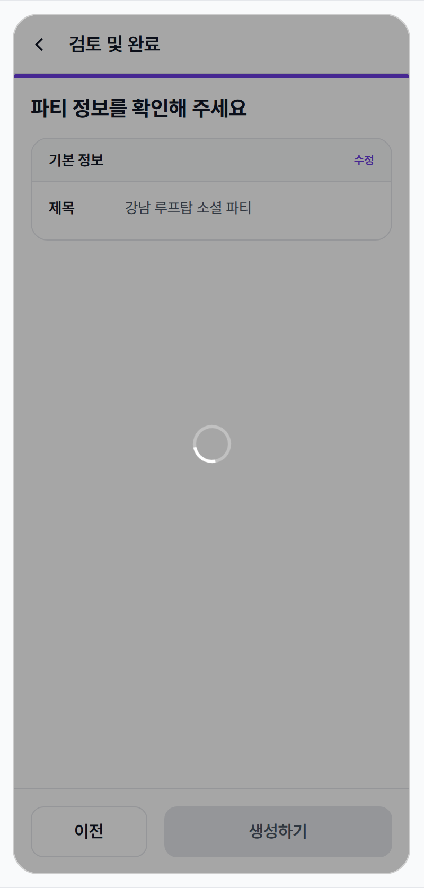

| 항목 | 내용 |
|---|---|
| 조건 | 마지막 단계에서 "생성하기"를 누른 직후, 서버 응답을 기다리는 짧은 구간. 화면 전체에 어두운 막과 가운데 흰 스피너가 노출됨. |
| 사용자 액션 | — (이 시점에는 화면의 어떤 컨트롤도 반응하지 않음. 뒤로가기도 이 짧은 동안에는 동작하지 않음.) |
| 에지케이스 | · 서버 오류가 발생하면 오버레이가 사라지며 안내 다이얼로그가 뜨고, 검토 단계로 복귀 — 입력값은 그대로 유지.· 네트워크가 끊기거나 응답이 너무 늦으면 동일한 안내 다이얼로그가 표시.· 성공하면 오버레이가 사라지며 파티 목록으로 이동, 성공 토스트가 잠시 노출. |
| 컴포넌트 | + GlobalLoadingOverlay (전체 화면 scrim + 중앙 white spinner · 앱 전역 사용)↔ "생성하기" 버튼 → disabled 상태 (visual cue)− 다른 모든 액션 (overlay 위 unreachable) |
| 토큰 | + overlay scrim → color-scrim (rgba(0,0,0,0.5))+ spinner → 흰색 (overlay 위 contrast) |
| 노트 | 📝 풀스크린 로딩 오버레이는 위저드 외에도 결제 / 인증 등 다른 전역 흐름에서 동일한 모습으로 재사용되는 공유 atom. |

## AppBar + Progress bar — visual

상단 56px 바와 그 아래 4px 진행 바를 한 묶음으로 본 모습. 단계가 진행될수록 진행 바의 강조 색 채움이 좌측에서 우측으로 늘어나며, 마지막 검토 단계에서 100%에 도달. AppBar의 타이틀도 단계마다 즉시 바뀜. 모든 시각 요소가 partner indigo(`--color-primary`)에 묶여 일관된 인상.

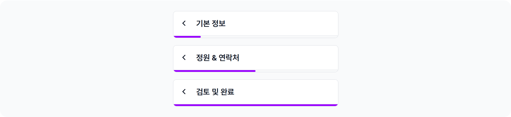

| Step | Title | Fill | 비주얼 변화 |
|---|---|---|---|
| Step 1 / 6 | 기본 정보 | 16.7% | 좌측 끝에 강조 색 짧은 막대만 보임 — 위저드 시작. |
| Step 2 / 6 | 장소 선택 | 33.3% | 채움이 1/3 지점까지 부드럽게 늘어남. |
| Step 3 / 6 | 정원 & 연락처 | 50.0% | 채움이 가운데에 도달 — 위저드 절반 진행. |
| Step 4 / 6 | 입장 규칙 | 66.7% | 채움이 2/3 지점에 — 후반부 진입. |
| Step 5 / 6 | 티켓 | 83.3% | 채움이 우측 끝에 가까워짐 — 거의 완료. |
| Step 6 / 6 | 검토 및 완료 | 100.0% | 막대 전체가 강조 색으로 채워져 마지막 단계임을 알림. |

※ 채움 폭은 단계 슬라이드와 같은 350ms 동안 부드럽게 보간되어 변경된다. AppBar 타이틀은 페이드 없이 단계가 바뀌는 순간 즉시 교체.

## Bottom buttons — visual

화면 하단 80px 버튼 바의 단계별 / 상태별 시각 변형. Step 1엔 "이전" 슬롯 자체가 없어 "다음"이 풀폭을 차지하고, Step 2 이후엔 보더 "이전" + 채움 "다음"이 1:2 비율로 나란히 배치된다. 마지막 단계의 "다음"은 라벨이 "생성하기 / 수정 완료"로 바뀌며, 제출 중에는 같은 위치의 버튼이 옅은 disabled 톤으로 비활성화된다.

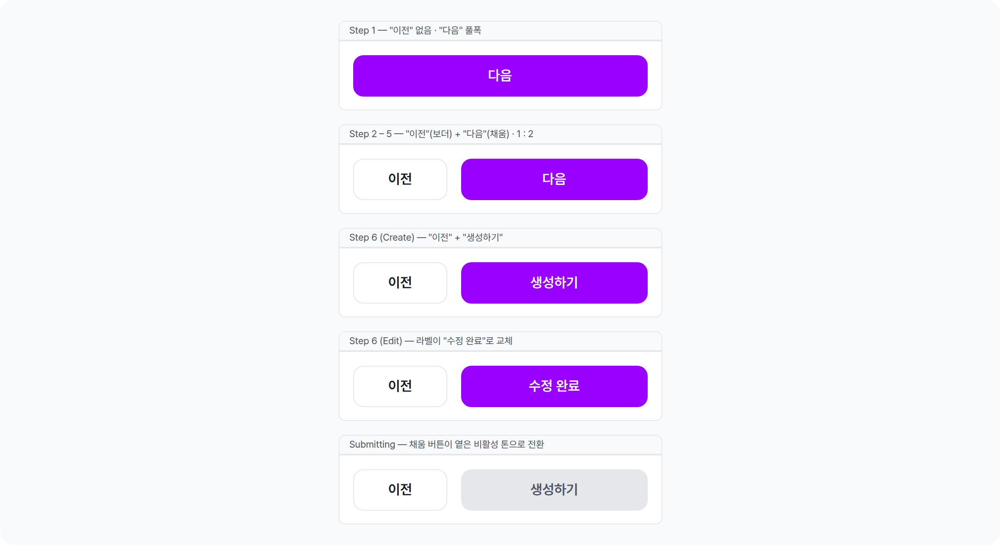

| Variant | Layout | 비주얼 단서 |
|---|---|---|
| Step 1 | Next 풀폭 (Prev 미노출) | 채움 버튼 한 개가 화면 폭 거의 전체를 차지 — "이제 시작" 인상. |
| Step 2 – 5 | Prev(보더) + Next(채움), 1 : 2 | 왼쪽 보더 버튼은 회색 톤, 오른쪽 채움 버튼만 강조 색 — "다음으로 가기"가 시각적으로 우선. |
| Step 6 — Create | Prev + Submit, 1 : 2 | 오른쪽 라벨이 "다음" → "생성하기"로 교체. 색·비율은 동일. |
| Step 6 — Edit | Prev + Submit, 1 : 2 | 오른쪽 라벨이 "수정 완료"로 교체. 수정 모드 진입 시에만 노출. |
| Submitting | Prev + Submit (disabled) | 오른쪽 채움 버튼이 옅은 회색 톤으로 빠지며, 동시에 화면 전체 위에 풀스크린 로딩 막이 떠 어떤 컨트롤도 반응하지 않음. |

※ 두 버튼의 height(48), radius(`radius-button = 12`), 사이 gap(`spacing-medium = 16`)은 모든 variant에서 동일. 변하는 것은 라벨 / 비율 / 채움 버튼의 색뿐.

🔄

## Global Behavior

cross-cutting — 모든 step에 적용되는 액션, motion, 글로벌 에지케이스. step별 액션은 위 mini-table 참고.

## Cross-cutting interactions

| 사용자 액션 | 화면에 보이는 결과 |
|---|---|
| 뒤로가기 (시스템 / AppBar back) | 별도의 종료 확인 다이얼로그 없이 파티 목록으로 복귀하며, 입력 중이던 값은 보존되지 않음. (향후 종료 확인 다이얼로그 추가 검토) |
| 다크 모드 토글 | AppBar / 본문 / 입력란 / 진행 바가 다크 톤으로 전환. 강조 색과 오류 색은 동일하게 식별 가능한 톤으로 유지. |
| "다음"을 빠르게 두 번 탭 | 두 번째 탭은 안전 처리되어 무시되며, 단계가 2칸 건너뛰지 않음. |

## Motion timing

Source: `shared/packages/mds/core/lib/src/theme/minglit_design_tokens.dart`

| Transition | Token / Duration | Notes |
|---|---|---|
| 단계 간 슬라이드 | MinglitAnimation.medium (350ms) | 다음으로 갈 때는 좌→우, 이전으로 돌아갈 때는 우→좌로 부드럽게 슬라이드. |
| 진행 바 채움 증감 | MinglitAnimation.medium (350ms) | 단계 슬라이드와 동시에 진행 바가 부드럽게 채워짐. |
| AppBar 타이틀 변경 | cut | 별도 페이드 없이 단계가 바뀌는 순간 즉시 교체. |
| 안내 토스트 등장 / 사라짐 | MinglitAnimation.fast (200ms) | 화면 하단에서 슬라이드 업으로 등장, 약 4초 후 자동으로 사라짐. |
| 풀스크린 로딩 등장 | MinglitAnimation.micro (100ms) | "생성하기"를 누른 직후 즉각적으로 페이드 인되어 사용자에게 빠른 피드백을 줌. |
| 검토 단계의 "수정" 탭 → 단계 점프 | MinglitAnimation.medium (350ms) | 해당 단계로 부드럽게 슬라이드 전환. |

## Global edge cases

-   **수정 모드 첫 진입** — 기존 파티를 수정하기 위해 들어오면 진입 직후 잠깐 풀스크린 스피너가 뜨고, 곧 1단계의 모든 입력란이 기존 값으로 채워진 채 노출됨.
-   **수정 모드 마지막 단계** — 마지막 단계의 "생성하기" 라벨이 "수정 완료"로 바뀌고, 성공 시 노출되는 토스트도 "파티 정보가 수정되었습니다."로 표기.
-   **단계 간 무결성** — 4단계에서 입장 그룹을 삭제하면 5단계의 그 그룹과 연결된 티켓의 대상 표기가 자동으로 비워져, 5단계로 돌아가면 사용자가 다시 지정해야 한다는 표시가 노출.
-   **비공개 파티** — 1단계의 비공개 토글을 켜면 메인 피드에는 노출되지 않으며 링크를 받은 사람만 접근 가능. 6단계 검토에서도 "비공개"로 표기됨.

📖

## Reference

implementation source + 인접 화면. Components / Tokens는 위 mini-table 참고.

## Implementation source

| Widget | PartyCreateWizardPage + Step1BasicInfo…Step6Review — apps/app_partner/lib/src/features/party/create/party_create_wizard_page.dart |
|---|---|
| Routes | PartyCreateRoute · PartyEditRoute (shared spec) · app_routes.dart |
| Controller | partyWizardControllerProvider — currentStep · validation · submitting · prefill / Edit 분기 (partyId 존재 여부) |
| Step models | WizardStep enum (basicInfo · location · capacityAndContact · entryRules · tickets · review) — UI에서 progress fill 계산 + AppBar title 분기 |
| Sub-sheets | 장소 검색 시트 · 입장 그룹 편집 시트 · 티켓 편집 시트 — 각각 별도 spec 후보 (현재 wizard 본체에 집중) |
| Global atom | GlobalLoadingOverlay (globalLoadingControllerProvider) — wizard 외 결제 / 인증에도 공유 사용 |
| Guard | _isNextingStep — double-tap 방지. step 전환 진행 중에 두 번째 "다음" 탭 ignore. |

## Related screens

| Spec | Relation |
|---|---|
| EventDetailPage | 이 위저드에서 생성된 파티/이벤트를 사용자가 보는 상세 화면. |
| SettlementDetailPage | 생성된 파티의 매출·정산을 파트너가 확인하는 화면. |
| Layout foundations | Scaffold + bottomNavigationBar 패턴 (탭바 없음 — 독립 wizard scaffold). |