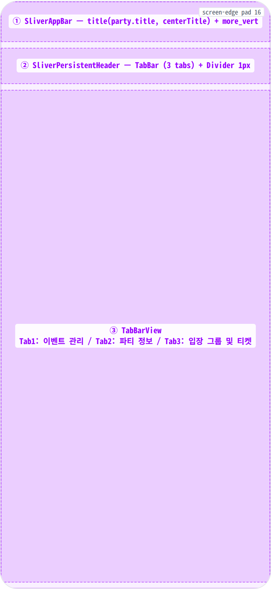
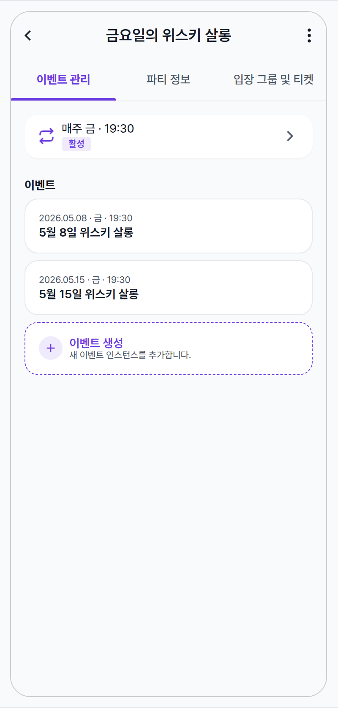
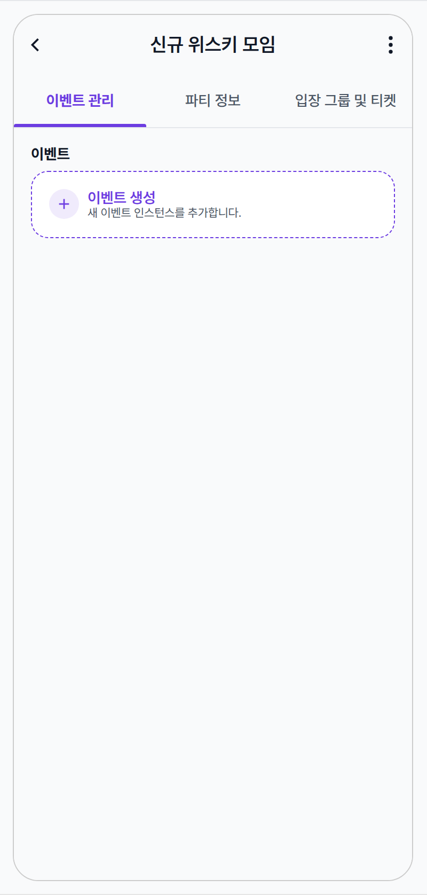
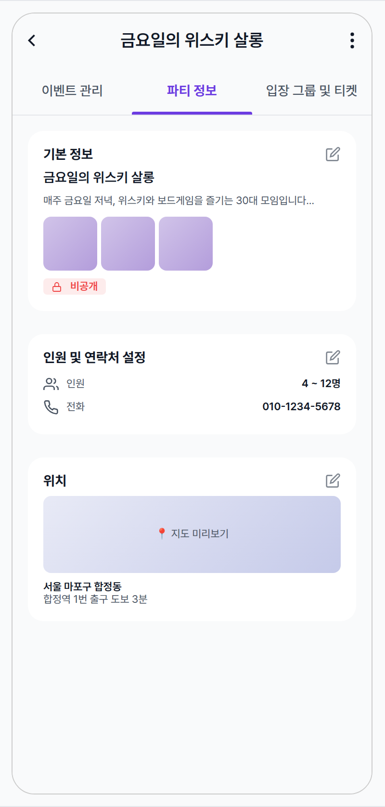
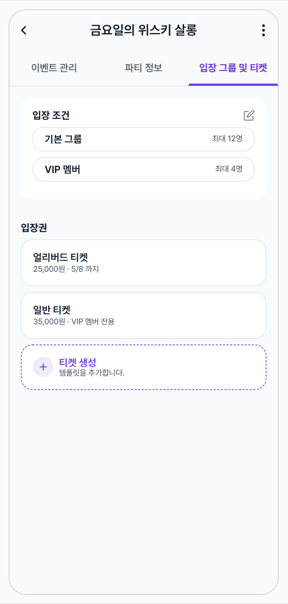
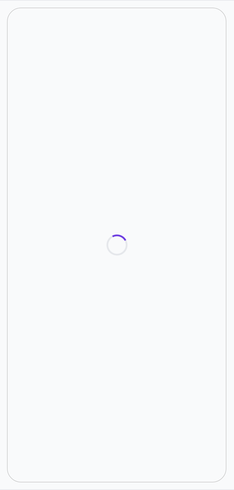
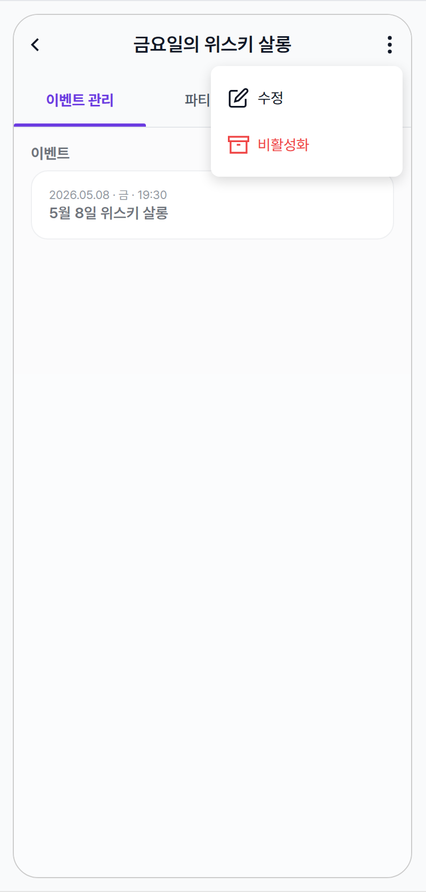

 Spec — PartyDetailPage (app\_partner · PartyDetailRoute)  

# Party Detail

## Overview

| Status | ✅ 디자인완료 — 6 state · 3-tab 파티 운영 콘솔 |
|---|---|
| App | app_partner |
| Category | party · detail / management |
| Route / Surface | PartyDetailRoute · widget: PartyDetailPage (3-tab DefaultTabController scaffold) |
| Path | /more/parties/:partyId |
| Hierarchy | Parent: PartyListPage (파티 목록에서 카드 탭 진입)Children: PartyEditRoute (편집 — wizard 재사용 spec) · EventCreateRoute · EventDetailRoute (Tab1) · RecurrenceManagementRoute (반복 규칙) · TicketCreateRoute / PartyTicketEditRoute (Tab3) · embedded modal screens: PartyBasicInfoEditScreen, PartyCapacityContactEditScreen, PartyLocationEditScreen, PartyEntryGroupManagementScreen (Tab2/Tab3 — Coordinator가 Navigator.push로 띄움, route 없음) |
| Purpose | 파트너가 자신이 만든 파티의 상세를 확인하고, 운영(이벤트 인스턴스 추가/관리), 정보(기본정보/인원·연락처/위치), 입장/티켓(입장 그룹/티켓) 세 영역을 탭으로 분리하여 편집한다. 파티 활성화/비활성화 toggle, 편집 진입의 hub. |
| User journey | Entry: PartyListPage에서 카드 탭.Exit: 뒤로가기 → 목록 / 메뉴 "수정" → PartyEditRoute / Tab1 "이벤트 생성" → EventCreateRoute / Tab1 카드 탭 → EventDetailRoute / Tab2 섹션 탭 → 모달 편집 화면 / Tab3 추가/탭 → 티켓·입장 그룹 화면. |
| Background | 파티는 파트너 운영의 최소 단위. 한 파티는 여러 event 인스턴스(반복/일회성)를 가지며, status는 active / closed 두 가지. more_vert 메뉴의 활성/비활성 항목은 status에 따라 한쪽만 노출됨 (party_detail_page.dart:61, :75 — conditional PopupMenuItem). |
| Frequency | 파트너의 파티 운영 중심 화면. 운영 기간 내 매일 1회 이상. |

## History

spec 주요 변경 이력. 최신 항목 위.

| Date | Version | Author | Changes |
|---|---|---|---|
| 2026-05-01 | 1.0 | mark-yun | v1.4 template으로 작성. 3-tab 구조(이벤트 관리 / 파티 정보 / 입장 그룹 및 티켓) + 6 state(Tab1 baseline · Tab1 빈 이벤트 · Tab2 · Tab3 · Loading · Overflow menu) mini-table per state. Partner 브랜드 indigo (--color-partner-primary) 적용 — 사용자 앱의 brand purple과 구분. |

[🧱 Layout](#layout) [🎨 States](#states) [🔄 Global Behavior](#behavior) [📖 Reference](#reference)

🧱

## Layout

화면 구조 — 영역, 정렬, 간격 규칙. 색·타이포 무시.

## Blueprint & tree

Scaffold + DefaultTabController(length: 3) + NestedScrollView. headerSliverBuilder에 SliverAppBar (pinned, centerTitle, more\_vert action) + SliverPersistentHeader(50px · TabBar + 1px Divider). body는 TabBarView 3개.

**DefaultTabController**(length: 3) └─ **Scaffold** └─ **body**: **MinglitAsyncValueWidget**(partyDetailProvider(partyId)) ├─ \[error\] Scaffold(simpleAppBar) + Center(error text) └─ \[data\] **NestedScrollView** ├─ **headerSliverBuilder**: │ ├─ **SliverAppBar**(pinned, centerTitle) ← ① │ │ ├─ title: Text(party.title) │ │ └─ actions: **PopupMenuButton**(more\_vert) │ │ ├─ "수정" (always) │ │ ├─ "활성화" — only if status=='closed' │ │ └─ "비활성화" — only if status=='active' (error color) │ └─ **SliverPersistentHeader**(pinned, 50) ← ② │ └─ Column │ ├─ **TabBar**(indicatorWeight:3 · sm h-padding) │ │ tabs: '이벤트 관리' · '파티 정보' · '입장 그룹 및 티켓' │ └─ Divider(1px · outlineVariant) └─ **body**: **TabBarView** ← ③ ├─ **PartyEventManagementTab** │ └─ SingleChildScrollView(pad: medium) │ ├─ RecurrenceRuleSummaryCard(partyId) \[hidden if rule==null/cancelled\] │ ├─ Text("이벤트", titleMedium) │ └─ MinglitAsyncValueWidget(partyEventsProvider) │ └─ PartyEventListSummary(events, onCreate, onTap) │ ├─ EventCard × N │ └─ AddActionCard("이벤트 생성") │ ├─ **PartyInfoTab** │ └─ SingleChildScrollView(pad: medium · bottom + safe-area) │ ├─ MinglitEditableSection("기본 정보") │ │ ├─ PartyBasicInfoSummary(title, description, images, status) │ │ └─ if isPrivate: MinglitTag("비공개", lock icon, error color) │ ├─ SizedBox(large=24) │ ├─ MinglitEditableSection("인원 및 연락처 설정") │ │ ├─ PartyCapacitySummary(min, max) │ │ └─ PartyContactSummary(contactOptions) │ ├─ SizedBox(large=24) │ └─ MinglitEditableSection("위치") │ └─ MinglitAsyncValueWidget(locationDetailProvider) │ └─ PartyLocationSummary(location, addressDetail, directions) │ └─ **PartyRuleManagementTab** └─ SingleChildScrollView(pad: medium) ├─ MinglitEditableSection("입장 조건") │ └─ PartyEntranceConditionSummary(entryGroups) ├─ SizedBox(xlarge=32) ├─ Text("입장권", titleMedium) └─ MinglitAsyncValueWidget(partyTicketsProvider) └─ PartyTicketsSummary(tickets, entryGroups, maxCapacity)

## Spacing & alignment rules

| # | Region | Alignment | Spacing |
|---|---|---|---|
| ① | SliverAppBar | 56px · centerTitle · pinned | 표준 AppBar. more_vert action 1개. surfaceTintColor: transparent (테마 default). 배경 = scaffold gray (테마 #1218). |
| ② | SliverPersistentHeader (TabBar) | min/maxExtent = 50 · 3 tab equal flex | TabBar.indicatorWeight: 3 · labelPadding: sm (12px) · 하단 1px Divider(outlineVariant.alpha(strong)) · 배경 = ColoredBox(scaffoldBackgroundColor). |
| — | Tab body (SingleChildScrollView) | column start · full-width scroll | 모든 탭 padding: spacing-medium (16px). Tab2만 bottom padding에 MediaQuery.paddingOf(context).bottom 추가 (safe-area · #1830). |
| — | MinglitEditableSection (Tab2/Tab3) | InkWell + Container(pad: medium) · 헤더(title + edit pencil) + child | section 간 gap: Tab2는 large (24px), Tab3는 xlarge (32px). 내부 title↔child gap: small (8px). edit icon 16px (outline). |
| — | RecurrenceRuleSummaryCard (Tab1) | Card + InkWell · h-pad medium · v-pad small | 아이콘 20px · 텍스트 column · trailing chevron. RecurrenceStatus.cancelled 또는 null이면 SizedBox.shrink. |
| — | EventCard / AddActionCard (Tab1) | Column · 카드 사이 spacing-small (8px) | AddActionCard는 dashed border (partner primary). |
| — | PartyEntryGroupListItem (Tab3) | Container border + radius-card · row layout | 카드 사이 spacing-small. 빈 상태 = 32px icon centered + 라벨. |

🎨

## States

3 탭 × 데이터 분기 + async lifecycle. baseline = Tab1 with-events (가장 많이 보는 화면).

**State 분기 기준**: 활성 탭(이벤트 관리 / 파티 정보 / 입장 그룹 및 티켓), 각 탭의 데이터 유무, 파티의 활성 / 비활성 / 비공개 여부에 따라 6가지 변형. 진입 직후 데이터를 가져오는 동안엔 로딩 상태가 잠시 노출된다.

### Tab1 · 이벤트 관리 (with events) 🎯 baseline · 활성 운영 중인 파티의 이벤트 탭

| 항목 | 내용 |
|---|---|
| 조건 | 파티 데이터가 도착했고, 활성 탭은 "이벤트 관리"이며, 이벤트가 한 개 이상 있고, 반복 규칙이 활성 상태로 설정되어 있는 일반적인 운영 모습. |
| 사용자 액션 | ① 다른 탭 헤더 탭 또는 좌우 스와이프 — "파티 정보" / "입장 그룹 및 티켓" 탭으로 부드럽게 전환.② AppBar 우상단 점 세 개 아이콘 탭 — 오버플로우 메뉴(아래 State 6)가 열림.③ 반복 카드 탭 — 반복 규칙 관리 화면으로 이동.④ 이벤트 카드 탭 — 해당 이벤트 상세 화면으로 이동.⑤ "이벤트 생성" 카드 탭 — 새 이벤트 만들기 화면으로 이동.⑥ 뒤로가기 — 파티 목록으로 복귀. |
| 에지케이스 | · 반복 규칙이 설정되지 않은 파티는 반복 카드 자체가 보이지 않음.· 반복 규칙을 가져오는 중이거나 실패한 경우에도 깜빡임 방지를 위해 카드 영역은 노출되지 않음.· 이벤트 목록을 가져오지 못하면 이벤트 영역에만 안내 메시지가 표시되고, 상단 AppBar / 탭 헤더는 그대로 유지됨. |
| 컴포넌트 | · SliverAppBar (pinned, centerTitle) + PopupMenuButton<String> (Icons.more_vert)· TabBar (3 tabs · indicatorWeight: 3 · labelPadding: sm)· RecurrenceRuleSummaryCard (Card + InkWell + Icons.event_repeat + MinglitTag)· PartyEventListSummary + 내부 EventCard(파트너 EventCard) · AddActionCard (dashed border)· MinglitAsyncValueWidget (events 로딩/에러) |
| 토큰 | · color: color-surface (Scaffold/AppBar/TabBar bg), color-background (Card bg), color-partner-primary (TabBar indicator/label · RecurrenceCard icon · AddActionCard border/icon · 활성 태그), color-text-primary/secondary, color-divider (TabBar 하단 divider)· radius: radius-card (16 · Card/EventCard/AddActionCard), radius-badge (4 · MinglitTag)· spacing: spacing-medium (16 · 콘텐츠 padding), spacing-large (24 · 섹션 gap), spacing-small (8 · 카드 사이), spacing-sm (12 · TabBar labelPadding)· typography: appBarTitle (18/600), titleMedium (16/700 · "이벤트" 헤더), bodyMedium (16/400), labelSmall (11/600 · MinglitTag) |
| 노트 | 📝 가장 많이 보는 화면. 다른 5개 state는 이 baseline에서 변경분만 표시.⚠️ 파트너 앱은 사용자 앱과 다른 보라색을 쓴다 — 강조 색이 한 톤 차분한 인디고 계열이다. 컴포넌트를 두 앱 사이에서 재사용할 땐 색 차이를 검증해야 함. |

### Tab1 · 이벤트 비어있음 파티를 갓 만들었거나 운영 중인 이벤트가 모두 마감된 직후

| 항목 | 내용 |
|---|---|
| 조건 | 이벤트가 한 개도 등록되어 있지 않고, 반복 규칙도 설정되어 있지 않은 상태. |
| 사용자 액션 | + "이벤트 생성" 카드 탭 — 첫 이벤트 만들기 화면으로 진입. 다른 동작은 baseline과 동일. |
| 에지케이스 | · 이벤트도 없고 반복 규칙도 없는 경우 — 화면에는 "이벤트 생성" 카드만 노출되어 거의 빈 화면이 됨.· 반복 규칙은 있는데 아직 첫 이벤트가 만들어지기 전 — 반복 카드 + "이벤트 생성" 카드 두 가지가 함께 노출됨. |
| 컴포넌트 | − RecurrenceRuleSummaryCard (rule 없음)− EventCard × N → 0개 |
| 토큰 | 동일 (사용 토큰 종류 변동 없음) |
| 노트 | 📝 신규 파티 직후 또는 운영 종료된 파티의 모습. CTA가 명확하므로 별도 빈 일러스트는 사용하지 않는다. |

### Tab2 · 파티 정보 기본 정보 · 인원·연락처 · 위치 세 섹션을 한 화면에서 확인·수정

| 항목 | 내용 |
|---|---|
| 조건 | 활성 탭이 "파티 정보"이고, 파티의 위치 정보가 정상적으로 도착해 지도 미리보기 + 주소가 표시되는 일반 상태. |
| 사용자 액션 | + 섹션 어디든 탭 — 해당 섹션 전용 편집 화면이 열림. ・ "기본 정보" 탭 — 제목 / 설명 / 사진 / 공개·비공개 편집 화면. ・ "인원 및 연락처" 탭 — 최소·최대 인원 / 연락 수단 편집 화면. ・ "위치" 탭 — 장소 편집 화면.상단 탭 헤더 / 점 세 개 메뉴 / 뒤로가기 동작은 baseline과 동일. |
| 에지케이스 | · 장소가 지정되지 않았거나 위치 정보를 못 받아온 경우 — "위치" 섹션 안에 안내 placeholder가 노출되며, 섹션 헤더와 편집 진입은 그대로 유지.· 설명 본문이 비어 있는 파티 — 본문 영역만 비어있는 상태로 노출됨.· 공개 파티 — "비공개" 뱃지는 노출되지 않음.· 마지막 섹션 아래에는 홈 인디케이터에 가리지 않을 정도의 여백이 확보됨. |
| 컴포넌트 | ↔ Tab body → PartyInfoTab+ MinglitEditableSection × 3 (InkWell · title + 16px edit pencil + child)+ PartyBasicInfoSummary (title + Quill description + image strip + status MinglitTag)+ PartyCapacitySummary + PartyContactSummary (icon + label + value rows)+ PartyLocationSummary + MinglitAsyncValueWidget+ 조건부 MinglitTag("비공개", Icons.lock, error color) when party.isPrivate |
| 토큰 | ↔ 섹션 bg → colorScheme.surfaceContainerLowest.withAlpha(strong) (light 테마에서 거의 white) · spec mockup은 color-background로 근사+ spacing-large (24 · Tab2 섹션 간 SizedBox)+ color-error (비공개 MinglitTag · 16px lock icon) |
| 노트 | 📝 화면 하단 여백은 홈 인디케이터에 마지막 섹션이 가리지 않을 정도로 추가 확보됨. |

### Tab3 · 입장 그룹 및 티켓 입장 조건과 발행한 티켓을 한 화면에서 관리

| 항목 | 내용 |
|---|---|
| 조건 | 활성 탭이 "입장 그룹 및 티켓"이고, 한 개 이상의 입장 그룹과 한 개 이상의 티켓이 등록되어 있는 일반 상태. |
| 사용자 액션 | + "입장 조건" 섹션 탭 — 입장 그룹 관리 화면이 열림.+ 티켓 행 탭 — 해당 티켓 편집 화면으로 이동.+ "티켓 생성" 카드 탭 — 새 티켓 만들기 화면이 열리고, 저장하고 돌아오면 티켓 목록에 즉시 반영됨. |
| 에지케이스 | · 입장 그룹이 한 개도 없는 경우 — "입장 조건" 섹션 안에 작은 아이콘 + 안내 라벨의 빈 안내가 노출됨.· 티켓이 없는 경우 — 티켓 행이 보이지 않고 "티켓 생성" 카드만 노출.· 티켓 목록을 못 가져온 경우 — 티켓 영역에만 안내 메시지가 표시되고 입장 조건 영역은 그대로 노출. |
| 컴포넌트 | ↔ Tab body → PartyRuleManagementTab+ MinglitEditableSection ("입장 조건")+ PartyEntranceConditionSummary (entry group list / 빈 placeholder)+ Plain Text("입장권", titleMedium) (이 섹션은 EditableSection 아닌 plain title)+ PartyTicketsSummary → 내부 TicketListView + AddActionCard |
| 토큰 | + spacing-xlarge (32 · 입장 조건 ↔ 입장권 섹션 gap — Tab2의 large(24)와 다름) |
| 노트 | 📝 "입장 조건" 섹션은 헤더 자체에 편집 펜 아이콘이 붙는 편집 가능한 섹션이지만, "입장권" 섹션은 같은 형식의 헤더가 아닌 단순 타이틀이라 시각 일관성이 살짝 부족 — 후속 정리 후보. 티켓 편집은 카드 행 탭과 "티켓 생성" 카드 두 경로로 진입. |

### Loading 화면 진입 직후 파티 정보를 가져오는 동안

| 항목 | 내용 |
|---|---|
| 조건 | 화면 진입 직후, 파티 정보가 도착하기 전까지의 짧은 대기 구간. |
| 사용자 액션 | 이 시점에는 시스템 뒤로가기로만 이탈 가능. 화면 안에는 스피너 외 별도 컨트롤이 없음. |
| 에지케이스 | 가져오기 실패 시 — 빈 AppBar 위에 가운데 정렬 안내 메시지가 뜨는 단순한 오류 화면으로 전환. |
| 컴포넌트 | ↔ NestedScrollView 전체 → MinglitAsyncValueWidget 기본 loading (CircularProgressIndicator)− AppBar / TabBar / 모든 탭 content (Scaffold body 아래에 아직 그려지지 않음) |
| 토큰 | ↔ 모든 탭 토큰 미사용. 스피너만 color-partner-primary(top color) + color-divider(track) |
| 노트 | 📝 데이터가 도착하기 전엔 상단 AppBar / 탭 헤더도 아직 그려지지 않은 상태. 가져오기 실패 시엔 빈 AppBar + 가운데 정렬 안내 메시지로 대체된다. |

### Overflow Popup Menu AppBar 우상단 점 세 개 아이콘 탭 시 열리는 메뉴

| 항목 | 내용 |
|---|---|
| 조건 | 이전 4개 일반 상태에서 점 세 개 아이콘을 탭한 직후. 메뉴는 항상 "수정"을 보여주며, 운영중인 파티에는 "비활성화"가, 종료된 파티에는 "활성화"가 함께 노출된다 (둘 중 하나만). |
| 사용자 액션 | ① "수정" 탭 — 파티 편집 위저드(생성 위저드와 같은 화면)로 이동.② "비활성화" 탭 — 파티 상태가 즉시 종료로 바뀌고 화면이 자동으로 갱신, 성공 안내 토스트가 잠시 노출.③ "활성화" 탭 — 파티 상태가 즉시 운영중으로 바뀌고 화면이 자동 갱신.④ 메뉴 바깥 영역 탭 / 뒤로가기 — 메뉴가 닫힘. |
| 에지케이스 | · 상태 변경 중 네트워크 오류가 나면 안내 다이얼로그가 뜨고, 파티 상태는 변경되지 않음.· 알 수 없는 상태값을 가진 파티는 "수정"만 노출되고 활성화/비활성화 항목은 표시되지 않음.· 다른 탭(파티 정보 / 입장 그룹 및 티켓)에서도 동일하게 동작 — 메뉴는 활성 탭과 무관하게 AppBar에서 열림. |
| 컴포넌트 | + PopupMenuButton<String> (Icons.more_vert)+ PopupMenuItem × 2 (조건부) — 각 항목은 Row(Icon 20px + sm gap + Text)+ 비활성화 항목은 colorScheme.error 컬러의 icon + bodyMedium text |
| 토큰 | + color-error ("비활성화" 행 — icon + text)+ Material 기본 popup elevation 8 + radius-small (4)+ MinglitIconSize.small (20 · popup item icon) · spacing-small (8 · icon↔text gap) |
| 노트 | 📝 활성/비활성 토글은 운영중 / 종료 두 가지 상태에 한해서만 노출되며, 그 외 상태에서는 "수정"만 보인다. 토글 결과는 즉시 화면에 반영된다. |

🔄

## Global Behavior

cross-cutting — 모든 state에 적용되는 액션, motion, 글로벌 에지케이스. 각 state 한정 액션은 위 mini-table 참고.

## Cross-cutting interactions

| 사용자 액션 | 화면에 보이는 결과 |
|---|---|
| 뒤로가기 (시스템 / AppBar back) | 파티 목록 화면으로 복귀. 다시 들어오면 화면 스크롤은 처음 위치로 돌아옴. |
| 탭 헤더 탭 또는 좌우 스와이프 | 탭 본문이 새 탭으로 부드럽게 슬라이드. 상단 AppBar / 탭 헤더는 고정. 마운트된 동안 각 탭의 스크롤 위치는 유지됨. |
| 오버플로우 메뉴 — 활성화 / 비활성화 성공 | 화면이 자동으로 새 상태에 맞게 갱신되고, 성공 안내 토스트가 잠시 노출됨. |
| 탭 안 어떤 섹션이든 편집 후 저장 | 편집 화면에서 빠져나오면 해당 영역이 즉시 새 값으로 갱신됨 — 기본 정보 / 인원·연락처 / 위치 / 입장 그룹 / 티켓 모두 동일한 패턴. |
| 다크 모드 토글 | 화면 / AppBar / 탭 헤더 / 카드 배경이 다크 톤으로 전환. 탭 표시선과 라벨은 파트너 다크 톤의 보라로 자동 전환됨. |

## Motion timing

Source: `shared/packages/mds/core/lib/src/theme/minglit_design_tokens.dart` → `MinglitAnimation`

| Transition | Token / Duration | Notes |
|---|---|---|
| 화면 진입 (목록 → 상세) | shared-axis scaled (~300ms) | 들어오는 화면이 살짝 확대되며 자연스럽게 들어오는 표준 전환. |
| 탭 슬라이드 | MinglitAnimation.fast (200ms) | 탭 본문이 좌우로 슬라이드되며 표시선이 따라 이동. |
| Loading → 데이터 표시 | cut (no animation) | 별도 전환 없이 즉시 교체. |
| 오버플로우 메뉴 열기 / 닫기 | MinglitAnimation.fast (200ms) | 점 세 개 위치에서 자연스럽게 페이드 + 살짝 확대되며 열림. |
| 섹션 편집 화면 진입 | MinglitAnimation.medium (350ms) | 우→좌 슬라이드 기본 푸시. |

## Global edge cases

-   **파티 정보 로드 실패** — 본문이 빈 AppBar + 가운데 정렬 안내 메시지의 단순한 오류 화면으로 대체. 이 경우 탭 헤더는 그려지지 않는다.
-   **활성화 / 비활성화 처리 중** — 화면 전체에 잠시 풀스크린 로딩 오버레이가 노출되며, 실패하면 안내 다이얼로그가 뜨고 상태는 변경되지 않는다.
-   **탭 진입은 항상 첫 번째 탭에서** — 외부에서 특정 탭으로 직접 진입하는 길은 없으며, 화면을 다시 들어오면 항상 "이벤트 관리" 탭에서 시작.
-   **반복 카드 가시성** — 반복 규칙이 없거나 정리되었거나, 잠시 가져오는 중·실패한 경우 모두 카드가 보이지 않음. 사용자 입장에서는 동일하게 일회성 파티처럼 보인다.

📖

## Reference

implementation source + 인접 화면. Components / Tokens는 위 mini-table 참고.

## Implementation source

| Widget | PartyDetailPage — apps/app_partner/lib/src/features/party/detail/party_detail_page.dart |
|---|---|
| Tabs | PartyEventManagementTab · PartyInfoTab · PartyRuleManagementTab — apps/app_partner/lib/src/features/party/detail/tabs/ |
| Coordinator | PartyDetailCoordinator (partyDetailCoordinatorProvider) — edit modal push + activate/deactivate + sub-route navigation |
| Route | PartyDetailRoute · /more/parties/:partyId · app_routes.dart |
| Provider | partyDetailProvider(partyId) · partyEventsProvider(partyId) · partyTicketsProvider(partyId) · locationDetailProvider(locationId) · partyRecurrenceRuleProvider(partyId) |
| Repository | partyRepository (status / capacity / location / entry groups update) · ticketRepository (template create) · locationRepository |
| Theme | MinglitTheme.partnerTheme (light) / partnerThemeDark (dark) — primary = MinglitPartnerColors.primary (#6c3ce1) · spec var: --color-partner-primary |
| ⚠️ 알려진 drift / 의문점 | · Tab3에서 "입장 조건"은 MinglitEditableSection(InkWell + edit pencil)이지만 "입장권"은 plain Text(titleMedium) — 일관성 부족.· Tab1의 "이벤트" 헤더도 plain Text. EditableSection 미적용 — 의도된 차이인지 검토 대상.· party_create_wizard_page spec은 --color-primary(user purple)을 사용 — partner indigo로 마이그레이션 후속 권장. |

## Related screens

| Spec | Relation |
|---|---|
| PartyCreateWizardPage | 이 화면의 상위(파티 생성) + PartyEditRoute가 같은 wizard로 진입 (편집 모드). |
| EventDetailPage | Tab1의 EventCard 탭 → 이 spec으로 이동. 단, 그 spec은 user-app 화면 — partner의 EventDetailPage는 별도(같은 라우트 이름, 다른 위젯). |
| SettlementDetailPage | 이 파티의 매출이 정산되는 하류 화면. 동일 partner 앱. |