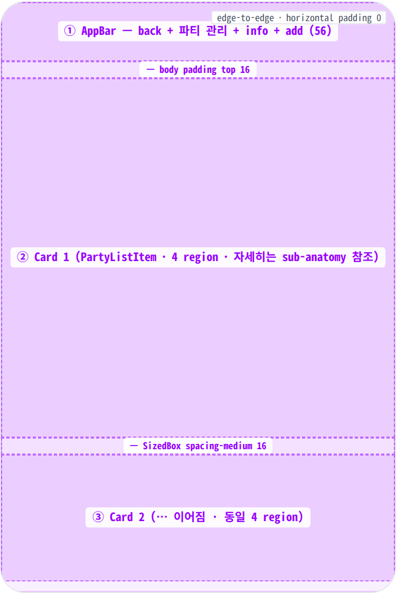
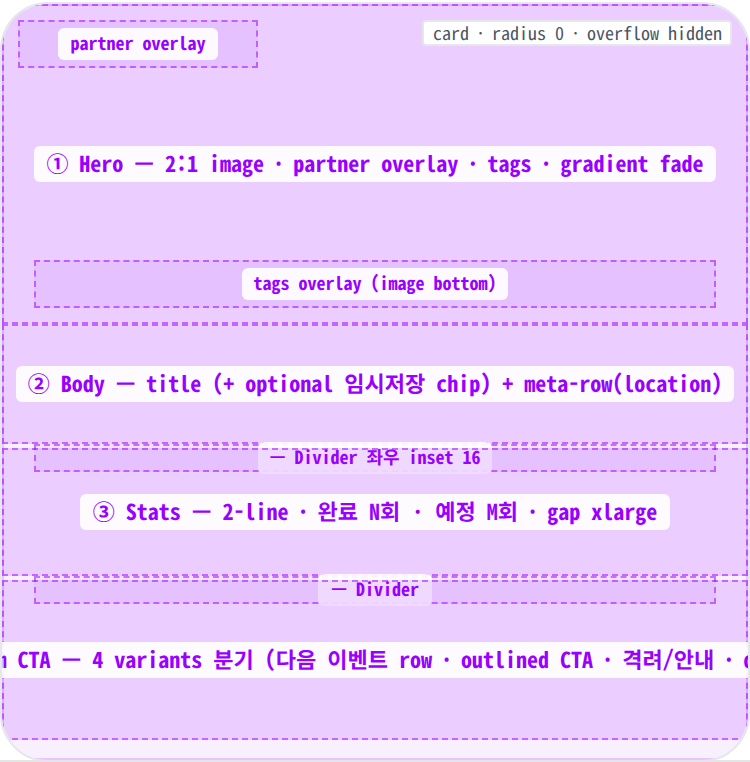
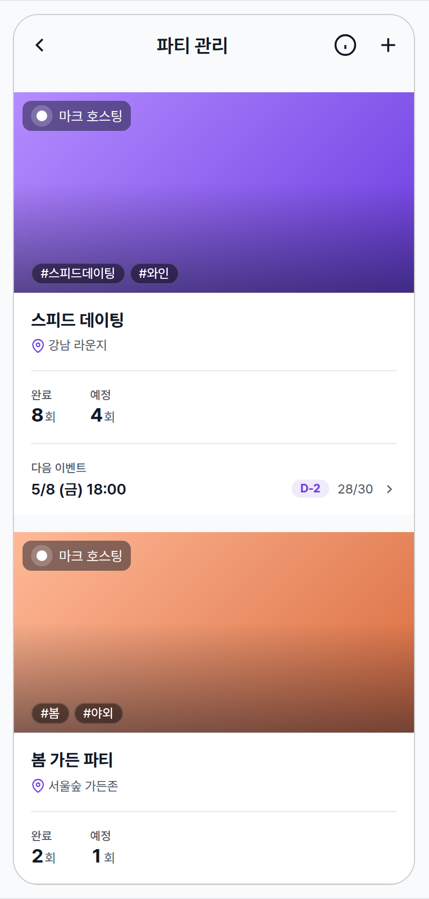
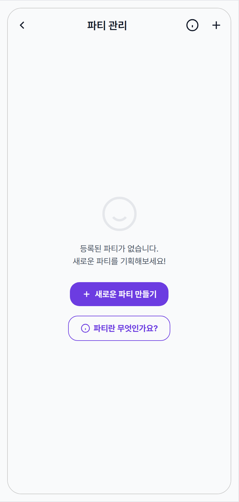
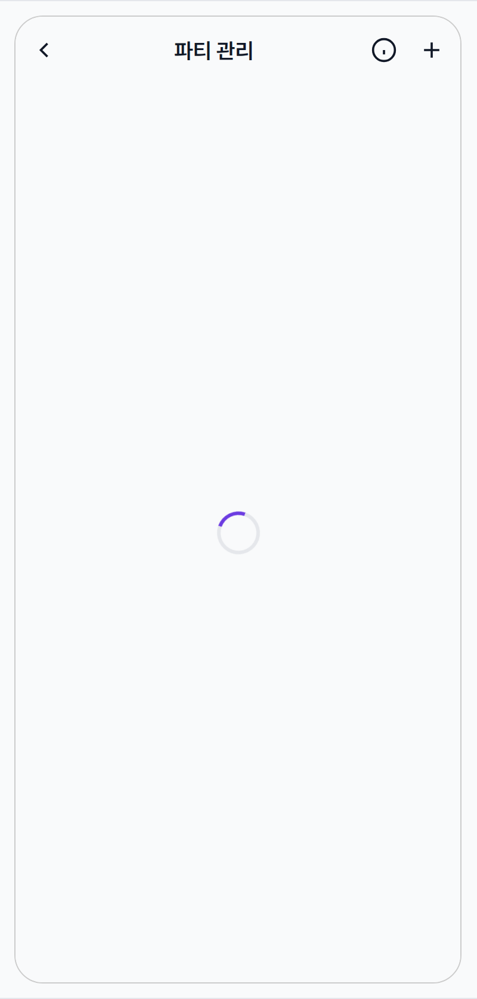
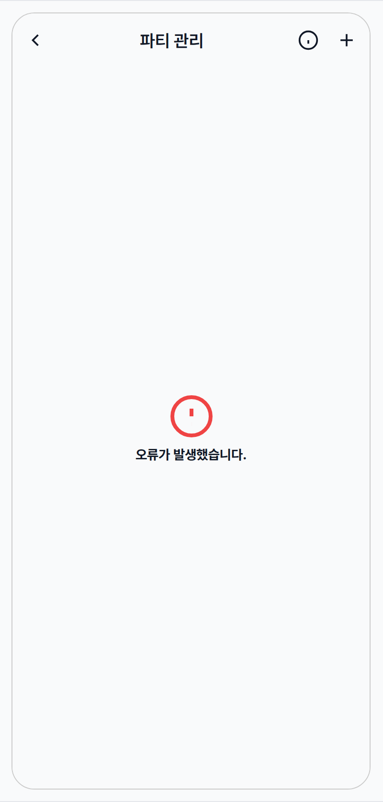
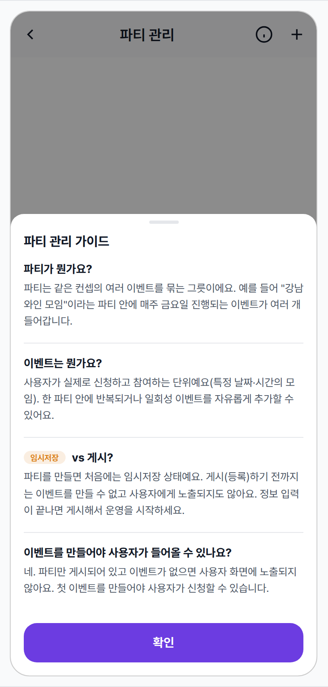

 Spec — PartyListPage (app\_partner · PartyListRoute)  

# Party List

## Overview

| Status | 📝 Redesign — v2 (event-feed hero · stats · variants CTA · help sheet · 5 states) |
|---|---|
| App | app_partner |
| Category | party · list / management |
| Route / Surface | PartyListRoute · widget: PartyListPage (ConsumerWidget · Scaffold + ListView.separated) |
| Path | /more/parties |
| Hierarchy | Parent: PartnerHomePage (더보기 탭 → "파티 관리" 메뉴 또는 EventActionCardEmpty / TodoSummaryChips → 파티 리스트)Children: PartyDetailRoute (카드 hero/body 탭), EventDetailRoute ("다음 이벤트" row 탭), PartyCreateRoute (AppBar add 또는 Empty CTA), 이벤트 생성 흐름(예정 0건 파티 카드 CTA — 후속 spec) · Help bottom sheet(AppBar info 또는 Empty help 탭 — modal · State 5) |
| Purpose | 파트너가 자신의 파티(이벤트의 상위 컨테이너)를 한 번에 둘러보고 운영할 곳으로 들어가는 진입 화면. 각 카드에서 파티 이미지 · 상태 배지 · 위치 / 정원 / 조건 / 인증 요구 chip을 한눈에 보고, 탭하여 PartyDetailPage(3-tab 운영 콘솔)로 push. |
| User journey | Entry points: PartnerHomePage 더보기 탭의 "파티 관리", Onboarding 직후 "첫 파티 만들기" 후 복귀, EventActionCardEmpty의 파티 선택 시트에서 "전체 보기".Exit points: 카드 hero/body 탭 → PartyDetailRoute · "다음 이벤트" row 탭 → EventDetailRoute · 그룹 CTA "이벤트 만들기/생성하기" → 이벤트 생성 흐름 · AppBar add 또는 Empty CTA → PartyCreateRoute · AppBar info 또는 Empty help → Help bottom sheet · 뒤로가기 → MorePage. |
| Background | v1은 16:9 이미지 + status badge + 좋아요 + chip group을 한 카드에 가득 채운 정보 밀도형 디자인이었다. 그러나 운영자 CUJ 분석 결과 (1) 좋아요는 자기 파티에 무의미, (2) 조건/인증 chip은 detail 페이지에서 충분, (3) 16:9 이미지가 자리를 너무 많이 차지함. 또한 "활성 상태"는 파티 자체 상태가 아니라 이벤트 활동도라 모호.v2는 일정 overview 중심으로 재설계. 카드는 (a) event-feed 스타일 hero(2:1 image + partner overlay + tags) + (b) 통계(완료/예정 N회) + (c) 다음 이벤트 한 줄 + (d) 변형 CTA로 구성. 카드는 edge-to-edge · radius 0 · 좌우 inset divider로 모바일 list view 자연스러움. AppBar의 QR 액션은 list view 컨텍스트와 부적합해 제거하고 그 자리에 info 아이콘을 두어 파트너 앱 전체 도움말 패턴 진입점으로 활용. |
| Frequency | 운영 중인 파트너가 매일 1회 이상 진입. 파티가 0개일 때는 onboarding 직후 한 번 빈 화면을 거친다. |

## History

spec 주요 변경 이력. 최신 항목 위.

| Date | Version | Author | Changes |
|---|---|---|---|
| 2026-05-05 | v2 (redesign) | mark-yun | 일정 overview 중심으로 카드 재설계. 16:9 image overlay 모델 → event-feed 스타일 hero(2:1 + partner overlay + tags) + body + 통계(완료/예정 N회 2-line) + 변형 CTA(다음 이벤트 row · 이벤트 생성하기 / 만들기 / disabled). edge-to-edge 카드 + 좌우 inset divider. AppBar QR → info 아이콘으로 교체(파트너 앱 도움말 패턴 진입). MinglitDDayChip(today/soon/later tier) 컴포넌트 추출. State 5 Help bottom sheet 신규(MinglitHelpSheet 컴포넌트 후보). State 2 Empty에 outlined help 버튼 추가. |
| 2026-05-01 | 1.0 | mark-yun | v1.4 template으로 작성. 4 state(Default(파티 ≥ 1) · Empty · Loading · Error) mini-table per state, baseline = Default. Partner brand indigo (--color-partner-primary · #6c3ce1) viewport-scoped 적용 — user app primary(#9900ff)와 명시적으로 분리. |

[🧱 Layout](#layout) [🎨 States](#states) [🔄 Global Behavior](#behavior) [📖 Reference](#reference)

🧱

## Layout

화면 구조 — 영역, 정렬, 간격 규칙. 색·타이포 무시.

## Blueprint & tree

`simpleAppBar`(centerTitle · back + info + add) + body `MinglitAsyncValueWidget` wrapping `ListView`. 카드(`PartyListItem`)는 edge-to-edge(horizontal padding 0) · radius 0 · overflow hidden · gap medium 사이. 카드는 4 region(Hero / Body / Stats / Bottom CTA) + region 사이 좌우 inset 16 divider.

**Scaffold** ├─ **appBar**: MinglitTheme.simpleAppBar(centerTitle:true) ← ① │ ├─ title: Text('파티 관리') │ ├─ leading: BackButton (auto) │ └─ actions: \[ │ IconButton(info\_outline) → showMinglitHelpSheet(...), │ IconButton(add) → coordinator.goToCreate, │ \] ├─ **body**: MinglitAsyncValueWidget<List<Party>>(value: partyListProvider) │ ├─ loading → MinglitCircularProgressIndicator (centered) │ ├─ error → \_DefaultErrorView (titleMedium + 본문 caption) │ └─ data: │ ├─ if parties.isEmpty → Center(Column \[ │ │ icon 64 · text · MinglitButton "+ 새로운 파티 만들기" filled │ │ · MinglitButton "파티란 무엇인가요?" outlined → showMinglitHelpSheet(...) │ │ \]) ← Empty state (사이즈 통일된 두 CTA) │ │ │ └─ else → ListView( │ padding: only(top: medium · bottom: large) │ children: \[parties.map((p) => Padding(margin-bottom: medium, child: PartyListItem(party: p)))\] │ ) │ └─ **PartyListItem** — 자세한 트리는 PartyListItem sub-anatomy 참조 ← ②/③

## Spacing & alignment rules

| # | Region | Alignment | Spacing |
|---|---|---|---|
| ① | AppBar (simpleAppBar) | height 56 · centerTitle · back leading · 2 actions trailing | bg = scaffold(--color-surface) · surfaceTint transparent · no border-bottom · icon size 22~24 |
| — | ListView | fill body · vertical scroll | padding only(bottom: spacing-large(24)) · 좌우 0 · 상단 0 |
| ②/⑤ | PartyListItem · Card | edge-to-edge · radius 0 · elevation 0 · clip antiAlias | margin: vertical xsmall(4) · horizontal 0 |
| — | Card · Header | row · 타이틀 expanded · chevron 우측 | padding: H medium(16) · V medium(16) · 타이틀↔chev: small(8) |
| ③/⑥ | Card · Media (Stack) | aspectRatio 16/9 · fit expand | image cover · gradient overlay 60%~100% (top→bottom · 0 → onSurface 0.5) |
| — | Card · Content layer | position fill · column stretch · top status / like row · bottom Wrap | padding all medium(16) · 위 행과 chip 사이 Spacer로 분배 |
| — | Status badge | row · text only · top-left | padding: H small(8) · V xxsmall(2) · radius small(8) · shadow blur 4 · offset (0,2) · color tertiary/outline/secondary |
| — | Inter-card gap | vertical breathing | 각 카드 margin-bottom: spacing-medium (16) · body 자체는 horizontal padding 0 (edge-to-edge) |

## PartyListItem sub-anatomy

카드는 4 region(Hero / Body / Stats / Bottom CTA) + region 사이 좌우 inset divider. 모든 카드 동일 구조 — Bottom CTA region이 4 variants로 분기.

**PartyListItem** (4-region · radius 0 · overflow hidden) └─ **InkWell** wrap └─ **Column**(stretch) ├─ _① Hero_ — `.event-card__image`(2:1 · cover) Stack \[ │ │ `.event-card__image-gradient`(bottom 45%→100% scrim), │ │ `.event-card__partner-overlay`(top-left · avatar 20×20 + 운영자 이름), │ │ `.event-card__tags`(bottom · #태그 chip × max 3 · backdrop blur), │ │ \] │ · 이미지 없으면 `--placeholder` (divider tint bg + "이미지 없음" caption · partner overlay 그대로) │ · 탭 → PartyDetailRoute push │ ├─ _② Body_ — Padding(medium) → Column(gap 6) \[ │ │ _title-row_: Text(party.title · titleMedium bold · ellipsis) + optional `.pl-chip-draft`("임시저장" amber chip), │ │ _meta-row_: location icon(13 partner-primary) + Text(party.location · bodySmall secondary · ellipsis), │ │ \] │ · 탭 → PartyDetailRoute (hero와 동일) │ ├─ _Divider_ — height 1 · color divider · margin 0 medium (좌우 16 inset) │ ├─ _③ Stats_ — Padding(medium) → Row(gap xlarge · align flex-start) \[ │ │ `.pl-stat`: `.pl-stat__lbl`("완료" 11/500 secondary) 위 + `.pl-stat__num-row`(`.pl-stat__num` 18/700 primary + `.pl-stat__suffix` "회" 12/regular secondary) 아래, │ │ `.pl-stat`: 동일 · "예정" + N회, │ │ \] │ ├─ _Divider_ │ └─ _④ Bottom CTA_ — variant 분기: ├─ (a) 예정 ≥1 → `.pl-event`(2-line · 라벨 + row\[date · **MinglitDDayChip** · 정원 · chevron\]) → EventDetailRoute push ├─ (b) 예정 0, 완료 ≥1 → `.pl-cta`(outlined "이벤트 생성하기 →") → 이벤트 생성 흐름 ├─ (c) published 0/0 → `.pl-empty-msg`("첫 이벤트를 만들어 호스팅해보세요!" 12 secondary) + `.pl-cta`(outlined "이벤트 만들기 →") └─ (d) draft 0/0 → `.pl-empty-msg--draft`("임시저장 중이에요. 파티를 먼저 등록..." 12 warning) + `.pl-cta--disabled`("이벤트 만들기" 회색)

| Region | Alignment | Notes |
|---|---|---|
| 1. Hero — event-card 차용 | full-width 2:1 · 풀-블리드 | .event-card__image(2:1 · cover) + .event-card__image-gradient(bottom 45%→100% scrim) + .event-card__partner-overlay(top-left · partner avatar 20×20 + 이름 chipLabel · onSurface 0.5 bg · radius-small) + .event-card__tags(bottom · #태그 chip × max 3 · backdrop-blur · radius-chip). 이미지 없으면 --placeholder 변형 — divider tint bg + "이미지 없음" caption. |
| 2. Body — title + meta-row | padding medium (16) · column · gap 6px | .event-card__title-row: 파티 이름(titleMedium 16/700 · ellipsis) + 옵션 .pl-chip-draft(임시저장 amber chip 10/600 · 12% bg) · .event-card__meta-row: location icon(13 · partner-primary) + 위치 텍스트(bodySmall 12 · secondary · ellipsis). |
| 3. Stats — 2줄 (라벨/숫자) | row · gap xlarge · padding medium | 각 stat: .pl-stat__lbl(11/500 secondary · "완료" / "예정") 위, .pl-stat__num-row(.pl-stat__num 18/700 primary + .pl-stat__suffix 12/regular secondary "회") 아래. tabular-nums로 숫자 자릿수 정렬. |
| 4. Bottom CTA — variants | — | 예정 이벤트 유무 + 파티 status에 따라 4 variant:(a) 다음 이벤트 row (예정 ≥1) — .pl-event 2-line: 라벨 "다음 이벤트" 위 · 정보 row(.pl-event__date + .pl-dday-chip + .pl-event__cap + chevron) 아래. row 자체가 clickable.(b) "이벤트 생성하기" CTA (예정 0, 완료 ≥1) — .pl-cta outlined primary, height 44, margin medium.(c) 격려 + "이벤트 만들기" CTA (published 신규, 0/0) — 격려 카피 .pl-empty-msg("첫 이벤트를 만들어 호스팅해보세요!" 12/secondary) + .pl-cta active.(d) 안내 + 비활성 CTA (draft, 0/0) — 안내 카피 .pl-empty-msg--draft("임시저장 중이에요. 파티를 먼저 등록하면..." 12/warning) + .pl-cta--disabled (divider border + secondary text). |
| — | Region divider | 좌우 inset 16 | .pl-card__divider: height 1px · color --color-divider · margin 0 medium (좌우 16 inset, edge-to-edge가 아닌 inset 처리). Hero ↔ Body 사이는 divider 없음(이미지 자체가 divider 역할). |

D-day chip tier (MinglitDDayChip 컴포넌트)

| Tier | 조건 | 톤 |
|---|---|---|
| --today | D-0 (오늘) | color --color-warning · bg 12-15% — 임박 |
| --soon | D-1 ~ D-7 (이번 주) | color --color-partner-primary · bg 10% — 액션 영역 |
| --later | D-8+ (먼 미래) | color --color-text-secondary · bg --color-divider — 차분 |
| (노출 X) | D-N < 0 (종료) | chip 자체 노출 X · "다음 이벤트" 자체가 미래만 가리키므로 음수는 발생하지 않음 |

## AppBar sub-anatomy

파트너 앱 simpleAppBar — back leading + centered title + 우측 actions(info + add). 글로벌 일관 패턴이라 모든 파트너 화면이 동일 구조를 따른다 (info icon은 화면별 컨텍스트 도움말 sheet 트리거).

| Region | Alignment | Notes |
|---|---|---|
| ① Back (leading) | 좌측 · 40×40 hit-region · auto pop | back arrow 22×22 · color --color-text-primary · push 진입 시 자동 노출. 진입 경로(MorePage / Onboarding 등)로 복귀. |
| ② Title (centered) | 중앙 정렬 · 1줄 | "파티 관리" · --typography-font-size-app-bar-title 18 · w600 · color-text-primary. 절대 변경되지 않는 페이지 식별자. |
| ③ Info action (1st trailing) | 우측 · 40×40 hit-region | info_outline 22×22 · 탭 시 도움말 bottom sheet 진입 (State 5). 파트너 앱 모든 화면에 동일 패턴 적용 — 각 화면별 컨텍스트 도움말 콘텐츠는 호출 측에서 정의. |
| ④ Add action (2nd trailing) | 우측 · 40×40 hit-region · 가장 우측 | add 아이콘 22×22 · 탭 시 PartyCreateRoute push (새 파티 만들기). info 다음 위치라 "도움말 → 액션" 순서가 자연스러움. |
| — | AppBar bg | scaffold gray와 동일 | --color-surface · surfaceTint transparent · border-bottom 없음. 본문 카드와 시각적 분리는 색 대비로만. |

**QR 액션 제거 — 도움말 패턴으로 대체:** 이전 버전(v1)의 QR 스캔 아이콘은 글로벌 체크인 진입점이었으나 list view 컨텍스트에서 부적절(어느 파티의 체크인인지 불명) → 제거. 그 자리에 info 아이콘을 두어 파트너 앱 전체 도움말 패턴의 진입점으로 활용.

## Empty state sub-anatomy

등록된 파티 0건 시 화면. icon + 격려 카피 + 두 개의 동일 사이즈 CTA(filled primary + outlined help)로 구성. 두 CTA는 동선이 다름 — 액션 vs 학습.

| Region | Alignment | Notes |
|---|---|---|
| ① Icon | 중앙 정렬 · 64×64 | smile_outline 64 · --color-divider 톤 · 진단/오류가 아닌 빈 상태 시그널 — 톤 차분히. 이미지 없이 outline 아이콘만. |
| ② Caption | 중앙 정렬 · pre-line · 2줄 | "등록된 파티가 없습니다." + "새로운 파티를 기획해보세요!" · bodyMedium 14 · color-text-secondary · line-height 1.5. actionable 톤(왜 비어있고 무엇을 해야 하는지). |
| ③ Primary CTA | 중앙 정렬 · margin-top small | "+ 새로운 파티 만들기" · .pl-empty__cta · filled --color-partner-primary · padding 12/20 · 14/700 white · PartyCreateRoute push. |
| ④ Secondary help | 중앙 정렬 · primary 아래 | "info icon + 파티란 무엇인가요?" · .pl-empty__help · outlined --color-partner-primary · padding 12/20 (③와 동일 사이즈) · 14/700 partner-primary · 탭 시 도움말 bottom sheet (State 5)와 동일 시트 진입. |
| — | CTA pair gap | vertical · spacing-small (8) | 두 버튼 사이 8px gap · 사이즈 통일로 시각 페어링 — 액션(filled)과 학습(outlined)이 동등한 진입 옵션임을 시그널. |

## Help bottom sheet sub-anatomy _(MinglitHelpSheet 컴포넌트 후보)_

info 아이콘 또는 Empty의 help 버튼 탭 시 노출되는 컨텍스트 도움말 sheet. 첫 사용자가 가질 만한 Q&A 4개 시퀀스 (개념 → 용어 → 상태 → 핵심 규칙). 파트너 앱 모든 주요 화면에서 같은 chrome 재사용 — 화면별 sections 콘텐츠만 다름.

| Region | Alignment | Notes |
|---|---|---|
| ① Scrim (barrier) | full-screen overlay | rgba(0,0,0,0.45) · 하단 정렬 컨테이너 · 탭 시 sheet dismiss (gesture path). |
| ② Sheet container | bottom-anchored · max-height 75% | bg --color-background · 상단 모서리 radius-card 16 · column flex (handle / header / body / cta). |
| ③ Handle bar | 중앙 정렬 | 36×4 · radius 2 · --color-divider · margin small/xsmall — drag-down dismiss affordance. |
| ④ Header | 좌측 정렬 · 단독 한 줄 | "파티 관리 가이드" · 16/700 primary · padding small/medium · close ✕ 없음(handle/scrim/CTA로 dismiss). |
| ⑤ Body (scrollable) | flex 1 · 세로 스크롤 | padding 0/medium · 항목 사이 1px --color-divider top border (첫 항목 제외) · sections list. 항목 많을 때 sheet 안 스크롤(외부 화면 잠금). |
| ⑥ Section title | row · 14/700 primary | 옵션 prefix(아이콘 18×18 partner-primary 또는 inline chip 예: .pl-chip-draft) + 질문문 · 첫 사용자가 가질 만한 자연어 Q ("파티가 뭔가요?" 등). |
| ⑦ Section body | 좌측 정렬 · 13 secondary | line-height 1.55 · 1-3문장 답변 · 친근한 톤. 인라인 링크는 partner-primary underline (선택). |
| ⑧ Confirm CTA | bottom · sticky · margin medium | "확인" · filled partner-primary · height 48 · 15/700 white · primary dismiss path (handle/scrim은 보조). |

Sections 콘텐츠 구성 원칙 (첫 사용자 mental flow)

| Order | Q (section title) | Answer 가이드 |
|---|---|---|
| 1 | "파티가 뭔가요?" | 핵심 개념(컨테이너) + 한 줄 비유 (예: "와인 모임 파티 안에 매주 금요일 이벤트") |
| 2 | "이벤트는 뭔가요?" | 사용자 신청 단위 + 파티와 관계 (한 파티 안에 여러 이벤트 가능) |
| 3 | "임시저장 vs 게시?" | chip inline + 차이 + "게시해야 운영 시작" 결론 |
| 4 | "이벤트를 만들어야 사용자가 들어올 수 있나요?" | 핵심 규칙 — 이벤트 없으면 파티가 게시돼도 사용자 노출 X |

🎨

## States

시각 변형 4종. baseline = Default(파티 ≥ 1), 나머지는 additive diff.

**State 식별 기준**: 데이터가 도착했는지 / 가져오는 중인지 / 실패했는지, 그리고 도착했을 때 파티가 1개 이상인지 0개인지에 따라 4가지로 분기.

### Default · 파티 ≥ 1 🎯 baseline · 등록된 파티가 한 개 이상인 일반 상태

| 항목 | 내용 |
|---|---|
| 조건 | 등록된 파티가 한 개 이상 있는 일반 상태. |
| 사용자 액션 | ① 카드 hero/body 탭 — 해당 파티의 운영 화면(PartyDetailRoute)으로 이동.② "다음 이벤트" row 탭 — 해당 이벤트 상세(EventDetailRoute)로 이동 (예정 ≥1 카드만).③ 그룹 CTA 탭 — "이벤트 생성하기 / 만들기"는 이벤트 생성 흐름으로, disabled "이벤트 만들기"는 액션 없음.④ AppBar info 아이콘 탭 — 도움말 bottom sheet 노출 (State 5).⑤ AppBar add 아이콘 탭 — 새 파티 만들기 화면으로 이동.⑥ 뒤로가기 — 이전 화면(보통 더보기 탭)으로 복귀.⑦ 세로 스크롤 — 당겨서 새로고침은 지원하지 않음. 새로고침은 화면을 다시 들어와야 됨. |
| 에지케이스 | · 파티 이미지가 없으면 hero가 placeholder 변형 (divider tint bg + "이미지 없음" caption)으로 대체. partner overlay는 그대로 노출.· 위치 미지정 파티는 meta-row에 "위치 미정" 텍스트 노출.· 파티 타이틀은 1줄 ellipsis · 옆에 "임시저장" chip이 있으면 chip 폭만큼 줄어듦.· 다음 이벤트 D-day는 항상 미래(D-N ≥ 0). 종료된 이벤트는 "다음 이벤트"에서 제외되어 row 자체에 노출되지 않음.· 정원 초과(예: 32/30)는 발생하지 않음 — capacity guard로 차단되어 max를 넘지 않음. 표기는 항상 "현재/정원" 형태.· 통계 N회가 99 초과 시 "99+" 또는 "100+"로 자릿수 고정(레이아웃 보호) — 호출 측 정책. |
| 컴포넌트 | · MinglitTheme.simpleAppBar (centerTitle:true · back leading auto · actions: info + add)· MinglitAsyncValueWidget(value: partyListProvider) — 자동 loading/error/data 분기· ListView(padding vertical · 카드 사이 SizedBox spacing-medium · 좌우 padding 0 — edge-to-edge)· PartyListItem = InkWell wrap → Container + radius 0 + overflow hidden + 4 region(Hero / Body / Stats / Bottom CTA) · 사이 좌우 inset divider· Hero — event-feed 카드 atom 차용(.event-card__image 2:1 + partner overlay + tags + bottom gradient) — partner overlay는 운영자 이름.· MinglitDDayChip(neutral 컴포넌트 후보) — daysUntil 기준 today/soon/later tier 자동 분기.· CTA variants — .pl-event(다음 이벤트 row) · .pl-cta(outlined active) · .pl-cta--disabled(draft).· 도움말 시트 — MinglitHelpSheet(신규 컴포넌트 후보) · showModalBottomSheet로 진입. |
| 토큰 | · 색: --color-partner-primary (#6c3ce1) · --color-tertiary (active) · --color-secondary (draft) · --color-divider(=outlineVariant) · 텍스트 white(onSurface gradient 위) · 카드 bg --color-background· spacing: card vertical xsmall(4) · header H/V medium(16) · content padding medium(16) · chip wrap xxsmall(2)· radius: card 0 (rounded 0 명시) · status badge small(8) · chip chip(100)· 타이포: title titleMedium(16/bold) · status label labelSmall(11/bold) · chip labelSmall(11/w500) · empty body bodyMedium(16/onSurfaceVariant)· opacity: gradient onSurface 0.5 (mediumEmphasis) · chip bg onSurface "strong"(0.55) · chip border surface "subtle"(0.18) · placeholder icon "subtle" |
| 노트 | 📝 카드는 의도적으로 직각으로 처리 — edge-to-edge 정보 밀도를 최우선으로 둔 디자인. 변경 시 카드 사이 얇은 구분선과의 시각 균형 재검토 필요. |

### Empty · 등록된 파티 0 온보딩 직후나 모든 파티가 정리된 직후의 빈 상태

| 항목 | 내용 |
|---|---|
| 조건 | 등록된 파티가 한 개도 없는 상태. 신규 가입 직후, 또는 운영하던 파티를 모두 정리한 직후 노출. |
| 사용자 액션 | 리스트 자체가 없으므로 카드 탭 동작은 없음. 본문 중앙 "+ 새로운 파티 만들기" filled CTA가 진입의 primary path · 그 아래 outlined "파티란 무엇인가요?" 버튼이 도움말 시트(State 5)를 띄움. AppBar add 아이콘도 동일 흐름. info 아이콘도 도움말 시트로 동일 진입. |
| 에지케이스 | · 파트너 자격이 아직 없는 사용자도 동일한 빈 화면으로 도달 — 자격/온보딩 안내는 이 화면이 아니라 진입 직전 단계에서 처리됨.· 빈 화면 안에는 별도 CTA 버튼이 없어서, 사용자는 우상단 + 버튼이 다음 단계의 진입점임을 스스로 인지해야 함. |
| 컴포넌트 | ↔ PartyListItem → Center(Column): Icon(Icons.party_mode_outlined · size 64 · color outlineVariant) + SizedBox(h: spacing-medium) + Text('등록된 파티가 없습니다.\n새로운 파티를 기획해보세요!' · textAlign center · bodyMedium · onSurfaceVariant).− ListView.separated 미렌더. 액션 CTA 버튼은 없음 (AppBar +가 그 역할). |
| 토큰 | + spacing-medium(16) icon ↔ text · --color-divider(outlineVariant)로 아이콘 톤다운 · bodyMedium on onSurfaceVariant. 동일: AppBar. |
| 노트 | 📝 빈 화면에 명시적 CTA가 없어, "+" 버튼이 다음 진입점임을 사용자가 직접 발견해야 한다는 약점. 향후 본문 영역에 "첫 파티 만들기" 버튼 추가 검토. |

### Loading · 파티 목록 가져오는 중 화면 진입 직후 또는 새로고침 직후

| 항목 | 내용 |
|---|---|
| 조건 | 화면에 진입하거나 새로고침 직후, 파티 목록이 도착하기 전의 대기 상태. |
| 사용자 액션 | 로딩 중에도 AppBar는 그대로 살아있어 뒤로가기 / info(도움말) / add(새 파티) 진입은 가능. 단, 카드 탭처럼 목록이 있어야 가능한 동작은 노출되지 않음. |
| 에지케이스 | · 네트워크가 매우 느릴 때는 스피너가 길게 노출됨. 사용자는 뒤로가기로 이탈할 수 있음.· 로딩 중 다른 화면으로 이동했다가 돌아오면 이전에 받아둔 결과가 있으면 즉시 일반 상태로 전환. |
| 컴포넌트 | ↔ MinglitAsyncValueWidget default loading slot → MinglitCircularProgressIndicator (centered · partner primary tint via theme). |
| 토큰 | + spinner border --color-divider · top-color --color-primary(viewport-scoped partner indigo). 동일: AppBar. |
| 노트 | 📝 스켈레톤 없이 단순 스피너로 처리. 보통 운영 데이터가 적어 (1~5개) 스켈레톤의 가치가 낮다고 판단됨. |

### Error · 목록 불러오기 실패 네트워크 또는 서버 오류로 결과를 받지 못한 경우

| 항목 | 내용 |
|---|---|
| 조건 | 네트워크 또는 서버 문제로 파티 목록을 받아오지 못한 상태. |
| 사용자 액션 | 화면 안에는 별도 재시도 버튼이 없음. AppBar의 뒤로가기 / info / add 는 동일하게 동작하며, 재시도는 화면을 다시 들어와야 일어남. |
| 에지케이스 | · 구체적인 오류 사유는 노출되지 않고, "오류가 발생했습니다."라는 일반 안내만 표시.· 파트너 자격이 없는 경우에도 동일한 오류 화면으로 도달할 수 있음 — 자격 안내는 이 화면 진입 직전에서 처리되어야 정상. |
| 컴포넌트 | ↔ MinglitAsyncValueWidget default error slot → _DefaultErrorView: Icon(Icons.error_outline · size xlarge · colorScheme.error) + spacing-medium + Text('오류가 발생했습니다.' · titleMedium · bold). detail body 미노출. |
| 토큰 | + --color-error (icon) · titleMedium bold (text). 동일: AppBar. |
| 노트 | 📝 화면 안 재시도 버튼 부재가 UX 약점. 향후 명시적 재시도 버튼 추가 검토. |

### Help · 도움말 bottom sheet 🆘 info 아이콘 탭 시 노출 — 파트너 앱 일관 패턴

| 항목 | 내용 |
|---|---|
| 조건 | AppBar의 info 아이콘 탭 → 화면 위 bottom sheet 슬라이드 업. 파트너 앱 전체 일관 패턴 (모든 주요 화면에서 info → 컨텍스트 도움말). |
| 사용자 액션 | ① "확인" 버튼 탭 — sheet dismiss, 원래 화면으로 복귀 (primary path).② handle 드래그 다운 / scrim 탭 — 동일하게 dismiss (gesture path · 보조).③ sheet 내부 스크롤 — 도움말 항목이 많을 때 세로 스크롤 (max-height 75% · scrollable body · CTA는 sheet 하단 고정).④ "파티 등록하기" 같은 인라인 링크 (선택) — 도움말 안에서 관련 화면으로 직접 이동 (구현 단계 선택). |
| 에지케이스 | · 도움말 항목이 길어 max-height 초과 시 sheet 내부 스크롤 (scaffold body는 잠금).· keyboard가 올라오는 입력 시나리오는 본 sheet에 없음 — 입력 도구 X.· 다중 sheet 진입 (info 안에서 또 info 등) 금지 — sheet 위 sheet stacking 안 함. |
| 컴포넌트 (제안) | · MinglitHelpSheet (mds_core 신규 컴포넌트 후보) — 파트너 앱 일관 패턴화.· props: title: String · sections: List<HelpSection> (각 section: icon + title + body).· 화면별 도움말 내용은 호출 측에서 정의 — sheet 컴포넌트는 chrome만 책임.· 진입: showModalBottomSheet(isScrollControlled · barrierColor · shape rounded top). |
| 토큰 | · scrim: rgba(0,0,0,0.45) — Material default barrier· sheet bg --color-background · 상단 모서리 radius-card· handle 36×4 · radius 2 · --color-divider· header 16/700 primary (close icon 없음 — CTA + handle drag로 dismiss)· CTA "확인" — bottom sticky · height 48 · partner-primary filled · 15/700 white · margin medium 좌우/하단· section title 14/700 primary · icon 18×18 partner-primary· section body 13 secondary · line-height 1.55· section 사이 1px --color-divider top border (첫 항목 제외)· max-height 75vh — 이상 시 내부 스크롤 |
| 노트 | 📝 모든 파트너 앱 화면이 동일 info 아이콘 → bottom sheet 패턴을 따른다 — 학습 비용 최소화. 화면별 sections 콘텐츠만 다름. MinglitHelpSheet 컴포넌트 신설 issue 별도 파일링 필요. |

🔄

## Global Behavior

cross-cutting interactions · 모션 토큰 · 전역 에지케이스.

## Cross-cutting interactions

| 사용자 액션 | 화면에 보이는 결과 |
|---|---|
| 카드 탭 | 해당 파티의 운영 화면(이벤트 / 파티 정보 / 입장 그룹·티켓 3탭)으로 이동. |
| AppBar 우상단 + 아이콘 탭 | 새 파티 만들기 위저드로 이동. |
| AppBar info 아이콘 탭 | 도움말 bottom sheet 노출 (showMinglitHelpSheet 호출 — State 5). 체크인 화면으로 이동하지 않음 (v1 구동작 → v2에서 도움말 패턴으로 대체). |
| 다음 이벤트 row 탭 | 해당 이벤트의 EventDetailRoute로 push. 카드 hero/body 탭과 도착지 다름 — hero는 PartyDetail · row는 EventDetail. |
| 이미지 영역 | 등록된 이미지가 있으면 그 이미지가, 없거나 불러오지 못하면 동일한 어두운 배경 + 파티 아이콘의 기본 이미지가 표시됨. 카드 자체 레이아웃은 동일. |
| 리스트 끝까지 스크롤 | 마지막 카드 아래에 약간의 여백이 보여 시각적으로 끝남이 명확. 추가 로드 없음. |

## Motion timing

Source: `shared/packages/mds/core/lib/src/theme/minglit_design_tokens.dart` · `MinglitAnimation`.

| Transition | Token / Duration | Notes |
|---|---|---|
| 카드 탭 → 파티 상세 | MinglitAnimation.medium (350ms) | 들어오는 화면이 살짝 확대되며 부드럽게 들어오는 표준 전환. |
| + 탭 → 새 파티 만들기 | MinglitAnimation.fast (200ms) | 좌→우 슬라이드 기본 푸시. |
| 카드 탭 잉크 효과 | MinglitAnimation.micro (100ms) | 카드 전체에 잉크 리플. 카드가 직각이라 리플도 직각 경계 안에서 퍼짐. |
| 도움말 sheet 진입 | MinglitAnimation.fast (200ms) | info 아이콘 탭 시 화면 위로 bottom sheet가 슬라이드 업 — scrim + handle. CTA "확인" / scrim tap / handle drag로 dismiss. |
| 로딩 → 결과 노출 | cut (no animation) | 별도 전환 애니메이션 없이 즉시 교체. |
| 다음 이벤트 row → EventDetail | MinglitAnimation.fast (200ms) | 좌→우 슬라이드 기본 푸시. |

## Global edge cases

-   **다중 파트너 보유** — 한 사용자가 여러 파트너 자격을 동시에 갖는 경우, 화면에서 파트너를 전환할 UI는 없음. 이 경우 첫 번째 파트너의 파티만 노출. 다중 파트너 운영을 지원하려면 AppBar에 파트너 선택 UI가 필요.
-   **알 수 없는 상태값** — 백엔드에서 새 상태값이 추가되더라도 화면이 깨지지 않고 원문 텍스트와 기본 파트너 보라색으로 안전하게 표시됨.
-   **파티 수가 매우 많을 때** — 현 디자인은 50개 이상 운영하는 헤비 파트너에 대한 검색 / 필터 UI를 갖고 있지 않음. 향후 추가 검토 후보.
-   **당겨서 새로고침 부재** — 데이터를 즉시 갱신할 수 있는 풀투리프레시 동작은 없음. 화면을 다시 들어와야 새 데이터가 반영됨.
-   **다른 화면 다녀온 뒤** — 새 파티를 만들거나 수정한 뒤 이 화면으로 돌아오면 변경 결과가 반영됨.
-   **파트너 브랜드 색** — 이 화면을 포함한 파트너 앱 전체가 사용자 앱과 다른 보라색을 사용. 사용자 앱과 같은 컴포넌트를 재사용할 때는 색 차이 검증이 필요.

📖

## Reference

implementation source + 인접 화면. Components / Tokens는 위 mini-table 참고.

## Implementation source

| Widget | PartyListPage — apps/app_partner/lib/src/features/party/list/party_list_page.dart |
|---|---|
| Item widget | PartyListItem — apps/app_partner/lib/src/features/party/list/widgets/party_list_item.dart (v2 redesign 후 _InfoChip / 좋아요 / 16:9 image overlay 모두 제거 예정) |
| Route | PartyListRoute · /more/parties · app_routes.dart (MoreBranch · StatefulShell) |
| Controller / providers | partyListProvider (@riverpod Future<List<Party>> · partnerRepo.getMyManagedPartners() → partyRepo.getPartiesByPartnerId(first.id)) · partyListCoordinatorProvider (root GoRouter 주입 — Fix #1680) |
| Coordinator | PartyListCoordinator — goToCreate() / goToDetail(partyId) · 둘 다 _router.push 사용해 root navigator로 push (shell branch 경계 안전) |
| Internal widgets (v2) | PartyListItem (4-region: Hero / Body / Stats / Bottom CTA) · MinglitDDayChip · MinglitHelpSheet · MinglitAsyncValueWidget · MinglitCircularProgressIndicator · _DefaultErrorView · 이전(v1)의 _InfoChip / MinglitSocialButton / 16:9 overlay stack은 모두 제거됨 |
| L10n keys | partyList_badge_active/closed/draft · partyList_chip_maxParticipants(count) · partyList_chip_requiredVerifications(count) · partyList_chip_noVerification · partyList_message_noLocation · partyList_error_load(error) (정의되었으나 현재 미사용 — default error view fallback) |
| Theme | MinglitTheme.partnerTheme — primary MinglitPartnerColors.primary(#6c3ce1). user app(#9900ff)과 다름. status badge는 secondary/tertiary/outline 사용 (이건 user와 공유). |
| Related fixes | Fix #540 (route-based QR navigation · cross-feature import 제거) · Fix #180 (location null-safe 접근) · Fix #1680 (Coordinator root GoRouter 주입) |
| ⚠️ 알려진 drift | Empty 상태에 명시적 "첫 파티 만들기" CTA 부재(AppBar +가 유일 forward path) · Error 상태에 retry 버튼 없음(partyList_error_load ARB는 unused) · Pull-to-refresh 미구현 · 다중 partner 미지원(myPartners.first 단일 가정). |

## Related screens

| Spec | Relation |
|---|---|
| PartnerHomePage | 주 진입 출처 — 더보기 탭 / EventActionCardEmpty / TodoSummaryChips에서 이 리스트로 push. |
| PartyDetailPage | 카드 탭의 도착지 — 3-tab 운영 콘솔(이벤트 / 파티 정보 / 입장 그룹·티켓). |
| PartyCreateWizardPage | AppBar "+" 액션의 도착지 — 신규 파티 wizard. |
| Layout foundations | Standard Scaffold + simpleAppBar + ListView.separated · edge-to-edge 카드 / 1px outlineVariant divider. |