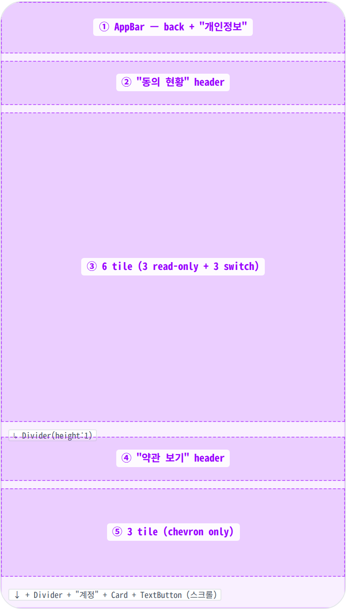
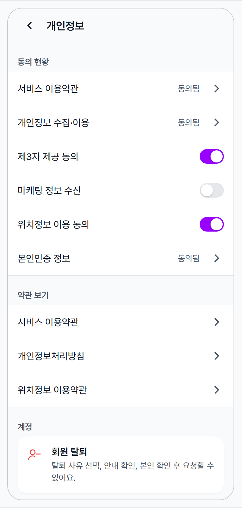
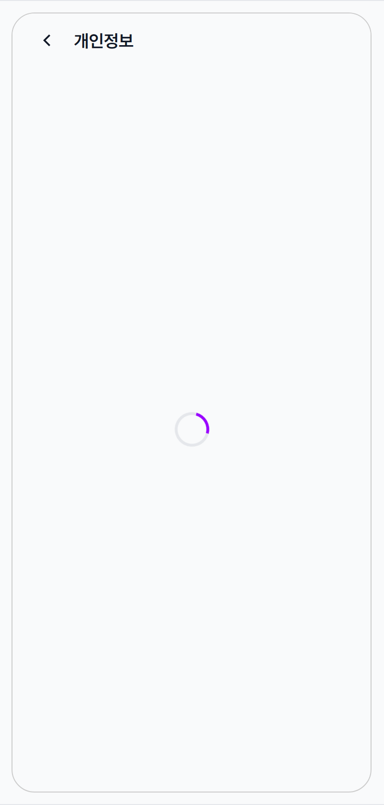
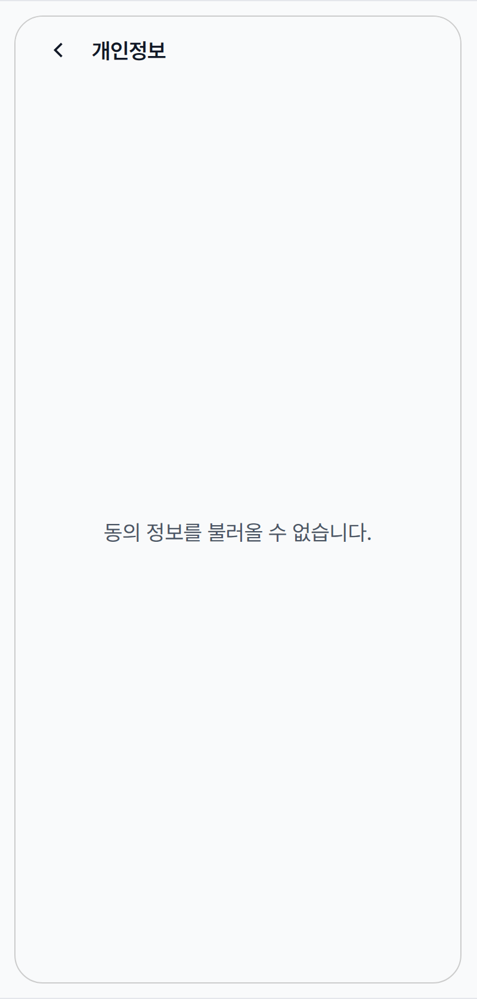

 Spec — PrivacyPage (app\_user / PrivacyRoute)  

# Privacy Settings

## Overview

| Status | ✅ 디자인완료 — 3 state · 동의 + 약관 + 계정 3 섹션 |
|---|---|
| App | app_user |
| Category | my · settings · privacy + account |
| Route / Surface | PrivacyRoute · widget: PrivacyPage (ConsumerStatefulWidget) |
| Path | /my/privacy |
| Hierarchy | Parent: MyPage (개인정보 tile → push)Children: BlockedPartnersPage (인접 — 차단 목록), DeletionReasonRoute → DeletionInfoRoute → DeletionVerifyRoute → DeletionCompleteRoute (회원 탈퇴 4-step 위저드 · 후속 spec). ConsentDetailSheet은 별도 spec 미작성 (modal bottom sheet). |
| Purpose | 사용자가 자신의 개인정보 동의 현황을 한 곳에서 확인·토글하고, 약관 원문을 다시 열람하며, 회원 탈퇴 플로우의 진입점에 도달할 수 있는 settings 서브페이지. 필수 동의(이용약관 / 개인정보 수집·이용 / 본인인증)는 read-only로, 선택 동의(제3자 제공 / 마케팅 / 위치)는 SwitchListTile로 즉시 토글 가능. |
| User journey | Entry: MyPage "개인정보 및 보안 → 개인정보" tile → push.Exit: ① AppBar back → MyPage 복귀 / ② 동의 항목 탭 → ConsentDetailSheet (modal · 같은 화면 유지) / ③ 회원 탈퇴 시작하기 → appCoordinator.startAccountDeletion() → DeletionReason 위저드. |
| Background | 한국 개인정보보호법 / 위치정보법은 (1) 동의 현황 열람, (2) 선택 동의 철회, (3) 약관 원문 열람을 사용자에게 보장해야 함. 이 페이지가 그 단일 surface. 회원 탈퇴는 법적 권리이자 위험한 액션이므로, 같은 페이지 안에 "계정" 섹션을 두되 강한 visual separation (Card + color-error 아이콘)으로 분리. 회원 탈퇴를 이미 신청한 상태로 다시 진입하면 "탈퇴 요청 진행 중 / 다시 로그인하면 복구" 안내로 "계정" 섹션의 라벨이 바뀜. |
| Frequency | 월 1회 미만 — 약관/개인정보 확인이나 마케팅 동의 변경, 또는 탈퇴 결심 시점에만 진입. |

## History

이 spec의 주요 변경 이력. 최신 항목 위.

| Date | Version | Author | Changes |
|---|---|---|---|
| 2026-05-01 | 1.0 | mark-yun | v1.4 template으로 작성. Default(데이터 로드 완료) / Loading / Error 3-state. 동의/약관/계정 3 섹션 분해 + 회원 탈퇴 진행 중 sub-variant 노트. |

[🧱 Layout](#layout) [🎨 States](#states) [🔄 Global Behavior](#behavior) [📖 Reference](#reference)

🧱

## Layout

AppBar + ListView. 3 섹션(동의 현황 · 약관 보기 · 계정), 사이에 1px Divider.

## Blueprint & tree

Scaffold + AppBar("개인정보") + 본문은 동의 정보가 도착하면 ListView로 노출 — 섹션 헤더 + 동의 항목 / 약관 보기 / 계정 카드 조합. **Drift 노트**: 마이페이지는 항목들이 카드 안에 묶이고 좌측 indent divider가 들어가지만, 이 화면은 항목들이 화면 끝까지 펼쳐지는 edge-to-edge 형태로 노출됨.

**Scaffold** └─ **AppBar**(_title: '개인정보'_) ← ① └─ Body — 동의 정보 진행 상태에 따라 분기 ├─ 로딩 중: **Center** > `MinglitCircularProgressIndicator()` ← Loading state ├─ 오류: **Center** > Padding(large) > `Text('동의 정보를 불러올 수 없습니다.')` └─ 도착: **ListView** ├─ _\_SectionHeader_(title: '동의 현황') ← ② ├─ **\_ReadOnlyConsentTile**(title: '서비스 이용약관') ← ③ ├─ **\_ReadOnlyConsentTile**(title: '개인정보 수집·이용') ├─ **SwitchListTile**(title: '제3자 제공 동의') ├─ **SwitchListTile**(title: '마케팅 정보 수신') ├─ **SwitchListTile**(title: '위치정보 이용 동의') ├─ **\_ReadOnlyConsentTile**(title: '본인인증 정보' · statusText: '동의됨'|'미동의') ├─ **Divider**(height: 1) ├─ _\_SectionHeader_(title: '약관 보기') ← ④ ├─ **ListTile**(title: '서비스 이용약관' · trailing: chevron\_right) ← ⑤ ├─ **ListTile**(title: '개인정보처리방침' · trailing: chevron\_right) ├─ **ListTile**(title: '위치정보 이용약관' · trailing: chevron\_right) ├─ **Divider**(height: 1) ├─ _\_SectionHeader_(title: '계정') ← ⑥ ├─ **Card**(margin: H = screenEdge) │ └─ **ListTile**( │ leading: _Icons.person\_remove\_outlined_ | _Icons.hourglass\_top_ · color-error, │ title: '회원 탈퇴' | '탈퇴 요청 진행 중', │ subtitle: 안내 문구 (탈퇴 진행 중 여부에 따라 분기) │ ) ├─ SizedBox(_spacing-medium_) ├─ **SizedBox**(width: ∞) > **TextButton**('회원 탈퇴 시작하기' | '탈퇴 진행 상태 보기') └─ SizedBox(_spacing-large_)

| # | Region | Alignment | Spacing |
|---|---|---|---|
| ① | AppBar | title 좌측 정렬 + leading back · centerTitle 미지정 (기본 false) | height: 56 · scaffold-gray bg · no border |
| ②④⑥ | _SectionHeader | 좌측 정렬 · titleSmall(14/600) + onSurfaceVariant | EdgeInsets.fromLTRB(screenEdge, large(24), screenEdge, small(8)) |
| ③ | 동의 현황 tile group | edge-to-edge ListTile / SwitchListTile | 각 ListTile minHeight ≈ 56 · contentPadding 기본(H = 16) · subtitle 없음 |
| — | section divider | full-width · Divider(height:1) | color-divider · 두 위치 (③↔④, ⑤↔⑥ 사이) |
| ⑤ | 약관 보기 group | edge-to-edge ListTile · trailing: Icons.chevron_right | 3 tile 연속 — 사이 divider 없음 (Material 기본) |
| ⑥ | 계정 Card | margin H: spacing-screen-edge · 내부 ListTile | radius-card · leading icon (color-error) + title + subtitle |
| — | 탈퇴 CTA | full-width TextButton (Material 기본 — 텍스트 only · primary tint) | 위 SizedBox(spacing-medium) · 아래 SizedBox(spacing-large) for safeArea buffer |

🎨

## States

3 state. baseline = Default(consents 로드 완료). Loading / Error는 body 영역만 swap.

**State 식별 기준**: 동의 정보를 가져오는 진행 상태에 따라 3가지 변형. AppBar는 모든 변형에서 동일하게 노출되고, 본문 영역만 바뀜. 회원 탈퇴를 이미 신청한 사용자라면 default 변형 안에서 "계정" 섹션의 표현이 바뀌는 sub-variant가 함께 적용됨.

### Default · 동의 현황 로드 완료 🎯 baseline · 동의 정보가 모두 도착해 본문이 정상 노출되는 상태

| 항목 | 내용 |
|---|---|
| 조건 | 로그인된 사용자가 진입했고 6개 동의 항목이 모두 도착해 본문이 정상 노출된 상태. |
| 사용자 액션 | ① 필수 동의 항목 탭 (서비스 이용약관 · 개인정보 수집·이용 · 본인인증 정보) — 약관 본문이 화면 아래에서 올라오는 큰 시트로 노출.② 선택 동의 스위치 토글 (제3자 제공 · 마케팅 · 위치정보) — 스위치가 즉시 반응하며 동의 / 철회가 적용. 적용에 실패하면 안내 메시지가 노출되고 스위치는 원래 상태로 자연스럽게 되돌아감.③ "본인인증 정보" 탭 — 본인인증을 마친 사용자에게만 본문 시트가 열리고, 아직 인증을 마치지 않은 사용자는 항목이 탭에 반응하지 않음.④ 약관 보기 항목 탭 (서비스 이용약관 · 개인정보처리방침 · 위치정보 이용약관) — 약관 본문 시트가 노출.⑤ "회원 탈퇴 시작하기" 탭 — 회원 탈퇴 절차의 첫 화면(사유 선택)으로 이동.⑥ 뒤로 가기 — 마이페이지로 복귀. |
| 에지케이스 | · 본인인증을 아직 마치지 않은 사용자에게는 "본인인증 정보" 항목이 "미동의" 상태로 표시되며, 탭에 반응하지 않고 화살표(chevron)도 표시되지 않음.· 동의 스위치 토글이 실패하면 "동의 변경에 실패했습니다. 다시 시도해주세요." 안내 메시지가 노출되고, 스위치 상태는 서버 기준으로 원래대로 복구됨.· 회원 탈퇴를 이미 신청한 상태로 다시 진입한 경우 — "계정" 섹션의 카드 아이콘이 모래시계로 바뀌고, 제목이 "탈퇴 요청 진행 중", 보조 문구가 "유예 기간 안에는 다시 로그인해 계정을 복구할 수 있어요." 로 바뀌며, 하단 버튼 라벨이 "탈퇴 진행 상태 보기" 로 바뀜.· 약관 본문 시트는 화면 위에 떠 있는 형태. 시트를 닫으면 이 화면이 그대로 다시 보이고, 동의 항목 상태는 변하지 않음. |
| 컴포넌트 | · AppBar(title: Text('개인정보')) — Material 기본 (centerTitle 미지정)· ListView + _SectionHeader(private · titleSmall + onSurfaceVariant) × 3· _ReadOnlyConsentTile(private · ListTile · trailing: Row[Text(statusText), Icons.chevron_right]) × 3· SwitchListTile × 3 (제3자 제공 / 마케팅 / 위치)· ListTile + Icons.chevron_right × 3 (약관 보기)· Divider(height: 1) × 2· Card(margin H: screenEdge) + ListTile(leading: Icon(color-error) · title · subtitle)· TextButton(width: ∞) — 회원 탈퇴 진입· showConsentDetailSheet → ConsentDetailSheet (DraggableScrollableSheet · initial 0.82) |
| 토큰 | · color: color-surface (scaffold + AppBar bg · #f9fafb), color-background (ListTile / Card bg · #ffffff), color-text-primary (tile title), color-text-secondary (statusText · 헤더 · subtitle), color-divider (1px Divider · Switch off track), color-primary (Switch on · TextButton text), color-error (회원 탈퇴 leading icon)· spacing: spacing-large (24) (헤더 top padding · CTA 하단 buffer), spacing-medium (16) (Card↔TextButton gap · header bottom padding 의 일부), spacing-small (8) (header bottom padding), spacing-screen-edge (16) (헤더 좌우 · Card margin · ListTile 기본 contentPadding)· radius: radius-card (16) (Card)· typography: appBarTitle (18/600), bodyLarge (18 · ListTile title 기본은 bodyLarge 매핑 · statusText는 bodyMedium 14), titleSmall (14/600 · _SectionHeader) |
| 노트 | 📝 Drift 알림: 마이페이지는 항목들이 카드 안에 묶이고 좌측 indent divider가 들어가지만, 이 화면은 항목들이 화면 끝까지 펼쳐지는 edge-to-edge 형태로 노출됨. 디자인 일관성을 위해 후속 작업에서 통일 여부 검토 가치. |

### Loading · 동의 정보 가져오는 중 본문 데이터를 기다리는 동안 노출되는 상태

| 항목 | 내용 |
|---|---|
| 조건 | 동의 정보를 처음 가져오는 중이거나 다시 조회하는 동안. AppBar 아래 영역 중앙에 로딩 인디케이터만 노출. |
| 사용자 액션 | + 뒤로 가기 — 마이페이지로 복귀.− 동의 토글 / 약관 열람 / 탈퇴 CTA — 본문이 아직 안 보이므로 사용 불가. |
| 에지케이스 | · 일반적으로 동의 정보는 캐시되어 있어 진입 직후 즉시 본문이 노출됨. Loading은 첫 가입 직후나 다시 조회가 필요한 시점에만 짧게 보임.· Loading 중에도 뒤로 가기는 정상 동작. |
| 컴포넌트 | ↔ Body → Center(child: MinglitCircularProgressIndicator())− ListView 전체 (헤더 / tile / Card / TextButton 모두 미렌더) |
| 토큰 | + color-primary (spinner stroke)− 그 외 list/Card/divider 토큰 (미렌더) |
| 노트 | 📝 일반 사용자에게는 거의 보이지 않는 짧게 지나가는 변형. 동의 변경 후 다시 조회가 필요한 시점에서 잠깐 노출되는 경우가 더 흔함. |

### Error · 동의 정보 로드 실패 첫 진입에서 동의 정보를 가져오는 데 실패한 상태

| 항목 | 내용 |
|---|---|
| 조건 | 화면 진입 후 동의 정보 자체를 한 번도 받지 못한 상태. 본문 영역 중앙에 안내 메시지만 노출. |
| 사용자 액션 | + 뒤로 가기 — 마이페이지로 복귀. 다시 진입하면 다시 시도됨.− 별도의 다시 시도 버튼은 없음. |
| 에지케이스 | · 이미 본문이 한 번 노출된 후 다시 조회하다 실패한 경우는 이 화면으로 빠지지 않고, 안내 메시지(스낵바)만 노출되며 본문은 그대로 유지됨.· 동의 스위치 토글 실패는 안내 메시지로 처리되며, 이 화면으로 빠지지 않음. |
| 컴포넌트 | ↔ Body → Center(Padding(MinglitSpacing.large, Text('동의 정보를 불러올 수 없습니다.', bodyLarge)))− ListView 전체 |
| 토큰 | + spacing-large (24) (Padding), bodyLarge (18 · text)+ color-text-secondary (메시지 — bodyLarge 기본 톤)− 그 외 |
| 노트 | 📝 다시 시도 버튼이 없는 점은 후속 보강 후보. 현재는 뒤로 가기 후 재진입 또는 앱 재시작이 필요. |

🔄

## Global Behavior

cross-cutting — 모든 state에 적용되는 액션, motion, 글로벌 에지케이스.

## Cross-cutting interactions

| 사용자 액션 | 화면에 보이는 결과 |
|---|---|
| 뒤로 가기 (시스템 back · AppBar back) | 마이페이지로 복귀. |
| 다크 모드 토글 | scaffold·ListTile·카드 배경이 다크 토큰으로 자동 전환. 위험 강조(빨강) 아이콘과 켜진 스위치의 강조 색은 동일하게 유지. |
| 동의 스위치 토글 실패 | "동의 변경에 실패했습니다. 다시 시도해주세요." 안내 메시지가 노출되고, 스위치 상태는 서버 기준으로 자연스럽게 원상복구됨. 본문은 그대로 유지. |
| 회원 탈퇴를 이미 신청한 상태로 재진입 | "계정" 섹션의 아이콘·제목·보조 문구·하단 버튼 라벨이 진행 중 변형으로 바뀜. 동의·약관 섹션은 그대로 유지. |

## Motion timing

Source: `shared/packages/mds/core/lib/src/theme/minglit_design_tokens.dart`

| Transition | Token / Duration | Notes |
|---|---|---|
| 화면 진입 (마이페이지 → 개인정보) | MinglitAnimation.fast (200ms) | 화면이 좌→우로 슬라이드되며 진입. |
| 동의 스위치 thumb 이동 | MinglitAnimation.micro (100ms 안팎) | 스위치 thumb과 트랙이 부드럽게 보간되며 전환. |
| 약관 본문 시트 등장 | MinglitAnimation.medium (350ms) | 화면 아래에서 위로 부드럽게 슬라이드 업. |
| 로딩 → 본문 노출 전환 | — | 별도의 부드러운 전환 없이 즉시 교체에 가까움. |
| 안내 메시지 등장 | MinglitAnimation.fast (200ms) | 동의 토글 실패 시 노출되는 스낵바의 페이드 인. |

## Global edge cases

-   **비로그인 사용자의 진입** — 비로그인 사용자는 이 화면에 도달하기 전에 로그인 화면으로 자동으로 보내짐.
-   **회원 탈퇴 신청 후 재진입** — "계정" 섹션이 진행 중 변형으로 노출됨. 사용자가 유예 기간 안에 다시 로그인하면 탈퇴를 취소하고 계정을 복구할 수 있음.
-   **필수 동의는 토글 불가** — 서비스 이용약관 / 개인정보 수집·이용 / 본인인증은 열람만 가능하고, 철회는 회원 탈퇴를 통해서만 가능.
-   **약관 본문은 앱 안에서 열림** — 외부 브라우저로 빠지지 않고 화면 위로 올라오는 시트로 노출.

📖

## Reference

implementation source + 인접 화면.

## Implementation source

| Widget | PrivacyPage — apps/app_user/lib/src/features/settings/privacy_page.dart |
|---|---|
| Route | PrivacyRoute · /my/privacy · app_routes.dart |
| Consent provider | consentControllerProvider · toggleConsent(type, consented:) — Riverpod async controller. ConsentType: termsOfService / privacyCollection / thirdPartyProvision / marketingConsent / locationConsent / identityVerification. |
| Account deletion provider | accountDeletionControllerProvider · DeletionStatus.isPending — shared/packages/minglit_kit/lib/src/features/account_deletion/logic/account_deletion_controller.dart |
| Coordinator | appCoordinatorProvider.startAccountDeletion() → DeletionReasonRoute push (4-step 위저드 시작점). |
| Bottom sheet | showConsentDetailSheet(context, content:) · ConsentDetailSheet — apps/app_user/lib/src/common/widgets/consent_detail_sheet.dart (DraggableScrollableSheet · initialChildSize 0.82). |
| Static content | 약관 / 처리방침 / 위치정보약관 본문은 privacy_page.dart 하단의 const ConsentDetailContent 4개 (termsOfService · privacyCollection · privacyPolicy · locationConsent · identityVerification). |
| Icons (Material) | chevron_right · person_remove_outlined (탈퇴 idle) · hourglass_top (탈퇴 진행 중) |
| Loading widget | MinglitCircularProgressIndicator (kit-shared) |
| Bug-fix history | Fix #886: 토글 실패 시 SnackBar + invalidate으로 원상복구. Fix #1157: 보유기간 명시 (관심 태그 등 즉시 파기). |

## Related screens

| Spec | Relation |
|---|---|
| MyPage | Parent — "개인정보 및 보안 → 개인정보" tile에서 push. |
| BlockedPartnersPage | Sibling — MyPage의 인접 settings (차단 목록). 같은 카테고리지만 별개 라우트. |
| SignupConsentPage | 가입 시 동의 수집 — 이 페이지에서 보이는 동의 row의 source-of-truth 입력 surface. |
| LoginPage | 탈퇴 진행 중 → 다시 로그인하면 복구 가능. 비인증 deep-link 시 redirect 도착지. |