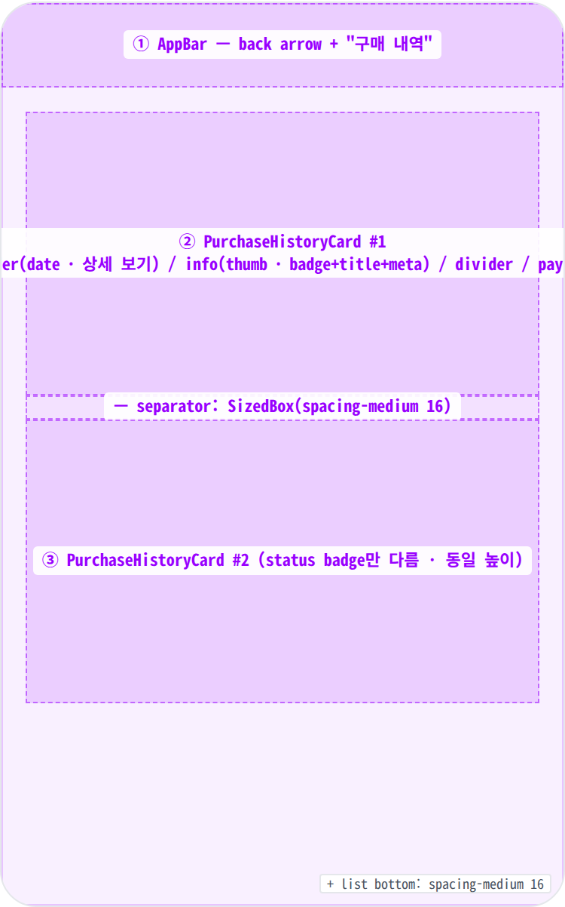
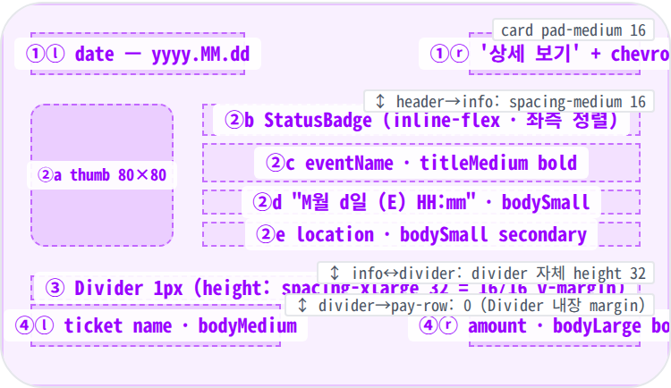
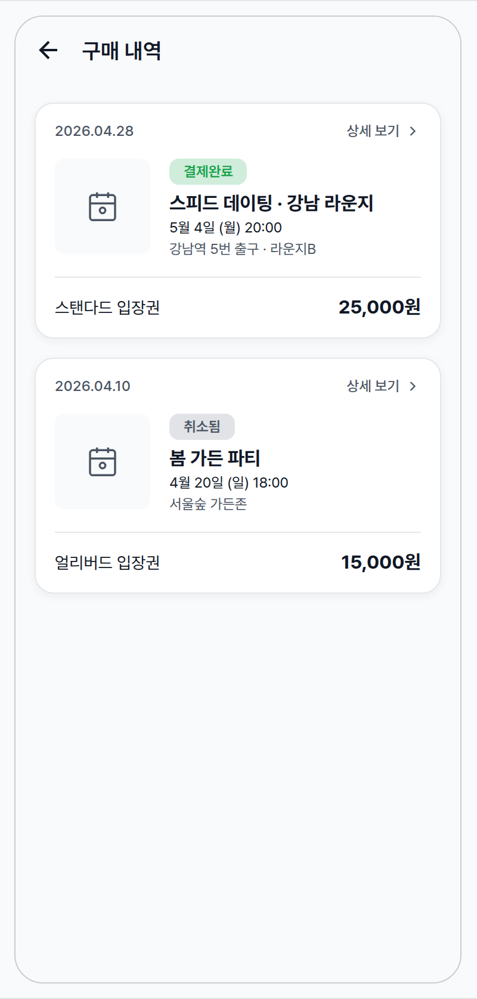
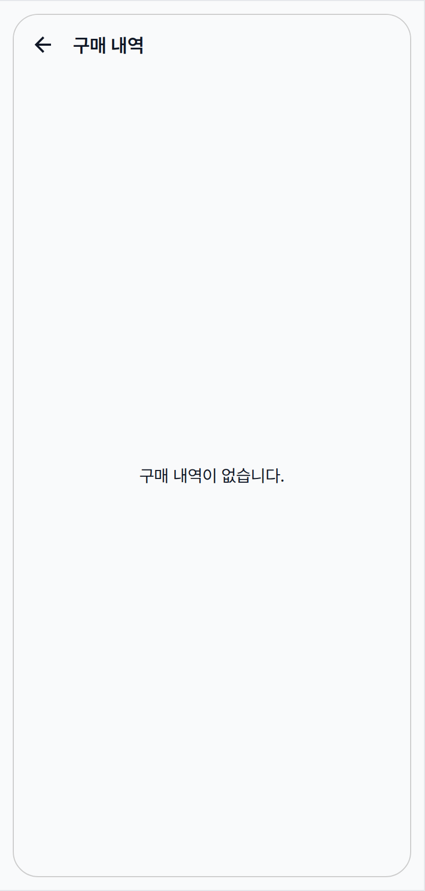
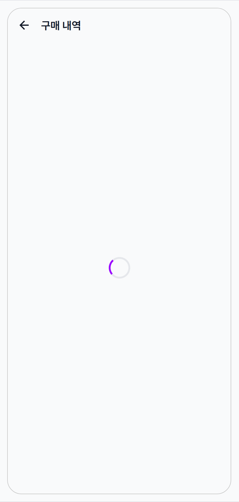
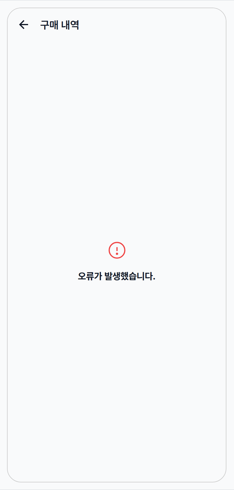

 Spec — PurchaseHistoryPage (app\_user · PurchaseHistoryRoute)  

# Purchase History

## Overview

| Status | 📝 Redesign — v1.1 (인라인 액션 제거 · 카드 탭 → 상세 페이지로 위임) |
|---|---|
| App | app_user |
| Category | my · payment · history |
| Route / Surface | PurchaseHistoryRoute · widget: PurchaseHistoryPage |
| Path | /purchase-history |
| Hierarchy | Parent: MyPage ("활동 → 구매 내역" tile에서 진입) · EventApplicationRoute 결제 완료 후 redirectChildren: PurchaseHistoryDetailRoute (카드 탭 시 push — 결제 정보 / 환불 정책 / 파트너 정보 / 예매 취소 등 모든 후속 액션은 상세 화면이 담당) |
| Purpose | 사용자의 결제/신청 이력을 시간 역순 list로 한 곳에 모아 보여주는 화면. 카드 한 장은 "어떤 이벤트 / 언제 결제 / 현재 상태"의 최소 시그널만 노출하고, 결제 상세 / 환불 / 문의 / 영수증 등 후속 액션은 모두 상세 페이지로 위임한다. paid · pending · cancelled · rejected 등 모든 상태가 섞여 노출된다 (active 티켓만 모이는 MyTicketsPage와는 다름). |
| User journey | Entry points: MyPage "구매 내역" tile / EventApplicationWizard 결제 완료 후 push.Exit points: 카드 탭 → PurchaseHistoryDetailRoute push (모든 후속 액션은 상세에서) · 뒤로 가기 → MyPage 복귀. 상세 화면에서 예매 취소 등 status가 변경된 뒤 본 화면 복귀 시 자동 invalidate되어 카드의 status 뱃지가 갱신된다. |
| Background | MyTickets와 분리한 이유: MyTickets는 "지금 갈 수 있는 티켓"에 초점 (active만), Purchase History는 "결제 기록"으로 회계/환불 관점. cancelled/rejected/payment_failed도 모두 보여 환불·문의의 기록 추적이 가능하게 한다. v1은 카드마다 인라인 영수증 / 문의 / 예매 취소 버튼을 노출했는데, 카드가 무겁고 환불 confirm 다이얼로그까지 같은 페이지에 얹혀 책임이 과적되어 있었다. v1.1에서 카드는 시그널만 담당하고 액션은 상세 페이지로 분리해 list ↔ detail 책임을 명확히 가른다. Fix #2076 (v1.2): 영수증 버튼은 유료·무료 구분 없이 모든 구매에 노출. 유료(paymentId ≠ null) → iamport 외부 브라우저 · 무료(paymentId = null) → 인앱 신청 확인서 다이얼로그. 환불 플로우는 정책 조회 실패 시 default(grace 2h / cutoff 7d)로 fallback (Fix #133). |
| Frequency | 결제 직후 1회 + 환불 결심 시 — 활성 사용자 기준 분기당 0-2회. 중요도는 낮지만 한 번 들어오면 액션(취소)이 일어나는 곳. |

## History

이 spec의 주요 변경 이력. 최신 항목 위.

| Date | Version | Author | Changes |
|---|---|---|---|
| 2026-05-03 | 1.1 | mark-yun | 책임 분리 정리 (PR #2094 후속). 카드의 인라인 액션(영수증 / 문의하기 / 예매 취소) + 환불 confirm 다이얼로그 state를 상세 페이지로 위임. 카드는 header / info / divider / pay-row 4 region. State 5(Refund confirm) 제거 → 4 state. canCancel 판정 / contactOptions fallback / 환불 정책 조회 / iamport 영수증 등 detail-page 책임도 본 spec에서 모두 제거. StatusBadge 위치를 header 우측 → info row 내 이벤트 타이틀 위로 이동해 시각적 묶음 강화, header 우측은 '상세 보기' affordance가 차지. |
| 2026-05-05 | 1.2 | needs-swe-sonnet-1 | Fix #2076 — 무료 티켓 영수증 버튼 동작 변경. 기존(Fix #1820): paymentId 없으면 버튼 미렌더. 변경: 항상 "영수증" 버튼 노출 · 유료 → iamport 외부 브라우저 · 무료 → 인앱 신청 확인서 다이얼로그. Actions row sub-anatomy + 에지케이스 · Global Behavior 사용자 액션 반영. |
| 2026-05-01 | 1.0 | mark-yun | v1.4 template으로 작성. 5 state(Default with purchases · Empty · Loading · Error · Refund confirm dialog) mini-table, PurchaseHistoryCard 4-section anatomy(header / info / divider / pay-row / actions), Fix #133/#270/#299/#579/#638/#1140/#1234/#1236/#1541/#1652/#1820/#1951 내력 정리. |

[🧱 Layout](#layout) [🎨 States](#states) [🔄 Global Behavior](#behavior) [📖 Reference](#reference)

🧱

## Layout

AppBar + ListView.separated. 카드 사이 vertical medium(16) gap. 카드는 외곽 1px outlineVariant + radius-card(16) + 흰 배경 + 약한 drop shadow.

## Blueprint & tree

Scaffold + Material default AppBar (title "구매 내역") + MinglitAsyncValueWidget. data branch: 빈 list면 중앙 메시지, 아니면 ListView.separated가 모든 application을 시간 역순으로 카드 list로 출력. 카드는 모두 동일 높이 — 인라인 액션 없이 InkWell 전체가 탭되어 상세 페이지로 push.

**Scaffold** └─ **AppBar**(_title: "구매 내역"_) ← ① └─ **MinglitAsyncValueWidget<List<EventApplication>>** ├─ loading → **MinglitCircularProgressIndicator** ├─ error → **\_DefaultErrorView** (Icons.error\_outline + "오류가 발생했습니다.") └─ data → ├─ _if history.isEmpty_ │ └─ Center(Text "구매 내역이 없습니다.") │ └─ **ListView.separated** ├─ padding: _EdgeInsets.all(spacing-medium 16)_ ├─ separator: SizedBox(height: _spacing-medium 16_) └─ **PurchaseHistoryCard** × n ← ② / ③ └─ Container · radius-card · 1px outlineVariant · shadowXs · pad-medium ├─ _1\. Header Row_: paidAt(yyyy.MM.dd) ↔ **StatusBadge** ├─ SizedBox(spacing-medium) ├─ _2\. Info Row_: 80×80 thumb (**MinglitImage**) + Column(title titleMedium bold · "M월 d일 (E) HH:mm" bodySmall · location bodySmall onSurfaceVariant) ├─ **Divider**(height: _spacing-xlarge 32_) ├─ _3\. Pay Row_: ticket name bodyMedium ↔ "{amount}원" bodyLarge bold ├─ SizedBox(spacing-medium) └─ _4\. Actions Row_ (IntrinsicHeight + Row stretch) ├─ TextButton "영수증" (flex 1) // Fix #2076: 항상 노출 — paymentId ≠ null → iamport · null → 신청 확인서 다이얼로그 ├─ TextButton "문의하기" (flex 1) └─ _if canCancel_ → ElevatedButton "예매 취소" (flex 2 · errorContainer bg) // Fix #1234

| # | Region | Alignment | Spacing |
|---|---|---|---|
| — | Body padding | — | ListView padding all: spacing-medium (16) |
| ① | AppBar | title left + auto back arrow (Material default · push 진입 시 자동) | height: 56 · scaffold gray bg · border-bottom 없음 |
| ②③ | PurchaseHistoryCard | list child (full width inside list padding) · 카드 전체가 InkWell — 탭하면 상세 push | padding all: medium (16) · radius: radius-card (16) · 1px outlineVariant border · boxShadow blur 8 offset (0,2) opacity shadowXs (0.06) · header→info: medium · info↔divider: xlarge (32, divider 자체 height) · divider→pay-row: 0 (Divider 내장) · 카드 하단은 padding-medium만 (행 하나로 종결) |
| — | list separator | vertical SizedBox | SizedBox height spacing-medium (16) |

## PurchaseHistoryCard sub-anatomy

카드는 항상 4 region(header / info / divider / pay-row). 가변 요소는 StatusBadge의 색·라벨(8 status)뿐 — 모든 카드는 동일 높이. StatusBadge는 info row 안에서 이벤트 타이틀 위에 inline으로 노출 (← 시각적 묶음 강화).

**PurchaseHistoryCard** └─ **InkWell**(onTap → push DetailRoute) └─ **Container**(radius-card · 1px outlineVariant · shadowXs · pad-medium) └─ Column \[ ├─ _① Header_: **Row** spaceBetween │ ├─ Text(date) · labelMedium · w500 · secondary │ └─ Row(gap xsmall) \[Text('상세 보기') · 12px w500 secondary, Icon(chevron\_right · 14)\] │ ├─ SizedBox(_spacing-medium 16_) │ ├─ _② Info_: **Row**(crossAxis: start) │ ├─ **MinglitImage** 80×80 · radius-small · BoxFit.cover │ └─ Expanded → Column(gap xsmall) \[ │ ├─ **StatusBadge**(inline-flex · 좌측 정렬 · 자기 폭만 차지) │ ├─ Text(eventName) · titleMedium bold · maxLines 1 ellipsis │ ├─ Text("M월 d일 (E) HH:mm") · bodySmall │ └─ Text(location) · bodySmall · secondary │ \] │ · badge↔title 시각 간격 4–6px (Column gap xsmall 4 + badge-wrap margin-bottom 2 — xsmall 미만 시각 묶음 강조) │ ├─ **Divider**(height: _spacing-xlarge 32_) · 1px line + 16/16 v-margin │ └─ _③ Pay_: **Row** spaceBetween baseline ├─ Text(ticket.name) · bodyMedium · ellipsis └─ Text("{amount}원") · bodyLarge bold

| Region | Alignment | Notes |
|---|---|---|
| 1. Header (date · 상세 보기) | spaceBetween · 좌우 끝 | 좌: paidAt ?? createdAt를 toLocal() 후 yyyy.MM.dd 포맷 (Fix #579 · UTC→KST 날짜 차이 방지) · labelMedium onSurfaceVariant. 우: Text('상세 보기') 12px w500 secondary + Icon(chevron_right · 14px · text-secondary) — 카드 전체가 InkWell이라 어디를 탭해도 push되지만 affordance signal로 노출. |
| 2. Info row (thumb · 텍스트 column) | start cross-axis | thumb 80×80 (MinglitImage · radius-small · BoxFit.cover · imageUrl 없으면 placeholder) + spacing-medium gap + Expanded Column [StatusBadge(inline-flex · 자기 폭만 차지, 좌측 정렬) · eventName titleMedium bold maxLines 1 ellipsis · "M월 d일 (E) HH:mm" bodySmall · location bodySmall onSurfaceVariant]. badge ↔ title 시각 간격 4–6px (Column gap xsmall 4 + badge-wrap margin-bottom 2 → xsmall 미만 시각적 묶음 강조). |
| 3. Divider | — | Divider(height: spacing-xlarge 32) — 1px line + 16/16 v-margin (Material Divider default) |
| 4. Pay row | spaceBetween baseline | 좌: ticket name bodyMedium · 우: NumberFormat('#,###').format(paymentAmount ?? 0) + '원' bodyLarge bold |
| 5. Actions row | IntrinsicHeight + Row stretch · 가운데 정렬 | 항상 "영수증" TextButton flex 1 (Fix #2076) — paymentId ≠ null → iamport 외부 브라우저 · paymentId = null → 인앱 신청 확인서 다이얼로그 · 항상 "문의하기" TextButton flex 1 · canCancel → "예매 취소" ElevatedButton flex 2 errorContainer bg (Fix #1234 — 2줄 깨짐 방지로 cancel만 flex 2). |

**v1.1 변경 메모**: v1에서는 카드 마지막에 액션 row(영수증 / 문의하기 / 예매 취소)가 있었고 canCancel 판정 / contactOptions fallback 로직이 list spec에 포함되어 있었다. v1.1에서는 모두 [상세 페이지](/specs/purchase_history_detail_page/index.html)로 위임 — 본 spec은 카드 시그널만 다룬다. StatusBadge 위치도 header 우측 → info row 안 (이벤트 타이틀 위)으로 이동해 시각적 묶음을 강화하고, header 우측은 '상세 보기' affordance가 차지한다.

🎨

## States

4 state. baseline = Default(구매 이력 보유). MinglitAsyncValueWidget이 loading/error 자동 처리, data branch에서 history.isEmpty 분기. 환불 confirm 등 액션 흐름은 본 spec 범위 밖(상세 페이지 담당).

**State 종류 식별 기준**: `MinglitAsyncValueWidget`의 3-way (loading / error / data) + data 안에서 `history.isEmpty` 분기. _비로그인 사용자는 controller 14-18행에서 빈 list 반환 → Empty state로 보임._

### Default · 구매 이력 보유 🎯 baseline · 카드 list (paid + cancelled 혼합)

| 항목 | 내용 |
|---|---|
| 조건 | 로그인된 사용자가 결제 또는 신청 이력을 1건 이상 가지고 있는 상태 (모든 상태 포함). |
| 사용자 액션 | ① "영수증" 탭 (Fix #2076 — 모든 구매에 노출) → 유료(paymentId ≠ null): 외부 브라우저로 iamport 영수증 페이지 · 열 수 없으면 "영수증 페이지를 열 수 없습니다." 안내 / 무료(paymentId = null): 인앱 신청 확인서 다이얼로그 (이벤트명·일시·티켓명·0원)② "문의하기" 탭 → 연락처가 등록돼 있으면 전화 앱 우선, 없으면 메일 앱으로 이동. 둘 다 없으면 "연락처 정보가 없습니다." 안내③ "예매 취소" 탭 (취소 가능 건만 노출) → 환불 정책을 조회한 뒤 환불 확인 다이얼로그 노출 (state 5)④ 스크롤 → 더 오래된 결제 노출 (현재 페이지네이션 없이 한 번에 모두 표시)⑤ 뒤로 가기 → 마이페이지로 복귀 |
| 에지케이스 | · 무료 티켓 (paymentAmount=0 && paymentId=null) → "영수증" 버튼 노출, 탭 시 인앱 신청 확인서 다이얼로그 표시 (Fix #2076 — Fix #1820 행동 대체) · "예매 취소"는 isFree branch로 활성 (Fix #1652)· event/party 관계 끊김 → eventName "제목 없음" · location "장소 정보 없음" · dateLabel "-"· StatusBadge 색: paid/approved → success 초록 · pending_review → warning 노랑 · pending/payment_pending → info 파랑 · cancelled → neutral 회색 · rejected/payment_failed → error 빨강 · 그 외 → "알수없음" 회색· InkWell 탭 영역: 카드 전체. chevron 영역만 별도 hit-region 없음 — 어디를 눌러도 동일하게 detail push. |
| 컴포넌트 | · Scaffold + Material AppBar(title: Text('구매 내역')) — auto back arrow (push 진입)· MinglitAsyncValueWidget<List<EventApplication>> 외곽 wrapping· ListView.separated · padding all medium · separator SizedBox medium· PurchaseHistoryCard (file-private · part of purchase_history_page.dart): InkWell wrap → Container + radius-card + 1px outlineVariant + shadowXs · 4-region Column· StatusBadge = MinglitBadge tinted bg + color text (8 status 분기 · Fix #1236, #1541) — info row 안 이벤트 타이틀 위에 inline-flex로 배치· MinglitImage 80×80 (radius-small)· Icon(Icons.chevron_right · 14) + Text('상세 보기') — header 우측의 affordance signal (Fix #1234 인라인 액션 폐기 후 도입) |
| 토큰 | · color: color-surface (scaffold + AppBar bg · light gray + thumb fallback bg), color-background (card bg · 흰색), color-text-primary (title · ticket name · amount), color-text-secondary (date · location · onSurfaceVariant · chevron), color-divider (outlineVariant · card border · in-card divider), 의미론적 status: color-success · color-warning · color-error · color-text-secondary (cancelled neutral) · info(#3b82f6 · pending)· radius: radius-card (16 · card 외곽), radius-small (8 · thumb · status badge)· spacing: spacing-medium (16 · ListView padding · card padding · header→info · 카드 사이 separator · info row gap · amount left margin), spacing-xlarge (32 · Divider height = 1px + 16/16 v-margin), spacing-sm (12 · status badge h-pad), spacing-xsmall (4 · status badge v-pad · text gap · card meta gap · pay-row→chevron)· opacity: shadowXs (0.06) (card boxShadow alpha · MinglitColors.textPrimary tint), subtle (0.20) (MinglitBadge bg tint)· typography: appBarTitle (18/600), titleMedium bold (eventName), bodyLarge bold (amount), bodyMedium (ticket name), bodySmall (date · location · meta · chevron), labelMedium (date · w500 · onSurfaceVariant), labelMedium w600 (StatusBadge label) |
| 노트 | 📝 viewport mockup은 카드 2개만 표시 (paid · cancelled). 실제로는 8 status 모두 섞여 시간 역순으로 노출 (paidAt DESC). 페이지네이션은 미구현 — controller에 "Future features: infinite scroll" 주석. 결제 직후 PurchaseHistoryRoute로 push redirect되면 즉시 baseline 진입. |

### Empty · 이력 없음 history.isEmpty == true

| 항목 | 내용 |
|---|---|
| 조건 | 한 번도 결제·신청 이력이 없거나 비로그인 상태 (둘 다 빈 화면으로 통합). |
| 사용자 액션 | − 카드 list 미렌더 (탭할 카드 없음)동일: 뒤로 가기 → MyPage 복귀− CTA 버튼 없음 (단순 Center Text — MinglitEmptyState 미사용) |
| 에지케이스 | · 비로그인 진입 (deep-link 등) → controller가 user==null이면 빈 list 반환 → 동일 Empty 화면. 전용 auth guard prompt 없음 — Empty와 구분되지 않음· 결제 직후 캐시 미반영 시 잠깐 Empty (Riverpod refresh 후 default로 전환)· 모든 application이 RLS로 차단되면 동일 Empty (서버에서 빈 list가 정상 응답) |
| 컴포넌트 | ↔ ListView/cards 전부 → Center(child: Text('구매 내역이 없습니다.', style: theme.textTheme.bodyLarge.copyWith(color: onSurface))) · MinglitEmptyState 미사용 (간소 패턴 · CTA·icon 없음) |
| 토큰 | ↔ list 토큰 미사용. color-surface scaffold bg 유지.+ typography: bodyLarge+ color: color-text-primary (메시지 onSurface) |
| 노트 | 📝 MyTickets와 달리 CTA가 없는 게 의도 — 구매 이력은 결제 후에 채워지는 화면이므로 "이벤트 둘러보기" 같은 push가 부자연스럽다. Empty가 길게 지속되면 사용자는 자연스럽게 뒤로 가기 → MyPage → 홈으로 회귀. |

### Loading async fetch 진행 중

| 항목 | 내용 |
|---|---|
| 조건 | 화면 진입 직후 결제 이력을 불러오는 중. |
| 사용자 액션 | ↔ 카드 list 미렌더 (응답 대기 중)동일: 뒤로 가기 → 마이페이지로 복귀 (응답 대기 취소) |
| 에지케이스 | · 네트워크가 느리면 스피너가 길게 노출됨 (별도 타임아웃 없음)· 인증이 만료되면 자동으로 오류 상태로 전환 (별도 안내 없음)· 상세 페이지에서 환불/예매 취소 성공 직후 (Fix #1951) 본 화면이 잠시 Loading로 들어왔다가 갱신됨 |
| 컴포넌트 | ↔ list 전체 → MinglitCircularProgressIndicator (MinglitAsyncValueWidget의 default loading) · 화면 중앙 |
| 토큰 | − list 토큰 모두 미사용+ color-primary (spinner 색)동일: color-surface scaffold bg |
| 노트 | 📝 짧은 transition state — 일반적으로 200-500ms. 상세 페이지에서 status 변경 후 invalidate로도 잠시 진입 (loading 후 default로 자동 복귀, 취소된 application은 status 'cancelled'로 표시). |

### Error fetch 실패 — 네트워크 / RLS / 서버

| 항목 | 내용 |
|---|---|
| 조건 | 네트워크 / 권한 / 서버 오류로 결제 이력을 받아오지 못한 상태. |
| 사용자 액션 | − 카드 list 미렌더동일: 뒤로 가기 → 마이페이지로 복귀− 화면 내 재시도 버튼 없음 (오류 상세도 표시되지 않음) |
| 에지케이스 | · showErrorDetails가 false → 에러 본문 노출 안 됨 (디버깅은 logger / Sentry)· refresh 트리거 명시적 없음 — 사용자는 "뒤로 → 다시 진입"으로 retry· 토큰 만료도 동일 error 화면 (별도 분기 없음) |
| 컴포넌트 | ↔ list 전체 → _DefaultErrorView (Icons.error_outline xlarge + Text "오류가 발생했습니다." titleMedium bold) |
| 토큰 | − list 토큰 모두 미사용+ color-error (icon)+ color-text-primary (title)+ spacing: spacing-large (외곽 padding · MinglitAsyncValueWidget 내부), spacing-medium (icon → title) |
| 노트 | 📝 화면 내 재시도 CTA가 없는 게 약점. Phase 2에서 재시도 버튼 추가 검토. |

🔄

## Global Behavior

cross-cutting — 모든 state에 적용되는 액션, motion, 글로벌 에지케이스.

## Cross-cutting interactions

| 사용자 액션 | 화면에 보이는 결과 |
|---|---|
| 뒤로 가기 (시스템 back · AppBar back arrow) | MyPage로 복귀 (Material default pop transition). EventApplicationWizard 결제 직후 push redirect로 들어왔다면 wizard 스택은 이미 정리되어 있음. |
| 다크 모드 토글 | scaffold / card / dialog 모두 dark 토큰으로 자동 swap. StatusBadge 색은 light/dark colorset이 분리되어 있어 자동 대응. |
| card tap haptic | InkWell ripple + Material default haptic light. 카드 전체가 단일 InkWell — 탭하면 상세 페이지로 push. |
| 풀-다운 새로고침 | 구현 안 됨 — ListView 위에 RefreshIndicator 미부착. 갱신은 (a) 상세 화면에서 status 변경 후 복귀 시 ref.invalidate (자동) (b) 화면 재진입 (Phase 2 후보). |
| 결제 직후 redirect | EventApplicationWizard 결제 완료 → PurchaseHistoryRoute로 push (스택 교체 형태) — 즉시 default state 진입. 새 결제는 paidAt DESC로 list 최상단. |

## Motion timing

Source: `shared/packages/mds/core/lib/src/theme/minglit_design_tokens.dart` → `MinglitAnimation`.

| Transition | Token / Duration | Notes |
|---|---|---|
| 화면 진입 (MyPage → PurchaseHistory) | MinglitAnimation.fast (200ms) | GoRouter Material default 좌→우 slide. |
| EventApplication 결제 완료 → push redirect | MinglitAnimation.fast (200ms) | GoRouter default — PurchaseHistoryRoute는 커스텀 transition 미지정. |
| 카드 tap → 상세 페이지 push | MinglitAnimation.fast (200ms) | GoRouter Material default 좌→우 slide. |
| 상세 페이지 status 변경 후 복귀 → list refresh | cut | MinglitAsyncValueWidget이 AsyncValue.when 직접 분기 — fade 없이 Loading→Default 교체. |
| InkWell ripple (카드 본체) | MinglitAnimation.micro (100ms) | Material default ripple expand. |

## Global edge cases

-   **paidAt 누락** — 결제 직후 webhook 처리 전이면 paidAt이 null일 수 있음. `paidAt ?? createdAt`로 fallback (Fix #579) · 표시 날짜는 `toLocal()` 후 yyyy.MM.dd.
-   **중복 invalidate 방지** — 상세 화면에서 환불/취소 액션의 onSuccess 호출 후 invalidate (Fix #1951 — Riverpod 3.x mid-action self-invalidate 시 StateError 회피). 본 화면은 invalidate 결과만 받아 갱신.
-   **list 정렬 일관성** — paidAt DESC가 기본. paidAt이 null인 항목은 createdAt으로 fallback해도 정렬 키는 동일하게 paidAt 우선 — 결과적으로 createdAt fallback 항목은 시간 정렬 시 약간 어긋날 수 있음(허용 범위).
-   **StatusBadge 8 status 분기 일관성** — Detail page와 동일한 라벨 / 톤을 사용. 새 status 추가 시 두 spec을 동시 갱신해야 시각 일관성 유지.

📖

## Reference

implementation source + 인접 화면.

## Implementation source

| Widget | PurchaseHistoryPage — apps/app_user/lib/src/features/payment/ui/purchase_history_page.dart |
|---|---|
| Card atom | PurchaseHistoryCard — apps/app_user/lib/src/features/payment/ui/purchase_history_card.dart (part of purchase_history_page.dart) · v1.1에서 인라인 액션 / canCancel / contactOptions / refund row 모두 제거 |
| Controller | PurchaseHistoryController — purchase_history_controller.dart (Riverpod async · list fetch만 담당. 환불/취소 로직은 detail의 controller로 이전) |
| Route | PurchaseHistoryRoute · /purchase-history · app_routes.dart |
| Detail route | PurchaseHistoryDetailRoute · /purchase-history/:applicationId — 카드 탭으로 push |
| Repository | eventRepositoryProvider.getMyPurchaseHistory(userId) — Supabase에서 EventApplication list 가져옴 (status 필터 없음 · 모든 결제/신청) |
| Async wrapper | MinglitAsyncValueWidget — 3-way (loading / error / data) |
| StatusBadge | StatusBadge = MinglitBadge(label, color) · 8 status 분기 (Fix #638, #1236, #1541) |
| Icons (Material) | arrow_back (AppBar default · Material auto) · error_outline (error state · 32px xlarge · color.error) · chevron_right (카드 affordance · 14px · text-secondary) · event (thumb fallback · MinglitImage placeholder) |
| Sort behavior | repository fetch 시 paidAt DESC (가장 최근 결제 먼저) · 페이지네이션 미구현 (controller에 "Future features: infinite scroll, filtering" 주석) |

## Related screens

| Spec | Relation |
|---|---|
| MyPage | 주 진입점 — "활동 → 구매 내역" tile 탭. |
| PurchaseHistoryDetailPage | Child — 카드 탭 시 push되는 상세 페이지. 결제 정보 / 환불 정책 / 파트너 정보 / 예매 취소 등 모든 후속 액션이 여기에 있음. |
| MyTicketsPage | 형제 화면 — actionable 활성 이벤트(OngoingBanner stack)만 모임. v2부터 다가오는·지난 timeline 책임은 PurchaseHistory에 위임 — 둘이 actionable hub vs 회계/회고 timeline으로 명확히 분리. |
| EventDetailPage | EventApplicationWizard 결제 완료 후 PurchaseHistoryRoute로 push redirect (entry path #2). |
| LoginPage | 비로그인 사용자가 도달하면 controller가 빈 list 반환 → Empty 표시. MyPage 측 auth guard로 사실상 차단. |