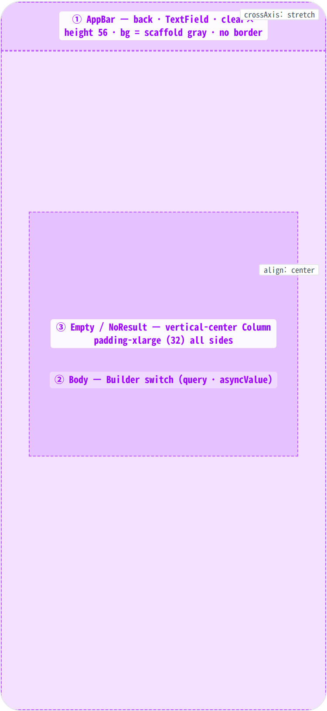
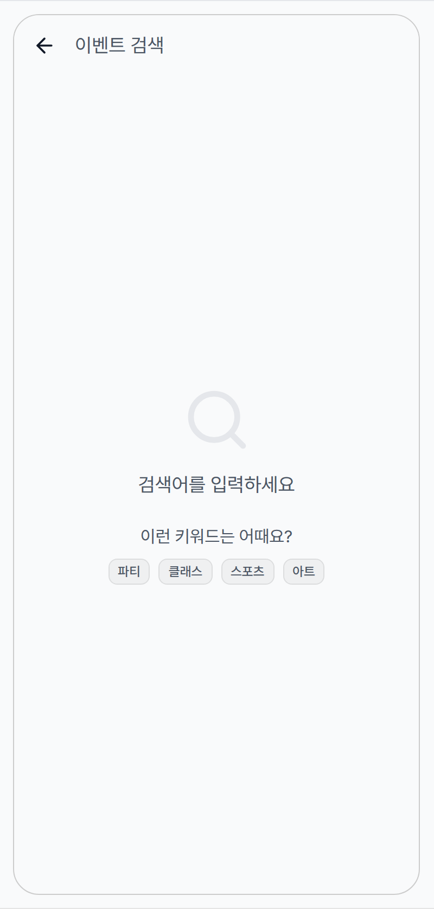
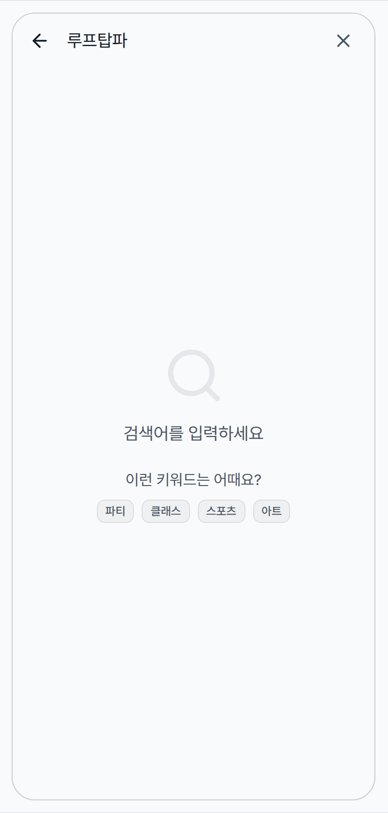
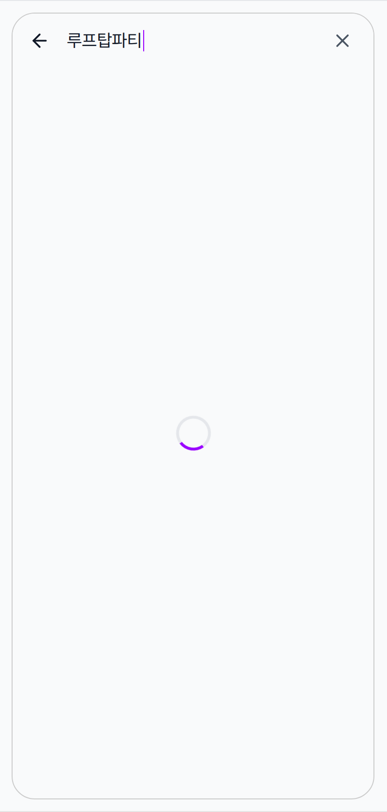
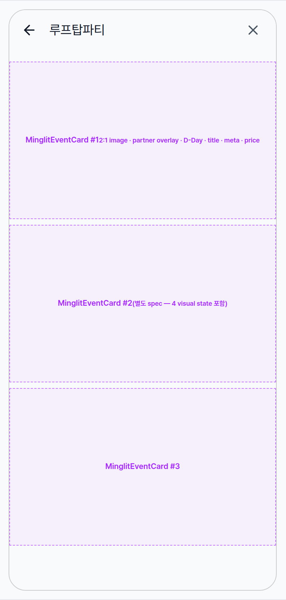
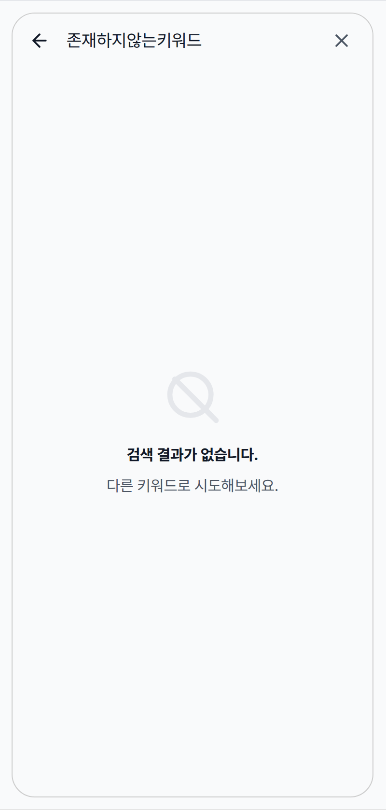
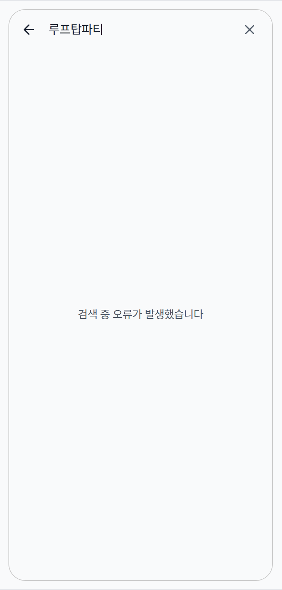

 Spec — SearchPage (app\_user · SearchRoute)  

# Search

## Overview

| Status | ✅ 디자인완료 — 6개 state · debounce 500ms |
|---|---|
| App | app_user |
| Category | discovery · search |
| Route / Surface | SearchRoute · widget: SearchPage (full-page · 단독 진입) |
| Path | /search |
| Hierarchy | Parent: — (top-level screen, push from HomePage AppBar 검색 아이콘)Children: MinglitEventCard (결과 리스트 cell — 별도 spec) |
| Purpose | 이벤트(파티/클래스/모임)를 키워드로 즉시 검색해 EventDetail로 진입할 수 있게 한다. home 추천 피드에서 노출되지 않는 long-tail 이벤트를 사용자가 능동적으로 찾는 보조 도구. PGroonga 기반 한글 형태소 검색을 백엔드에서 수행 (search-and-recommendation.md). |
| User journey | Entry points: HomePage AppBar 돋보기 아이콘 · 외부 딥링크 /search.Exit points: ① 검색 결과 카드 탭 → EventDetailPage · ② AppBar back → 이전 화면 (보통 Home).중간 경로: 빈 입력 상태에서 추천 키워드 chip 탭 → 자동 입력 + 즉시 fetch. |
| Background | PGroonga 한글 검색 인덱스를 활용 — 추천 피드에 안 뜨는 기간/소규모 이벤트도 발견 가능해야 한다는 PM 요구. 매 keystroke fetch는 네트워크 비용 + 백엔드 부하가 크므로 500ms debounce 후 1회 fetch. 검색어가 비어있는 상태로 진입하면 추천 키워드 칩 4종을 노출해 cold-start UX 보강 (#997, #1381). |
| Frequency | 능동 사용자 기준 세션당 0~3회 — 추천 피드가 우선 소비되는 구조라 보조 도구. |

## History

이 spec의 주요 변경 이력. 최신 항목 위.

| Date | Version | Author | Changes |
|---|---|---|---|
| 2026-05-01 | 1.0 | mark-yun | v1.4 template으로 작성. 6 state(Empty / Typing / Loading / Has results / Empty results / Error)를 mini-table로 분리, baseline = Empty. AppBar inline TextField + 500ms debounce 동작을 Global Behavior로 분리. |

[🧱 Layout](#layout) [🎨 States](#states) [🔄 Global Behavior](#behavior) [📖 Reference](#reference)

🧱

## Layout

화면 구조 — AppBar + Body. body는 query/asyncValue에 따라 4개 영역 중 하나 렌더.

## Blueprint & tree

좌측은 wireframe(음영 = 콘텐츠), 우측은 위젯 위계. AppBar는 scaffold와 같은 light-gray bg (`MinglitColors.surface` = #f9fafb), 아래 구분선 없음. Body는 `Builder` + `MinglitAsyncValueWidget` 조합으로 5개 분기를 한 영역에 합성.

**Scaffold** └─ **AppBar** _(MinglitTheme appBar — bg = surface · no border · elevation 0)_ ← ① │ └─ title: **TextField**(autofocus · onChanged → debounce 500ms) │ ├─ hintText: _'이벤트 검색'_ │ ├─ border: _InputBorder.none_ │ └─ suffixIcon: **ValueListenableBuilder** │ └─ _value.text.isNotEmpty_ │ ? **IconButton**(Icons.clear) │ : **SizedBox.shrink()** │ └─ body: **Builder** ← ② └─ _query.isEmpty?_ ├─ **true** → **Center** > **Padding**(_spacing-xlarge_) > **Column** ← ③ │ ├─ **Icon**(Icons.search · 64 · outlineVariant) │ ├─ Gap: _spacing-medium = 16_ │ ├─ **Text**('검색어를 입력하세요' · bodyLarge · onSurfaceVariant) │ ├─ Gap: _spacing-large = 24_ │ ├─ **Text**('이런 키워드는 어때요?' · bodyMedium) │ ├─ Gap: _spacing-small = 8_ │ └─ **Wrap**(spacing 8 · runSpacing 4 · center) │ └─ **MinglitChip** × 4 \[파티 · 클래스 · 스포츠 · 아트\] │ └─ **false** → **MinglitAsyncValueWidget**(searchResultsProvider) ├─ **data**(events): _events.isEmpty?_ │ ├─ **true** → **Center** > **Column** \[Icons.search\_off\_outlined + 안내 2줄\] │ └─ **false** → **ListView.separated**(v-pad _medium_ · gap _small_) │ └─ **MinglitEventCard** × N _(별도 spec)_ ├─ **loading**: **Center** > **MinglitCircularProgressIndicator** └─ **error**: **Center** > **Text**('검색 중 오류가 발생했습니다')

## Spacing & alignment rules

| # | Region | Alignment | Spacing |
|---|---|---|---|
| ① | AppBar | title leading edge — back button 우측 시작 | height 56 · titleSpacing 16 (M3 default) · suffix IconButton 48dp 영역 |
| ② | Body | — | AppBar 아래 전체 — 패딩 없음, 영역별로 inner padding 부여 |
| ③ | Empty / NoResult Column | cross axis: center · main axis: center (Center 위젯) | outer padding spacing-xlarge (32) · 아이콘↔타이틀 spacing-medium (16) · 타이틀↔서브 spacing-large (24) (Empty) / spacing-small (8) (NoResult) |
| — | Suggested chips Wrap | WrapAlignment.center · 가로 wrap | spacing spacing-small (8) · runSpacing spacing-xsmall (4) |
| — | Results ListView.separated | edge-to-edge · 카드 자체 horizontal 0 | vertical padding spacing-medium (16) · separator SizedBox(h: spacing-small = 8) |

🎨

## States

시각 변형 6종. baseline = Empty(검색어 미입력). 나머지는 baseline에서 변경분만.

**State 식별 기준**: 검색어 입력 여부 / 검색 진행 상태 / 결과 건수에 따라 6가지 변형. 한 화면 안에서 분기가 자연스럽게 합성된다.

### Empty · 검색어 미입력 🎯 baseline · 검색어가 비어있는 상태

| 항목 | 내용 |
|---|---|
| 조건 | 검색어가 비어있는 상태. ① 화면 진입 직후 (이전 진입에서 입력했던 키워드는 자동 정리됨) · ② 사용자가 입력란을 모두 지운 직후. |
| 사용자 액션 | ① 키워드 입력 — 입력을 멈추고 약 0.5초가 지나면 자동으로 검색이 시작되어 Loading 상태로 전환.② 추천 키워드 칩 탭 (파티 / 클래스 / 스포츠 / 아트) — 칩의 키워드가 입력란에 즉시 채워지고 대기 없이 검색 시작.③ 뒤로가기 — 이전 화면(보통 홈)으로 복귀. |
| 에지케이스 | · 이전에 검색했더라도 다시 진입하면 항상 빈 상태로 시작 — 직전 키워드가 그대로 남아있는 경우는 없음.· 입력 중에 추천 칩을 탭하면 입력 중이던 키워드는 칩 키워드로 즉시 교체.· 화면 진입 직후 키보드는 자동으로 올라옴. |
| 컴포넌트 | · AppBar (back 자동 leading + inline TextField · suffixIcon empty)· TextField(autofocus · hintText '이벤트 검색' · InputBorder.none)· Icon(Icons.search · 64 · outlineVariant)· 안내 Text 2줄 (bodyLarge · bodyMedium · onSurfaceVariant)· Wrap + MinglitChip × 4 (size: medium · onTap 있음 → 48dp ConstrainedBox) |
| 토큰 | · color: color-surface (scaffold + AppBar bg), color-text-primary, color-text-secondary (안내 + chip 텍스트), outlineVariant (큰 search 아이콘)· radius: radius-small (8 · MinglitChip)· spacing: spacing-xlarge (32 · 외곽 패딩), spacing-large (24 · 안내↔chip-prompt), spacing-medium (16 · 아이콘↔타이틀), spacing-small (8 · chip 사이 + prompt↔chips), spacing-xsmall (4 · chip runSpacing)· typography: appBarTitle (18 · TextField input), bodyLarge (18 · 타이틀), bodyMedium (16 · 서브), labelMedium (12 · chip) |
| 노트 | 📝 baseline 상태. 추천 키워드 4개는 고정값 (PR #997). |

### Typing · 입력 중 키워드 입력 후 검색이 시작되기 직전 0.5초 대기 구간

| 항목 | 내용 |
|---|---|
| 조건 | 키워드를 입력하기 시작했지만 아직 검색은 시작되지 않은 상태. 입력을 멈춘 시점부터 약 0.5초 후 검색이 시작됨. |
| 사용자 액션 | ① 계속 입력 — 매번 대기 시간이 다시 0.5초로 리셋. 입력을 완전히 멈춘 시점부터 다시 카운트.② 입력란 우측의 X 아이콘 탭 — 입력란이 즉시 비워지고 baseline (Empty)으로 복귀.③ 뒤로가기 — 이전 화면 복귀. |
| 에지케이스 | · 직전에 본 검색 결과가 있다면 body는 직전 결과를 그대로 유지하면서 입력란만 변함 — 사용자에게 깜빡임 없이 다음 검색 준비.· 공백만 입력하면 빈 키워드로 처리되어 다시 Empty 상태로 복귀. |
| 컴포넌트 | + IconButton(Icons.clear) — TextField.suffixIcon · ValueListenableBuilder로 text.isNotEmpty일 때만 렌더↔ TextField hint 사라지고 입력 텍스트가 표시됨 |
| 토큰 | 동일 (clear icon은 IconButton 기본 색상 = color-text-secondary) |
| 노트 | 📝 짧게 지나가는 전환 상태. 사용자가 깜빡임 없이 자연스럽게 다음 검색을 준비할 수 있도록 직전 결과 화면을 유지. |

### Loading · 검색 진행 중 대기 시간이 끝나고 백엔드에 검색 요청이 전달된 직후

| 항목 | 내용 |
|---|---|
| 조건 | 키워드가 입력되어 있고 백엔드 응답을 기다리는 중. 첫 검색 또는 키워드 변경 후 결과가 도착하기 전. |
| 사용자 액션 | ① 추가 입력 — 새 키워드로 다시 0.5초 대기 시작. 이전 검색 결과가 나중에 도착해도 무시됨.② X 아이콘 탭 — 즉시 Empty 상태로 복귀 (진행 중인 검색은 자동으로 무시). |
| 에지케이스 | · 네트워크가 매우 빠르면 이 상태가 거의 보이지 않고 결과로 즉시 전환됨.· 응답이 오래 걸릴 때 사용자가 새 키워드를 입력하면 이전 검색은 자동 취소. |
| 컴포넌트 | ↔ Body → Center(child: MinglitCircularProgressIndicator())− 추천 chip / 안내 텍스트 / search 아이콘 모두 사라짐 |
| 토큰 | − Empty 토큰 모두 미사용. Spinner stroke color-primary, track color-divider |
| 노트 | 📝 짧게 지나가는 전환 상태. fade 같은 부드러운 전환 없이 결과 화면으로 즉시 교체됨. |

### Has results · 검색 결과 1건 이상 키워드와 매칭되는 이벤트가 있는 경우

| 항목 | 내용 |
|---|---|
| 조건 | 검색 결과가 1건 이상 도착해 카드 리스트가 노출된 상태. |
| 사용자 액션 | ① 카드 탭 — EventDetailPage로 이동.② 키워드 변경 — 다시 Loading 후 새 결과로 전환.③ X 아이콘 탭 — Empty 상태로 복귀. |
| 에지케이스 | · 결과가 1건이어도 동일한 리스트 형태로 표시 (단건 전용 UI 없음).· 결과 개수는 백엔드가 제한된 건수만 반환 — 끝까지 스크롤해도 추가 로드 없음.· 카드 자체의 변형 (오늘 / 마감 / 종료)은 카드 spec 참고. |
| 컴포넌트 | ↔ Body → ListView.separated + MinglitEventCard × N (별도 spec)− 안내 텍스트 / 추천 chip / 큰 search 아이콘 모두 사라짐 |
| 토큰 | · spacing: spacing-medium (16 · ListView vertical padding · 양 끝), spacing-small (8 · separator)· 카드 내부 토큰은 event_card.html 참고 |
| 노트 | 📝 카드 자체의 디자인과 상태 변형은 MinglitEventCard spec 참고. 리스트는 좌우 여백 없이 화면 끝까지 펼쳐짐. |

### Empty results · 검색 결과 0건 키워드와 매칭되는 이벤트가 없는 경우

| 항목 | 내용 |
|---|---|
| 조건 | 검색이 끝났지만 결과가 0건인 상태. |
| 사용자 액션 | ① 키워드 변경 → 새 검색 시작 · ② X 아이콘 탭 → Empty 복귀 · ③ 뒤로가기. |
| 에지케이스 | · 추천 키워드 칩은 이 상태에서는 보이지 않음 — Empty(baseline)에서만 노출.· 사용자에게 다음 행동 단서를 주기 위해 안내 문구 2줄로 보강 (PR #997). |
| 컴포넌트 | ↔ Icon(Icons.search_off_outlined · 64) → search 아이콘 변경↔ 타이틀 → titleMedium '검색 결과가 없습니다.' · onSurface (Empty의 bodyLarge보다 더 강조)↔ 서브 → bodyMedium '다른 키워드로 시도해보세요.' · onSurfaceVariant− 추천 chip Wrap 제거 |
| 토큰 | ↔ typography: titleMedium (16 · 700) for 타이틀 · bodyMedium (16) for 서브· spacing: spacing-xlarge (32 · padding), spacing-medium (16 · 아이콘↔타이틀), spacing-small (8 · 타이틀↔서브) — Empty와 살짝 다름 |
| 노트 | 📝 PR #997에서 디자인 보강. 결과가 없을 때 카드 자리 표시 없이 안내 메시지만 중앙 정렬로 노출. |

### Error · 검색 실패 네트워크 또는 서버 오류로 결과를 받지 못한 경우

| 항목 | 내용 |
|---|---|
| 조건 | 네트워크 또는 서버 오류로 검색 결과를 받아오지 못한 상태. |
| 사용자 액션 | 새 키워드 입력 → 자동 재시도 · X 아이콘 탭 → Empty 복귀 · 뒤로가기. 별도 재시도 버튼 없음. |
| 에지케이스 | · 사용자가 새 키워드를 입력해야만 다시 시도가 일어남 (자동 재시도 없음).· 구체적인 오류 사유는 화면에 표시되지 않음 — 일반 안내 문구만 노출. |
| 컴포넌트 | ↔ Body → Center(child: Text('검색 중 오류가 발생했습니다'))− 아이콘 / 추천 chip / 안내 텍스트 / 결과 리스트 모두 없음 |
| 토큰 | − 별도 토큰 미사용. 메시지는 기본 Text 스타일 — bodyMedium · onSurfaceVariant |
| 노트 | 📝 최소한의 오류 UI. 향후 명시적 재시도 버튼 추가 검토. |

🔄

## Global Behavior

cross-cutting — 모든 state에 적용되는 액션, motion, 글로벌 에지케이스. state 한정 액션은 위 mini-table 참고.

## Cross-cutting interactions

| 사용자 액션 | 화면에 보이는 결과 |
|---|---|
| 키워드 입력 | 입력을 멈춘 시점부터 약 0.5초 후 자동으로 검색이 시작됨. 입력 도중에는 대기 시간이 매번 리셋되어 사용자가 멈춘 시점부터 0.5초가 카운트됨. |
| 입력란 우측 X 아이콘 탭 | 입력란이 즉시 비워지고 화면이 Empty(baseline)로 복귀. 진행 중이던 검색은 자동 무시. |
| 뒤로가기 (AppBar / 시스템) | 이전 화면으로 복귀. 다음 진입 시 검색어가 항상 빈 상태로 시작 (직전 키워드 자동 정리). |
| 다크 모드 토글 | scaffold / AppBar 배경이 다크 배경으로 전환. 칩 / 안내 텍스트 / 스피너 색상은 토큰 기반으로 자동 전환. |

## Motion timing

Source: `shared/packages/mds/core/lib/src/theme/minglit_design_tokens.dart` → `MinglitAnimation`.

| Transition | Token / Duration | Notes |
|---|---|---|
| 화면 진입 (홈 AppBar 검색 아이콘) | MinglitAnimation.fast (200ms) | 홈에서 push 전환. 진입 직후 입력란이 자동 포커스 → 키보드는 OS 기본 애니메이션으로 올라옴. |
| 키워드 입력 → 자동 검색 시작 | 500ms 디바운스 (design token 외 별도 값) | 백엔드 부하와 UX 균형을 고려해 합의된 값. |
| 추천 칩 탭 → 즉시 검색 | MinglitAnimation.micro (100ms) | Material 잉크 리플. 0.5초 대기 없이 즉시 검색이 시작됨. |
| Loading ↔ Has results / Empty results | — | 별도 전환 애니메이션 없음. 분기가 즉시 교체됨 (fade / slide 없이 cut). 의도적으로 부드러운 전환을 생략. |
| 입력란 caret blink | OS 기본 (unscoped) | OS 기본 동작 — design token 없음. |
| 결과 카드 탭 → EventDetail | MinglitAnimation.medium (350ms) | MinglitPageTransitions.sharedAxisScaled — EventDetail 진입의 표준 전환. |

## Global edge cases

-   **진입 시 검색어 초기화** — 이전 진입에서 입력했던 키워드는 다음 진입 시 항상 자동 정리되어 빈 상태로 시작.
-   **공백만 입력** — 공백만 입력해도 빈 키워드로 처리되어 Empty 상태로 자동 복귀.
-   **빠른 키워드 변경** — 짧은 간격으로 키워드를 바꿔도 가장 최근 키워드 기준의 결과만 화면에 노출 (이전 검색이 늦게 도착해도 무시).
-   **자동 재시도 없음** — Error 상태에서 사용자가 직접 키워드를 다시 입력해야 다음 시도가 일어남.

📖

## Reference

implementation source + 인접 화면. Components / Tokens는 위 mini-table 참고.

## Implementation source

| Widget | SearchPage — apps/app_user/lib/src/features/search/search_page.dart |
|---|---|
| Route | SearchRoute · /search · app_routes.dart |
| Coordinator | searchCoordinatorProvider · search_coordinator.dart (Fix #634 — event_coordinator 분리) |
| Providers | searchQueryProvider (string state · update / clear) · searchResultsProvider (AsyncValue<List<Event>> · PGroonga fetch) |
| Backend | PGroonga 한글 검색 + pgvector 보조 — docs/architecture/search-and-recommendation.md |
| Atoms | MinglitChip · MinglitEventCard · MinglitAsyncValueWidget · MinglitCircularProgressIndicator (모두 mds_core / minglit_kit) |

## Related screens

| Spec | Relation |
|---|---|
| HomePage | 유일한 진입점 — AppBar 돋보기 아이콘 → SearchRoute push. |
| EventDetailPage | 결과 카드 탭 시 진입. |
| MinglitEventCard | 결과 리스트 cell — 4개 visual state (normal/today/soldOut/ended)는 child spec 참고. |