 Spec — SettlementDetailPage (app\_partner · SettlementDetailRoute)  

# Settlement Detail

## Overview

| Status | ✅ 디자인완료 — 6개 state · 정산 lifecycle 전체 커버 |
|---|---|
| App | app_partner |
| Category | settlement · detail |
| Route / Surface | SettlementDetailRoute · widget: SettlementDetailPage + _DetailContent |
| Path | /settlement/:settlementId |
| Hierarchy | Parent: — (top-level partner screen — 정산 목록에서 진입하는 detail 화면)Children: — (CSV 다운로드 바텀시트는 state 6으로 이 spec 안에서 다룸) |
| Purpose | 파트너가 특정 정산 항목의 상세 내용(상태, 금액 내역, 지급 이력)을 확인하고, 필요 시 재지급 요청 또는 CSV 다운로드 액션을 수행한다. |
| User journey | Entry points: 정산 목록 화면에서 특정 항목 탭.Exit points: 뒤로 가기 → 정산 목록 / "재지급 요청" 성공 → 상태 갱신 + 현재 화면 유지 / "CSV 다운로드" → 다운로드 바텀시트 → OS 파일 공유. |
| Background | 밍글릿은 PG 수수료, 플랫폼 수수료, VAT를 차감한 순 정산금을 파트너에게 지급한다. 각 정산 항목은 대기 → 확정 → 지급 중 → 지급 완료 흐름을 따르며 보류 / 지급 실패 / 취소 예외 상태도 존재한다. 지급 실패 상태이면서 재지급이 가능한 경우에만 "재지급 요청" 버튼이 표시된다. |
| Frequency | 이벤트 종료 후 정산 주기마다 1–2회 확인. |

## History

이 spec의 주요 변경 이력. 최신 항목 위.

| Date | Version | Author | Changes |
|---|---|---|---|
| 2026-05-01 | 1.1 | mark-yun | home_page quality 기준 맞춤 — Layout perspective 안에 sub-anatomy 섹션 5개 추가 (AppBar · StatusMessageCard · AmountBreakdown · StatusTimeline · ActionButtons), States perspective 안에 visual zoom-in 섹션 2개 추가 (AppBar · Status badge / Amount card). Partner brand color(#6c3ce1) viewport-scoped override 적용. |
| 2026-05-01 | 1.0 | mark-yun | v1.4 template으로 마이그레이션. Header → Overview 흡수 (Status · App · Category · Route · Path · Hierarchy 6행 추가). 6 states(COMPLETED · PENDING · FAILED · HOLD · Loading · CSV bottom sheet) → mini-table per state, baseline = COMPLETED, additive diff. Reference의 Components / Tokens 테이블 → 각 state mini-table에 분산. |

[🧱 Layout](#layout) [🎨 States](#states) [🔄 Global Behavior](#behavior) [📖 Reference](#reference)

🧱

## Layout

화면 구조 — 영역, 정렬, 간격 규칙. 색·타이포 무시.

## Blueprint & tree

AppBar("정산 상세") + SingleChildScrollView(MinglitContentLayout) — 섹션 사이 spacing-medium. 로딩/오류/데이터 없음은 Center 위젯으로 처리.

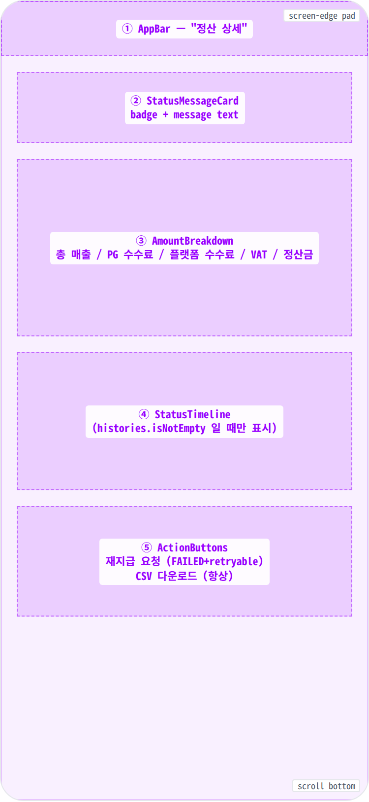

**Scaffold** ├─ **appBar**: AppBar(title: Text('정산 상세')) ← ① └─ **body** ├─ \[isLoading\] **Center** → **CircularProgressIndicator** ├─ \[error\] **Center** → error icon + title + message + retry button ├─ \[detail null\] **Center** → Text('정산 항목을 찾을 수 없습니다.') └─ \[data\] **\_DetailContent** └─ **SingleChildScrollView** └─ **MinglitContentLayout**(sectionGap: spacing-medium) ├─ **StatusMessageCard**(status) ← ② │ └─ Card → Row(SettlementStatusBadge + message Text) │ ├─ **AmountBreakdown**(detail) ← ③ │ └─ Card → Column │ ├─ "금액 내역" title │ ├─ \_Row('총 매출', '#,###원') │ ├─ \_Row('PG 수수료', '-#,###원') │ ├─ \_Row('플랫폼 수수료', '-#,###원') │ ├─ \_Row('VAT', '-#,###원') │ ├─ Divider │ └─ \_Row('정산금', '₩#,###', bold:true) │ ├─ \[histories≥1\] **StatusTimeline**(histories) ← ④ │ └─ Card → Column │ ├─ "처리 이력" title │ └─ \_TimelineItem × N (dot + status arrow + time) │ └─ **ActionButtons**(detail) ← ⑤ └─ Column(stretch) ├─ \[FAILED+retryable\] FilledButton.icon(재지급 요청) └─ OutlinedButton.icon(CSV 다운로드)

## Spacing & alignment rules

| # | Region | Alignment | Spacing |
|---|---|---|---|
| ① | AppBar | height 56px · 뒤로가기 포함 Material AppBar | 표준 AppBar. |
| — | MinglitContentLayout outer | column stretch · full-width scroll | 섹션 간: spacing-medium (16px) · 콘텐츠 h-pad: spacing-medium (16px) (body padding) |
| ② | StatusMessageCard | Row · badge + flex message | card inner pad: spacing-medium · badge↔text: spacing-sm (12px) |
| ③ | AmountBreakdown | column stretch · label/value 양 끝 정렬 | card inner pad: spacing-medium · title↔rows: spacing-sm · row v-pad: spacing-xsmall (4px) |
| ④ | StatusTimeline | column start · dot-timeline 패턴 | card inner pad: spacing-medium · item v-pad: spacing-xsmall2 (6px) · dot↔text: spacing-sm (12px) |
| ⑤ | ActionButtons | column stretch · 버튼 풀폭 | 버튼 간: spacing-small (8px) · 버튼 height: 48px |

## AppBar anatomy (①)

상단 56px AppBar — 좌측 뒤로가기 아이콘과 "정산 상세" 타이틀로 구성된 표준 Material 헤더. 뒤로가기 아이콘은 좌측 끝에서 spacing-xsmall만큼 안쪽에 배치되며, 타이틀은 그 우측에 spacing-small만큼 떨어져 정렬된다. 하단에 1px `color-divider` 라인이 그어져 본문 영역과 구분된다.

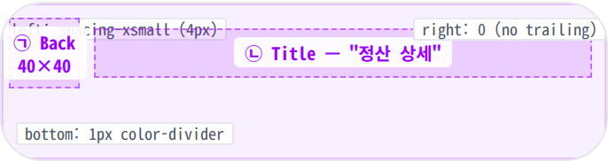

**AppBar**(height: 56) └─ Row(crossAxis: center) ├─ Padding(left: _spacing-xsmall = 4px_) │ ├─ _Back_ ← ㉠ │ └─ **IconButton**(arrow\_back\_ios, 22) — 40×40 hit zone │ · onTap → 정산 목록으로 복귀 │ └─ _Title_ ← ㉡ └─ **Text**('정산 상세', appBarTitle 스타일) · 좌측 정렬 · flex: 1 (남는 공간 흡수) · 좌측 가장자리에서 back hit zone 끝 + spacing-small(8) 떨어짐 _Bottom border:_ 1px solid _color-divider_ (하단 1px 라인) _Background:_ _color-background_ (light) / _color-dark-background_ (dark) _Trailing:_ 없음 (공유/기타 액션 슬롯 미사용)

| # | Region | Alignment | Spacing |
|---|---|---|---|
| — | AppBar 외부 | height 56 · 풀폭 | left: spacing-xsmall (4px) · right: 0 · bottom: 1px color-divider |
| ㉠ | Back | 좌측 정렬 · 40×40 hit zone | icon: 22 · 가장자리에서 4px 안쪽 |
| ㉡ | Title | 좌측 정렬 · flex grow | back↔title: spacing-small (8px) · 폰트: appBarTitle (18/600) |

## StatusMessageCard anatomy (②)

본문 첫 카드 — 좌측에 상태 배지(pill), 우측에 한 줄 안내 메시지가 가로로 배치된 정보 카드. 배지는 자기 너비만큼 차지하고 메시지는 남는 가로 공간을 모두 흡수한다. 배지 색상이 정산 상태(대기 / 확정 / 지급 중 / 지급 완료 / 보류 / 지급 실패 / 취소)에 따라 달라지며 메시지 텍스트도 함께 바뀐다.

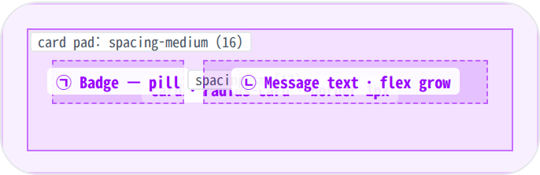

**Card**(radius: _radius-card = 16_, border: 1px _color-divider_) └─ **Padding**(_spacing-medium = 16_) └─ **Row**(crossAxis: center) ├─ _Badge_ ← ㉠ │ └─ **SettlementStatusBadge**(status, compact: false) │ · 자기 너비 · pill 모양 (radius-badge) │ · 8 status 별 bg/text 색 · CANCELED은 strikethrough │ ├─ **SizedBox**(width: _spacing-sm = 12_) │ └─ _Message_ ← ㉡ └─ **Expanded** → **Text**(상태별 안내문) · 한 줄 → 두 줄 자동 줄바꿈 (line-height 1.55) · 좌측 정렬 · bodyMedium _비고:_ 배지 너비는 라벨 길이에 비례 (가장 긴 "지급 완료" 기준 약 84px). 메시지가 길면 두 줄까지 늘어나며 카드 높이가 증가.

| # | Region | Alignment | Spacing |
|---|---|---|---|
| — | Card 외부 | 풀폭 · 자기 높이 | card pad: spacing-medium (16px) · radius: radius-card |
| ㉠ | Badge | 좌측 정렬 · 자연 너비 (flex 0) | height: 28 · h-padding: spacing-xsmall + spacing-sm · radius: radius-badge |
| — | Gap | — | badge ↔ text: spacing-sm (12px) |
| ㉡ | Message | 좌측 정렬 · flex grow (Expanded) | line-height 1.55 · 1–2 줄 가변 |

## AmountBreakdown anatomy (③)

금액 내역 카드 — "금액 내역" 타이틀 아래에 항목별 행이 세로로 쌓인다. 각 행은 좌측에 라벨(총 매출 · PG 수수료 · 플랫폼 수수료 · VAT), 우측에 금액이 양 끝 정렬로 마주본다. 마지막 정산금 행은 굵게 강조되며, 그 위에 1px 분리선이 들어가 합계 의미를 시각적으로 표현한다.

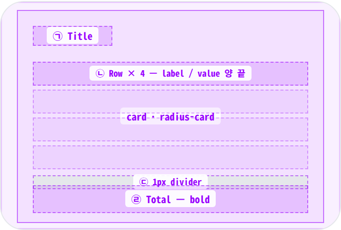

**Card**(radius: _radius-card_) └─ **Padding**(_spacing-medium = 16_) └─ **Column**(crossAxis: stretch) ├─ _Title_ ← ㉠ │ └─ **Text**('금액 내역', titleSmall · w700) │ ├─ **SizedBox**(height: _spacing-sm = 12_) │ ├─ _Rows × 4_ ← ㉡ │ ├─ **\_Row**('총 매출', '#,###') │ ├─ **\_Row**('PG 수수료', '-#,###', negative) │ ├─ **\_Row**('플랫폼 수수료', '-#,###', negative) │ └─ **\_Row**('VAT', '-#,###', negative) │ · 각 \_Row: Row(MainAxis.spaceBetween) │ label(left, secondary) ↔ value(right, primary) │ · 행 v-padding: _spacing-xsmall = 4_ │ ├─ _Divider_ ← ㉢ │ └─ **SizedBox**(height 1) · color-divider │ v-margin: _spacing-xsmall_ │ └─ _Total row_ ← ㉣ └─ **\_Row**('정산금', '₩#,###', bold: true) · label/value 모두 굵게 (w700) · value 앞에 ₩ 접두사

| # | Region | Alignment | Spacing |
|---|---|---|---|
| — | Card 외부 | 풀폭 · 자기 높이 | card pad: spacing-medium |
| ㉠ | Title | 좌측 정렬 | title↔rows gap: spacing-sm (12px) · w700 |
| ㉡ | Row × 4 | row · 양 끝 정렬 | v-padding: spacing-xsmall (4px) · 음수 값 색: color-error |
| ㉢ | Divider | 풀폭 · 1px | v-margin: spacing-xsmall |
| ㉣ | Total row | row · 양 끝 정렬 | label/value 모두 w700 · value 앞 ₩ |

## StatusTimeline anatomy (④)

처리 이력 카드 — 정산이 거쳐온 상태 전환을 위에서 아래로 시간순 정렬한다. 각 항목은 좌측의 작은 점(8px) + 그 점들을 잇는 1px 세로선 + 우측의 상태/시각 텍스트로 구성된다. 처리 이력이 하나도 없으면 카드 전체가 숨겨진다 (대기 상태에서 흔함).

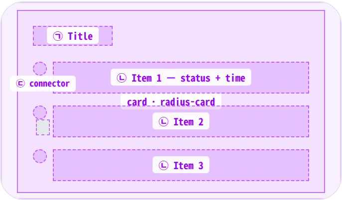

**Card**(radius: _radius-card_) └─ **Padding**(_spacing-medium = 16_) └─ **Column**(crossAxis: start) ├─ _Title_ ← ㉠ │ └─ **Text**('처리 이력', titleSmall · w700) │ ├─ **SizedBox**(height: _spacing-sm = 12_) │ └─ _Items × N_ (시간순) ← ㉡, ㉢ └─ **\_TimelineItem** └─ Row(crossAxis: start) ├─ **Container**(8×8 dot, color-primary) │ · margin-top: 5 (텍스트 첫 줄과 시각적 정렬) ├─ **SizedBox**(width: _spacing-sm = 12_) └─ **Column**(crossAxis: start) ├─ **Text**('PREV → NEXT', w600) └─ **Text**('MM/dd HH:mm', caption) _Connector ㉢:_ 항목 사이에 1px 세로선 (width 1, height 16) · color-divider · dot 중심 라인에 정렬됨

| # | Region | Alignment | Spacing |
|---|---|---|---|
| — | Card 외부 | 풀폭 · histories ≥ 1 일 때만 표시 | card pad: spacing-medium |
| ㉠ | Title | 좌측 정렬 | title↔items: spacing-sm (12px) |
| ㉡ | Item | row · crossAxis start (점이 첫 줄과 정렬) | v-padding: spacing-xsmall2 (6px) · dot↔text: spacing-sm (12px) · dot: 8×8 원 |
| ㉢ | Connector | dot 중심 라인 정렬 · 1px 세로선 | height: 16 · margin-left: 4 (dot의 절반) |

## ActionButtons anatomy (⑤)

본문 마지막 영역 — 풀폭 액션 버튼이 세로로 쌓인다. "재지급 요청"(filled · 강조) 버튼은 _지급 실패 + 재지급 가능_ 상태에서만 표시되며 그 외 상태에서는 "CSV 다운로드"(outlined) 버튼만 노출된다. 두 버튼이 같이 보일 때는 강조 버튼이 위에 놓이고, 아래쪽에 보조 버튼이 배치된다.

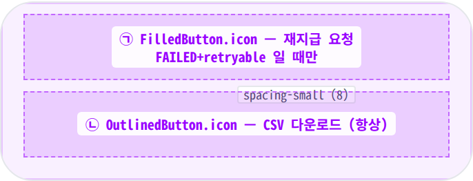

**Column**(crossAxis: stretch) ├─ \[FAILED + retryable\] _Primary CTA_ ← ㉠ │ └─ **FilledButton.icon** │ ├─ icon: **Icons.refresh** (18) │ ├─ label: **Text**('재지급 요청') │ ├─ height: 48 · radius: _radius-button = 12_ │ ├─ background: _color-primary_ (partner indigo) │ ├─ foreground: white │ ├─ icon↔label gap: _spacing-small = 8_ │ └─ onTap → 처리 중 (버튼 비활성화) → 응답 후 갱신 │ ├─ **SizedBox**(height: _spacing-small = 8_) │ └─ _Secondary CTA_ ← ㉡ └─ **OutlinedButton.icon** ├─ icon: **Icons.file\_download** (18) ├─ label: **Text**('CSV 다운로드') ├─ height: 48 · radius: _radius-button = 12_ ├─ background: _color-background_ ├─ border: 1px _color-divider_ ├─ foreground: _color-text-primary_ └─ onTap → CSV 다운로드 바텀시트 슬라이드 업 _비고:_ 재지급 버튼이 안 보이는 상태에서는 CSV 버튼이 홀로 첫 줄에 위치 (위쪽 spacing 동일).

| # | Region | Alignment | Spacing |
|---|---|---|---|
| — | Column 외부 | crossAxis stretch · 풀폭 | 버튼 간: spacing-small (8px) |
| ㉠ | Primary CTA — 재지급 요청 | 풀폭 · 가운데 정렬 · icon + label | height 48 · radius radius-button · icon↔label: spacing-small · 강조 — primary bg |
| ㉡ | Secondary CTA — CSV 다운로드 | 풀폭 · 가운데 정렬 · icon + label | height 48 · radius radius-button · 보더 1px color-divider |

🎨

## States

시각 변형 6종. baseline = COMPLETED, 나머지는 additive diff.

**State 종류 식별 기준**: 정산 상태(대기 / 확정 / 지급 중 / 지급 완료 / 보류 / 지급 실패 / 취소) + 데이터 도착 여부 + CSV 다운로드 바텀시트 노출 여부.

### Default · 지급 완료 (COMPLETED) 🎯 baseline · production

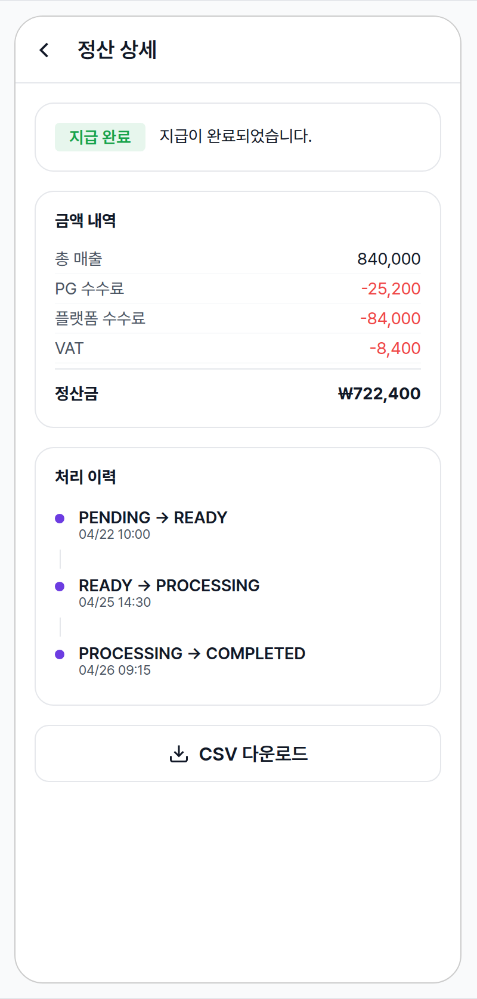

| 항목 | 내용 |
|---|---|
| 조건 | 지급 완료 상태 · 재지급 버튼은 보이지 않음 · 처리 이력이 1개 이상 존재. |
| 사용자 액션 | ① 뒤로 가기 → 정산 목록으로 복귀② CSV 다운로드 탭 → 다운로드 바텀시트 슬라이드 업③ 스크롤 → 카드 4종이 차례로 노출됨 |
| 에지케이스 | · 처리 이력이 비어있으면 처리 이력 카드 전체가 숨겨짐 (금액 내역 다음 바로 액션 버튼)· 정산금이 0원 또는 음수 → 그대로 표시. 디자인 의도: 비정상값도 가시화.· 다크 모드: 카드 bg color-dark-surface(#212121), 배지 색상은 약 10% 투명도 유지 |
| 컴포넌트 | · SettlementStatusBadge (compact:false · 8 status × bg/text color · CANCELED은 strikethrough)· StatusMessageCard (badge + text)· AmountBreakdown + 내부 _Row (label/value 양 끝 정렬, bold:true → 정산금)· StatusTimeline + 내부 _TimelineItem (8px dot + status arrow + timestamp)· OutlinedButton.icon (CSV 다운로드 — refresh icon)· MinglitContentLayout (sectionGap: spacing-medium)· Material Card wrapper (radius default) |
| 토큰 | · color: color-background, color-surface, color-primary (timeline dot · READY 배지), color-success (COMPLETED 배지), color-text-primary/secondary, color-divider (AppBar 하단 · 카드 border · OutlinedButton border)· radius: radius-card (16 · Card), radius-badge (4 · Badge), radius-button (12 · 버튼)· spacing: spacing-medium (16 · 섹션/카드 padding), spacing-sm (12 · badge↔message · title↔rows · timeline dot↔text), spacing-small (8 · 버튼 간격), spacing-xsmall (4 · amount row v-padding), spacing-xsmall2 (6 · timeline item v-padding)· typography: titleSmall (14/600 — 카드 타이틀), bodyMedium (14/400 — 일반 / 14/700 — 정산금 bold), labelSmall (11/600 — 배지 compact:true), bodySmall (12 — 타임스탬프), appBarTitle (18/600) |
| 노트 | 📝 가장 일반적 흐름. 다른 5개 state는 이 baseline에서 변경분만 표시. |

### 정산 대기 (PENDING) 이벤트 종료 후 정산이 확정되기 전 단계

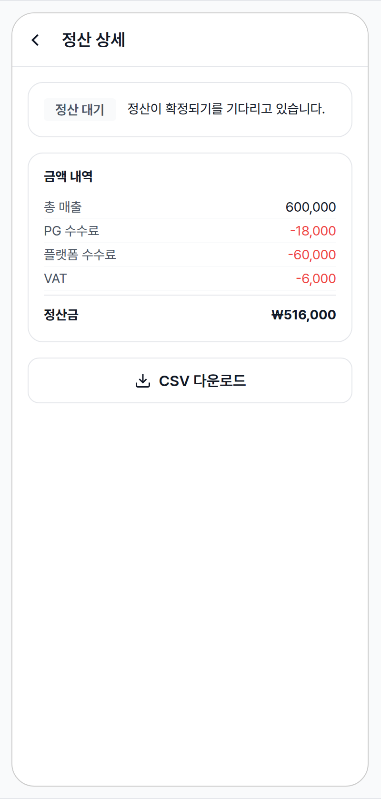

| 항목 | 내용 |
|---|---|
| 조건 | 정산 대기 상태이며 처리 이력이 아직 비어 있음. |
| 사용자 액션 | 동일 (진행 이력이 없으므로 이력 영역은 보이지 않음) |
| 에지케이스 | · 정산이 확정되는 시점에 자동으로 다음 상태로 넘어감. 화면이 자동으로 갱신되지는 않으므로 다시 진입해야 반영됨. |
| 컴포넌트 | ↔ Badge → "정산 대기" (PENDING styling — color-surface bg)− 처리 이력 카드 (histories 비어있음) |
| 토큰 | ↔ Badge bg/text → color-surface + color-text-secondary (PENDING styling) |
| 노트 | 📝 정산 lifecycle 첫 단계. timeline 없는 만큼 화면이 짧음. |

### 지급 실패 + 재지급 가능 (FAILED) 재시도 가능한 실패 상태

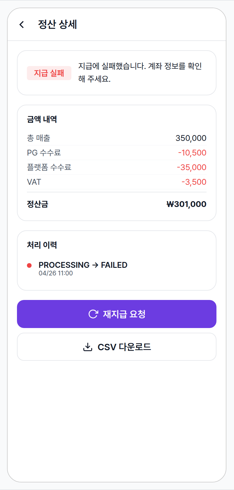

| 항목 | 내용 |
|---|---|
| 조건 | 지급 실패 상태이면서 재지급이 가능한 경우. |
| 사용자 액션 | + 재지급 요청 탭 → 처리 중 (버튼 비활성화) → 성공 시 안내 메시지 → 상태가 갱신되어 화면 다시 로드나머지 동일 |
| 에지케이스 | · 재시도가 불가능한 실패는 재지급 버튼이 보이지 않음 (CSV만 가능)· 식별자가 누락된 경우 재지급 버튼은 동작하지 않음 (비활성화 표시 권장)· 재지급 요청 중 네트워크가 끊기면 오류 안내 메시지가 노출되고 버튼이 다시 활성화됨 |
| 컴포넌트 | + FilledButton.icon (refresh icon · 재지급 요청 · primary bg)↔ Badge → "지급 실패" (FAILED styling — color-error bg/text)↔ Timeline dot 1개 → color-error (PROCESSING → FAILED 전환 표시)↔ Status message 텍스트 → "지급에 실패했습니다. 계좌 정보를 확인해 주세요." |
| 토큰 | + color-error (배지 bg/text · timeline dot · 메시지 강조)+ color-primary (FilledButton bg · "재지급 요청") |
| 노트 | 📝 ⚠️ 현재 모든 타임라인 dot이 primary 색으로 표시되어 있음 — 실패 전환 dot에 error 색 적용은 디자인 개선 권고 (구현 drift). |

### 보류 (HOLD) 지원센터 문의가 필요한 보류 상태

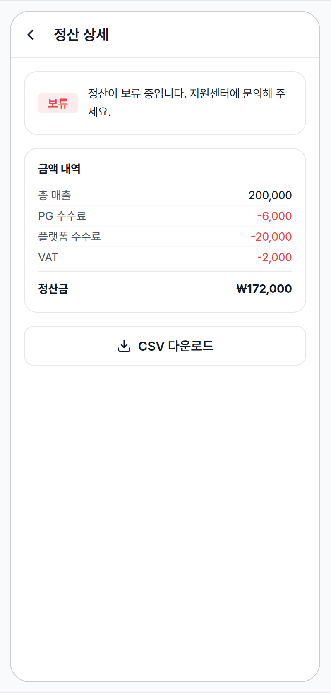

| 항목 | 내용 |
|---|---|
| 조건 | 운영팀에 의해 보류 처리된 상태 (분쟁 · 검증 등). 사용자 단독으로는 해소 불가. |
| 사용자 액션 | − 재지급 / 자동 갱신 모두 불가. CSV 다운로드만 가능. 지원센터 문의 안내가 노출됨. |
| 에지케이스 | · 보류 사유는 화면에 별도로 표시되지 않음 — 안내 문구가 일반적임 (향후 사유 표시 보강 후보). |
| 컴포넌트 | ↔ Badge → "보류" (HOLD styling — color-error bg + 약한 opacity)− 처리 이력 카드− FilledButton (재지급) |
| 토큰 | ↔ Badge bg → color-error + opacity (HOLD styling — FAILED와 시각적으로 구분되되 같은 위험군) |
| 노트 | 📝 운영-개입 상태. 사용자가 self-resolve 못 함 — 지원센터 contact가 유일한 path. |

### Loading 진입 직후 데이터 조회 중

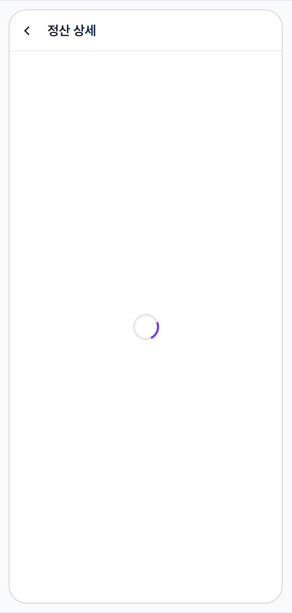

| 항목 | 내용 |
|---|---|
| 조건 | 화면 진입 직후 정산 상세 데이터를 받아오는 중. |
| 사용자 액션 | · 뒤로 가기만 가능 (목록으로 복귀)· 본문 영역의 모든 탭 무반응 |
| 에지케이스 | · 데이터 조회 실패 → 오류 상태로 전환됨· 진입 후 즉시 다른 화면으로 이동하면 도착한 결과는 무시됨 |
| 컴포넌트 | ↔ body (StatusCard / Amount / Timeline / Actions 4개 카드) → CircularProgressIndicator 단일 (Material 기본 · MinglitCircularProgressIndicator 미사용)− 모든 spec 컴포넌트 |
| 토큰 | − 카드/배지/timeline 토큰 미사용. 스피너만 color-primary + color-divider (track) |
| 노트 | 📝 AppBar는 유지 (back tap 가능). body만 spinner로 대체. |

### CSV 다운로드 바텀시트 임의 상세 화면 위에 띄워지는 모달

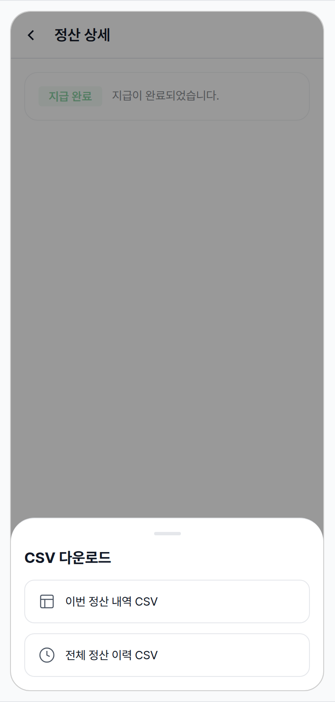

| 항목 | 내용 |
|---|---|
| 조건 | 지급 완료/대기/실패/보류 화면에서 "CSV 다운로드" 버튼을 탭한 직후. |
| 사용자 액션 | ① "이번 정산 내역 CSV" 탭 → OS 파일 공유 시트 / 저장 다이얼로그② "전체 정산 이력 CSV" 탭 → 동일하게 OS 공유 시트 (범위만 다름)③ 스크림 탭 / 아래 스와이프 → 시트 닫힘, 배경 화면 복귀 |
| 에지케이스 | · CSV 생성 실패 (서버 오류) → 오류 안내 메시지가 노출되고 시트는 닫힘· 매우 큰 데이터셋 (수만 행) → 별도 진행 UI 없이 곧바로 OS 공유 시트로 진입 |
| 컴포넌트 | + DownloadBottomSheet (Material showModalBottomSheet 기반)+ Scrim (반투명 검정 overlay · 배경 dim)+ _DownloadOption 행 2개 (icon + label) |
| 토큰 | + color-scrim (rgba(0,0,0,0.5) — Material default 일치)+ radius-dialog (28px — sheet top corners)+ spacing-medium (시트 padding · option 간격) |
| 노트 | 📝 별도 spec으로 분리 후보 (현재는 이 spec 안에서 다룸 — 스코프가 작아서). 향후 다른 화면에서도 재사용되면 분리. |

## AppBar — visual

56px 고정 AppBar. 좌측에 뒤로가기 아이콘, 그 우측에 "정산 상세" 타이틀. 배경 `color-background`, 하단 1px `color-divider` 라인. 다크 모드에서는 배경이 어둡게 전환되며 라인은 다크 디바이더 색으로 바뀐다.

※ 스크롤 동작과 무관하게 항상 고정. 스크롤 그림자 / elevation 변화 없음 — 1px 라인이 본문과의 분리만 담당.

## Status badge / Amount card — visual

상태 배지는 정산 lifecycle 7개 상태에 따라 색이 달라지는 pill. 같은 모양·크기·radius를 유지하며 배경/텍스트 색만 바뀐다. 취소 상태는 가로 취소선이 추가로 그어진다. 그 아래는 금액 내역 카드 — 항목별 행이 양 끝 정렬로 쌓이고 합계만 굵게 강조된다.

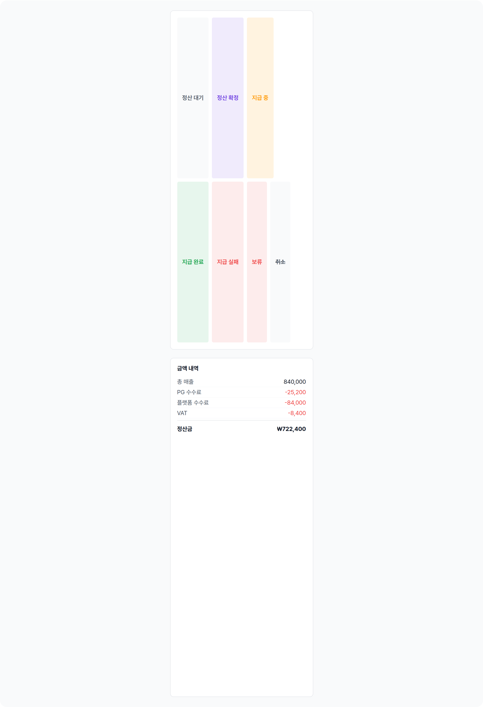

| Status | Visual | 의미 |
|---|---|---|
| 정산 대기 (PENDING) | 회색 배경 + 보조 텍스트 색 | 이벤트 종료 직후, 정산이 확정되기 전 |
| 정산 확정 (READY) | 파트너 보라 10% 틴트 + 보라 텍스트 | 정산 금액이 확정됨, 지급 대기 |
| 지급 중 (PROCESSING) | 주황 12% 틴트 + 주황 텍스트 | 송금이 처리되는 중 |
| 지급 완료 (COMPLETED) | 초록 10% 틴트 + 초록 텍스트 | 정산금이 계좌에 입금됨 |
| 지급 실패 (FAILED) | 빨강 10% 틴트 + 빨강 텍스트 | 송금 실패, 재지급 가능 시 강조 버튼 노출 |
| 보류 (HOLD) | 빨강 10% 틴트 + 빨강 텍스트 | 운영 개입 — 분쟁/검증 등으로 일시 정지 |
| 취소 (CANCELED) | 회색 배경 + 가로 취소선 | 정산 자체가 취소됨 |

🔄

## Global Behavior

cross-cutting — 모든 state에 적용되는 액션, motion, 글로벌 에지케이스. 각 state 한정 액션은 위 mini-table 참고.

## Cross-cutting interactions

| 사용자 액션 | 화면에 보이는 결과 |
|---|---|
| 뒤로 가기 (시스템 back / AppBar back) | 정산 목록으로 복귀. 진행 중인 데이터 조회는 취소됨. |
| 다크 모드 토글 | 카드 bg → color-dark-surface(#212121). 배지 bg는 각 상태 색상의 약 10% 투명도로 자동 조정. 정산금 텍스트 → color-dark-text-primary(#fff). CSV 버튼 테두리 → color-dark-divider(#3d3d3d). |
| 금액 포맷 (모든 state 공통) | 모든 금액은 천 단위 콤마. 정산금은 ₩ 접두사 포함. 음수 값은 - 접두사로 표시. |

## Motion timing

Source: `shared/packages/mds/core/lib/src/theme/minglit_design_tokens.dart`

| Transition | Token / Duration | Notes |
|---|---|---|
| 화면 진입 (목록 → 상세) | MinglitAnimation.fast (200ms) | GoRouter 기본 좌→우 slide. 진입 직후 fetch 시작. |
| Loading → 데이터 표시 | cut (no animation) | data fetch 완료 시 즉각 표시. fade 없음. |
| CSV 바텀시트 in/out | MinglitAnimation.medium (350ms) | Material 바텀시트 slide-up + scrim fade-in. |
| 재지급 요청 처리 중 | 서버 응답 대기 | 버튼만 비활성화 (전체 오버레이 없음). 응답 후 즉시 갱신. |

## Global edge cases

-   **취소 상태** — 보류와 별도. 배지 텍스트에 취소선 스타일이 적용되며 "정산이 취소되었습니다." 메시지가 노출됨. CSV만 가능. (위 6개 state에는 미포함 — 발생 빈도가 낮은 운영 경로)
-   **데이터 조회 실패** — 오류 상태로 진입하며 일반 오류 메시지 + "다시 시도" 버튼이 노출됨.
-   **금액 음수/0원** — 그대로 표시. 비정상값도 가시화하는 의도.

📖

## Reference

implementation source + 인접 화면. Components / Tokens는 위 mini-table 참고.

## Implementation source

| Widget | SettlementDetailPage + _DetailContent — apps/app_partner/lib/src/features/settlement/settlement_detail_page.dart |
|---|---|
| Route | SettlementDetailRoute · /settlement/:settlementId · app_routes.dart |
| Provider | partnerSettlementDetailProvider(settlementId) · currentPartnerInfoProvider (재지급 요청 guard) |
| Repository | partner_settlement_repository — settlement status enum 정의 (PENDING / READY / PROCESSING / COMPLETED / HOLD / FAILED / CANCELED) |
| Status component | SettlementStatusBadge — 8 status × bg/text color, CANCELED은 strikethrough |
| Sub-component | DownloadBottomSheet — Material showModalBottomSheet 기반 (state 6에서 사용) |
| Layout helper | MinglitContentLayout (sectionGap: spacing-medium) — 섹션을 Column으로 배치 |
| ⚠️ 알려진 drift | FAILED timeline dot 색상 — spec은 color-error이나 현재 Dart 소스는 모든 dot을 color-primary로 표시. 디자인 개선 권고. |

## Related screens

| Spec | Relation |
|---|---|
| PartyCreateWizardPage | 이 정산의 원천인 파티를 생성한 화면. 파트너 앱 동선의 상류. |
| EventDetailPage | 이 정산의 매출이 발생한 이벤트를 사용자가 보는 화면. 데이터 생산 지점. |
| Layout foundations | Standard Scaffold + SingleChildScrollView. 탭바 없음 — 단독 상세 scaffold. |